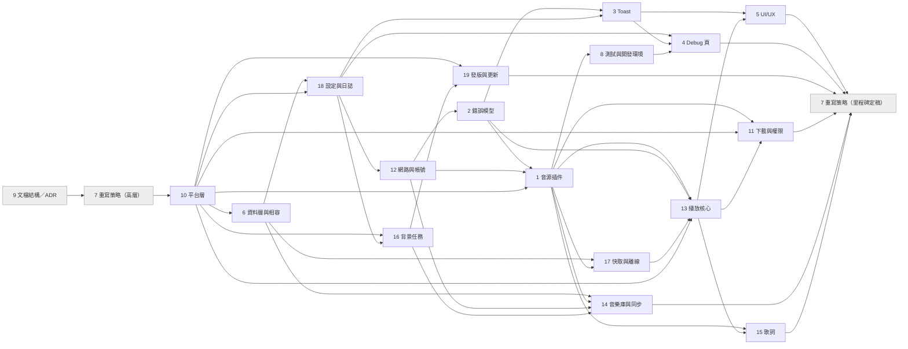

# 階段二計畫：設計項目的依賴關係與順序

> 順序已於 2026-09-27 確認，逐項以 trellis-brainstorm 展開。每一項展開時都會先研究（官方文檔、其他播放器的做法），
> 本文的「初步傾向」只是起點，不是結論。

依據：parent `prd.md` 階段二第 1–18 項、`docs/audit/questions.md` 的勾選（2026-09-27）。

## 1. 設計項目

prd 的 18 項，加上從你的勾選裡長出來、需要獨立決定的兩項（19、20）。
第 8 項擴大為「測試、閘門與開發環境」，因為 U9（開發版資料隔離）與「單一實例妨礙實機測試」屬於同一件事。

| # | 項目 | 主要回答的 questions.md 項 |
|---|---|---|
| 1 | 音源插件化（含能力宣告、僅元資料／歌詞源分類、匹配流程） | G3、E5、B3、B11、B14 |
| 2 | 統一錯誤模型（含重試、退避、限流責任歸屬） | G4、G5、C5、C6、D5、D10 |
| 3 | 統一 Toast 與錯誤歷史 | G9 |
| 4 | Debug 頁 | J2、J3、J4 |
| 5 | UI／UX 設計系統與響應式、桌面播放器版面方案 | U1–U8、E20 |
| 6 | 資料層選型與資料相容（migration） | A2、A3、A4、B6、G6、M3、M4 |
| 7 | 重寫策略（全新 vs 逐步、里程碑、分支、舊版 hotfix） | N1 hotfix 已選「重寫時處理」 |
| 8 | 測試、閘門與開發環境 | §10 全部、U9、E18 的開發測試問題 |
| 9 | 文檔結構與 ADR／CONTEXT.md 去留 | §14、§15 |
| 10 | 平台策略與平台層 | A1、§8 全部、C7 |
| 11 | 下載與權限 | N1–N11、B13 |
| 12 | 網路層與帳號認證 | M1–M13、C1–C4、B4 |
| 13 | 播放核心 | A5、D1–D10、E13、E12、E19 |
| 14 | 音樂庫與同步 | B1、B2（已定）、B12、E4、E7 |
| 15 | 歌詞 | B5、E9–E11 |
| 16 | 背景任務 | B10、B12 |
| 17 | 快取與離線 | B6 |
| 18 | 設定與日誌基礎設施 | C2、J3 |
| 19 | 發版與應用內更新（新增） | A6、B7–B9、E17 |
| 20 | 功能凍結待辦（新增，不設計，只記錄） | 均衡器、響度平衡；B 站 geetest 驗證互動（ADR 0013） |

## 2. 依賴關係

箭頭 A → B 表示「B 的設計要用到 A 的結論」。

## 3. 建議順序

| 順序 | 項目 | 為什麼排這裡 |
|---|---|---|
| 1 | 9 文檔結構／ADR 去留（✅ 完成，見 `archive/2026-09/09-27-design-docs`） | 之後每一項都會產出 ADR；先定 ADR 放哪、舊 ADR 與 CONTEXT.md 怎麼處理。輕量，一次就能定。 |
| 2 | 7 重寫策略（高層）（✅ 完成，ADR 0008；里程碑留到第 20 步定稿） | 「全新專案 vs 在舊碼上逐步替換」決定資料遷移、分支與每個里程碑的形狀。這裡只定方向，里程碑到最後才拆。 |
| 3 | 10 平台層（✅ 完成，ADR 0009） | 資料目錄、音訊後端、登入方式、更新方式都要問「平台宣告了什麼能力」。 |
| 4 | 6 資料層與相容（✅ 完成，ADR 0010） | 選型（A2）與舊資料自動遷移（A3）是最早的里程碑。 |
| 5 | 18 設定與日誌（✅ 完成，ADR 0011） | 設定存放依賴資料層；日誌與遮蔽函式是網路層的前提。 |
| 6 | 12 網路與帳號（✅ 完成，ADR 0012） | HTTP client、憑證、「哪些請求帶憑證」的單一宣告點。 |
| 7 | 2 錯誤模型（✅ 完成，ADR 0013） | 音源插件介面的回傳與例外型別要先定。 |
| 8 | 1 音源插件（✅ 完成，ADR 0014） | 核心抽象；依賴 10、12、2。 |
| 9 | 8 測試與開發環境（✅ 完成，ADR 0015） | 契約測試、fixture 錄製綁在插件介面上，所以緊接在 1 後面。 |
| 10 | 17 快取與離線 | 串流 URL、圖片、排行快取的策略，播放核心要用。 |
| 11 | 16 背景任務 | 刷新、清理、更新檢查誰來排程。 |
| 12 | 13 播放核心 | 最大的一塊；依賴 1、2、10、17。 |
| 13 | 14 音樂庫與同步 | B1／B2 已定方向，細節依賴 6、1、12、16。 |
| 14 | 11 下載與權限 | 依賴播放核心的本地播放路徑。 |
| 15 | 15 歌詞 | 依賴 1、13。 |
| 16 | 19 發版與更新 | 依賴 10、16；你已給出流程要求。 |
| 17 | 3 Toast | 依賴 2、18。 |
| 18 | 5 UI／UX | 設計系統與桌面播放器版面方案（2–3 個讓你選）。 |
| 19 | 4 Debug 頁 | 把 18、3、8 的成果收成正式工具。 |
| 20 | 7 重寫策略（里程碑定稿） | 所有設計確定後拆成可獨立驗證的里程碑與 child task。 |

## 4. 你在 questions.md 直接問的問題

**Mix 模式「無法播放的歌不自動跳過」是什麼？**
一般佇列裡某首歌被下架或不可用時，程式會提示並自動跳下一首；但這個判斷寫死只在「普通佇列」模式生效
（`lib/services/audio/audio_provider.dart:1955` 的 `mode == PlayMode.queue`），Mix 模式遇到同樣情況會停下並報錯。
你沒遇到過，是因為要剛好在 Mix 裡碰到不可用的影片。傾向：新設計裡兩種模式同樣處理。

**iOS 能不能用 GitHub 發佈？**
可以放 IPA 檔在 GitHub Release，但 iOS 不能像 Android 那樣直接安裝：一定要簽名。常見途徑是
AltStore／SideStore 這類側載工具（免費 Apple ID 簽的 App 需要定期重簽），或付費開發者帳號走 TestFlight／App Store
（後者有下載功能與非官方 API 的審核風險）。以上是一般做法，細節（期限、數量上限、歐盟替代商店）在第 10、19 項查官方來源確認。
傾向：iOS 暫定「GitHub 放未簽名 IPA＋側載」，等你有 iPhone 再決定。

**單一實例會不會妨礙開發時實機測試？**
會，現在開發版和正式版搶同一個 mutex 與同一份資料。傾向：開發版用不同的實例名稱與獨立資料目錄（U9 你已勾選），
兩者可以同時開，也不會再動到你的真實資料。放在第 8 項。

**均衡器、響度平衡做得到嗎？**
桌面（media_kit／libmpv）大致可以：media_kit 能在執行期設定 mpv 屬性（context7 查到 `Player.setProperty`），
mpv 的音訊濾鏡可以做等化與響度正規化。Android 端（just_audio）的支援範圍這次文檔沒查清楚，放在第 13 項確認。
不過這兩個是**新功能**，依「功能凍結」先記進第 20 項待辦，重寫完成後再做；第 13 項設計播放核心時會預留接口的可行性判斷。

**static-rule 是什麼、有沒有用？**
是一種「讀原始碼文字、用正則檢查」的測試，例如「`isar.` 只能出現在 repository 資料夾」「`audio_provider.dart` 不得超過 N 行」。
它守的是程式碼寫法，不是 App 行為。優點是便宜；缺點是只比對字串，容易漏（例如音源分支預算寫 9 處，實際有 50 處）或誤報。
傾向：重寫後大部分改用 Dart analyzer 的 lint 或 import 規則（更準），只保留少數無法用 lint 表達的，放在第 8 項。

**測試要不要打真實 API？**
傾向和你的想法一致：預設測試零聯網（用錄下來的真實回應當 fixture）；真實 API 的檢查放在 Debug 頁的「音源健康檢查」
與一組需明確指定才跑的冒煙測試，不進 CI（CI 機房 IP 容易被擋，而且很多功能要登入）。保留的測試只守「契約與行為」，
不守實作細節。放在第 8 項。

**應用內更新流程**（你已給出要求，第 19 項照此設計）：
不在啟動或定時檢查，只有手動檢查；檢查到後由你點「下載」；下載完成後可選「安裝」或「刪除」；點安裝才安裝；
重啟後清除舊安裝包。Release 維持自動發布，發佈說明由 CHANGELOG（或 commit 訊息）自動產生，不手寫。

## 5. 各「不確定」項的初步傾向

展開到該項時會先研究再給正式方案；這裡讓你先看方向。

| 項 | 初步傾向 | 在哪一項定案 |
|---|---|---|
| A2 資料層 | 傾向換到 SQLite 系（例如 drift）：資料本來就是關聯式、靠手動 id 維護；5 平台成熟；migration 可測。舊 Isar 只留在一次性遷移模組裡讀舊資料 | 6 |
| A3 資料相容 | 你選「全部自動遷移」：首次啟動讀舊 Isar、舊 secure storage、掃描舊下載目錄，轉進新格式；舊備份檔可匯入 | 6 |
| A4 資料位置 | 安裝版放系統的 App 資料目錄（Windows 是 AppData）；免安裝（Portable）版放程式旁邊的資料夾——你說得對；第一版不提供自訂位置；舊 `Documents\FMP` 自動搬 | 6、10 |
| A5 音訊後端 | 維持「一個播放介面、每平台一個實作」的形狀；至於 Android 用 just_audio 還是全平台統一 media_kit，要看背景播放、均衡器、Linux 支援再比較 | 13 |
| A6 iOS | 見 §4 | 10、19 |
| B3 網易 `X-Real-IP` | 推測是為了繞過地區限制；先實測拿掉會不會壞，需要就保留但寫明在網易音源裡、附理由 | 1 |
| B4 B 站自動換 cookie | 保留（B 站要求定期刷新才能維持登入），但在帳號頁顯示最後刷新時間與結果 | 12 |
| B5 AI 歌詞 | 保留、預設關；強制 https；payload 不寫進 log；送出的欄位最小化並在設定頁列出 | 15 |
| B6 串流 URL 存 DB | 不存進資料庫，只放短期快取 | 17 |
| B7–B9 更新 | 依你的流程；安裝檔一律驗 SHA-256；免安裝版的自我覆蓋改成更穩的做法 | 19 |
| B10 每 15 秒 DNS 偵測 | 拿掉，改用系統的網路狀態 API 加「請求失敗才判定離線」 | 16 |
| B11 B 站 buvid | 保留（匿名請求需要，否則容易被風控），收在 B 站音源內 | 1 |
| B12 停用音源仍抓排行 | 停用就不抓 | 16 |
| B13 下載附帶檔案 | 保留，另外把資訊寫進音檔內嵌標籤（N6） | 11 |
| B14 YouTube 取帳號名 | 保留，收在 YouTube 音源的登入流程裡 | 1、12 |
| C1–C7 | 全部在重寫時修正（你已勾） | 12、18 |
| M 全部 | 依你的方向：登入由音源插件提供、介面自適應；「用登入狀態」開關對每個音源語意一致、涵蓋排行等所有讀取請求（可能改名）；憑證只有一份來源；migration 不得改使用者設定值；讀不到憑證時不刪；依登入狀態選音質由音源決定 | 12、1 |
| N2–N11 | 改用成熟套件（權限、背景下載）；Android 下載路徑可改並可重新授權；續傳驗證 If-Range／ETag；下載專用音質；副檔名照實際格式；失敗任務保留到使用者清除；權限統一入口 | 11 |
| D3 Mix 不跳過 | 與佇列一致，自動跳過 | 13 |
| D4 網易試聽片段 | 標示「試聽」並依設定跳過，不當完整歌曲播 | 1、13 |
| D5 限流 | 網路層統一做指數退避加隨機抖動、每音源限速；播放時多次失敗才跳過並提示 | 2 |
| D6 播放紀錄 | 維持（你說這是你要的） | 13 |
| D8 電台打斷音樂載入 | 開電台時取消正在載入的音樂 | 13 |
| D9 YouTube URL 期限 | 讀網址裡的 `expire`，不寫死 1 小時 | 1、17 |
| D10 電台錯誤顯示成未開播 | 區分「未開播」與「查詢失敗」 | 2、13 |
| E6 帳號登入 | 保留（已確認；原勾選的方括號沒閉合，已修正） | — |
| E18 托盤／快捷鍵等 | 保留，擴到所有桌面平台 | 10 |
| E19 均衡器、響度 | 新功能，記進待辦 | 20 |
| E20 使用者指南頁 | 傾向刪除，改成 README／docs 裡的說明連結；你也可以選優化 | 5 |
| §8 平台功能 | 以「各平台體驗一致」為目標：托盤、快捷鍵、開機自啟、歌詞視窗、標題列、單一實例開到所有桌面平台；系統媒體控制全平台；應用內更新 iOS 除外；登入 WebView 不可用的平台改 QR 或貼 cookie；CJK 字型依平台 fallback，Linux 視情況內建 | 10 |
| §10 測試 | 見 §4 | 8 |
| J2–J4 | Debug 頁重做成正式工具；log 寫檔保留並加輪替與保留期限；資料檢查／修復收進 Debug 頁 | 4、18 |
| §14 ADR | 0001 字串音源 id：確認；每源設定清單：由新設計取代。0002、0007：看 A2，換庫就「不再適用」。0003、0004：在 13、11 重新決定。0005 分 P 以 cid 區分：確認（也是舊資料遷移要用的格式）。0006 自動發布：確認，並補上 CHANGELOG 產生說明 | 9 |
| §15 CONTEXT.md | 5 個術語的內容（憑證只在解析串流時用、媒體請求不帶憑證）是對的原則，併進第 12 項的網路規範；術語本身隨新設計改名，CONTEXT.md 在階段三刪除 | 9、12 |

## 6. 已確認（2026-09-27）

- 順序照 §3。
- 其餘「不確定」項以 §5 的初步傾向為方向，展開時研究後再定案。
- D3：Mix 與普通佇列統一處理，不可播放就自動跳過。
- iOS：GitHub Release 發佈 IPA，供側載。
- static-rule：重寫後改用 Dart analyzer 的 lint 規則。

## 7. 第一個里程碑的必要驗證（各項設計累積）

- ADR 0010：`isar_community`＋`sqlite3` 原生庫在 Android、Windows 共存；`sqlite3` 的 Android 16KB page size 對齊。
- ADR 0009：CI 建置矩陣含 Linux、macOS、iOS（不簽名）。
- ADR 0008：`app/` 的 App 身分識別與舊版一致（開發版除外）。
- ADR 0011：log 門面與遮蔽函式是第一個里程碑的基礎，含遮蔽測試。
- ADR 0014：JS 執行環境（`flutter_js`）與宿主 API 最小集合；以「從檔案安裝」載入第一個腳本音源；`flutter_js` 在 Android、Windows 的 Promise／記憶體／啟動成本實測；YouTube.js 可行性驗證（有時限，失敗則 YouTube 暫以 Dart 實作）。
- ADR 0015：`fmp_lints` 接上 `app/`，`dart analyze` 看得到插件診斷且接線哨兵會紅（比對 `flutter analyze`）；契約執行器能否在 `flutter test` 內載入 QuickJS（不行改用桌面 `integration_test`）；dev 與 prod flavor 同時開啟時 AppUserModelID、單一實例鎖、資料目錄各自獨立；零聯網兩道防線（故意聯網的測試被跳過、解除 tag 後被 `HttpOverrides` 擋下）。

## 8. 延後到特定里程碑的實測

- ADR 0012：YouTube App 內網頁登入（桌面 UA）是否仍可用——第一個加入 YouTube 登入的里程碑先實測；不可用則只提供貼上 cookie。
- ADR 0012：Linux 沒有 keyring 時 secure storage 的行為——Linux child task。

## 9. 功能凍結的例外與里程碑規劃備忘

- 腳本插件（ADR 0014）由擁有者明確納入重寫範圍（2026-09-27），是功能凍結的唯一例外。
- 建立 `1morr/fmp-plugins` repo、其 CI 與 `index.json`、App 插件頁與首次啟動引導：排入里程碑規劃（第 20 步）；第一個里程碑不需要。

## 10. 目前進度與下一步（交接用，2026-09-27）

- 分支：`docs/audit`（draft PR #173）。所有設計決定以 ADR 為準：`docs/adr/0008`–`0015`；舊 ADR 0001–0007 仍描述根目錄舊專案。
- 已完成（依 §3 順序）：9 文檔結構 → 7 重寫策略（高層）→ 10 平台層 → 6 資料層 → 18 設定與日誌 → 12 網路與帳號 → 2 錯誤模型 → 1 音源插件 → 8 測試與開發環境。
  每項的 prd／design／research 在 `.trellis/tasks/archive/2026-09/09-27-design-*`。
- **進行中：第 17 項「快取與離線」**，task `.trellis/tasks/09-27-design-cache-offline/`（planning）；研究代理寫到 `research/`（`current-state.md`、`prior-art.md`、`packages-and-platform.md`），三個檔齊了才代表研究完成。
- 之後順序：16 背景任務 → 13 播放核心 → 14 音樂庫與同步 → 11 下載與權限 → 15 歌詞 → 19 發版與更新 → 3 Toast → 5 UI/UX → 4 Debug 頁 → 7 里程碑定稿。
- 每項固定流程：建 child task（`task.py create --parent .trellis/tasks/09-26-fmp-rewrite --no-start`）→ 派研究子代理（sonnet，寫進 task 的 research/）→ 核對關鍵事實 → prd → 一次一問（附建議與取捨）→ design＋implement → 最終摘要 → 使用者「核准」後 `task.py start`、寫 ADR（`docs/adr/template.md`）、更新本檔 §3 標記完成、`task.py finish`＋`archive --no-commit --skip-branch-validation`、commit＋push。
- 使用者偏好：全程繁中；多數細節「按推薦」，但每項仍需最終摘要與明確核准；Mermaid 圖需以 mermaid-cli 實際渲染（子圖標題含全形括號要用 `id["標題"]`）。
