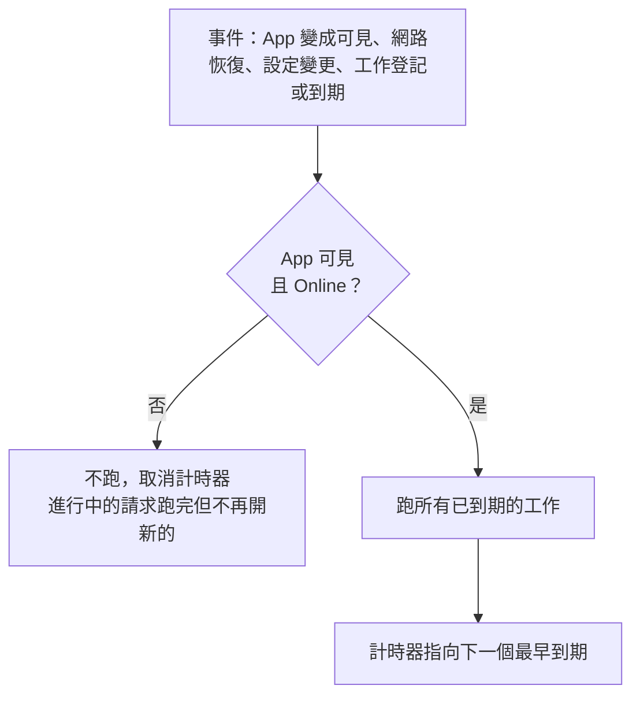

# 設計：背景任務

## 1. 範圍：什麼算背景任務

**會發網路請求、按時間重複做的工作**才歸本設計的排程器管：

| 工作 | 間隔來源 |
|---|---|
| 首頁排行刷新 | 使用者設定 |
| 匯入歌單自動刷新 | 每張歌單各自設定 |
| 電台直播狀態 | 使用者設定 |
| 收聽電台時的直播間資訊 | 固定 1 分鐘，只在收聽中 |

其他工作不進排程器，各有歸屬：

- 播放位置檢查與存檔：本機、播放需要，第 13 項。
- 下載排程與進度：事件驅動，第 11 項（舊版每 5 秒的備援輪詢不帶過去）。
- 快取淘汰：寫入時觸發（ADR 0016）；log 輪替：寫入時觸發（ADR 0011）。
- 更新檢查與插件更新：只手動（第 19 項、ADR 0014）；B 站 Cookie 刷新：第 12 項（B4）。
- DNS 偵測：刪除（B10、ADR 0016）。
- 評論自動翻頁：純 UI 動畫，留在元件內。

一次性的啟動維護工作（例如舊更新檔清理、下載狀態整理）登記在同一個「啟動維護清單」，第一個畫面出來後依序跑一次，細節由各自的設計項定。

## 2. 排程器

- 一個 `BackgroundScheduler`，在 service 層，是週期工作的**唯一擁有者**。功能只登記工作，不自己開計時器。
- 工作宣告：id、所屬插件（可空）、間隔（`Duration?`，空＝關閉）、執行函式。所有登記的工作都需要網路。
- 每個工作的「上次成功時間」存資料庫（重啟後照算，例如歌單的 24 小時不會因重開 App 而重新起算）。下次到期＝上次成功＋間隔。
- 只用**一個計時器**，指向最早到期的工作；到期就跑、跑完重算。沒有工作時不留計時器。

## 3. 何時跑（已決定 A：看不見就暫停，全平台一致）

- 「可見」＝`AppLifecycleState.resumed` 或 `inactive`（桌面視窗失焦仍算可見）。`hidden`（桌面最小化、縮到托盤）與 `paused`（手機背景）都暫停。
- 網路狀態取自 ADR 0016 的 `Online`／`NoInterface`／`Unreachable`，只有 `Online` 會跑。
- App 啟動就是一次「變成可見」：先顯示快取（ADR 0016），再跑已到期的工作。不需要另設「開 App 時刷新」開關。
- 不用 `workmanager`：手機背景的刷新不可靠且要另開 JS 執行環境，桌面不支援。

## 4. 並行、失敗與取消

- 全域同時最多 2 個工作；同一個插件的工作依序執行。網路層的每插件併發上限與最小請求間隔照常生效（ADR 0013）。
- 匯入歌單一次刷一張（沿用舊版，避免對同一平台連發）。
- 失敗：網路層已依策略重試（ADR 0013）。排程器對仍失敗的工作退避：1、2、4…分鐘，上限為該工作的間隔。`RateLimited` 帶 `retryAfter` 時以它為準。
  連續傳輸失敗會讓網路狀態轉成 `Unreachable`，恢復時到期的工作補跑。一套退避，取代舊版五套。
- 手動刷新（下拉、按鈕）立即跑該工作，不看間隔；離線時顯示離線狀態，不送出（ADR 0016）。
- 取消：插件停用或移除、榜單在首頁停用（B12）、歌單改成不啟用、間隔設為關閉時，立即移除工作；以代際檢查丟掉已過期的結果，不寫回狀態。

## 5. 使用者設定

| 設定 | 選項 | 預設 | 變更 |
|---|---|---|---|
| 排行刷新間隔 | 30／60／120／240 分、關閉 | 60 分 | 新增「關閉」（只手動刷新）；舊版不能關 |
| 電台狀態刷新間隔 | 關閉／1／3／5／10 分 | 5 分 | 不變 |
| 匯入歌單自動刷新（每張） | 1／6／12／24／48／72／168 小時、不啟用 | 新匯入 24 小時 | 不變 |

舊設定的值由舊資料匯入原樣帶入（語意相同，ADR 0010「不改使用者設定過的值」）。

## 6. 閘門

- 單元測試（假時鐘、假生命週期、假網路狀態）：
  - 看不見時不跑，回到可見時到期的工作各跑一次；
  - 離線時不跑，恢復後補跑；
  - 只有一個計時器；
  - 手動刷新不看間隔；
  - 移除或停用後不再跑，且過期結果被丟掉；
  - 退避序列與 `retryAfter`；
  - 上次成功時間重啟後仍生效。
- lint `fmp_periodic_timer_owner`：`Timer.periodic`、`Stream.periodic` 只准出現在排程器與播放核心模組（清單由第 13 項定），取代舊 `periodic_timer` static-rule 的登記表。
  規則依 ADR 0015 的方式寫雙向變異測試，加入 `fmp_lints`。
