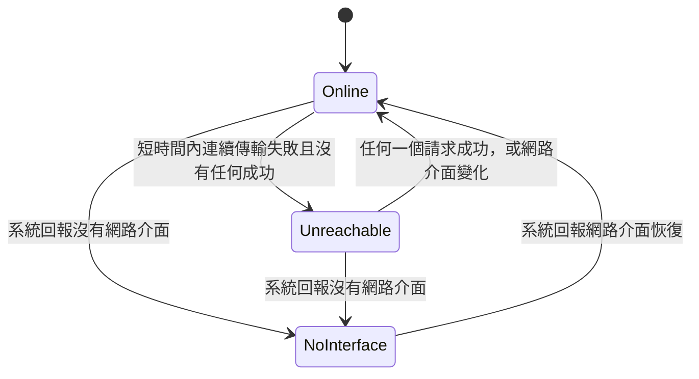

# 設計：快取與離線

## 1. 什麼是快取

- **快取＝可以隨時丟、丟了只會變慢的東西**：圖片、歌詞內容、排行、串流網址。
- **不是快取**（放主資料庫或各自的位置，不受快取上限與「清除快取」影響）：音樂庫與歌單、下載檔、播放與搜尋歷史、歌詞匹配結果（ADR 0014）、
  插件 storage 與憑證、設定。
- 磁碟快取一律放在平台層提供的快取目錄（`getApplicationCacheDirectory()` 之下的 `fmp/`；開發版依 ADR 0015 另有目錄），**不進主資料庫**（B6 的原則推廣到所有快取）。
- Android 系統在空間不足時可能清掉快取目錄：索引指向的檔案不存在就當作未命中並刪掉索引，不當錯誤。

## 2. 統一快取庫（磁碟）

- 一個快取模組擁有快取目錄：一個小的 drift 索引（`cache.db`，與主資料庫分開）加上檔案。
  索引欄位：鍵、類別（image／lyrics／charts）、所屬插件 id、大小、最後存取時間、期限（可空）。
- **一個總上限**（已決定 A）：寫入後超過上限，就不分類別依最後存取時間淘汰；啟動時也檢查一次。
- 移除插件時刪掉它的快取項目（與 ADR 0014 清除 storage 一致）。
- 「清除快取」＝清空索引與檔案，並清掉 Flutter 記憶體 `ImageCache`。
- 快取目錄只由快取模組存取：`path_provider` 只在平台層（ADR 0009），平台層只把快取目錄交給快取模組，由 lint `fmp_layer_imports` 的依賴表守（ADR 0015）。

## 3. 各類快取

| 類別 | 鍵 | 期限 | 備註 |
|---|---|---|---|
| 圖片 | 實際請求的 URL | 無（只靠 LRU） | 經 ADR 0012 媒體 client（不帶憑證，套用插件宣告的媒體標頭）。插件 DTO 的封面是多尺寸清單 `artwork: [{url, width?}]`，宿主依顯示尺寸挑最接近且不小於的一張；同一 URL 只存一份，縮放在解碼時做（`cacheWidth`／`ResizeImage`） |
| 歌詞內容 | 歌詞插件 id＋歌詞 id | 無（內容不變） | 匹配結果存主資料庫，所以快取被淘汰後直接用存下的 id 重抓，不重新匹配 |
| 排行 | 插件 id＋榜單 id | 無（由刷新覆蓋） | 先顯示快取並標「更新於 …」，背景刷新後替換；只抓已啟用插件且在首頁啟用的榜單（B12），停用就刪掉它的快取。刷新排程由第 16 項定 |
| 串流網址 | 見 §4（只在記憶體） | 插件回報 | — |

- 圖片接法：`cached_network_image` 接受自訂 `BaseCacheManager`；以 `flutter_cache_manager` 的 `Config`（自訂 `CacheInfoRepository`＋`FileService`）接到統一快取庫與媒體 client。
  落地時驗證；接不起來就讓圖片保留它自己的索引，由統一淘汰器依檔案大小一起淘汰（總上限的語意不變）。
- Flutter 記憶體 `ImageCache` 的大小由平台層宣告（沿用舊值：行動 100 張／50MB、桌面 200 張／80MB），不給使用者調。
- 不做通用 HTTP 回應快取（`dio_cache_interceptor` 之類）與搜尋結果快取：搜尋要新鮮；插件需要保存的東西用自己的 storage。

## 4. 串流網址

- `resolveStream` 的 DTO 帶 `expiresAt`（可空）。**網址期限由插件從網址本身讀**（YouTube 的 `expire`、B 站的 `deadline`、網易的 `expi`）——D9 移進插件，宿主不懂任何平台參數（MusicFree 的慣例）。
- 宿主只在記憶體保存（B6）：鍵＝曲目鍵＋分 P＋音質偏好，上限 64 筆，淘汰最久沒用的。
  有效期到 `expiresAt − 5 分鐘`；`expiresAt` 為空時從解析起 5 分鐘內有效，只夠「預取→播放」交接用。
- 播放失敗時作廢該筆（重試與跳過由第 13 項定）。下載一律重新解析，不用快取（沿用舊版理由：下載可能比安全邊界還久）。
- 預取與播放讀寫同一份快取，舊版「資料庫裡的舊網址讓預取被跳過」的失效情況不再存在。

## 5. 離線

### 5.1 判定

- 系統網路狀態用 `connectivity_plus`，經平台層提供介面變化事件；它的官方文件就說「有介面不代表能上網」，所以另以請求結果判定。
- 「連續傳輸失敗」只算 ADR 0013 的 `NetworkError`（限流、登入等不算），門檻預設「30 秒內 3 次、其間沒有成功」。
- **不輪詢**（B10：拿掉每 15 秒的 DNS 查詢）。離線中不發背景請求；使用者主動操作照常發請求，成功就回到 Online。背景任務的暫停與補跑由第 16 項定。
- 狀態由網路層擁有（ADR 0012），UI 與 service 經 provider 讀取。

### 5.2 離線時各功能

| 功能 | 離線時 |
|---|---|
| 音樂庫、歌單、下載管理、設定 | 完整可用 |
| 播放 | 已下載的曲目照常播放；未下載的在播放時自動跳過並提示一次（D3 的統一跳過）；整個佇列都不能播就停止並提示 |
| 曲目列表 | 未下載的曲目淡化顯示（只在離線時） |
| 歌詞 | 快取中有就顯示；沒有就顯示離線狀態 |
| 首頁排行 | 顯示快取並標「更新於 …」；沒有快取就顯示離線空狀態 |
| 線上搜尋、電台／直播、插件安裝與更新、登入 | 顯示離線狀態，不送出請求 |

- 呈現：保留一個全域離線提示，各頁用同一個「離線空狀態」元件；文字一律 i18n（ADR 0013）。
- 離線期間背景產生的 `NetworkError` 不跳 toast（ADR 0013「背景工作不跳 toast」的延伸）。

## 6. 使用者設定（已決定 A）

- 「快取上限」一項：128MB／256MB／512MB／1GB。預設值由平台層宣告：桌面 256MB、行動 128MB；未設定＝跟著預設（ADR 0011）。
- 設定頁顯示各類目前用量，加一個「清除快取」按鈕。
- 舊版的「圖片快取大小」（16–64MB）與「歌詞快取檔數」不匯入：語意不同（各管一類、上限偏小），新欄位維持未設定、使用預設。
  排行與電台的刷新間隔屬第 16 項。

## 7. 閘門

- 單元測試：串流網址快取（安全邊界、`expiresAt` 為空的 5 分鐘、作廢、下載不走快取）；**預取後播放只解析一次**。
- 單元測試：快取庫跨類別淘汰到上限以下；檔案被系統刪掉時視為未命中；清除後用量為 0；移除插件會刪掉它的項目。
- 單元測試：網路狀態轉換（介面消失、連續失敗、成功恢復），且沒有計時器輪詢。
- widget 測試：每個頁面在離線時顯示離線狀態（用假的網路狀態 provider）。
- 插件契約（ADR 0015）：各官方插件的 `resolveStream` 檢查案例斷言回傳 `expiresAt`，且與 fixture 網址內的期限參數一致。
- 依賴方向：快取目錄只經快取模組（`fmp_layer_imports`）。
