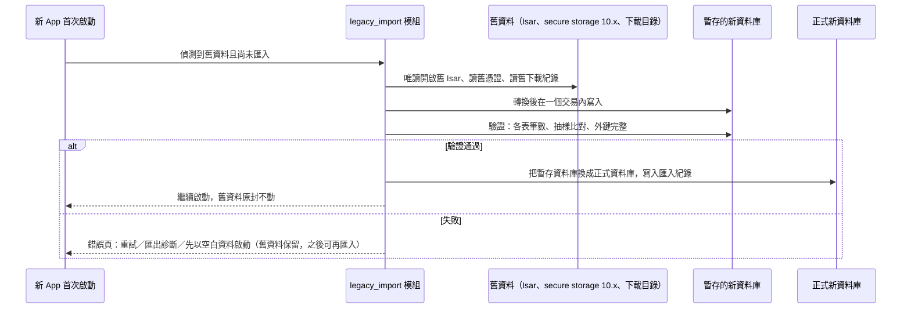

# 設計：資料層與相容

採用的慣例：drift 官方的 schema 版本快照與 migration 測試（`drift_dev schema dump`／`SchemaVerifier`）；
Spotube 的 drift＋sqlite3 組合；一次性遷移模組「先寫到暫存、驗證後才換上」的保守做法（`research/migration-feasibility.md` §1.5）。

## 1. 選型

- `drift`＋`sqlite3`（native assets 自動打包原生庫，不再用 `sqlite3_flutter_libs`）。
- 資料庫檔放在 ADR 0009 §7 定義的資料目錄。
- 只有資料層（repository）能碰資料庫；UI 與 service 透過 repository 介面。這延續舊 ADR 0002 的原則，閘門改成 import lint（第 8 項）。

## 2. Schema 原則

- **關係交給資料庫**：外鍵、`ON DELETE` 規則、唯一鍵；歌單與曲目用關聯表（含排序欄位），不再在曲目上存「屬於哪些歌單」的清單。
  這直接消除舊版「啟動同步重建 `playlistInfo` → 孤兒清理刪曲目」那一類錯誤（`docs/audit/downloads.md` §4.4）。
- **曲目身分**：`TrackKey` 字串格式沿用（ADR 0005，含 cid），作為曲目表的唯一鍵，也是遷移時對應舊資料的依據。
- **只存事實，不存推導值**：不持久化 getter、格式化字串、`needsRefresh` 這類與時間有關的推導值。
- **不存短期資料**：串流 URL 與其到期時間不進資料庫（B6，第 17 項）。
- **下載紀錄獨立成表**：一首曲目的下載檔（路徑、格式、大小、來源歌單）存在下載表，不塞在曲目上（第 11 項細節）。
- **設定也存在資料庫**：`shared_preferences` 的檔案位置由平台決定、不能跟著 Portable 版的 `data/` 走，
  所以設定放在同一個資料庫的設定表；分組與型別在第 18 項定。
- 時間一律存 UTC epoch 毫秒；音源 id 用字串常數。

## 3. Schema 演進

- 每一版 schema 用 `drift_dev schema dump` 存快照進 repo；每個 migration 都有「從上一版升上來」的測試。
- **migration 不得改寫使用者設定過的值**（M3、M4）。要改預設值時，只影響「沒設定過」的列；有對應測試。
- migration 失敗時整個交易回滾，App 顯示錯誤頁，不在半升級的資料庫上啟動。

## 4. 舊資料自動遷移（legacy import）

- **模組**：`app/lib/legacy_import/`，唯一依賴 `isar_community` 與 `flutter_secure_storage` 10.x 的地方；其他程式不得 import 它。
- **資料庫**：從舊位置（Android 私有目錄、Windows `Documents\FMP`、舊 Portable 目錄）唯讀開啟；轉換規則以舊 schema 的實際欄位為準（`docs/audit/data.md` §1）。
  舊版被 migration 強制改過的設定（例如 v3→v4 的 B 站播放認證）無法還原原值，照現值匯入。
- **憑證**：用與舊版相同的 `flutter_secure_storage` 10.x 讀出，寫進新的憑證存放處（第 12 項定）；讀不到的音源標記為「需要重新登入」，不崩潰、不影響其他資料。
- **已下載檔**：不搬動檔案；依舊資料庫的下載路徑與舊下載目錄掃描結果，登記進新的下載表；找不到的檔案不登記。
- **舊備份檔**：備份匯入支援舊格式，與資料庫匯入共用同一套「舊 DTO → 新 schema」轉換。
- **舊檔保留**：遷移永遠不刪舊檔。App 內提供「刪除舊版資料」的按鈕（匯入成功後才出現）。
- **模組保留期限**：舊版允許跳版升級，所以 legacy import 模組與它的兩個舊依賴一直保留，直到擁有者另立 ADR 移除（移除前需公告最低升級路徑）。

## 5. 要在第一個里程碑實測的技術風險

- `isar_community` 與 `sqlite3` 兩套原生庫在同一個 App 共存（Android、Windows）。若衝突：legacy import 改成獨立的一次性小程式，由新 App 啟動它。
- `sqlite3` 原生庫在 Android 的 16KB page size 對齊（用官方對齊檢查腳本）。
- 在擁有者真實資料的**副本**上跑完整遷移（沿用舊 repo `test/manual/real_db_probe.dart` 的做法：以環境變數指向副本），切換前必須通過。

## 6. 舊 ADR

- ADR 0002（Isar 只在 repository）與 0007（Isar 停在 v3）描述的是根目錄舊專案，舊專案在切換前仍需緊急修正時會用到。
  因此**不在寫新 ADR 時刪除**，改為在切換 PR 連同舊專案一起刪除；新 ADR 註明它們只適用舊專案。
  （這是對第 9 項規則的細化：被取代的 ADR 若仍描述凍結中的舊專案，隨舊專案在切換時刪除。）
- ADR 0005 沿用；新 ADR 引用它。
