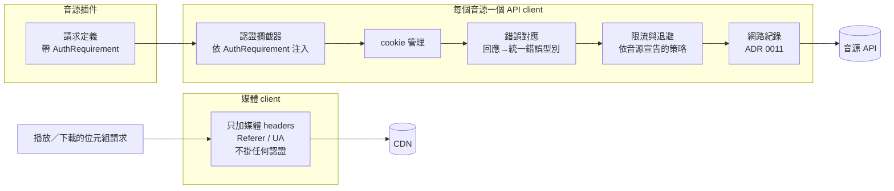
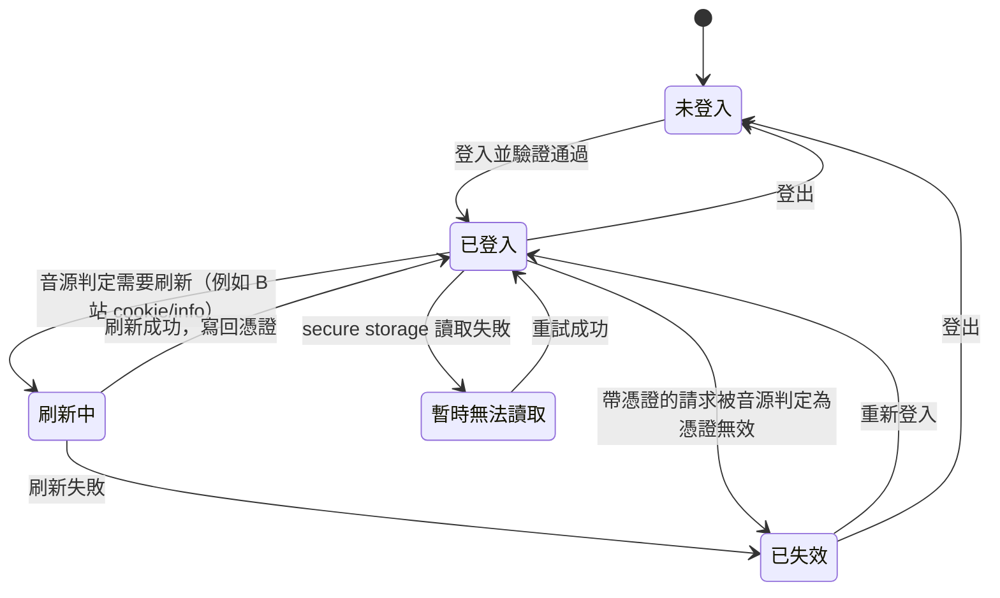

# 設計：網路層與帳號

採用的慣例：dio 官方 `QueuedInterceptor` 做單飛刷新；`cookie_jar`＋`dio_cookie_manager` 管 cookie；
PiliPlus 以 QR 為主的 B 站登入；ytmusicapi 的「瀏覽器登入後貼上 cookie」；Finamp 的已知值遮蔽（ADR 0011）。

## 1. HTTP 層

- **每個音源一個 API client**（dio 實例），該音源所有 service 共用；另有一個**媒體 client** 專門抓音訊位元組，它沒有認證攔截器、沒有 cookie 管理，物理上帶不了憑證。
- 攔截器順序：認證注入 → cookie 管理 → 錯誤對應（第 2 項）→ 限流與退避（策略由音源宣告，第 2 項定細節）→ 網路紀錄（ADR 0011）。
- 匿名用的 cookie（例如 B 站 `buvid`）屬於非機密，存在資料庫；登入憑證只在憑證存放處（§3）。

## 2. 哪些請求帶憑證：單一宣告點

每個請求在音源插件定義處宣告 `AuthRequirement`（放在 dio `RequestOptions.extra`），認證攔截器只看這個標記：

| 標記 | 意思 | 用在 |
|---|---|---|
| `required` | 一定帶；沒登入就不發請求，直接回「需要登入」 | 寫入遠端歌單、讀收藏夾與私人歌單 |
| `userPreference` | 已登入且該音源的「以登入身分瀏覽與播放」開啟時才帶 | 搜尋、排行、詳情、串流解析、下載詳情、歌單刷新、電台、Mix |
| `never`（預設） | 永遠不帶 | 公開頁面抓取（Spotify embed、QQ 公開歌單）、第三方歌詞源 |

媒體位元組請求不經 API client，由 §1 的媒體 client 發出，所以不在這張表裡。
網路紀錄記錄每個請求「有沒有帶憑證」（是／否），Debug 頁可查。

## 3. 憑證存放與帳號狀態

- **唯一來源**：`CredentialStore`（`flutter_secure_storage` 11.x），以音源 id 為鍵。登入狀態由它推導，不再另存一份。
  帳號的非機密資訊（顯示名稱、頭像網址、最後刷新時間與結果）存在資料庫，只供顯示。
- **讀不到不刪**：secure storage 暫時讀不到（例如 Keystore 未就緒）時，帳號狀態為「暫時無法讀取」，稍後重試，不刪除、不提示失效（M8）。
- **遮蔽登記**：每次載入或更新憑證，把實際值登記到遮蔽函式（ADR 0011）。
- **Linux**：需要 libsecret 與執行中的 keyring；沒有 keyring 時的行為在 Linux child task 實測後定。
- 舊版憑證由 legacy import 以 10.x 讀出後寫入（ADR 0010）。

## 4. 登入是音源能力

音源插件宣告它支援的登入方式，UI 取「音源支援 ∩ 平台有能力（ADR 0009）」顯示入口：

| 方式 | 說明 | B 站 | YouTube | 網易 |
|---|---|---|---|---|
| QR 掃碼 | App 顯示 QR，手機 App 掃碼確認 | ✅ 主要 | — | ✅ 主要 |
| App 內網頁登入 | WebView 開登入頁，完成後讀 cookie | ✅ | ✅ 主要（桌面 UA） | ✅（有 WebView 的平台） |
| 貼上 cookie | 在自己的瀏覽器登入後，把 cookie 貼進 App（附步驟說明） | ✅ | ✅ 備案 | ✅ |

- **登入成功的定義**：拿到憑證後，先呼叫該音源的帳號資訊 API 驗證有效，**驗證通過才寫入** `CredentialStore`（修正 C3 的假成功）。
- 沒有 WebView 的平台（例如 Linux）：B 站與網易用 QR，YouTube 用貼上 cookie；是否引入 `webview_cef` 在 Linux child task 決定。

## 5. 刷新、失效與重新登入

- **刷新**：由音源宣告是否支援與時機（B 站：啟動時問伺服器是否需要刷新，B4 保留）。帳號頁顯示最後刷新時間與結果。
- **請求中遇到憑證無效**：只有「帶了憑證」的請求才會觸發。`QueuedInterceptor` 單飛：若音源支援刷新，先刷新、**用新憑證重建請求**後重送一次（修正 C4）；否則標記已失效。
- **判定憑證無效由音源負責**：每個音源明確列出哪些回應代表憑證無效；網路錯誤、限流、風控碼一律不算（修正 C5）。偵測在所有帶憑證的請求上都有效，不限帳號頁（修正 C6）。
- **已失效時**：保留憑證（可能只是暫時），停止帶它；提示一次 toast，帳號頁與相關入口顯示「需要重新登入」；重新登入後，下一次失效會再次提示（修正 M9）。
- **登出**：清除該音源的憑證、該音源網域的 WebView cookie、記憶體中的 cookie、遮蔽登記。
- **重設所有資料**：清資料庫、所有憑證、所有 WebView 資料（修正 C1）。

## 6. 「以登入身分瀏覽與播放」

- 每個音源一個開關（存在每音源設定表，ADR 0011），語意一致：控制該音源所有 `userPreference` 請求。
- 預設值由音源宣告：B 站、網易、YouTube 皆為開。YouTube 的開關旁附說明：以登入身分大量請求，可能被 Google 視為自動化行為（推測，研究未證實）。
- legacy import 以舊值作為使用者設定（舊版開關範圍較窄，新版範圍變廣；切換版本的發行說明寫明）。

## 7. 只能匯入的來源

Spotify（embed 頁）與 QQ（公開歌單）不需登入，`AuthRequirement.never`。抓頁面的做法可能隨對方改版失效，由第 1 項的音源健康檢查涵蓋。
