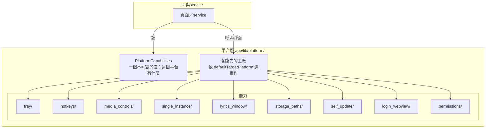

# 設計：平台層

採用的慣例：Namida 的 `lib/controller/platform/`（每個能力一個目錄：共用介面＋各平台實作＋工廠）；
Flutter 官方 federated plugin 的「共用介面＋各平台實作」切法；官方對平台分支的建議
（純 Dart 分支用 `defaultTargetPlatform`，呼叫原生 API 才用 platform channel，新 channel 用 Pigeon）。

## 1. 形狀

- 每個能力一個目錄：`<能力>.dart`（介面＋工廠）、`<能力>_<平台>.dart`（實作）。第三方平台套件
  （`tray_manager`、`window_manager`、`hotkey_manager`、`smtc_windows`…）只在這些實作檔裡 import。
- `PlatformCapabilities` 是每個平台一份的宣告：有沒有托盤、全域快捷鍵、開機自啟、單一實例、
  桌面歌詞視窗、自訂標題列、系統媒體控制（哪一種）、應用內更新（哪一種）、登入 WebView（能不能讀 cookie）、
  需要的執行期權限、資料與下載目錄的規則。UI 只看這份宣告決定顯示哪些入口；service 只呼叫介面。
- 一個能力若要在執行期才知道（例如 Linux 在 Wayland 下沒有全域快捷鍵），由該平台實作在啟動時判斷後寫進宣告，外面看到的仍是一個布林值。
- **平台層以外不得出現** `dart:io` 的 `Platform.isX`、`defaultTargetPlatform`、`TargetPlatform`，也不得 import 上述平台套件。閘門：Dart analyzer lint（第 8 項選定工具後落實）；在那之前靠 review。
- 新增原生呼叫（MethodChannel）一律用 Pigeon 產生，不手寫字串 channel。

## 2. 不寫空實作

還沒驗證的平台，**宣告**全部能力為「沒有」，不寫任何實作檔；App 在該平台只有核心功能（依第 13 項的播放後端而定）。
某個平台的 child task 開始時，才加入它的實作並把宣告改成真值。這讓 Linux／macOS／iOS 從第一個里程碑就能編譯，
又不會有沒人驗證過的程式碼。

## 3. 各能力的套件與平台

✅ 採用｜⏳ 該平台 child task 時接上｜✖ 不提供（原因）

| 能力 | Android | Windows | Linux | macOS | iOS | 套件 |
|---|---|---|---|---|---|---|
| 系統媒體控制 | ✅ | ✅ | ⏳ | ⏳ | ⏳ | `audio_service`（Android／iOS／macOS）；Windows `smtc_windows` 或 `audio_service_win`（第 13 項比較，重點是 seek）；Linux `audio_service_mpris` |
| 托盤 | ✖ 無此概念 | ✅ | ⏳ | ⏳ | ✖ | `tray_manager` |
| 視窗管理、自訂標題列 | ✖ | ✅ | ⏳ | ⏳ 保留系統紅綠燈按鈕 | ✖ | `window_manager` |
| 全域快捷鍵 | ✖ | ✅ | ⏳ 僅 X11；Wayland 為協定限制 ✖ | ⏳ | ✖ | `hotkey_manager` |
| 開機自啟 | ✖ | ✅ | ⏳ | ⏳ 需 macOS 13+ | ✖ | 維持 `launch_at_startup`；Linux／macOS 接上時與 `auto_start_flutter` 比較 |
| 單一實例 | ✖ 系統本身單例 | ✅ | ⏳ | ⏳ | ✖ | Windows 先沿用 runner 的具名 mutex（搬進新 runner）；Linux／macOS 接上時評估 `flutter_single_instance`（先讀原始碼） |
| 桌面歌詞視窗 | ✖ | ✅ | ⏳ | ⏳ | ✖ | `desktop_multi_window` |
| 登入 WebView | ✅ | ✅ | ⏳ 選型在第 12 項 | ⏳ | ⏳ | 行動端與 Windows 暫定 `flutter_inappwebview`；Linux 候選 `webview_cef`（能讀 cookie）；沒有 WebView 時改用 QR 或其他方式（第 12 項） |
| 執行期權限 | ✅ | ✖ 無此概念 | ✖ | ✖ 用沙盒授權 | ✅ | 第 11 項定（`permission_handler` 不支援 macOS／Linux） |
| 應用內更新 | ✅ APK | ✅ installer／portable | ⏳ 視打包格式 | ⏳ Sparkle（`auto_updater`） | ✖ 政策禁止 | 第 19 項定 |
| 網路狀態 | ✅ | ✅ | ✅ | ✅ | ✅ | `connectivity_plus` |
| 檔案選取、目錄 | ✅ | ✅ | ✅ | ✅ | ✅ | `file_picker`、`path_provider` |

同類播放器普遍把桌面音訊／SMTC 套件改成 fork 或本地 path。這裡不預先 fork；遇到非改不可的問題時，
用 git 依賴並鎖 commit，在 pubspec 註解寫明原因與對應的上游 issue／PR。

## 4. 資料與下載目錄（A4）

| 情境 | 資料（資料庫、設定、log） | 預設下載目錄 |
|---|---|---|
| Android | App 私有目錄 | 第 11 項定 |
| Windows 安裝版 | `%APPDATA%` 下的 App 目錄（`path_provider` 的 application support） | 使用者的音樂資料夾下 `FMP` |
| Windows Portable | 程式旁的 `data/`（以程式旁的標記檔判斷是 Portable） | 程式旁的 `downloads/` |
| Linux | `~/.local/share` 下的 App 目錄 | `~/Music/FMP` |
| macOS／iOS | 沙盒內的 Application Support | 第 11 項定 |
| 開發版 | 與正式版分開的目錄與身分（第 8 項定細節） | 同左 |

舊版 `Documents\FMP` 的資料在第一次啟動時搬到新位置（第 6 項的遷移流程）。第一版不提供自訂資料位置。

## 5. 平台政策（寫進 ADR，避免之後重新研究）

- iOS：不能自行安裝更新；經 GitHub 發 IPA、以 AltStore／SideStore 側載，免費 Apple ID 需 7 天重簽、最多 3 個 App；
  上架 App Store 與「下載第三方媒體」衝突（Guideline 5.2.3），不走商店；背景播放需要 `UIBackgroundModes: audio`。
- macOS：Sequoia 起未公證的 App 無法用 Control-click 繞過 Gatekeeper，要讓一般使用者順利安裝需付費開發者帳號做公證；取得 Mac 時再決定。
- Android：不上 Google Play（Play 不允許音樂播放器使用 `MANAGE_EXTERNAL_STORAGE`，第 11 項會一併考慮）。
- Linux：只有 AppImage 適合應用內自我更新；Flatpak 交給系統更新、deb 沒有機制（第 19 項）。

## 6. 其他平台差異

- 自訂標題列：Windows、Linux 用自訂標題列；macOS 保留系統紅綠燈按鈕、標題列透明延伸。
- CJK 字型：不內建；依平台寫 fallback 清單。Linux 虛擬機驗證時若發現常見發行版缺字，再決定是否內建子集。

## 7. 平台上線順序與驗證

| 平台 | 從哪裡開始 | 驗證方式 | 需要的環境 |
|---|---|---|---|
| Android | 第一個里程碑 | emulator＋實機；每個里程碑 | 現有 |
| Windows | 第一個里程碑 | 本機；每個里程碑 | 現有 |
| Linux | 第一個里程碑起 CI 編譯＋單元測試；第一個里程碑完成後開 child task 在虛擬機實機跑；之後每個里程碑做一次冒煙測試 | 虛擬機 | Linux 虛擬機（建議同時有 X11 與 Wayland 工作階段） |
| macOS | 第一個里程碑起 CI（GitHub Actions macOS runner）不簽名編譯 | 取得 Mac 後開 child task 做實機驗證與簽名／公證 | Mac；公證需付費開發者帳號 |
| iOS | 第一個里程碑起 CI 不簽名編譯＋iOS 模擬器測試 | 取得 iPhone 後開 child task 做實機與側載驗證 | iPhone；側載工具 |

正式發佈：Android、Windows 在切換時；Linux、macOS、iOS 各自在其 child task 完成實機驗證後才發佈。

## 8. 預期的 child task（里程碑定稿時排入）

- `platform-linux`：接上 Linux 各能力實作、虛擬機驗證、打包格式（配合第 19 項）。
- `platform-macos`：需要 Mac；實作、簽名與公證。
- `platform-ios`：需要 iPhone（簽名需要 Mac）；實作、背景播放設定、側載驗證。
