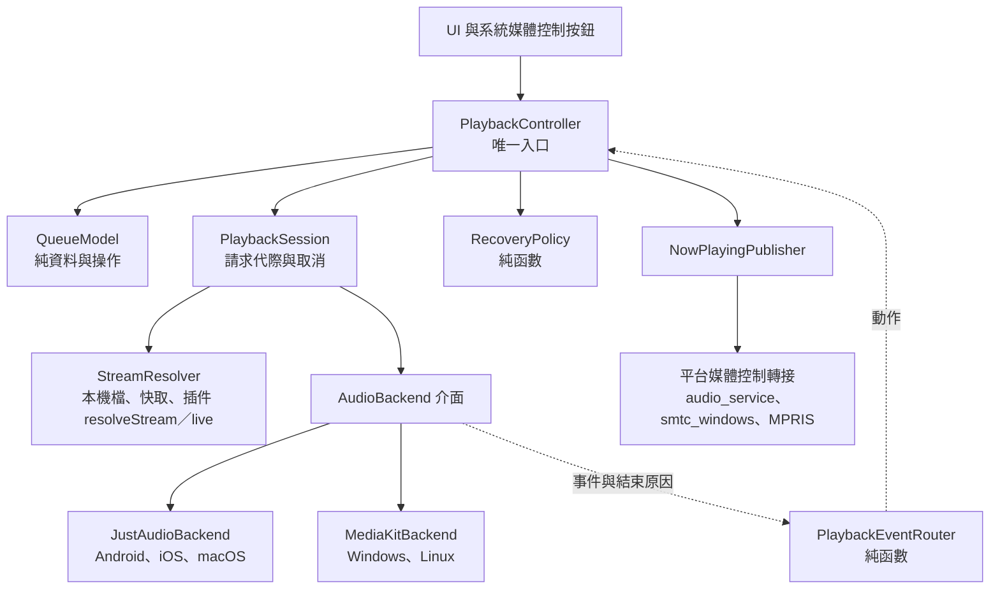

# 設計：播放核心

## 1. 元件

- `PlaybackController`（Riverpod Notifier）是 UI、系統媒體控制與電台的**唯一**播放入口；沒有任何其他元件直接操作後端（取消舊版電台的例外，§8）。
- 協作者以回傳值或回呼回報，不寫狀態；狀態只由控制器寫。舊版拆出的形狀（路由純函數、請求代際、前瞻計畫、`NowPlayingPublisher`）照帶，
  死碼 `_navRequestId` 不帶。
- 系統媒體控制的轉接器由平台層依能力提供（ADR 0009），經 provider 注入，不再從 `main.dart` 讀全域變數。

## 2. 狀態

- **一份播放狀態**（sealed）：`Idle`、`Loading`、`Playing`、`Paused`、`Buffering`、`Retrying(attempt, nextAt)`、`Failed(AppError)`。
  錯誤一律是 ADR 0013 的 `AppError`，不存字串（取代舊版 `error` 一欄三義）。
- 高頻資料（位置、緩衝位置）走獨立 stream，不放進播放狀態，UI 只在需要的元件訂閱。
- `QueueState` 與播放狀態沒有共同欄位（沿用舊 `audio_seam` 的意圖，由型別分開）。
- 播放中的曲目、目前的播放模式放在 `QueueState`；播放狀態只描述「後端現在怎樣」。

## 3. 後端（已決定 A5 選 A）

- `AudioBackend` 介面沿用舊 `FmpAudioService` 的形狀，**不能收斂的差異寫在介面 dartdoc**：音訊焦點只在行動平台、`processingState` 在 mpv 為合成值、
  開源方法回傳時機不同、輸出裝置只在桌面。
- `JustAudioBackend`：Android、iOS、macOS。`MediaKitBackend`：Windows、Linux。由平台層宣告選用哪個實作與**可播格式**（容器、編碼、是否支援 FLV／HLS）。
- 可收斂的規則維持純函數並由兩個實作與假後端轉呼叫：結束原因分類、直播邊緣 seek 階梯、前瞻清單計畫、串流網址遮蔽（改用 ADR 0011 的遮蔽函式）。
  契約測試（同一份斷言跑三個實作的純規則）照帶。
- gapless：後端只持有「目前＋一個前瞻」（`NextMediaPlan`），佇列真相在 Dart 端（§4）。
- Android 音訊焦點：換歌時不放掉焦點（舊版每次 `stop()` 都 `setActive(false)`）；電話打斷結束後的自動恢復經控制器的 `play()`，才會檢查網址過期。

## 4. 佇列與播放模式

- 佇列真相在 `QueueModel`（Dart 端）：臨時播放、Mix、隨機位置順序與持久化都需要它；原生播放清單只拿前瞻。
- 模式：
  - `queue`：一般佇列。
  - `temporary`：臨時播放（D1）。記下佇列快照，播完或上下首時回到佇列；已在臨時模式時保留最早那份快照。
  - `mix`：插件 `mix` 能力的無限佇列（E13），不可播就自動跳過（D3），剩 1 首時補歌。已播超過 100 首時刪掉最舊的已播項目，防止無限增長。
  - `live`：電台與直播（§8），不動佇列。
  - `detached`：清空佇列後仍在播的那首。
- 歌單「全部」只加入佇列（D2）。佇列上限 10,000 首，所有加入方式都檢查（舊版只有 `add` 檢查）。
- **隨機**（D7）：
  - 隨機順序是「位置」的順序，不是歌曲的順序。打開隨機時目前這首排第一；不改動佇列本身，關掉隨機就回原順序。
  - 拖曳：只移動歌曲，不改位置順序；輪到哪個位置就播那裡的歌；拖進本輪已播過的位置，本輪不再播。
  - 「下一首播放」：新位置插在目前這首之後；連續加入時接在上一次插入的後面，依加入順序播（Namida 的 `insertAfterLatest` 慣例）。其餘未播位置順序不變。
  - 隨機順序持久化，重啟後相同（舊版每次重新產生）。
- 單曲循環每一圈記一筆歷史（D6）；網址仍在快取有效期內就 seek 回 0，不重新解析。

## 5. 串流解析

- 順序：本機下載檔 → 記憶體網址快取（ADR 0016）→ 插件 `resolveStream`。
- `resolveStream` 輸入：曲目、分 P（`multiPart`）、音質偏好、**平台可播格式**；輸出：依優先序排好的候選串流（網址、標頭、格式、`expiresAt`）。
  插件依可播格式挑格式（例如蘋果平台的 B 站直播用 HLS、YouTube 用 m4a）。分 P 由插件以分 P id 解析，宿主不懂 cid。
- 開流失敗換下一個候選，一次請求最多換一次（沿用舊版）。
- 網址過期：暫停後恢復、長時間暫停後 seek、前瞻交接前，都先檢查 `expiresAt − 5 分鐘`，過期就重新解析。
- 預取：目前這首開始播後解析下一首並交給後端前瞻；臨時播放不預取。
- 被取代的請求**取消**網路工作：取消訊號經宿主 `http.request` 傳到插件（舊版只丟掉結果、請求照跑）。

## 6. 錯誤恢復與跳過

依 ADR 0013 的分類，由純函數 `RecoveryPolicy` 決定：

| 錯誤 | 播放層處理 |
|---|---|
| `NetworkError`、`RateLimited`（網路層重試後仍失敗）、播放中傳輸中斷、提前結束 | 從目前位置重試，1／3／9 秒共 3 次；網路狀態不是 `Online` 時暫停計數，恢復後再試（ADR 0016）；仍失敗就跳過並提示 |
| `Unavailable`、`NotFound`、`AuthRequired`、`CredentialInvalid`、`VerificationRequired`、`Unsupported` | 不重試，立即跳過並提示（ADR 0013）；需登入類附「登入」 |
| `Unavailable(只有試聽)`（D4） | 設定「跳過試聽片段」開（預設開）就跳過；關就播放並在曲目上標「試聽」 |
| 開不起來、解碼失敗 | 換候選一次，仍失敗就跳過 |
| 緩衝飢餓 15 秒 | 重新解析一次；同一首第二次就跳過 |
| 輸出裝置失敗（桌面） | 暫停並提示，不跳過 |

- 「跳過」在 `queue`、`mix` 走下一首（D3）；在 `temporary` 回到佇列並提示；在 `live` 顯示離線或查詢失敗（§8）。
- 連續跳過次數達佇列長度（或 10 首）就停止並提示一次（ADR 0016）。同類提示短時間只出一次（ADR 0013）。
- 重試計數在一首歌正常播放 10 秒後歸零（舊版成功後不歸零）。

## 7. 系統媒體控制

- `NowPlayingPublisher` 是唯一出口，擁有者為音樂或直播；按鈕依播放能力推導（直播沒有上下首、不能 seek）。
- 轉接器：Android、iOS、macOS 用 `audio_service`；Linux 用 `audio_service_mpris`；Windows 用 `smtc_windows`。
- 封面經 ADR 0016 的圖片快取；推送去重（只在值改變時推，位置有容差），並序列化避免亂序（Harmonoid 的慣例）。

## 8. 電台與直播

- 不再繞過控制器：`PlaybackController.playLive(station)` 經插件 `live` 能力取得串流，走同一個 `PlaybackSession`，
  所以開直播會取消進行中的音樂請求、音樂恢復也會停掉直播（**D8 由結構保證**，舊版 `restore()` 路徑的競態也一併消失）。
- 進入直播時記下佇列快照，停止直播回到原佇列與位置（沿用舊 `returnFromRadio` 行為）。
- 直播特有：`seekToLive`、無到期時間、提前結束時先問插件是否仍在直播，是才依 1／3／10 秒重連 3 次。
- D10：直播狀態查詢失敗是 `AppError`，顯示「查詢失敗」，不再當成「未開播」。直播狀態輪詢與收聽中的直播間資訊刷新由背景排程器負責（ADR 0017）。

## 9. 持久化與設定

- 佇列持久化：曲目鍵、目前位置、播放位置、隨機位置順序、循環模式、播放模式、Mix 身分、音量。播放位置每 10 秒存一次，暫停、seek、App 進背景時立即存。
- 「記住播放位置」「臨時播放回佇列倒退秒數」沿用；播放速度不持久化（E19 照舊）；新增「跳過試聽片段」（D4，預設開）。

## 10. 計時器與閘門

- 播放模組擁有的計時器：位置檢查（每秒，**只在播放中**開）、位置存檔（每 10 秒，只在播放中）。它們是 `fmp_periodic_timer_owner`（ADR 0017）允許清單上的播放模組。
- 舊 static-rule 的去向（ADR 0015 §6）：
  - `playback_event_routing` → 結束原因型別只准被後端與路由器 import（`fmp_layer_imports` 依賴表）＋路由器的 exhaustive `switch`。
  - `audio_seam` → 狀態分開（§2）＋串流存取的窄介面只准被 `PlaybackSession` import（依賴表）。
  - `audio_backend_shared_rules` → 契約測試照帶；「第二份關鍵字表」的防線改為分類規則只在一個檔，由依賴表限制後端只能 import 分類檔。
  - `just_audio`、`media_kit` 只准在後端實作目錄 import（依賴表）。
- 測試：
  - `QueueModel`：隨機位置語意、拖曳、連續下一首播放、臨時播放快照、Mix 修剪、上限。
  - `RecoveryPolicy`：每類錯誤的處理、離線暫停計數、歸零、連續跳過停止。
  - 開直播取消進行中的音樂請求（D8）；預取後播放只解析一次（ADR 0016）；單曲循環每圈一筆歷史且不重解析。
  - 後端契約測試（純規則）。
