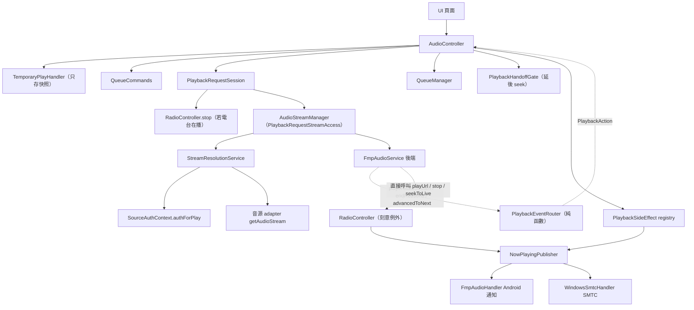

# 舊播放核心的真實形狀（current state）

- 查證日期：2026-09-28（repo 分支 `docs/audit`，HEAD `e5d22495`，2026-09-27 22:07）
- 查證方式：只讀原始碼。沒有跑 App、沒有跑 `flutter test`、沒有打真實 API。
  - 直接核對的檔案：`lib/services/audio/*`、`lib/providers/audio/*`、`lib/services/radio/*`、`test/services/static_rules/*`、`test/support/audio_provider_size_static_rule_test.dart`、`test/ui/static_rules/watch_scope_static_rule_test.dart`、`.trellis/spec/services/audio.md`。
  - 行為面的細節大量沿用 `docs/audit/playback.md`（同一分支、純程式碼層級證據、附 `檔案:行號`）。凡轉引該檔的地方在段末標「（audit）」，本文另抽樣核對了其中約 30 條行號與敘述。與 audit 不同或本文新增的判斷另行註明。
  - 標「**推測**」的是從程式碼推導出、未實機重現的行為；查不到的直接寫「查不到」。

---

## 1. 元件與責任

`lib/services/audio/` 35 檔 11,930 行、`lib/providers/audio/` 5 檔 806 行、`lib/services/radio/` 3 檔 1,604 行（`docs/audit/architecture.md:86,77,96`）。

### 1.1 對外／頂層

| 元件 | 檔案:行數 | 責任 | 不擁有什麼（dartdoc 明示） |
|---|---|---|---|
| `AudioController`（`Notifier<PlayerState>`） | `audio_provider.dart`：2,953 行，約 125 方法 / 41 欄位 | UI 唯一的播放入口；投影 `PlayerState`、transport 命令、套用路由後的動作 | 不宣告 provider；不管後端事件的分類（見 §4） |
| `QueueManager` | `queue_manager.dart`：866 行 | 純佇列邏輯與持久化；**從不操作播放器** | 不做投影、不動後端 |
| `PlaybackRequestSession` | `playback_request_session.dart`：882 行 | 發 requestId；跑 `start` / `restore`；回 `PlaybackSessionResult` | 不碰 `PlayerState` |
| `FmpAudioService`（抽象） | `audio_service.dart`：127 行 | 後端契約；**後端差異寫在每個成員的 dartdoc** | 音訊焦點／中斷不屬共同契約（Android 專屬） |
| `PlaybackHandoffGate` | `playback_handoff_gate.dart`：315 行 | 閂存「控制器正在投影哪一次請求」＋延後 seek；**不是第二個計數器** | 不碰 `PlayerState`、不執行 seek |

### 1.2 協作者（`AudioController` 拆出來的）

| 元件 | 檔案:行數 | 責任 |
|---|---|---|
| `PlaybackEventRouter` | `playback_event_router.dart`：546 行，27 型別 | 純函數：後端事件 ＋ `PlaybackEventContext` → **一個** `PlaybackAction`（sealed，23 個變體）。唯一允許拆 `PlaybackEndReason` 的地方 |
| `PlaybackRecoveryCoordinator` | `playback_recovery_coordinator.dart`：477 行 | 重試階梯（`maxRetries = 5`，1/2/4/8/16 秒）與世代防競態；timer 可注入 |
| `BufferStarvationWatchdog` | `buffer_starvation_watchdog.dart`：62 行 | 「一直緩衝沒人喊失敗」的兜底；**只升級成一次失敗，不停播不重解析** |
| `PlaybackSideEffect` ＋ registry | `playback_side_effects.dart`：269 行 | 廣播 track started / state changed / stopped（播放歷史、歌詞自動比對、通知列） |
| `NowPlayingPublisher` | `now_playing_publisher.dart`：324 行 | 通知列／SMTC 的唯一出口；在音樂與電台之間仲裁 owner |
| `AudioStreamManager` → `StreamResolutionService` | `audio_stream_manager.dart`：176 行 / `stream_resolution_service.dart`：619 行 | Track → `PreparedPlaybackMedia`（local / remote）；解析、快取、音質降級 |
| `QueueCommands` / `QueuePersistenceManager` / `QueueStateNotifier` | 136 / 138 / 93 行 | 佇列寫入的唯一入口／落盤／UI 投影 |
| `TemporaryPlayHandler` | `temporary_play_handler.dart`：113 行 | 臨時播放開始前「佇列停在哪」的快照；**不擁有播放模式、不啟動播放** |
| `MixSessionCoordinator` | `mix_session_coordinator.dart`：345 行 | Mix（YouTube RD 播放清單）的補歌與持久化 |
| `PlayHistoryRecorder` / `LyricsAutoMatchCoordinator` | 54 / 89 行 | 播放歷史寫入 / 歌詞自動比對 |
| `EffectivePlaybackState` | `effective_playback_state.dart`：54 行 | 純函數：「控制器正在載入而後端說 idle」→ 改報 loading、位置報 0 |
| 後端 | `just_audio_service.dart`：718 行 / `media_kit_audio_service.dart`：1,017 行 | 見 §5 |

規則：協作者以回呼回報、**絕不碰 `PlayerState`**（`.trellis/spec/services/audio.md:21-22`）；每個佇列寫入都經 `_emitQueueState`（同上 `:24`，慣例非閘門）。

### 1.3 混合職責的檔案（`audio_provider.dart` 之外）

- `audio_playback_types.dart`：1 行，只有 `enum PlayMode { queue, temporary, detached, mix }`。
- `mix_playlist_types.dart`：10 行，只有 `MixTracksFetcher` typedef ＋ re-export。
- `playback_capabilities.dart`：73 行，`PlaybackCapabilities`（`music` 全開 / `none` / `liveRadio` ＝ `none`），由 `NowPlayingPublisher` 從**實際綁定的命令**推導（`playback_capabilities.dart:8-12`）。
- `playback_end_reason_rules.dart`：148 行、`live_edge_seek_policy.dart`：90 行、`next_media_plan.dart`：50 行、`playback_media.dart`：69 行 —— 這 4 檔是**兩後端共用的純規則**（§5.3）。
- `audio_runtime_platform.dart`：27 行，`mobile`（android/ios）vs `desktop`（windows/linux/macos）二分，`audioRuntimePlatformProvider`。

---

## 2. 呼叫關係圖

點一首歌（一般音樂）的收斂路徑。實線＝主要流程，虛線＝回報／事件。

- 兩個 `Notifier` 共用**同一個後端實例**：`AudioController` 用 `ref.read(audioServiceProvider)`（檔內 13 個 `ref.read`、2 個 `readOptional`、0 個 `watch`，`audio_provider.dart:175-206`），`RadioController` 用 `ref.watch`（`radio_controller.dart:286`）。
- UI 直接 import `services/audio` 只有 8 次（`architecture.md:265`），所有播放 UI 走 `AudioController`；`FmpAudioService` 在 `lib/ui/` grep 無結果（`architecture.md:43`）。

---

## 3. 佇列模型

- 本體在 `QueueManager`：`_tracks`、`_currentIndex`、`_shuffleOrder`、`_shuffleIndex`（`queue_manager.dart:21-34`）。`AudioController` 不存佇列，只投影成 `QueueState`（`queue_state.dart:17-29`，12 欄位）。
- `PlayMode` 四態：`queue / temporary / detached / mix`（`audio_playback_types.dart:1`）。`detached` 表示「正在播的歌不在佇列裡」（清空佇列後）。
- **臨時播放**（App 主流程）：搜尋、歌單詳情、首頁、排行、歷史、已下載、匯入預覽全部走 `playTemporary`（`playback.md` §1.2）。語意（`temporary_play_handler.dart:31-67`）：不改佇列、記下 index／位置／是否在播、`persist: false`（解析結果不落盤）；已在臨時模式時**保留最早那份快照**。播完或按上下首走 `_returnToQueue`，依「記住播放位置」載回原位置並倒退 `tempPlayRewindSeconds`，**原本在播才自動播**。
- **隨機**（非破壞性）：開啟時產生索引排列、當前曲放第一位（`queue_manager.dart:753-767`）；`getNextIndex` / `getPreviousIndex` 沿排列走（`324-375`）。破壞性 `shuffle()` / `restoreOrder()` 存在（`616-664`）：`shuffleQueue` 有呼叫端（佇列頁打亂鈕，`lib/ui/pages/queue/queue_page.dart:323`），**`restoreOrder` 無任何呼叫端**（`playback.md` §4.5）。
- **下一首播放**：`addNext` → `insert` → `_addToShuffleOrder`，後者把新索引插在當前位置之後的**隨機**位置（`queue_manager.dart:541-547, 775-786`）。**推測**：隨機模式下「下一首播放」不會是下一首，非使用者預期（audit §3.1）。
- **Mix 補歌**：每首開始時若剩餘 ≤ 1 首就在背景補（`mix_session_coordinator.dart:145-169`）；最多試 10 次、間隔 1 秒、湊到 10 首新歌才停、`seenVideoIds` 去重（`192-330`）。Mix 佇列**只增不減**，走 `addAll` 不檢查 `maxQueueSize`（`queue_manager.dart:500`）。**推測**：長時間 Mix 佇列與記憶體持續長（audit §3.11，未量）。
- **持久化**：`PlayQueue` 存 `trackIds`、`currentIndex`、`lastPositionMs`、`lastVolume`、`isShuffleEnabled`、`loopMode`、`originalOrder`、Mix 身分（`queue_persistence_manager.dart:78-128`）。位置每 10 秒存一次（`app_constants.dart:54`，`positionSaveInterval`），seek 後立即存。**隨機排列不持久化**，重啟重生成（`queue_manager.dart:210-212`）。
- 加入上限：只有 `add` 檢查 `maxQueueSize = 10000`（`queue_manager.dart:472`，`app_constants.dart:35`）；`addAll` / `insert` **不檢查**（audit §3.1）。
- Mix 模式下 `add / addAll / addNext / shuffle` 被 `QueueCommands` 擋下（`queue_commands.dart:52-123`）。
- 啟動 10 秒後刪除「不屬任何歌單、也不在佇列」的 Track 列（`queue_manager.dart:224-227, 830-843`）。

---

## 4. 播放狀態機

### 4.1 狀態欄位與誰能寫

狀態**至少 5 份**（audit §0）：後端快取欄位、`PlayerState`、`QueueState`、`QueueManager` 內部索引、系統媒體控制狀態（電台另有 `RadioState`）。

- `PlayerState`（`player_state.dart:12-59`）21 欄：`isPlaying / isBuffering / isLoading / processingState / position / duration / bufferedPosition / speed / volume / playingTrack / error / retryAttempt / isNetworkError / isRetrying / nextRetryAt / currentBitrate / currentContainer / currentCodec / currentStreamType / audioDevices / currentAudioDevice`。`currentTrack` 是 `playingTrack` 的 getter（`:86`）。
- `processingState` 列舉：`idle / loading / buffering / ready / completed`（`audio_types.dart:2-17`）。
- 寫入者：`_startSessionLoadingState`、`_exitLoadingState`、`_projectPlayerState`、`_applyRecoveryState`、`_apply`（路由動作套用）、`play()` / `togglePlayPause()` 的 catch（`playback.md` §2.1 逐項列出）。
- `error` 同時承載三種內容：音源錯誤訊息、例外 `toString()`、開流失敗文案（audit §4.4）；`togglePlayPause` 見到 `error != null` 就重播當前曲（`audio_provider.dart:517-523`）。
- **投影修正**：`EffectivePlaybackState.from`（`effective_playback_state.dart:23-47`）—— 控制器載入中而後端說 `idle` 就改報 `loading`；載入中位置一律報 0。這條過去只套用在 Android 通知列，Windows SMTC 收的是後端原始值（同檔 `:9-12`）。

### 4.2 轉換（使用者可見）

| 從 | 到 | 觸發 |
|---|---|---|
| Idle | Loading | `playTemporary` / `playAt` / `next` / `previous` |
| Loading | Playing | session completed 且後端 playing |
| Loading | Loading | 新請求取代舊請求（superseded） |
| Loading | RetryScheduled | 網路／逾時類 `SourceApiException` 或 Dart Socket/Http/Tls/Timeout |
| Loading | SourceError | unavailable/geo/vip 且**非** queue 模式，或其他音源錯誤、`PlaybackTimeoutException` |
| Loading | Loading（300ms 後 `next()`） | unavailable 且 **queue 模式**有下一首 |
| Loading | TerminalErr | 開流錯誤 2 秒內沒自癒 |
| Playing | Buffering → Loading | 連續緩衝 15 秒第一次救援；同首第二次 → TerminalErr |
| Playing | RetryScheduled | `TransportFailed`（播放中）／`EndedPrematurely` |
| Paused | Dropped（記號，UI 仍 Paused） | `TransportFailed`（暫停中） |
| RetryScheduled | Loading | 計時到 1/2/4/8/16 秒 |
| RetryScheduled | RetryExhausted | 第 5 次仍失敗 |
| Playing | Playing | gapless 交界，後端自己接上（後端發 `advancedToNext`） |
| Playing | Paused | 佇列播完 `PauseAtQueueEnd` |

完整狀態圖見 `docs/audit/playback.md` §2.2（`stateDiagram-v2`，含每一條的證據行號）。轉換的**決策**全部由 `PlaybackEventRouter` 產生 `PlaybackAction`，控制器只做一次 exhaustive `switch` 套用副作用（`.trellis/spec/services/audio.md:31-37`）。

### 4.3 競態防護

- **請求代際**：`PlaybackRequestSession` 用單調遞增 `_requestId`（`playback_request_session.dart:179`）；每個 `await` 後 `isSuperseded(requestId)`（`:201`）決定結果是否採用。`cancelActive()` 遞增 id 讓進行中的請求作廢（`:203-206`）。結果四態：`completed / superseded / terminalMediaOpenError / failed`（`:13-125`）。
- **被取代的請求不會取消網路工作**：`isSuperseded` 只決定結果要不要用，`selectPlayback` 仍跑完，`_withBudget` 的 timeout 也不取消底層 future（`playback.md` §4.2）。快速連點下一首 N 次會有 N 份解析在跑，完成後照樣寫 Isar 與快取。**推測**：真實後果未量。
- **交接閂存**：`PlaybackHandoffGate` 是 requestId 的閂存副本（`playback_handoff_gate.dart:58-62`）；`activeRequestId > 0` ＝ 控制器正在投影一次交接（`:94`）。`isCurrent`（閂存）與 `isRequestSuperseded`（session 世代）**刻意不同、不可互換**（`:97-101`）。
- **延後 seek**：載入中或穩定化視窗中的 seek 被接下並延後（`:143-195`）；穩定化視窗長 `seekStabilizationDelay = 500ms`（`app_constants.dart:63`）。**每一條丟棄路徑都必須 `complete()`**，否則 `seekTo` 的 await 永遠 hang（`:26-35`）。
- **`_navRequestId` 是死碼**：遞增與比較之間沒有 `await`（`audio_provider.dart:1017-1032, 1050-1070`），不可能不相等；實際防競態靠 session requestId。**與 `.trellis/spec/services/audio.md:70-72` 的「Navigation 有自己的計數器」敘述不一致**（audit §3.1、§4.6）。
- `MediaKitAudioService._playbackCancelled` 是單一布林、每次開流開頭重設（`media_kit_audio_service.dart:653, 750, 856`）。**推測**：前一次還在 `_ensurePlayback` 迴圈時，新開流可能讓舊迴圈替新媒體呼叫 `play()`（audit §4.2）。

---

## 5. 兩個後端

### 5.1 共同介面 `FmpAudioService`（`audio_service.dart:18-127`）

Android `JustAudioService`（just_audio → ExoPlayer）／Windows `MediaKitAudioService`（media_kit → libmpv），由 `audioServiceProvider` 依平台選（`providers/audio/audio_controller_provider.dart:26-32`）。介面成員：lifecycle、9 條 stream（`playerStateStream`、`playingStream`、`processingStateStream`、`positionStream`、`durationStream`、`bufferedPositionStream`、`speedStream`、`audioDevicesStream`、`audioDeviceStream`）、**`endReasons`**（單一通道承載正常播完與各種失敗，取代舊的 `completedStream` ＋ `errorStream`）、state getters、transport（`play/pause/stop/togglePlayPause`）、seek（`seekTo` / `seekToLive`）、速度、音量、音訊裝置、開源（`playMedia/setMedia/playUrl/setUrl/playFile/setFile`）、前瞻（`setNextMedia` ＋ `advancedToNext`）。

介面 dartdoc 明列**不能收斂的差異**（`audio_service.dart:9-17, 27-30, 35-38, 41-45, 88-96, 112-126`）：

| 面向 | Android | Windows |
|---|---|---|
| 音訊焦點／中斷／拔耳機 | 有（`JustAudioService.initialize`） | **無**，`audio_session` 在 Windows 無 plugin |
| `processingState` | 直譯 ExoPlayer | **合成值**（`completed > buffering > playing→ready > 有duration→ready > idle`，`media_kit_audio_service.dart:449-466`） |
| `bufferedPosition` 量級 | ExoPlayer 本段已緩衝（上限 20 秒） | mpv `cache-secs=7200` 整首一次抓完 |
| 音訊裝置 | 永遠空清單、`setAudioDevice*` 無動作 | 有裝置清單與切換 |
| `playMedia` 回傳時機 | 來源設好就回傳，`play()` 不 await（**回傳 ≠ 出聲**） | 最多等 5 秒到 ready 才 `play()`；0.5 秒仍 idle 丟 `StreamOpenFailedException` |

### 5.2 gapless 與前瞻

`setNextMedia` 的交出去的前瞻媒體由後端自己接（`audio_service.dart:112-126`）：Android 往 just_audio 清單 append（`useLazyPreparation: false`，`just_audio_service.dart:148-152`）；Windows mpv 清單 append ＋ `prefetch-playlist=yes`（`media_kit_audio_service.dart:250`）。交界時後端發 `advancedToNext`，控制器在 `_onBackendAdvanced` 跟帳。清單不變量「當前項目 ＋ 最多一個前瞻」由純規則 `NextMediaPlan` 算（`next_media_plan.dart:9-49`）；兩後端都設了「第二項立刻預備」，留下的項目＝一條開著的連線，所以 `shouldTrimPlayedEntry` 要把播完的移掉。

### 5.3 共用純規則與契約測試

兩後端在 `flutter test` 裡都建不起來（just_audio 要 platform channel、media_kit 要 libmpv），所以「同一份斷言跑在三個後端」是靠抽純函數 ＋ 各後端三行轉呼叫做到的（`backend_contract_test.dart:11-17`）：

| 共用檔 | 內容 | 誰轉呼叫 |
|---|---|---|
| `playback_end_reason_rules.dart` | `classifyCompletion`、`classifyMpvMessage`、`classifyExoPlayerFailure`、`transportKindOf` | 兩個真後端 ＋ `FakeAudioService`（`classifyCompletion`） |
| `live_edge_seek_policy.dart` | `liveEdgeCandidates`（duration → buffered 兩段階梯）、`seekTookEffect` | 三者 |
| `next_media_plan.dart` | `NextMediaPlan.of` / `shouldTrimPlayedEntry` | 兩個真後端（fake 沒有播放清單） |
| `playback_media.dart` | `redactStreamUrl`（串流網址寫 log 的形狀） | 兩個真後端（fake 不寫 log） |

- 契約測試：`test/services/audio/backend_contract_test.dart`（"seekToLive ladder"、"playback end reasons"、"setNextMedia playlist plan"、"the fake answers the same table"）。
- `test/services/audio/next_medium_contract_test.dart` 另有一份前瞻契約。
- 桌面後端有假引擎接縫 `MediaKitAudioService(platformPlayer:)`（`media_kit_audio_service.dart:21` 附近）；`JustAudioService` **沒有**（`.trellis/spec/services/audio.md:59-60`）。

### 5.4 各自特有行為（實作層）

- **Android／just_audio**：`AudioSessionConfiguration.music()`；duck 音量減半、pause/unknown 中斷暫停、pause 類結束且之前在播才自動恢復、`becomingNoisy` 暫停（`just_audio_service.dart:165-213`）。每次開流 `setActive(true)`、**每次 `stop()` 都 `setActive(false)`**，而每次播放請求都以 `stop()` 開場 → 切歌會放掉再搶回焦點。**推測**：其他 App 可能在切歌瞬間短暫恢復播放（audit §3.7）。`isPlaying` 讀 `_player.playing`、`processingState` 讀自己的 BehaviorSubject（`:108, 120-121`），兩者可能描述不同瞬間（**推測**）。可用 `AndroidEqualizer`（見 packages 研究），但本 repo **沒用到**。
- **Windows／media_kit**：`_configureForAudioOnly` 設 `cache-secs=7200` ＋ `prefetch-playlist=yes`（`media_kit_audio_service.dart:202-250`）；輸出裝置可選、偏好裝置存在 Settings，裝置清單首次就緒時套用一次（`audio_provider.dart:1252-1302`）。mpv 只在 **log** stream 報輸出裝置失敗，故 `error` 與 `log` 兩條都訂閱（`.trellis/spec/services/audio.md:61-63`，issue #41／#106）。`OutputDeviceFailed` 只 toast、收回已排的提前結束重試、5 秒內任何 playing 立刻 pause（`playback.md` §3.6）。
- 兩後端各 4 個開源方法的時長輪詢迴圈幾乎重複（`media_kit_audio_service.dart:738-935`、`just_audio_service.dart:535-652`）（audit §4.1）。

---

## 6. 串流解析、預取、URL 過期、多 P、音質

- 共通：`DefaultStreamResolutionService.resolvePrimary`（`stream_resolution_service.dart:123-168`）—— 先查本機下載檔（同步 `File.existsSync`）→ 讀設定與 `authForPlay` → 行程內 LRU（上限 32）→ 呼叫 adapter（限流等 3 秒重試一次，其他 1 秒）。`_applyStreamResult` 就地寫 URL／到期／cid，視 `persist` 落 Isar（`:420-481`）；無 `expiry` 預設 **1 小時**（`:428-430`）。
- **URL 過期**：`Track.hasValidAudioUrl` 在到期前 5 分鐘即視為無效，但 `audioUrlExpiry == null` **永遠有效**（`track.dart:283-293`）。重取時機三處：每請求經 `resolvePrimary`、暫停後按播放（`_resumeWithFreshUrlIfNeeded`，成功後延遲 500ms seek 回原位）、失敗時 `invalidateResolvedStream`。**播放中不檢查過期**（`seekTo` 無判斷）→ Android 只緩衝 10–20 秒，長曲播到過期後讀的片段會失敗進重試。**推測**（audit §3.3）。
- **預取**兩層：(1) 下一首 URL 預解析（`prefetch` 不落盤、臨時播放不預取）；(2) gapless arm（§5.2）。`_armNextMedia` 條件：不脫離佇列、非單曲循環、電台沒占用、Mix 沒補歌（`audio_provider.dart:1651-1662`）。**觀察**：arm 的 URL 交界時才被讀，中途長暫停可能已過期而控制器沒機會重解析（**推測**）。
- **音質降級**：`AudioQualityLevel.high/medium/low` 依位元率排序取對應項（`audio_stream_quality_fallback.dart:9-20`）；主解析只有 `unavailable` / `vipRequired` 降一級（`:42-67`）；開流失敗的 fallback 從低一級開始、每級先問 alternative（`:69-96`），一次請求只 fallback 一次（`playback_request_session.dart:538-589`）。總預算 T1+T2（`PlaybackTimeoutBudget`：解析 25 秒、開流 8 秒、緩衝飢餓 15 秒，`app_constants.dart:195-224`）。
- **多 P**：Bilibili `_getCid` 只取影片**第一個** cid，`request.pageNum` 在 `getAudioStream` 裡沒被使用（`playback.md` §3.2，`bilibili_source.dart:456-473, 213-241`）。**推測**：帶 `pageNum` 卻沒 `cid` 的 track 會解析到 P1（audit 亦標未確認這種 track 是否存在）。ADR 0005 說分 P 以 cid 區分。
- 音源特有：B 站 DASH 寫死 `container 'm4a' / codec 'aac'`（`bilibili_source.dart:374-376`）、到期讀 URL `deadline`（缺 2 小時）；YouTube 到期**寫死 1 小時**、不讀 URL 的 `expire`（`youtube_source.dart:52-54`，見 packages 研究 D9 待修）；網易試聽片段（`freeTrialInfo != null`）只寫 log、照常當完整歌曲回傳（`netease_source.dart:139-150`），**推測**使用者只聽到片段然後跳下一首（D4 待修）。
- Media 請求 header：只有 CDN Origin/Referer ＋ UA，**不帶帳號憑證**（`source_http_policy.dart:73-84`）。

---

## 7. 錯誤恢復

| 失敗來源 | 處理 | 上限 |
|---|---|---|
| 解析 `SourceApiException` network/timeout、Dart Socket/Http/Tls/Timeout | 退避重試（1/2/4/8/16 秒） | 5 次（`app_constants.dart:230-237`） |
| 解析 unavailable/geo/vip | **queue 模式**且有下一首：300ms 後 `next()`；否則 stop ＋ error | — |
| 解析 rateLimited | 設 error 不重試 | — |
| `PlaybackTimeoutException`（T1/T2 耗盡） | 不進退避、換一次 fallback 串流 | 1 次 |
| 後端 `TransportFailed`（播放中） | stop 後進退避 | 5 次 |
| 後端 `TransportFailed`（暫停中） | 只記號，按播放才重開（`DeferTransportFailureUntilPlay`） | — |
| 後端 `EndedPrematurely` | 從當前位置退避重試 | 5 次 |
| 後端 `MediaUnopenable` / `DecoderFailed` | 等 2 秒，後端自己往前走 ≥ 0.5 秒算自癒，否則 stop | 1 次（`playback_request_session.dart:162-163, 341-406`） |
| 後端 `OutputDeviceFailed` | toast、收回提前結束重試、5 秒內 playing 立刻 pause | — |
| 緩衝飢餓 15 秒 | 第一次 invalidate ＋ `retryPlayback`；同首第二次當作開不起來 | 同首 1 次 |
| `UnclassifiedFailure` | 只記 log、丟棄 | — |

- 重試次數**不因成功而歸零**：自動重試成功也累計，只有換歌／手動重試／網路恢復才歸零（`playback_recovery_coordinator.dart:140-147`）。世代靠 `_retryGeneration` 防舊計時器（`:157-205`）。
- 網路恢復由 `connectivityProvider` 發事件自動重試並歸零（`playback.md` §3.6）。
- **何時跳過**：只有 `unavailable/geo/vip` 且 `mode == PlayMode.queue` 才自動跳下一首；**Mix 模式不跳過**（條件寫死 queue，`audio_provider.dart:1955`）。**推測**不是刻意設計 —— 這條正是已勾選的 D3（Mix 與普通佇列統一「不可播放就自動跳過」）。
- **`_RetryScheduledException` 只有 `playSingle` 一個明確 catch，而它無 UI 呼叫端**：其餘入口被通用 `catch` 接住，把內部例外的 `toString()` 寫進 `state.error`；`playTemporary` 會顯示「播放失敗」並**立刻恢復原佇列**，而退避計時器仍會在 1 秒後重播那首臨時曲目（audit §3.6，後果部分屬**推測**）。

---

## 8. 系統媒體控制、耳機鍵、音訊焦點

- 唯一出口 `NowPlayingPublisher`（`now_playing_publisher.dart:65-304`），owner 為 `music` 或 `radio`（`enum NowPlayingOwner`，`:17`）；非 owner 推送被忽略，電台 `release` 時自動還給音樂（`:131-148`）。按鈕由 `PlaybackCapabilities` 推導（`:257-303`）。
- **Android**：`audio_service ^0.18.15`，`AudioService.init` 在 `main.dart:172-183`（`androidStopForegroundOnPause: true`、快轉/倒轉 10 秒），失敗退回沒接系統的 `FmpAudioHandler`（`main.dart:186-195`）。`MediaItem.artUri` 用 `track.thumbnailUrl` 網址、`duration` 用 `track.durationMs` 元資料（`audio_handler.dart:75-89`）。
- **Windows**：`smtc_windows ^1.1.0` 的 `WindowsSmtcHandler`（424 行）；metadata 去重（`windows_smtc_handler.dart:12-49`）、封面經 `ThumbnailUrlUtils.getOsMediaArtwork`。**SMTC 不支援 seek**（`now_playing_publisher.dart:283-284`）。
- 推送時機：每次請求開始先推一次（未解析），成功後再推一次；狀態由投影 ＋ 節流後的位置更新推（位置有 500ms 節流，`audio_provider.dart:2421-2427`）。
- `now_playing_publisher.dart:7` 從 `main.dart` import 全域 `late` 變數 `audioHandler` / `windowsSmtcHandler` —— 服務層反向依賴 `main.dart`，也是 `architecture.md` §3.5 那個 19 節點大環的成因之一。
- **耳機鍵**：走 `audio_service` / just_audio 的通知與 media button 路徑（`audio_session` 的 `becomingNoisyEventStream` 只在 Android 被消費，`just_audio_service.dart:194-199` 附近）。**Windows 無耳機拔出事件**，只可能經 mpv `ao` 錯誤進 `OutputDeviceFailed`。
- **音訊焦點／被電話打斷**：**Android 專屬**（§5.1）。中斷結束時 `JustAudioService` 自己呼叫 `play()`，**繞過** `AudioController.play()` 的 URL 過期檢查（`just_audio_service.dart:194-199`，audit §2.3）。

---

## 9. 電台／直播

- 只支援 Bilibili 直播間（`radio_source.dart:138-156`）。取流 `/room/v1/Room/playUrl` 的 `durl[0]`，`qn=80`，**沒有到期時間**（`bilibili_live_client.dart:272-301`）。
- **驗證 AGENTS.md 的「Radio 是 FmpAudioService 例外」成立**：`RadioController` 用 `ref.watch(audioServiceProvider)` 拿同一後端（`radio_controller.dart:286`），直接 `playUrl` / `stop` / `seekToLive`（`471, 534, 587, 617, 927, 946`）。`lib/` 中除 audio 自己外只有它碰 `FmpAudioService`。
- **互斥（對應 D8）**：
  - 音樂開始前：session 呼叫 `onPlaybackStarting`，電台有站就 `stop()`（`radio_controller.dart:384-388`）。**`restore()` 路徑不呼叫它**（`playback.md` §3.12）。
  - 電台開始前：只呼叫 `audioController.pause()`（`radio_controller.dart:840-847`），記下音樂 index／位置／是否在播（`:1005-1008`），返回用 `returnFromRadio` 還原（`:564-579`）。
  - 電台占用期間 `isRadioPlaying` 讓控制器忽略後端事件與結束原因（輸出裝置失敗除外）。
- 電台的「暫停」實際是 `stop()`（`:583-587`）。重連只在後端回報 `completed` 時觸發，先查是否還在直播，是才依 `RadioReconnectConfig` 重連（`:850-958`）。
- **已勾選的 D8 對應的競態（現況缺陷）**：`radio.play()` 只 `pause()` 音樂，**沒有取消進行中的 `PlaybackRequestSession`**（`radio_controller.dart:843`）。若音樂正在解析串流，解析完成後 `_playSelection` 仍會 `playMedia`，把電台的流換掉，而電台 UI 認為自己在播。**推測**（audit §3.12）。

---

## 10. 舊 static-rule 守什麼

三條在 `test/services/static_rules/`、一條在 `test/ui/static_rules/`；都是「讀原始碼、比集合」而非比字串，且檔內都有雙向變異測試（造違規會紅、無關改名不會紅）。重寫後改用 analyzer lint（phase2-plan §6）時這幾條的**意圖**要接手。

| 規則 | 檔案 | 守什麼 | 收窄的介面 |
|---|---|---|---|
| `audio_backend_shared_rules` | `test/services/static_rules/audio_backend_shared_rules_static_rule_test.dart` | (1) 兩個真後端＋fake 都真的轉呼叫共用入口（轉呼叫表寫死在 `_delegation`）；(2) `lib/services/audio/` 下**不准有第二份關鍵字表**（27 個字串常量，如 `'timed out'`、`'ao:'`），只在 `playback_end_reason_rules.dart` | 防 issue #41 的字串比對長回後端 |
| `audio_seam` | `test/services/static_rules/audio_seam_static_rule_test.dart` | (1) `PlayerState` 與 `QueueState` **零共同欄位**；(2) `PlaybackRequestStreamAccess` 只准有 `selectPlayback` / `selectFallbackPlayback` / `prefetchTrack`；(3) 全域只有 `source_auth_context.dart` 與其 provider 引用寬的 `SourceAuthContext` | 解析內部、認證入口不外洩 |
| `playback_event_routing` | `test/services/static_rules/playback_event_routing_static_rule_test.dart` | 拆 `PlaybackEndReason` 的型樣比對（`switch (reason)` / `case X` / `is X`）**只准出現在 `playback_event_router.dart`**；controller 與 `lib/` 其餘檔案都不准（清單寫死 7 個變體，新增要補一行） | 路由決策單一處 |
| `watch_scope` | `test/ui/static_rules/watch_scope_static_rule_test.dart` | 5 個「狀態很寬、變動頻繁」的 provider 不准整包 `ref.watch`（`audioControllerProvider`、`rankingCacheServiceProvider`、`searchSelectionProvider`、`playlistDetailSelectionProvider`、`downloadProgressStateProvider`）；要用 `.select(...)` 或已收窄的衍生 provider | 播放進度每秒更新不該重建整個 widget |

另有 `test/support/audio_provider_size_static_rule_test.dart`：`audio_provider.dart` 的**程式碼行數**（去空行、去註解）上限 `2184`，雙向棘輪（超過＝grew、低於上限 50 行以上＝shrank），量法抄 ESLint `max-lines` 的 `skipBlankLines`/`skipComments`。

---

## 11. 給設計的關鍵事實（不只技術細節）

1. **主流程是「臨時播放」**：UI 幾乎所有點歌都走 `playTemporary`，佇列只由「加入佇列 / 下一首播放 / Mix」建立。新設計若把「點歌＝加入佇列並播」可能反而是行為變更（audit §3.10）。
2. **狀態 5 份以上、`error` 一欄三義**：`PlayerState` ＋ `QueueState`（已靠 seam 規則切開）＋ `QueueManager` 索引 ＋ 後端快取 ＋ 系統媒體控制（audit §2.3、§4.4）。
3. **單曲循環每圈重開一次流、每圈記一筆歷史**（`audio_provider.dart:2276`、`playback_event_router.dart:465`）。D6 已定調保留，但「每圈是否真的該重解析」是設計選擇。
4. **電台是唯一繞過 `AudioController` 的播放者**，靠 `isRadioPlaying` ＋ `onPlaybackStarting` 互斥，且 `restore()` 不觸發取消（§9）。
5. **兩個後端的差異全部集中在 `FmpAudioService` 的 dartdoc**；可收斂的規則已抽成 4 個純檔並有契約測試與 static-rule 釘住（§5.3）。這是重寫時最值得原樣保留的結構。
6. **錯誤政策分兩族**：解析層走 1/2/4/8/16 秒 ×5 退避；後端層走「自癒窗 2 秒 / 緩衝 15 秒 / 同首救一次」。D5 決定限流退避移到網路層、播放多次失敗才跳過（§7）。
7. **已下載檔案在播放路徑先於網路檢查**，用同步 `File.existsSync`（§6）—— 新設計若把檔案檢查搬進 drift／非同步要留意這條熱路徑。
