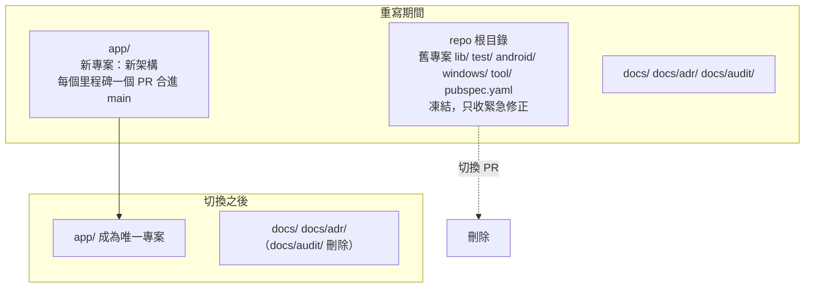

# 設計：重寫策略（高層）

## 1. 決定摘要

| # | 決定 | 來源 |
|---|---|---|
| D1 | 全新骨架＋搬運葉節點邏輯，不走逐步替換 | 使用者 2026-09-27 |
| D2 | 同一 repo 的 `main`，新專案在子目錄 `app/`；不開長期分支、不開新 repo | 使用者 2026-09-27 |
| D3 | 新 App 沿用舊 App 的身分識別 | 由 A3（全部自動遷移）推出 |

這三條會在本項核准後寫成一份 ADR（0008）。

## 2. 目錄形狀

- `app/` 是之後的永久位置，切換時只刪舊專案，不搬目錄。
- 葉節點邏輯**複製**進 `app/`（連同測試）後依新介面調整，不從 `app/` import 根目錄的程式碼。新舊之間沒有共用程式碼，也就沒有過渡層。
- `app/` 有自己的 `AGENTS.md`（agents.md 慣例：agent 讀最近的那一份），寫新架構的規則；根目錄 `AGENTS.md` 保留給舊專案的緊急修正，並加一句指向 `app/AGENTS.md`。Trellis spec 的分法在第 8 項定（可用 Trellis 的 package 範圍）。

## 3. App 身分識別

新 App 必須和舊 App 同一個身分，理由：Android 只有同一個 `applicationId`＋簽名金鑰才能讀舊 App 私有目錄裡的資料庫與 Keystore 保護的憑證；使用者的舊版才能直接升級成新版。

| 項目 | 現值 | 位置 |
|---|---|---|
| Android `applicationId`／`namespace` | `com.personal.fmp` | `android/app/build.gradle.kts:19,29` |
| Android 簽名金鑰 | 由 release secrets 提供 | `docs/build-and-release.md` |
| Windows AppUserModelID | `com.personal.fmp` | `windows/runner/main.cpp:43` |
| Windows 安裝包 AppId（Inno Setup） | `BAF6CE8D-E1C8-4C29-AE0B-EDE98D5F8FAA`（註解：發布後不可改） | `pubspec.yaml:121-122` |

開發版用不同的身分（U9，第 8 項定細節），與正式版可以同時存在、互不碰資料。

## 4. 舊版緊急修正與發版

- 重寫期間不發正式版。
- 舊版需要緊急修正時：在 `main` 上改根目錄舊專案，走一般 PR，照舊用 `vX.Y.Z` tag 觸發 `release.yml` 發版（release workflow 只建根目錄專案，不受 `app/` 影響）。這是例外，每次都先問使用者。
- 已決定不做的：N1 資料遺失不在舊版修（questions.md）。
- 新 App 第一次正式發版＝切換那一版：版本號接在舊版之後，舊版使用者透過應用內更新拿到它，首次啟動執行自動遷移（第 6 項設計）。

## 5. CI

- 現況：`ci.yml` 刻意不設路徑過濾（`ci.yml:3-7`，理由是純文字 commit 也可能改到有測試守的規則），全跑約 23 分鐘。
- 重寫期間要新增 `app/` 的 validate／build job。舊專案的 job 是否只在根目錄檔案變動時才跑、以及 main 上那個時序不穩的舊測試（`account_repository_test.dart:105-118`）會不會一直擋新 PR，在第 8 項決定。
  若第 8 項之前就開始寫 `app/`，先讓舊專案 job 照跑，遇到那個不穩的測試就重跑。

## 6. 切換（cutover）

條件（完成定義）：`features.md` 勾「保留」的功能在 `app/` 全部跑通；效能不低於 `perf-baseline.md`；舊資料自動遷移在真實資料副本上驗證過。

切換 PR 做的事：刪除根目錄舊專案與 `docs/audit/`；`release.yml`、`ci.yml`、`orca.yaml`、`tool/release/` 改指向 `app/`；根目錄 `AGENTS.md` 併入 `app/AGENTS.md` 或改為指路；舊 ADR 依第 9 項規則收尾。

## 7. 延後到第 7 項定稿

- 里程碑拆分與每個 child task 的範圍，包括第一個 tracer bullet 用哪個音源、跨哪些層。
- 各里程碑的驗收方式與效能量測時點。
