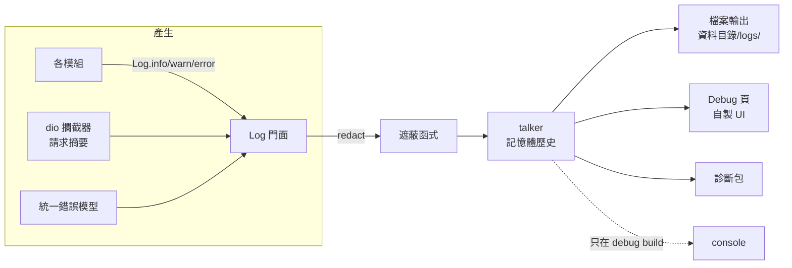

# 設計：設定與日誌基礎設施

採用的慣例：talker 作記憶體歷史與分派；Finamp `censored_log.dart` 的已知值替換；NewPipe 錯誤報告的診斷包欄位；
Spotube 以 drift 單列多欄存設定、Riverpod `watchSingle()` 接上。

## 1. 日誌

- **門面**：`app/lib/core/logging/`，提供 `debug／info／warning／error`，參數是訊息、tag（模組或音源 id）、error、stackTrace、結構化欄位。門面先呼叫遮蔽函式，再交給 `talker`。
- **talker 只當資料核心**：用它的歷史與分派；**不用** `TalkerScreen`（Debug 頁要用 App 的設計系統，第 4 項自做 UI），**不用** `talker_dio_logger`（會繞過遮蔽）。
- **輸出**：
  - 記憶體歷史：最近 1,000 筆。
  - 檔案：ADR 0009 的資料目錄下 `logs/`，單檔 2MB、保留 3 個（沿用舊值），寫入失敗不影響 App。
  - console：只在 debug build；release 版完全不輸出到 logcat／stdout。
- **層級**：release 預設 `info`；開發者模式可調到 `debug`（第 4 項定是否持久化）。
- **閘門**：門面以外禁止 `print`、`debugPrint`、`developer.log` 與直接 import talker（lint，第 8 項）。

## 2. 遮蔽函式

`app/lib/core/redaction/`，一個入口，四種策略依序套用：

| 策略 | 做什麼 | 名單來源 |
|---|---|---|
| header 名單 | `Cookie`、`Set-Cookie`、`Authorization`、`X-Goog-*` 類等整個值換成 `***` | 舊 `lib/core/logger.dart` 名單＋研究檔補充 |
| key 名單 | query 參數、JSON／form body 中的 `SESSDATA`、`bili_jct`、`MUSIC_U`、`refresh_token`、`access_token`、`csrf`、`apiKey`、`password`、`token` 等 | 同上 |
| CDN URL | 已知媒體主機（Bilibili upos、googlevideo、網易 CDN）的 URL 只留主機與路徑，簽名類參數（`upsig`、`deadline`、`sig`、`signature`、`lsig`、`expire` 等）去掉 | 舊 `redactStreamUrl`＋研究檔 |
| 已知值替換 | 帳號層把目前每個音源的實際憑證值登記進來；任何輸出中出現這些值就逐字換成 `***<來源>***` | Finamp 做法 |

- 套用在訊息、error 字串、**stackTrace**、結構化欄位。
- 名單集中在一個檔案；**每個音源插件可以追加自己的名單**（第 1 項介面的一部分）。
- 測試：每個音源一組「長得像真的」假憑證與假簽名 URL，斷言經過任何出口（log 檔、歷史、診斷包、網路紀錄）後都不再出現。

## 3. 網路紀錄

自己的 dio 攔截器，每個請求記一筆摘要：方法、主機、路徑、遮過的 query、狀態碼、耗時、回應大小、音源 id、錯誤類型（對應第 2 項）。
**不記 request／response body**。它透過門面寫入，所以和一般 log 一起出現在 Debug 頁、一起遮蔽、一起進診斷包。

## 4. 錯誤歷史

第 2 項的統一錯誤型別在被處理時，一律以 `warning` 或 `error` 經門面寫入，帶結構化欄位（錯誤類型、音源、對應的網路紀錄、使用者看到什麼）。
Debug 頁從歷史中篩出錯誤即為「可檢索的錯誤歷史」；跨重啟的歷史由 log 檔提供。

## 5. 診斷包

參考 NewPipe：一組欄位產生一份純文字（方便貼到 issue）加一份 JSON。
內容：App 版本與建置、平台與系統版本、語系、各音源是否啟用與登入狀態（只有是／否）、非敏感設定摘要、最近的 log 與錯誤歷史（已遮蔽）。
不含硬體識別資訊、帳號名稱、歌單內容。產生時從已遮蔽的歷史組裝，匯出（另存、複製、分享）只用這份結果。UI 在第 4 項。

## 6. 設定

- 依功能分組，每組一張**單列表**，每個設定一個有型別的欄位：播放、外觀、音樂庫與同步、下載、歌詞、網路、桌面、開發者。
  每組一個 Riverpod Notifier，監看自己那一列；寫入只更新改動的欄位。這消除舊版 19 個 Notifier 共寫同一列的問題。
- **欄位可為空＝使用者沒設定過**：讀取時空值套用程式裡的預設。改預設值只需改程式，不必寫 migration，使用者設定過的值不受影響（ADR 0010 的「migration 不改使用者值」由結構保證）。
- 每個音源的設定（例如「用登入狀態」、音質偏好）另一張表，以音源 id 為主鍵，音源插件不必改 schema 就能有自己的設定列。
- 分組內有哪些欄位，依 `docs/audit/data.md` §7 的設定總表在里程碑中逐組定案；使用者已勾「刪除」的功能，其設定不搬。
- 設定包含在備份中；legacy import 把舊設定的現值寫入（ADR 0010）。
