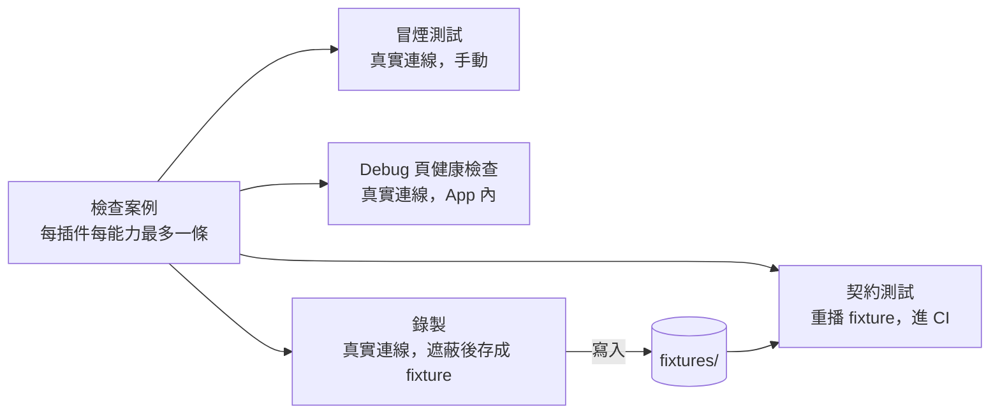

# 設計：測試、閘門與開發環境

範圍是 `app/`。根目錄舊專案的測試與 static-rule 原樣留著守舊程式碼，切換 PR 時隨舊專案一起刪（ADR 0008）；
舊專案唯一的改動是 CI 切分（§7）。

## 1. 測試分層與寫法

| 層 | 守什麼 | 怎麼跑 |
|---|---|---|
| 單元 | 純邏輯：匹配評分、遮蔽、重試與退避、設定預設值、`TrackKey` | `flutter test` |
| widget | 頁面與元件的行為，以 provider override 注入假資料 | `flutter test` |
| 插件契約 | 每個插件的檢查案例，重播 fixture（§3） | 契約執行器（§3.4） |
| 整合 | 只挑 tracer bullet 級流程：搜尋→播放、從檔案安裝插件、舊資料匯入 | `integration_test`，桌面 runner |
| golden | 只給設計系統的共用元件（清單在第 5 項定），`alchemist` 的 CI golden（Ahem 字型） | `flutter test` |

- 原則：測試守契約與使用者看得到的行為，不守實作細節；行為變更同一個 PR 補測試；用能證明該行為的最低層。
- 不設覆蓋率門檻（Flutter 官方也不給比例，`research/dev-env-and-ci.md` §6）。
- 正式程式碼不留測試掛鉤：假實作一律經建構子或 provider 注入。舊專案 75 個 `debug*` 成員中下載服務就有 44 處，是這條的來源（lint L6）。
- 從舊專案複製的葉節點連同它的測試一起複製（ADR 0008），包含 `pumpUntil`／`drainEventQueue` 等待助手。

## 2. lint 閘門

自寫規則放在 `app/packages/fmp_lints/`（官方 `analysis_server_plugin`），`app/analysis_options.yaml` 以 `plugins:` 啟用；
另開官方 `lints`／`flutter_lints` 與 `riverpod_lint`（落地時查證它已遷移到新插件系統）。

| 規則 | 內容 | 來源 |
|---|---|---|
| L1 `fmp_layer_imports` | 依賴方向表：`app/` 不 import 根目錄舊專案；`legacy_import` 不被其他模組 import，`isar_community` 只准在 `legacy_import` 內；`drift` 只准在資料層；平台套件只准在平台層；層與 feature 的方向在骨架建立時填表 | ADR 0008、0009、0010；舊 `layer_boundary`、`isar_boundary` |
| L2 `fmp_no_empty_catch` | catch 本體沒有任何陳述式（只有註解也算空）即違規；變數取名 `_` 不豁免（官方 `empty_catches` 會放行） | ADR 0013 |
| L3 `fmp_log_facade` | `print`、`debugPrint`、`dart:developer` 的 `log`、`talker` 套件只准在 log 門面內 | ADR 0011 |
| L4 `fmp_source_id_literal` | 官方插件 id 字串（清單寫在 lint 設定）只准出現在 `legacy_import`（舊 `SourceType` 對應插件 id）與測試 | ADR 0014；舊 `source_branch_points` |
| L5 `fmp_url_literal` | `http://`、`https://` 字面值只准在一個端點檔（App 自己的主機：更新檢查、官方插件 index） | 舊 `outbound_hosts`；插件的網域由 manifest＋宿主測試守 |
| L6 `fmp_no_for_testing` | `lib/` 內不得宣告名稱以 `ForTesting` 結尾的成員 | §1 |
| L7 `fmp_http_client_owner` | `Dio(` 只准在網路模組內建構 | ADR 0012 |
| L8 `fmp_test_waits` | 測試內直接呼叫 `pumpEventQueue` 只准在等待助手內 | 舊 `wait_convention` |
| L9 `fmp_ignore_reason` | `// ignore: fmp_…` 同行必須寫理由 | 全域偏好「停用規則要註解原因」 |
| L10 `fmp_platform_checks` | `Platform.isXxx`、`defaultTargetPlatform`、`Platform.operatingSystem` 只准在平台層 | ADR 0009 |

- 每條規則以 `analyzer_testing` 寫雙向變異測試：`assertDiagnostics` 造違規證明會紅，`assertNoDiagnostics` 改無關的命名或格式證明不紅。
- **接線哨兵**：`flutter analyze` 目前不顯示插件診斷還回報 No issues（flutter/flutter#193203）。CI 跑 `dart analyze --fatal-infos`，
  另由 `app/tool/check_lint_wiring.dart` 暫時放一個違規檔進 `lib/`、斷言 `dart analyze` 失敗且輸出含規則名，再移除。
  它證明的是「規則有接上 `app/`」，規則邏輯本身由上一條的規則測試證明。
- `AGENTS.md` 列的每條靜態規則都要寫出對應的規則名；沒有規則守的就不寫進去。

## 3. 檢查案例、fixture 與契約測試

### 3.1 檢查案例（一份四用）



插件目錄（`1morr/fmp-plugins` 每插件一目錄，ADR 0014）：

```
<plugin-id>/
  manifest.json
  index.js
  checks.json          # 檢查案例：能力、輸入、期望（非空、欄位存在、錯誤類別）
  fixtures/<case>/001.json, 002.json …   # 一次請求／回應一個檔，依呼叫順序
```

錯誤案例（401、412、B 站 -352 等）可以手改 fixture，`meta.capturedBy` 記為 `manual-edit`。

### 3.2 fixture 格式

每檔 `meta`（`recordedAt`、`pluginId`、`pluginVersion`、`capturedBy`）＋`request`（method、url、headers、body）＋`response`（status、headers、body）。
重播比對：method＋URL（query 排序後比）＋順序；**被遮蔽的欄位不參與比對**（簽名、時間戳這類每次都變的參數本來就在遮蔽名單裡）。
比對不到就讓測試失敗並印出請求，不回傳空值。fixture 不自動過期，上游改版由冒煙測試或健康檢查發現。

### 3.3 錄製與遮蔽

- 錄製與重播都在宿主網路層最底部的 dio `HttpClientAdapter`：重播 adapter 取代真實 adapter，腳本與攔截器照常運作。
- 這一層看到的請求已含攔截器注入的憑證，所以寫檔前一律經 ADR 0011 的正式遮蔽函式（不另寫一份測試用規則），插件 manifest 的遮蔽追加同樣生效。
- 閘門：一支測試掃描所有 fixture，已知憑證欄位（cookie、authorization、set-cookie、簽名 query、CDN 簽名 URL）不得有未遮蔽值。
  插件庫 CI 與 `app/` 的測試 fixture 都跑。

### 3.4 契約執行器

- 一個通用套件，對每個檢查案例：載入插件 → 以重播 adapter 執行 → 斷言。斷言內容：
  - manifest 宣告的能力與實際匯出的函式一致；輸出通過 DTO 驗證；符合案例期望。
  - 錯誤案例對到預期的 `AppError` 類別（ADR 0013）。
  - 媒體請求不帶憑證、`AuthRequirement` 生效（ADR 0012）。
  - 請求只連 manifest 網域；log 輸出經過遮蔽（ADR 0011）。
- 執行環境：`flutter_js` 的原生 QuickJS 在 `flutter test`（純 Dart VM）不會自動載入，要先建好動態庫再指定路徑。
  第一個里程碑實測；不可行就改在桌面 `integration_test`（Linux runner＋xvfb）執行，它跑的是真的 App 二進位。
- 插件庫 CI 以固定的 FMP commit／tag（對應 `apiVersion`）執行它。`app/` 的 CI 則對 `app/test/fixtures/plugins/` 內的小型測試插件執行，
  涵蓋每種能力與錯誤，不依賴官方插件庫。

### 3.5 App 內插件開發工具（已決定 A）

開啟開發者模式後可用：
- 從資料夾載入插件、重新載入；
- 跑檢查案例（真實連線）並看該插件的 log；
- 錄製模式：以 App 內已登入的帳號執行案例，遮蔽後寫進該插件資料夾的 `fixtures/`；
- 每插件網路模式：真實／錄製／重播。重播讓開發時不必一直打真實 API。

「從資料夾載入」先只在桌面平台提供，由平台層宣告能力（ADR 0009）；Android 仍可從檔案或網址安裝。
健康檢查（真實連線跑已安裝插件的案例）所有平台都有。版面在第 4 項設計。

### 3.6 測試插件

`app/test/fixtures/plugins/` 放一個測試插件：資料是合成的，播放指向隨測試附帶的本機音檔。
它同時用在 `app/` 的契約與整合測試，以及開發版的離線開發（不必安裝官方插件就能搜尋、播放）。

## 4. 零聯網

- `app/dart_test.yaml`：`tags: live: skip: "<理由>"`，另設 `presets: live` 解除；裸 `flutter test` 一律跳過（已查 dart-lang/test 設定文件）。
- `app/test/flutter_test_config.dart`：`HttpOverrides.global` 讓建立真實 `HttpClient` 直接丟 `StateError` 並說明原因；
  真的要聯網的測試在自己的 zone 內用 `HttpOverrides.runZoned` 明確放行。
- JS 腳本沒有 socket，只能經宿主 `http.request`（ADR 0014），所以也在這個範圍內。
- 冒煙測試＝檢查案例的真實連線模式：插件庫以 `--live` 手動執行，或在 App 的健康檢查執行。**不進任何 CI、不排程**：
  B 站對機房 IP 回 412 風控、YouTube 自 2024 起擋機房 IP，排程只會固定觸發風控並暴露憑證。

## 5. 開發版

- 兩個 flavor：`dev`、`prod`；`pubspec.yaml` 設 `flutter: default-flavor: dev`（context7 查證），不帶參數的 `flutter run` 一定是開發版。
  `release.yml` 明確帶 `--flavor prod`。
- 依 flavor 切換：

  | 項 | prod（ADR 0008 固定值） | dev |
  |---|---|---|
  | Android `applicationId` | `com.personal.fmp` | 加 `applicationIdSuffix ".dev"` |
  | Windows AppUserModelID | `com.personal.fmp` | `com.personal.fmp.dev` |
  | App 名稱、視窗標題、圖示 | FMP | FMP Dev，圖示加標記 |
  | 資料目錄、單一實例鎖名稱、secure storage 命名空間 | 正式值 | 加 `-dev` 後綴 |

  Windows 的 AppUserModelID、鎖名稱與資料目錄不在官方 flavor 的範圍內，要自己依 `appFlavor`／`FLUTTER_APP_FLAVOR` 接上（推測可行，第一個里程碑實測）。
- 開發版資料預設空白（已決定 A）。要真實資料時用一般功能帶進去：
  - 舊版資料：在開發版執行舊資料匯入並選一個資料夾副本。開發版拒絕直接讀舊版的正式資料位置（Windows `Documents\FMP`），避免開啟時寫到真實資料。
  - 新版資料：用正式版的匯出備份（不含帳號與 Cookie）。
- Android 開發版身分不同，讀不到舊版私有資料：Android 上的舊資料遷移驗證在模擬器上以 prod flavor 做，不在真機上做。
- 閘門：測試斷言 prod 的身分值與 ADR 0008 一致、dev 的每一項都不同；開發版拒絕正式資料路徑也有測試。

## 6. 舊 static-rule 的去向

「不帶過去」＝ `app/` 不需要（舊專案的那支照舊守舊程式碼）。

| 舊規則 | 去向 | 理由 |
|---|---|---|
| `core_source`（授權註冊順序） | 不帶過去 | 綁舊 `main.dart` 的呼叫順序 |
| `isar_boundary` | L1 | Isar 只剩 `legacy_import` 在用（ADR 0010） |
| `source_ownership` | 不帶過去 | 沒有內建音源；改由 L4 與宿主邊界守 |
| `riverpod3` | 不帶過去 | 綁舊 provider 錨點；改用 `riverpod_lint`；retry 關閉另有測試（ADR 0013） |
| `audio_backend_shared_rules`、`audio_seam`、`playback_event_routing` | 第 13 項決定 | 依播放核心的新結構 |
| `lyrics_window_strings` | 第 15 項決定 | 若保留子視窗，改以型別化訊息，型別本身就能擋 |
| `settings_backup_coverage` | 改成測試 | 以 drift 表的欄位比對備份匯出與匯入（ADR 0011 的分域設定表） |
| `android_manifest`（`allowBackup="false"`） | 保留為設定測試 | 系統備份會帶走資料庫卻帶不走 Keystore 裡的憑證 |
| `audio_provider_size` | 刪 | 行數預算不守行為 |
| `call_site_ownership` | 拆掉 | UI 直接叫音源改由 L1 守；自訂標題列與直播改由平台層能力決定（ADR 0009） |
| `layer_boundary` | L1 | — |
| `live_source_tag` | 刪 | 由 §4 的兩道防線取代 |
| `outbound_hosts` | L5＋manifest 網域 | — |
| `periodic_timer` | 第 16 項決定 | 背景任務若集中排程，再加 lint 禁止入口外的 `Timer.periodic` |
| `source_branch_points` | L4 | 計次預算改成直接禁止 |
| `source_http_policy` | L7＋ADR 0012 網路層測試 | — |
| `static_rule_placement` | 刪 | 讀原始碼的測試由 lint 取代 |
| `wait_convention` | L8 | — |
| `error_presentation` | 用型別擋 | ADR 0013 的呈現 API 只收 i18n key；其餘細節由第 3 項定 |
| `slider_overlay` | 第 5 項決定 | 先在目前的 Flutter 版本重現 Windows 無障礙樹凍結，仍會重現才加 lint |
| `ui_consistency`（圖片） | 第 5 項決定 | 依新的設計系統元件 |
| `watch_scope` | 不帶過去 | 綁舊的寬 provider |
| `test/workflows/*`（含 `dependabot_group`） | 第 19 項決定 | 依新的發版與依賴更新流程 |

## 7. CI

- 一個 `changes` job 用 `dorny/paths-filter`（以 commit SHA 釘版本，與現有慣例一致）：
  - `app`：`app/**`、`.github/**`；
  - `legacy`：`app/**` 以外的全部（含 `.github/**` 與文件）。
  - 依專案切分，不依「是不是程式碼」切分：舊檔頭「文件承載規則，純文件改動不能跳過」的理由照樣成立。
- `app` 的 job：
  - format、`dart analyze --fatal-infos`、接線哨兵、`flutter analyze`；
  - `fmp_lints` 規則測試、`flutter test`（不加參數，零聯網有保證）、契約執行器；
  - 建置矩陣：Android、Windows、Linux、macOS、iOS（`--no-codesign`），來自 ADR 0009；
  - 整合測試：Linux（xvfb）與 Windows。
- `legacy` 的 job 維持現狀，只在根目錄有變動時跑。所以 `app/` 的 PR 不會被舊專案的不穩測試擋住（回答 ADR 0008 留下的問題）。
- 一個 `always()` 彙總 job 當唯一的必要檢查，跳過的 job 不算失敗。
- 公開 repo 的 GitHub-hosted runner 免費不限分鐘，矩陣不為省時間縮減。
- 冒煙測試不進 CI（§4）。

## 8. 第一個里程碑要實測的項目

- 在 `app/` 上用 `dart analyze` 看得到插件診斷，接線哨兵會紅；比對 `flutter analyze` 的輸出差異。
- 契約執行器能否在 `flutter test` 內載入 QuickJS；不行就改用 `integration_test`。
- dev 與 prod 同時開啟：AppUserModelID、單一實例鎖、資料目錄各自獨立。
- 故意寫一個聯網測試：裸 `flutter test` 會跳過它；放行 tag 執行時，`HttpOverrides` 會擋下沒有明確放行的連線。
