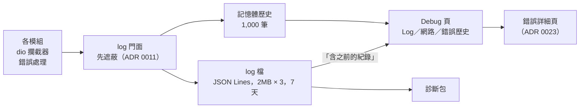

# 設計：Debug 頁與開發者模式

## 1. 開發者模式（已決定）

- **狀態**：放在設定的「開發者」組（ADR 0011，每組一張單列表，空值＝未設定）。
  - `developerMode`：空值時套用程式預設，prod 為關、dev flavor 為開。
  - `logLevel`：空值＝info。
- **開啟**：「設定 → 關於」的版本列連點 7 次。
  - 第 2 次起提示「再點 n 次」，離開頁面計數歸零（Firefox `SecretDebugMenuTrigger` 的做法）。
  - 開啟後寫入設定。
- **關閉**：Debug 頁「概覽」最上方的總開關。關閉時同一筆寫入做三件事：
  - `developerMode` 設為 false；
  - `logLevel` 清為空值，也就是回到 info；
  - 若插件開發工具載入了資料夾，一併卸載。
- **它控制的東西**（全部讀同一個 provider）：
  - 設定頁的「開發者選項」入口；
  - 錯誤提示的「詳細」（ADR 0023）；
  - log 層級可調到 debug（ADR 0011）；
  - Debug 頁各路由；
  - 插件開發工具（ADR 0015）。
- **路由閘門**：Debug 頁的路由在開發者模式關閉時 redirect 回設定頁，連結直達也進不去。舊版是無條件註冊（`router.dart:246-263`）。

## 2. 版面（已決定）

- 沿用設定頁的 list-detail（ADR 0024）：
  - expanded 以上：左列區塊、右顯示內容；
  - compact、medium：區塊清單，點進子頁。
- 全部用 ADR 0024 的 token 與元件，字串走 slang（三語言）。舊版有寫死的簡中與英文（`developer_options_page.dart:307`、`log_viewer_page.dart:208-212`）。
- 區塊依序如下。

| # | 區塊 | 內容 | 平台 |
|---|---|---|---|
| 1 | 概覽 | 總開關、log 層級、版本／flavor／平台／資料目錄、快取用量連到設定頁（ADR 0016）、產生診斷包 | 全部 |
| 2 | Log 與錯誤歷史 | 見 §3 | 全部 |
| 3 | 網路 | 見 §4 | 全部 |
| 4 | 播放狀態 | 見 §5 | 全部 |
| 5 | 音源健康檢查 | 見 §6 | 全部 |
| 6 | 插件開發 | 見 §7 | 平台層宣告 `pluginDevTools` 的平台（先桌面） |
| 7 | 資料庫 | 見 §8 | 全部 |
| 8 | 重設資料 | 見 §9 | 全部 |

- release 版只要開了開發者模式，以上全部可用。
- debug build 另可用 drift 官方 DevTools extension（隨 `drift` 出貨，release 編譯期移除），不另寫程式。
- 拿掉舊版的記憶體磚：數字是粗估，清除按鈕也只清記憶體圖片快取。要看記憶體用 DevTools。

## 3. Log 與錯誤歷史

- **log 檔格式改為 JSON Lines**：一筆一行，欄位含時間、層級、tag、訊息、error、stackTrace、結構化欄位。
  - 理由：錯誤歷史跨重啟要從檔案讀回，還要能依錯誤類型、音源篩選。舊版的純文字行（`[LEVEL] [tag] message`）讀回後分不出欄位。
- **檢視**：
  - 預設只看這次執行的記憶體歷史。
  - 開「含之前的紀錄」才在 isolate 解析 log 檔，最多 6MB，併進清單。
  - 篩選：層級、tag（模組或音源 id）、文字。
  - 「只看錯誤」＝錯誤歷史（warning 以上且帶錯誤類型）。點一筆開 ADR 0023 的詳細頁。
- **動作**：
  - 複製已篩選的清單；
  - 匯出 log 檔，走診斷包的匯出管道（§10）；
  - 「清除 log」：同時清記憶體與檔案（舊版只清記憶體，`log_viewer_page.dart:150-155`）。
- **保留（已決定）**：
  - 大小依 ADR 0011，2MB × 3；
  - 最後修改超過 7 天的檔案，在啟動維護清單（ADR 0017）中刪除，先到哪個限制就先刪；
  - 不做設定項。

## 4. 網路

- 資料來源是 log 門面裡 tag 為網路的紀錄，不另存一份（ADR 0011 §4：dio 攔截器每請求一筆摘要）。
- 摘要以 `info` 層級寫入，所以 release 版也看得到；失敗的請求另外帶錯誤類型，一併進入錯誤歷史。
- 清單欄位：時間、方法、主機、路徑、狀態、耗時、大小、音源。
  - 篩選：音源、狀態碼類別（2xx／3xx／4xx／5xx／失敗）、文字。
- 單筆詳細：遮過的 query、錯誤類型、對應的錯誤紀錄。不記 body，也就沒有 body 可看（ADR 0011 已否決記 body）。
- 沿用 LocalSend 的 HTTP Logs 頁：記憶體清單、可清除、可逐筆複製；並加上篩選。

## 5. 播放狀態

- 即時顯示 ADR 0018 的播放狀態：
  - sealed 狀態名，`Failed` 時附 `AppError`；
  - 目前曲目：插件 id、曲目鍵；
  - 串流：格式、位元率、容器、來源類型（線上、快取、已下載）；
  - 音訊後端、輸出裝置、重試次數與下次重試時間。
- 位置與緩衝位置來自獨立 stream，以每秒一次節流顯示，不讓 Debug 頁拖慢播放 UI。
- 佇列：總數、目前索引、前後各 5 首、隨機與循環模式。
- 「複製快照」：以上內容的 JSON。串流網址經遮蔽函式，簽名參數被去除（ADR 0011 §3）。
- 只讀，不提供操作；播放控制仍只經 `AudioController` 一個入口。

## 6. 音源健康檢查

- 對已安裝、已啟用的插件，逐一跑它 `checks.json` 裡的案例，以真實連線執行（ADR 0015 §4 的第三種用法）。
- 手動觸發：「全部檢查」或單一插件，一次跑一個插件，避免同時打多個音源。
- 結果依插件列出每個案例：
  - 通過或失敗；
  - 耗時；
  - 失敗時附 `AppError` 類別，可開詳細頁。
- 結果經 log 門面以 tag `health` 寫入，不另外存。
- 需要登入的案例在未登入時標「略過（未登入）」，不算失敗。

## 7. 插件開發（ADR 0015 §7 的版面）

- 只在平台層宣告 `pluginDevTools` 的平台出現（ADR 0009），先限桌面三平台。
  - 理由：Android 以 file_picker 選資料夾後讀不到其中的 `.js`（研究推測，未實機）；ADR 0015 已限桌面。
- **載入**：以 `file_selector.getDirectoryPath` 選插件資料夾，路徑記在「開發者」組。
  - 資料夾中的插件以「開發中」標記，本次執行期間取代同 id 的已安裝插件。
  - 卸載後恢復已安裝版。
- **重新載入**：手動按鈕，拆掉該插件的 JS runtime 再重建。
  - 沿用 LX Music（切換＝銷毀重建）與 VS Code「Reload Window」的做法。
  - 不做檔案監看自動重載：編輯器存檔到一半時重載會讀到半個檔案，而且 MusicFree、LX Music 都沒有這個功能。
- **每插件模式**：真實、錄製、重播（ADR 0015 §5）。錄製的 fixture 經遮蔽後寫到插件資料夾的 `fixtures/`。
- **跑案例**：列出 `checks.json` 的案例，可以單跑或全跑，顯示回傳值（已遮蔽）與錯誤。
- **log**：同一個 Log 檢視，預設篩成該插件的 tag。

## 8. 資料庫（已決定）

- **唯讀瀏覽**：
  - 列出 `allTables`，附各表筆數；
  - 點進表以 `select(table)` 分頁，每頁 50 列。
  - 每個值轉字串後經遮蔽函式。插件 storage 表的值整欄遮蔽（可能含 token）；憑證本身在 secure storage，不在資料庫（ADR 0012）。
  - 自己寫，不用 `drift_db_viewer`：該套件 2.5 年沒發版，也做不到遮蔽。
  - 不在 App 內編輯：要做寫入介面，還會和 App 自己的寫入者衝突。
- **資料檢查**（手動按鈕，只報告，不自動修）：
  - `PRAGMA integrity_check`：檔案是否損壞；
  - `PRAGMA foreign_key_check`：有沒有違反外鍵的列；
  - 孤兒曲目數（ADR 0019 的判定查詢）、「檔案遺失」的下載數（ADR 0020）。這兩項只顯示，處理交給各自的機制。
  - 有問題時提供「從備份還原」（ADR 0010）與「重設資料」（§9）。
- **不移植 `DataIntegrityRepository.scan/repair`**：它查的四件事在新 schema 下由唯一鍵、主鍵、單列表擋住。
- **不在啟動時自動檢查**：`integrity_check` 會掃整個檔案，拖慢啟動。資料庫打不開時的處理屬於啟動流程，不在本 ADR 範圍。

## 9. 重設資料（已決定）

- 範圍：
  - 清空：資料庫（含設定與匯入紀錄）、secure storage 中 FMP 的憑證、快取。
  - 不動：已下載的檔案、使用者資料夾裡的 sidecar、log 檔。
- 流程：
  1. 以 ADR 0010 的備份格式自動備份到資料目錄的 `backups/`；
  2. 確認對話框列出備份檔位置；
  3. 使用者確認後清空；
  4. 重啟 App。
- 備份失敗就不清空，並顯示錯誤。

## 10. 診斷包與匯出管道

- **內容**：ADR 0011 §6 的欄位，產生時組裝一次。
  - 純文字 `diagnostics.txt`、JSON `diagnostics.json`；
  - 加上目前的 log 檔。log 在寫入時已經遮蔽，組裝時不再重新遮蔽。
- **動作**：
  - 「複製」：只複製純文字摘要，不含 log；
  - 「存檔」：產生 `fmp-diagnostics-<時間>.zip`；
  - 「分享」：Android、iOS、macOS、Windows 以 `share_plus` 分享 zip。
- **存檔與分享由平台層宣告**：
  - 桌面「存檔」用 `file_selector.getSaveLocation`；Android 用系統的建立文件對話框。
  - `share_plus` 在 Linux 與 Windows RS5 以下不能分享檔案，這些平台不顯示「分享」。
- 第一次匯出時提醒「內容已遮蔽，送出前仍請檢查」，與 ADR 0023 的回報提醒共用同一個「不再提醒」設定。
- 暫存的 zip 在分享完成後刪除，殘留的由啟動維護清單清掉。

## 11. 閘門

- **既有 lint**：Debug 頁內的平台判斷同樣受 `fmp_platform_checks` 管；只能讀平台層宣告的能力，不寫 `Platform.isX`（舊版 `developer_options_page.dart:202`）。
- **單元測試**：
  - 開發者模式：連點 7 次開啟並寫入設定；關閉時 `logLevel` 清空、開發資料夾卸載；dev flavor 預設開。
  - log 保留：超過 7 天的檔被刪、未滿 7 天的保留；大小與天數同時作用。
  - log 檔 JSON Lines 讀回後欄位與寫入一致；壞行略過、不讓解析中止。
  - 網路篩選：依音源與狀態碼類別。
  - 資料檢查：人為造一筆違反外鍵的列（先關外鍵寫入再打開），報告列出它；乾淨資料庫報告無問題。
  - 重設：備份失敗時不清空；成功時已下載的檔案仍在。
  - 遮蔽：播放快照、資料庫瀏覽、診斷包都不含假憑證與假簽名網址（併入 ADR 0011 的遮蔽測試）。
- **widget 測試**：
  - 開發者模式關閉時直接進 Debug 路由會被 redirect；
  - 未宣告 `pluginDevTools` 的平台不顯示插件開發區塊；
  - 未宣告檔案分享的平台不顯示「分享」。
- **第一個里程碑實測**：
  - Windows release 版開啟開發者模式，重啟後仍開啟，再從總開關關掉；
  - 在 Debug 頁看到一次搜尋的網路摘要；
  - 匯出診斷包並用解壓工具打開。

## 12. 相關 ADR 的指向

- 0011：開發者模式的持久化、log 保留期限與 log 檔格式由 0025 定。
- 0015：插件開發工具的版面由 0025 定。
- 0023：Debug 頁錯誤歷史的入口見 0025。
- 0017：啟動維護清單加入 log 檔保留與診斷包暫存清理。
