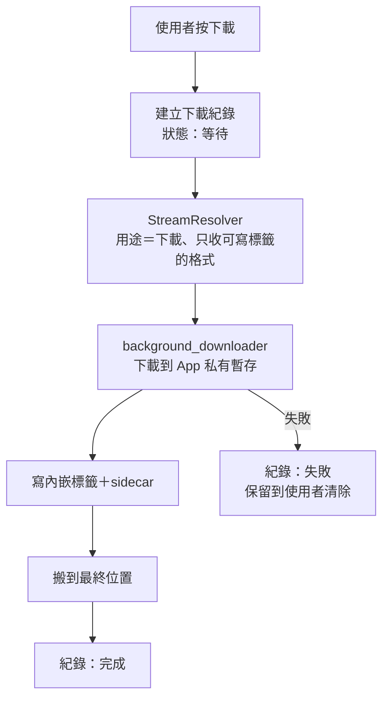

# 設計：下載與權限

## 1. 流程

- 下載由宿主處理（ADR 0014），串流經插件 `resolveStream`，用途標為「下載」，不走記憶體網址快取（網址要新鮮）。
- **先下載到 App 私有暫存目錄**（可暫停續傳），寫完標籤再搬到最終位置。這樣最終資料夾裡不會出現半成品，寫標籤失敗也不會弄壞已完成的檔案。

## 2. 下載引擎與佇列

- 使用 `background_downloader`（跨五個平台同一套 API）。在 Android 上 App 進背景仍繼續下載（WorkManager／Android 14+ 使用者發起工作，需通知）；
  **桌面只在 App 執行中下載**：最小化或縮到托盤時照常下載，關掉 App 就暫停，下次開啟時自動續傳。Flutter 生態沒有桌面真背景下載方案。
- 下載請求帶插件候選串流回傳的標頭（Referer 等），**不帶帳號憑證**（ADR 0012 媒體請求的規則）。
  這是網路層之外唯一的 HTTP 出口：下載網址寫 log 前一律經 ADR 0011 的遮蔽函式，測試以假的下載器介面注入（零聯網，ADR 0015）。
- 並行上限：設定「同時下載數」1–5，預設 3（沿用）；同一主機最多 2 個。事件驅動，不輪詢（舊版每 5 秒的備援輪詢不帶過去）。
- 進度由套件的 stream 提供；進度不寫資料庫，狀態轉換（等待、下載中、暫停、完成、失敗）才寫。

## 3. 續傳與重試

- 暫停與續傳由套件處理，續傳時以強 ETag 驗證；伺服器不支援或 ETag 不符就從頭下載（N4）。
- 網址過期（ADR 0016 的 `expiresAt`）或 403：重新解析一次後從頭下載（音檔多為數 MB，重下成本低，不需要跨網址接續）。
- 網路錯誤由套件以指數退避重試 2 次；仍失敗標「失敗」並附 ADR 0013 的錯誤類別。無法取得、找不到等不重試。
- 失敗與暫停的任務跨重啟保留，直到使用者重試或清除（N7）。

## 4. 位置、組織與命名（已決定 A′）

- 每首歌只存一份：
  - 單曲：`{根目錄}/{音源}/{標題} [{影片 id}].{副檔名}`；
  - 多分 P：`{根目錄}/{音源}/{影片標題} [{影片 id}]/P01 {分P標題}.{副檔名}`。
  
  `{音源}` 用插件 id（穩定、不隨顯示名稱改變）。
- 檔名：非法字元換全形、去尾點、避開 Windows 保留名；標題截到 80 字，讓整條路徑在 Windows 260 字元上限內。
- 下載紀錄存**絕對路徑**；「已下載」頁的歌單分類由資料庫關聯算出（曲目在哪些歌單），不在任何歌單的曲目歸「其他」。
- 根目錄預設：Android `Music/FMP`，Windows `%USERPROFILE%\Music\FMP`，Linux 的 XDG 音樂目錄下 `FMP`；iOS／macOS 依 ADR 0009 待平台任務定。
  舊資料匯入時沿用舊版的下載目錄。
- Android 可在設定頁更改根目錄並重新授權（N2）。更改時詢問「搬移現有下載」或「只改之後的下載位置」；舊檔不動時紀錄的絕對路徑仍有效（N3、N8）。
- Android 寫入使用者看得到的資料夾沿用 `MANAGE_EXTERNAL_STORAGE`＋路徑（舊 ADR 0004 的做法；FMP 不上架商店）。

## 5. 格式、標籤與 sidecar（已決定：只挑可寫標籤的格式）

- 下載時，宿主傳給 `resolveStream` 的可接受格式只有 m4a（AAC）、flac、mp3；YouTube 下載因此取 AAC。播放不受影響。
- 副檔名照實際格式（N6）。
- 內嵌標籤：標題、歌手（音源回報的值，多為上傳者）、專輯（多分 P 用影片標題）、封面、備註欄寫來源網址。
  候選套件 `audio_metadata_reader`（純 Dart、支援 m4a／flac／mp3 寫入且原子寫入），落地前驗證寫入結果能被常見播放器讀到。
- sidecar 保留（B13）：同檔名的 `.json`（曲目鍵、音源、影片 id、分 P、標題、時長、下載時間）與 `.jpg` 封面；「封面＋頭像」選項另存 `.avatar.jpg`。
  sidecar 是檔案遺失資料庫時認回曲目的依據。

## 6. 與音樂庫的關聯與對帳（N1、N9）

- `downloads` 表：曲目鍵（FK）、絕對路徑、格式、大小、狀態、錯誤、建立與完成時間。曲目在「沒有被任何歌單項目、佇列、下載紀錄參照」時才算孤兒（ADR 0019）。
- 刷新把曲目移出歌單時不刪下載（ADR 0019）；下載只由使用者在下載頁刪除（刪檔、sidecar 與紀錄）。
- **啟動對帳**（登記在啟動維護清單，ADR 0017）：
  - 紀錄的檔案不在：標「檔案遺失」，**不刪紀錄**。播放時改走線上，下載頁提供「重新下載」或「移除紀錄」（N9）。
  - 整個根目錄不存在或不可讀（例如 SD 卡拔出）：標「儲存位置無法使用」，全部紀錄不動，之後再檢查。
  - 根目錄內有 sidecar 或檔名帶影片 id、但沒有紀錄的檔案：自動建立紀錄並連回曲目（曲目不存在時依 sidecar 建立）。
  - 對帳永遠不自動刪檔或刪紀錄（舊版「掃不到就清路徑」是 N1 的來源）。
- 舊資料匯入（ADR 0010）：舊下載檔留在原位，依 sidecar 的 `metadata.json` 建立下載紀錄，不強制搬檔。

## 7. 權限統一入口（N10、N11）

- 平台層提供 `PermissionGateway`，依能力宣告需要的權限（ADR 0009）：
  - 寫入下載資料夾（Android `MANAGE_EXTERNAL_STORAGE`）；
  - 下載通知（Android 13+ `POST_NOTIFICATIONS`，第一次下載時請求）；
  - 安裝更新（Android `REQUEST_INSTALL_PACKAGES`，第 19 項使用）。
- 流程一致：
  1. 說明為什麼需要；
  2. 請求；
  3. 被拒時說明影響並提供「前往系統設定」；
  4. 回到 App 時重新檢查。

  永久拒絕與一般拒絕分開處理。
- 套件：Android 使用 `permission_handler`。舊版刻意避開它，是因為它在 Windows 上會讓 FMP 顯示成使用位置權限；研究顯示其 Windows 實作現為 no-op。
  **第一個加入下載的里程碑實測**：Windows 隱私設定中 FMP 是否仍出現在位置清單。會出現就改為 Android 專用的自有 MethodChannel（舊版做法）。
- 下載通知權限被拒時照樣下載，只是沒有通知；儲存權限被拒時不開始下載並引導設定。

## 8. 設定

- 下載音質（高／中／低，預設高）與播放音質分開（N5）。
- 同時下載數（1–5，預設 3）、下載圖片選項（只封面／封面＋頭像）、下載根目錄沿用。

## 9. 閘門

- 單元測試（假下載器）：
  - 佇列與並行上限；
  - 失敗任務跨重啟保留；
  - 網址過期時重新解析並從頭下載；
  - ETag 不符從頭下載；
  - 格式過濾只收可寫標籤的格式；
  - 暫存 → 標籤 → 搬移的順序，任一步失敗時最終資料夾沒有半成品。
- 對帳測試：
  - 檔案遺失標記不刪紀錄；
  - 根目錄不可用時不動紀錄；
  - 無紀錄的檔案依 sidecar 或檔名認回；
  - 從不刪檔。
- 路徑測試：檔名清理、Windows 路徑長度、保留名。
- 權限流程測試（假的 `PermissionGateway`）：拒絕、永久拒絕、從設定回來重新檢查。
- 依賴方向（`fmp_layer_imports`）：`background_downloader` 只在下載模組、`permission_handler` 只在平台層。
