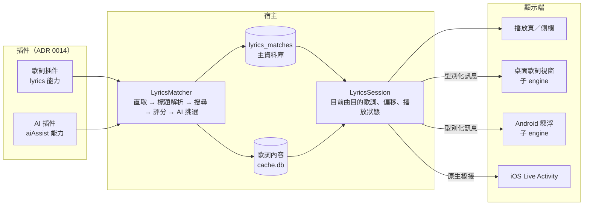

# 設計：歌詞

## 1. 全貌



## 2. 插件能力

### 2.1 `lyrics`（歌詞源）

- `searchLyrics({title, artist, album?, durationMs})` → 候選清單：`id`、標題、歌手陣列、專輯、時長、`hasSynced`、`hasWordSync`、`hasTranslation`、`hasRomaji`。
- `getLyrics({id})` → 歌詞文件（§3）。
- `lyricsForOrigin({platform, platformId})`：插件宣告自己認得的原始平台（例如網易插件認 `netease`）。曲目本身來自該平台，或 `track_origins` 有該平台 id 時，直接取、跳過搜尋。
- 搜尋與取用分開，才能做候選清單（MusicFree、Lyricify 的慣例）。同一插件可同時是音源與歌詞源（網易）。
- 第三方歌詞源不帶登入（ADR 0012 的 `never`）。

### 2.2 `aiAssist`（AI 服務，新增能力）

- `parseTitle({title, uploader})` → `{title, artist, artistConfidence}`。
- `pickCandidate({query, candidates})` → `{decision: chosen | noneMatch | unsure, candidateId?, confidence?}`。
  - `chosen`：採用；`noneMatch`：這次不自動匹配（等同舊版 AI 回 null）；`unsure`：退回評分核心的結果。
  - 確定度門檻的解讀在插件內（各家 confidence 定義不同，Laya 文件明說不能沿用 Jev 的門檻），插件自己的設定可調門檻。
- 一個插件可只實作其中一個。官方兩個：
  - `openai-compatible`：兩者都做（chat completions、要求 JSON）。
  - `system-one`：`/v1/systemone` 的 Choice 題做候選挑選；標題解析改為「宿主正則列出的幾種拆法」當選項（官方 cookbook 的 pre-parsed value extraction 模式）。可接 TypeSafe、OpenRouter、自架 Laya。
- **manifest `userEndpoint`**：端點由使用者填。宿主檢查 https，把該網域顯示在設定頁、使用者確認後才加入這個插件的允許網域。
- key 存插件憑證區（ADR 0014 `credentials`，secure storage），不進 log、不進備份。

## 3. 歌詞文件（DTO，隨 `apiVersion` 版本化）

```text
LyricsDocument
  kind: synced | plain | instrumental
  lines: [ { startMs, endMs?, text, words?: [ { startMs, endMs, text } ] } ]   # 字時間一律絕對毫秒
  translation?: [ { startMs, text } ]      # 行級
  romanization?: [ { startMs, text } ]     # 行級
  lrc?: string                              # 只有 LRC 時可直接回原文，由宿主解析
  sourceUrl?, attribution?
```

- **各家格式由插件轉換**：YRC、QRC（非標準 DES）、KRC（XOR＋zlib，插件可內附純 JS 的 inflate）在插件裡解成 `lines`，宿主不寫 QRC／KRC 解析器。KRC 的字時間相對行首，插件要換成絕對時間。
- **宿主只有一個 LRC 解析器**（搬舊 `lrc_parser.dart` 的邏輯與測試，加上 enhanced LRC 的 `<mm:ss.xx>` 字時間），給 `lrc` 欄位用。
- **合併**：翻譯與羅馬音以行開始時間對齊，容差 100ms（LX 的做法），對不上的行丟棄。
- **降級**：沒有 `words` 或使用者關掉逐字時逐行顯示；逐字→逐行為行起＝首字起、行訖＝末字訖。不做逐行→逐字。
- 純音樂判定由插件回 `instrumental`（舊版網易「纯音乐，请欣赏」的判斷搬進網易插件）。

## 4. 匹配（E9、E10）

觸發：開播時在背景跑（設定「自動匹配歌詞」沿用，預設關）；手動搜尋隨時可用。同一曲目以曲目鍵防併發；播放路徑不等它。

1. 已有匹配 → 直接用。
2. 直取：§2.1 的 `lyricsForOrigin`，依使用者排序的歌詞插件逐一試。
3. 標題解析：宿主正則（搬舊 `title_parser.dart`，3 種模式）；AI 模式開啟時改用 `aiAssist.parseTitle`，失敗退回正則。
4. 搜尋：以解析結果並行問所有啟用的歌詞插件。
5. 評分：ADR 0019 的共用評分核心，歌詞另加同步歌詞加分（ADR 0014 決定 9）；「允許自動匹配純文字歌詞」沿用，預設關。
6. AI 挑選（模式為「標題解析＋候選挑選」時）：送評分前 8 名給 `aiAssist.pickCandidate`，依 §2.2 的三種決定處理。
7. 寫入 `lyrics_matches`；內容進快取。

- **AI 模式**：關（預設）／標題解析／標題解析＋候選挑選。AI 解析結果快取在 `cache.db`（可丟，丟了只是多花一次 AI 呼叫）。
- **送出欄位（B5，設定頁逐項列出）**：
  - 標題解析：影片標題、上傳者。
  - 候選挑選：影片標題、上傳者、時長、解析出的曲名與歌手；每個候選的曲名、歌手、專輯、時長、有無同步、前 8 行（至多 500 字）歌詞預覽。
  - 影片描述不送（舊版欄位存在但從未填值）。
- **手動改選**：搜尋面板依插件分頁或「全部」，列出評分；改選後寫入並標 `manual`，自動流程永不覆寫。
- **插件被移除**：匹配紀錄保留、標「歌詞源未安裝」，不自動重配；重新安裝即恢復。

## 5. 資料

- `lyrics_matches`（主資料庫）：曲目鍵 FK（連帶刪除）、插件 id、歌詞 id、`offsetMs`、`origin`（`direct`／`scorer`／`ai`／`manual`）、分數、AI 確定度、時間。
  與 ADR 0019 的 `match_results` 分開：那是「元資料曲目 → 可播放曲目」，這是「曲目 → 歌詞」。
- 歌詞內容：`cache.db`，鍵為插件 id＋歌詞 id，只靠 LRU（ADR 0016）；淘汰後以存下的 id 重抓、不重配。
- 偏移：`adjusted = position + offsetMs`，正值＝歌詞提前；播放頁 ±100／500／1000ms 與重設；點行跳到該行；桌面視窗右鍵某行校正。

## 6. 同步與顯示

- **`LyricsSession`**（歌詞模組的 service，provider 注入）是唯一來源：持有目前曲目的歌詞文件、偏移、顯示模式、播放狀態。
  舊版把同步掛在 `TrackDetailPanel` 的 `ref.listen`，版面切換就可能停；新版與 UI 生命週期無關。
- **位置同步不逐 tick 推送**：播放狀態、位置、速度、時間戳只在播放、暫停、seek、換歌、換速時推送一次，各顯示端自己外推，
  以 frame callback（`Ticker`）驅動動畫與逐字漸變，不開 `Timer.periodic`。
- **子 engine 通訊**：一個 Dart 檔定義所有型別化訊息（主→子：歌詞文件、播放狀態、主題與字串、樣式；子→主：seek、偏移、播放控制、樣式變更、鎖定），
  兩邊共用並以 JSON 序列化。舊 `lyrics_window_strings` static-rule 刪除：少推一個字串變成編譯錯誤。
- **渲染**：播放頁、桌面視窗、Android 懸浮共用一套歌詞 widget；逐字漸變用 `CustomPainter`＋分段 shader＋`saveLayer(dstIn)` 遮罩（`flutter_lyric` 3.0.8 的技術）。
  `flutter_lyric` 是渲染候選，第一個加入逐字的里程碑決定直接用或自寫（避開已撤回的 3.0.5）。
- 顯示模式沿用原文／優先翻譯／優先羅馬音，另加「逐字高亮」開關（預設開，來源沒有逐字時自動逐行）。

## 7. 桌面歌詞視窗（E11）

- 平台能力 `desktopLyrics`（ADR 0009），細分 `clickThrough`、`alwaysOnTop`；按鈕只在能力宣告時出現（舊版無平台守衛）。
- 技術：`desktop_multi_window` 0.3.1（每視窗一個 engine、三平台）。Flutter 官方多視窗 API 仍在 `main` channel、實驗性，進 stable 後再評估。
- 功能沿用：透明、置頂、單行／整頁、11 項樣式、hover 顯示工具列、點行跳轉、右鍵校正偏移；關閉是隱藏不銷毀。
- **鎖定**：不能拖動＋點擊穿透。解鎖入口：
  1. 托盤選單；
  2. 全域快捷鍵；
  3. 主視窗播放列的歌詞按鈕；
  4. hover 浮出的解鎖鈕（設定可關）。
- 平台實作（都在平台層）：
  - Windows：`window_manager.setIgnoreMouseEvents`（`WS_EX_TRANSPARENT`）；它不支援 `forward`，hover 解鎖鈕靠鎖定期間每 100ms 查游標。
  - macOS：`window_manager`（`ignoresMouseEvents`，`forward` 可收到滑鼠移動事件）。
  - Linux X11：自寫 GTK 原生碼，空 input region＋`gdk_window_set_pass_through`（`desktop_lyrics` 的做法）；hover 同 Windows 查游標。
  - Linux Wayland：實機驗證穿透、置頂、定位；不支援的能力不宣告，鎖定只剩不能拖動，設定頁註明。
- 查游標的計時器是平台層桌面歌詞模組的一個 `Timer.periodic`，只在「鎖定＋視窗可見＋hover 解鎖鈕開啟」時存在；登記為 `fmp_periodic_timer_owner`（ADR 0017）允許的擁有者。
- `window_manager` 0.5.x 已停止維護（0.6.0 改建在 `nativeapi`），它只在平台層實作檔 import（ADR 0009），換套件不影響其他模組。

## 8. Android 懸浮歌詞

- 平台能力 `overlayLyrics`。實作候選 `flutter_overlay_window` 0.5.0：第二個 engine、共用 §6 的歌詞 widget，以它的 `BasicMessageChannel` 傳 §6 的型別化訊息；
  它不在 overlay engine 註冊其他插件，所以懸浮窗只顯示、不直接呼叫播放，控制經訊息回主 engine 的 `PlaybackController`。
  第一個加入懸浮歌詞的里程碑實測記憶體與 Android 15 前景服務限制；不行就改原生 View（LX Mobile、MusicFree 的做法），訊息不變。
- 可拖動；鎖定＝`FLAG_NOT_TOUCHABLE`＋不透明度 0.8（Android 12 規定）；解鎖在播放通知的自訂按鈕與 App 內開關。
- 權限：`PermissionGateway`（ADR 0020）新增「顯示在其他應用上層」（`Settings.canDrawOverlays`、`ACTION_MANAGE_OVERLAY_PERMISSION`，找不到設定頁時提示手動）；
  說明文字提示小米「後台彈出介面」、ColorOS「懸浮窗」等廠商權限（App 偵測不到）。

## 9. iOS 鎖屏／動態島

- 平台能力 `liveActivityLyrics`：Widget Extension 以 ActivityKit 顯示目前一行（＋翻譯），資料 ≤ 4KB；換行時本機 `Activity.update`，不用推播。
- iOS 平台任務實測逐行更新（前景與背景、是否被節流、8 小時上限）後才宣告能力。

## 10. 設定（ADR 0011 的「歌詞」組）

- 歌詞插件的啟用與順序（插件頁排序）；自動匹配（預設關）；允許純文字自動匹配（預設關）；顯示模式；逐字高亮（預設開）。
- AI：模式（預設關）、使用哪個 AI 插件、送出欄位清單（唯讀說明）；端點、模型、門檻、key 在該插件的設定頁。
- 桌面歌詞：樣式 11 項、置頂、單行、鎖定、hover 解鎖鈕（預設開）、快捷鍵。Android 懸浮：開關、位置、字級、顏色、不透明度。

## 11. 舊資料匯入（ADR 0010）

- `LyricsMatch` → `lyrics_matches`：`lyricsSource`（`netease`／`qqmusic`／`lrclib`）對到官方插件 id，`externalId`、`offsetMs` 照搬，`origin` 記 `manual`
  （舊版不分自動與手動，保守起見視為使用者認可，不被自動流程覆寫）。
- 桌面歌詞樣式、顯示模式照搬。AI 端點、模型、逾時搬進 `openai-compatible` 插件設定；舊 key 在該插件安裝後搬進其憑證區，舊的 secure storage 項目刪除。
- `LyricsTitleParseCache` 與舊歌詞檔案快取不搬（都是快取）。

## 12. 相關 ADR 的指向

- 0009：能力清單加 `clickThrough`、`overlayLyrics`、`liveActivityLyrics` → 0021。
- 0014：能力清單加 `aiAssist`；`lyrics` 能力的介面與歌詞文件 → 0021。
- 0015／0017：`fmp_periodic_timer_owner` 的允許擁有者加桌面歌詞 hover 查游標 → 0021。
- 0016：AI 標題解析快取在 `cache.db` → 0021。
- 0020：`PermissionGateway` 加懸浮窗權限 → 0021。
- `phase2-plan.md` 第 20 項待辦加：Android 狀態列歌詞、本機歌詞檔匯入。
