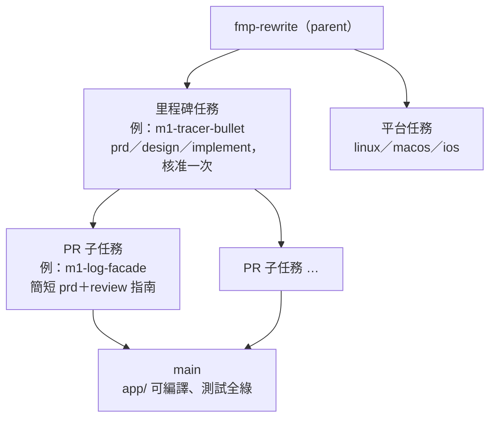

# 設計：重寫里程碑與切換

## 1. 結構（已決定）

- **里程碑任務**：
  - 開工時走 brainstorm，擁有者核准一次 prd／design／implement；
  - implement 列出 PR 子任務與先後順序。Trellis 的 parent／child 不表達依賴，所以順序寫在 implement 與各子任務的 prd（`workflow.md:173`）。
- **PR 子任務**：
  - 一個分支、一個 PR，合進 `main`；
  - prd 只寫做什麼與驗收；PR 描述附 review 指南（parent prd「可 review 性優先」）；
  - 在已核准的範圍內直接做，遇到未定的事才停下來問。
- **里程碑驗收**：
  - 端到端實際操作，Android 與 Windows 各一次，依 AGENTS.md 的 on-device 驗證；
  - 加上併入的 `phase2-plan` §7／§8 實測；
  - 全部通過才 archive 里程碑任務。
- **排序原則**：
  - 縱向切片，每個里程碑結束時多一件可以實際操作的事（walking skeleton、tracer bullet；ADR 0008）；
  - 每個新增資料表的里程碑，同時補上那張表的舊資料匯入（M5 起）；
  - 各組設定的欄位清單（ADR 0011 的未定項），在引入該組設定的里程碑定案。
- **追蹤**：只用 Trellis 任務樹。里程碑清單的現況寫在 parent 的 `milestones.md`，每完成一個就更新一次。

## 2. 里程碑清單

每個里程碑一段，依序是：做完能做什麼、範圍、依賴、併入的實測。

### M1 骨架＋曳光彈

- **做完**：Android、Windows 上能搜尋 B 站並連續播放兩首。
- **範圍**：
  - `app/` 新專案，Flutter 用當時的 stable（目前 3.47.5）；`app/AGENTS.md`；flavor dev／prod 與 App 身分（ADR 0008、0015）；單一實例鎖。
  - `fmp_lints` 與接線哨兵；CI 以 `dorny/paths-filter` 切分、五平台編譯、`always()` 彙總（ADR 0015 §9）。
  - 平台層骨架與能力宣告（ADR 0009）。
  - drift 最小 schema 與 schema 快照（ADR 0010）。
  - log 門面、遮蔽函式、log 檔（ADR 0011）。
  - 網路層（ADR 0012，不含登入）、錯誤模型（ADR 0013）。
  - JS 執行環境、宿主 API 最小集、以「從檔案安裝」載入 B 站插件（ADR 0014）。
  - 播放核心最小集：兩個後端、兩首的佇列、前瞻交接（ADR 0018）。
  - `ToastHost` 與 `Toaster`（ADR 0023，詳細頁在 M3）。
  - token、斷點、字型、slang 三語言骨架、App 內快捷鍵的播放部分（ADR 0024）。
  - 以 release-please 的 dry-run 驗證 `app/` 發版 workflow（ADR 0022）。
- **限時探針**：YouTube.js 可行性（ADR 0014）。失敗就在 M3 以 Dart 實作 YouTube。
- **併入的實測**：`phase2-plan` §7 全部，涵蓋 ADR 0008、0009、0010、0011、0014、0015、0018、0022、0023、0024。
- **之後**：開 Linux 平台任務。

### M2 完整播放

- **做完**：像舊版一樣日常聽歌（單一音源）。
- **範圍**：
  - 完整 `QueueModel`（隨機、循環、拖曳、臨時播放）、`RecoveryPolicy`（ADR 0018）；
  - 播放頁方案 B、播放列三段、App 內快捷鍵全表、焦點三區（ADR 0024）；
  - 系統媒體控制（Android 通知、Windows SMTC）；
  - 速度、音量、輸出裝置（E19）；播放歷史（E15）；
  - 統一快取庫、串流網址記憶體快取、圖片快取、離線狀態（ADR 0016）；
  - 背景排程器與啟動維護清單（ADR 0017），含 log 保留 7 天（ADR 0025）。
- **依賴**：M1。
- **併入的實測**：無另外指定的項目；照 ADR 0016、0017、0018 的單元與契約測試。

### M3 三音源、帳號與開發工具

- **做完**：三個音源都能搜尋、播放、登入。
- **範圍**：
  - YouTube（JS 或 Dart 備案）、網易雲插件；B 站分 P（E2）、Mix（E13）、電台直播（E12）；
  - 帳號與 `CredentialStore`、`AuthRequirement`（ADR 0012，E6）；
  - `1morr/fmp-plugins` repo、CI 與 `index.json`；App 插件頁；首次啟動引導（ADR 0014、`phase2-plan` §9）；
  - Debug 頁八區塊與插件開發工具（ADR 0025、0015 §7）；錯誤詳細頁與 GitHub 回報、`.github/ISSUE_TEMPLATE/bug_report.yml`（ADR 0023）。
- **依賴**：M2。
- **併入的實測**：
  - YouTube App 內網頁登入（ADR 0012，§8）；
  - 加入 Debug 頁的里程碑實測（ADR 0025，§8）。

### M4 音樂庫與同步

- **做完**：建歌單、匯入並刷新平台歌單、匯入 Spotify／QQ 歌單。
- **範圍**：
  - 關聯表與孤兒清理（ADR 0019）；本機歌單（E3）；
  - 匯入平台歌單與刷新（E4）；僅元資料來源的匹配（E5）；遠端歌單編輯（E7）；
  - 首頁排行與探索（E14）；
  - 新格式的備份與還原（E16）。
- **依賴**：M3（需要三個音源與帳號）。
- **併入的實測**：`opencc` native assets 在各平台建置（ADR 0019 後果）。

### M5 舊資料匯入

- **做完**：新 App 首次啟動會自動匯入舊版的歌單、曲目、歷史、設定、帳號，也能匯入舊備份檔。擁有者從此以 dev flavor 加真實資料副本日常試用。
- **範圍**：`legacy_import`（ADR 0010）：唯讀開啟舊 Isar、讀舊 secure storage、先寫暫存庫、驗證後才換上；錯誤頁；「刪除舊版資料」。
- **依賴**：M4（資料表到這裡才齊）。
- **併入的實測**：`isar_community` 與 `sqlite3` 共存（M1 已驗證）在匯入路徑上再測一次；以擁有者的真實資料副本完整匯入，並比對筆數。

### M6 下載

- **做完**：下載、管理下載，並匯入舊的下載紀錄。
- **範圍**：ADR 0020 全部（E8），以及舊下載紀錄的匯入。
- **依賴**：M5。
- **併入的實測**：加入下載的里程碑實測（ADR 0020，§8）。

### M7 歌詞

- **做完**：多源歌詞、逐字、桌面歌詞、Android 懸浮歌詞，並匯入舊的歌詞配對。
- **範圍**：
  - ADR 0021 全部（E9–E11）；
  - 官方 AI 插件 `openai-compatible`、`system-one`；
  - 舊歌詞配對以 `manual` 匯入。
- **依賴**：M5。與 M6 互不依賴，可以對調。
- **併入的實測**：加入桌面歌詞、Android 懸浮歌詞、逐字的里程碑實測（ADR 0021，§8）。

### M8 桌面整合

- **做完**：托盤、全域快捷鍵、開機自啟、關閉縮到托盤（E18）。
- **範圍**：平台層的對應能力（ADR 0009）；設定頁「鍵盤快捷鍵」列出兩組（ADR 0024）。
- **依賴**：M2。放在 M7 之後，是因為它不擋試用。

### M9 發版、更新與切換

- **做完**：新 App 能以 2.0.0 送到舊版使用者手上。
- **範圍**：
  - 應用內更新與 `appUpdate` 能力、正式的 release workflow（ADR 0022，E17）；
  - `docs/user-guide.md` 完成、關於頁（ADR 0024）；
  - 切換放行條件（第 3 節）全部通過；
  - 最後的切換 PR 照 ADR 0008 §決定 5：刪除根目錄舊專案、`docs/audit/`、ADR 0001–0007；`release.yml`、`ci.yml`、`orca.yaml`、`tool/release/` 改指向 `app/`。
- **依賴**：M1–M8。
- **併入的實測**：ADR 0022 的切換前實測（§8）；App 身分比對（ADR 0008）。

### 平台任務

- **Linux**：M1 之後開。
  - 驗收在 VMware Workstation Pro 的 Ubuntu LTS 桌面虛擬機，X11 與 Wayland 各一次；日常開發用 WSL2。
  - 併入 ADR 0012（沒有 keyring）、0021（X11／Wayland 桌面歌詞）、0022（AppImage 改名替換）的 §8 項目。
  - 之後每個里程碑在虛擬機跑一次冒煙測試。
- **macOS、iOS**：Mac 到貨後開（擁有者預計 2026-10）。
  - 到貨前只靠 GitHub macOS runner 的編譯與 iOS 模擬器測試。
  - 併入 ADR 0018（AVPlayer 對 DASH／HLS）、0021（Live Activity、macOS 桌面歌詞）、0022（quarantine）的 §8 項目。
  - iOS 要不要實機、要不要付費帳號，在該任務決定。
- 各平台實機驗證完才發佈（ADR 0009）。

## 3. 切換放行條件（已決定）

1. **功能**：
   - `questions.md` 勾「保留」的 E1–E17，加上各 ADR 定下的行為，全部在 `app/` 跑通；
   - 切換 PR 的 review 指南逐項列出。
2. **效能**：
   - 同一台電腦、同一模擬器、同一份資料副本，以 `perf-baseline.md` 的命令把舊版與新版各量 5 次，比中位數；
   - 新版每項不得比舊版差超過 5%，超出就重量一次，仍超出則不放行；
   - 結果附在切換 PR。
3. **資料**：
   - 以擁有者的真實資料副本完整匯入，筆數比對附在切換 PR（ADR 0010）；
   - 在模擬器與虛擬機上以資料副本從 v1.11.0 實際升級：Android、Windows 安裝版與免安裝版（ADR 0022）。
4. **試用**：
   - 候選版以 dev flavor 加新匯入的真實資料副本，當擁有者的主要播放器滿 2 週；
   - 期間沒有未解決的阻擋性 bug（資料錯誤、無法播放、當機）。
5. **切換後**：以 2.0.x 經應用內更新往前修，不做降版。
   - Android 同身分覆蓋升級，降版要移除 App，會刪掉私有資料。
   - 舊資料不自動刪除，可以重新匯入（ADR 0010）。

## 4. 相關文件的更正與指向

- ADR 0008 §決定 5、「如何確認」，以及 parent prd 完成定義：把「`features.md` 中勾『保留』」改為「`questions.md` 勾『保留』的功能（E1–E17）與各 ADR 定下的行為」，並加一句指向 0026。
- ADR 0009：平台任務的時程與環境見 0026。
- ADR 0011：「各組設定的欄位清單在里程碑中……定案」改為指向 0026 的排序原則。
- ADR 0014：插件庫與插件頁在 M3（0026）。
- ADR 0017：啟動維護清單在 M2 實作（0026）。
- `phase2-plan.md`：
  - §3 第 20 列 ✅；
  - §7、§8 各項標上所屬里程碑；
  - §10 改為「階段二完成，下一步階段三」。
