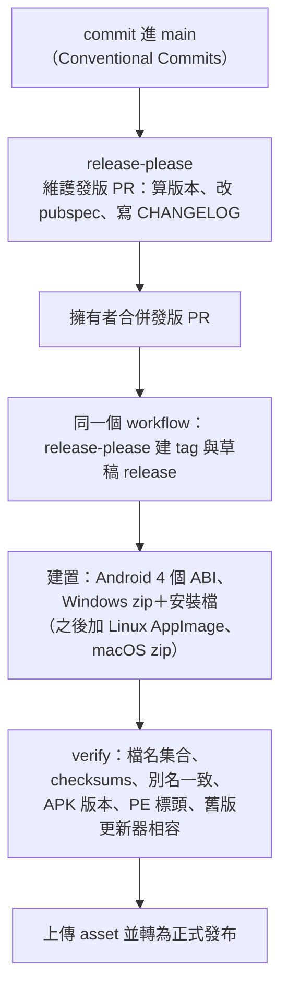

# 設計：發版與應用內更新

## 1. 發版流程

- **release-please**：manifest 模式，套件路徑 `app/`、策略 `dart`，`CHANGELOG.md` 放在 `app/`；tag 維持 `v{版本}`（關掉 tag 內的元件名）。
  第一版以 commit 註記 `Release-As: 2.0.0` 指定，之後依 commit 類型自動升版。
- **同一個 workflow**：GitHub 預設 token 建的 tag 不會觸發其他 workflow，所以 release-please 與建置、驗證、發布放在同一個 workflow，
  以 release-please 的「本次有發版」輸出決定是否往下跑。草稿與建 tag 的確切選項名落地時以 context7 查 release-please 文件確認。
- **不留人工閘門**（ADR 0006）：合併發版 PR 是唯一的人工動作；之後驗證通過就自動轉為正式發布。
- **版本號**：`pubspec.yaml` 的版本由 release-please 維護；versionCode 沿用 `major*1000000 + minor*1000 + patch`，由 workflow 從 tag 算並注入。
  舊的 `pubspec_version_test`（擋 pubspec 落後 tag）改成「pubspec 版本等於 `.release-please-manifest.json`」。
- **發佈說明**：取 CHANGELOG 中該版段落，同一段也是 App 內更新對話框的內容；段落保持短、markdown 淺（舊版對話框的限制沿用）。
- **flavor**：發版一律 `--flavor prod`（ADR 0015）。
- 重寫期間不發版；舊專案的 `release.yml` 在切換 PR 前維持原樣（ADR 0008）。

## 2. 發佈物

| 平台 | 檔案 | 備註 |
|---|---|---|
| Android | `fmp-v{版本}-android-{arm64-v8a,armeabi-v7a,x86_64,universal}.apk` | 同一把簽名金鑰（ADR 0008） |
| Windows | `fmp-v{版本}-windows-installer.exe`、`fmp-v{版本}-windows.zip` | Inno Setup，AppId 沿用；不簽章 |
| Linux | `fmp-v{版本}-linux-x86_64.AppImage` | Linux 平台任務加入 |
| macOS | `fmp-v{版本}-macos.zip` | 未公證；macOS 平台任務加入 |
| 全部 | `fmp-v{版本}-checksums.sha256`、`fmp-latest-*` 別名 | 別名給下載頁連結用，與版本化檔逐位元相同 |

- iOS 沒有發佈物；iOS 的散佈方式由 iOS 平台任務決定。
- **切換相容**：舊版 v1.x 更新器依上表的 Android、Windows 檔名挑檔、驗 checksums、以程式目錄有 `unins000.exe` 判斷安裝版、只比三段版本號。
  新 App 沿用這些檔名、Inno AppId、Android 金鑰，並讓免安裝版 zip 的內容就是完整程式目錄（舊版以 `robocopy /MIR` 覆蓋）。
  verify 加一項「舊版更新器相容」：以舊版的選檔與 checksums 解析規則跑一遍本次產物。

## 3. 應用內更新

### 3.1 能力與入口

- 平台層能力 `appUpdate` 宣告這份安裝能不能更新、屬於哪一種：`androidApk`（附 ABI）、`windowsInstaller`、`windowsPortable`、`linuxAppImage`、`macosApp`、`none`。
  - 判斷：Windows 程式目錄有 `unins000.exe` 為安裝版；Linux 有 `APPIMAGE` 環境變數為 AppImage；iOS、dev flavor、其他安裝方式為 `none`。
  - `none` 時不顯示「檢查更新」，只顯示「前往下載頁」。
- 入口只有「設定 → 關於 → 檢查更新」，不在啟動或定時檢查（ADR 0017）。

### 3.2 檢查

- 經網路層一般 client（ADR 0012，不帶憑證）打 `GET api.github.com/repos/1morr/FMP/releases/latest`（不含 prerelease、draft）。
- 版本比較用 `pub_semver`（含 build number）；沒有比目前新的就顯示「已是最新版」。
- 403／429 且剩餘次數為 0 時轉成 `RateLimited`（附重置時間，ADR 0013），顯示「請於 HH:MM 後再試」。
- 依能力挑 asset：Android 依 ABI，缺就退 `universal`；Windows 依安裝版或免安裝版；找不到對應檔就顯示「這一版沒有你的平台」。
- 顯示版本、發佈說明、檔案大小，以及「下載」「前往下載頁」。

### 3.3 下載與驗證

- 使用者按「下載」才下載，經 ADR 0020 的下載引擎，所以網路層之外不會多一個 HTTP 出口；存到 App 快取目錄的 `updates/`，可暫停續傳。
- **驗證（B8）**：
  - checksums 檔必須存在且列出該檔，否則拒絕並刪檔；
  - SHA-256 與大小都要相符；
  - GitHub asset 的 `digest` 有值時也必須相同。
  
  驗證失敗刪檔，顯示「檔案驗證失敗，已刪除」。
- 驗證通過後顯示「安裝」「刪除」；關掉 App 後，已下載的更新保留，下次打開關於頁仍可安裝或刪除。

### 3.4 安裝

| 類型 | 做法 |
|---|---|
| Android | 經 `PermissionGateway` 取得「安裝未知應用」（ADR 0020），以 FileProvider＋`ACTION_VIEW` 開系統安裝器；系統負責同簽章檢查。 |
| Windows 安裝版 | `Process.start` detached：`/SILENT /SUPPRESSMSGBOXES /NORESTART /CLOSEAPPLICATIONS /RESTARTAPPLICATIONS /DIR=<目前目錄> /LOG=<updates/install.log>`，接著結束 App。 |
| Windows 免安裝版 | 見 §3.5。 |
| Linux AppImage | 新檔下載到 AppImage 所在資料夾的 `.new`，驗證、加執行權限，舊檔改名 `.old`、新檔改成原名，執行新檔並結束 App。資料夾不可寫時改提供「前往下載頁」。 |
| macOS | 解壓到快取，由一個小腳本等 App 結束、把舊 `.app` 改名 `.old`、放上新的、`open` 新的。 |

### 3.5 Windows 免安裝版的替換（B7）

- 新版 zip 解壓到**程式目錄旁**的 `<目錄>.new`（同一磁碟，才能以改名替換），不再解到 Temp 後用 `robocopy` 複製。
- 程式目錄內附一個小更新程式 `fmp_updater.exe`（Dart 編譯的主控台程式）。安裝時：
  1. 先把它複製到 Temp 再執行，因為程式目錄等下要被改名；
  2. App 結束；
  3. 更新程式等原 PID 結束；
  4. 把 `<目錄>` 改名為 `<目錄>.old`，再把 `<目錄>.new` 改名為 `<目錄>`；
  5. 任一步失敗就改名回去；
  6. 啟動新的 `fmp.exe`。
- 使用者資料在 `Documents\FMP`（ADR 0010），不受替換影響。
- 程式目錄的上層不可寫時，改提供「前往下載頁」。

### 3.6 清理（登記在啟動維護清單，ADR 0017）

- 刪除 `updates/` 中版本 ≤ 目前版本的安裝檔、`.part`、`install.log`（先讀出寫進 log 後再刪）。
- 刪除 Windows 免安裝版的 `<目錄>.old`、Linux 的 `.AppImage.old`、macOS 的 `.app.old`。
- 版本比目前新、但使用者還沒安裝的更新保留。

### 3.7 狀態與錯誤

- 狀態：`Idle`、`Checking`、`UpToDate`、`Available`、`Downloading`、`Downloaded`、`NeedsPermission`、`Installing`、`Failed(AppError)`；以操作代際防競態（舊版做法）。
- 錯誤依 ADR 0013 分類；下載網址寫 log 前經 ADR 0011 遮蔽。

## 4. 相關 ADR 的指向

舊 ADR 0004、0006 描述根目錄舊專案，不改動；ADR 0022 的背景寫明延續與差異。

- 0009：能力 `appUpdate` → 0022。
- 0017：更新檢查只手動，清理登記在啟動維護清單 → 0022。
- 0020：下載引擎也用於更新檔 → 0022。
