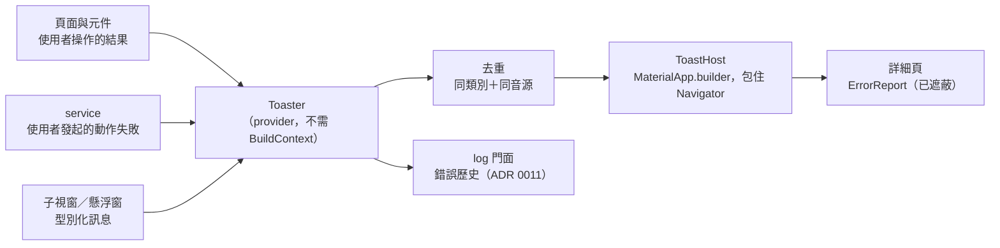

# 設計：統一 Toast

## 1. 入口

- `Toaster` 是唯一入口，以 provider 注入，不需要 `BuildContext`（舊版有三條入口：`failure(context, e)`、`error(context, 文字)`、背景 stream）。
- API：
  - `success(String)`、`info(String)`、`warning(String)`：參數是 i18n 字串；
  - `error(AppError, {Operation? operation})`：只接受 `AppError`，由對應表轉成 i18n 訊息（ADR 0013），所以不會有例外原文上畫面；
  - 各自可帶一個動作（例如「登入」「復原」）。
- 背景工作不呼叫 `Toaster`，只更新對應畫面的狀態（ADR 0013）。使用者發起、在 service 內失敗的動作可以呼叫。
- 錯誤一律經 log 門面寫入錯誤歷史（ADR 0011），不論有沒有顯示提示。

## 2. 外觀、位置與時長（已決定：Material 單條、新的取代舊的）

- Material `SnackBar`，`floating`，四種語意色（成功、資訊、警告、錯誤）加圖示；最多一個動作；錯誤另有「詳細」或「回報」（§4）。
- 位置：
  - 手機：迷你播放列與底部導覽列之上；
  - 桌面：播放列之上、置中，最寬 560px；
  - 全螢幕播放頁：貼底部安全區。
  
  外殼版面把「底部被佔用的高度」發佈給 `ToastHost`，由它算邊距，頁面不必各自處理。
- 一次一則，新的立刻取代目前的（顯示前 `clearSnackBars`）。
- 時長：
  - 成功與資訊 4 秒；錯誤與警告 6 秒（M3 範圍 4–10 秒；舊版 1.5／3 秒太短、來不及讀）。
  - 帶動作的也照上述時長自動消失（`persist: false`，否則 Flutter 3.38 起會一直停著）；系統開啟無障礙導覽時才改為停留到手動關閉（沿用舊版）。
- 去重：同一類別＋同一音源（非錯誤則同一訊息）5 秒內只顯示一次（ADR 0013 的「短時間」定為 5 秒）。

## 3. 層級與可見範圍（G9）

- `ToastHost` 放在 `MaterialApp.builder`：一個 `ScaffoldMessenger`＋透明 `Scaffold` 包住 Navigator。
  SnackBar 由這個 Scaffold 畫，所以在所有路由（全螢幕播放頁、對話框、底部面板）之上都看得到。
  依原始碼推得 SnackBar 由最近的 Scaffold 畫，第一個里程碑實測確認。
- 桌面歌詞子視窗、Android 懸浮窗不顯示提示；需要提示的錯誤以型別化訊息（ADR 0021）轉給主視窗的 `Toaster`。
- App 在背景時不顯示（沒有畫面），錯誤仍進錯誤歷史；不發系統通知。

## 4. 詳細頁與回報（已決定）

- **誰看得到**：開發者模式下，每則錯誤提示附「詳細」；一般使用者只有 `Unsupported`、`UnexpectedError` 附「回報」，開同一頁。
- **`ErrorReport`**：錯誤發生時組裝一次，經 ADR 0011 的遮蔽函式；顯示、複製、回報都用這一份，不再重組。內容：
  - 錯誤類型與原因、音源（插件 id 與版本）、使用者動作；
  - 請求摘要（方法、已遮蔽的網址、狀態碼、耗時）、stack trace；
  - App 版本與 flavor、系統與版本、時間（ISO 8601）。
- **詳細頁**：可選取文字。按鈕：
  - 「複製」：Markdown 格式；
  - 「在 GitHub 回報」：先複製，再以瀏覽器開啟 repo 的新增 issue 頁（bug 範本），**內容不放進網址**。
    第一次使用先提醒「repo 是公開的，送出前請檢查內容」，勾選不再提醒後記在設定。
- Debug 頁的錯誤歷史（第 4 項）點開單筆時用同一個詳細頁。
- 新增 issue 頁的網址放在 `fmp_url_literal` 允許的端點檔（ADR 0015）。落地時在 repo 新增 `.github/ISSUE_TEMPLATE/bug_report.yml`（目前沒有範本）。

## 5. 無障礙

- 使用 `SnackBar` 內建的 live region，朗讀但不搶焦點。
- 需要單獨朗讀的地方用 `SemanticsService.sendAnnouncement(View.of(context), …)`，不用已棄用的 `announce`。
- Windows 無障礙樹：上游有 Slider 在推送的頁面內凍結無障礙樹的 issue（#190357）。第一個里程碑以 Narrator 實測提示出現在全螢幕頁與對話框上時，樹不會凍結。

## 6. 閘門

- 新 lint `fmp_toast_entry`（加入 ADR 0015 的 `fmp_lints`）：`SnackBar(`、`ScaffoldMessenger.of`、`showSnackBar`、`clearSnackBars` 只准在 toast 模組；依 ADR 0015 寫雙向變異測試。
  取代舊 `error_presentation_static_rule_test.dart` 中「UI 不得自組錯誤文字」的部分。
- `error(AppError)` 的型別擋掉以字串形式傳例外原文（舊版 `audio_provider.dart:1988` 的漏網點）。
- 單元測試：去重視窗、取代、時長、開發者模式與一般使用者的按鈕、`ErrorReport` 經遮蔽（假 cookie、token、簽名網址不出現在 Markdown）、GitHub 網址不含報告內容。
- widget 測試：全螢幕路由與對話框開啟時送出提示，提示可見；底部位移依外殼發佈的高度。

## 7. 相關 ADR 的指向

- 0013：提示外觀、去重時間與「詳細」由 0023 定。
- 0015：後續 ADR 新增的規則加 `fmp_toast_entry`。
- 0021：子視窗與懸浮窗的提示轉給主視窗（0023）。
