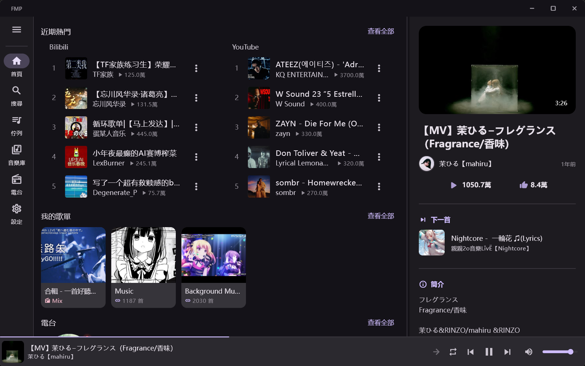

# FMP - Flutter Music Player

  

  跨平台音乐播放器，支持 Bilibili 和 YouTube 音源，提供统一的播放体验。

  

---

## 下载安装

<!-- DOWNLOAD_START -->
| 平台 | 下载 | 说明 |
|------|------|------|
| **Android** | [APK 下载](https://github.com/1morr/FMP/releases/download/v1.2.6/fmp-v1.2.6-android.apk) | 直接安装 |
| **Windows** | [安装包下载（推荐）](https://github.com/1morr/FMP/releases/download/v1.2.6/fmp-v1.2.6-windows-installer.exe) | 完整支持SMTC 显示 |
| Windows | [免安装版](https://github.com/1morr/FMP/releases/download/v1.2.6/fmp-v1.2.6-windows.zip) | 解压即用 |
<!-- DOWNLOAD_END -->

> 💡 Windows 推荐使用安装包版本，以获得最佳的系统集成体验（SMTC、托盘图标等）。
>
> 📋 查看所有版本：[Releases 页面](https://github.com/1morr/FMP/releases)

---

## 应用截图

  

---

## 功能特性

### 🎵 多源音频播放
- **Bilibili** - 视频、多P合集、直播间音频
- **YouTube** - 视频、Mix/Radio 动态无限播放列表
- **音质可选** - 高/中/低音质等级

### 🎛️ 播放控制
- 播放/暂停、上一首/下一首、进度拖拽
- 播放速度调节
- 循环模式（单曲/列表/顺序）、随机播放
- 临时播放 - 点击歌曲试听，完成后恢复原队列
- 播放位置记忆 - 重启后从上次位置继续

### 📋 播放队列
- 拖拽排序、点击删除
- 重启后自动恢复
- YouTube Mix 模式 - 动态加载更多歌曲

### 📚 音乐库
- 歌单管理 - 创建、编辑、删除、自定义封面
- **导入功能**：
  - Bilibili 收藏夹 / YouTube 播放列表
  - 网易云音乐、QQ音乐、Spotify 歌单（智能匹配）
- 歌单内搜索与排序

### 🔍 搜索
- Bilibili / YouTube 双源搜索
- 搜索历史记录
- 结果排序（综合/播放量/最新）

### 📥 下载与离线
- 离线下载到本地存储
- 批量下载整个歌单
- 按歌单分文件夹管理

### 🏠 首页与探索
- 排行榜预览（Bilibili / YouTube 热门）
- URL 直接播放

### 📊 播放历史
- 时间轴列表展示
- 统计卡片
- 筛选与排序

### 🔄 应用内更新
- 自动检查 GitHub Releases 新版本
- 一键下载安装

---

## 平台特性

| 特性 | Android | Windows |
|------|:-------:|:-------:|
| 后台播放 | ✅ | - |
| 通知栏控制 | ✅ | - |
| 系统媒体键 | ✅ | ✅ |
| 系统托盘 | - | ✅ |
| 全局快捷键 | - | ✅ |

---

## 响应式设计

| 布局 | 宽度 | 导航方式 |
|------|------|----------|
| 手机 | < 600dp | 底部导航栏 |
| 平板 | 600-840dp | 侧边导航栏 |
| 桌面 | > 840dp | 可收起侧边栏 + 详情面板 |

---

## 开发者

如果你想自己编译运行或参与开发，请参阅：

- [构建指南](docs/build-guide.md) - 本地编译 Android APK 和 Windows 安装包
- [开发文档](docs/development.md) - 项目架构、技术栈、开发规范

---

## 许可证

[GPL-3.0 License](LICENSE)
