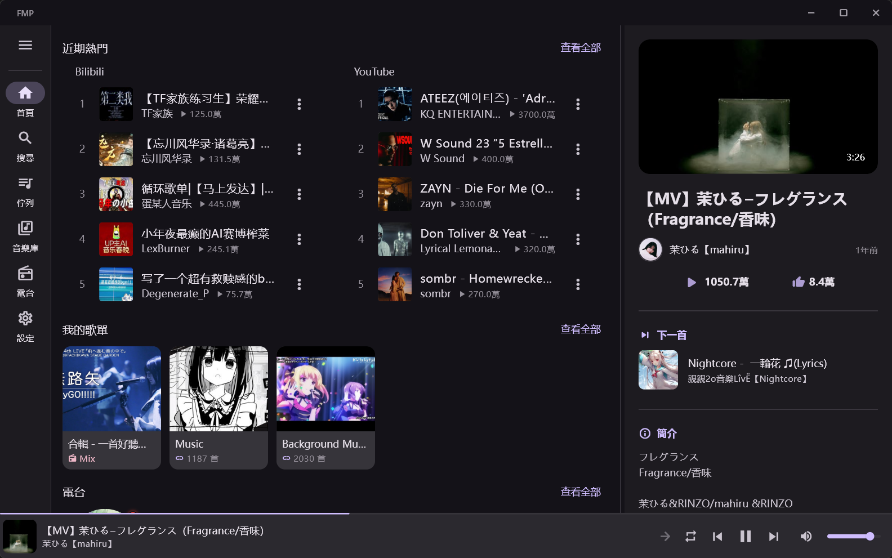
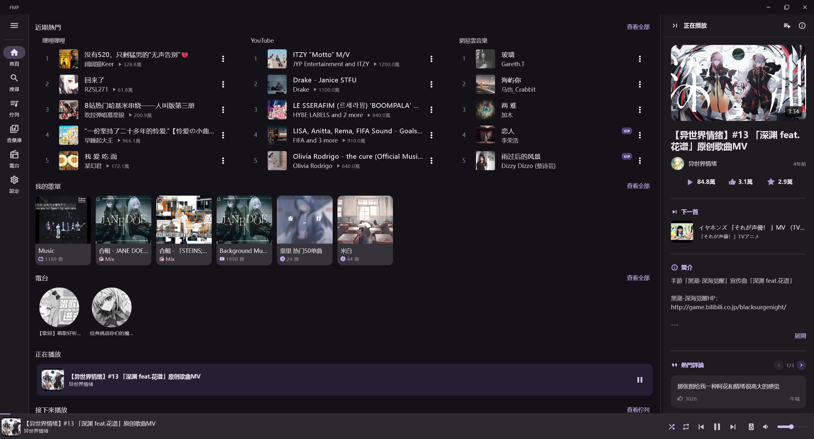
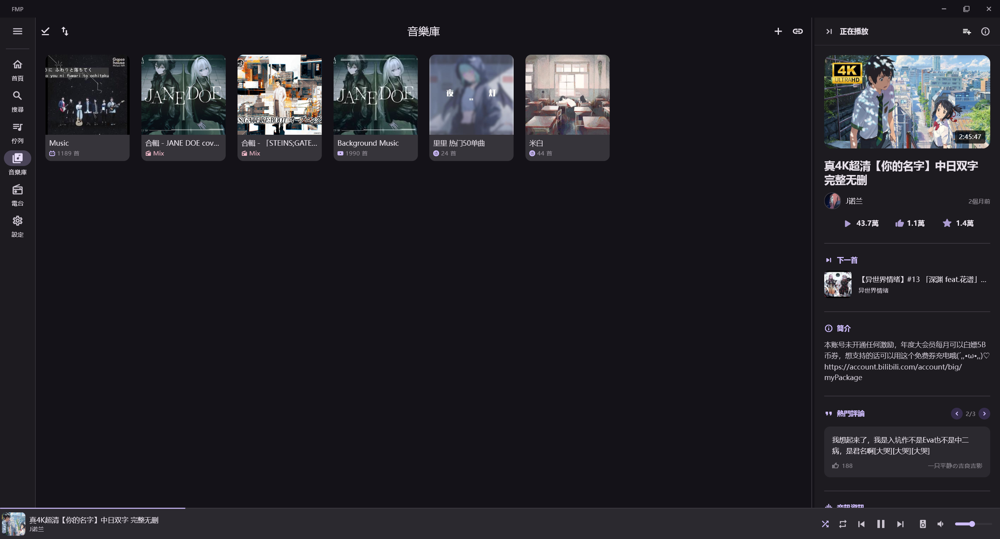
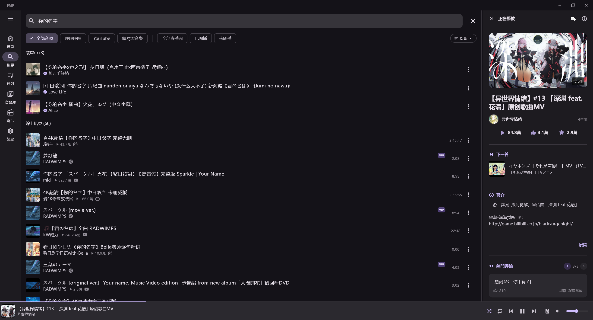
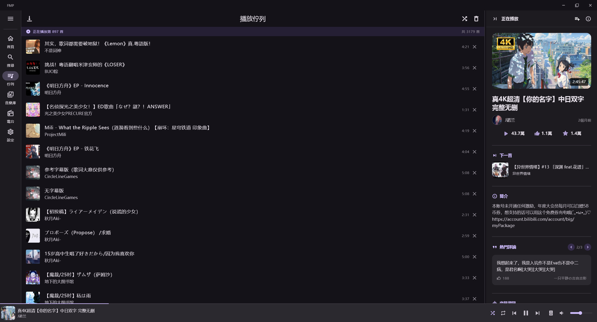
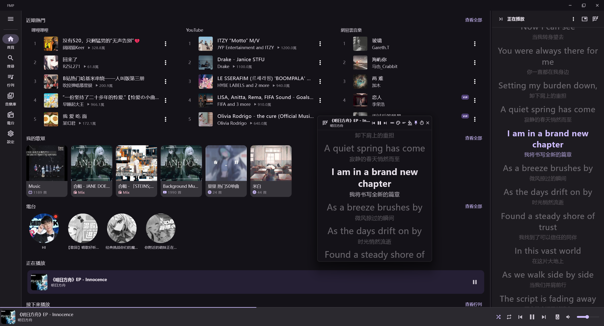

# FMP - Flutter Music Player

<p align="center">
  
</p>

<p align="center">
  跨平台音樂播放器，整合 Bilibili、YouTube 與網易雲音樂音源，面向 Android 與 Windows。
</p>

<p align="center">
  <a href="https://github.com/1morr/FMP/releases/latest"></a>
  
  
</p>

<p align="center">
  <a href="#下載">下載</a> ·
  <a href="#截圖">截圖</a> ·
  <a href="#功能亮點">功能亮點</a> ·
  <a href="#開發與文件">開發與文件</a> ·
  <a href="#免責聲明">免責聲明</a>
</p>

## 下載

<!-- DOWNLOAD_START -->
| 平台 | 下載 | 適合情境 |
|------|------|----------|
| **Android** | [下載 APK](https://github.com/1morr/FMP/releases/latest/download/fmp-latest-android-universal.apk) | 直接安裝到 Android 裝置 |
| **Windows** | [下載安裝包（推薦）](https://github.com/1morr/FMP/releases/latest/download/fmp-latest-windows-installer.exe) | 完整支援 SMTC、開始選單、桌面捷徑與系統整合 |
| Windows | [下載免安裝版](https://github.com/1morr/FMP/releases/latest/download/fmp-latest-windows.zip) | 解壓即用，適合臨時測試 |
<!-- DOWNLOAD_END -->

所有版本與更新紀錄可在 [GitHub Releases](https://github.com/1morr/FMP/releases) 查看。Windows 建議使用安裝包版本；免安裝版可以播放，但系統媒體控制與捷徑識別可能不完整。

## 截圖

<p align="center">
  
</p>

| 首頁與探索 | 音樂庫 |
|------------|--------|
|  |  |

| 搜尋 | 播放佇列 |
|------|----------|
|  |  |

| 電台 | 歌詞 |
|------|------|
|  |  |

| 設定 |
|------|
|  |

## 功能亮點

### 多音源播放

- Bilibili：影片音訊、多 P 合集、直播間音訊與收藏夾匯入。
- YouTube：影片、播放清單、Mix / Radio 動態佇列，以及 Opus / AAC 格式偏好。
- 網易雲音樂：歌曲搜尋、歌單匯入、音訊流解析與 VIP / 可用性標示。
- 支援 URL 直接播放，並可依來源調整音質與串流策略。

### 音樂庫與歌單管理

- 建立、編輯、刪除歌單，支援自訂封面與歌單內搜尋。
- 匯入 Bilibili 收藏夾、YouTube 播放清單、網易雲音樂歌單。
- 支援 QQ 音樂、Spotify 等外部歌單的智慧匹配匯入。
- 已下載歌曲會在本機音樂庫中依歌單與資料夾管理。

### 播放體驗

- 播放 / 暫停、上一首 / 下一首、進度拖曳、播放速度調整。
- 單曲循環、列表循環、順序播放與隨機播放。
- 臨時播放：點選歌曲試聽後，可回到原本播放佇列。
- 佇列可拖曳排序、刪除項目，並可在重啟後恢復。

### 歌詞與電台

- 歌詞來源包含網易雲、QQ 音樂與 lrclib，可調整優先順序。
- 支援同步歌詞、翻譯 / 羅馬音顯示偏好與桌面歌詞子視窗。
- 直播間可加入電台清單，並使用獨立電台播放頁管理。

### 下載、歷史與更新

- 支援單曲與歌單批次下載，下載內容以本機檔案保存。
- 播放歷史提供時間軸、統計卡片、篩選與排序。
- 內建 GitHub Releases 更新檢查，可在設定頁下載新版本。
- 本機資料可備份與還原，便於跨裝置遷移。

### 平台整合

| 能力 | Android | Windows |
|------|:-------:|:-------:|
| 後台播放 | 是 | - |
| 通知欄控制 | 是 | - |
| 系統媒體鍵 | 是 | 是 |
| Windows SMTC | - | 是 |
| 系統托盤 | - | 是 |
| 全域快捷鍵 | - | 是 |
| 桌面歌詞視窗 | - | 是 |

## 技術概覽

| 層級 | 技術 |
|------|------|
| App | Flutter / Dart / Material 3 |
| 狀態管理 | Riverpod |
| 本機資料 | Isar |
| 路由 | go_router |
| 音訊後端 | Android: just_audio；Windows: media_kit |
| 外部資料 | Dio、youtube_explode_dart、平台 API adapter |
| 國際化 | slang |

響應式 UI 依寬度切換底部導覽、側邊導覽與桌面詳情面板。主要斷點與開發規則請見 [開發文件](docs/development.md)。

## 開發與文件

本專案使用 Flutter。首次建置前請先安裝 Flutter SDK，Windows 桌面建置另需 NuGet CLI 與 Rust toolchain。

```bash
flutter pub get
flutter pub run build_runner build --delete-conflicting-outputs
dart run slang
flutter analyze
flutter test
```

更多文件：

- [文件地圖](docs/README.md)：各文件用途與維護邊界。
- [建置指南](docs/build-guide.md)：Android APK 與 Windows 安裝包的本機建置流程。
- [開發文件](docs/development.md)：架構、技術棧、音源與資料模型概覽。
- [建置與發布指南](docs/build-and-release.md)：CI、Release、簽名與應用內更新資產。
- [VM Service 調試指南](docs/debugging-with-vm-service.md)：Runtime 調試、Marionette 與 Isar 檢查流程。

## 隱私與資料

- FMP 不提供公共雲端曲庫或媒體分發服務。
- 播放歷史、歌單、設定、登入憑證與下載資料預設保存在使用者裝置本機。
- 本專案不接入廣告 SDK 或第三方統計 SDK。
- 第三方平台的請求紀錄、帳號狀態與風控策略，由對應平台依其自身政策處理。

## 免責聲明

> [!WARNING]
> 本專案僅供學習與研究使用，請勿用於任何非法用途。

- 線上音訊能力依賴第三方平台的公開介面；會員、受限或不可用內容仍需遵循原平台規則。
- 使用本軟體時，若因頻繁請求、異常呼叫或違反第三方平台規則導致帳號被限制、封禁或其他處罰，風險由使用者自行承擔。
- 本專案不存儲、不分發任何受版權保護的音訊內容；內容來源為使用者自行授權或可存取的第三方平台。
- 開發者不對使用本軟體造成的任何直接或間接損失承擔責任。

## 鳴謝

### API 文件與資料

| 專案 | 說明 |
|------|------|
| [bilibili-API-collect](https://github.com/SocialSisterYi/bilibili-API-collect) | Bilibili API 收集整理 |
| [netease-cloud-music](https://github.com/chaunsin/netease-cloud-music) | 網易雲音樂 API Golang 實作 |

### 核心依賴

| 專案 | 用途 |
|------|------|
| [media_kit](https://github.com/media-kit/media-kit) | Windows 音訊播放後端 |
| [just_audio](https://github.com/ryanheise/just_audio) | Android 音訊播放後端 |
| [youtube_explode_dart](https://github.com/Hexer10/youtube_explode_dart) | YouTube 資料解析 |
| [Isar](https://github.com/isar/isar) | 本機資料庫 |
| [Riverpod](https://github.com/rrousselGit/riverpod) | 狀態管理 |

## 授權

[GPL-3.0 License](LICENSE)
