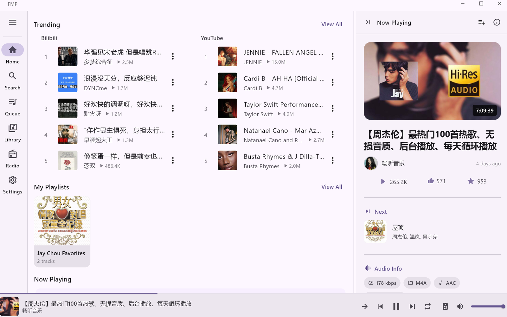
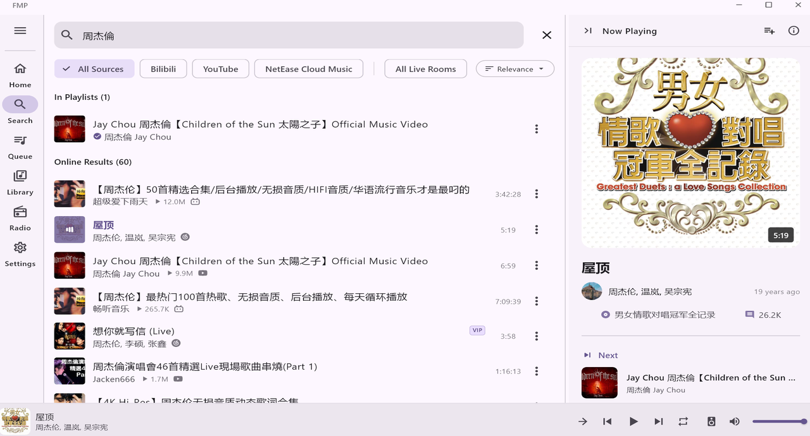
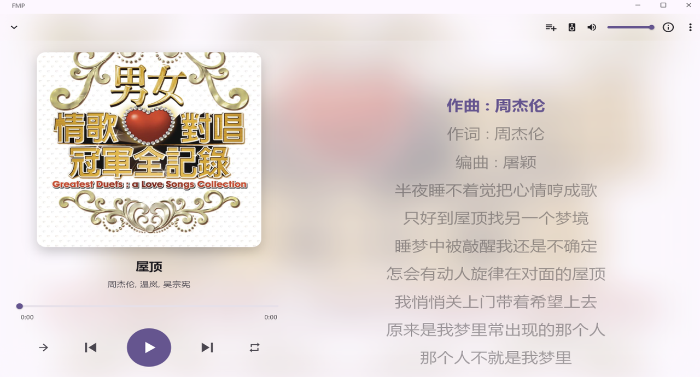
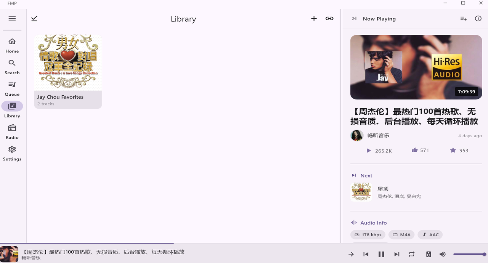
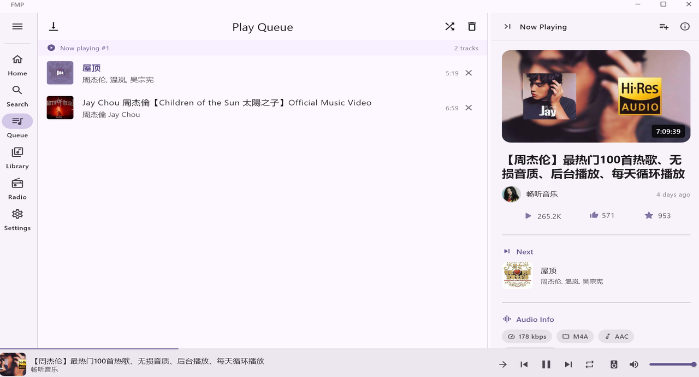
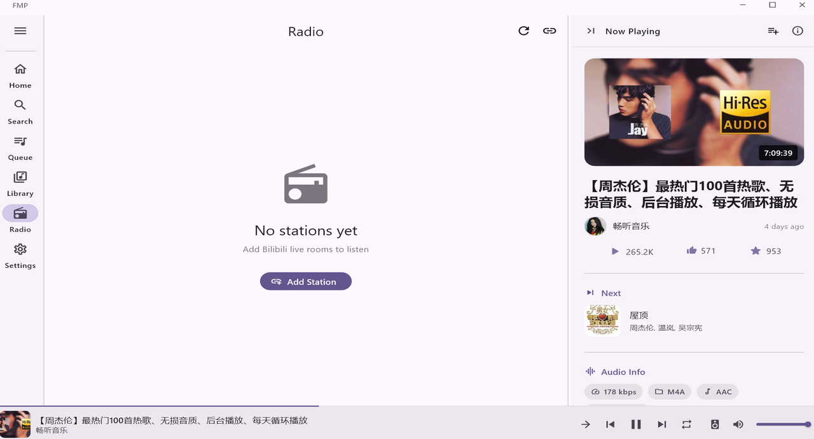
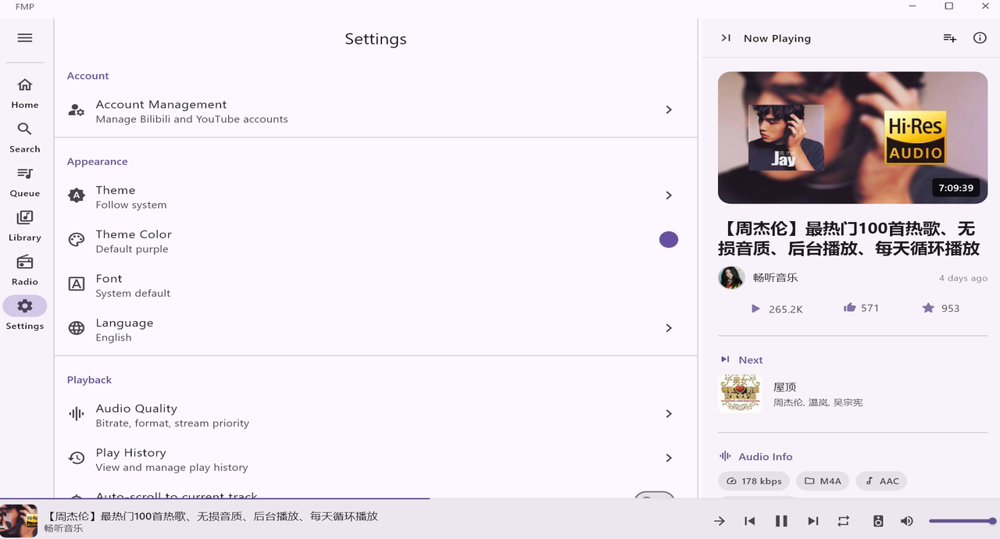

<p align="center">
  
</p>
<h1 align="center">FMP</h1>
<p align="center">一款整合 Bilibili、YouTube 與網易雲音樂的音樂播放器。<br>支援 Android 與 Windows。</p>
<p align="center">
  <a href="https://github.com/1morr/FMP/releases/latest"></a>
  <a href="https://github.com/1morr/FMP/actions/workflows/ci.yml"></a>
  
  <a href="LICENSE"></a>
</p>
<p align="center"><a href="README.md">English</a> · <b>繁體中文</b></p>

你的播放清單分散在三個不同平台上，而它們各自的 App 誰都不會播放另外兩個的內容。FMP 可以跨平台搜尋、播放任何一個來源的音樂，並且只維護一份佇列、一個媒體庫和一份收聽紀錄。

## 下載

<!-- DOWNLOAD_START -->
| Platform | | |
|---|---|---|
| **Android** | [APK](https://github.com/1morr/FMP/releases/latest/download/fmp-latest-android-universal.apk) | 直接安裝在裝置上 |
| **Windows** | [安裝程式（推薦）](https://github.com/1morr/FMP/releases/latest/download/fmp-latest-windows-installer.exe) | 完整支援 SMTC、開始功能表、捷徑與系統整合 |
| Windows | [免安裝 ZIP](https://github.com/1morr/FMP/releases/latest/download/fmp-latest-windows.zip) | 解壓縮即可執行；媒體鍵與捷徑識別可能不完整 |
<!-- DOWNLOAD_END -->

所有版本與發布說明：[GitHub Releases](https://github.com/1morr/FMP/releases)。

<p align="center">
  
</p>

<p align="center">
  
  
</p>

<details>
<summary>更多截圖</summary>

| 首頁 | 媒體庫 |
|---|---|
|  |  |

| 佇列 | 電台 |
|---|---|
|  |  |

| 設定 |
|---|
|  |

</details>

## 這個 App 能做什麼

- **三個來源，一次搜尋。** Bilibili（影片音軌、多 P 合集、直播間音訊、收藏夾匯入）、YouTube（影片、播放清單、Mix／Radio 動態佇列、Opus／AAC 偏好設定），以及網易雲音樂（歌曲、播放清單、VIP 與可播放狀態標記）。貼上一個網址即可直接播放。
- **匯入你的媒體庫。** 自建播放清單並自訂封面，或從三個來源中任一個匯入 —— 也支援從 QQ Music 與 Spotify 的匯出檔模糊比對匯入。
- **符合預期的播放體驗。** 佇列可重新排序、有重複與隨機播放模式、可調整速度，還有「試聽這首」模式會在聽完後帶你回到原本的位置。佇列在重啟後依然保留。
- **歌詞**來自網易雲音樂、QQ Music 與 lrclib，來源優先順序可自訂，支援同步捲動、翻譯與羅馬拼音，Windows 上還有獨立的桌面歌詞視窗。
- **離線播放。** 可下載單曲或整個播放清單；下載的內容會成為本機媒體庫的一部分。
- **把直播間當電台聽，** 有自己的播放頁面。
- 有時間軸與統計數據的收聽紀錄、本機備份與還原，以及對照 GitHub Releases 的應用內更新檢查。

| | Android | Windows |
|---|:-:|:-:|
| 背景播放 | ✅ | — |
| 通知列控制 | ✅ | — |
| 系統媒體鍵 | ✅ | ✅ |
| Windows SMTC | — | ✅ |
| 系統匣 | — | ✅ |
| 全域快速鍵 | — | ✅ |
| 桌面歌詞視窗 | — | ✅ |

## 使用的技術

| 層級 | |
|---|---|
| App | Flutter · Dart · Material 3 |
| 狀態管理 | Riverpod |
| 本機資料 | Isar |
| 路由 | go_router |
| 音訊 | just_audio（Android）· media_kit（Windows） |
| 網路 | Dio · youtube_explode_dart · 各平台專屬 adapter |
| i18n | slang |

介面會依照視窗寬度，在底部導覽列、側邊導覽軌與桌面版詳細窗格之間切換。

## 建置

需要 Flutter SDK。建置 Windows 桌面版另外需要 **NuGet CLI**（由 `flutter_inappwebview_windows` 引入）與 **Rust 工具鏈**（`smtc_windows` 透過 cargokit 建置一個 Rust crate）。

```bash
flutter pub get
dart run build_runner build
dart run slang
flutter analyze
flutter test
```

產生的程式碼不會提交進版本控制 —— 執行分析前，請先跑完那兩個 codegen 步驟。

| | |
|---|---|
| [docs/README.md](docs/README.md) | 各份文件涵蓋的內容 |
| [docs/building.md](docs/building.md) | 本機 Android 與 Windows 建置方式 |
| [docs/development.md](docs/development.md) | 架構、資料來源、資料模型 |
| [docs/build-and-release.md](docs/build-and-release.md) | CI、發布流程、簽章、應用內更新資源 |
| [docs/troubleshooting.md](docs/troubleshooting.md) | 常見的建置與執行期問題 |

## 隱私與免責聲明

FMP 不託管任何音樂。它讀取的是你已經擁有帳號的那些平台的公開介面，你的收聽紀錄、播放清單、設定、憑證與下載內容全部留在你自己的裝置上。裡面沒有任何廣告或分析 SDK。

> [!WARNING]
> 僅供學習與個人使用。會員專屬、受限或無法播放的內容仍然遵循來源平台自己的規則。過於頻繁或異常的請求可能導致你的帳號被限制或封禁 —— 這個風險由你自己承擔。作者對使用本軟體所造成的任何損失概不負責。

## 致謝

API 研究參考自 [bilibili-API-collect](https://github.com/SocialSisterYi/bilibili-API-collect) 與 [netease-cloud-music](https://github.com/chaunsin/netease-cloud-music)。建置於 [media_kit](https://github.com/media-kit/media-kit)、[just_audio](https://github.com/ryanheise/just_audio)、[youtube_explode_dart](https://github.com/Hexer10/youtube_explode_dart)、[Isar](https://github.com/isar-community/isar-community) 與 [Riverpod](https://github.com/rrousselGit/riverpod) 之上。

## 授權

[GPL-3.0](LICENSE)
