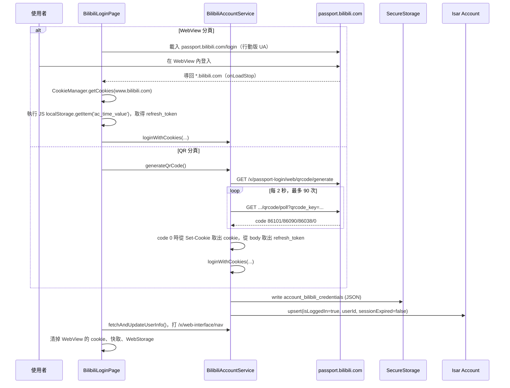
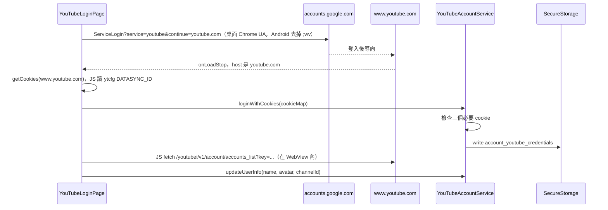
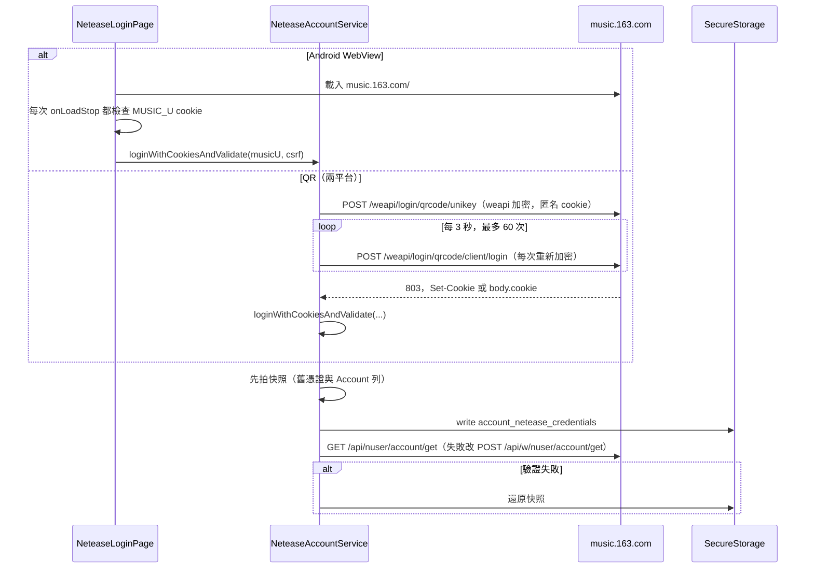
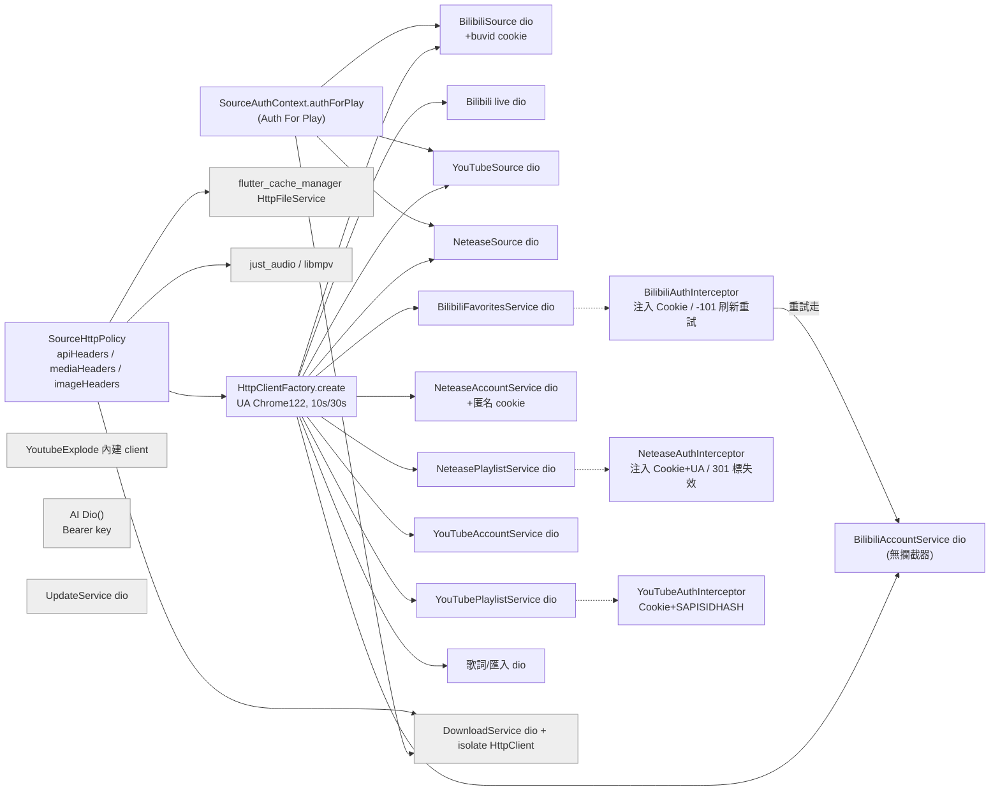
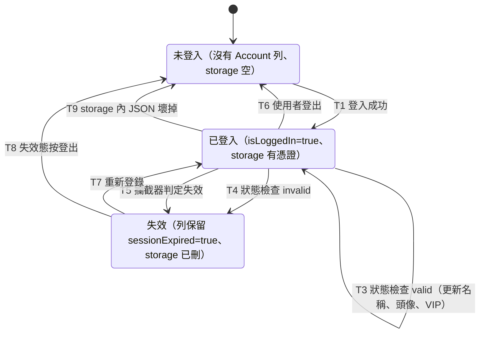

# 帳號與網路層現況審計

> 現況描述，未經確認，不代表目標。

審計基準：分支 `docs/audit`（HEAD `6d78fe23`），2026-09-26。只讀原始碼，沒有打真實 API，也沒有執行 app。
行號都是實際看過的位置。「**推測**」代表依程式碼推論、未實測；「**不一致**」代表文件（含註釋）和程式碼對不上。
本文件不寫出任何 cookie、token、key 的值。硬編碼的金鑰只列位置與用途，值一律寫成 `***`。

---

## 1. 各音源登入方式

### 1.1 總覽

| | Bilibili | YouTube | 網易雲 |
|---|---|---|---|
| 登入方式 | WebView（兩平台）＋ QR 碼（兩平台） | 只有 WebView | Android：WebView ＋ QR；Windows：只有 QR |
| UI | `lib/ui/pages/settings/bilibili_login_page.dart:51-63` | `youtube_login_page.dart:322-340` | `netease_login_page.dart:51-78` |
| 取得的憑證 | SESSDATA、bili_jct、DedeUserID、DedeUserID__ckMd5、refresh_token | SID、HSID、SSID、APISID、SAPISID、`__Secure-1PSID`／`3PSID`／`1PAPISID`／`3PAPISID`、LOGIN_INFO、DATASYNC_ID（選用） | MUSIC_U、`__csrf`、userId |
| 必要欄位 | SESSDATA、bili_jct、DedeUserID（`bilibili_account_service.dart:99-103`） | SAPISID、`__Secure-1PSID`、`__Secure-3PSID`（`youtube_account_service.dart:34-38,57-67`） | MUSIC_U（`netease_credentials.dart:16-21`） |
| 憑證存放 | secure storage `account_bilibili_credentials`（`bilibili_account_service.dart:73`） | `account_youtube_credentials`（`youtube_account_service.dart:27`） | `account_netease_credentials`（`netease_account_service.dart:30`） |
| Isar | `Account` 列只存非敏感狀態：platform、userId、userName、avatarUrl、isLoggedIn、isVip、sessionExpired、loginAt、lastRefreshed（`lib/data/models/account.dart:9-48`） | 同左 | 同左 |
| 刷新 | 有：cookie refresh 流程（§1.5） | 沒有（`refreshCredentials` 直接回 true，`youtube_account_service.dart:166-172`） | 沒有（`netease_account_service.dart:299-305`） |
| 帶憑證的方式 | `Cookie` 標頭 | `Cookie` ＋ `Authorization: SAPISIDHASH <ts>_<sha1>`（`youtube_credentials.dart:97-102`） | `Cookie`（加上 `os=pc; deviceId=fmp`）＋ Origin、Referer、桌面版 UA（`netease_credentials.dart:41-52`；`netease_account_service.dart:592-599`） |

### 1.2 Bilibili

證據：WebView 取 cookie 在 `bilibili_login_page.dart:126-190`；清理在 `:105-124`；QR 在 `bilibili_account_service.dart:133-253`；寫入在 `:92-130`。

**QR 流程的缺口：** 輪詢回 code 0，但 Set-Cookie 解析不出 cookie 時（`cookies == null`），程式不會呼叫 `loginWithCookies`，卻照樣送出 `success`（`bilibili_account_service.dart:184-200`）。UI 收到後會顯示登入成功並關閉頁面（`bilibili_login_page.dart:294-297`）。**已由程式碼確認（核查）：** UI 在 `success` 後先呼叫 `fetchAndUpdateUserInfo()`，它把例外全吞掉（`bilibili_account_service.dart:511-517`）；而沒有憑證時 `checkAccountStatus()` 直接回 `invalid`、不丟例外（`:469-473`），所以一定會走到 `widget.onLoginSuccess()`。結果是頁面顯示登入成功，secure storage 與 Account 列都沒有被寫入。尚未實測的只剩「伺服器是否真的會回 code 0 卻不帶 Set-Cookie」。（核查更正：原寫「**推測：** 使用者會看到『登入成功』，實際上沒有任何憑證被存下來」）另一個分支：Set-Cookie 有值但缺 SESSDATA 等必要欄位時，`loginWithCookies` 丟 `ArgumentError`，被輪詢迴圈的 `catch` 當成網路錯誤處理，畫面回到「等待掃碼」，而且例外字串會進 stream 的 `message`（`:220-236`）。

### 1.3 YouTube

證據：`youtube_login_page.dart:71-120,214-299,327-339`；`youtube_account_service.dart:56-96,236-249`。帳號狀態檢查打 InnerTube `browse SPaccount_overview`，失敗再試頻道頁，最後試 guide（`youtube_account_service.dart:178-233,257-332`）。

### 1.4 網易雲

證據：`netease_account_service.dart:78-105,108-231,311-367,478-545`；`netease_login_page.dart:122-160,254-268`。

### 1.5 刷新與失效

- **啟動時**：`accountStatusCheckProvider` 先等 `accountCookieRefreshProvider`。後者只處理 Bilibili：已登入就呼叫 `refreshCredentials()`。接著 `verifyAllAccountStatuses` 對每個已登入的平台呼叫 `checkAccountStatus()`；回 invalid 就 `markSessionExpired()` 並跳一次提示（`lib/providers/account/account_provider.dart:131-178,216-252`）。`lib/app.dart:125` watch `accountStatusCheckProvider`，`accountCookieRefreshProvider` 是在前者內部被 watch（`account_provider.dart:167`）；`app.dart:128` watch 的是 `accountSessionExpiryWatcherProvider`。（核查更正：原寫「這兩個 provider 都在 `lib/app.dart:125,128` 被 watch」）
- **Bilibili cookie refresh**（`bilibili_account_service.dart:351-454`）：
  1. `GET passport/x/passport-login/web/cookie/info`，`refresh != true` 就直接回 true。
  2. 用寫死的 RSA 公鑰做 RSA-OAEP(SHA-256)，加密 `refresh_{timestamp}` 得到 correspondPath（`lib/services/account/bilibili_crypto.dart:14-25`）。
  3. `GET www.bilibili.com/correspond/1/<path>`，從 HTML 抓出 refresh_csrf（`:456-463`）。
  4. `POST .../cookie/refresh`，拿到新的 Set-Cookie 和新的 refresh_token，寫回 secure storage。
  5. `POST .../confirm/refresh`，帶新 cookie 和舊 refresh_token。
- **請求期偵測**：只有 `BilibiliFavoritesService`、`NeteasePlaylistService`、`YouTubePlaylistService` 的 Dio 掛了攔截器（§2）。音源 adapter（搜尋、串流解析、詳情）都沒掛，它們收到 -101 或 301 不會把帳號標成失效。
  - Bilibili：-101／-111 時共用同一個 Completer 做刷新；刷新失敗或重試後仍是 -101，就 `markSessionExpired`（`lib/services/account/bilibili_auth_interceptor.dart:38-123`）。
  - 網易：已登入卻收到 code 301，就 `markSessionExpired`（`netease_auth_interceptor.dart:37-59`）。
  - YouTube：只記 warning，不做任何事（`youtube_auth_interceptor.dart:30-60`）。
- **Bilibili 刷新後重試帶的是舊 cookie（送出舊 cookie 這點已由程式碼確認；伺服器的回應未實測）**：`onRequest` 把舊 cookie 直接寫進 `options.headers['Cookie']`（`bilibili_auth_interceptor.dart:28-33`）。刷新後的重試是 `_accountService.dio.fetch(requestOptions)`（`:77`），用的是同一份 `RequestOptions`，而帳號服務那個 Dio 沒有掛攔截器（`bilibili_account_service.dart:83,619`；整個 lib 的 `interceptors.add` 只有三處，見 §2）。`refreshCredentials()` 只更新 secure storage 與 `_cachedCredentials`（`:425-429`），不會回頭改那份 `RequestOptions`。所以重試送出去的一定是刷新**前**的 cookie；收藏夾寫入請求 body 裡的 `csrf`（舊 `bili_jct`）也不會更新。**推測**：刷新真的換了 cookie 時，重試很可能再收到 -101，接著被標成失效。（核查更正：原寫「（推測，未實測）」涵蓋整段）現有測試只覆蓋「刷新救不回來」這條路（`test/services/account/account_session_expiry_test.dart:125`）。
- **登出**（`logout`）：刪 secure storage 的 key、清記憶體快取、刪整筆 Account 列、清 WebView 裡對應網域的 cookie（Bilibili `:295-319`；網易 `:268-287`；YouTube `:136-155`）。
- **失效**（`markSessionExpired`）：刪憑證，但 Account 列保留並設 `sessionExpired=true`（Bilibili `:321-328`；網易 `:289-297`；YouTube `:157-164`）。
- **secure storage 讀不出來**：降級成「未登入」，只記一行固定訊息（例如 `bilibili_account_service.dart:553-564`）。Bilibili 沒有 `_credentialsLoaded` 旗標，只用 `_cachedCredentials != null` 判斷，所以**沒有憑證（或讀取失敗）時**每次呼叫都會重讀一次 storage；有憑證時走記憶體快取（`bilibili_account_service.dart:551-552`）。（核查更正：原寫「所以每次呼叫都會重讀一次 storage」）網易有這個旗標（`netease_account_service.dart:28,403`）。
- **「重設所有資料」不會清憑證**：只清 Isar（`lib/data/repositories/data_integrity_repository.dart:55-56`；`developer_options_page.dart:551`），`getAuthHeaders()` 又只看 secure storage 與記憶體快取（`bilibili_account_service.dart:264-267`）。重設後 `runDatabaseMigration` 重建的 Settings 預設 Bilibili、網易 `useAuthForPlay=true`，所以 `authForPlay` 仍會取出舊 cookie（核查：呼叫鏈已由程式碼確認）。見 data.md §3.1。

---

## 2. HTTP client 與攔截器

- 用的是 **dio 5.11.1**（`pubspec.lock`）。`package:http` 只是 dev_dependency，給 `tool/demo` 用（`pubspec.yaml:100-105`）。
- **沒有** `LogInterceptor`、重試攔截器、快取攔截器，也沒有 `CookieJar`。整個 lib 只有三處 `interceptors.add`，全部是認證攔截器（`bilibili_favorites_service.dart:48`、`netease_playlist_service.dart:64`、`youtube_playlist_service.dart:55`）。cookie 一律手動組成 `Cookie` 標頭。
- 共用工廠 `HttpClientFactory.create`：預設 UA 是 Chrome 122 桌面版，connect 逾時 10 秒、receive 逾時 30 秒（`lib/core/utils/http_client_factory.dart:12-41`；`app_constants.dart:115,118`）。音源專用的 `SourceHttpPolicy.createApiDio`／`createBilibiliLiveDio` 包在它外面，會套上各音源的標頭（`lib/data/sources/source_http_policy.dart:161-181`）。

| # | 實例 | 建立處 | 標頭／攔截器 |
|---|---|---|---|
| 1 | BilibiliSource `_dio` | `lib/data/sources/bilibili_source.dart:96-102` | createApiDio(bilibili)，另加一組**隨機 buvid 指紋 cookie**（`:91-94,121-147`）；帳號 cookie 由 `_withAuth` 在每次請求合併進去（`:167-174`） |
| 2 | BilibiliSource `_liveDio`／BilibiliLiveClient | `bilibili_source.dart:108`；`bilibili_live_client.dart:127-128` | live Referer ＋ media UA |
| 3 | YouTubeSource `_dio` ＋ `YoutubeExplode()` 內建 client | `youtube_source.dart:57,60` | createApiDio(youtube)；youtube_explode 用它自己的 HTTP client 和 client 身分 |
| 4 | NeteaseSource `_dio` | `netease_source.dart:46` | createApiDio(netease)；帳號 cookie 透過 `_withAuth` 每次附上（`:779-783`） |
| 5 | BilibiliAccountService `_dio` | `bilibili_account_service.dart:83` | createApiDio，**無攔截器**；攔截器的重試也走這個 Dio |
| 6 | BilibiliFavoritesService | `bilibili_favorites_service.dart:46-50` | createApiDio ＋ **BilibiliAuthInterceptor** |
| 7 | NeteaseAccountService `_dio` | `netease_account_service.dart:46-50` | createApiDio ＋ 固定的匿名 cookie（`:37-39`） ＋ form-urlencoded |
| 8 | NeteasePlaylistService | `netease_playlist_service.dart:59-65` | createApiDio（Linux UA） ＋ **NeteaseAuthInterceptor** |
| 9 | YouTubeAccountService `_dio` | `youtube_account_service.dart:45-48` | createApiDio(json) |
| 10 | YouTubePlaylistService | `youtube_playlist_service.dart:50-55` | createApiDio ＋ **YouTubeAuthInterceptor** |
| 11 | DownloadService `_dio`（抓封面、頭像） | `download_service.dart:192-197` | receive 逾時 30 分鐘，media UA |
| 12 | 下載 isolate 的 `HttpClient`（抓音檔） | `download_service.dart:1819` 附近 | 每一跳重算 `MediaHandoff` 標頭；拒絕非 http(s) 或私有位址的重導向（`:1827-1846`）；最多 5 跳 |
| 13 | UpdateService | `update_service.dart:218,756` | 打 GitHub API（`:397`），不帶憑證 |
| 14 | 歌詞：lrclib／網易歌詞／QQ 音樂 | `lrclib_source.dart:31`；`lib/services/lyrics/netease_source.dart:141`；`qqmusic_source.dart:108` | 各自的 UA 和 Referer；不帶帳號 |
| 15 | AI：`AiLyricsSelector`、`AiTitleParser` | `ai_lyrics_selector.dart:72`；`ai_title_parser.dart:21` | 裸 `Dio()`；請求時加 `Authorization: Bearer <使用者 key>`（`openai_chat_client.dart:48-67`） |
| 16 | 歌單匯入：QQ 音樂、Spotify | `qq_music_playlist_source.dart:14`；`spotify_playlist_source.dart:16` | HttpClientFactory 預設 |
| 17 | 圖片快取 | `network_image_cache_service.dart:442`（flutter_cache_manager 的 `HttpFileService`） | 由 ImageLoadingService 依 host 附上 `imageHeadersForUrl`（`source_http_policy.dart:104-119`） |
| 18 | 播放器 | just_audio `AudioSource.uri(headers:)`（`just_audio_service.dart:564`）；media_kit／libmpv | 只帶 `mediaHeaders`（不含憑證） |
| 19 | WebView | 三個登入頁 | 自帶 cookie store |

帳號標頭是怎麼傳到音源 adapter 的：`SourceAuthContext.authForPlay(sourceType)` 先看 `Settings.useAuthForPlay(sourceType)`，開著才呼叫 `AccountServiceAuthLoader.load` → `service.getAuthHeaders()`（`lib/services/account/source_auth_context.dart:22-36,133-137`）。結果放進 `AudioStreamRequest.authHeaders`（`stream_resolution_service.dart:400-417`），由 adapter 自己合併進請求標頭。

---

## 3. 各音源的標頭、簽名與請求策略

### 3.1 Bilibili

| 項目 | 現況 | 證據 |
|---|---|---|
| API UA | Chrome 122 Windows（`webUserAgent`） | `source_http_policy.dart:12,52` |
| API Referer／Origin／Accept | `https://www.bilibili.com/`、`https://www.bilibili.com`、JSON | `:44-53` |
| 媒體與圖片 | 只有 `Referer: https://www.bilibili.com`（刻意不帶尾斜線）＋ media UA（Chrome 120） | `:9-11,46,82-84` |
| 搜尋 | Referer／Origin 改成 search.bilibili.com，加 `Accept-Language`，cookie 只有 buvid 指紋 | `:138-152`；`bilibili_source.dart:103-107` |
| 直播 | Referer `live.bilibili.com` ＋ media UA | `source_http_policy.dart:154-159` |
| buvid | 每次程序啟動隨機產生 buvid3、buvid4、b_nut、_uuid、buvid_fp，本機亂數，不向 `finger/spi` 申請 | `bilibili_source.dart:121-147` |
| WBI 簽名 | **沒有實作**。view 改打 `wbi/view` 但不簽名，註釋說「目前不驗簽」 | `bilibili_source.dart:77-84` |
| 風控 | -352 等風控碼 → `rateLimited`，不換指紋重試，由上層退避 | `bilibili_source.dart:920-948`；`bilibili_exception.dart:15` |
| csrf | 收藏夾寫入時把 `bili_jct` 當成 `csrf` 參數送出 | `bilibili_favorites_service.dart:122-136` |
| Cookie refresh 加密 | RSA-OAEP(SHA-256)，公鑰寫死在程式裡 | `bilibili_crypto.dart:14-33` |

### 3.2 YouTube

| 項目 | 現況 | 證據 |
|---|---|---|
| 匿名取流 | youtube_explode 3.1.0：audio-only 用 `androidVr`；muxed 用 `ios`、`safari`、`android`；HLS 依序試 `safari`、`ios`、兩者一起 | `youtube_source.dart:445-460,484-500,533-545` |
| 登入取流 | 每種 streamType 先匿名試，失敗才用 InnerTube **WEB** client 打 `/youtubei/v1/player?key=…`，帶 Cookie ＋ SAPISIDHASH | `:340-376,406-423,121-139` |
| InnerTube 身分 | `clientName=WEB`、`clientVersion=2.20260128.05.00`、`hl=en`、`gl=US` | `lib/core/utils/innertube_utils.dart:5-20`；`youtube_source.dart:128-133` |
| API UA／Origin／Referer | media UA（Chrome 120）；`https://www.youtube.com` | `source_http_policy.dart:55-60` |
| Mix 播放清單 | InnerTube `next`；HTTP 429 → rate_limited | `youtube_source.dart:1072-1100` |
| 帳號標頭 | `Cookie` ＋ `Authorization: SAPISIDHASH`（SHA1(`ts SAPISID https://www.youtube.com`)） | `youtube_credentials.dart:97-102`；`youtube_account_service.dart:108-115` |

### 3.3 網易雲

| 項目 | 現況 | 證據 |
|---|---|---|
| UA | `NeteaseMusicDesktop/3.0.18` 桌面版 UA；歌單管理用 Linux Chrome 60 UA | `source_http_policy.dart:13-19,68` |
| 取流 | **eapi**（AES-128-ECB ＋ MD5），打 `interface3.music.163.com/eapi/song/enhance/player/url/v1`，帶帳號 cookie（`os=pc; deviceId=fmp`） | `netease_source.dart:88-121`；`lib/core/utils/netease_crypto.dart:78-88`；`netease_credentials.dart:41-52` |
| QR 登入 | **weapi**（兩層 AES-128-CBC ＋ 無 padding 的 RSA），加上固定的匿名 cookie（偽裝 Windows 客戶端） | `netease_crypto.dart:56-68,115-121`；`netease_account_service.dart:37-39,109-113,152-156` |
| 搜尋與詳情 | 明文 `/api/*` form | `netease_source.dart:22-23,194,536` |
| 歌單管理 | `/api/linux/forward`，payload 以 AES-ECB 加密成 `eparams`；cookie 前面改成 `os=linux`；**固定送 `X-Real-IP: 118.88.88.88`** | `netease_playlist_service.dart:221-275` |
| URL 有效期 | 採用 API 回的 `expi`，沒有時退回 16 分鐘 | `netease_source.dart:40,164-169` |

### 3.4 請求節流

整個 app **沒有全域的 rate limiter 或 semaphore**（grep 不到）。有的是這些分散的延遲與退避：

- 匯入比對：多源間隔 1000 ms、單源 800 ms（`lib/core/constants/app_constants.dart:81-88`）。
- 串流解析重試：一般 1 秒，被限流時 3 秒（`:134-146`）。
- 播放失敗的漸進重試：1、2、4、8、16 秒（`:225-247`）。電台重連：1、3、10 秒（`:249-261`）。
- 排行榜：失敗後依 `defaultFailureRetryDelays` 退避（`ranking_cache_service.dart:17`）。
- 電台輪詢：App 進背景時暫停（`main.dart` `_RadioRefreshLifecycleObserver`）。
- QR 輪詢：Bilibili 每 2 秒、最多 90 次；網易每 3 秒、最多 60 次；連續 5 次錯誤就停。

### 3.5 CONTEXT.md 術語對照

| 術語 | 程式碼對應 | 結論 |
|---|---|---|
| Source Auth Context | `SourceAuthContext`／`DefaultSourceAuthContext`（`source_auth_context.dart:76-194`） | 對得上 |
| Auth For Play | `Settings.useAuthForPlay(sourceId)`（`settings.dart:724`）；閘門在 `authForPlay()`（`source_auth_context.dart:133-137`）；消費點有串流解析（`stream_resolution_service.dart:406`）、下載（`download_service.dart:979`）、詳情（`track_detail_provider.dart:185`）、**首頁排行榜**（`ranking_cache_service.dart:270-274`） | 大致對得上。**不一致（輕微）**：CONTEXT.md 列的範圍沒提到排行榜。匯入與刷新走的是另外兩個函式 `playlistImportAuth`／`playlistRefreshAuth`（`import_service.dart:194,441`），搜尋不帶登入，這兩點和 CONTEXT 一致 |
| Stream Resolution Auth | `MediaHandoffRequest.streamResolutionAuth`（`lib/services/media/media_handoff.dart:16-21`） | 對得上 |
| Media Request Credentials（應為空） | `SourceHttpPolicy.mediaHeaders(sourceType)` 只接受 id，回傳 Origin／Referer／UA（`source_http_policy.dart:82-84`）；`DefaultMediaHandoff` 只加 Range（`media_handoff.dart:54-62`） | 對得上。**不一致（註釋過時）**：`netease_account_service.dart:241-242` 的註釋說「供音頻播放器直接使用（CDN 需要 Cookie）」，但播放器實際上拿不到它 |
| Media Handoff | `MediaHandoff.preparePlayback`／`prepareDownloadHop`；下載 isolate 每一跳重算標頭（`download_service.dart:1847-1856` 附近） | 對得上 |

---

## 4. 敏感資訊外洩面

### 4.1 現有的遮蔽函式

| 函式 | 位置 | 規則 | 誰會呼叫 |
|---|---|---|---|
| `AppLogger.redactSensitive` | `lib/core/logger.dart:177-200` | ① `Authorization` 標頭的值；② `SAPISIDHASH …`；③ `Bearer …`；④ `Cookie:`／`Cookie=` 後面整段；⑤ 26 個鍵名的 `key[:=]value` 形式，大小寫不分、**沒有字邊界**：MUSIC_U、musicU、`__csrf`、csrf、eparams、SESSDATA、bili_jct、DedeUserID、DedeUserID__ckMd5、refresh_token、access_token、apiKey、SAPISID、APISID、SID、HSID、SSID、`__Secure-*PSID`／`*PAPISID`、LOGIN_INFO、storePassword、keyPassword、password、token（`:81-134`） | **只有 `AppLogger._log` 會呼叫**（`:235-238`），處理 message 和 `error.toString()`。stackTrace **不處理**。lib 裡沒有其他呼叫者。測試：`test/core/logger/redaction_test.dart`、`test/services/account/account_credentials_redaction_test.dart` |
| `redactStreamUrl` | `lib/services/audio/playback_media.dart:12-19` | 只留 `scheme://host/…/最後一段路徑`，query 和中間路徑全部去掉 | `just_audio_service.dart:541,589`、`media_kit_audio_service.dart:743,819`、`PreparedPlaybackMedia.logLabel`（`playback_media.dart:68`），後者被 `playback_request_session.dart:544`、`audio_provider.dart:1733`、兩個後端的 next-medium log 使用 |
| `userMessageFor` | `lib/core/errors/user_message.dart:72-87` | 把例外轉成翻譯過的句子，不顯示原文 | `ToastService.failure`（`toast_service.dart:188-198`）、`failureMessage`（`user_message.dart:97-105`） |
| `SecureStorageUnavailable` | `secure_key_value_store.dart:13-27` | 只帶平台錯誤碼 | 三個帳號服務和 AI key 服務 |
| `_truncate(…, 60)` | `database_catalog.dart:164-165` | DB 檢視器裡的 URL 只顯示前 60 字 | 除錯頁 |

`redactSensitive` 的**缺口**：它沒有處理 CDN 簽名參數（例如 `sig`、`signature`、`lsig`、`expire`、`upsig`、`deadline`，以及網易放在路徑段裡的簽章），也沒處理 InnerTube 的 `key=`。這些都要靠呼叫端自己先過 `redactStreamUrl`。

### 4.2 逐一出口

| 出口 | 可能外洩什麼 | 是否經過遮蔽 | 證據 |
|---|---|---|---|
| AppLogger 記憶體緩衝（500 筆）＋ logStream | log 訊息與錯誤原文 | 是（redactSensitive） | `logger.dart:72,235-267` |
| Log 檔 `Documents/FMP/logs/fmp.log`（2 MB × 3） | 同上。Windows 上放在「文件」資料夾，**推測**可能被 OneDrive 之類的同步工具帶走 | message／error 是；**stackTrace 原樣寫入**（`LogEntry.toFileLine`，`logger.dart:52-63`）（核查更正：原寫「是」） | `log_file_sink.dart:24-28`；`logger.dart:269-270` |
| `debugPrint`（**release 版也會印**） | 同上。Android release 會進 logcat | 是（印的是 `fullMessage`／`safeError`）；**stackTrace 原樣輸出** | `logger.dart:283-290` |
| `developer.log`（只在 debug） | 同上 | 是 | `logger.dart:273-281` |
| Log 檢視頁：複製到剪貼簿、匯出 log 檔 | 同上 | 複製用 `LogEntry.toString()`，不含 error／stackTrace；匯出是整份 log 檔（`sink.readAll()`），所以帶著未遮蔽的 stackTrace（核查更正：原寫「是（內容已經遮蔽過）」） | `log_viewer_page.dart:93,102-139,293,402` |
| media_kit 錯誤串流 | mpv 錯誤字串。**推測**：`file`／`stream` 類錯誤可能帶完整 URL（含簽名） | **否**，原樣寫入 `logError('media_kit error: $error')` | `media_kit_audio_service.dart:378-379` |
| just_audio `PlayerException` | 平台錯誤訊息。**推測**：ExoPlayer 部分錯誤可能帶 URI | **否**（只有 redactSensitive） | `just_audio_service.dart:301-304` |
| `Failed to play URL` 的 `e` | 例外原文 | 只有 redactSensitive | `just_audio_service.dart:578`；`media_kit_audio_service.dart:805,843` |
| youtube_explode 例外（`Stream type … failed: $e`） | 例外訊息。**推測**：可能含請求 URL | 只有 redactSensitive | `youtube_source.dart:398,402` |
| Dio 例外 `$e` | dio 5.11.1 的 `toString()` 只含 type、message、內層 error，**不含 URL 和標頭**（依套件原始碼 `dio_exception.dart:321-331`）；內層的 `HttpException` 可能帶 uri（推測） | 只有 redactSensitive | 例如 `bilibili_account_service.dart:222,451` |
| Set-Cookie 解析失敗時印出整段 cookie | 整段 Set-Cookie | 是，但只遮得到清單裡的鍵名 | `bilibili_account_service.dart:613`；`netease_account_service.dart:552` |
| 使用者識別資訊 | Bilibili DedeUserID、網易 userId、YouTube 帳號或頻道名稱會以明文寫進 info log（`userId: …` 不符合 `DedeUserID=` 的模式） | 否 | `bilibili_account_service.dart:129`；`netease_account_service.dart:97-99`；`youtube_account_service.dart:276-277,306,324` |
| 下載錯誤 | isolate 只回傳 `e.message`／`e.path`，不回傳 URL；`errorMessage` 會存進 DownloadTask | 形式上沒問題 | `download_service.dart:1965-2020` |
| Toast | `ToastService.failure` 只顯示翻譯句。但 `SourceErrorKind.unknown`／`rateLimited` 會直接顯示 adapter 的原始 message；有幾頁用 `ToastService.error(context, e.message)` 顯示遠端例外訊息 | 部分 | `user_message.dart:56-58`；`playlist_detail_page.dart:625-633`；`add_to_bilibili_playlist_dialog.dart:81,243` |
| QR 輪詢錯誤訊息 | `e.toString()` 放進 stream。Bilibili 只在 expired 時顯示，而那時內容是固定的 'Network error'；網易完全不顯示 | 無遮蔽，但不上畫面 | `bilibili_account_service.dart:233-238`；`bilibili_login_page.dart:289-291`；`netease_account_service.dart:217` |
| 啟動失敗畫面 | `error.toString()` 原文和 log 路徑 | 否 | `lib/app.dart:87`；`main.dart:68-81` |
| 除錯頁：DB 檢視器 | Track.audioUrl 前 60 字（host 加部分路徑）、Account 的 userId／userName、Settings 的 lyricsAiEndpoint 全文；**不顯示 secure storage** | 部分截斷 | `database_catalog.dart:132-139,164-166,485` |
| Isar 檔案（落盤） | `Track.audioUrl` 是**完整的簽名 URL**，到期時間照各來源回的 expiry 記；來源沒給時記 1 小時（`stream_resolution_service.dart:427-430`）。（核查更正：原寫「（1 至 2 小時有效）」，程式碼裡查不到 2 小時這個依據）Windows 上放在「文件\FMP」 | 否 | `stream_resolution_service.dart:427-471`；`database_provider.dart:50-53` |
| 備份匯出 JSON | **不含**憑證、API key、audioUrl。含 lyricsAiEndpoint、播放與搜尋歷史、歌單來源 URL、ownerUserId。明文，沒有加密 | 不需要 | `backup_service.dart:91-310`；`backup_data.dart:345-372` |
| 下載 metadata.json | 不含 URL 和憑證；含熱門留言者的名稱與頭像 | — | `download_service.dart:1499-1564` |
| 網路：媒體與 CDN | 刻意不帶憑證 | 由設計保證 | `source_http_policy.dart:73-84`；`media_handoff.dart:54-62` |
| 網路：重導向 | 下載 isolate 每跳重算標頭，拒絕私有位址 | 是 | `download_service.dart:1827-1856` |
| 網路：AI 端點 | 使用者的 API key（Bearer）和歌曲標題會送到使用者自訂的 URL；**沒有檢查 https**，填 http 就會明文送出 | 否 | `openai_chat_client.dart:41-67`；`openai_chat_endpoint.dart:1-6` |
| 網路：網易 `X-Real-IP` | 送出偽造的固定 IP（不算外洩，屬於請求偽裝） | — | `netease_playlist_service.dart:250` |
| Crash 回報、分享、診斷上傳 | **查不到**：pubspec 沒有 sentry、firebase、crashlytics、share_plus | — | `pubspec.yaml` |

---

## 5. 硬編碼的 key、secret、appkey

值一律寫成 `***`。以下沒有任何一項是 FMP 自己申請的私密憑證，都是逆向自各平台前端，或是公開金鑰。但它們在 repo 裡是明文。

| 位置 | 類型 | 用途 |
|---|---|---|
| `lib/core/utils/innertube_utils.dart:14` | YouTube InnerTube WEB API key（`***`） | `/youtubei/v1/*` 的 `?key=`。註釋說這是 youtube.com 前端公開的 key（`:8-13`）。另外在 `youtube_login_page.dart` 的 JS fetch 裡也會拼進 URL |
| `lib/core/utils/netease_crypto.dart:23` | 網易 weapi AES 預設金鑰（`***`） | QR 登入的 weapi 加密 |
| `netease_crypto.dart:26` | 網易 AES IV（`***`） | 同上 |
| `netease_crypto.dart:29` | 網易 eapi AES 金鑰（`***`） | 取流的 eapi 加密 |
| `netease_crypto.dart:36-40,48` | 網易 RSA 公鑰模數（公鑰）、eapi 分隔符 | weapi 的金鑰封裝 |
| `lib/services/account/netease_playlist_service.dart:49` | 網易 linux forward API 的 AES 金鑰（`***`） | 歌單管理 `eparams` 加密 |
| `lib/services/account/bilibili_crypto.dart:29-33` | Bilibili RSA 公鑰（base64 DER，公鑰） | cookie refresh 的 correspondPath |
| `lib/data/sources/playlist_import/qq_music_sign.dart:12,18,21` | QQ 音樂簽名用的 XOR key 和索引表（`***`） | QQ 音樂歌單匯入的簽名 |
| `netease_account_service.dart:37-39` | 網易匿名 cookie（偽裝 Windows 客戶端的 os／osver／appver） | QR 登入 |
| `netease_playlist_service.dart:250` | 固定的 `X-Real-IP` | 歌單管理請求 |
| `lrclib_source.dart:24` | lrclib UA，裡面有佔位網址 `github.com/user/fmp` | lrclib 的禮貌 UA |

**沒有找到**：Bilibili appkey／appsec、WBI mixin key（WBI 沒有實作）、Spotify client secret（Spotify 匯入走 embed 頁，`spotify_playlist_source.dart:57`）、GitHub token（更新檢查走匿名 API）。也沒有 `String.fromEnvironment`／dotenv 這類注入。

---

## 6. 帳號系統全貌

本節只補 §1 與其他審計檔沒寫到的部分。登入流程細節見 §1.2–1.4；刷新與失效的機制見 §1.5；各平台失效判定見 `errors.md` §3.3；secure storage 的 key 與「重設所有資料不清憑證」見 `data.md` §3.1；功能入口見 `features.md` §8。

### 6.1 兩份登入狀態：Isar `Account` 與 secure storage

「是否登入」在程式裡有兩個來源，而且彼此不會自動同步：

| 讀的人 | 讀哪一份 | 證據 |
|---|---|---|
| 帳號管理頁的三張卡片（頭像、名稱、VIP 圖示、失效紅字、按鈕組） | Isar `Account`（`AccountNotifier` 監聽 `watchByPlatform`） | `account_management_page.dart:34-36,60-123`；`lib/providers/account/account_provider.dart:257-274` |
| `isLoggedInProvider(sourceId)`：匯入對話框的「使用登入狀態匯入」開關、「加入遠端歌單」的登入閘門、遠端編輯 planner | Isar `Account.isLoggedIn` | `account_provider.dart:96-100`；`import_playlist_dialog.dart:274-291`；`track_action_handler.dart:283-287,306-310`；`search_page.dart:1373-1379`；`remote_playlist_sync_provider.dart:75` |
| 各服務的 `isLoggedIn()`：啟動時要不要做 B 站 cookie refresh、要不要做狀態檢查、網易攔截器要不要把 301 當失效 | Isar `Account.isLoggedIn` | `bilibili_account_service.dart:284-287`；`youtube_account_service.dart:126-129`；`netease_account_service.dart:258-261`；`account_provider.dart:133,225`；`netease_auth_interceptor.dart:54` |
| **實際送出去的請求**：`getAuthHeaders()`／`getAuthCookieString()`（Auth For Play、匯入、刷新、三個攔截器、狀態檢查、勳章牆） | **只看 secure storage**（加記憶體快取），不看 `Account` | `bilibili_account_service.dart:258-267,551-575`；`youtube_account_service.dart:108-121`；`netease_account_service.dart:236-247` |

兩份不一致時會發生的事：

- **Isar 說未登入、storage 還有憑證**：「重設所有資料」之後就是這樣。UI 全部顯示未登入，播放、下載、詳情、排行仍帶舊 cookie。已記在 §1.5 最後一條與 `data.md` §3.1，這裡不重寫。
- **Isar 說已登入、storage 讀不到**（`SecureStorageUnavailable`）：`_loadCredentials` 降級回 null（`bilibili_account_service.dart:553-564`），請求全部變匿名，帳號卡仍顯示已登入。音訊設定頁的「讀不到憑證儲存」提示是看歌詞 AI key 那一次讀取決定的（`audio_settings_provider.dart:139-146`），帳號頁沒有對應提示。啟動時的狀態檢查接著會怎麼走（已由程式碼確認）：`verifyAllAccountStatuses` 依 Isar 判定已登入 → `checkAccountStatus()` 拿不到 cookie，直接回 `invalid`（B `bilibili_account_service.dart:470-473`；Y `youtube_account_service.dart:179-182`；N `netease_account_service.dart:312-315`）→ `markSessionExpired()` 刪 storage、跳「登錄已失效」提示（`account_provider.dart:233-236`）。**推測**：如果讀取失敗只是暫時的，而刪除那一步成功，一組仍然有效的憑證會被刪掉。「讀不到」與「沒有」在這裡被當成同一件事。
- **B 站 QR 假成功**：頁面顯示成功，兩份狀態都沒寫入。見 §1.2。

### 6.2 狀態機（三源共用）

三個服務實作同一個 `AccountService` 介面（`lib/services/account/account_service.dart:15-48`），狀態轉換的形狀一樣，差別只在觸發點。

| 轉換 | Bilibili | YouTube | 網易雲 |
|---|---|---|---|
| T1 登入成功（寫 storage，列設 `isLoggedIn=true`、`sessionExpired=false`） | `bilibili_account_service.dart:92-130`（`sessionExpired: false` 在 `:126`） | `youtube_account_service.dart:56-96`（`:93`） | `netease_account_service.dart:464-476`（`:474`）；失敗時還原快照 `:478-545` |
| T2 cookie refresh | `account_provider.dart:131-152` → `bilibili_account_service.dart:351-454` | 無（`:166-168` 回 true） | 無（`:299-301` 回 true） |
| T3／T4 狀態檢查（啟動、帳號頁右上角按鈕） | `bilibili_account_service.dart:469-508`：-101／-111 才算 invalid | `youtube_account_service.dart:178-233`：401／403 或回應裡沒有使用者資料 | `netease_account_service.dart:311-367`：任何非 200 都算 invalid（風險見 `errors.md` §3.3） |
| T5 攔截器 | `bilibili_auth_interceptor.dart:38-123`（只掛在收藏夾服務） | **沒有**，只記 log（`youtube_auth_interceptor.dart:30-60`） | `netease_auth_interceptor.dart:37-59`（只掛在歌單服務） |
| T6 登出（刪列、清 WebView cookie） | `bilibili_account_service.dart:295-319` | `youtube_account_service.dart:136-155` | `netease_account_service.dart:268-287` |
| T4／T5 的落點 `markSessionExpired` | `bilibili_account_service.dart:321-328` | `youtube_account_service.dart:157-164` | `netease_account_service.dart:289-297` |
| T7 重新登錄 | 失效卡的主按鈕走同一個 `onLogin`（`account_management_page.dart:336-342,75`），也就是 T1 | 同左（`:98`） | 同左（`:119`） |
| T9 JSON 壞掉 | `_discardMalformedCredentials` 刪 storage、`isLoggedIn=false`，不設 `sessionExpired`（`bilibili_account_service.dart:578-584`） | 同類處理（`data.md` §3.1） | 同類處理 |

以下偵測點**不會**觸發任何轉換：

- 音源 adapter（播放解析、詳情、排行、匯入、刷新）收到 B 站 -101、網易 301、YouTube `login_required`，只會分類成 `SourceErrorKind.loginRequired`（`bilibili_exception.dart:46`；`netease_exception.dart:34`；`youtube_exception.dart:29`）。`SourceApiException.requiresLogin` 在 `lib/` 裡沒有任何呼叫者（`source_exception.dart:58`）。
- 勳章牆（帳號頁「電台」）收到非 0 碼只丟例外，UI 顯示 `unknown(LOAD)`（`bilibili_live_client.dart:338-350`；`account_radio_import_sheet.dart:88-93`）。

### 6.3 使用者看到什麼

| 情境 | 畫面 | 證據 |
|---|---|---|
| 已登入 | 卡片顯示名稱，VIP 時多一個圖示（B `verified`、Y `workspace_premium`、N 預設圖示）；按鈕是「歌單」、（僅 B 站）「電台」、「登出」 | `account_management_page.dart:254-256,302-311,321-334` |
| 失效 | 保留頭像，文字是「名稱 · 已失效」並用 error 色；按鈕是「重新登錄」、「登出」 | `:246-262,295-297,335-347` |
| 未登入 | 「未登入」＋「登錄」 | `:260-262,348-352` |
| 剛轉成失效 | 一次 warning toast「$platform 登錄已失效，請重新登錄」。啟動檢查直接呼叫；攔截器寫 Isar 後由 watcher 補 | `session_expiry_notifier.dart:14-23`；`account_provider.dart:190-199,236`；`lib/app.dart:128` |
| VIP 從有變沒有 | info toast「$platform VIP 已過期」（只在狀態檢查時比較） | `account_provider.dart:237-240` |
| 播放時收到 loginRequired | 錯誤 toast「需要登入後播放」，不會導向登入頁，帳號狀態也不變 | `lib/core/errors/user_message.dart:49`；`audio.i18n.json:13` |
| 手動驗證 | 「正在檢查」→「已驗證」，或「部分平台檢查失敗：…」 | `account_management_page.dart:129-158` |

**新發現：失效提示的去重一個 session 只有一次，重新登入也不會重置。** `_notifiedPlatforms` 只有 `add`，沒有移除的地方（`session_expiry_notifier.dart:15,22-23`）。所以同一次 app 執行裡「失效 → 重新登錄 → 再失效」時，第二次失效不會跳提示，只有帳號頁的紅字。

**新發現：登入或登出之後，首頁排行不會立刻重抓。** `lib/services/cache` 與排行相關的 provider 都沒有監聽任何帳號 provider（grep `AccountProvider|isLoggedInProvider|accountServicesProvider` 在 `lib/services/cache` 查不到），要等下一次定時刷新才會用新的登入狀態。串流解析快取的鍵裡有 auth header（`playback.md` §3.2），所以不受影響。

### 6.4 重新登錄的細節

- 重新登錄走的是完整登入流程，沒有「沿用舊帳號」的捷徑。成功後 T1 會把 `sessionExpired` 設回 false。
- `markSessionExpired` 不清 WebView cookie，只有 `logout` 會清（對照 T6 與 T4／T5 那兩列）。不過三個登入頁在 dispose 時都會清自己網域的 cookie、快取與 WebStorage（`bilibili_login_page.dart:100-124`；`youtube_login_page.dart:29-57`；`netease_login_page.dart:100-119`）。**推測**：WebView 裡通常不會殘留舊 session，重新登錄不至於自動套回舊的失效 cookie；Windows WebView2 的 user data 目錄行為沒有實測。

---

## 7. 請求類型 × 音源的憑證矩陣

### 7.1 讀法與三道閘門

- 「帶」＝一定附帳號標頭（前提是 secure storage 裡有憑證）；「不帶」＝程式碼路徑上沒有帳號標頭；「視開關」＝要看下面三個開關之一。三道閘門**都不看** Isar `Account.isLoggedIn`，只要 storage 有憑證就會送出（§6.1）。
- 三個開關：
  1. **Auth For Play**：`Settings.useAuthForPlay(sourceId)`，閘門在 `SourceAuthContext.authForPlay`（`source_auth_context.dart:132-137`）。預設 B 站 true、網易 true、YouTube false（`lib/data/models/settings.dart:76-79,91-92`）。UI 在音訊設定頁，每個音源一個開關（`audio_settings_page.dart:140-163`）。
  2. **匯入時的 `useAuth`**：`playlistImportAuth`（`source_auth_context.dart:175-181`）。匯入對話框預設 false，未登入時不能打開（`import_playlist_dialog.dart:95,270-293`）；帳號頁的「歌單」sheet 固定傳 true（`account_playlists_sheet.dart:275-278`）。
  3. **`Playlist.useAuthForRefresh`**：`playlistRefreshAuth`（`source_auth_context.dart:184-190`）。欄位預設 false（`lib/data/models/playlist.dart:45`）；匯入時直接寫成那次匯入的 `useAuth`（`import_service.dart:250,267`），所以**重新匯入同一個 URL 會覆寫使用者之前改過的值**；歌單編輯對話框可以改，Mix 歌單不顯示這個開關（`create_playlist_dialog.dart:120-140`）。
- B 站的帳號 cookie 會和 buvid 指紋 cookie 合併送出（`bilibili_source.dart:167-173`）；網易的 adapter 只取 `Cookie`（`netease_source.dart:779-783`）；YouTube 送 `Cookie` 加 `Authorization: SAPISIDHASH`（`youtube_account_service.dart:108-115`）。

### 7.2 矩陣

| 請求類型 | Bilibili | YouTube | 網易雲 |
|---|---|---|---|
| **播放（串流解析）** | 視開關｜Auth For Play｜預設 true｜`stream_resolution_service.dart:406-416` → `bilibili_source.dart:213-228`（cid `:456-460`、DASH `:334-343`、durl `:390-399`） | 視開關｜Auth For Play｜預設 **false**｜每種 streamType 先匿名，失敗才帶登入打 InnerTube WEB `/player`（`youtube_source.dart:332-366,121-144`） | 視開關｜Auth For Play｜預設 true｜每次都帶（`netease_source.dart:93-119`） |
| **播放的媒體位元組** | 不帶｜無開關｜—｜`media_handoff.dart:54-62`；`source_http_policy.dart:73-84`。`playbackNetworkRequest` 仍會呼叫 `authForPlay` 把憑證讀出來，放進 `streamResolutionAuth`，再被 `DefaultMediaHandoff` 丟掉（`source_auth_context.dart:140-156`） | 同左 | 同左 |
| **下載（解析與詳情）** | 視開關｜Auth For Play｜預設 true｜解析走同一個 `resolvePrimary(purpose: download)`（`download_service.dart:1043-1050`）；詳情 `_fetchVideoDetail`（`:976-985`） | 視開關｜同左｜預設 false｜同上；詳情先匿名（見「曲目詳情」） | 視開關｜同左｜預設 true｜同上 |
| **下載的媒體位元組** | 不帶｜無開關｜—｜憑證會被複製進 isolate 參數（`download_service.dart:802,824,1758`），但 `prepareDownloadHop` 不讀它（`:1851-1855`；`media_handoff.dart:54-62`） | 同左 | 同左 |
| **曲目詳情** | 視開關｜Auth For Play｜預設 true｜`track_detail_provider.dart:185-186` → `bilibili_source.dart:744-753` | 視開關｜同左｜預設 false｜youtube_explode **一律先匿名**；只有它失敗時才帶登入改打 InnerTube（`youtube_source.dart:214-276`） | 視開關｜同左｜預設 true｜`netease_source.dart:381,531-545` |
| **首頁排行** | 視開關｜Auth For Play｜預設 true｜`ranking_cache_service.dart:269-275` → `bilibili_source.dart:865-874,904-908` | **不帶**（開關開著也一樣）｜—｜—｜快取層會呼叫 `authForPlay` 讀出憑證，但 `getRankingTracks` 不看 `request.authHeaders`（`youtube_source.dart:1635-1638`） | **不帶**（同左）｜—｜—｜`getHotRankingTracks` 呼叫時沒有傳 auth（`netease_source.dart:334-338,355-357`） |
| **搜尋** | 不帶｜無開關｜—｜`_searchOptions` 只有 buvid（`bilibili_source.dart:476-493,103-107`）；直播間搜尋也不帶（`:1025-1045`） | 不帶｜—｜—｜youtube_explode（`youtube_source.dart:865-874`） | 不帶｜—｜—｜`netease_source.dart:195-205` 沒有 headers |
| **歌單匯入** | 視開關｜`useAuth`｜對話框 false、帳號 sheet true｜`import_service.dart:194-201`；分 P 展開沿用同一份（`:223,590`）；`bilibili_source.dart:535-551` | 視開關｜同左｜同左｜帶登入時只走 InnerTube（`youtube_source.dart:1402-1409`）。**Mix 匯入不帶**（`import_service.dart:344`；`youtube_source.dart:1396-1398`） | 視開關｜同左｜同左｜`netease_source.dart:255-280,303-306` |
| **歌單刷新**（手動、自動、遠端編輯後） | 視開關｜`Playlist.useAuthForRefresh`｜false（匯入時被覆寫成 `useAuth`）｜`import_service.dart:441-448`；觸發點 `refresh_provider.dart:124,186`、`auto_refresh_service.dart:102`、`remote_playlist_sync_provider.dart:20-24` | 同左 | 同左 |
| **收藏同步／讀取遠端歌單**（帳號頁「歌單」sheet） | 帶｜無開關｜—｜攔截器注入（`bilibili_favorites_service.dart:48,55`；`bilibili_auth_interceptor.dart:28-33`）；入口只在已登入時出現（`account_management_page.dart:321-326`） | 帶｜無開關｜—｜`youtube_playlist_service.dart:55,63`；`youtube_auth_interceptor.dart:21-23` | 帶｜無開關｜—｜`netease_playlist_service.dart:64,68`；`netease_auth_interceptor.dart:22-27` |
| **遠端歌單編輯**（加入／移出、新建） | 帶｜無開關（UI 用 `isLoggedInProvider` 擋）｜—｜`remote_playlist_sync_provider.dart:39-76`；寫入時送 `csrf=bili_jct`（`bilibili_favorites_service.dart:122-136`） | 帶｜同左｜—｜`youtube_playlist_service.dart:88-111,218-223` | 帶｜同左｜—｜`_postLinuxApi` 自己組 `Cookie: os=linux; …`（`netease_playlist_service.dart:221-250`） |
| **歌詞** | 不帶（歌詞與曲目來自哪個音源無關，一律查網易、QQ、lrclib）｜—｜—｜`lib/services/lyrics/` 內 grep `Cookie`、`authHeaders`、`AccountService` 都查不到；歌詞用的網易 client 是另一個類別（`lib/services/lyrics/netease_source.dart:141`） | 同左 | 同左 |
| **電台／直播** | 串流**不帶**（`radio_source.dart:71,128-136`；`bilibili_source.dart:1055-1057`）；帳號頁「電台」讀勳章牆**帶** cookie，無開關（`bilibili_account_service.dart:522-532`；`bilibili_live_client.dart:338-346`） | 無此功能（`radio_source.dart:59`，貼 YouTube 連結會被擋，`:140-143`） | 無此功能 |
| **Mix** | 無此功能 | **不帶**｜無開關｜—｜InnerTube `next` 的 context 裡沒有帳號標頭（`youtube_source.dart:1072-1090`）；介面本身就沒有 auth 參數（`source_capabilities.dart:49-55`） | 無此功能 |

### 7.3 值得注意的不一致

- **排行：開關打開時 YouTube 與網易的排行仍然是匿名的。** 快取層對三個音源一律讀 `authForPlay`（`ranking_cache_service.dart:269-275`），只有 B 站真的用上。§3.5 說 Auth For Play「控制首頁排行榜」，實際上只對 B 站成立。
- **YouTube 的「帶登入」只是備援。** 播放和詳情都是匿名先試，只有匿名失敗才帶登入（`youtube_source.dart:346-366,247-273`）。也就是說，登入的 YouTube 使用者就算打開 Auth For Play，平常的請求仍然是匿名的。
- **i18n 說明比實際範圍窄**：播放認證的副標只寫「播放與歌曲詳情的請求」（`lib/i18n/zh-TW/audioSettings.i18n.json:34`），實際還包括下載解析、下載詳情與 B 站排行。只有 B 站的說明提到排行（`:35`）。
- **Auth For Play 是否帶，只看 storage 裡有沒有憑證**，不看帳號頁顯示的登入狀態（§6.1）。
- **歌單刷新的開關會被重新匯入覆寫**（`import_service.dart:250`）。

### 7.4 預設值與 migration 對使用者設定值的改寫

**預設值的三個來源（目前一致）**：

| 來源 | B | Y | N | 證據 |
|---|---|---|---|---|
| 現行業務預設 `kDefaultUseAuthForPlayBySource` | true | false（查表不到時回 false） | true | `settings.dart:76-79,91-92` |
| 設定頁載入前的暫定值 | 同上 | 同上 | 同上 | `audio_settings_provider.dart:63-64` |
| 備份匯入時缺鍵的補值 | 同上 | 同上 | 同上 | `backup_data.dart:548-550,586-587` |
| 已淘汰的舊欄位（v1→v2 從這裡搬） | **false** | false | true | `settings.dart:412-429` |

舊欄位的 B 站預設是 false，現行預設是 true，兩者之間的差距就是 v3→v4 要處理的東西。

**所有改寫使用者設定值的地方**（`lib/data/database/database_migration.dart`）：

| # | 步驟 | 改了什麼 | 會不會蓋掉使用者自己的選擇 | 證據 |
|---|---|---|---|---|
| 1 | v0→v1 | 5 個欄位同時等於型別預設時，改寫 `rememberPlaybackPosition=true`、`tempPlayRewindSeconds=10`、`disabledLyricsSources='lrclib'` | 會，前提是使用者剛好把設定調成那個形狀。註釋承認形狀猜測有這個問題，現在只跑一次（`:114-117,167-170`） | `:171-176,240-246` |
| 2 | v0→v1 | `neteaseStreamPriority` 為空時，設 `useNeteaseAuthForPlay=true`、`neteaseStreamPriority='audioOnly'` | **推測**不會：空字串代表這一列從沒寫過網易欄位 | `:181-184` |
| 3 | v0→v1 | **無條件**設 `railExpanded=false`、`detailPanelExpanded=true`、`detailPanelWidth=380` | 會：v0 列上已有的版面值一律被覆蓋（註釋的理由是這些欄位在 v0 不可能被寫過） | `:189-193` |
| 4 | v1→v2 | 把 6 個具名欄位搬進 `sourceSettings`，值照搬 | 不會改值；但搬過去的 B 站舊預設 false 會留到 v4 | `:207-222` |
| 5 | v2→v3 | 現在是空函式。步驟名稱記載它以前會把自動檢查更新打開（欄位已刪） | 現在不會 | `:145-149,229` |
| 6 | **v3→v4** | **B 站 `useAuthForPlay` 無條件設為 true** | **會**：自己關掉的人也會被打開，註釋承認分不出來（`:233-235`） | `:236-238` |
| 7 | 每次啟動的 `repairSettingsInvariants`（不算 migration） | 只修非法值：越界值多數重設為預設值（只有 `detailPanelWidth` 夾到邊界）、空字串補預設（核查更正：原寫「夾取值域」）、`lyricsAiTitleParsingModeIndex==1` 改成 0、首頁排行字串正規化。某個音源的 `SourceSettingsEntry` 不見時會重建，`useAuthForPlay` 回到預設（B／N 為 true） | 只動非法值或缺漏項，不動合法值 | `:252-375`（entry 重建在 `:307-318`，預設值來自 `settings.dart:682-693`） |
| 8 | 備份匯入（不算 migration） | 照備份的值寫回 `useAuthForPlay`，並蓋上 `schemaVersion=4` | 不會改寫。副作用是 v3→v4 之前匯出、B 站為 false 的備份，匯入後仍然是 false，v3→v4 不會再套用 | `backup_service.dart:675-681,748-750` |
| 9 | 「重設所有資料」 | 清空 Isar 後重跑 migration，Settings 回到預設（B／N 為 true） | 會，這是這個功能的本意；但 storage 的憑證仍在，見 §1.5 | `data.md` §2.1、§3.1 |

---

## 8. 登入與未登入時各音源的能力差異

判準：只列程式碼裡**真的有分支**的差異。「平台伺服器對登入請求回什麼」不屬於程式碼，一律標「查不到（伺服器端行為）」或「推測」。

**總結：整個 `lib/` 沒有任何一處依登入狀態或 VIP 狀態選音質。** grep `isVip` 的結果只有三種用途：帳號頁的 VIP 圖示、「VIP 已過期」提示（`account_provider.dart:227-240`），以及曲目上的 VIP 徽章（`Track.isVip`，由網易的 `fee` 欄位推出，`netease_source.dart:694-709`）。登入與否的唯一差別是「請求有沒有附憑證」，其他交給伺服器決定。

### 8.1 Bilibili

| 項目 | 未登入（或開關關閉） | 已登入且 Auth For Play 開（預設開） | 證據 |
|---|---|---|---|
| 請求參數 | `fnval=16`、`qn=0`、`fourk=1`（DASH）；durl 用 `qn=120`。與登入無關 | 參數相同，只多 cookie | `bilibili_source.dart:23-38,334-343,390-399` |
| 音質選擇 | 只讀 `dash.audio`，依位元率排序後照音質等級挑 | 相同 | `:345-363` |
| Hi-Res 無損／杜比全景聲 | 不讀 `dash.flac`、`dash.dolby`，`fnval` 也沒有請求對應的旗標。**登入也拿不到**（程式碼層面） | 同左 | `:349-353`；`playback.md` §3.4 |
| 大會員才有的高位元率 AAC 軌 | 查不到（伺服器端行為） | **推測**：伺服器如果對大會員在 `dash.audio` 多回一條更高位元率的軌，`high` 等級會自動選到它 | `:356-363` |
| 會員專屬／付費影片 | -403、62012 → permissionDenied；-101 → loginRequired | 帶 cookie 後伺服器是否放行：查不到（伺服器端行為） | `bilibili_exception.dart:43-48` |
| 匿名節流 | 註釋記錄 2026-09-22 的實測：匿名打 `ranking/v2` 有 23/40 回 -352，帶 SESSDATA 0/40 | 這是 v3→v4 強制打開的理由 | `settings.dart:71-75`；`database_migration.dart:231-235`（本審計未重現） |
| 需要登入的功能 | 收藏夾讀寫、帳號「歌單」sheet、勳章牆電台匯入、帶登入匯入私人收藏夾都不能用（UI 按鈕只在已登入時出現，或開關被停用） | 可用 | `account_management_page.dart:321-334`；`import_playlist_dialog.dart:288-291` |

### 8.2 YouTube

| 項目 | 未登入（或開關關閉，**預設關**） | 已登入且開關開 | 證據 |
|---|---|---|---|
| 取流 | youtube_explode 匿名：audio-only 用 `androidVr`，muxed／HLS 用其他 client | **仍然先匿名**；匿名失敗才帶 cookie 與 SAPISIDHASH 打 InnerTube WEB `/player`，並選同一種 streamType | `youtube_source.dart:332-366,445-583` |
| Premium 高音質 | 沒有任何分支。Premium 只用在帳號頁圖示（topbar logo 的 `iconType` 含 PREMIUM 就算） | 同左 | `youtube_account_service.dart:199-207,502-507` |
| 年齡限制／需要登入 | playability 原因含 age 或 sign in → loginRequired → 「需要登入後播放」 | 匿名失敗後會帶登入再試一次；InnerTube WEB 對年齡限制或會員影片回什麼：查不到（伺服器端行為） | `youtube_source.dart:99-117`；`youtube_exception.dart:29` |
| 頻道會員影片 | 沒有專屬分支，會落在 `login_required`、`private_or_inaccessible` 或 `unplayable` 其中之一，要看伺服器給的字串 | 同上 | `youtube_source.dart:99-117` |
| 詳情 | youtube_explode 匿名 | 匿名失敗才走 InnerTube 帶登入 | `:214-276` |
| 搜尋、Mix、排行 | 匿名 | **同樣匿名**（§7.2） | `:865-874,1072-1090,1635-1638` |
| 需要登入的功能 | 讀取與編輯自己的播放清單、帶登入匯入私人清單 | 可用 | `youtube_playlist_service.dart:63-223` |

### 8.3 網易雲

| 項目 | 未登入（或開關關閉） | 已登入且開關開（預設開） | 證據 |
|---|---|---|---|
| 請求的音質 | `level` 只照設定對應：high → lossless、medium → exhigh、low → standard；`encodeType=flac` | 參數相同，只多 cookie。不看帳號的 `vipType` | `netease_source.dart:101-119,785-794` |
| 實際拿到的音質 | 由伺服器依帳號決定。`media_handoff.dart:18-19` 的註釋也這樣寫；程式碼裡沒有依據，**推測** | 同左 | — |
| 試聽片段 | 回應帶 `freeTrialInfo` 時只寫 log，照完整歌曲回傳，沒有任何提示（已記在 `playback.md` §3.2） | 同左（VIP 歌曲而帳號不是 VIP 時也可能遇到，**推測**） | `netease_source.dart:139-150` |
| 「需要登入」與「需要 VIP」的判定 | `code==301` → 301 loginRequired（排在 VIP 判定之前，#87）；`code==404 && fee==0` 也改判 301，但這條在 VIP 判定之後（`:884-891`），只有訊息不含 VIP／付費字樣時才走得到（核查更正：原寫兩條都「排在 VIP 判定之前」）；`fee` 為 1／4 或訊息含 VIP、付費等字樣 → -10 vipRequired | 相同 | `netease_source.dart:850-866,884-891,937-958` |
| vipRequired 之後 | 先降一級音質重試（high → medium → low），最後在佇列模式下跳過這首 | 相同 | `audio_stream_quality_fallback.dart:42-67`；`source_exception.dart:18-25` |
| 曲目的 VIP 徽章 | 看歌曲的 `fee`／`privilege.fee`，與使用者是不是 VIP 無關；未登入也會顯示 | 同左 | `netease_source.dart:694-709` |
| 需要登入的功能 | 讀取與編輯自己的歌單、帶登入匯入私人歌單 | 可用 | `netease_playlist_service.dart:68-188` |
