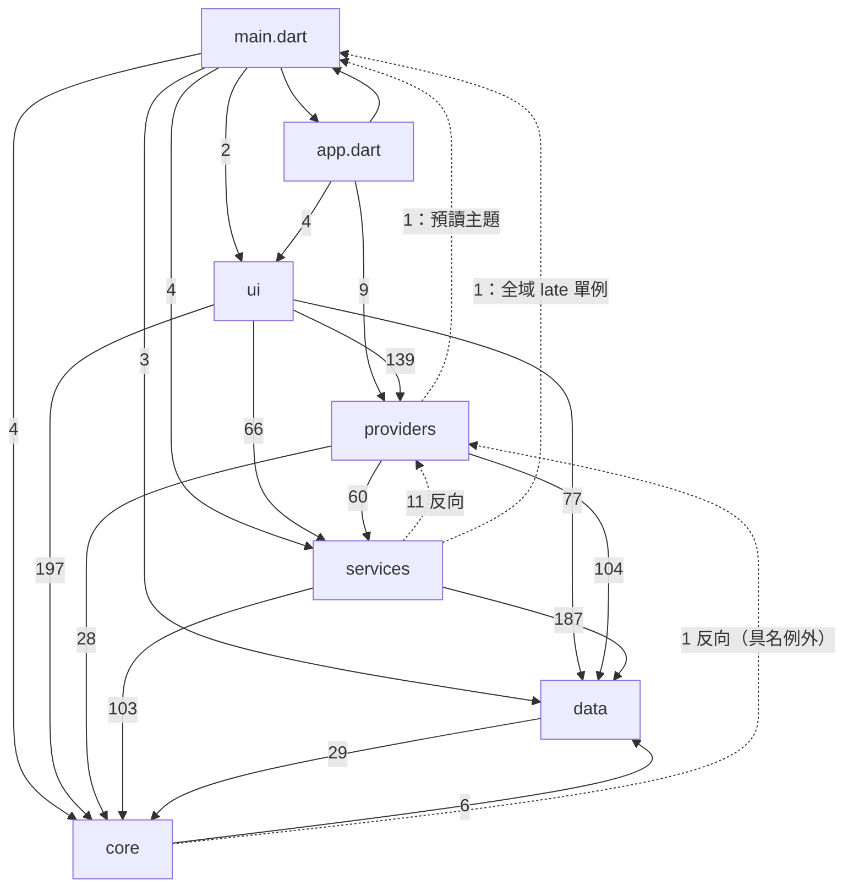
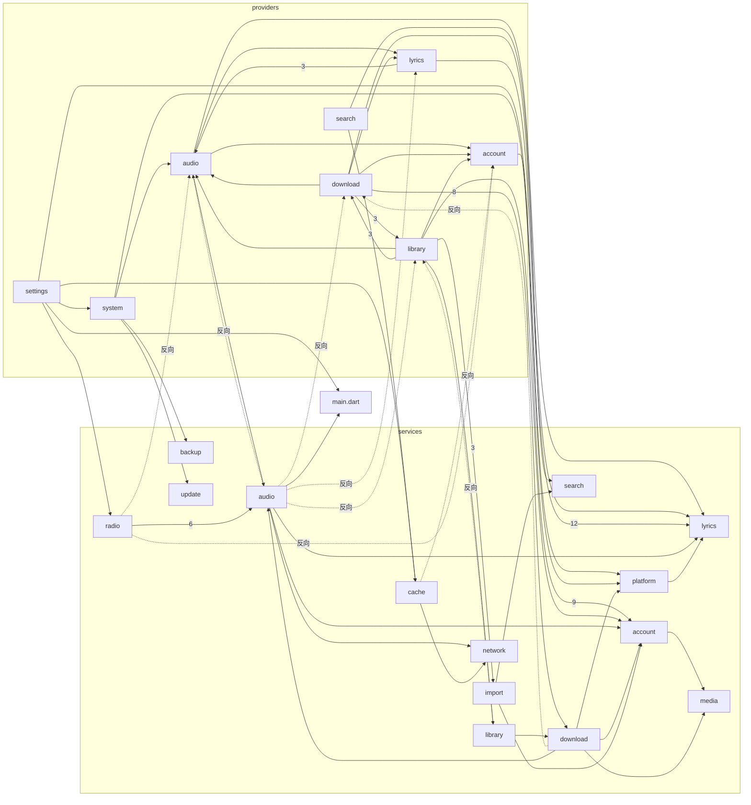
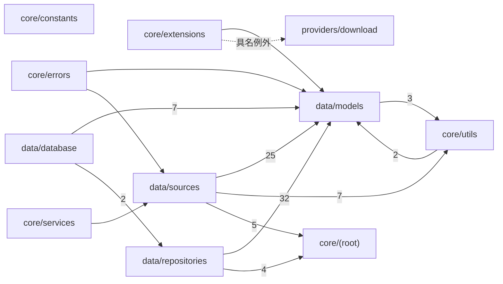
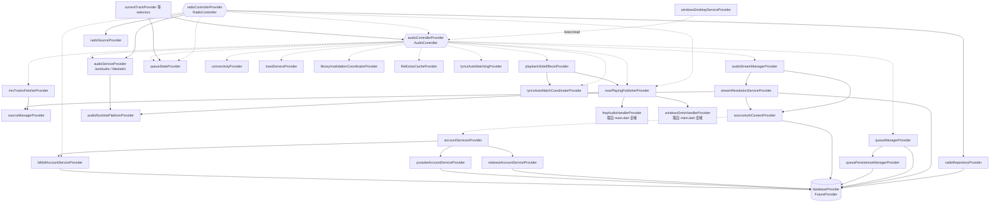
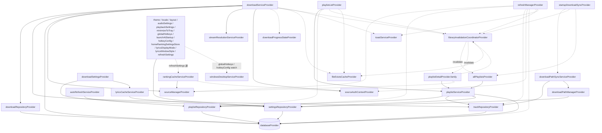
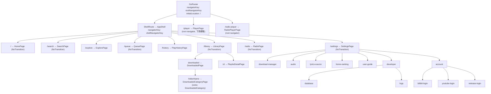
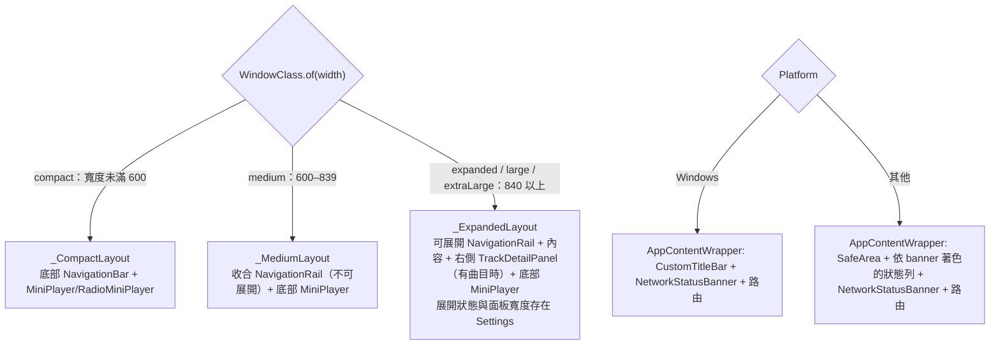
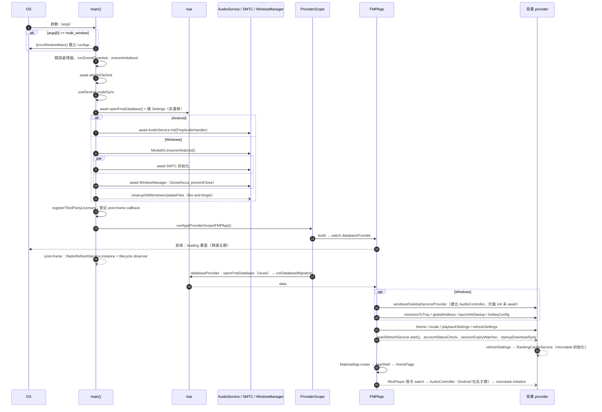

# 架構現況審計

> 現況描述，未經確認，不代表目標。

審計基準：分支 `docs/audit`，HEAD `6d78fe23`，2026-09-26。統計排除 `*.g.dart`（Isar／slang codegen 產物，可能過期）。
數字全部由 scratchpad 內的一次性 Python 腳本掃 `lib/` 產出：import 依賴解析 `import`／`export` 指令（`package:fmp/…` 與相對路徑都算），provider 盤點用正規表示式比對頂層 `final xxx = …Provider(`，provider 依賴用括號配對取出宣告本體（NotifierProvider 會再追到 `Xxx.new` 那個類別的本體）裡的 `ref.watch/read/listen/invalidate`。腳本沒解析 Dart AST，所以把 provider 或 `ref` 往外傳給別的類別之後才讀的依賴抓不到（例如 `AutoRefreshService` 拿著 `Ref`，`lib/services/library/auto_refresh_service.dart:17`）。

---

## 1. 分層

### 1.1 實際存在的層

| 目錄 | 檔案數 | 行數 | 實際職責（依程式碼觀察） |
|---|---:|---:|---|
| `lib/main.dart`、`lib/app.dart` | 2 | 613 | 行程啟動、平台初始化、全域可變狀態（`audioHandler`、`windowsSmtcHandler`、預讀主題，`lib/main.dart:29-44`）；`FMPApp` 在資料庫就緒前後切換兩棵 `MaterialApp`，並錨住啟動期副作用 provider（`lib/app.dart:34-131`） |
| `lib/core/` | 24 | 3,755 | 常量、logger、斷點、共用 UI 服務（toast、圖片載入）、格式化工具；也放了音源專屬工具（`core/utils/netease_crypto.dart`、`core/utils/innertube_utils.dart`） |
| `lib/data/` | 57 | 15,054 | Isar models、repositories、資料庫開啟與遷移、外部音源 adapter（`data/sources/`）、**以及 Riverpod provider**（`data/database/repository_providers.dart`、`data/sources/source_provider.dart`） |
| `lib/services/` | 97 | 33,042 | 業務邏輯；其中不少本身就是 Riverpod `Notifier`（`RadioController`、`RankingCacheService`、`ConnectivityService`、`QueueStateNotifier`、`AudioController`） |
| `lib/providers/` | 39 | 7,640 | Riverpod provider 與 Notifier；也夾帶非 provider 的邏輯（`providers/download/download_scanner.dart` 414 行的檔案掃描、`providers/download/file_exists_cache.dart` 的快取） |
| `lib/ui/` | 124 | 38,959 | go_router、AppShell、頁面、widget、Windows 歌詞子視窗 |
| `lib/i18n/` | 0 個手寫 `.dart` | — | 3 語系 × 38 個 `*.i18n.json`，base locale 為 `zh-CN`（`slang.yaml`），產出 4 個 `strings*.g.dart` |
| **合計** | **343** | **99,063** | |

**不一致**：`docs/development.md:29-31` 寫 `core/` 放「常量、主題、共享服務、工具」，但主題在 `lib/ui/theme/app_theme.dart`，`lib/core/` 內沒有主題檔；同段寫 `providers/` 是「Riverpod provider 定義」，實際上 162 個 provider 中有 32 個宣告在 `providers/` 之外（見 §4）（核查更正：原寫「161 個」）；寫 `app.dart` 負責「路由接線」，實際路由表在 `lib/ui/router.dart:124`，`app.dart` 只引用 `appRouter`（`lib/app.dart:154`）。

**不一致**：`docs/development.md:16-24` 畫的是單向 `UI -> providers -> services -> repositories/sources`。實際的層間 import 次數（import 指令數，不含 i18n）：

| 從 \ 到 | core | data | services | providers | ui | main.dart |
|---|---:|---:|---:|---:|---:|---:|
| core | — | 6 | 0 | **1** | 0 | 0 |
| data | 29 | — | 0 | 0 | 0 | 0 |
| services | 103 | 187 | — | **11** | 0 | **1** |
| providers | 28 | 104 | 60 | — | 0 | **1** |
| ui | 197 | 77 | 66 | 139 | — | 0 |

UI 直接 import `services/` 66 次、`data/` 77 次；`services/` 往回 import `providers/` 11 次；`services/` 與 `providers/` 各有一個檔案 import `main.dart`。

### 1.2 AGENTS.md 宣稱的邊界逐條驗證

| # | 宣稱 | 結果 | 證據 |
|---|---|---|---|
| 1 | UI 播放控制只呼叫 `AudioController`，不碰 `FmpAudioService`；電台是唯一例外 | **成立** | `lib/ui/` grep `FmpAudioService\|audioServiceProvider\|JustAudioService\|MediaKitAudioService` 無結果；`lib/` 內 `audioServiceProvider` 的消費者只有 `AudioController`（`lib/services/audio/audio_provider.dart:182`）與 `RadioController`（`lib/services/radio/radio_controller.dart:286`） |
| 2 | Isar 只由 `openFmpDatabase()` 開啟 | **成立** | `Isar.open(` 只出現在 `lib/data/database/database_provider.dart:92`；但 `openFmpDatabase()` 被呼叫兩次：`lib/main.dart:374`（預讀主題）與 `lib/data/database/database_provider.dart:111`，第二次靠 `Isar.getInstance`（`:86`）拿回同一實例 |
| 3 | 搜尋頁的音源 chip 是唯一來源選擇器，沒有設定在背後過濾 | **未發現反例（粗查）** | `lib/providers/settings/` 與 `lib/data/models/settings.dart` grep `searchSource\|enabledSearch` 無結果；沒有逐條追搜尋流程 |
| 4 | `audio_provider.dart` 不宣告 provider | **成立** | provider 盤點中 `lib/services/audio/audio_provider.dart` 0 筆；檔內以註解說明它與 `lib/providers/audio/audio_controller_provider.dart` 刻意互相 import（`lib/services/audio/audio_provider.dart:13-17`） |
| 5 | `audioControllerProvider` 與 backend／queue／stream provider 在 `lib/providers/audio/` | **成立** | `lib/providers/audio/audio_controller_provider.dart:26,33,45,56,91`；`lib/providers/audio/stream_resolution_provider.dart:9` |
| 6 | `nowPlayingPublisherProvider`、`playbackSideEffectsProvider`、`queueStateProvider` 宣告在 `lib/services/audio/` 的類別旁 | **成立** | `lib/services/audio/now_playing_publisher.dart:317`、`lib/services/audio/playback_side_effects.dart:237`、`lib/services/audio/queue_state.dart:77` |
| 7 | `neteaseSourceProvider` 是歌詞層的 `NeteaseSource`；同名資料音源只經 `SourceManager` 取得 | **成立** | `lib/providers/lyrics/lyrics_provider.dart:18,36` import `services/lyrics/netease_source.dart`；兩個同名類別：`lib/services/lyrics/netease_source.dart:130`、`lib/data/sources/netease_source.dart:25`。三個具體音源 adapter（bilibili／youtube／netease）在 `lib/data/sources/` 之外沒有任何 import |
| 8 | 規則 A：`lib/core/`、`lib/data/` 不 import `services/`、`providers/` | **成立（含 1 個具名例外）** | 例外：`lib/core/extensions/track_extensions.dart:7` import `providers/download/file_exists_cache.dart`，登錄在 `test/support/layer_boundary_static_rule_test.dart:29`。`data/` 零反向 import。規則沒管 `core → data`（6 次）與 `core ↔ data` 循環（§3.2） |
| 9 | 規則 B：feature 間的邊有快照 | **成立** | 腳本以同一定義（`services/<x>` 與 `providers/<x>` 視為同一 feature）算出 33 條邊，與 `test/support/layer_boundary_static_rule_test.dart:42` 的快照完全相同。**不一致**（小）：同檔 `:39` 註解說「31 筆」，快照實為 33 筆。快照內含 feature 互相依賴：`audio ↔ download`、`audio ↔ library`、`audio ↔ lyrics`、`download ↔ library` |
| 10 | `isar.` 只出現在 `lib/data/repositories/`（ADR 0002） | **字面成立，但範圍窄** | 符合測試的 regex 只在 repositories 與測試白名單的 `lib/data/database/database_catalog.dart`、`database_migration.dart`（`test/data/static_rules/isar_boundary_static_rule_test.dart:20-25`）。然而 `Isar` 實例本身傳遍各層：UI 直接 `ref.watch(databaseProvider)` 並自己 new repository、甚至直接跑遷移（`lib/ui/pages/settings/developer_options_page.dart:135-136,548-554`）；services 建構子收 `Isar`（`lib/services/account/bilibili_favorites_service.dart:35,237`、`lib/services/backup/backup_service.dart:43`、`lib/services/import/import_service.dart:144`、`lib/services/library/playlist_service.dart:66`） |
| 11 | UI 圖片只經 `lib/ui/widgets/images/` | **成立** | `lib/ui` 在 `widgets/images/` 之外 grep 載圖 API，唯一命中是 `ImageLoadingService.clearNetworkCache()`（`lib/ui/pages/settings/widgets/settings_cache.dart:105`），不是 loader，測試也明列它合法 |
| 12 | 只用 `ScopedSlider`，不直接用 Material `Slider` | **成立** | `Slider(` 在 `lib/` 只出現於 `lib/ui/widgets/controls/scoped_slider.dart:45` |
| 13 | 測試等待慣例、static-rule 測試命名位置 | **未查** | 屬測試面，不在本份範圍 |

---

## 2. 目錄地圖

### 2.1 一級與二級目錄

| 目錄 | 檔案 | 行數 | 用途（依檔名與內容） |
|---|---:|---:|---|
| `lib/`（根） | 2 | 613 | `main.dart`、`app.dart` |
| `core/`（根） | 4 | 556 | `logger.dart`、`log_file_sink.dart`、`secure_key_value_store.dart`、`third_party_licenses.dart` |
| `core/constants` | 5 | 656 | app 常量、`breakpoints.dart`（`WindowClass`）、版面尺寸、UI 常量、下載檔名 |
| `core/errors` | 1 | 128 | `user_message.dart`（例外 → 使用者文案；import `data/sources/source_exception.dart`） |
| `core/extensions` | 1 | 89 | `track_extensions.dart`（唯一反向 import `providers/` 的檔案） |
| `core/services` | 3 | 1,483 | `image_loading_service.dart`（766 行）、`network_image_cache_service.dart`、`toast_service.dart`（含 2 個 provider） |
| `core/utils` | 10 | 843 | 格式化、`http_client_factory`、`platform_utils`，以及音源專屬的 `netease_crypto`、`innertube_utils`、`thumbnail_url_utils` |
| `data/database` | 4 | 1,353 | `openFmpDatabase()`、`databaseProvider`、遷移、collection 目錄、8 個 repository provider |
| `data/models` | 17 | 2,696 | 11 個 Isar collection（有 `.g.dart`）＋ DTO／value object，`models.dart` 是 barrel |
| `data/repositories` | 16 | 3,873 | Isar 存取；`repositories.dart` 是 barrel |
| `data/sources` | 20 | 7,132 | Bilibili／YouTube／NetEase adapter、`SourceManager` 與 4 個 provider、HTTP policy、`playlist_import/`（QQ 音樂、Spotify 歌單解析，4 檔 683 行） |
| `providers/account` | 2 | 291 | 三平台帳號服務與狀態、啟動期 cookie 刷新／狀態檢查、`sourceAuthContextProvider` |
| `providers/audio` | 5 | 806 | `audioControllerProvider` 與協作者 provider、player selectors、音訊／播放設定 |
| `providers/download` | 8 | 1,194 | 下載 provider、`download_scanner.dart`（非 provider 的掃描邏輯）、`file_exists_cache.dart`、兩個近乎同名的 barrel（`download_provider.dart` 9 行、`download_providers.dart`） |
| `providers/library` | 8 | 2,489 | 歌單清單／詳情、播放歷史、刷新管理、兩條歌單匯入（見 §7.4）、`LibraryInvalidationCoordinator` |
| `providers/lyrics` | 2 | 585 | 歌詞來源、自動匹配、目前歌詞解析、歌詞視窗樣式 |
| `providers/search` | 2 | 813 | 搜尋 Notifier（785 行）、排行榜預覽 |
| `providers/settings` | 8 | 920 | 各設定 Notifier（主題、語系、版面、桌面、快捷鍵、刷新間隔、首頁排行、開發者選項） |
| `providers/system` | 3 | 298 | 備份、更新、`windowsDesktopServiceProvider` |
| `providers/ui` | 1 | 244 | 多選模式 |
| `services/account` | 17 | 4,125 | 三平台登入、憑證、auth interceptor、遠端歌單服務 |
| `services/audio` | 35 | 11,930 | 播放控制器、兩個後端、佇列、串流解析、系統媒體控制、各種 coordinator（見 §7.2） |
| `services/backup` | 2 | 1,754 | 備份匯出匯入 |
| `services/cache` | 1 | 342 | 只有 `ranking_cache_service.dart`（一個 `Notifier`） |
| `services/download` | 5 | 3,426 | 下載服務（2,030 行）、下載路徑管理／同步／維護 |
| `services/import` | 3 | 1,937 | `ImportService`（URL 匯入）、`PlaylistImportService`（外部平台歌單比對）、YouTube Mix 簡寫 |
| `services/library` | 8 | 1,346 | `PlaylistService`、自動刷新、遠端歌單編輯與同步 |
| `services/lyrics` | 15 | 4,242 | 歌詞來源（lrclib／網易雲／QQ）、自動匹配、AI 標題解析、歌詞視窗服務 |
| `services/media` | 1 | 63 | `media_handoff.dart` |
| `services/network` | 1 | 130 | `connectivity_service.dart`（一個 `Notifier`） |
| `services/platform` | 3 | 957 | Windows 托盤／快捷鍵／視窗、儲存權限、url_launcher |
| `services/radio` | 3 | 1,604 | `RadioController`（含 6 個 provider）、電台刷新單例、`RadioSource` |
| `services/search` | 2 | 282 | 搜尋服務、多音源 fan-out |
| `services/update` | 1 | 904 | 應用內更新 |
| `ui/`（根） | 3 | 472 | `router.dart`、`app_shell.dart`、`startup_failure_app.dart` |
| `ui/handlers` | 3 | 682 | 曲目動作（選單、協調器） |
| `ui/layouts` | 1 | 624 | `responsive_scaffold.dart`（三種導航殼） |
| `ui/pages` | 39 | 21,791 | 頁面；`settings/` 22 檔 8,612 行、`library/` 8 檔 5,877 行 |
| `ui/theme` | 2 | 268 | Material 主題 |
| `ui/widgets` | 70 | 13,457 | 14 個子目錄（dialogs 11 檔、player 10 檔、layout 9 檔…） |
| `ui/windows` | 6 | 1,665 | Windows 桌面歌詞子視窗（獨立 Flutter engine） |

### 2.2 最大的 20 個檔案

| # | 行數 | 檔案 |
|---:|---:|---|
| 1 | 2,953 | `lib/services/audio/audio_provider.dart` |
| 2 | 2,431 | `lib/data/sources/youtube_source.dart` |
| 3 | 2,030 | `lib/services/download/download_service.dart` |
| 4 | 1,699 | `lib/ui/pages/library/playlist_detail_page.dart` |
| 5 | 1,681 | `lib/ui/pages/search/search_page.dart` |
| 6 | 1,347 | `lib/ui/widgets/panels/track_detail_panel.dart` |
| 7 | 1,220 | `lib/ui/pages/player/player_page.dart` |
| 8 | 1,206 | `lib/services/import/playlist_import_service.dart` |
| 9 | 1,103 | `lib/services/radio/radio_controller.dart` |
| 10 | 1,097 | `lib/ui/pages/library/import_preview_page.dart` |
| 11 | 1,077 | `lib/ui/pages/home/home_page.dart` |
| 12 | 1,069 | `lib/data/sources/bilibili_source.dart` |
| 13 | 1,059 | `lib/ui/pages/history/play_history_page.dart` |
| 14 | 1,017 | `lib/services/audio/media_kit_audio_service.dart` |
| 15 | 1,008 | `lib/data/sources/netease_source.dart` |
| 16 | 945 | `lib/services/backup/backup_data.dart` |
| 17 | 945 | `lib/services/lyrics/lyrics_auto_match_service.dart` |
| 18 | 909 | `lib/ui/windows/lyrics_window.dart` |
| 19 | 904 | `lib/services/update/update_service.dart` |
| 20 | 894 | `lib/data/repositories/playlist_mutation_repository.dart` |

---

## 3. 模組依賴圖

節點是二級目錄；`(root)` 代表直接放在一級目錄下的檔案。邊上的數字是 import／export 指令數。i18n 被幾乎所有層 import，圖中省略。

### 3.1 層級總覽

虛線是與 `docs/development.md` 分層方向相反的邊。

### 3.2 services／providers 細節（不含 core／data）

### 3.3 core／data 細節

### 3.4 UI 層的依賴面

UI 幾乎依賴所有東西，畫成圖沒有資訊量，改列表（`ui/pages` + `ui/widgets` 合計）：`core/constants` 75、`core/services` 47、`core/utils` 34、`data/models` 57、`data/sources` 9、`data/database` 6、`data/repositories` 2、`providers/audio` 38、`providers/library` 33、`providers/download` 20、`services/radio` 10、`services/lyrics` 7、`services/audio` 8、`services/library` 8、`services/account` 8。
UI 直接 import `data/database` 或 `data/repositories` 的檔案：`lib/ui/pages/history/play_history_page.dart:11`、`lib/ui/pages/settings/database_viewer_page.dart:9-10`、`lib/ui/pages/settings/developer_options_page.dart:14,23-24`、`lib/ui/pages/settings/widgets/account_playlists_sheet.dart:14`、`lib/ui/widgets/dialogs/add_to_playlist_dialog.dart:12`。

### 3.5 循環依賴

以二級目錄為節點求強連通分量（Tarjan），扣除 i18n：

1. **一個 19 節點的大環**：`main.dart`、`app.dart`、`core/extensions`、`providers/{audio,download,library,lyrics,settings,system}`、`services/{audio,download,library,radio}`、`ui/{(root),handlers,layouts,pages,widgets,windows}`。把它串起來的關鍵邊：
   - `services/audio → main.dart`：`lib/services/audio/now_playing_publisher.dart:7` 從 `main.dart` 取全域 `audioHandler`、`windowsSmtcHandler`。
   - `providers/settings → main.dart`：`lib/providers/settings/theme_provider.dart:5` 取預讀主題。
   - `main.dart → ui/(root)`：`lib/main.dart:23` import `startup_failure_app.dart`；`main.dart → ui/windows`：`lib/main.dart:24`。
   - `core/extensions → providers/download`：`lib/core/extensions/track_extensions.dart:7`。
   - 一條實際路徑：`core/extensions → providers/download → providers/audio → services/audio → main.dart → ui/(root) → ui/pages → core/extensions`。
2. **`core/utils ↔ data/models`**：`core/utils/icon_helpers.dart`、`core/utils/source_presentation.dart` import `data/models/track.dart`；`data/models` 反向 import `core/utils` 3 次。
3. 兩兩互相 import 的目錄對：`providers/audio ↔ services/audio`（12／2，含刻意的 `audio_provider.dart ↔ audio_controller_provider.dart`）、`providers/audio ↔ providers/lyrics`（1／3）、`providers/download ↔ services/download`（8／2）、`providers/download ↔ providers/library`（3／3）、`providers/library ↔ services/library`（4／1）、`main.dart ↔ services/audio`、`main.dart ↔ app.dart`、`ui/pages ↔ ui/widgets`（117／2）、`ui/handlers ↔ ui/pages`、`ui/handlers ↔ ui/widgets`、`ui/(root) ↔ ui/pages`（router 與頁面互引）。

### 3.6 反向依賴清單（services → providers、core → providers、→ main.dart）

| 來源 | 目標 |
|---|---|
| `lib/services/audio/audio_provider.dart` | `providers/audio/audio_controller_provider.dart`、`providers/download/file_exists_cache.dart`、`providers/library/library_invalidation_coordinator.dart`、`providers/lyrics/lyrics_provider.dart` |
| `lib/services/audio/playback_side_effects.dart` | `providers/audio/audio_controller_provider.dart` |
| `lib/services/audio/now_playing_publisher.dart:7` | `main.dart`（`audioHandler`、`windowsSmtcHandler`） |
| `lib/services/cache/ranking_cache_service.dart` | `providers/account/source_auth_context_provider.dart` |
| `lib/services/download/download_path_maintenance_service.dart`、`download_path_sync_service.dart` | `providers/download/download_scanner.dart`（邏輯放在 providers 目錄，服務層只好反向 import） |
| `lib/services/library/auto_refresh_service.dart` | `providers/library/refresh_provider.dart` |
| `lib/services/radio/radio_controller.dart` | `providers/account/account_provider.dart`、`providers/audio/audio_controller_provider.dart` |
| `lib/core/extensions/track_extensions.dart:7` | `providers/download/file_exists_cache.dart` |
| `lib/providers/settings/theme_provider.dart:5` | `main.dart`（預讀主題） |

---

## 4. Riverpod provider 圖

### 4.1 版本與風格

- `flutter_riverpod: ^3.4.3`（`pubspec.yaml:15`），lock 為 3.4.3（`pubspec.lock:470-478`）。
- **全部手寫**：沒有 `riverpod_annotation`／`riverpod_generator`／`@riverpod`，也沒有 `flutter_riverpod/legacy.dart`、`StateNotifier`、`StateProvider`、`ChangeNotifierProvider`、`AsyncNotifier`（grep 無結果）。與 `docs/development.md` 說的「沒有 `StateNotifier`」一致。
- `ProviderScope` 關掉 Riverpod 3 的自動重試（`lib/main.dart:268`）。

### 4.2 盤點

共 **162** 個頂層 provider。（核查更正：原寫「161」。原腳本漏掉宣告跨行的 `lyricsMatchForTrackProvider = FutureProvider.autoDispose` 換行 `.family`，`lib/providers/lyrics/lyrics_provider.dart:536-537`）

| 類型 | 數量 |
|---|---:|
| `Provider`（含 `.autoDispose` 7、`.family` 6） | 100 |
| `NotifierProvider`（含 `.autoDispose` 5、`.family` 2） | 41 |
| `FutureProvider`（含 `.autoDispose` 4、`.family` 4） | 16（核查更正：原寫「`.autoDispose` 3、`.family` 3」「15」） |
| `StreamProvider`（含 `.autoDispose` 3） | 5 |

| 宣告位置 | 數量 |
|---|---:|
| `providers/library` 24、`providers/audio` 20、`providers/lyrics` 21、`providers/account` 19、`providers/download` 19、`providers/settings` 16、`providers/search` 5、`providers/system` 3、`providers/ui` 3 | 130（核查更正：原寫「`providers/lyrics` 20」「129」） |
| `services/audio` 7、`services/radio` 6、`services/cache` 1、`services/library` 1、`services/network` 1 | 16 |
| `data/database` 9、`data/sources` 4 | 13 |
| `core/services` 2 | 2 |
| `ui/widgets`（`networkBannerVisibleProvider`，`lib/ui/widgets/feedback/network_status_banner.dart:24`） | 1 |

provider 散在 5 個層、至少 3 種放置慣例：放 `providers/<feature>/`（多數）、放在類別旁（`services/audio`、`services/radio`、`services/cache`、`services/network`、`core/services/toast_service.dart:262`）、放在 data 層（`data/database/repository_providers.dart`、`data/sources/source_provider.dart:102`）。repository provider 也不統一：8 個在 `data/database/repository_providers.dart`，`downloadRepositoryProvider` 在 `lib/providers/download/download_providers.dart:34`，`radioRepositoryProvider` 在 `lib/services/radio/radio_controller.dart:1079`，`QueueRepository` 沒有 provider。

### 4.3 核心 provider 依賴圖

實線 = `ref.watch`，虛線 = `ref.read`（含 `ref.listen` 標註）。

**播放、音源、帳號**

**下載、歌單、設定**

觀察（附證據）：

- `AudioController` 取協作者全用 `ref.read`（類別內 13 個）與 `readOptional`（2 個），檔內沒有任何 `ref.watch`，註解說明原因是 rebuild 時 `onDispose` 會拆掉後端（`lib/services/audio/audio_provider.dart:175-206`）；`RadioController.build()` 對同一個 `audioServiceProvider` 卻用 `ref.watch`（`lib/services/radio/radio_controller.dart:286`）。兩個 Notifier 共用同一個後端實例。
- 至少 19 個 provider 各自 `watch`／`read` `settingsRepositoryProvider`，讀的是同一列 `Settings`（`lib/data/repositories/settings_repository.dart:14,18` 都是 `get(0)`）；部分 Notifier 另外持有一份 `Settings` 複本並就地改（例：`lib/providers/settings/refresh_settings_provider.dart:36,46,91`）。
- repository 有 provider，但仍大量繞過直接 `XxxRepository(db)`：`lib/providers/audio/audio_controller_provider.dart:40-42,61-62`、`lib/providers/audio/stream_resolution_provider.dart`、`lib/providers/account/source_auth_context_provider.dart:9-12`、`lib/services/account/bilibili_favorites_service.dart:237`、`lib/ui/pages/settings/developer_options_page.dart:135-136,551` 等 20 處以上。
- 取資料庫有兩種姿勢：`ref.watch(databaseProvider).requireValue`（多數）與 `.value` + null 檢查拋 `StateError`（`lib/data/database/repository_providers.dart:8-11`）或回傳 null（`lib/services/radio/radio_controller.dart:1080-1081`）。

### 4.4 AGENTS.md「Providers」段

§1.2 第 4–7 條逐句驗過，**全部成立**。但該段只描述了音訊與歌詞兩處的放置規則；整體上 provider 放置沒有單一規則（§4.2），AGENTS.md 與 `docs/development.md:29` 都沒提到 data／core／ui 層也宣告 provider。

---

## 5. 路由

### 5.1 方案

`go_router: ^18.0.1`（`pubspec.yaml`），單一全域 `appRouter`（`lib/ui/router.dart:124`），`MaterialApp.router` 接上（`lib/app.dart:154`）。一個 `ShellRoute`（非 `StatefulShellRoute`，註解說是為了切頁時銷毀非活動頁，`lib/ui/router.dart:123,129`）加兩個掛在 root navigator 的全螢幕路由。有 `RoutePaths` 與 `RouteNames` 兩組常量（`lib/ui/router.dart:34-94`）；呼叫端混用 `context.push(RoutePaths.x)`、`context.pushNamed(RouteNames.x)`、`context.go(...)`（例：`lib/ui/pages/settings/settings_page.dart:76` 用 path，`lib/ui/pages/settings/widgets/settings_storage.dart:12` 用 name）。`downloadedCategory` 只有 name，沒有 `RoutePaths` 常量，參數靠 `state.extra as DownloadedCategory` 傳（`lib/ui/router.dart:184`），深連結或還原時 extra 會不存在（**推測**：會拋型別錯誤，未實測）。

除 go_router 外，沒有找到 `Navigator.push`／`MaterialPageRoute`；對話框、bottom sheet 走 Flutter 原生 API。

### 5.2 路由樹

共 25 個 `GoRoute`（`lib/ui/router.dart:134-306`）。導航列 6 個目的地：home、search、queue、library、radio、settings（`lib/ui/layouts/responsive_scaffold.dart:47-83`）；`/explore`、`/history` 不在導航列，高亮落回首頁（`lib/ui/layouts/responsive_scaffold.dart:85-101`）。

### 5.3 手機與桌面的導航殼差異

導航殼按**視窗寬度**選，不按平台（`lib/ui/layouts/responsive_scaffold.dart:124-144`，斷點在 `lib/core/constants/breakpoints.dart:15-41`）；平台差異只在 `AppContentWrapper`（`lib/app.dart:172-219`）。

另有 Windows 桌面歌詞子視窗：由 `desktop_multi_window` 以 `multi_window` 參數重新進入 `main()`（`lib/main.dart:96-98`），走 `lyricsWindowMain` 獨立 `runApp`（`lib/ui/windows/lyrics_window.dart:28-31`），不經 go_router、不經 slang，文案是寫死的中文預設值由主視窗同步（`lib/ui/windows/lyrics_window.dart:33-53`）。

---

## 6. 啟動流程

### 6.1 順序（主視窗）

| # | 步驟 | 位置 | 阻塞首畫面？ |
|---:|---|---|---|
| 1 | 子視窗參數判斷 `multi_window` → 走歌詞視窗入口 | `lib/main.dart:96-98` | — |
| 2 | 掛 `FlutterError.onError`、`PlatformDispatcher.onError` | `lib/main.dart:102-123` | 同步 |
| 3 | `runZonedGuarded` → `WidgetsFlutterBinding.ensureInitialized()` | `lib/main.dart:125-129` | 同步 |
| 4 | log 落盤 `AppLogger.attachFileSink(await LogFileSink.inAppDocuments())` | `lib/main.dart:135` | **await** |
| 5 | `--minimized` 旗標 | `lib/main.dart:140` | 同步 |
| 6 | `LocaleSettings.useDeviceLocaleSync()` | `lib/main.dart:147` | 同步 |
| 7 | `_preloadSettings()`：`openFmpDatabase()` 開 Isar、讀 `Settings`、存入 `main.dart` 全域主題變數（此時遷移未跑） | `lib/main.dart:150,372-392` | **await** |
| 8 | 圖片快取上限（行動 100 張／50MB，桌面 200 張／80MB） | `lib/main.dart:156-164` | 同步 |
| 9a | Android：`AudioService.init(FmpAudioHandler)`，失敗退回未接通知的 handler | `lib/main.dart:167-195` | **await** |
| 9b | 桌面：`audioHandler = FmpAudioHandler()` dummy | `lib/main.dart:196-199` | 同步 |
| 10 | 桌面：`MediaKit.ensureInitialized()` | `lib/main.dart:202-216` | 同步 |
| 11a | Windows：`Future.wait([SMTC, WindowManager])`，各自被 `_guardStartupStep` 包住；WindowManager 設最小尺寸、隱藏標題列、`setPreventClose(true)`，非 `--minimized` 時 show+focus | `lib/main.dart:219-229,284-343` | **await** |
| 11b | Windows：`UpdateService.cleanupOldWindowsUpdateFiles()` | `lib/main.dart:231` | **fire-and-forget**（未 await） |
| 11c | 非 Windows：`windowsSmtcHandler = WindowsSmtcHandler()` 空殼 | `lib/main.dart:232-239` | 同步 |
| 12 | `registerThirdPartyLicenses()` | `lib/main.dart:243` | 同步 |
| 13 | 註冊 post-frame callback：建立 `RadioRefreshService.instance` 單例 + App 生命週期 observer | `lib/main.dart:247-259` | 首幀後 |
| 14 | `runApp(ProviderScope(retry: null, TranslationProvider(FMPApp)))`，`_appStarted = true` | `lib/main.dart:261-274` | — |
| 15 | `FMPApp.build` watch `databaseProvider` → loading 畫面（用預讀主題） | `lib/app.dart:34-63` | 首幀＝loading |
| 16 | `databaseProvider`：`openFmpDatabase()`（reuse 同一實例）→ `runDatabaseMigration` | `lib/data/database/database_provider.dart:109-117` | **阻塞首頁**（loading 直到完成） |
| 17 | data 分支：Windows 先 watch `windowsDesktopServiceProvider`、`minimizeToTray`、`globalHotkeysEnabled`、`launchAtStartup`、`hotkeyConfig` | `lib/app.dart:95-104` | provider 建構同步；內部 I/O fire-and-forget |
| 18 | watch `themeProvider`、`localeProvider`、`playbackSettingsProvider`、`refreshSettingsProvider`、`autoRefreshServiceProvider`、`accountStatusCheckProvider`、`accountSessionExpiryWatcherProvider`、`startupDownloadSyncProvider` | `lib/app.dart:107-131` | 建構同步；各自的 async 工作 fire-and-forget |
| 19 | `MaterialApp.router(appRouter)` → `ShellRoute` → `AppShell` → `HomePage` | `lib/app.dart:133-158`、`lib/ui/router.dart:129-139` | 首頁 |

eager provider 各自在背景做的事：

- `windowsDesktopServiceProvider`：`ref.listen(audioControllerProvider)` 並 `ref.read(...notifier)` 綁托盤回呼 → **Windows 上 `AudioController` 在啟動時就被建出來**；`service.initialize(enableHotkeys: false)` 沒 await（托盤圖示、選單）（`lib/providers/system/windows_desktop_provider.dart:18-42`）。
- `AudioController.build()` 以 `Future.microtask(initialize)` 啟動後端初始化、佇列還原、音量還原、預備目前曲目（不自動播放）（`lib/services/audio/audio_provider.dart:208,337-455`）。Android 上沒有 eager 錨點，第一次被建出來是 AppShell 的 `MiniPlayer` watch `currentTrackProvider`（`lib/ui/widgets/player/mini_player.dart:24`、`lib/providers/audio/audio_player_selectors.dart:169`）。
- `refreshSettingsProvider`：非同步讀設定後 `ref.read(rankingCacheServiceProvider.notifier)` → `RankingCacheService.build()` 以 microtask 啟動排行榜載入與網路監聽（`lib/providers/settings/refresh_settings_provider.dart:38-62`、`lib/services/cache/ranking_cache_service.dart:146-151`）。
- `autoRefreshServiceProvider`：`service.start()` 立即檢查一次並每 30 分鐘一次（`lib/services/library/auto_refresh_service.dart:32-45,143-157`）。
- `accountStatusCheckProvider`：先等 `accountCookieRefreshProvider`（Bilibili cookie 刷新），再依序檢查三平台帳號（`lib/providers/account/account_provider.dart:131-175`）。
- `startupDownloadSyncProvider`：掃描本地下載檔同步資料庫（`lib/providers/download/startup_download_sync_provider.dart:9-40`）。
- 應用更新：**沒有**啟動時自動檢查；只在設定頁「關於」手動觸發（`lib/ui/pages/settings/widgets/settings_about.dart:70`），`database_migration.dart:224` 註記自動檢查已刪除。

### 6.2 時序圖

### 6.3 隱性順序契約

- `RadioRefreshService.instance` 是 `static late final`（`lib/services/radio/radio_refresh_service.dart:29`），在首幀後才賦值（`lib/main.dart:251`），而 `RadioController.build()`（`lib/services/radio/radio_controller.dart:279,306`）與 `RefreshSettingsNotifier.setRadioRefreshInterval`（`lib/providers/settings/refresh_settings_provider.dart:94`）直接讀它。目前能成立是因為這兩者要等資料庫就緒、首頁顯示後才會被建立；沒有程式碼保證這個先後（**推測**：資料庫開得比首幀快時不會出事，因為 `databaseProvider` 是非同步的，首幀必然是 loading）。
- `audioHandler`、`windowsSmtcHandler` 是 `main.dart` 的全域 `late`（`lib/main.dart:29,32`），經 `fmpAudioHandlerProvider`／`windowsSmtcHandlerProvider` 包成 provider（`lib/services/audio/now_playing_publisher.dart:310-315`）；在 `runApp` 前任何路徑都有賦值（`lib/main.dart:172-198,226-238`）。
- 遷移在 `_preloadSettings` 讀完 `Settings` **之後**才跑（`lib/main.dart:371` 註解、`lib/data/database/database_provider.dart:114`），所以預讀主題讀的是遷移前的列。

---

## 7. 架構觀察

### 7.1 上帝類別

| 類別 | 規模 | 證據 |
|---|---|---|
| `AudioController`（`Notifier<PlayerState>`） | 檔案 2,953 行；約 125 個方法、39 個公開方法、約 41 個欄位；以 `ref.read` 取 13 個、`readOptional` 取 2 個 provider | `lib/services/audio/audio_provider.dart:59,71,175-206`。已拆出 34 個協作檔（§7.2），控制器本身仍是全 repo 最大檔 |
| `YouTubeSource` | 2,431 行、約 63 個方法 | `lib/data/sources/youtube_source.dart:27` |
| `DownloadService` | 2,030 行、檔內 8 個類別、約 57 個方法 | `lib/services/download/download_service.dart` |
| `RadioController` | 1,103 行，同檔另宣告 6 個 provider；直接持有後端 `FmpAudioService` | `lib/services/radio/radio_controller.dart:229,239,286,1072-1104` |
| 頁面 | `PlaylistDetailPage` 1,699、`SearchPage` 1,681、`TrackDetailPanel` 1,347、`PlayerPage` 1,220 行 | §2.2 |

### 7.2 過深的間接層（音訊）

`lib/services/audio/` 35 檔 11,930 行，一次播放請求會經過：`AudioController` → `QueueCommands`／`QueueManager`／`QueuePersistenceManager`／`QueueStateNotifier` → `PlaybackRequestSession`（882 行、9 個型別）→ `AudioStreamManager` → `StreamResolutionService`（`lib/providers/audio/stream_resolution_provider.dart:9`）→ `SourceManager` capability → adapter；結果回來再經 `PlaybackEventRouter`（546 行、27 個型別）、`PlaybackHandoffGate`、`PlaybackRecoveryCoordinator`、`PlaybackSideEffects` → `NowPlayingPublisher` → `FmpAudioHandler`／`WindowsSmtcHandler`。另有 1 行的 `audio_playback_types.dart`（只有 `enum PlayMode`）與 10 行的 `mix_playlist_types.dart`（一個 typedef + 轉 export）。本份只描述層數，沒有逐條判斷哪一層是否必要。

### 7.3 重複的抽象

- **兩個 `NeteaseSource`**：`lib/data/sources/netease_source.dart:25`（播放音源）與 `lib/services/lyrics/netease_source.dart:130`（歌詞），各自 new 實例（`lib/data/sources/source_provider.dart:14`、`lib/providers/lyrics/lyrics_provider.dart:37`）。電台另有自己的 `RadioSource`／`BilibiliLiveClient`（`lib/services/radio/radio_source.dart:60,70`），`RadioRefreshService` 在沒注入時還會自己 new 一個 `RadioSource`（`lib/services/radio/radio_refresh_service.dart:75`）。
- **repository 有 provider 又被直接 new**：§4.3。
- **設定分散在十多個 Notifier**：每個都讀寫同一列 `Settings`（§4.3）。
- **資料庫就緒檢查三種寫法**：`.requireValue`、`.value` 拋 `StateError`、`.value` 回 null（§4.3）。

### 7.4 命名與位置不一致

- `lib/services/audio/audio_provider.dart` 名為 `_provider` 卻不宣告 provider，內容是 `AudioController`；`RadioController` 則把類別與 provider 放同一檔且放在 `services/`（`lib/services/radio/radio_controller.dart:1086`）。同類東西兩種放法。
- `lib/services/audio/audio_service.dart`（`FmpAudioService` 介面）與第三方套件 `audio_service` 同名；`audio_handler.dart` 才是接 `audio_service` 套件的那個。
- `lib/providers/download/download_provider.dart`（9 行 barrel）與 `download_providers.dart` 只差一個 s；後者再轉 export `download_scanner.dart`、`services/download/download_service.dart`、`data/database/repository_providers.dart`，`lib/ui/router.dart:30` 為了 `DownloadedCategory` 引入整條 barrel 鏈。
- 兩條「歌單匯入」：`import_playlist_provider.dart`（`ImportService`，URL 匯入）與 `playlist_import_provider.dart`（`PlaylistImportService`，外部平台比對），名稱互為倒裝（`lib/providers/library/import_playlist_provider.dart:54`、`lib/providers/library/playlist_import_provider.dart:111`）；同一個對話框兩個都用（`lib/ui/pages/library/widgets/import_playlist_dialog.dart:115,173`）。
- 放錯層的邏輯：`download_scanner.dart`（檔案掃描、`Isolate.run`）與 `file_exists_cache.dart` 在 `providers/`，因而造成 `services → providers` 與 `core → providers` 的反向依賴（§3.6）；`core/services/` 與 `services/` 兩個「服務」目錄並存；`core/utils/` 內有網易雲加密與 YouTube innertube 工具；`services/cache/` 只有一個排行榜 Notifier。
- `lib/core/errors/user_message.dart`、`lib/core/services/image_loading_service.dart` import `data/sources/`，讓 `core` 依賴 `data`，而 `data` 又依賴 `core`（§3.5）。
- 平台分支殘留：產品只出 Android／Windows（`pubspec.yaml` 註解「FMP 不出 Linux/macOS」），但 `lib/main.dart:156,167,202,232`、`lib/services/audio/audio_runtime_platform.dart` 仍處理 iOS／Linux／macOS。

### 7.5 以 widget 為錨的系統副作用

- 桌面歌詞子視窗的開啟與所有同步（位置、歌詞、播放狀態、主題、語系、樣式）只寫在 `TrackDetailPanel` 的 `ref.listen` 裡（`lib/ui/widgets/panels/track_detail_panel.dart:112-193,273-317,557`）；該 panel 只在 `_ExpandedLayout`（寬 ≥ 840）且有曲目時掛載（`lib/ui/layouts/responsive_scaffold.dart:325-327,364,514`）。**推測**：視窗縮到 840 以下、或 panel 被卸載時，已開啟的歌詞視窗停止更新；未實機驗證。
- 相對地，帳號失效提示這類副作用刻意錨在 `FMPApp` 上，註解與 static-rule 說明原因是 Riverpod 3 會暫停被不透明路由蓋住的頁面上的 watch（`lib/providers/account/account_provider.dart:183-189`）。兩處採用不同策略。

### 7.6 全域可變狀態

`lib/main.dart:29-44`（`audioHandler`、`windowsSmtcHandler`、`launchMinimized`、三個預讀主題變數）、`RadioRefreshService.instance`（`lib/services/radio/radio_refresh_service.dart:29`）、`LyricsWindowService.instance`（`lib/services/lyrics/lyrics_window_service.dart:99`）、`UrlLauncherService.instance`（`lib/services/platform/url_launcher_service.dart:55`）、`rootNavigatorKey`／`shellNavigatorKey`／`appRouter`（`lib/ui/router.dart:97,101,124`）。前兩類是 §3.5 大環的成因。
