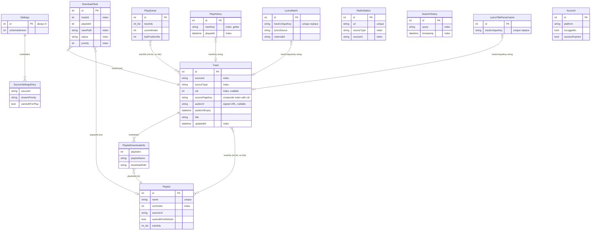

# 資料層現況審計（Isar／KV／快取／下載／備份／設定）

> 現況描述，未經確認，不代表目標。

審計基準：分支 `docs/audit`（HEAD `6d78fe23`），2026-09-26。只讀原始碼，未執行 app。
行號都是實際看過的位置。`*.g.dart` 只用來確認「Isar 實際持久化了哪些 getter」，它是 codegen 產物，可能過期，以原始碼為準。
標「**推測**」的是依程式碼推論、未實測；標「**不一致**」的是文件（含註釋）和程式碼對不上。

---

## 1. Isar schema

### 1.1 版本與來源

| 項目 | 事實 | 證據 |
|---|---|---|
| 套件 | `isar_community` 3.3.2（社群 fork），`isar_community_flutter_libs` 3.3.2，generator `isar_community_generator` 3.3.2 | `pubspec.yaml:18-19,95`；`pubspec.lock:688-711`（`source: hosted`，`url: https://pub.dev`） |
| 為何是 fork | 上游 `isar` 3.1.0+1 已停更，它的 generator 把 analyzer 鎖在 `<6.0.0`，Riverpod 3 裝不起來；v4 沒有 v3→v4 遷移工具。換 fork 的 commit 是 `3b1c7244`（2026-09-02） | `docs/adr/0007-isar-stays-on-v3.md`；`git show 3b1c7244` |
| fork 現況 | pub.dev 上最新版是 3.3.2，發佈者 isar-community.dev（已驗證），自述「主要做 v3 的 bug 修正與小更新」。頁面只寫了相對日期（約 6 個月前），查詢日 2026-09-26 | pub.dev/packages/isar_community |
| 目標平台 | 只出 Android 與 Windows（「FMP 不出 Linux/macOS」） | `pubspec.yaml:24-25` |
| Windows DLL | 檔名從 `isar.dll` 改成 `libisar.dll` | ADR 0007 §後果（未驗證建置產物） |
| 開啟參數 | `maxSizeMiB: 2048`；`compactOnLaunch`：檔案 ≥ 8 MiB 且 ratio ≥ 2.0 時壓縮 | `lib/data/database/database_provider.dart:92-106` |
| DB 名稱／位置 | `fmp_database.isar`（加 `.lock`），放在 `getApplicationDocumentsDirectory()/FMP/`。Windows 上這是使用者的「文件」資料夾，Android 上是 app 私有目錄。舊版放在 documents 根目錄的檔案，啟動時會搬過來 | `database_provider.dart:14-17,23-25,50-83` |
| 開啟入口 | `openFmpDatabase()` 在 `runApp` 前被 `_preloadSettings()` 先呼叫一次（這時遷移**還沒跑**），之後 `databaseProvider` 靠 `Isar.getInstance` 重用同一個實例 | `lib/main.dart:372-392`；`database_provider.dart:85-90,109-117` |
| 資料量 | ADR 0007 提到一份真實 DB 副本有 1,534 列；commit `25726c46` 的說明提到 332 筆 PlayHistory。**使用者目前 DB 的實際大小查不到**（沒有執行 app） | ADR 0007 §決策；`git show 25726c46` |
| 內建上限 | 播放歷史預設保留 10,000 筆、佇列上限 10,000、搜尋歷史 100 筆 | `lib/data/models/settings.dart:209`；`lib/core/constants/app_constants.dart:32,35` |

### 1.2 Collections（共 11 個）與 embedded（2 個）

schema 清單是 `fmpDatabaseCollections` 產生的 `fmpDatabaseSchemas`，除錯頁的資料庫檢視器也吃同一份清單（`lib/data/database/database_catalog.dart:50-144`）。

**注意：Isar 會持久化所有沒標 `@ignore` 的 public getter。** 從 `track.g.dart` 看得到 `formattedDuration`、`groupKey`、`hasValidAudioUrl`、`isPartOfMultiPage`、`sourcePageKey`、`uniqueKey` 都在 PropertySchema 裡（`lib/data/models/track.g.dart:54-140`）。`PlayQueue` 的 `length`/`hasNext`/`currentTrackId`、`Playlist` 的 `needsRefresh`/`trackCount`/`isImported`、`RadioStation.uniqueKey` 也一樣會被存下來（見各自的 `.g.dart`）。這些值只在 `put` 的當下計算，其中 `needsRefresh`、`hasValidAudioUrl` 這類跟時間有關的欄位，存在磁碟上的值會過時。

| Collection | 檔案 | 主鍵 | 欄位（型別） | 索引 |
|---|---|---|---|---|
| `Track` | `lib/data/models/track.dart:37-348` | autoIncrement | sourceId(String)、sourceType(String)、title、artist?、ownerId(int?)、channelId?、durationMs?、thumbnailUrl?、**audioUrl?**、**audioUrlExpiry?**、isAvailable、isVip、unavailableReason?、playlistInfo(List\<PlaylistDownloadInfo\>)、pageCount?（**沒標 @ignore，會被存**）、cid?、pageNum?、parentTitle?、bilibiliAid?、originalSongId?、originalSource?、createdAt、updatedAt?；`viewCount` 標了 `@ignore` | `sourceId`(:42)、`sourceType`(:46)、`cid`(:248)、`updatedAt`(:273)、複合索引 `sourcePageKey`+`cid`(:277-278) |
| `PlaylistDownloadInfo`（embedded） | `track.dart:10-34` | — | playlistId(int)、playlistName(String)、downloadPath(String，空字串代表沒下載) | — |
| `Playlist` | `lib/data/models/playlist.dart:6-88` | autoIncrement | name、description?、coverUrl?、hasCustomCover、sourceUrl?、importSourceType?、refreshIntervalHours?、lastRefreshed?、notifyOnUpdate、ownerName?、ownerUserId?、useAuthForRefresh、isMix、mixPlaylistId?、mixSeedVideoId?、trackIds(List\<int\>)、createdAt、updatedAt?、sortOrder | `name` **unique**（沒設 replace）(:11)、`sortOrder`(:66) |
| `PlayQueue` | `lib/data/models/play_queue.dart:18-85` | autoIncrement | trackIds(List\<int\>)、currentIndex、lastPositionMs、isShuffleEnabled、loopMode(enum 以 name 存)、originalOrder?、lastVolume、lastUpdated?、isMixMode、mixPlaylistId?、mixSeedVideoId?、mixTitle? | 無 |
| `PlayHistory` | `lib/data/models/play_history.dart:10-77` | autoIncrement | sourceId、sourceType、cid?、title、artist?、durationMs?、thumbnailUrl?、playedAt、trackKey（getter） | `sourceId`(:15)、`sourceType`(:19)、`playedAt`(:38)、`trackKey`(:46-47) |
| `Settings` | `lib/data/models/settings.dart:212-734` | **固定 `id = 0`**（單例） | 見 §7；另有 6 個 `@Deprecated` 的舊欄位 | 無 |
| `SourceSettingsEntry`（embedded） | `settings.dart:127-149` | — | sourceId、streamPriority(逗號字串)、useAuthForPlay(bool) | — |
| `SearchHistory` | `lib/data/models/search_history.dart:6-20` | autoIncrement | query、timestamp | `query`(:11)、`timestamp`(:15) |
| `DownloadTask` | `lib/data/models/download_task.dart:24-107` | autoIncrement | trackId、playlistId?、playlistName?、savePath?、status(enum 以 name 存)、progress、downloadedBytes、totalBytes?、errorMessage?、tempFilePath?、priority、createdAt、completedAt? | `trackId`(:29)、`savePath`(:39)、`status`(:43)、`priority`(:63) |
| `RadioStation` | `lib/data/models/radio_station.dart:7-58` | autoIncrement | url、title、thumbnailUrl?、hostName?、hostAvatarUrl?、hostUid?、sourceType、sourceId、sortOrder、createdAt、lastPlayedAt?、isFavorite | `url` **unique**(:12)、`sourceType`(:31)、`sourceId`(:35)、`sortOrder`(:39)、`isFavorite`(:49) |
| `LyricsMatch` | `lib/data/models/lyrics_match.dart:9-28` | autoIncrement | trackUniqueKey、lyricsSource、externalId、offsetMs、matchedAt | `trackUniqueKey` unique + replace(:14) |
| `LyricsTitleParseCache` | `lib/data/models/lyrics_title_parse_cache.dart:5-20` | autoIncrement | trackUniqueKey、sourceType、parsedTrackName、parsedArtistName?、confidence、provider、model、createdAt、updatedAt | `trackUniqueKey` unique + replace(:9) |
| `Account` | `lib/data/models/account.dart:9-48` | autoIncrement | platform、userId?、userName?、avatarUrl?、isLoggedIn、lastRefreshed?、loginAt?、isVip、sessionExpired | 無（`platform` 沒有索引） |

**Isar link：沒有任何 `IsarLink`／`IsarLinks`／`@Backlink`。** 整個 lib 都 grep 不到。collection 之間的關係全部是手動維護的整數 id 或字串鍵：

- `Playlist.trackIds`、`PlayQueue.trackIds`、`DownloadTask.trackId` 指向 `Track.id`。
- `Track.playlistInfo[].playlistId` 和 `DownloadTask.playlistId` 指向 `Playlist.id`。
- `PlayHistory.trackKey`、`LyricsMatch.trackUniqueKey`、`LyricsTitleParseCache.trackUniqueKey` 用的是 `TrackKey.format()` 產生的字串，格式是 `sourceType:sourceId[:cid]`（`lib/data/models/track_key.dart:19-20`）。

參照完整性沒有 DB 層保證。`DataIntegrityRepository.scan/repair` 能修，但在 lib 裡唯一的呼叫點是開發者選項的「重設所有資料」`clearEverything()`（`lib/ui/pages/settings/developer_options_page.dart:551`）。**scan/repair 在 lib 裡有沒有其他呼叫點：查不到。**



**不一致：** `play_history.dart:43-45` 的註釋說：「這個索引加上去之前就存在的列不會有索引項，所以 v0 → v1 的遷移必須把所有既有列重寫一次。」可是 `_migrateV0ToV1` 只動 Settings（`database_migration.dart:171-194`），沒有重寫 PlayHistory。同一個 commit（`25726c46`）的 commit message 反而寫「Isar rebuilds the index for existing rows … No backfill step is needed」。所以三方說法不同：註釋說要重寫，commit 說不用，程式碼也沒寫。

---

## 2. Migration

### 2.1 機制

- 版本號存在 `Settings.schemaVersion`（`settings.dart:221`），目前的常數是 `kFmpSchemaVersion = 4`（`lib/data/database/database_migration.dart:33`）。
- 舊列讀出來的 `schemaVersion` 會是 `Isar.minLong`，負數一律當成 v0（`database_migration.dart:164-165`）。
- 唯一入口是 `runDatabaseMigration`（`:38-68`），整段包在**一個** `isar.writeTxn` 裡：
  1. 沒有 Settings 列（全新安裝）時，寫入 `createBootstrapSettings()` 並直接蓋上目前版本（`:42-46`）。Android 的圖片快取上限預設 16 MB（`:106-112`）。
  2. 否則依序套用 `fmpMigrationSteps` 裡 `to` 大於目前版本的步驟（`:48-57`），每一步都寫 info log。
  3. 已有 Settings 列時，每次啟動都會跑 `repairSettingsInvariants`（`:252-375`；全新安裝那條分支不跑，`:42-58`）（核查更正：原寫「每次啟動都會跑」）：夾取值域、空字串補預設、確保每個內建音源都有 `SourceSettingsEntry`。它不屬於遷移，所以不掛版本號。
  4. 每次啟動都會跑 `_ensureHealthyPlayQueue`（`:70-82`）：沒有佇列就建一個；整列都是型別預設值時把 `lastVolume` 設回 1.0。
  5. 每次啟動都會跑 `_relinkLyricsMatchesToCidKeys`（`:89-103`）：把 Bilibili 還用兩段式鍵的歌詞匹配改成三段式鍵。
  6. 每次啟動都清空 `LyricsTitleParseCache`（`:66`）。這張表等於只活一個 session 的快取。
- 觸發點：`databaseProvider` 開 DB 後馬上呼叫（`database_provider.dart:109-117`）；`FMPApp.build` 會 watch 它（`lib/app.dart:34`）。開發者選項的「重設所有資料」清空 DB 後也會再跑一次（`developer_options_page.dart:551-554`）。
- 備份匯入重建 Settings 時，會直接蓋上 `schemaVersion = kFmpSchemaVersion`（`lib/services/backup/backup_service.dart:748-750`）。

### 2.2 每一版

| 步驟 | 名稱 | 做了什麼 | 位置 |
|---|---|---|---|
| 0→1 | infer pre-versioning defaults | 舊列同時符合「5 個欄位都是型別預設」的形狀時，補回 `rememberPlaybackPosition=true`、`tempPlayRewindSeconds=10`、`disabledLyricsSources='lrclib'`；`neteaseStreamPriority` 為空時補網易的預設；版面欄位一律改成 `railExpanded=false`、`detailPanelExpanded=true`、`detailPanelWidth=380` | `database_migration.dart:171-194,240-246` |
| 1→2 | fold per-source settings into one list | 把 6 個具名欄位（`*StreamPriority`、`use*AuthForPlay`）折成 `sourceSettings` 清單。**只搬不刪**，舊欄位保留原值，方便降級 | `:207-222`；舊欄位 `settings.dart:321-336,414-429` |
| 2→3 | retired | 空函式。原本是把 `autoCheckUpdates` 打開，該欄位已刪；步驟保留只是為了佔住版本號 | `:229` |
| 3→4 | use the Bilibili login state for playback requests | 所有既有安裝的 Bilibili `useAuthForPlay` 一律改成 true。使用者自己關掉的也會被打開，註釋承認這一點 | `:236-238` |

### 2.3 失敗時的行為

- 整段在同一個寫入交易裡，任何一步丟例外，整個交易都會回滾（`database_migration.dart:37-39`）。
- 例外會讓 `databaseProvider` 進入 error 狀態，畫面顯示 `t.general.initFailed` 加上 `error.toString()` 原文（`lib/app.dart:64-90`，原文在 `:87`）。沒有重試：Riverpod 的自動重試已經被全域關掉（`lib/main.dart:268`）。
- 這個錯誤畫面沒有匯出或修復的入口。**推測：** 使用者只能看到錯誤字串，資料不會被動到。
- `_preloadSettings()` 開 DB 失敗時只記 log，然後用預設主題繼續（`main.dart:382-391`）。

---

## 3. 安全儲存與其他 KV

**`shared_preferences`、Hive、GetStorage、sqflite 都不在依賴裡**（`pubspec.yaml` 全文）。持久化 KV 只有兩類：Isar 的 `Settings` 單例（§7）和 `flutter_secure_storage`。

### 3.1 flutter_secure_storage（10.3.1）

封裝在 `SecureKeyValueStore`／`FlutterSecureKeyValueStore`（`lib/core/secure_key_value_store.dart:33-69`）。平台例外一律轉成 `SecureStorageUnavailable`，只帶錯誤碼、不帶訊息（`:13-27,60-68`）。註釋說後端是 Android Keystore 和 Windows DPAPI（`:7-9`），**未驗證**。`pubspec.yaml:67-73` 說明了刻意不升 11.x 的原因（11.x 拿掉了 9.x cipher 的遷移來源）。

| Key | 值（型別） | 寫入者 | 讀取者 | 刪除時機 |
|---|---|---|---|---|
| `account_bilibili_credentials` | JSON 字串：`sessdata`、`biliJct`、`dedeUserId`、`dedeUserIdCkMd5`、`refreshToken`、`savedAt`（`lib/services/account/bilibili_credentials.dart:32-39`） | `BilibiliAccountService.loginWithCookies`（`bilibili_account_service.dart:115-118`）、`refreshCredentials`（`:425-428`） | `_loadCredentials`（`:551-576`），有記憶體快取 | `logout`（`:297`）、`markSessionExpired`（`:324`）、JSON 壞掉時（`:578-584`） |
| `account_youtube_credentials` | JSON：`sid`、`hsid`、`ssid`、`apisid`、`sapisid`、`secure1Psid`、`secure3Psid`、`secure1Papisid`、`secure3Papisid`、`loginInfo`、`datasyncId`、`savedAt`（`youtube_credentials.dart:57-70`） | `YouTubeAccountService.loginWithCookies`（`youtube_account_service.dart:84-87`） | `_loadCredentials`（`:537` 起） | `logout`（`:139`）、`markSessionExpired`（`:161`）、JSON 壞掉時 |
| `account_netease_credentials` | JSON：`musicU`、`csrf`、`userId`、`savedAt`（`netease_credentials.dart:32-37`） | `_persistCredentials`（`netease_account_service.dart:464-476`）、`_restoreLoginSnapshot`（`:530-545`） | `_loadCredentials`（`:402-431`）、`_captureLoginSnapshot`（`:478-528`） | `logout`（`:270`）、`markSessionExpired`（`:292`）、快照還原時 |
| `lyrics_ai_api_key` | 純字串（OpenAI 相容 API key） | `LyricsAiConfigService.saveApiKey`（`lib/services/lyrics/lyrics_ai_config_service.dart:74-82`），UI 在 `lyrics_source_settings_page.dart:159,164` | `readApiKey`（`:70-72`）、`loadConfig`（`:40-63`） | 存空字串時刪除（`:76-78`） |

**已知落差：「重設所有資料」不會清憑證。** `clearEverything()` 只清 Isar（`lib/data/repositories/data_integrity_repository.dart:55-56`），secure storage 裡的三組憑證都還在。三個 `getAuthHeaders()` 只看 secure storage，不看 `Account.isLoggedIn`（例如 `bilibili_account_service.dart:264-267`）。**已由程式碼確認（核查）：** 重設之後 Account 列被清掉，UI 顯示「未登入」，但播放解析、下載時的詳情請求、曲目詳情、排行榜仍然會帶著舊 cookie 出去：重設後 `runDatabaseMigration` 重建的 Settings 沒有 `sourceSettings`，`useAuthForPlay` 落回 `kDefaultUseAuthForPlayBySource`（Bilibili、網易為 true，`settings.dart:76-79,685-693`），接著 `authForPlay` → `AccountServiceAuthLoader` → `getAuthHeaders()`（`lib/services/account/source_auth_context.dart:34-35,133-137`）。Bilibili 的 `_cachedCredentials` 在記憶體裡也沒被清，連 storage 都不用讀。未實測的只剩伺服器端是否接受。（核查更正：原寫「**推測：**」）

### 3.2 其他非 Isar 的持久狀態

| 位置 | 內容 | 證據 |
|---|---|---|
| WebView cookie store（flutter_inappwebview 6.1.5；Windows 用 WebView2） | 登入頁的 cookie 和 localStorage。登入成功或頁面 dispose 時會刪 Bilibili 的 cookie、清快取、清 WebStorage（`bilibili_login_page.dart:105-124`）；登出時刪各平台網域的 cookie（`bilibili_account_service.dart:303-316`、`netease_account_service.dart:276-284`、`youtube_account_service.dart:143-152`）。**WebView2 user data 目錄的實際位置：查不到設定，走套件預設** | 同左 |
| 歌詞快取的存取時間 | `_metadata.json` | `lib/services/lyrics/lyrics_cache_service.dart:276,327` |
| 開發者選項 | 開關、點擊次數、log 等級**只存在記憶體，不持久化** | `lib/providers/settings/developer_options_provider.dart:10-15` |
| Windows 開機自啟 | 由 `launch_at_startup` 套件寫系統設定。**寫入位置沒有追查（推測是登錄檔 Run 鍵）** | `lib/providers/settings/desktop_settings_provider.dart:128` 附近 |

---

## 4. 各種快取

| 快取 | 位置 | 上限 | TTL | 清除方式 | 證據 |
|---|---|---|---|---|---|
| 網路圖片磁碟快取 | `getTemporaryDirectory()/fmp_network_image_cache`；metadata 用 `JsonCacheInfoRepository`（同名） | `Settings.maxCacheSizeMB`（桌面預設 32 MB，Android 新安裝 16 MB）；物件數上限 = `maxCacheSizeMB*1024/100`，夾在 100–3000 之間；每載入 30 張檢查一次，超過 90% 就預防性清理 | `stalePeriod` 7 天 | 設定頁清除快取 → `clearCache()` 先 `emptyCache()` 再清檔案 | `lib/core/services/network_image_cache_service.dart:124-160,262-289,431-445`；上限同步在 `download_settings_provider.dart:70` |
| 記憶體內串流解析快取 | 行程記憶體 `_resolvedStreams`，鍵是 `uniqueKey|pageNum` | 32 筆（LRU） | 取決於 `AudioStreamResult.expiry` 和 `Track.audioUrlRefreshMargin` 5 分鐘（`track.dart:285-293`） | 開流失敗時丟掉該筆（`:330`）；重啟後就沒了 | `lib/services/audio/stream_resolution_service.dart:102-112,340-341,370-385` |
| **持久化的串流 URL** | `Track.audioUrl`／`audioUrlExpiry` 寫進 Isar（含簽名的 CDN URL） | 每首一筆 | 各來源的 expiry：網易用 API 回的 `expi`，退路 16 分鐘（`netease_source.dart:40,164-169`）；解析結果沒給 expiry 時預設 1 小時（`stream_resolution_service.dart:429`） | 下一次解析時覆寫 | `stream_resolution_service.dart:427-471`；`download_service.dart:1073-1075` |
| 歌詞內容快取 | `getApplicationCacheDirectory()/lyrics/*.json` | 檔案數 `Settings.maxLyricsCacheFiles`（預設 50），總量 5 MB；依存取時間淘汰 | 無 TTL | 設定頁「清除歌詞快取」（`settings_cache.dart:213-218`）→ `clear()` | `lyrics_cache_service.dart:18-19,51-74,141-157,203-244` |
| 歌詞匹配 | Isar `LyricsMatch`，只存 externalId，不存歌詞內容 | 無 | 無 | 使用者重新匹配時 | `lyrics_match.dart:5-8` |
| AI 標題解析快取 | Isar `LyricsTitleParseCache` | 無 | 每次啟動清空 | `database_migration.dart:66` | 同左 |
| 排行榜快取 | 只在記憶體（Riverpod state），不落盤 | 每個來源一份 | 每 `rankingRefreshIntervalMinutes` 分鐘（預設 60）刷新；失敗時退避重試 | 重啟就沒了 | `lib/services/cache/ranking_cache_service.dart:12-23,259-290` |
| 搜尋快取 | **查不到**。沒有搜尋結果快取；Isar `SearchHistory` 只存關鍵字 | — | — | — | `lib/services/search/`、`lib/providers/search/` grep 不到 cache |
| HTTP 快取 | **沒有**。Dio 都沒掛快取攔截器（整個 lib 沒有任何 `interceptors.add` 是快取類） | — | — | — | 見 accounts-network.md §2 |
| 音訊快取（Windows） | libmpv 的記憶體 demuxer cache：`cache=yes`、`cache-secs`／`demuxer-readahead-secs` = 桌面緩衝秒數、`demuxer-max-bytes`、`demuxer-max-back-bytes`；**不落盤** | 見左 | 無 | — | `lib/services/audio/media_kit_audio_service.dart:188-240` |
| 音訊快取（Android） | just_audio 直接用 `AudioSource.uri`，沒用 `LockCachingAudioSource`，**沒有磁碟快取** | — | — | — | `lib/services/audio/just_audio_service.dart:562-564,595,670` |
| 檔案存在快取 | 記憶體 `FileExistsCache`（Set\<String\>） | — | — | 依事件失效 | `lib/providers/download/file_exists_cache.dart:15` |
| 更新 APK | `getTemporaryDirectory()/<asset>`，重用前先做 SHA-256 與大小驗證 | 1 份 | — | 驗證失敗就刪 | `lib/services/update/update_service.dart:226-240` |
| Log 檔 | `getApplicationDocumentsDirectory()/FMP/logs/fmp.log`，輪替成 `fmp.1.log`… | 單檔 2 MB × 3 檔 | 無 | 輪替 | `lib/core/log_file_sink.dart:15-28,89-105` |

---

## 5. 下載檔案結構

### 5.1 根目錄怎麼決定

優先序寫在 `DownloadPathUtils.getDefaultBaseDir`（`lib/services/download/download_path_utils.dart:187-216`）：

1. `Settings.customDownloadDir`（使用者選的目錄）。
2. Android：`getExternalStorageDirectory()` 往上四層再接 `Music/FMP`，實際就是 `/storage/emulated/0/Music/FMP`；拿不到時退回 app documents 底下的 `FMP`。
3. Windows：`getApplicationDocumentsDirectory()/FMP`，也就是「文件\FMP」，**和 DB、log 同一個資料夾**。

新下載一定要先選目錄。每個下載入口都會檢查 `hasConfiguredPath()`，沒選過就跳選擇對話框（`lib/services/download/download_path_manager.dart:20-29`；`download_path_utils.dart:184-186`）。2、3 只是為了讓舊檔案能被掃到。選目錄時 Android 要先要「所有檔案存取權」（`download_path_manager.dart:34-56`，ADR 0004），接著寫一個 `.fmp_test` 驗證能不能寫（`:59-68`）。

### 5.2 檔名與子目錄

```
{baseDir}/
  {歌單名，沒有歌單時是 "未分类"}/            ← sanitizeFileName
    {sourceId}_{parentTitle 或 title}/        ← sanitize，名稱上限 200 字
      audio.m4a            （單 P）
      P01.m4a / P02.m4a     （多 P，依 pageNum 補零）
      metadata.json         （單 P）或 metadata_P{N}.json（多 P）
      cover.jpg             （downloadImageOption ≥ coverOnly）
      avatar.jpg            （coverAndAvatar）
      *.downloading         （暫存檔，續傳用）
```

- 路徑怎麼算：`computeDownloadPath`（`download_path_utils.dart:23-57`），有 `isPathInsideBase` 防止路徑跳出根目錄（`:49-55,117-122`）。
- 非法字元改成全形；Windows 保留名稱（CON、NUL 等）前面加 `_`（`:81-156`）。
- **副檔名一律是 `.m4a`，不管實際容器是什麼**（`:40-46`）。YouTube opus/webm、網易 flac/mp3 下載後也都叫 `.m4a`。**推測：** 播放器靠內容探測格式，所以播得動，但副檔名和內容可能對不上。HLS 串流直接拒絕下載（`download_service.dart:1060-1071`）。
- 檔名常數：`lib/core/constants/download_filenames.dart:14-33`。
- `DownloadPathUtils.getAvatarPath`／`ensureAvatarDirExists`（格式 `avatars/{platform}/{id}.jpg`，`:218-244`）**在 lib 裡沒有任何呼叫者**。實際的頭像存在影片資料夾裡的 `avatar.jpg`（`download_service.dart` `_saveMetadata` 內）。

### 5.3 metadata sidecar

`_saveMetadata`（`lib/services/download/download_service.dart:1499-1590`）寫的 JSON 欄位有：sourceId、sourceType、title、artist、durationMs、cid、pageNum、pageCount、parentTitle、thumbnailUrl、downloadedAt。有 VideoDetail 時再加上 description、各種計數、publishDate、owner*、channelId，以及 hotComments（內容、留言者名稱、留言者頭像、讚數）。**不含 audioUrl，也不含任何憑證。** metadata 寫失敗只記 warning，下載照樣算完成（`:1560-1564`）。封面和頭像用 `_dio.download` 加 `imageHeaders`（`:1600-1620`）。

### 5.4 與 DB 的對應、重複檢測

- 下載完成後，路徑寫進 `Track.playlistInfo[].downloadPath`（embedded，按 playlistId 或 playlistName 對應，`track.dart:89-147`）。任務本身是 `DownloadTask`，`savePath` 有索引。
- 去重有三層：
  1. 以歌單為單位：`isDownloadedForPlaylist` 先比名稱、再比 id（`track.dart:172-188`；`download_service.dart:507-517`）。
  2. 以計畫路徑為單位：`getTasksBySavePaths` 查既有任務，同一批次內也會去重（`download_service.dart:541-569`）。
  3. 目的地已經有檔案時：有配對 metadata 就算衝突；沒有 metadata 就當殘骸刪掉重下（`download_service.dart:1093-1101`）。
- 啟動時會清掉已完成和失敗的任務、把 downloading 狀態改回 paused、刪掉孤兒 `.downloading` 檔（`download_service.dart:200-271`）。
- 啟動時也會做一次「磁碟 → DB」同步：`startupDownloadSyncProvider` 呼叫 `syncLocalFiles()`，採 **REPLACE 模式**，把本地檔案當成權威來源，替換 DB 裡所有下載路徑；沒有有效 metadata 的檔案會跳過（核查更正：不會跳過。掃描器對沒有或讀不出 metadata 的 `.m4a` 會以資料夾前綴當 sourceId、`sourceType` 固定填 Bilibili 造出 DTO（`lib/providers/download/download_scanner.dart:385-391`），`sourceId` 幾乎不會是空字串，`download_path_sync_service.dart:286-290` 的跳過條件形同虛設，見 downloads.md §4.4）；純本地檔案記成 `playlistId=0`（`lib/providers/download/startup_download_sync_provider.dart:1-40`；`lib/services/download/download_path_sync_service.dart:19-26`）。已下載頁也有手動同步按鈕（`lib/ui/pages/library/downloaded_page.dart:38,88`）。
- 歌單改名時會連資料夾一起改（`lib/services/library/playlist_service.dart:170-174`，細節未展開）（核查更正：不改資料夾。`updatePlaylist` 只清掉該歌單所有曲目的下載路徑、回傳新舊資料夾路徑，由對話框提示使用者自己搬（`playlist_service.dart:166-189`；`lib/ui/pages/library/widgets/create_playlist_dialog.dart:480-485`）；`lib/` 內沒有任何對下載資料夾的 `rename`，`playlistInfo[].playlistName` 也不跟著改，見 downloads.md §3.2、§4.4）。

---

## 6. 備份格式

- 格式：單一 JSON 檔 `fmp_backup_<ISO 時間>.json`，沒有壓縮、**沒有加密**。存到哪裡由使用者決定：Android 選目錄，其他平台用 saveFile 對話框（`lib/services/backup/backup_service.dart:51-89`）。
- 版本：`kBackupVersion = 5`（`backup_service.dart:23-35`，v3/v4/v5 的變更記錄在同一段註釋）。匯入時只擋比目前版本**新**的備份（`:314-321`）；缺少的鍵一律用預設值；v3 以前的六個每源鍵由 `_readSourceSettings` 折疊（`backup_data.dart:565-590`）。
- 頂層鍵：`version`、`exportedAt`、`appVersion`、`playlists`、`tracks`、`playHistory`、`searchHistory`、`radioStations`、`settings`、`lyricsMatches`（`lib/services/backup/backup_data.dart:106-120`）。

| 內容 | 包含？ | 備註／證據 |
|---|---|---|
| Playlist | 是（歌曲以 `uniqueKey` 字串引用） | `backup_service.dart:112-140`（`PlaylistBackup(` 在 :119） |
| Track | 是，但**不含** `audioUrl`／`audioUrlExpiry`／`playlistInfo`（下載路徑） | `backup_data.dart:345-372`（toJson） |
| PlayHistory、SearchHistory、RadioStation、LyricsMatch | 是 | `backup_data.dart:106-120` |
| Settings | 大部分欄位（清單見 `backup_data.dart:592-642`），**包含 `lyricsAiEndpoint`、`lyricsAiModel`** | 匯入時 `customDownloadDir`、`preferredAudioDevice*` 保留目前值（`backup_service.dart:751-755`）；`hotkeyConfig` 只在 Windows 匯入（`:707-709`） |
| Account（Isar 列） | **否** | `_collectBackupData` 沒讀 Account（`backup_service.dart:91-310`） |
| secure storage 憑證、AI API key | **否** | 同上；API key 只存在 secure storage |
| DownloadTask、PlayQueue、LyricsTitleParseCache | 否 | 同上 |
| 下載的音檔 | 否 | — |

匯入流程：先把所有資料解析成待寫物件，資料庫完全不動；最後由 `BackupRepository.writeImport` 用**單一** `writeTxn` 一次寫入（`backup_service.dart:371-400`；`lib/data/repositories/backup_repository.dart:110-111`）。歌曲依 `uniqueKey` 略過重複，歌單依 name 略過同名。使用者可以勾選要匯入哪幾類（`importData` 的參數，`:371-379`）。錯誤訊息是寫死的簡體中文字串，拼上 `$e`（例如 `:454`）。

---

## 7. 全部設定項總表

除特別註明外，存放位置都是 Isar `Settings`（id=0）。預設值寫的是 Dart 欄位初值；舊列缺欄位時讀到的是 Isar 型別預設（int → `minLong`、double → NaN），由 §2 的 repair 修正。「UI 入口」寫的是觸發 setter 的 widget 位置。

| 名稱 | 存放 | 型別 | 預設 | UI 入口 | 影響 | 證據（欄位／寫入） |
|---|---|---|---|---|---|---|
| schemaVersion | Settings | int | 0（新安裝時直接寫成 4） | 無 | 遷移版本 | `settings.dart:221`；`database_migration.dart:45` |
| themeModeIndex | Settings | int 0/1/2 | 0（跟隨系統） | 外觀 `settings_appearance.dart:45` | 主題；啟動前預讀 | `settings.dart:224`；`theme_provider.dart:73` |
| primaryColor | Settings | int? ARGB | null | 外觀 `settings_appearance.dart:170,225` | 主色 | `settings.dart:227`；`theme_provider.dart:82` |
| fontFamily | Settings | String? | null | 外觀 `settings_appearance.dart:331` | 字型 | `settings.dart:301`；`theme_provider.dart:94` |
| locale | Settings | String? | null（跟隨系統） | 外觀 `settings_appearance.dart:425` | 語言 | `settings.dart:304`；`locale_provider.dart:35` |
| railExpanded | Settings | bool | false | 桌面版面，側欄按鈕 `responsive_scaffold.dart:391` | 側欄展開 | `settings.dart:231`；`layout_settings_provider.dart:62` |
| detailPanelExpanded | Settings | bool | false | `responsive_scaffold.dart:486` | 詳情面板 | `settings.dart:240`；`layout_settings_provider.dart:67` |
| detailPanelWidth | Settings | double | `AppLayout.detailPanelDefault` | 拖拉面板（`responsive_scaffold.dart`） | 面板寬度，repair 會夾取範圍 | `settings.dart:244`；`layout_settings_provider.dart:77`；`database_migration.dart:359-372` |
| maxCacheSizeMB | Settings | int | 32（Android 新安裝 16） | 快取 `settings_cache.dart:81` | 圖片磁碟快取上限 | `settings.dart:247`；`download_settings_provider.dart:104` |
| customDownloadDir | Settings | String? | null | 下載路徑對話框 `change_download_path_dialog.dart:194`、`download_path_setup_dialog.dart:63` | 下載根目錄 | `settings.dart:250`；`download_path_manager.dart:73,93` |
| hotkeyConfig | Settings | String?（JSON） | null → `HotkeyConfig.defaults()` | 桌面 `settings_desktop.dart:191,284,365`（Windows） | 全域快捷鍵綁定 | `settings.dart:253`；`hotkey_config_provider.dart:68` |
| autoScrollToCurrentTrack | Settings | bool | false | 播放 `settings_playback.dart:17` | 切歌時捲到佇列裡的目前歌曲 | `settings.dart:256`；`playback_settings_provider.dart:74` |
| rememberPlaybackPosition | Settings | bool | true | `settings_playback.dart:55,69` | 重啟後恢復位置 | `settings.dart:259`；`playback_settings_provider.dart:83` |
| restartRewindSeconds | Settings | int | 0 | `settings_playback.dart:237` | 重啟恢復時倒退秒數 | `settings.dart:262`；`playback_settings_provider.dart:92` |
| tempPlayRewindSeconds | Settings | int | 10 | `settings_playback.dart:247` | 臨時播放恢復時倒退秒數 | `settings.dart:265`；`playback_settings_provider.dart:101` |
| playHistoryLimit | Settings | int | 10000 | `settings_playback.dart:122` | 播放歷史保留筆數，由 `PlayHistoryRecorder` 裁切 | `settings.dart:276`；`playback_settings_provider.dart:114` |
| maxConcurrentDownloads | Settings | int 1–5 | 3 | 儲存 `settings_storage.dart:176` | 同時下載數 | `settings.dart:281`；`download_settings_provider.dart:85` |
| downloadImageOptionIndex | Settings | int 0/1/2 | 1（coverOnly） | `settings_storage.dart:239` | 下載時附帶封面／頭像 | `settings.dart:284`；`download_settings_provider.dart:94` |
| minimizeToTrayOnClose | Settings | bool | false | 桌面 `settings_desktop.dart:119` | 關閉視窗時縮到系統匣 | `settings.dart:289`；`desktop_settings_provider.dart:37` |
| enableGlobalHotkeys | Settings | bool | false | `settings_desktop.dart:145` | 全域快捷鍵 | `settings.dart:292`；`desktop_settings_provider.dart:68` |
| launchAtStartup | Settings（另寫系統自啟設定） | bool | false | `settings_desktop.dart:64,70` | 開機自啟 | `settings.dart:295`；`desktop_settings_provider.dart:128` |
| launchMinimized | Settings | bool | false | `settings_desktop.dart:84` | 自啟時最小化；`main.dart` 啟動視窗時讀取 | `settings.dart:298`；`desktop_settings_provider.dart:134` |
| audioQualityLevelIndex | Settings | int 0/1/2 | 0（high） | 音訊 `audio_settings_page.dart:38` | 串流音質 | `settings.dart:309`；`audio_settings_provider.dart:179` |
| audioFormatPriority | Settings | String | `opus,aac` | `audio_settings_page.dart:46` | 格式偏好 | `settings.dart:313`；`audio_settings_provider.dart:193` |
| sourceSettings[].streamPriority | Settings（embedded） | String | B `audioOnly,muxed`／Y `audioOnly,muxed,hls`／N `audioOnly` | `audio_settings_page.dart:63` | 各音源的串流類型順序 | `settings.dart:59-63,318,716-721`；`audio_settings_provider.dart:213` |
| sourceSettings[].useAuthForPlay（**Auth For Play**） | Settings（embedded） | bool | B true、N true、Y false | `audio_settings_page.dart:74` | 播放解析、下載、詳情、排行榜是否帶登入 | `settings.dart:76-79,724-729`；`audio_settings_provider.dart:314` |
| preferredAudioDeviceId／Name | Settings | String? | null | 播放器輸出裝置選單 `fmp_audio_device_selector.dart:62,78` | 輸出裝置（media_kit） | `settings.dart:339-342`；`audio_provider.dart:1252-1268` |
| autoMatchLyrics | Settings | bool | false | `settings_playback.dart:183,194` | 播放時自動匹配歌詞 | `settings.dart:347`；`audio_settings_provider.dart:225` |
| maxLyricsCacheFiles | Settings | int | 50 | `settings_cache.dart:191` | 歌詞快取檔數 | `settings.dart:350`；`download_settings_provider.dart:120` |
| lyricsDisplayModeIndex | Settings | int 0/1/2 | 0 | 詳情面板 `track_detail_panel.dart:240`、`track_action_handler.dart:351` | 原文／翻譯／羅馬音 | `settings.dart:353`；`lyrics_provider.dart:214` |
| lyricsSourcePriority | Settings | String | `netease,qqmusic,lrclib` | 歌詞來源頁 `lyrics_source_settings_page.dart:90` | 匹配順序 | `settings.dart:357`；`audio_settings_provider.dart:234` |
| disabledLyricsSources | Settings | String | `lrclib` | `lyrics_source_settings_page.dart:101` | 停用的歌詞源 | `settings.dart:361`；`audio_settings_provider.dart:334` |
| lyricsAiTitleParsingModeIndex | Settings | int 0/2/3 | 0（off） | `lyrics_source_settings_page.dart:238` | AI 標題解析模式（1 是非法值） | `settings.dart:364`；`audio_settings_provider.dart:245` |
| allowPlainLyricsAutoMatch | Settings | bool | false | `lyrics_source_settings_page.dart:284` | 允許自動匹配沒有時間軸的歌詞 | `settings.dart:367`；`audio_settings_provider.dart:255` |
| lyricsAiEndpoint | Settings | String | '' | `lyrics_source_settings_page.dart:135` | OpenAI 相容端點（**歌曲標題會送到這裡**） | `settings.dart:370`；`audio_settings_provider.dart:266` |
| lyricsAiModel | Settings | String | '' | `lyrics_source_settings_page.dart:143` | 模型名 | `settings.dart:373`；`audio_settings_provider.dart:276` |
| lyricsAiTimeoutSeconds | Settings | int | 20 | `lyrics_source_settings_page.dart:151` | AI 請求逾時 | `settings.dart:376`；`audio_settings_provider.dart:289` |
| lyrics AI API key | **secure storage** `lyrics_ai_api_key` | String | 無 | `lyrics_source_settings_page.dart:159,164` | Bearer token | `lyrics_ai_config_service.dart:32,74-82` |
| lyricsWindow*（共 11 欄：TextColor、SecondaryTextColor、InactiveTextOpacity、OutlineEnabled／Color／Width、ShadowEnabled／Color／BlurRadius／OffsetX／OffsetY） | Settings | int?／double?／bool? | 全部 null = 預設樣式 | 詳情面板 `track_detail_panel.dart:243,246` | 桌面歌詞視窗樣式 | `settings.dart:379-409`；`lyrics_window_style.dart:279-307` |
| rankingRefreshIntervalMinutes | Settings | int | 60 | `settings_cache.dart:281` | 排行榜刷新間隔 | `settings.dart:434`；`refresh_settings_provider.dart:72` |
| homeRankingSourcePriority | Settings | String | `bilibili,youtube,netease` | 首頁排行設定 `home_ranking_settings_page.dart:23` | 首頁排行順序 | `settings.dart:437`；`home_ranking_settings_provider.dart:94` |
| disabledHomeRankingSources | Settings | String | '' | `home_ranking_settings_page.dart:81` | 停用的首頁排行（不能全部停用） | `settings.dart:440`；`home_ranking_settings_provider.dart:158` |
| radioRefreshIntervalMinutes | Settings | int | 5（0 = 關閉） | `settings_cache.dart:345` | 電台直播狀態輪詢 | `settings.dart:443`；`refresh_settings_provider.dart:88` |
| youtube/bilibili/neteaseStreamPriority、useBilibili/Youtube/NeteaseAuthForPlay（6 欄，`@Deprecated`） | Settings | String／bool | 見欄位 | **無 UI** | 給 v1→v2 遷移讀；v0→v1 也會讀、並寫入網易那兩欄（`database_migration.dart:181-183,241-242`）；v2 之後不再有人寫（核查更正：原寫「只給 v1→v2 遷移讀」） | `settings.dart:321-336,414-429`；`database_migration.dart:1-4` |
| Playlist.refreshIntervalHours／notifyOnUpdate／useAuthForRefresh | 每張歌單（Isar Playlist） | int?／bool／bool | null／true／false | 匯入、歌單設定（未逐一定位） | 自動刷新、通知、刷新時是否帶登入 | `playlist.dart:30,36,45` |
| Track 旁的 LyricsMatch.offsetMs | Isar LyricsMatch | int | 0 | 詳情面板 `track_detail_panel.dart:223` | 歌詞偏移 | `lyrics_match.dart:24` |
| 開發者選項開關、log 等級 | **只在記憶體** | bool／LogLevel | 關閉／debug(debug 版) info(release 版) | 點版本號 7 次；`developer_options_page.dart:615` | log 過濾 | `developer_options_provider.dart:10-15,43-46`；`lib/core/logger.dart:68` |

沒有 UI 入口的持久化設定：`schemaVersion` 和六個 `@Deprecated` 欄位。其餘 Settings 欄位都找得到寫入它的 UI（`preferredAudioDevice*` 的 UI 在播放器元件，`lyricsWindow*` 在詳情面板，不在設定頁）。
