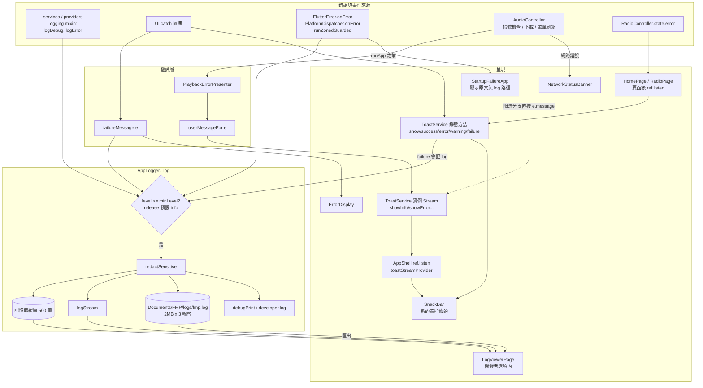

# 開發者模式、提示與日誌現況

> 現況描述，未經確認，不代表目標。

審計日期：2026-09-26，分支 `docs/audit`。全部結論以原始碼為準；文件／註釋的說法只當「主張」，與程式碼不符處標 **不一致**，沒有實際執行驗證的推論標 **推測**。本檔沒有跑 app，也沒有跑測試。

---

## 1. 開發者模式

### 1.1 如何開啟

| 項目 | 現況 | 證據 |
|---|---|---|
| 入口 | 設定頁「版本」列（`_VersionListTile`）連點 7 次 | `lib/ui/pages/settings/widgets/settings_about.dart:4-39`；次數常數 `requiredTaps = 7`：`lib/providers/settings/developer_options_provider.dart:49` |
| 提示 | 剩 4～1 次時 toast「再點 n 次」，達成時 success toast | `settings_about.dart:23-32` |
| 解鎖後 | 設定頁出現「開發者選項」區塊，點進 `/settings/developer` | `settings_about.dart:91-117`，掛在設定頁 `lib/ui/pages/settings/settings_page.dart:194` |
| 持久化 | **不持久化**。`isEnabled` / `tapCount` / `logLevel` 都是 `Notifier` 的記憶體狀態，重啟 app 即恢復關閉 | `developer_options_provider.dart:6-34`、`:10-15`（註釋明說「不落 `Settings`」） |
| 關閉方式 | 沒有 UI。`DeveloperOptionsNotifier.reset()` 在 `lib/` 與 `test/` 都查不到呼叫點（grep `developerOptionsProvider.notifier).reset`、`\.reset()`） | `developer_options_provider.dart:70` |
| build 條件 | 與 `kDebugMode` / `kReleaseMode` 無關，release 版也能解鎖 | grep `kDebugMode\|kReleaseMode\|kProfileMode` 只命中 `lib/core/logger.dart:68,273` 與 `lib/main.dart:110` |
| 路由保護 | 路由 `/settings/developer`、`/settings/developer/database`、`/settings/developer/logs` **無條件註冊**，只是 UI 上沒有別的入口 | `lib/ui/router.dart:246-263` |

### 1.2 開發者選項頁（`lib/ui/pages/settings/developer_options_page.dart`）逐區塊

| 區塊 / 項目 | 做什麼 | 完整度 | 證據 |
|---|---|---|---|
| **除錯工具**：記憶體使用（`_MemoryInfoTile`） | 顯示進程 RSS（Android/Windows/Linux）、Flutter 圖片記憶體快取數量／大小、RSS 減圖片快取的「Native 估算」、磁碟圖片快取 MB、佇列曲數、首頁排行快取筆數（B 站／YouTube／網易雲）、歌詞快取檔數；有「清除圖片記憶體快取」按鈕 | 可用。摘要行有寫死的簡中字串 `'Flutter 图片: '` 沒走 i18n；「Native 記憶體」只是 `RSS − 圖片快取` 的粗估；歌詞快取讀取失敗被 `catch (_) {}` 吞掉 | `:167-474`，寫死字串 `:307`，粗估 `:353-367`，吞例外 `:223-227` |
| **除錯工具**：即時日誌 | 進入 `LogViewerPage`（見 §3.4） | 可用 | `:41-47` |
| **除錯工具**：日誌級別（`_LogLevelTile`） | 下拉選 DEBUG/INFO/WARNING/ERROR，呼叫 `AppLogger.setMinLevel`；**只影響之後的記錄**（含落盤），重啟即回預設 | 可用，不持久化 | `:596-627`；`developer_options_provider.dart:43-46` |
| **除錯工具**：資料庫檢視器 | 進入 `DatabaseViewerPage`：頂部 chip 選 collection（Track、Playlist、PlayQueue、PlayHistory、Settings、SearchHistory、DownloadTask、RadioStation、LyricsMatch、LyricsTitleParseCache、Account），每個 collection **一次 `findAll()` 全讀**，以卡片列出欄位；唯讀，無搜尋、無分頁、無編輯 | 可用；大資料量時一次全載入（**推測**會卡頓，未實測） | 頁面 `lib/ui/pages/settings/database_viewer_page.dart:115-157`；清單 `lib/data/database/database_catalog.dart:49` 起，各 `findAll()` 如 `:53`（`isar.tracks.where().findAll()`） |
| **資料管理**：資料庫資訊 | 顯示 DB 目錄、檔案大小、Track 數、Playlist 數 | 可用 | `:86-151` |
| **資料管理**：重設所有資料 | 確認對話框後 `DataIntegrityRepository(isar).clearEverything()`（= `isar.clear()` 清空**所有** collection），再跑 `runDatabaseMigration` 重建預設資料 | 可用，但範圍有限：只清 Isar；**不清** `flutter_secure_storage` 裡的帳號憑證與 AI API key、不清下載檔案、不清歌詞／圖片磁碟快取、不重建記憶體中的 provider 狀態（佇列、播放器）。**推測**：重設後畫面仍顯示舊的記憶體狀態，直到重啟 | `:510-567`；`lib/data/repositories/data_integrity_repository.dart:55-57` |
| **資訊**：除錯模式 | 永遠顯示「已啟用」+ 勾勾圖示，沒有任何開關或條件判斷 | 純裝飾，內容恆真 | `:66-79` |

**相關但沒有 UI 入口的開發者向程式碼**：`DataIntegrityRepository.scan()` / `repair()`（重複 Track key、重複下載路徑、重複帳號平台、多筆 PlayQueue 的掃描與修復）在 `lib/` 查不到任何呼叫點，只有 `test/data/repositories/data_integrity_repository_test.dart` 使用。grep：`DataIntegrityRepository\|\.scan()\|\.repair()`。證據 `lib/data/repositories/data_integrity_repository.dart:59-85`。

---

## 2. Toast / SnackBar / 對話框

### 2.1 呈現入口一覽

全 app 只有一個自製的 `ToastService`（`lib/core/services/toast_service.dart`），**沒有**第三方 toast 套件（pubspec 與 `lib/` grep `fluttertoast|bot_toast|oktoast|overlay_support` 無結果）。底層一律是 `ScaffoldMessenger.of(context).showSnackBar`（`toast_service.dart:238-243`），不是 overlay。它有兩套入口：

| 入口 | API | 呼叫次數（grep，不含定義檔） | 怎麼到畫面 |
|---|---|---|---|
| 靜態（需 `BuildContext`） | `ToastService.show` | 25 | 直接 `showSnackBarNow` |
| | `ToastService.success` | 59 | 同上 |
| | `ToastService.error` | 40 | 同上（傳入已組好的字串） |
| | `ToastService.warning` | 14 | 同上 |
| | `ToastService.failure(context, e, …)` | 13 | 先 `AppLogger.error` 記原文，畫面顯示 `userMessageFor(e)`（`:188-198`） |
| | `ToastService.showWithAction` | 6 | 帶 `SnackBarAction` |
| 實例（Stream，給背景服務） | `showInfo` / `showSuccess` / `showWarning` / `showError` | 6 / 2 / 5 / 12 | 推進 broadcast stream（`:55-80`）→ `toastStreamProvider`（`:269`）→ **只有** `AppShell` 在 `ref.listen`（`lib/ui/app_shell.dart:44-49`）→ `_showSnackBar`（`:20-29`） |

- 使用 `ToastService` 的檔案共 45 個。
- 實例入口的使用者：`AudioController`（`lib/services/audio/audio_provider.dart:185` 取得，`:639-651,761,1604,1911,1957,1982,1988,1993,2100,2685` 發送）、帳號狀態檢查（`lib/providers/account/account_provider.dart:162,239`）、下載、歌單刷新（`lib/providers/library/refresh_provider.dart`）、帳號管理頁。
- 繞過 `ToastService` 自己 `showSnackBar` 的地方：0 處。`lib/ui/widgets/dialogs/change_download_path_dialog.dart:220` 只是先抓 `ScaffoldMessenger` 再交給 `ToastService.showSnackBarWithMessenger`。
- 外觀統一由 `ToastService.buildSnackBar`（`:93`）決定：floating、依類型著色；時長 error/warning/帶 action 用 3000ms，其餘 1500ms（`lib/core/constants/ui_constants.dart:166,169`）。
- 每次顯示都會 `clearSnackBars()` + `removeCurrentSnackBar()`（`toast_service.dart:240-242`），也就是**新 toast 直接蓋掉舊的、不排隊**。

### 2.2 對話框

- `showDialog` 44 處／27 檔（含 `showDialog<T>(` 泛型寫法 17 處）；`showModalBottomSheet` 15 處／13 檔（含泛型）；`AlertDialog(` 38 處／23 檔。（核查更正：原寫「`showDialog(` 31 處／14 檔；`showModalBottomSheet(` 9 處／7 檔」，只數到不帶型別參數的寫法）
- 共用 helper：`showConfirmDestructiveDialog`（`lib/ui/widgets/dialogs/confirm_destructive_dialog.dart:7-37`）17 個呼叫點；另有 5 個「加入（遠端）歌單」helper。其餘約 35 處 `AlertDialog` 是各頁面手刻。
- `.trellis/spec/ui/widgets.md:40-42` 明說兩種 dialog 入口風格（頂層 `showXxxDialog` 與 class 上的 `static show`）「都接受」。

### 2.3 不一致與重複（呈現面）

1. **例外轉 toast 有三種寫法並存**：
   - `ToastService.failure(context, e)` — 記 log + 翻譯（13 處）。
   - `ToastService.error(context, t.xxx(error: userMessageFor(e)))`，log 由呼叫端自己另記，例如 `lib/ui/pages/settings/log_viewer_page.dart:140-146`、`lib/ui/pages/settings/developer_options_page.dart:559-564`、`lib/ui/pages/settings/widgets/settings_backup.dart:34,90,351`。
   - 背景服務：`_toastService.showError(_errorPresenter.playbackFailed(e))`（`audio_provider.dart:1990-1993`）。
   `.trellis/spec/ui/widgets.md:25` 承認前兩種都可以。
2. **原文外洩到 toast（與規則不一致）**：`lib/core/errors/user_message.dart:62-71` 說回傳值裡不會有例外原文，但 `AudioController` 在限流分支直接 `showWarning(e.message)`，並把 `e.message` 寫進 `state.error`（`audio_provider.dart:1984-1988`）。`SourceApiException.message` 是 adapter 組出的診斷字串，不一定翻譯過。守門的 `test/ui/static_rules/error_presentation_static_rule_test.dart:176` 只掃 `lib/ui`，掃不到 `lib/services`。**不一致**。
3. **DB 初始化失敗畫面直接顯示 `error.toString()`**：`lib/app.dart:87`。`StartupFailureApp` 同樣顯示原文（`lib/ui/startup_failure_app.dart:74`），但那是它的註釋明說的例外；`app.dart` 這一處沒有說明。
4. **背景錯誤有兩種送達機制**：音樂播放錯誤走 Stream（任何頁面都會顯示，前提見第 5 點）；電台錯誤走「頁面級 `ref.listen`」，而且在 `HomePage`（`lib/ui/pages/home/home_page.dart:125-130`）與 `RadioPage`（`lib/ui/pages/radio/radio_page.dart:32`）各寫一份。使用者停在音樂庫、搜尋、設定等頁時，電台錯誤不會出現 toast。程式碼佐證（核查補證）：導覽列以 `context.go` 切頁（`lib/ui/app_shell.dart:34-38`），而 shell 是普通 `ShellRoute`，非活動頁會被銷毀（`lib/ui/router.dart:123-129`），所以兩個 `ref.listen` 只在 HomePage／RadioPage 仍掛載時存在；除這兩處外 `lib/` 沒有其他監聽 `radioControllerProvider` 錯誤的地方。仍屬**推測**的是執行期表現（例如從首頁 push 子頁時 HomePage 仍在堆疊下方，其 listen 是否被 Riverpod 3 暫停），未實測。
5. **全螢幕播放頁上可能看不到背景 toast（推測）**：Stream toast 只在 `AppShell` 監聽，`AppShell` 位於 `ShellRoute` 內；全螢幕播放頁 `/player`、`/radio-player` 掛在 root navigator、蓋在 shell 之上（`lib/ui/router.dart:293-307`）。repo 自己的規則說「Riverpod 3 會暫停被不透明路由蓋住的 consumer 的訂閱」（`test/providers/static_rules/riverpod3_static_rule_test.dart:31-35`）。若此說法成立，使用者在播放頁時發生的播放錯誤 toast 會被暫停或畫在被蓋住的 shell Scaffold 上。需要實機驗證。
6. **toast 互相覆蓋**：`showSnackBarNow` 每次先清空佇列（`toast_service.dart:240-242`），連續錯誤只會看到最後一則。
7. **文件範例與 API 不符**：`toast_service.dart:36-39` 的註解範例寫 `toastService.showMessage('消息内容')`，類別裡沒有 `showMessage`（實際是 `showInfo` 等，`:55-80`）。**不一致**。

### 2.4 錯誤呈現的其他 UI 元件

| 元件 | 用途 | 證據 |
|---|---|---|
| `ErrorDisplay`（含 `.network/.server/.notFound/.permission/.empty`、`compact`） | 頁面或區塊的錯誤／空狀態，附重試 | `lib/ui/widgets/feedback/error_display.dart:29` 起；33 處使用，例：`lib/ui/pages/search/search_page.dart:425,615` |
| `NetworkStatusBanner` | 全域橫幅：無網路，或播放網路錯誤（附「重試」呼叫 `retryManually()`） | `lib/ui/widgets/feedback/network_status_banner.dart:11-20,145-156`；掛在 `lib/app.dart:186,206` |
| `userMessageFor` / `failureMessage` | 例外 → 一句翻譯文字；`failureMessage` 順便 `AppLogger.error` | `lib/core/errors/user_message.dart:72-87,97-105` |
| `PlaybackErrorPresenter` | 決定播放失敗要跳過、重試或提示，措辭交回 `user_message.dart` | `lib/services/audio/playback_error_presenter.dart:28-80` |
| `StartupFailureApp` | `runApp()` 前失敗時的頂替畫面：中英文寫死、顯示原文、log 檔路徑、issue 網址 | `lib/ui/startup_failure_app.dart:22,57-82`；觸發 `lib/main.dart:68-92` |
| `app.dart` DB 載入失敗分支 | 紅色圖示 + `initFailed` + 原文 | `lib/app.dart:64-92` |

代表性路徑：

- **搜尋失敗**：`search_provider` catch → `failureMessage(e, stack, 'search failed', tag: 'Search')` 寫 log 並回傳翻譯句（`lib/providers/search/search_provider.dart:304`）→ 存進 state → `SearchPage` 以 `ErrorDisplay` 顯示（`search_page.dart:425`）。
- **播放失敗**：`AudioController._handleSourceError`（`audio_provider.dart:1945-1995`）→ `PlaybackErrorPresenter` 決定跳過或提示 → `_toastService.showWarning/showError` → Stream → `AppShell` → SnackBar；網路類錯誤另外點亮 `NetworkStatusBanner`。
- **匯出日誌失敗**：`log_viewer_page.dart:140-146` 自己 `AppLogger.error`，再 `ToastService.error(t.logViewer.exportFailed(error: userMessageFor(e)))`。

---

## 3. 日誌系統

### 3.1 實作

- 自製靜態類別 `AppLogger`（`lib/core/logger.dart:66` 起），不是第三方 logger 套件。
- 層級 `LogLevel { debug, info, warning, error }`（`:9`）。預設最低級別：debug build 為 `debug`，release／profile 為 `info`（`:68`）。執行期可由開發者選項調整（§1.2），不持久化。
- `Logging` mixin（`:295-303`）以 `runtimeType` 作 tag，提供 `logDebug/logInfo/logWarning/logError`。59 個類別使用；`log*` 呼叫約 792 處。直接呼叫 `AppLogger.info/warning/error` 的約 22／10／37 處（`AppLogger.debug` 除 mixin 轉發外無直接呼叫）。
- `lib/` 內沒有散落的 `print(` / `debugPrint(` / `developer.log(`，全部收在 `AppLogger._log` 裡（`:273-289`）。

### 3.2 輸出去向

每一筆（通過級別門檻後，先 `redactSensitive`，`:234-238`）同時送往：

1. 記憶體環形緩衝，最多 500 筆（`:70-72`，超過 `removeFirst`，`:261-264`）。
2. broadcast stream，給即時日誌頁（`:75`、`:267`）。
3. 落盤 `LogFileSink`（`:270`）。
4. debug build 另外 `developer.log`（`:273-281`）。
5. **不分 build 一律** `debugPrint`（`:283-290`）。註解 `:272` 寫「release 模式下使用 debugPrint」，實際是兩種模式都印。**不一致**（輕微）。

### 3.3 寫檔、位置、輪替

| 項目 | 現況 | 證據 |
|---|---|---|
| 啟用時機 | `main()` 在 `WidgetsFlutterBinding.ensureInitialized()` 之後 `attachFileSink`；binding 之前的 log 先進記憶體，掛上時整批倒進檔案 | `lib/main.dart:131-138`；`lib/core/logger.dart:163-170` |
| 位置 | `getApplicationDocumentsDirectory()/FMP/logs/fmp.log`。Windows 上是使用者的「文件」資料夾；DB 也在 `Documents/FMP/` 下 | `lib/core/log_file_sink.dart:24-28`；DB：`lib/data/database/database_provider.dart:50-53` |
| 輪替 | 單檔上限 2 MB、保留 3 個檔（`fmp.log`、`fmp.1.log`、`fmp.2.log`），超過刪最舊 | `log_file_sink.dart:17-19`、`:82-105` |
| 失敗處理 | 寫入非同步排隊，I/O 失敗全部吞掉；掛載失敗只記一筆 warning | `log_file_sink.dart:6-13`；`main.dart:136-138` |
| 遮蔽 | 訊息與 error 字串遮蔽 `Authorization`、`Bearer`、`SAPISIDHASH`、`Cookie` header，以及 `SESSDATA`、`bili_jct`、`MUSIC_U`、`refresh_token`、`apiKey`、`password`、`token` 等 key | `logger.dart:81-134`、`:177-200` |
| 遮蔽不涵蓋 | `stackTrace` 不遮蔽（`:256`、`:285-289`）。歌曲標題、上傳者、影片描述不算敏感：AI 歌詞比對在 debug 級別會把整個請求 payload（含影片描述與歌詞預覽）寫進 log（`lib/services/lyrics/ai_title_parser.dart:57`、`lib/services/lyrics/ai_lyrics_selector.dart:116`） | 同左 |

### 3.4 即時日誌頁（`lib/ui/pages/settings/log_viewer_page.dart`）

- 資料來源：開頁時複製 `AppLogger.logs`（最多 500 筆），再訂閱 stream 追加，畫面上限 1000 筆（`:32-46`）。
- 篩選：級別（Debug+/Info+/Warning+/只看 Error，`:199-219`）+ 文字搜尋 message/tag（`:68-80`）。這個「顯示篩選」與開發者選項的「記錄門檻」是兩個不同的級別設定，後者調高後前者選 Debug 也看不到 debug。
- 輸出：複製全部（`:91-95`）、長按單筆複製、詳情對話框（error + stack，`:345-415`）、匯出落盤檔（讀全部輪替檔、Android 選目錄／桌面另存新檔，`:102-148`）。沒有系統分享。
- 清空：清畫面與記憶體緩衝，不動落盤檔（`:150-155`）。
- 注意：「Info+」「Warning+」兩個選項是寫死英文（`:208-212`），另兩個走 i18n。

---

## 4. Log／錯誤從產生到呈現的流向

---

## 5. 小結：不一致或重複清單

| # | 項目 | 證據 |
|---|---|---|
| 1 | 開發者模式不持久化、沒有關閉入口；`reset()` 無呼叫者 | `developer_options_provider.dart:6-34,70` |
| 2 | 「除錯模式：已啟用」是恆真的裝飾列 | `developer_options_page.dart:69-77` |
| 3 | 「重設所有資料」只清 Isar，憑證、AI key、下載檔、磁碟快取、記憶體狀態都不動 | `developer_options_page.dart:543-566`；`data_integrity_repository.dart:55-57` |
| 4 | `DataIntegrityRepository.scan/repair` 無 UI 入口，只被測試使用 | `data_integrity_repository.dart:59-85` |
| 5 | 例外轉 toast 三種寫法並存 | §2.3 第 1 點 |
| 6 | `AudioController` 限流分支把 `e.message` 直接顯示，靜態規則只掃 `lib/ui` 所以沒被攔 | `audio_provider.dart:1984-1988`；`error_presentation_static_rule_test.dart:176` |
| 7 | `app.dart` DB 失敗畫面顯示原文 | `lib/app.dart:87` |
| 8 | 背景錯誤兩種送達機制（Stream 與頁面級 listen），電台錯誤只在兩個頁面可見 | `app_shell.dart:44`；`home_page.dart:126`；`radio_page.dart:32` |
| 9 | 全螢幕播放頁上的背景 toast 可能被暫停或畫在被蓋住的 shell 上（**推測**，需實機驗證） | `router.dart:293-307`；`riverpod3_static_rule_test.dart:31-35` |
| 10 | toast 不排隊，新的蓋掉舊的 | `toast_service.dart:240-242` |
| 11 | `toast_service.dart` 註解範例呼叫不存在的 `showMessage` | `toast_service.dart:36-39` |
| 12 | `logger.dart` 註解說 release 才用 `debugPrint`，實際一律 `debugPrint` | `logger.dart:272,283` |
| 13 | 寫死字串未走 i18n：記憶體摘要 `'Flutter 图片: '`、日誌篩選 `'Info+'` / `'Warning+'` | `developer_options_page.dart:307`；`log_viewer_page.dart:208-212` |
| 14 | 約 35 個手刻 `AlertDialog`，只有破壞性確認有共用 helper | §2.2 |
