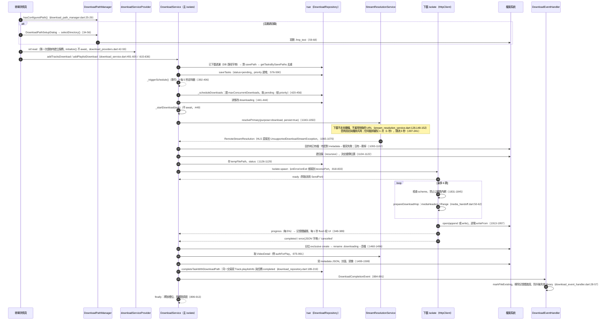
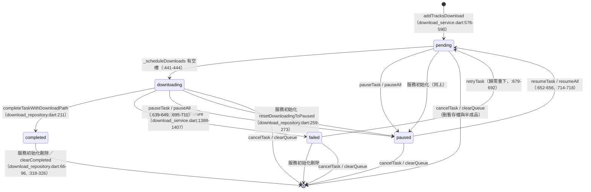

# 下載與權限現況審計

> 現況描述，未經確認，不代表目標。

- 審計基準：分支 `docs/audit`（HEAD `6d78fe23`），2026-09-27。只讀原始碼與 pub cache 裡的套件 manifest，**沒有執行 app、沒有打真實 API、沒有跑測試**。
- 行號都是實際看過的位置。標「**推測**」的是從程式碼推論、未實測；標「**不一致**」的是文件（含註釋、其他審計檔）和程式碼對不上；查不到的寫「查不到」。
- 已經寫在其他審計檔的內容不重寫，各節開頭列出引用：
  - `data.md` §5（根目錄優先序、檔名與子目錄、sidecar 欄位、去重三層、啟動清理）、§7（`customDownloadDir`、`maxConcurrentDownloads`、`downloadImageOptionIndex`）
  - `features.md` §5（下載功能列表）、§13.1–13.4（啟動、定時器、清理、背景下載）
  - `platforms.md` §1.5、§3、§3.8、§5.1、§5.2（平台分支、MethodChannel、Manifest、Windows runner）
  - `accounts-network.md` §2 #11–12、§3、§4.2（下載用的 Dio／HttpClient、標頭、錯誤訊息外洩面）
  - `errors.md` §1.2、§4.1（`UnsupportedDownloadStreamException`、下載錯誤呈現）
  - `playback.md` §3.13（已下載檔的本地播放）
  - `engineering.md` §0004、§0005（ADR 逐條核對）

---

## 1. 從「按下載」到「檔案寫入」

引用：入口列表見 `features.md` §5；Dio／HttpClient 設定與 redirect 檢查見 `accounts-network.md` §2 #11–12；去重三層見 `data.md` §5.4。本節補完整呼叫鏈與行號。

### 1.1 UI 入口（全部在歌單詳情頁）

`addTrackDownload`／`addTracksDownload`／`addPlaylistDownload` 在 `lib/` 只有歌單詳情頁呼叫（grep 結果）。`fromPlaylist` 是必填參數（`lib/services/download/download_service.dart:467-471`），所以**不在任何歌單裡的曲目不能下載**：搜尋頁、佇列、正在播放、排行榜、已下載頁都沒有下載入口。四個入口在 Mix 歌單都隱藏。

| 入口 | 顯示條件 | 呼叫鏈 | 證據 |
|---|---|---|---|
| 標題列「全部下載」按鈕 | 歌單有歌、非 Mix | 確認對話框 → 路徑檢查 → `addPlaylistDownload` | `lib/ui/pages/library/playlist_detail_page.dart:824-830,935-967` |
| 多選「下載」 | 非 Mix | `_downloadSelectedTracks` → `_addTracksToDownloadQueue`（`skipSchedule: true`，有新任務才 `triggerSchedule`） | `playlist_detail_page.dart:211,531-532,291-307,1031-1052` |
| 多 P 分組選單「下載全部分 P」 | 非 Mix | 同上 | `playlist_detail_page.dart:1268-1275,1317-1330` |
| 單曲選單「下載」 | 非 Mix | `addTrackDownload`（會自己觸發調度） | `playlist_detail_page.dart:1493-1498,1526-1535` |

四個入口都先檢查 `hasConfiguredPath()`，沒選過目錄就跳 `DownloadPathSetupDialog`（`playlist_detail_page.dart:959-964,1020-1028`）。結果用 toast 回報，分成新增、已下載、已在佇列、部分已存在幾種（`:1054-1118`）。「已下載」只看 DB 裡的 `downloadPath` 字串，不檢查檔案在不在（`download_service.dart:507-519`；`lib/data/models/track.dart:172-188`）。

### 1.2 序列圖

### 1.3 各步補充

- **並行數**：`Settings.maxConcurrentDownloads`，預設 3（`lib/data/models/settings.dart:281`），設定頁是 1–5 的單選對話框（`lib/providers/download/download_settings_provider.dart:81-88`；UI `lib/ui/pages/settings/widgets/settings_storage.dart:172-185`）（核查更正：原寫「滑桿」，實為 `RadioGroup`）。調度器每次都重讀設定（`download_service.dart:425-426`）。調低時不會中斷正在跑的任務，只是暫時不補新任務。
- **一任務一 isolate**：每個任務各開一個 isolate，註解說是為了避開 Windows 上的 "Failed to post message to main thread"（`:813-814`）。isolate 在 `_startDownload` 內 spawn，沒有 isolate 池。
- **串流解析寫回 DB**：`persist: true` 會把新的 `audioUrl`／`audioUrlExpiry` 寫進 Track（`stream_resolution_service.dart:459-480`），`_resolveDownloadStream` 之後又把同樣的值寫到記憶體裡的 track 副本上（`download_service.dart:1072-1075`）。後者沒有存檔，是重複動作。
- **位元組請求不帶登入**：`MediaHandoffRequest.streamResolutionAuth` 不會進請求標頭，只帶 `SourceHttpPolicy.mediaHeaders` 和 Range（`lib/services/media/media_handoff.dart:15-21,54-62`）。登入只影響解析階段選到的 URL。
- **兩層逾時**：連線 30 秒（`lib/core/constants/app_constants.dart:124`；`download_service.dart:1820`），兩個 chunk 之間 30 秒（`app_constants.dart:118`；`download_service.dart:1928-1930`）。整體沒有上限。

---

## 2. 任務生命週期

引用：啟動清理的條列見 `data.md` §5.4、`features.md` §13.3–13.4；錯誤字串與翻譯見 `errors.md` §1.2、§4.1。

### 2.1 狀態機

`DownloadStatus` 有五個值（`lib/data/models/download_task.dart:6-21`）。「刪除」不是狀態，是整列從 Isar 移除。

- **不一致（註釋）**：`resetDownloadingToPaused` 的名字只講 downloading，實作把 pending 也改成 paused（`download_repository.dart:258-273`）。上一輪排在佇列裡還沒開始的任務，重啟後也要手動按繼續。
- 「服務初始化」**不是 app 啟動**。`downloadServiceProvider` 是一般 `Provider`，第一次被讀取時才建立並呼叫 `initialize()`。讀取點只有歌單詳情頁的四個入口和下載管理頁（`lib/ui/pages/settings/download_manager_page.dart:20,331`）。沒開過這兩處的 session 不會清舊任務，也不會掃孤兒暫存檔。

### 2.2 進度回報

| 層 | 機制 | 頻率 | 證據 |
|---|---|---|---|
| isolate → 主 isolate | `SendPort`，進度每多 5% 送一次，到 100% 必送 | 依下載速度 | `download_service.dart:1941-1955`；門檻 `app_constants.dart:110` |
| 主 isolate 緩衝 | `_pendingProgressUpdates` Map，同一任務只留最新一筆；上限 256 筆，超過丟最舊的 | — | `:133-136,362-389` |
| 緩衝 → UI | 1 秒 `Timer.periodic` flush 到 `progressStream`，**不寫 DB** | 1 秒 | `:316-358` |
| UI | `downloadProgressStateProvider`（記憶體 Map）優先，沒有才用 DB 的值 | — | `download_providers.dart:86-94,132-170`；`download_manager_page.dart:334-342` |
| DB | 只在暫停、失敗、中止時由 `_saveResumeProgress` 寫入（以暫存檔實際長度為準） | 事件 | `:1219-1253` |

- 回應沒有 `Content-Length` 時 `totalBytes = -1`，isolate 一次進度都不送（`:1918-1919,1941`）。UI 會停在 0% 直到完成（**推測**：YouTube／網易的 CDN 是否都會給長度，未實測）。
- 進度條只在 downloading／pending 時顯示（`download_manager_page.dart:369`），paused 的任務看不到進度。記憶體進度只在完成時移除（`download_event_handler.dart:30`），暫停或重試後 UI 仍可能顯示舊值，直到下一筆進度進來。

### 2.3 暫停與續傳

- **斷點資訊存哪**：Isar 的 `DownloadTask.tempFilePath` 加 `downloadedBytes`（`download_task.dart:51,60`），實際續傳位置取 `{savePath}.downloading` 的檔案長度（`download_service.dart:1092,1114-1118`）。
- **續傳條件**：`canResume`（有 `tempFilePath` 且 `downloadedBytes > 0`，`download_task.dart:96-98`），**而且**重新算出的 `tempPath` 要與存下的一致，暫存檔也還在（`download_service.dart:1114-1116`）。`savePath` 每次開始時都依目前的根目錄、任務建立時存下的 `task.playlistName`、目前的曲目標題重算（`:1412-1421`）。所以暫停期間改了根目錄或標題（`parentTitle`／`title`），就會刪掉舊暫存檔從頭下（`:1119-1122`）（核查更正：原寫「根目錄、歌單名或標題」；歌單名取自任務建立時的快照 `task.playlistName`（`:579`），暫停期間改歌單名不影響 `savePath`）。
- **Range**：`Range: bytes=N-`（`media_handoff.dart:57-59`）。伺服器回 200 就改成從 0 覆寫（`download_service.dart:1904-1906`）。沒有檢查 `Content-Range`、`ETag` 或 `If-Range`。
- **推測**：每次繼續都重新解析 URL（下載不重用，`stream_resolution_service.dart:148-152`）。音質降級（`lib/data/sources/audio_stream_quality_fallback.dart:42-66`）或串流優先序（audioOnly／muxed）讓第二次拿到不同的檔案時，只要伺服器回 206，新檔的位元組就會接在舊檔後面，產生內容損壞但標記為完成的檔案。沒有任何大小或雜湊驗證能擋下。
- 暫停是**協作式**的：isolate 只在收到下一個 chunk 時檢查取消旗標（`:1931-1937`）。主 isolate 最多等 2 秒，之後直接 kill isolate（`:1197-1203`）。

### 2.4 重試

- **下載本身不自動重試**。isolate 回報任何錯誤，任務就直接 failed（`:874-876,892-898`）。
- 自動重試只發生在串流解析：任何例外重試 1 次（等 1 秒）、限流重試 1 次（等 3 秒）（`stream_resolution_service.dart:207-241`；`app_constants.dart:138,143-145`），加上音質由高往低降級。
- 手動重試（`retryTask`）會把 `downloadedBytes` 歸零（`download_service.dart:685-688`），於是 `canResume` 為 false，暫存檔被刪掉從頭下（`:1119-1122`）。失敗前 `_handleDownloadFailure` 才剛存好的續傳進度（`:1393`）因此用不到。

### 2.5 取消（刪除任務）

- `cancelTask`：標記 discard guard → 送 `cancel` → 刪 DB 任務 → 未完成的任務刪 `tempFilePath` 與 `savePath`，並刪根目錄內的空資料夾（`:659-676,1263-1293`）。刪除有 10 次 × 50ms 的重試，用來應付 Windows 檔案占用（`:1299-1319`）。只刪根目錄內的路徑（`:1273-1277`）。
- finalization 已經開始才取消時，每一步後都會檢查，並清掉 DB 路徑和落盤產物（`:996-1001,1007-1038`）。
- 下載管理頁的「清空佇列」會刪所有未完成任務和它們的檔案，接著再清已完成（`download_manager_page.dart:40-50`；`download_service.dart:721-748`）。

### 2.6 失敗處理

| 面向 | 現況 | 證據 |
|---|---|---|
| 使用者看到什麼 | toast「下載失敗: {標題}」＋下載管理頁該列紅字錯誤原因與重試鈕 | `download_providers.dart:72-76`；`download_manager_page.dart:383-416` |
| 原因字串 | 存翻譯後的句子，語言固定在失敗當下 | `download_service.dart:1375-1385` |
| HTTP 4xx/5xx、redirect 無 Location、超過 5 跳 | isolate 送的是**純字串**（`'HTTP 403'` 等），不是 JSON，還原成通用 `Exception`，使用者只看到通用訊息，看不出是 403 還是 404 | `:1870-1901,1348-1358` |
| isolate 非正常死亡 | `onError`／`onExit` 轉成錯誤，不再卡住槽位 | `:828-832,960-968` |
| 是否持久化 | 是，`failed` 列留在 Isar | `download_repository.dart:168-186` |
| 何時消失 | 下次**服務初始化**時連同 completed 一起刪（見 §2.1） | `download_service.dart:206-212` |

### 2.7 App 重啟後未完成任務

- 服務初始化時 downloading／pending 都改成 paused，**不自動續傳**（`download_service.dart:214-215`）。已存的暫存檔保留，使用者按繼續才會續傳。
- 孤兒 `.downloading` 掃描用 **basename** 比對（`:238-273`）。檔名固定是 `audio.m4a.downloading` 或 `P01.m4a.downloading` 這幾種（`download_path_utils.dart:39-46`），只要有一個暫停中的單 P 任務，整個根目錄下所有 `audio.m4a.downloading` 孤兒都不會被刪。註釋承認「同名時寧可留著」（`:234-235`），但實際上等於幾乎永遠同名。
- 掃描只看**目前**根目錄（`:240-244`）。改過下載路徑後，舊目錄的暫存檔永遠不會被清。

---

## 3. 音質、檔名、metadata、分 P

引用：路徑格式、全形替換、Windows 保留名、`.m4a` 一律副檔名、sidecar 欄位、HLS 拒絕，都見 `data.md` §5.2–5.3。本節只補缺的。

### 3.1 音質

- **下載與播放共用同一組設定**，沒有下載專用的音質：`AudioStreamConfig.fromSettings` 取 `audioQualityLevel`、`audioFormatPriorityList`、`streamPriorityFor(sourceType)`（`lib/data/sources/base_source.dart:44-50`；`stream_resolution_service.dart:404-406`）。失敗時由高往低降級（`audio_stream_quality_fallback.dart:23-66`）。
- 串流優先序預設：Bilibili `audioOnly,muxed`、YouTube `audioOnly,muxed,hls`、網易 `audioOnly`（`settings.dart:59-63`）。
  - **推測**：audio-only 拿不到而落到 muxed 時，下載的是含影像的容器，檔名仍是 `.m4a`。
  - 解析結果是 HLS 時直接失敗（`download_service.dart:1065-1070`），不會改用優先序裡的下一種類型。
- 網易試聽片段下載端擋不到：見 `sources.md` 下載列。

### 3.2 檔名與目錄（補 data.md 未寫的）

- **控制字元不處理**：`sanitizeFileName` 只換 9 個符號、去頭尾空白、去結尾的點（`download_path_utils.dart:81-115`）。**推測**：標題含換行或 Tab（0x00–0x1F）時，Windows 建目錄會失敗，任務 failed。
- **順序問題**：先 `trim` 再去結尾的點，所以「abc .」會變成「abc 」（結尾空白），Windows 不允許這種名稱（**推測**：失敗或被系統靜默去掉，未實測）。
- **200 字截斷**以 UTF-16 code unit 計（`:109-112`）。**推測**：可能把 emoji 的代理對切半。整條路徑長度沒有控制：根目錄 + 200 字歌單名 + sourceId + 200 字標題，可能超過 Windows 的 260 字元限制（Dart 是否自動加 `\\?\`，未查證）。
- **重名**：歌單名只在原字串層級唯一（`lib/services/library/playlist_service.dart:160-162`）。「a:b」與「a：b」換成全形後是同一個資料夾，兩個歌單的同一首歌算出同一個 `savePath`，後下載的那個會被判「已在佇列」或「目的地已有檔案」失敗（`download_service.dart:544-571,1093-1096`）。
- **分 P**：`isPartOfMultiPage` 是 `pageCount > 1`（`track.dart:328`），檔名 `P{NN}.m4a` 補到兩位（`download_path_utils.dart:40-43`）。同一支影片的所有分 P 共用 `{sourceId}_{parentTitle}` 資料夾，各自有 `metadata_P{N}.json`。掃描時分 P 號以檔名為準，覆蓋 metadata 裡的值（`lib/providers/download/download_scanner.dart:352-366`）。
- **不一致**：`data.md` §5.4 最後一條說「歌單改名時會連資料夾一起改」。程式碼**不改資料夾**：它清掉該歌單所有曲目的下載路徑，回傳新舊資料夾路徑，請使用者自己搬（`playlist_service.dart:136-141,166-189`；UI `lib/ui/pages/library/widgets/create_playlist_dialog.dart:483-484`）。而且 `Track.playlistInfo[].playlistName` 不會跟著改名（改名流程沒有更新它），這點在 §4.4 會用到。

### 3.3 metadata 與圖片（補 data.md 未寫的）

- VideoDetail 在 finalization 時抓，抓失敗只記 debug，metadata 就少掉擴充欄位（`download_service.dart:975-991`）。`_fetchVideoDetail` 用 `authForPlay`（`:979-981`）。
- 封面：`ThumbnailUrlUtils.getOptimizedUrlCandidates` 的 `ImageTargetSizes.high` 候選，依序試（`:1567-1581,1601-1622`）。頭像用 `low`，只有 `coverAndAvatar` 模式而且有 VideoDetail 時才抓（`:1583-1598`）。兩者失敗都只記 debug。`downloadImageOptionIndex` 預設 1＝只抓封面（`settings.dart:284`；UI `settings_storage.dart:241`）。
- **不寫內嵌 tag**：pubspec 沒有任何 ID3／MP4 tag 或 ffmpeg 套件（grep `tag|id3|ffmpeg|metadata` 只命中授權註解），音檔是 CDN 原始位元組。檔案離開 FMP 後，播放器看到的標題就是 `audio.m4a`。

---

## 4. 下載路徑

引用：根目錄優先序與 Android／Windows 預設見 `data.md` §5.1；平台分支見 `platforms.md` §1.5；ADR 0004 逐條核對見 `engineering.md` §0004。

### 4.1 首次設定

`DownloadPathSetupDialog._selectPath`（`lib/ui/widgets/dialogs/download_path_setup_dialog.dart:62-97`）→ `selectDirectory`（`download_path_manager.dart:34-56`）：

1. Android 先要權限（§6）。沒拿到就回 null，對話框回到可再按的狀態（`download_path_setup_dialog.dart:78-81`）。
2. `FilePicker.getDirectoryPath()`。
3. 寫再刪 `.fmp_test`（`download_path_manager.dart:59-68`）。失敗就跳「權限不足」對話框並回 null（`:48-53,98-119`）。
4. 存進 `Settings.customDownloadDir`（`:71-75`）。

**推測**：Android 選到 SD 卡目錄時，`MANAGE_EXTERNAL_STORAGE` 對可移除儲存空間不一定有寫入權。`.fmp_test` 會失敗並擋下這次選擇，未實測。

### 4.2 設定頁變更

| 平台 | 能不能改 | 流程 | 證據 |
|---|---|---|---|
| Android | **不能**。選單只有「路徑資訊」 | 第一次選定之後，App 內沒有任何入口能重選（`hasConfiguredPath` 永遠 true，也不會再跳設定對話框） | `settings_storage.dart:60-76` |
| Windows | 能 | 確認（警告「會重設下載記錄」「檔案不會被刪」）→ 選目錄 → `changeBasePathAndResetDownloads` | `lib/ui/widgets/dialogs/change_download_path_dialog.dart:185-247` |

`changeBasePathAndResetDownloads`（`lib/services/download/download_path_maintenance_service.dart:59-80`）做三件事：清空**所有** Track 的下載路徑、刪除已完成和失敗的任務、存新路徑。它**不搬移舊檔**，也**不掃描新目錄**。對話框只失效 `downloadPathProvider` 和 library（`change_download_path_dialog.dart:211-217`），要等重啟或手動同步才會認出新目錄裡原有的下載。其他副作用：

- paused／pending 任務沒被處理。之後會下到新根目錄，因為 `tempPath` 不同而從頭下（§2.3）。
- **推測（競態）**：變更時正在跑的任務已經算好了舊的 `savePath`，完成後會把舊路徑寫回 DB（`download_repository.dart:189-219`），下次啟動同步掃不到新根目錄以外的東西，又會把它清掉。
- `downloadBaseDirProvider`（曲目詳情面板用來找頭像）沒被失效，直到重啟前都拿著舊根目錄（`download_providers.dart:173-176`；`lib/ui/widgets/panels/track_detail_panel.dart:781`；grep 不到 invalidate）。

### 4.3 路徑失效時的行為

| 情境 | 下載時 | 啟動時 | 播放已下載檔時 |
|---|---|---|---|
| 資料夾被刪 | `dir.create(recursive: true)` 重建，照常下載（`download_service.dart:1104-1108`） | 根目錄不存在：同步回 `(0,0)`，不清 DB（`download_path_sync_service.dart:32-35`）；孤兒掃描略過（`download_service.dart:243-244`）。只刪歌單子目錄時，該目錄裡的曲目在同步時被清掉路徑（§4.4 第 4 步；曲目若還在別的資料夾配對到，則是第 3 步丟掉該條目）（核查更正：原寫「第 3 步」） | `File.existsSync` 不在就**永久**清掉該路徑，改播線上（`stream_resolution_service.dart:128-136,483-496`；見 `playback.md` §3.13） |
| SD 卡拔出／磁碟機不在 | 建目錄丟 `FileSystemException` → failed | 同上（根目錄不存在就不動 DB） | 同上。**推測**：暫時拔出期間播一次，該曲的下載關聯就沒了，要等重新插入後重啟（或手動同步）才找回 |
| Android 權限被撤銷 | 開檔丟 `PathAccessException` → failed，訊息「沒有權限存取」（ADR 0004；`download_service.dart:1995-2010`；`lib/core/errors/user_message.dart:85`）。**不會重新要求權限**，也沒有導去設定的入口 | **推測**：撤銷後系統會殺掉行程。重啟時，若 `Directory.exists()` 為真但列不到 metadata 檔（scoped storage 過濾），同步第 4 步會把所有下載路徑清掉（核查更正：原寫「第 3 步」；沒配對到的曲目是在第 4 步 `:214-224` 被清）；若 `list()` 拋例外，整次同步被 catch 吞掉（`startup_download_sync_provider.dart:32-39`）（核查更正行號）。需實機驗證 | 同「資料夾被刪」 |
| Windows 無寫入權 | 選目錄時 `.fmp_test` 擋下；事後才失去權限時，`PathAccessException` → failed | 列目錄失敗：被 catch | 讀得到就照播 |
| Windows 路徑不存在 | 同「資料夾被刪」；上層磁碟不在時失敗 | 同上 | 同上 |

App 啟動時沒有任何「下載目錄是否可用」的檢查或提示。`StoragePermissionService.hasStoragePermission()` 在 `lib/` 沒有呼叫者（`storage_permission_service.dart:69-77`；grep）。

### 4.4 `DownloadPathSyncService` 做什麼

`syncLocalFiles`（`download_path_sync_service.dart:26-232`）在啟動時由 `startupDownloadSyncProvider` 呼叫（`lib/app.dart:131`；`lib/providers/download/startup_download_sync_provider.dart:9-40`），已下載頁也有手動按鈕（`lib/ui/pages/library/downloaded_page.dart:38-75`）。步驟如下：

1. 列出根目錄下每個一級子資料夾（歌單資料夾），用 `DownloadScanner.scanFolderForTracks` 掃二級資料夾裡的 `.m4a`（`:48-67`；`download_scanner.dart:297-407`）。
2. 配對：先用 `TrackSourceIdentity` 直接命中；沒有 cid 時，退回 `formatGroup` 分組再比 `pageNum`（`:69-98,234-272`，與 ADR 0005 描述一致）。
3. 對每個配對到的 Track **重建整個 `playlistInfo`**：只保留 `playlistName` 等於**資料夾名**的舊條目，把路徑換成本地的；本地沒有對應資料夾的舊條目**整條丟掉**（`:158-181`）；多出來的資料夾加成 `playlistId=0`（`:183-197`）。
4. DB 裡有下載路徑、但這次沒配對到的 Track，清空所有下載路徑（保留歌單關聯，`:214-224`）。

**資料遺失路徑（呼叫鏈已由程式碼逐段確認；未實機重現）**（核查更正：原寫「由程式碼推導的資料遺失路徑（未實測）」，每一段都查得到程式碼，只剩「未實機跑過」這一點）。`playlistInfo` 同時是「曲目屬於哪些歌單」的紀錄：`belongsToPlaylist` 讀它（`track.dart:156-158`），孤兒清理也以「沒有 `playlistId > 0` 的條目」判定孤兒（`lib/data/repositories/track_repository.dart:635-661`）。證據鏈：

1. **寫入端存原始名**：下載任務的 `playlistName` 是 `fromPlaylist.name` 原字串（`download_service.dart:499,579`），完成時 `setDownloadPath(..., playlistName: task.playlistName)` 寫進 `playlistInfo`（`download_repository.dart:206-210`）；加入歌單時也存原始 `name`（`playlist_mutation_repository.dart:765-797`）。
2. **磁碟端是清理過的名**：資料夾名是 `sanitizeFileName(playlistName)`（`download_path_utils.dart:29-31`）。
3. **比對**：同步的 `folderName` 取磁碟資料夾名（`download_path_sync_service.dart:283`），與 `info.playlistName` 做 `==` 字串比對（`:123-131,165-169`）。
4. **丟條件**：對每個**配對到本地檔**的 Track，`playlistInfo` 被整個重建：舊條目只有名字等於某個本地資料夾名才保留，其餘（不論有沒有下載路徑）一律丟掉（`:162-181`，註解「本地没有匹配的文件夹 → 不保留」）；沒對上的資料夾加成 `playlistId=0`（`:186-197`），整批 `saveAll`（`:199,226-228`）。
5. **觸發時機**：每次 app 啟動，`app.dart:131` watch `startupDownloadSyncProvider` → `syncLocalFiles()`（`startup_download_sync_provider.dart:16`）；已下載頁的手動同步按鈕也跑同一個函式。
6. **刪除**：`AudioController` 初始化時 `QueueManager.initialize` 排一個 10 秒 `Timer`（`queue_manager.dart:219-229`）→ `_cleanupOrphanTracks`（`:830-843`）→ `deleteOrphanTracks`。唯一的豁免是目前佇列裡的 id（`track_repository.dart:648`）；判定只看 `playlistInfo` 有沒有 `playlistId > 0`（`:653-658`）。**不**檢查 `Playlist.trackIds`、`DownloadTask.trackId` 或下載路徑是否存在（`PlayHistory` 存的是快照、不引用 Track id，本來就不影響）。Track 列直接 `deleteAll`（`:669`）。
7. **兩者的先後不影響結論**：同步若在 10 秒內寫完，同一次啟動就刪；若同步較慢，被改寫的 `playlistInfo` 已落盤，下一次啟動的清理照樣刪。

會觸發的情況：

- 歌單名含 `/ \ : * ? " < > |`、頭尾空白、結尾的點、超過 200 字、Windows 保留名時，兩者不相等（核查補：手動建立的歌單名會先 `trim`（`create_playlist_dialog.dart:436`），頭尾空白主要來自匯入時直接用遠端標題（`import_service.dart:237`））。
- 使用者照 §3.2 改名流程的提示把資料夾搬成新名稱時，也不相等（`playlistName` 仍是舊名）。反過來，改名後**不搬**資料夾，同步會用舊名對回舊資料夾，把改名時清掉的下載路徑又接回去。

不相等時，該歌單的條目被丟掉，只剩 `playlistId=0`。若這首歌不屬於其他有條目的歌單、而且不在佇列裡，孤兒清理會刪掉這個 Track 列；`Playlist.trackIds` 仍指向已刪除的 id，`getByIds` 讀取時靜默濾掉（`track_repository.dart:72-84`），曲目就從歌單消失。本地歌單沒有任何回填機制；遠端匯入的歌單下次刷新時 `replaceTracksFromRemoteRefresh` 會重建關聯（`playlist_mutation_repository.dart:427,469`），但被刪的 Track 會以新 id 重建。

即使名稱對得上，重建（上面步驟清單第 3 步、證據鏈第 4 步）對「同時屬於另一個**沒下載**的歌單」的曲目也會丟掉那個歌單的條目（那個歌單沒有本地資料夾可對）。曲目因為還有已下載歌單的條目而不被刪，但之後只要從已下載的歌單移除，就會在下次啟動被當成孤兒刪掉，儘管它仍在另一個歌單的 `trackIds` 裡。

測試：`test/providers/startup_download_sync_provider_test.dart` 透過 provider 呼叫真實的 `syncLocalFiles`，但沒有任何案例設定 `playlistInfo` 的歌單名或多歌單歸屬；`test/services/download/download_system_requirements_test.dart:189-222` 只模擬配對（核查更正：原寫「現有測試沒有真的呼叫 `syncLocalFiles`」）。

- **不一致**：註釋「C1: 跳过没有有效 metadata 的文件」（`download_path_sync_service.dart:22,286-290`）以及 `data.md` §5.4「沒有有效 metadata 的檔案會跳過」，都和程式碼不符。掃描器對沒有 metadata 的 `.m4a` 會用資料夾前綴當 sourceId、`sourceType` 固定填 Bilibili，產生 DTO（`download_scanner.dart:385-391`），`sourceId` 因此幾乎不會是空字串，跳過條件形同虛設。**推測**：promote 中途被殺、留下無 metadata 的空佔位 `audio.m4a` 時，若該 bvid 在 DB 裡有對應曲目，同步會把它記成已下載，播放時本地優先，播到空檔。
- `cleanupInvalidPaths()` 是死代碼（見 `features.md` §5）。

---

## 5. 已下載檔案

引用：播放時本地優先的判斷位置與後端見 `playback.md` §3.13；DB 對應欄位見 `data.md` §5.4；刪除的擁有權判定邏輯本節補。

### 5.1 播放與對應

- 判斷位置：`StreamResolutionService.resolvePrimary` 對非下載用途先跑 `_inspectLocalFiles`，第一個存在的 `allDownloadPaths` 就用（`stream_resolution_service.dart:128-145,483-496`）。它不管目前是從哪個歌單播的，任何歌單的下載都算。
- 已下載頁與分類頁的曲目**不是 DB 列**，是從 metadata 即時造出的 `Track`（`playlistId=0`，`download_scanner.dart:86-105`），再交給 `playTemporary`／`addAllToQueue`（`lib/ui/pages/library/downloaded_category_page.dart:290,368-382`）。

### 5.2 掃描、同步、快取

| 機制 | 何時跑 | 在哪個 isolate | 證據 |
|---|---|---|---|
| 分類列表 `downloadedCategoriesProvider` | 已下載頁顯示、同步後失效 | `Isolate.run` | `download_providers.dart:195-208`；失效 `library_invalidation_coordinator.dart:159` |
| 分類內曲目 `downloadedCategoryTracksProvider` | 進分類頁 | `Isolate.run` | `download_providers.dart:213-219` |
| 啟動同步 `syncLocalFiles` | 每次啟動＋手動 | **主 isolate**（逐資料夾 await 檔案 IO） | `download_path_sync_service.dart:61-67` |
| `FileExistsCache` | UI 查「有沒有下載」與本地封面時 | 主 isolate，非同步 `File.exists`；正向與負向各上限 5000 | `lib/providers/download/file_exists_cache.dart:36-50,188-203`；完成時 `markAsExisting`（`download_event_handler.dart:29`） |

- 分類列表只數 `.m4a`，而且用 `recursive: true` 數（`download_scanner.dart:223-233`）；曲目列表只看二級資料夾（`:305-313`）。兩者的深度定義不同。
- 負向快取沒有 TTL，只靠 `downloadStateChanged` 事件整批失效（`lib/providers/library/library_invalidation_coordinator.dart:86-97`）。

### 5.3 刪除（刪檔 vs 刪記錄）

| 動作 | 刪檔 | 刪／清 DB | 入口 |
|---|---|---|---|
| 刪整個分類（歌單資料夾） | 只刪「能證明是 FMP 寫的」檔（固定檔名或有配對 metadata 的 `.m4a`），不遞迴刪、不跟隨符號連結；`.downloading` 不動 | 刪前先掃描，刪後比對，把消失的路徑從 Track 清掉 | `downloaded_page.dart:450-510`；`download_path_maintenance_service.dart:82-116,376-448` |
| 刪單曲／刪整組分 P | 同上規則；資料夾裡沒剩音檔才清封面、頭像、metadata 和空資料夾 | 同上 | `downloaded_category_page.dart:528-556,697-727`；`download_path_maintenance_service.dart:118-137,451-523` |
| 從歌單移除曲目／刪歌單 | **不刪檔** | 只動 `playlistInfo` | `playlist_mutation_repository.dart:118-140`（無任何 `File(`／`Directory(`，grep） |
| 取消下載任務 | 刪暫存檔與未完成的目的地 | 刪任務列 | §2.5 |

- 歌單詳情頁沒有「刪除已下載檔案」的入口。刪檔只能從「音樂庫 → 已下載」進去做。
- 刪除時根目錄解析失敗，containment guard 就停用，照樣刪（`download_path_maintenance_service.dart:139-156,628-632`）。

### 5.4 清理

- 孤兒 `.downloading`：服務初始化時掃一次（§2.7 的限制）。
- 孤兒音檔（磁碟上有、DB 沒對到）：不清。同步只會把能配對的記成 `playlistId=0`，配不到的留在磁碟上，已下載頁照樣顯示。
- DB 裡的失效路徑：啟動同步第 4 步，加上播放時的 `existsSync` 順手清。

---

## 6. 各平台權限總表

引用：Manifest 權限清單與 MethodChannel 方法見 `platforms.md` §3.8、§5.1；Windows 開機自啟、托盤、熱鍵、單一實例見 `platforms.md` §3、§5.2。本表補「誰在什麼時候請求、被拒怎麼辦」。外掛合併進來的權限是查 pub cache 裡 lock 版本的 manifest 得到的（`open_filex-4.7.0/android/src/main/AndroidManifest.xml`）。其他外掛（audio_service 0.18.18、just_audio 0.10.6、file_picker 11.0.3、flutter_inappwebview_android 1.1.3 等）的 manifest 沒有宣告 `uses-permission`。

### 6.1 Android

| 權限 | 宣告位置 | 在哪裡請求 | 何時請求 | 被拒時 | UI 說明 |
|---|---|---|---|---|---|
| `MANAGE_EXTERNAL_STORAGE`（API 30+） | `AndroidManifest.xml:22-23` | `storage_permission_service.dart:86-101` → `MainActivity.kt:75-103`（`ACTION_MANAGE_APP_ALL_FILES_ACCESS_PERMISSION`，失敗退到全域設定頁） | 第一次下載時的選目錄流程（`download_path_manager.dart:36-41`） | `selectDirectory` 回 null，設定對話框留在原地，可以再按；不會下載。事後撤銷：下載 failed，**沒有重新請求的入口**（§4.3） | 有：先顯示說明對話框（`storage_permission_service.dart:180-241`） |
| `READ_EXTERNAL_STORAGE`（maxSdk 32）、`WRITE_EXTERNAL_STORAGE`（maxSdk 29） | `AndroidManifest.xml:17-20`（open_filex 另宣告 READ maxSdk 32） | `storage_permission_service.dart:114-116` → `MainActivity.kt:105-136` 系統權限框 | 同上，只在 API 23–29 | 回 false，選目錄中止，**沒有說明也沒有導去設定**。**推測**：使用者勾「不再詢問」後每次都靜默被拒。API 30–32 宣告了 READ 但從不請求（`MainActivity.kt:125-130` 對 ≥R 回空陣列） | 無 |
| `permanentlyDenied` 分支／`openAppSettings` | — | `storage_permission_service.dart:103-109,174-177,244-269`；`MainActivity.kt:138-148` | **生產路徑到不了**：`_manageExternalStorageStatus` 只回 granted／denied（`:145-151`），只有測試覆寫能走到 | — | 有對話框但到不了 |
| `REQUEST_INSTALL_PACKAGES` | `AndroidManifest.xml:14` | 檢查 `lib/providers/system/update_provider.dart:183-186` → `update_service.dart:295-301`；開設定 `update_service.dart:303-306` → `MainActivity.kt:155-169` | 使用者在更新對話框按更新、APK 下載完成要安裝時 | 狀態停在 `installPermissionRequired`，對話框顯示按鈕讓使用者去設定（`lib/ui/widgets/dialogs/update_dialog.dart:121,290,342-346`） | 有 |
| `INTERNET` | `AndroidManifest.xml:10`（debug／profile manifest 也有） | 一般權限，不需請求 | — | — | — |
| `ACCESS_NETWORK_STATE` | `AndroidManifest.xml:11` | 一般權限。Dart 端查不到使用者：pubspec 沒有 connectivity_plus，連通性偵測是 DNS 解析（`features.md` §13.2） | — | — | — |
| `WAKE_LOCK`、`FOREGROUND_SERVICE`、`FOREGROUND_SERVICE_MEDIA_PLAYBACK` | `AndroidManifest.xml:5-7`；service `:64-72` | 一般權限；前景服務由 audio_service 在播放時啟動 | 播放時 | — | 媒體通知 |
| `READ_MEDIA_IMAGES`／`READ_MEDIA_VIDEO`／`READ_MEDIA_AUDIO` | open_filex 4.7.0 的 manifest 合併進來 | **從不請求**（grep 不到） | — | — | — |
| `POST_NOTIFICATIONS` | **沒有宣告**（主 manifest 與外掛 manifest 都沒有；核查補：本機既有的 `build/app/intermediates/merged_manifests/{debug,profile,release}` 合併結果也沒有，另有 androidx 加入的 `com.personal.fmp.DYNAMIC_RECEIVER_NOT_EXPORTED_PERMISSION`，非執行期權限） | 無 | — | **推測**：媒體通知依 Android 13 規則屬於 media session 豁免，未實機驗證 | — |
| 電池最佳化豁免（`REQUEST_IGNORE_BATTERY_OPTIMIZATIONS`） | 沒有宣告 | 無（grep 不到） | — | — | — |
| 下載用的前景服務／通知 | 無 | 下載只在 app 行程內用 isolate 跑，沒有自己的前景服務或 WorkManager | — | **推測**：背景時隨 app 被系統回收而中斷，重啟後變成 paused（§2.7） | 無下載通知 |

### 6.2 Windows

| 項目 | 宣告／位置 | 何時 | 被拒或失敗時 | UI 說明 |
|---|---|---|---|---|
| 檔案系統寫入（下載目錄） | 預設 `Documents\FMP`；自選目錄用 file_picker | 選目錄時寫 `.fmp_test` 驗證 | 跳「權限不足」對話框（`download_path_manager.dart:48-53`）；下載時失敗 → failed | 有 |
| 登錄檔 `HKCU\...\Run`（開機自啟） | launch_at_startup（`lib/providers/settings/desktop_settings_provider.dart:117-157`） | 使用者開啟設定時 | 見 `platforms.md` §3 | 設定頁開關 |
| 全域熱鍵、具名 mutex、AppUserModelID、托盤 | 見 `platforms.md` §3、§5.2 | 啟動時 | 同左 | — |
| 防火牆 | 查不到任何 `HttpServer`／`ServerSocket`（grep `lib/`），不會觸發防火牆提示 | — | — | — |
| UAC | 安裝版更新以 `/SILENT` 執行安裝程式（`features.md` §15.3） | 使用者按更新 | 見 `features.md` §15.3 | 更新對話框 |

---

## 7. 觀察

### 7.1 競態

1. **首次讀取服務時的初始化競態（推測）**：`initialize()` 不 await（`download_providers.dart:59`），UI 取到服務後馬上呼叫 `addPlaylistDownload`（`playlist_detail_page.dart:966-967`）。可能的交錯有兩種：
   - `saveTasks` 的交易（`download_service.dart:590`）比 `resetDownloadingToPaused` 先提交時，剛建立的 pending 任務會被改成 paused（`download_repository.dart:259-273`），使用者看到「已加入佇列」卻不動。
   - `_triggerSchedule` 在調度訂閱建立之前送出（`download_service.dart:222-223` 要等整個根目錄遞迴掃描完），broadcast 事件會丟失，要等 5 秒定時器才補上。
2. **改路徑與進行中下載**：見 §4.2。
3. **掃描與寫入**：啟動同步在主 isolate 列目錄時，同一時間有下載正在 promote／寫 metadata。**推測**：同步可能讀到還沒寫 metadata 的音檔，走無 metadata 的退路配對（§4.4）。
4. **暫存檔大小與 DB 值**：`pauseTask` 先 `_saveResumeProgress` 再停 isolate（`download_service.dart:642-647`），第一次存的長度比實際少。之後 isolate 收尾時會再存一次（`:866-871`），所以最終值正確，但中間有一段 DB 與檔案不一致。

### 7.2 重複邏輯

- 「根目錄是誰」有三個入口：`DownloadPathUtils.getDefaultBaseDir`（`download_path_utils.dart:187-216`）、`DownloadPathManager.getEffectiveBaseDir`（`download_path_manager.dart:87-88`，只是轉呼叫）、`downloadBaseDirProvider`（`download_providers.dart:173-176`）。`downloadServiceProvider` 與 `downloadedCategoriesProvider` 各自 new 一個 `SettingsRepository`（`:45-47,199-201`），沒有用 `settingsRepositoryProvider`。
- 「曲目 ↔ 本地檔配對」有三份規則：同步的 `_matchScannedDownload`（`download_path_sync_service.dart:234-272`）、維護服務的 `_findMatchingPersistedTrack`（`download_path_maintenance_service.dart:272-299`，掃到的曲目沒有 cid 也沒有 pageNum、候選又只有一個時直接回那一個）（核查更正：原寫「候選只有一個時連 pageNum 都不比」；掃到的曲目有 pageNum 時仍會比，見 `:284-288`），以及 `playlistInfo` 的名稱／id 雙軌比對（`track.dart:89-106,172-188`）。
- 已完成／失敗任務清理有兩個呼叫點：服務初始化（`download_service.dart:207`）與改路徑（`download_path_maintenance_service.dart:72`），另有 `DownloadService.clearCompletedAndErrorTasks` 公開方法（`download_service.dart:757-770`）。grep 不到它的呼叫者，維護服務直接用 repository 版本（`lib/providers/download/download_path_provider.dart:22-33`）。
- `DownloadPathUtils.getAvatarPath`／`ensureAvatarDirExists` 沒有呼叫者（見 `data.md` §5.2）；`StoragePermissionService.hasStoragePermission` 沒有呼叫者（§4.3）；`DownloadRepository` 的多個查詢無引用（見 `engineering.md` 無引用清單 #13–20）。
- `download_provider.dart` 與 `download_providers.dart` 兩個 barrel（見 `architecture.md`）。

### 7.3 與 ADR 0004 的一致性（補 `engineering.md` §0004 未涵蓋的）

| ADR 0004 主張 | 現況 | 判定 |
|---|---|---|
| `_manageExternalStorageStatus` 只回 granted／denied，沒有 `permanentlyDenied` 這條路 | 符合（`storage_permission_service.dart:145-151`）；但 `permanentlyDenied` 分支、`_showGoToSettingsDialog`、`openAppSettings` 仍留在程式碼裡，只有測試覆寫會走到 | 一致；有殘留死路徑 |
| 回來仍未授權 → `selectDirectory` 回 null，設定對話框留在原地，下載不會加進佇列 | 符合（`download_path_manager.dart:37-41`；`download_path_setup_dialog.dart:78-81`；入口 `playlist_detail_page.dart:962-963`） | 一致 |
| 寫檔被拒時下載會失敗、不會卡住 | 符合（`download_service.dart:1908-1916,1995-2010`），另有 `onError`／`onExit` 兜底（`:828-832`） | 一致 |
| 平台預設目錄留著，是為了讓舊版檔案仍能被掃描與同步 | 只在「從沒選過目錄」時成立。一旦選了自訂目錄，掃描、同步、刪除都只看自訂目錄（`download_path_utils.dart:193-196`），而啟動同步是 REPLACE 模式，會把舊預設目錄裡的路徑清掉（`download_path_sync_service.dart:214-224`）。新下載又一定要先選目錄，所以舊檔在第一次新下載後就從 App 消失（檔案仍在磁碟上） | **不一致**（與 ADR 的意圖不一致；**推測**：ADR 的描述沒有考慮到同步的 REPLACE 行為） |
| 後果：沒有權限就沒有下載目錄 | 第一次成立；事後撤銷權限時，目錄設定仍在，App 也沒有重新請求或改路徑的入口（Android 設定頁不給改） | ADR 沒寫到這個情境 |

### 7.4 與 ADR 0005 的一致性（補 `engineering.md` §0005 未涵蓋的）

- 同步配對「先 `TrackSourceIdentity`，沒有 cid 再退回 `formatGroup` 加 `pageNum`」與 ADR 描述一致（`download_path_sync_service.dart:69-98,234-272`）。
- 維護服務在候選只有一個、掃到的曲目又沒有 cid 和 pageNum 時，直接回那一個（`download_path_maintenance_service.dart:292-294`）。ADR 只寫到「有 cid 比 cid、沒有才比 pageNum」，沒提這條退路。這不算矛盾，是 ADR 沒寫到的細節。
- 下載的 `savePath` 不含 cid，分 P 靠 `pageNum` 決定檔名（`download_path_utils.dart:40-43`）。掃描端再以檔名覆寫 pageNum（`download_scanner.dart:352-366`）。檔案層的分 P 身分是 pageNum，DB 層是 cid，兩者靠 metadata 裡的 cid 接起來。metadata 缺 cid（例如下載當下 cid 還沒回填）時，走 ADR 所說的 `formatGroup` 加 `pageNum` 退路。

### 7.5 其他

- `downloadServiceProvider` 依賴的 provider（`streamResolutionServiceProvider`、`sourceAuthContextProvider`、`sourceManagerProvider`）目前只直接或間接 watch `databaseProvider`，`sourceManagerProvider` 則不 watch 任何東西（核查更正：原寫「都只 watch `databaseProvider`」）（`lib/providers/audio/stream_resolution_provider.dart:10-23`；`lib/providers/account/source_auth_context_provider.dart:8-16`；`lib/data/sources/source_provider.dart:102-106`），服務在 session 中不會被重建。**推測**：日後任何一個改成 watch 會變動的狀態（例如帳號），服務重建時會殺掉所有 isolate，並重跑初始化：清掉失敗任務，把 pending 改成 paused。
- 一次下載會觸發兩次同步的 `File.existsSync`／非同步檢查以外，還有一次完整的 VideoDetail API 請求（`download_service.dart:1017`）。批次下載 N 首就是 N 次詳情請求，沒有節流（**推測**：B 站匿名下可能撞 -352，見 `errors.md` §3.1；失敗只影響 metadata 擴充欄位）。
