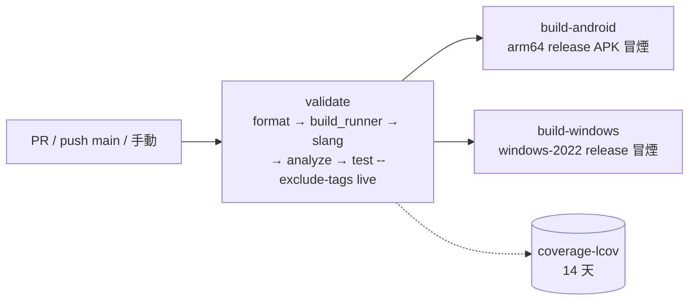
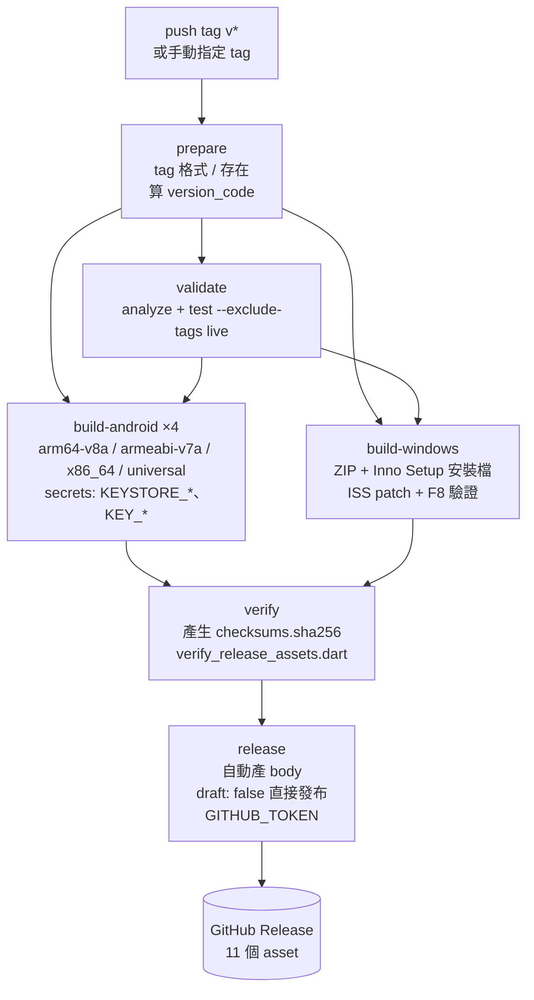
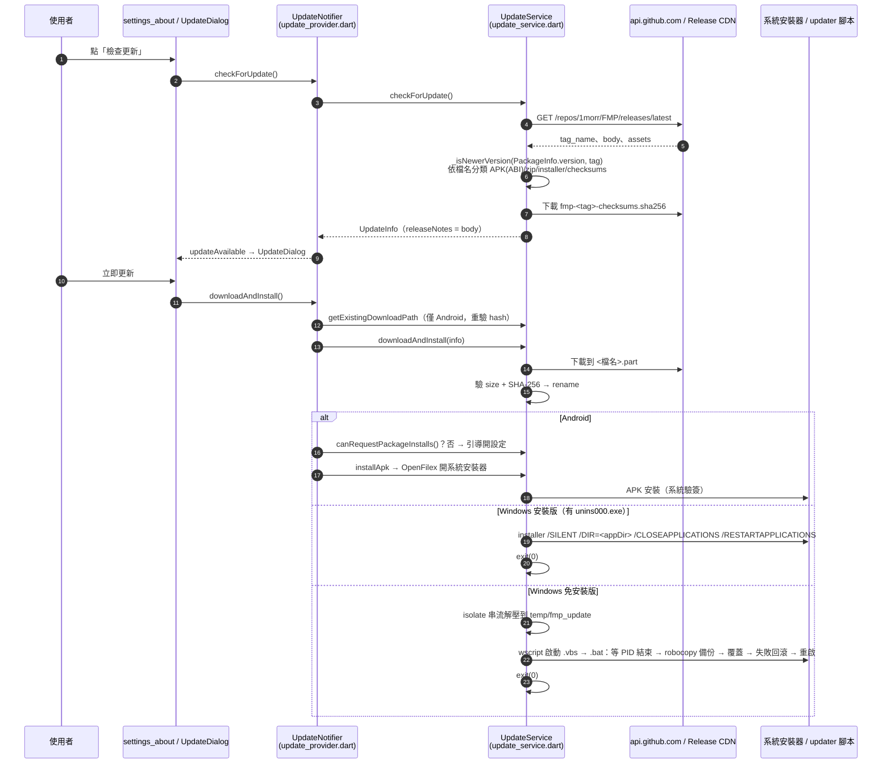

# FMP 工程面現況審計

> 現況描述，未經確認，不代表目標。

- 審計時間：2026-09-26；分支 `docs/audit`，HEAD `6d78fe23`（`git log -1`）。
- 本機環境：Windows 11、Flutter 3.47.1 stable（與 CI 釘的版本相同，`.github/workflows/ci.yml:28`）。
- 規模：`lib/` 手寫 Dart 343 檔 99,063 行（另有生成碼 `*.g.dart` 46,089 行）；`test/` 261 檔 63,927 行；`tool/` 7 檔 2,373 行。`lib/` 各層：`ui` 38,959、`services` 33,042、`data` 15,054、`providers` 7,640、`core` 3,755 行。最大單檔 `lib/services/audio/audio_provider.dart` 2,953 行。
- commit 總數 1,877（`git rev-list --count HEAD`）。
- 證據標示：`檔案:行號`、命令輸出。「**不一致**」＝兩處說法（或文件與程式碼）對不上；「**推測**」＝沒有直接證據；「查不到」＝找過，沒找到。

---

## 1. CI／發版

### 1.1 `ci.yml`

| 項目 | 內容 | 證據 |
|---|---|---|
| 觸發 | PR 到 `main`、push 到 `main`、手動 `workflow_dispatch`。沒有路徑過濾（註解說明是刻意的：純文字 commit 也要跑 `validate`）。 | `ci.yml:3-15` |
| 權限 | `contents: read` | `ci.yml:17-18` |
| 併發 | PR 以 ref 分組（新 push 取消舊 run），`main` 與手動以 SHA 分組 | `ci.yml:23-25` |
| Action 版本 | 全部以 commit SHA 釘住（checkout、flutter-action、setup-java、upload-artifact） | `ci.yml:40,48,98` |
| secrets | 無 | 全檔 |

| job | runner | 做什麼 | 產物 |
|---|---|---|---|
| `validate`（Analyze and Test，15 分鐘上限） | ubuntu-latest | `fetch-depth: 0`（`pubspec_version_test` 要讀 tag）→ `flutter pub get` → `dart format --set-exit-if-changed lib test tool`（在 codegen 之前）→ `build_runner build` → `slang` → `flutter analyze` → `flutter test --coverage --exclude-tags live` | `coverage-lcov`（`coverage/lcov.info`，保留 14 天） |
| `build-android`（needs validate） | ubuntu-latest | Java 17 → codegen → `flutter build apk --release --target-platform android-arm64` | 無上傳（只是建置冒煙）；沒有 `key.properties` 時 gradle 退回 debug 簽名（`android/app/build.gradle.kts:47-50`） |
| `build-windows`（needs validate） | windows-2022 | codegen → `flutter build windows --release` | 無上傳 |

`ci.yml:61-77`、`ci.yml:87-155`。

**CI 近況**（`gh run list`）：HEAD `6d78fe23`（PR #172 的 merge commit）在 `main` 上的 CI **失敗**：`test/data/repositories/account_repository_test.dart` 的 `watchByPlatform emits the current row and then every change` 期望 `null` 拿到 `'first'`（run 36239727409，`1847 tests passed, 1 failed, 1 skipped`）。同一個 PR 分支的 CI 是綠的，本機全量也通過（見 §2.3），屬時序相依的 flaky 測試，見 §12。

### 1.2 `release.yml`

| 項目 | 內容 | 證據 |
|---|---|---|
| 觸發 | push `v*` tag；或手動輸入一個已存在的 `vX.Y.Z` tag | `release.yml:3-12` |
| 權限 | workflow 預設 `contents: read`；只有 `release` job 拿 `contents: write` | `release.yml:14-15,425-426` |
| 併發 | 同 ref 排隊、不取消 | `release.yml:17-19` |
| secrets | `KEYSTORE_BASE64`、`KEYSTORE_PASSWORD`、`KEY_PASSWORD`、`KEY_ALIAS`（`build-android` 解出 `android/release.keystore` 與 `android/key.properties`，缺任一個就 `exit 1`）；`GITHUB_TOKEN`（`release` job 建 Release） | `release.yml:117-141,520` |

| job | needs | 做什麼 | 產物 |
|---|---|---|---|
| `prepare` | — | 檢查 tag 格式 `^v\d+\.\d+\.\d+$` 且存在；算 `version_code = major*1000000 + minor*1000 + patch` | outputs：tag、version、version_code、version_with_code |
| `validate` | prepare | checkout tag → codegen → `flutter analyze` → `flutter test --exclude-tags live`。**沒有** `dart format` 檢查，也沒有 `--coverage`（與 ci.yml 不同） | 無 |
| `build-android`（matrix 4 格） | prepare, validate | 用 sed 把 `pubspec.yaml` 的 `version:` 改成 tag 版本 → 解 keystore → codegen → `flutter build apk --release [--target-platform]` → 改名 `fmp-<tag>-android-<abi>.apk`；arm64-v8a 與 universal 另複製 `fmp-latest-android-<abi>.apk` | `android-apk-<abi>`（30 天） |
| `build-windows` | prepare, validate | pwsh 改寫版本 → codegen → `flutter build windows --release` → 把 `LICENSE`、`THIRD_PARTY_LICENSES.md`、`licenses/` 放到 exe 旁 → 壓 `fmp-<tag>-windows.zip` 與 `fmp-latest-windows.zip` → choco 裝 Inno Setup → `inno_bundle:build` 產 ISS → regex 改寫 ISS（刪 icelandic、加 `DefaultGroupName`、`AppUserModelID`、移除 `skipifsilent`）→ 驗證改寫生效（F8 gate）→ ISCC 編譯 → `fmp-<tag>-windows-installer.exe` + `fmp-latest-windows-installer.exe` | `windows-exe`、`windows-installer`（30 天） |
| `verify` | prepare, build-android, build-windows | checkout **workflow 的 ref**（刻意不 checkout tag，註解 `release.yml:368`）→ 下載全部 artifact 合併 → 產生 `fmp-<tag>-checksums.sha256`（只含版本化檔）→ `AAPT2=… dart run tool/release/verify_release_assets.dart` | `release-assets`（30 天） |
| `release` | prepare, verify | 下載 `release-assets` → 找前一個 tag → 從 commit 範圍依 Conventional Commits 前綴（feat/fix/perf/deps）產 release body → `softprops/action-gh-release` 以 `draft: false` 直接發布 | GitHub Release（11 個 asset） |

`release.yml:27-520`。

Release 最近五次（`gh run list --workflow release.yml`）：v1.11.0 成功、v1.10.2 一次失敗後重跑成功、v1.10.1、v1.10.0 成功。

### 1.3 `tool/release/verify_release_assets.dart`

唯一的 release 工具（211 行）。`verify` job 呼叫它（`release.yml:401-409`）。檢查：

1. 檔案集合必須**剛好**等於 `expectedAssets(tag)`：6 個版本化檔（4 APK、zip、installer）＋ 4 個 `fmp-latest-*` 別名 ＋ checksums，共 11 個；缺一個或多一個都報錯（`verify_release_assets.dart:18-41,56-65`）。
2. checksums manifest 每行格式、涵蓋全部 6 個版本化檔、不含別名、hash 相符（`:75-104`）。
3. 每個 `fmp-latest-*` 與同後綴版本化檔逐位元相同（`:109-119`；理由是 App 內更新可能下載別名、卻用版本化檔名查 hash）。
4. 以 `aapt2 dump badging` 讀每個 APK 的 versionName／versionCode 對 tag（`:122-141,168-176,195-199`）。
5. Windows 安裝檔的 `MZ` + `PE\0\0` 簽章（`:143-165`；截斷的檔案擋不下，註解自承）。

由 `test/workflows/release_assets_verification_test.dart` 以假產物測每一項會紅（該檔 13 個 `test(` 呼叫點，其中一個在迴圈裡展開成 3 個，執行時 15 個）（核查更正：原寫「該檔 12 個 test」）。

### 1.4 自動更新：新版怎麼到使用者手上

**入口只有手動**：設定 → 關於 → 檢查更新（`lib/ui/pages/settings/widgets/settings_about.dart:70`）。App 啟動時不檢查，只在 Windows 上清理上一次更新的殘留檔（`lib/main.dart:231` → `UpdateService.cleanupOldWindowsUpdateFiles`，`update_service.dart:259-292`）。`docs/build-and-release.md:327-329` 的說法與程式碼一致。

證據：

- 查詢：`update_service.dart:389-420`（`releases/latest`、版本比較 `:689-708` 只比三段數字）；release body 成為對話框內容 `:472,483`。
- 資產分類：`abiPattern = fmp-.+-android-(.+)\.apk$`，別名與版本化檔落在同一格，誰排在 assets 清單後面誰贏（`:432-465`）。安裝版判定＝exe 旁有 `unins000.exe`（`:54-57`）。Android ABI 由 `getprop ro.product.cpu.abi` 取得，找不到對應 ABI 退回 `universal`（`:64-68,155-171`）。
- 完整性：有 manifest 時缺 hash 直接拋 `UpdateIntegrityException`；沒有 manifest（舊 release）只驗 size（`:777-782`）。下載先寫 `.part`，驗完才 rename（`:714-753`）；驗證 `:800-828`。
- Android 安裝權限：`update_provider.dart:183-193`；`installApk` `update_service.dart:248-254`。
- Windows：installer 參數 `:613-618`；portable 的 `.bat` 內容 `:830-878`（`robocopy /MIR` 備份、`if errorlevel 8 goto rollback`）；解壓走 isolate 串流 `:656,880`。
- 信任鏈觀察：SHA-256 manifest 與產物來自同一個 GitHub Release，擋得住傳輸損毀，擋不住 Release 本身被替換；Windows 產物沒有 code signing（`release.yml` 無 `signtool`，grep 無結果）；Android 由系統以同一把 keystore 驗簽。Release 發布前沒有人工閘門（ADR 0006）。

---

## 2. 測試盤點

### 2.1 按目錄統計

腳本：以正則 `(?<![\w.])(test|testWidgets)\s*\(` 數呼叫點（scratchpad `count_tests.py`）。此數字是**原始碼中的呼叫點**，參數化迴圈與合成字串會讓它與執行時的 test 數不同（執行時 1,849，見 §2.3）。

| 目錄 | .dart 檔 | `*_test.dart` | test/testWidgets 呼叫點 |
|---|---:|---:|---:|
| `test/`（根，`app_content_wrapper_test`、`bilibili_source_test`） | 2 | 2 | 24 |
| `test/core/**` | 14 | 14 | 121 |
| `test/data/**`（models 36、repositories 67、sources 159、static_rules 18） | 30 | 30 | 280 |
| `test/providers/**` | 28 | 28 | 172 |
| `test/services/**`（audio 35 檔 449、download 90、lyrics 88、account 51…） | 85 | 85 | 858 |
| `test/support/**`（含 `fakes/` 7 檔） | 25 | 12 | 69 |
| `test/ui/**`（widgets 121、pages 63…） | 68 | 68 | 266 |
| `test/workflows/` | 4 | 4 | 31 |
| `test/live/` | 1 | 1 | 3 |
| `test/manual/` | 2（另有 README.md） | 0 | 1 |
| `test/performance/` | 2 | 0 | 13 |
| **合計** | **261** | **244** | **1,838** |

### 2.2 分類

| 類別 | 範圍 | 數量 |
|---|---|---|
| 不聯網（預設） | 244 個 `*_test.dart` 扣掉下面的 live 部分 | 本機執行 1,849 個 test |
| 聯網（`live` tag） | `test/live/sources_live_test.dart`（檔案級 `@Tags(['live'])`，3 個）＋ `test/bilibili_source_test.dart:869-902`（單一 test `tags: 'live'`） | 4 個 test |
| 手動探針 | `test/manual/pathological_stream_servers.dart`（兩個故意壞掉的本機 HTTP 音訊伺服器）、`test/manual/real_db_probe.dart`（`FMP_PROBE_DB_DIR` 指向資料庫副本時傾印列數與 schema） | 2 檔，不叫 `*_test.dart`，預設 sweep 不會跑 |
| benchmark | `test/performance/startup_benchmark.dart`、`list_scrolling_benchmark.dart` | 2 檔 13 個 test，不叫 `*_test.dart` |
| 測 CI 設定 | `test/workflows/`：`release_workflow_test`、`release_assets_verification_test`、`pubspec_version_test`、`dependabot_group_static_rule_test` | 4 檔 31 個 |
| static-rule（讀 `lib/` 或設定檔原始碼） | 25 個 `*_static_rule_test.dart`（見 §5） | 144 個 |

各類舉例（價值判斷只描述它斷言的是什麼）：

- **不聯網、測行為**
  - `test/services/audio/backend_contract_test.dart`：測抽出來的純規則（live edge seek、end reason 分類），輸入輸出式斷言。
  - `test/providers/database_migration_test.dart`：在 temp 目錄開真的 Isar 跑遷移（`test/support/isar_test_harness.dart`，59 個測試檔用它）。
  - `test/data/models/track_key_test.dart`：用寫死字串釘住持久化鍵格式（ADR 0005 引用它）。
  - `test/workflows/release_assets_verification_test.dart`：用假產物證明 verify 工具每一項都會紅。
- **不聯網、偏實作細節**
  - `test/services/download/download_service_progress_and_disposal_test.dart`：44 處使用 `debug*ForTesting` 掛鉤（如 `debugStartDownloadForTesting` 29 處），連同 `debugPendingProgressCount`（`:98,139,165,179`）、`debugActiveDownloads` 等其他 `debug*` 成員共 75 處（核查更正：原寫「45 處使用 `debug*ForTesting` 掛鉤（如 `debugPendingProgressCount`）」；後者不帶 `ForTesting` 後綴），斷言內部緩衝與 timer 狀態，而非對外行為。
  - `test/workflows/release_workflow_test.dart:65-124`：一半是解析 YAML 比 `needs` 關係（結構性），另一半是 `expect(workflow, contains('…'))` 比對 shell 片段字串（例如 `contains(r'version_code=$((major * 1000000')`、`contains(r'if [ "$matched" = 0 ]')`）。
  - `test/support/audio_provider_size_static_rule_test.dart`：斷言 `audio_provider.dart` 程式碼行數 ≤ 2,184（`:59`），與行為無關，是刻意的成長閘門。
- **聯網**：`test/live/sources_live_test.dart` 搜尋三個音源並對解析出的串流 URL 發 `Range: bytes=0-2047` 請求（`:28-40`），驗的是上游沒壞，不是 FMP 的邏輯。
- **手動探針**：`pathological_stream_servers.dart` 頭註記錄 mpv／ExoPlayer 對「連上但零位元組」「播到一半斷線」的實測秒數（`:17-26`），沒有自動斷言。
- **benchmark**：斷言的是寬鬆的絕對毫秒上限（例如 `lessThan(5000)`，`list_scrolling_benchmark.dart:58,96,147`），見 §4。

### 2.3 全量執行：`flutter test --exclude-tags live`

先跑 `dart run build_runner build --delete-conflicting-outputs` + `dart run slang`（合計 2 分 28 秒）。

| 指標 | 結果 |
|---|---|
| 通過 | **1,849** |
| 失敗 | **0** |
| 略過 | 0（`backup_service_test.dart:405` 的 Windows-only 測試在本機 Windows 上會跑；CI 的 Linux 上略過 1 個） |
| 總耗時 | wall clock 2 分 48 秒（runner 自報 `02:23`） |
| 輸出末行 | `02:23 +1849: All tests passed!` |

同場另跑：`flutter analyze` → `No issues found! (ran in 229.6s)`；`dart format --output=none --set-exit-if-changed lib test tool` → `Formatted 626 files (0 changed)`。

CI 上 HEAD 失敗的那一個（`account_repository_test.dart:105-118`）本機這次通過。該測試 `listen` 之後立刻連續 `upsert` 兩次、再固定 `Future.delayed(200ms)`，斷言第一個事件是 `null`（fireImmediately 的空值）；若第一次 upsert 在初始事件送達前完成，就拿到 `'first'`。

---

## 3. 會打真實 API 的地方

| 位置 | 連誰 | 誰會跑它 |
|---|---|---|
| `test/live/sources_live_test.dart` | Bilibili、YouTube（youtube_explode）、NetEase 搜尋與串流 | 手動；CI 用 `--exclude-tags live` 排除（`ci.yml:77`、`release.yml:214`） |
| `test/bilibili_source_test.dart:869-902` | `api.bilibili.com`（用 `setUp` 裡的預設 `BilibiliSource()`，`:32`） | 同上（`tags: 'live'`，`:902`） |
| `tool/demo/*.dart`（6 支） | `bilibili_info_demo`：api.bilibili.com、api.live.bilibili.com；`bilibili_live_api_demo`／`_lookup_demo`：直播 API；`lyrics_matching_demo`：lrclib.net；`netease_lyrics_demo`：music.163.com；`qq_music_lyrics_demo`：c.y.qq.com、u.y.qq.com | 手動 `dart run`；CI 只 analyze／format，不執行（AGENTS.md「Verification」段） |
| `test/manual/` | 不連外：`pathological_stream_servers` 綁本機 port；`real_db_probe` 讀本機資料庫副本 | 手動 |
| `.claude/skills/verify-on-device` | 在模擬器或 Windows 上 `flutter run` 真 App，UI 操作（搜尋、播放）會打真實音源 API | agent 依 AGENTS.md 對使用者可見改動強制執行（`SKILL.md` §2-4） |
| App 本身的 update 檢查 | api.github.com | 使用者手動 |

**本機直接跑 `flutter test`（不加參數）會不會聯網：會。**

推論依據：

1. `flutter test` 不帶路徑時跑 `test/` 下所有 `*_test.dart`，`test/live/sources_live_test.dart` 在其中。
2. `dart_test.yaml` 只有 `tags: live:`，沒有 `skip:`、沒有 preset（全檔 9 行，註解明說宣告它是為了「stops warning about an unknown tag」）。依 package:test 的設定文件（context7 `/dart-lang/test` configuration.md），tag 只宣告時不影響是否執行；要預設略過必須寫 `skip: "..."`。
3. 上述 4 個 live test 都沒有 `skip:` 參數（`grep -rn "skip:" test` 只命中 `backup_service_test.dart:405`）。
4. 因此不加參數會對 Bilibili／YouTube／NetEase 發真實請求；其中 bilibili 那個在風控碼時會 `rethrow` 變紅（`bilibili_source_test.dart:899-901` 的註解自承）。

其餘預設測試是否還有漏網的連網：`test/support/live_source_tag_static_rule_test.dart` 以「測試檔中以預設建構子建立 9 種音源類別之一」為判準要求標 `live` 或列例外（6 個例外檔，`:57-76`）。它是**檔案層級**判斷：只要檔內任一處出現 live tag 整檔就算合規（`:87`），所以 `bilibili_source_test.dart` 其餘非 live 的 test 也會通過它，它們目前都注入了 fake（`:37,83,122…917` 皆為 `BilibiliSource(` 帶參數）。規則檔頭宣稱 2026-09-23 曾用 interceptor 量過例外清單的檔案沒有打到真實主機（`:17-20`）——本審計沒有重做此量測（**推測**預設 sweep 不再有其他連網點）。

---

## 4. 效能基準

| 工具 | 測什麼 | 能否離線 |
|---|---|---|
| `test/performance/startup_benchmark.dart` | 建 1,000 個 `Track`、`DownloadScanner.extractDisplayName` 5 萬次、DateTime 與字串操作、1 萬次 `Directory.exists`、path 操作。**不啟動 App**，量的是純 Dart 迴圈 | 可以 |
| `test/performance/list_scrolling_benchmark.dart` | 用 Flutter 內建 `ListView` + `ListTile` 渲染 100／500 列、1,000 列捲動、重建、1 萬筆過濾排序、5,000 筆搜尋。只 import `flutter/material`、`flutter_test` 與 `Track` 模型，**不用 FMP 自己的 widget** | 可以（`thumbnailUrl` 是 example.com 字串，沒有被載入） |

兩支都以絕對毫秒上限斷言（例如 `lessThan(5000)`），並刻意不叫 `*_test.dart`（`startup_benchmark.dart:6-13` 說明：絕對時間量的是機器）。

本機實跑（`flutter test test/performance/startup_benchmark.dart test/performance/list_scrolling_benchmark.dart`，13 個全過）：

| 項目 | 數字 |
|---|---|
| 建 1,000 個 Track | 7 ms |
| extractDisplayName ×50,000 | 6 ms |
| 300,000 次日期操作 | 39 ms |
| 2,000,000 次字串操作 | 392 ms |
| 10,000 次 `Directory.exists` | 1,079 ms |
| 200,000 次 path 操作 | 77 ms |
| 首次渲染 100 列 | 468 ms（含首次 widget 測試暖機） |
| 首次渲染 500 列 | 74 ms |
| 1,000 列捲動 10 次 | 376 ms（37.6 ms／次） |
| 複雜列 100 個 | 130 ms |
| 100 次重建 | 812 ms（8.12 ms／次） |
| 10,000 筆過濾＋排序 | 21 ms |
| 5,000 筆 × 500 次搜尋 | 663 ms |

**實機量測（啟動時間、記憶體、App 內長列表捲動）見 `perf-baseline.md`**，它是重寫後的比較基準。摘要（profile build，3 次中位數）：冷啟動到首幀 Android 1,239 ms／Windows 1,731 ms；首頁穩定後記憶體 Android PSS ≈179 MB／Windows Working Set ≈300 MB、Private ≈441 MB；長列表捲動 UI thread 每幀中位數 Android 1.00 ms／Windows 0.45 ms。上面兩支 benchmark 不用 FMP 自己的 widget，不適合當重寫後的比較基準。

其他現有工具：`docs/development.md` § 執行期除錯（VM Service，`:91` 起）可讀 live 物件、HTTP、Isar；`lib/` 內只有 `audio_stream_manager.dart`、`stream_resolution_service.dart` 用 `Stopwatch`。沒有啟動時間或記憶體的自動化量測腳本（查不到）。

---

## 5. static-rule 測試

共 25 檔、144 個 test。全部以**正則比對原始碼文字**（去註解用 `test/support/dart_source.dart:12` 的 `stripDartComments`），沒有任何一支用 `package:analyzer` 的 AST（`git grep "package:analyzer" -- test` 無結果）。「只斷言字串存在」一欄指是否只檢查某字串出現／不出現；多數比的是集合或計次。

| 檔案 | 守什麼 | 清單（長度） | 只斷言字串存在？ | 變異測試 |
|---|---|---|---|---|
| `core/static_rules/core_source_…` | `main.dart` 在第一個 `runApp(ProviderScope(` 前呼叫 `registerThirdPartyLicenses()` | 無 | 是（順序比對） | 違規、註解 |
| `data/static_rules/isar_boundary_…` | `isar.`／`_isar.` 只在 `lib/data/repositories/` | 前綴 1、豁免檔 2 | 否（逐行掃描） | 違規、斷行、import、靜態成員、註解 |
| `data/static_rules/source_ownership_…` | 具體音源 adapter 只經 `SourceManager` 取用，不 re-export | 已記錄的直接 import 2 | 否 | 違規、改寫、註解 |
| `providers/static_rules/riverpod3_…` | 副作用 provider 錨在 `FMPApp.build`；不 import legacy barrel；Equatable `props` 列全欄位 | 錨定 provider 14 | 否（watch 集合） | 移動、斷行、註解 |
| `services/static_rules/audio_backend_shared_rules_…` | 兩後端與 fake 都轉呼叫共用規則；不留第二份關鍵字表；log 走 `redactStreamUrl` | 關鍵字 26、共用單元 4、委派 3 | 否 | 複製關鍵字、漏呼叫、斷行 |
| `services/static_rules/audio_seam_…` | `PlayerState`／`QueueState` 無共用欄位；`PlaybackRequestStreamAccess` 成員；寬 `SourceAuthContext` 只准兩處 | 寬型別擁有者 2 | 否（解析宣告比集合） | 重疊欄位、改名 |
| `services/static_rules/lyrics_window_strings_…` | 歌詞子視窗讀的每個字串 key 都有被推送 | 無 | 否（key 集合） | 寫法變化、註解 |
| `services/static_rules/playback_event_routing_…` | 只有 `playback_event_router.dart` 能 pattern-match `PlaybackEndReason` | 變體清單 7（被守對象） | 否 | 違規、改名、建構不算、註解 |
| `services/static_rules/settings_backup_coverage_…` | `Settings` 每個持久化欄位（讀生成的 `settings.g.dart`）都進備份匯出＋匯入 | 刻意排除 10 | 否 | 新欄位、單向、斷行、過期排除 |
| `support/android_manifest_…` | `<application android:allowBackup="false">` | 無 | 是（XML 屬性值） | 翻轉、刪除、註解、順序 |
| `support/audio_provider_size_…` | `audio_provider.dart` 程式碼行 ≤ 2,184（slack 50） | 無 | 否（行數） | 超過／縮太多、註解不計 |
| `support/call_site_ownership_…` | 直播 API、UI 用 source manager、UI 直接叫 source、自訂標題列、歌單失效，各自只准指定檔案 | 擁有權表 5 列 | 否（集合相等） | 越界、斷行、註解 |
| `support/layer_boundary_…` | `lib/core`、`lib/data` 不 import 上層；feature 間新 import 邊要登記 | 下層例外 1、已知 feature 邊 33 | 否（import 圖） | 違規、引號、同 feature |
| `support/live_source_tag_…` | 以預設建構子建真音源的測試檔要標 `live` | 守的類別 9、例外檔 6 | 部分（檔案層級，見 §3） | 每個類別合成違規、注入不算 |
| `support/outbound_hosts_…` | `lib/` 寫死的主機都要登記用途；DNS lookup 目標登記 | 主機 23、DNS 1 | 否（集合相等） | 新主機、改名重排 |
| `support/periodic_timer_…` | 每個 `Timer.periodic`／`Stream.periodic` 登記需求來源與可否關閉 | 9 檔 | 否（每檔計次） | 未登記、改名重排 |
| `support/source_branch_points_…` | `lib/data/sources/` 外依音源 id 分支的預算（只准減少） | 5 檔 | 否（計次等號） | 比較、switch、查表不算 |
| `support/source_http_policy_…` | 音源客戶端都走 `SourceHttpPolicy`；header 字面值只准指定檔 | 工廠檔 2、header 擁有者 10 | 否 | 合成違規、錯音源、斷行 |
| `support/static_rule_placement_…` | 讀 `lib/` 原始碼的測試必須叫 `*_static_rule_test.dart` 並放在 `test/support/` 或 `test/<層>/static_rules/` | 宣稱無例外 | 否 | 合成違規、temp 路徑、i18n JSON 不算 |
| `support/wait_convention_…` | 只有 3 個檔可直接呼叫 `pumpEventQueue` | 3 | 是（識別符出現） | 空格、tear-off、註解 |
| `ui/static_rules/error_presentation_…` | async error 分支不渲染空白；i18n 錯誤模板不填 raw exception；raw exception 不進使用者 widget | 無 | 否（樣式集合） | 合成違規、註解 |
| `ui/static_rules/slider_overlay_…` | Slider 只經 `ScopedSlider` | 1（ScopedSlider 本身） | 否（集合） | 各種寫法、相似名 |
| `ui/static_rules/ui_consistency_…` | 低階圖片 API 只在 `lib/ui/widgets/images/` 的 5 個語意 widget；ListTile leading 不直接用 Row | 5 | 否 | 合成違規、註解 |
| `ui/static_rules/watch_scope_…` | 5 個寬 provider 禁止整包 `ref.watch` | 5（被守對象） | 否（集合） | 格式、select／notifier 不算 |
| `workflows/dependabot_group_…` | 0.x 直接依賴都被排除在 minor-and-patch 群組外；`flutter_secure_storage` major 被 ignore | 無（讀 `pubspec.yaml`、`.github/dependabot.yml`） | 否（自寫 YAML 解析） | 解析器邊界 |

觀察：

- 每一檔都有合成違規的 test，多數也有「無關改寫不紅」的 test（對應使用者全域規則的雙向變異驗證）。`core_source`、`ui_consistency`、`error_presentation` 只測了「註解不算」，沒有測改名／斷行。
- `wait_convention` 只擋直接呼叫 `pumpEventQueue`；`Future.delayed` 固定等待不在範圍（`.trellis/spec/testing/index.md` 自承），CI 失敗的 `account_repository_test` 正是 `Future.delayed(200ms)`。

---

## 6. 依賴健康度

### 6.1 `dart pub outdated`（2026-09-26）

- 直接依賴 40 個（另 `flutter`、`flutter_localizations` SDK），dev 依賴 8 個（另 `flutter_test`）。
- **沒有** `dependency_overrides`、**沒有** git 依賴、**沒有** path 依賴（`pubspec.yaml` 全檔）。`intl: any`（`pubspec.yaml:83`，註解說交給 `flutter_localizations` 決定）。
- 摘要：61 個依賴被 lock 在較舊版本（可 `pub upgrade`）；3 個被 pubspec 約束擋住更新到可解析版本。

| 直接依賴落後 | 現用 | 可升（相容） | 可解析 | 最新 | 備註 |
|---|---|---|---|---|---|
| archive | 4.2.0 | 4.3.0 | 4.3.0 | 4.3.0 | |
| audio_service | 0.18.18 | 0.18.19 | 同 | 同 | |
| cached_network_image | 4.0.0 | 4.0.2 | 同 | 同 | |
| equatable | 2.1.0 | — | 3.0.0 | 3.0.0 | major |
| file_picker | 11.0.3 | — | — | 13.1.0 | 解析不到 |
| flutter_cache_manager | 3.4.2 | 3.4.5 | 同 | 同 | |
| flutter_secure_storage | 10.3.1 | 10.3.4 | 10.3.4 | 11.2.0 | 刻意停在 10.x（`pubspec.yaml:68-73`、dependabot ignore） |
| package_info_plus | 9.0.1 | — | — | 10.2.1 | 解析不到 |
| pointycastle | 3.9.1 | — | — | 4.0.0 | 解析不到 |
| tray_manager | 0.5.3 | — | 0.7.0 | 0.7.0 | 0.x 約束擋住 |
| window_manager | 0.4.3 | — | 0.5.2 | 0.5.2 | 0.x 約束擋住 |
| build_runner（dev） | 2.15.1 | — | — | 2.16.1 | 解析不到 |

### 6.2 棄用、fork、長期未發版

- **discontinued**：只有遞移依賴 `js 0.6.7`（被 `isar_community`、`audio_service`、`pointycastle` 依賴，`dart pub deps`）。直接依賴沒有 discontinued（pub.dev API 逐一查 `isDiscontinued`）。
- **社群 fork**：`isar_community` 3.3.2／`isar_community_flutter_libs` 3.3.2／`isar_community_generator` 3.3.2（fork 最近發版 2026-03-23）。上游 `isar` 在 pub.dev 最後發版是 4.0.0-dev.14（2023-08-21），穩定版 3.1.0+1（2023-04-25）；上游 `isar_generator` 3.1.0+1 要求 `analyzer >=4.6.0 <6.0.0`。
- **pub.dev 最新版發布已超過兩年**（以 2026-09 計）：`encrypt`（2023-09-18）、`scrollable_positioned_list`（2023-05-08）、`qr_flutter`（2023-05-14）、`reorderable_grid_view`（2023-11-20）、`media_kit_libs_windows_audio`（2023-09-27）。一年以上：`hotkey_manager`（2024-05）、`rxdart`（2024-06）、`flutter_inappwebview`（2024-10）。`media_kit` 1.2.6 為 2025-12-13。
- `THIRD_PARTY_LICENSES.md` 與 ADR 0003 記錄 Windows `libmpv-2.dll` 是 2023-09-24 的凍結快照（未獨立驗證 DLL 內容）。
- `docs/build-and-release.md:317` 記錄 `flutter_inappwebview_windows 0.6.0` 在 VS 2026 無法建置，所以 Windows runner 釘 `windows-2022`（`ci.yml:127`、`release.yml:219`）。

### 6.3 codegen

| 工具 | 產物 | 何時跑 |
|---|---|---|
| `build_runner` 2.15.1 + `isar_community_generator` 3.3.2 | 11 個 model 的 `part '*.g.dart'`（`lib/data/models/`，`@collection` 11 個） | CI 每個 job、`orca.yaml` setup、AGENTS.md 要求 pull／切分支後手動跑 |
| `slang` 4.19.2（獨立 CLI，設定在 `slang.yaml`，`lazy: false`） | `lib/i18n/strings*.g.dart` | 同上 |

沒有 `build.yaml`；沒有 riverpod_generator、freezed、json_serializable（`pubspec.yaml`、`git grep "@riverpod"` 皆無；`.trellis/spec/ui/index.md` 寫明「written by hand (no codegen, no freezed, no hooks)」）。`*.g.dart` 被 gitignore（`.gitignore:29`）。本機 build_runner + slang 共 2 分 28 秒。生成碼 46,089 行。

---

## 7. tool/、死代碼、重複邏輯

### 7.1 `tool/` 腳本

| 檔案 | 用途 | 狀態 |
|---|---|---|
| `tool/release/verify_release_assets.dart` | Release 產物檢查（§1.3） | CI 執行、有測試 |
| `tool/demo/bilibili_info_demo.dart` | 打 Bilibili 影片資訊 API | 手動；2026-09-10 建立後未改 |
| `tool/demo/bilibili_live_api_demo.dart` | 比較不同直播 API 取觀眾數 | 同上 |
| `tool/demo/bilibili_live_api_lookup_demo.dart` | 直播間 API 查詢（用 `package:http`，`pubspec.yaml:103-105`） | 同上 |
| `tool/demo/lyrics_matching_demo.dart` | 標題解析＋lrclib 匹配可行性 | 同上；**自帶一份 `RegexTitleParser`**（`:31`），不 import `lib/services/lyrics/title_parser.dart:43` |
| `tool/demo/netease_lyrics_demo.dart` | 網易歌詞 API | 同上 |
| `tool/demo/qq_music_lyrics_demo.dart` | QQ 音樂歌詞 API | 同上 |

6 支 demo 都不 import `package:fmp`，自己重寫 API 呼叫。

### 7.2 死代碼

方法（scratchpad `dead.py`、`dead2.py`）：

1. 檔案層級：從 `lib/main.dart` 沿 `import`／`export`／`part` 做可達性。**343 個手寫檔全部可達**，沒有孤兒檔案。
2. 成員層級：抓頂層 class／函式／變數、2 空白縮排的 public 方法與 getter（排除 `@override`、`build` 等），計算名稱在整個 `lib/`（去註解）出現次數；只出現 1 次（宣告本身）即列為候選，再數在 `test/`、`tool/` 的出現次數。同名成員會互相遮蔽（漏報），extension 會誤報（已人工剔除）。

結果：136 個候選；其中 84 個在 `test/`、`tool/` 也沒有引用，52 個只被測試引用（多數是刻意的 `*ForTesting` 掛鉤）。前 30 個（**候選，需人工確認**；已用 `git grep -nw` 抽驗前 13 個，確實只有宣告一處）：

| # | 位置 | 名稱 |
|---:|---|---|
| 1 | `lib/services/audio/audio_provider.dart:859` | `playPlaylist` |
| 2 | `lib/services/audio/audio_provider.dart:863` | `restoreMediaControlOwnership`（`git grep -nw` 另命中 `now_playing_publisher.dart:82` 的註解，描述電台過去的呼叫方式，不是呼叫點）（核查補註） |
| 3 | `lib/services/search/search_service.dart:165` | `searchMixed` |
| 4 | `lib/services/search/search_service.dart:214` | `getSearchSuggestions` |
| 5 | `lib/services/import/import_service.dart:544` | `autoRefreshAll` |
| 6 | `lib/services/library/auto_refresh_service.dart:130` | `checkNow` |
| 7 | `lib/data/repositories/queue_repository.dart:78` | `insertTrack` |
| 8 | `lib/data/repositories/queue_repository.dart:131` | `moveTrack` |
| 9 | `lib/data/repositories/queue_repository.dart:170` | `updateCurrentIndex` |
| 10 | `lib/data/repositories/queue_repository.dart:187` | `updateShuffleEnabled` |
| 11 | `lib/data/repositories/queue_repository.dart:194` | `updateLoopMode` |
| 12 | `lib/data/repositories/queue_repository.dart:229` | `unshuffle` |
| 13 | `lib/data/repositories/download_repository.dart:25` | `getTaskByTrackId` |
| 14 | `lib/data/repositories/download_repository.dart:30` | `getTaskByTrackIdAndPlaylist` |
| 15 | `lib/data/repositories/download_repository.dart:43` | `getTaskBySavePath` |
| 16 | `lib/data/repositories/download_repository.dart:108` | `getPendingTasks` |
| 17 | `lib/data/repositories/download_repository.dart:119` | `getDownloadingTasks` |
| 18 | `lib/data/repositories/download_repository.dart:152` | `deleteTasks` |
| 19 | `lib/data/repositories/download_repository.dart:157` | `deleteCompletedTasks` |
| 20 | `lib/data/repositories/download_repository.dart:222` | `updateTasksStatus` |
| 21 | `lib/data/repositories/play_history_repository.dart:92` | `getRecentHistory` |
| 22 | `lib/data/repositories/play_history_repository.dart:175` | `getHistoryByDateRange` |
| 23 | `lib/data/repositories/play_history_repository.dart:193` | `getHistoryBySource` |
| 24 | `lib/data/repositories/play_history_repository.dart:408` | `getHistoryGroupedByDate` |
| 25 | `lib/data/repositories/track_repository.dart:212` | `getDownloaded` |
| 26 | `lib/data/repositories/track_repository.dart:221` | `watchDownloaded` |
| 27 | `lib/data/repositories/track_repository.dart:325` | `markUnavailable` |
| 28 | `lib/data/repositories/track_repository.dart:335` | `updateAudioUrl` |
| 29 | `lib/providers/account/account_provider.dart:43,68,116` | `isBilibiliLoggedInProvider`／`isYouTubeLoggedInProvider`／`isNeteaseLoggedInProvider` |
| 30 | `lib/services/lyrics/netease_source.dart:247` | `searchAndGetLyrics` |

其餘無引用候選還包括：`radio_refresh_service.dart:260,276,282`（`refreshStation`／`addStationStatus`／`removeStation`）、`radio_controller.dart:780` `updateStation`、`windows_desktop_service.dart:365` `unregisterHotkeys`、`bilibili_favorites_service.dart:187` `batchRemoveFromFolder`、`queue_manager.dart:84,641` `setShuffleState`／`restoreOrder`、`download_path_sync_service.dart:313` `cleanupInvalidPaths`、`lrclib_source.dart:101` `getExact`、`theme_provider.dart:103` `toggleThemeMode`、`search_provider.dart:565` `setLiveRoomFilter`、`video_detail.dart:246-255` 三個 `formatted*Count` getter、`lyrics_cache_service.dart:365-380` 三個 getter（`fileUsagePercent`、`sizeUsagePercent` 兩個使用率，加上 `formattedMaxSize`）（核查更正：原寫「三個使用率 getter」）。

只被測試引用的例子：`play_history_repository.dart:55,244`（`getPlayCount`、`getPlayCountByKey`，各 7 處測試引用）、`bilibili_source.dart:1048` `getLiveRoomInfo`、`source_provider.dart:40,45`（`trackInfoSource`、`playlistParsingSource`）。

`flutter analyze` 無任何 issue（§2.3）：analyzer 不回報未使用的 public 成員，所以上面這些不會出現在 CI。

### 7.3 重複邏輯（最明顯的幾組）

1. **位元組格式化 6 份，輸出各不相同**
   - `lib/data/database/database_catalog.dart:751`（B／KB／MB／GB，GB 兩位小數）
   - `lib/ui/pages/settings/developer_options_page.dart:146` `_formatSize`（到 MB）與同檔 `:257` `_formatBytes`（到 GB）——同一檔兩份
   - `lib/ui/pages/settings/download_manager_page.dart:463`（到 MB）
   - `lib/ui/widgets/dialogs/update_dialog.dart:373`（KB 取整數）
   - `lib/ui/pages/settings/widgets/settings_cache.dart:54`（輸入是 `double mb`）
2. **InnerTube 文字抽取兩份，行為不同**：`lib/core/utils/innertube_utils.dart:23` `InnerTubeUtils.extractText`（`simpleText` 為空字串也回傳、runs 不 trim）；`lib/data/sources/youtube_source.dart:1229` 私有 `_extractText`（空 `simpleText` 跳過、runs 會 trim、空結果回 null）。`youtube_account_service.dart:497`、`youtube_playlist_service.dart:558` 轉呼叫前者。同一份 YouTube 回應在搜尋與帳號頁可能抽出不同字串（**推測**，未實測）。
3. **三個登入頁的 `_cleanupWebView`**：`bilibili_login_page.dart:106`、`netease_login_page.dart:106`、`youtube_login_page.dart:35`，結構相同只差網域。
4. **短網址解析三份**：`netease_source.dart:755`、`qq_music_playlist_source.dart:112`、`spotify_playlist_source.dart:83` 的 `_resolveShortUrl`，都包 `SourceUrlPolicy.resolveRedirects`，差在 host 清單與 HEAD 重試。
5. **`_formatDateTime` 三份**：`database_catalog.dart:760`、`create_playlist_dialog.dart:350`、`settings_backup.dart:295`。
6. **Release 資產命名在三處各寫一次**：`release.yml:160-171,275-280,344-350`、`tool/release/verify_release_assets.dart:18-41`、`lib/services/update/update_service.dart:93-103,432-465`。verify job 會擋 workflow 與工具的漂移；App 端的解析沒有被任何測試對著工具的清單比對（查不到）。
7. **`tool/demo/lyrics_matching_demo.dart:31` 的 `RegexTitleParser`** 是 `lib/services/lyrics/title_parser.dart:43` 的平行副本。

---

## 8. AI 指令檔

### 8.1 內容摘要

| 檔案／目錄 | git 追蹤 | 內容 |
|---|---|---|
| `AGENTS.md`（134 行） | 是 | 專案簡介；Agent skills（指向 `docs/agents/`）；Verification 表（6 列）；codegen 提醒；on-device 強制；註解用繁中；問先再改的範圍；Boundaries（無測試守的 4 條、有 static-rule 守的 6 條）；Trellis 段；最後是 Trellis 自動管理區塊 |
| `CONTEXT.md`（53 行） | 是 | 5 個認證／媒體交接術語（§11） |
| `docs/agents/`（3 檔） | 是 | mattpocock skills 的設定產物（§9） |
| `.claude/settings.json` | 是 | 3 組 hook：SessionStart（startup／clear／compact）跑 `session-start.py`；PreToolUse `Task`／`Agent` 跑 `inject-subagent-context.py`；UserPromptSubmit 跑 `inject-workflow-state.py` |
| `.claude/hooks/`（3 支 Python，949＋1,216＋488 行） | 是 | Trellis 生成：注入 session context、子代理 context（jsonl）、每輪 workflow-state breadcrumb |
| `.claude/agents/`（trellis-check／implement／research） | 是 | Trellis 子代理；check 與 implement 已客製成跑 AGENTS.md § Verification（`trellis-check.md:86`、`trellis-implement.md:82`） |
| `.claude/commands/trellis/`（continue、finish-work） | 是 | Trellis 指令 |
| `.claude/skills/`（9 個 trellis-* ＋ `verify-on-device`）（核查更正：原寫「10 個 trellis-*」；`git ls-files .claude/skills` 共 10 個目錄，含 verify-on-device） | 是 | Trellis 內建 skill；`verify-on-device`（149 行＋3 份 reference＋3 支 script）是唯一專案自有 skill |
| `.agents/skills/verify-on-device/` | **否**（`.gitignore:95` `/.agents/`） | 本機殘留的舊版 `SKILL.md`（399 行，2026-09-10），與追蹤中的 `.claude` 版（149 行）內容不同；`smtc_probe.ps1` 相同、`ax_flatten.py` 在工作區逐位元相同（`cmp` 無差異；兩份都是 CRLF，與 git blob 的 LF 差別來自 autocrlf）（核查更正：原寫「`ax_flatten.py` 只差行尾」） |
| `.trellis/workflow.md`（721 行） | 是 | Trellis 三階段流程（Plan／Execute／Finish）、task／spec／workspace 系統、commit 流程 |
| `.trellis/spec/`（6 層 20 檔 1,424 行） | 是 | data、services、ui、shared、testing、guides 各有 `index.md`（Guidelines 表、Pre-Development Checklist、Quality Check）；規則回指 AGENTS.md |
| `.trellis/agents/`（check.md、implement.md） | 是 | Trellis 通用版子代理定義（未客製） |
| `.trellis/config.yaml` | 是 | `session_auto_commit: false`、`max_journal_lines: 2000`、channel worker 上限 6 |
| `orca.yaml` | 是 | Orca worktree：共用 `.trellis/workspace`；`setupAgentStartupPolicy: wait-for-setup`；setup 跑 `pub get`、`build_runner`、`slang` |

### 8.2 重複與衝突

| 主題 | 出現位置 | 是否一致 |
|---|---|---|
| 驗證要跑哪些測試 | AGENTS.md § Verification；`.claude/agents/trellis-check.md:86`、`trellis-implement.md:82`；各 `.trellis/spec/*/index.md` Quality Check | 一致（後者都回指 AGENTS.md） |
| codegen 先跑 | AGENTS.md；`verify-on-device/SKILL.md` §2；`orca.yaml` setup；`.trellis/spec/data/index.md` | 一致 |
| on-device 驗證強制 | AGENTS.md；`verify-on-device/SKILL.md`；`spec/ui/index.md`、`spec/services/index.md`；`trellis-check.md:90`（子代理不能跑、須回報） | 一致 |
| 等待慣例的閘門範圍 | AGENTS.md「Test waits … a fixed pump count is flaky in both directions — `wait_convention_static_rule_test.dart`」 vs `.trellis/spec/testing/index.md`「Only a direct `pumpEventQueue` is gated; fixed runs of `Future.delayed(Duration.zero)` still appear」 | **不一致**：AGENTS.md 讀起來像整條慣例都有閘門，實際只擋 `pumpEventQueue`（§5） |
| live 測試排除 | `dart_test.yaml`、`ci.yml:73-77`、`release.yml:212-214`、AGENTS.md、`test/live` 檔頭、`spec/testing/test-conventions.md:24-29` | 一致；但都沒說不加參數的本機 `flutter test` 會連網（§3） |
| check 子代理定義 | `.claude/agents/trellis-check.md`（客製）、`.trellis/agents/check.md`（通用）、`.claude/skills/trellis-check/SKILL.md` | 重複 3 份，內容不同步 |
| commit／journal 流程 | `.trellis/workflow.md:604,647`（work → archive → **journal commit** 三段）、`.claude/commands/trellis/finish-work.md:64-66`（「This produces a `chore: record journal` commit」） vs `.trellis/config.yaml` `session_auto_commit: false`、AGENTS.md Trellis 段「Journals stay local」、`.gitignore` `/.trellis/workspace/` | **不一致**：`add_session.py:1089-1091` 在關閉時跳過 commit（核查更正行號：原寫 `:279`，那是 worktree 警告函式的同一判斷）；`git log --grep "record journal"` 0 筆 |
| push | `.trellis/workflow.md` 3.4「Never push to remote in this step」、「ask for one-shot confirmation」 vs 使用者全域 `~/.claude/CLAUDE.md`「我自己的 repo 直接做，不用問：push…」 | **不一致**（repo 層 vs 使用者層；repo 內無衝突） |
| 可重用 skill 的位置 | AGENTS.md Trellis 區塊「`.agents/skills/` — reusable Trellis skills；`.codex/agents/`」 vs 實際：`.agents/` 被 gitignore、只有一份過期的 verify-on-device；`.codex/` 不存在；Trellis skill 在 `.claude/skills/` | **不一致** |
| verify-on-device | `.claude/skills/verify-on-device/SKILL.md`（追蹤）vs `.agents/skills/verify-on-device/SKILL.md`（本機、較舊、較長） | **不一致**（兩份內容不同） |
| 文件語言 | `docs/README.md:21`（AGENTS.md、`docs/agents/`、`.trellis/spec/` 英文）；`docs/agents/domain.md:48-50`（ADR 繁中）；`issue-tracker.md` Language 段（issue 繁中） | 一致；與使用者全域「文檔偏好繁中，專案全英文時跟著走」相容 |
| 註解語言 | AGENTS.md Conventions；`spec/shared/index.md` | 一致 |
| Boundaries 無測試守的 4 條 | AGENTS.md | 程式碼現況符合：`audio_provider.dart` 宣告 provider 數 0；`Isar.open` 只在 `lib/data/database/database_provider.dart:92`；`lib/ui` 沒有引用 `FmpAudioService`／`audioServiceProvider`；`lib/services/search`、`lib/providers/search` 無 auth／設定過濾 |
| `.claude/` 追蹤範圍 | `docs/README.md:22` vs `.gitignore:82-90` | 一致（skills、agents、commands、hooks、settings.json 追蹤） |

---

## 9. mattpocock skills 殘留

殘留檔案：

- `docs/agents/domain.md`、`docs/agents/issue-tracker.md`、`docs/agents/triage-labels.md`：`docs/README.md:23` 說明是 `/setup-matt-pocock-skills` 的產出再加 FMP 修改。
- `AGENTS.md:7-14`「Agent skills」段：指向上面三檔。
- `CONTEXT.md`：domain-modeling skill 的慣例檔名（`docs/agents/domain.md:5-13`）。

內容上的模板殘留：

- `domain.md:13` 提到 `/domain-modeling`「reached via `/grill-with-docs` and `/improve-codebase-architecture`」；本 session 可用的 mattpocock skills 清單中沒有這兩個名字（有 `grilling`、`codebase-design`、`domain-modeling`）。
- `domain.md:47`（核查更正行號）的範例「_Contradicts ADR-0007 (event-sourced orders)_」；本 repo 的 ADR-0007 是「Isar 停在 v3」。
- `issue-tracker.md:25`（`/triage` 讀的旗標）、`:52-60`（`/wayfinder` 的 `wayfinder:map` 標籤與 sub-issue 流程）：`gh label list` 沒有任何 `wayfinder:*` 標籤。
- `triage-labels.md`：5 個角色標籤在 repo 中都存在（`gh label list`）；實際使用次數：`ready-for-agent` 10、`ready-for-human` 3、`needs-triage` 3、`needs-info` 0、`wontfix` 0（`gh issue list --state all`）。

`git grep` 引用位置（樣式：`docs/agents|CONTEXT\.md|mattpocock|/triage|wayfinder|grill-with-docs|domain-modeling|improve-codebase-architecture|ready-for-agent|ready-for-human|needs-triage|Agent skills`）：

| 位置 | 引用 |
|---|---|
| `AGENTS.md:7,10,12,13,14` | Agent skills 段 |
| `docs/README.md:21,23` | 語言分工、`docs/agents/` 來源 |
| `docs/agents/domain.md:5,9,13,19,30,39,41,52` | 自身 |
| `docs/agents/issue-tracker.md:25,52,54,55` | `/triage`、`/wayfinder` |
| `docs/agents/triage-labels.md:5,7,9,10` | 標籤表 |
| `.trellis/spec/data/index.md:9` | 指向 `CONTEXT.md` |
| `.trellis/spec/data/sources.md:81` | 同上 |
| `.trellis/spec/guides/cross-layer-thinking-guide.md:51` | 同上 |
| `.trellis/spec/services/download-and-auth.md:3,38` | 同上 |
| `.trellis/spec/services/index.md:8,24` | 同上 |

非 archive 共 30 行／10 檔，與上表逐列相符（核查更正：原寫「33 行／10 檔」；33 是加 `-i` 不分大小寫的結果，會多出 `.gitignore:83` 與兩份 `trellis-meta` skill 檔，共 13 檔）。`.trellis/tasks/archive/` 另計：8 行／3 檔（`00-bootstrap-guidelines/research/core-data.md`、`…/services.md`、`09-26-align-specs-with-code/research/spec-audit.md`）。未追蹤的 `.trellis/tasks/09-26-audit/prd.md`、`09-26-fmp-rewrite/prd.md` 也有命中（本審計任務本身，不計入）。

---

## 10. ADR 逐份比對

### 0001 每源設定收成清單、音源改用字串 id — **部分不一致**

決定：刪 `enum SourceType` 改 `SourceIds` 字串常數；六個每源欄位收成 `List<SourceSettingsEntry>`，舊欄位保留供 v1→v2 遷移讀。

| 主張 | 現況 | 證據 |
|---|---|---|
| `enum SourceType` 已刪 | 符合 | `git grep "enum SourceType" -- lib` 無結果 |
| `SourceIds` 為 `static const String` + `values` + `displayNameFor` | 符合 | `lib/data/models/source_ids.dart:16-18,24,30` |
| `sourceSettings` 清單與 `streamPriorityFor`／`useAuthForPlay`；`_putEntry` 重建整份 list | 符合 | `lib/data/models/settings.dart:318,700-709,724` |
| 六個舊欄位保留並標 `@Deprecated` | 符合（6 處） | `settings.dart:321,327,333,414,420,426` |
| `deprecated_member_use_from_same_package` 已開 | 符合 | `analysis_options.yaml:42` |
| `_fetchPlaylists` 對未知 id 拋錯 | 符合 | `account_playlists_sheet.dart:174-177` |
| `setUseAuthForPlay` 對未知 id 拋錯 | **不一致**：`Settings.setUseAuthForPlay` 呼叫 `_entryFor`，未知 id 會建一筆預設 entry 寫入，不拋錯；`AudioSettingsNotifier.setAuthForPlay` 也不拋。拋錯的版本在 `8ffa7d4f`（2026-09-03）被移除 | `settings.dart:685-694,727-728`；`audio_settings_provider.dart:303-320`；`git show 8ffa7d4f` 中 `-        throw ArgumentError.value(` |
| 19 個 switch 的未知 id 行為表 | 未逐列驗證 | — |

### 0002 Isar 只出現在 repository 層 — **一致**

決定：`isar.`／`_isar.` 只准在 `lib/data/repositories/`，豁免 `database_migration.dart`、`database_catalog.dart`，以 static rule 守。

| 主張 | 現況 | 證據 |
|---|---|---|
| 規則與 allowlist | 符合 | `isar_boundary_static_rule_test.dart:20-22`；全量測試通過 |
| 豁免檔的呼叫點數（ADR 寫 11／8） | 現況約 12／10（粗略 grep，去 `//` 註解） | 數字漂移，不影響規則 |
| `BackupRepository.writeImport` 單筆交易 | 存在 | `lib/data/repositories/backup_repository.dart:110` |
| `InTxn` 後綴方法 | 存在 | `playlist_mutation_repository.dart:301,630,661`；`lyrics_repository.dart:72` |
| 不加 `abstract Repository` 介面 | 符合 | `git grep "abstract.*class.*Repository" -- lib` 無結果 |

### 0003 保留兩個音訊後端 — **一致**

決定：Android `JustAudioService`、Windows `MediaKitAudioService`，共同判斷抽成純規則並由 static rule 釘住轉呼叫。

| 主張 | 現況 | 證據 |
|---|---|---|
| 依 `AudioRuntimePlatform` 選後端（android／ios → just_audio） | 符合 | `lib/providers/audio/audio_controller_provider.dart:26-31`；`lib/services/audio/audio_runtime_platform.dart:7-19` |
| 共用規則檔與契約測試 | 存在 | `playback_end_reason_rules.dart`、`live_edge_seek_policy.dart`、`next_media_plan.dart`；`test/services/audio/backend_contract_test.dart` |
| `classifyExoPlayerFailure`／`classifyMpvMessage` | 存在並被兩後端使用 | `playback_end_reason_rules.dart:41,84`；`just_audio_service.dart:334`；`media_kit_audio_service.dart:380` |
| Android 音訊焦點靠 `audio_session` | 符合 | `just_audio_service.dart:4,20,165` |
| `MediaKitAudioService` 可注入 `PlatformPlayer` | 符合 | `media_kit_audio_service.dart:39-43` |
| Linux／macOS 殘留分支 | 符合（`main.dart` 仍對它們呼叫 `MediaKit.ensureInitialized`；repo 無 `linux/`、`macos/`） | `lib/main.dart:202-204` |
| 小差異 | `audio_controller_provider.dart:25` 註解寫「Windows/Linux」 | — |

### 0004 Android 下載用所有檔案存取權與裸路徑 — **一致**

決定：知情接受 `MANAGE_EXTERNAL_STORAGE` + `dart:io` 路徑，不用 MediaStore／SAF（不上架商店）。

| 主張 | 現況 | 證據 |
|---|---|---|
| manifest 權限與 `maxSdkVersion` 32／29、`tools:ignore="ScopedStorage"` | 符合 | `AndroidManifest.xml:16-23` |
| `targetSdk = flutter.targetSdkVersion` | 符合 | `android/app/build.gradle.kts:31` |
| 自有 MethodChannel，不用 permission_handler | 符合 | `storage_permission_service.dart:22-26`；`MainActivity.kt:64,86`；pubspec 無 permission_handler |
| `selectDirectory` 用 `FilePicker.getDirectoryPath`、寫 `.fmp_test`、`hasConfiguredPath` | 符合 | `download_path_manager.dart:25,34,44,61` |
| `getDefaultBaseDir` Android 回 `Music/FMP` | 符合 | `download_path_utils.dart:181-187` |
| `PathAccessException` → `t.error.noPermission` | 符合 | `lib/core/errors/user_message.dart:85` |

### 0005 曲目識別鍵包含 cid — **一致**

決定：`uniqueKey` 有 cid 時為三段式，鍵字串是持久化格式；cid 回填時同交易改掛歌詞匹配。

| 主張 | 現況 | 證據 |
|---|---|---|
| `TrackKey.format`／`formatGroup` | 符合 | `lib/data/models/track_key.dart:19-23` |
| `sourcePageKey` 複合索引、`uniqueKey`、`groupKey` | 符合 | `track.dart:277-278,331,334` |
| 外鍵 unique index | 符合 | `lyrics_match.dart:14-15`；`lyrics_title_parse_cache.dart:9-10`；`play_history.dart:46-47` |
| `backfillCid` 同交易 relink；啟動時補救 | 符合 | `track_repository.dart:160-166`；`database_migration.dart:86-97`；`lyrics_repository.dart:72` |
| 解析時 `track.cid ??= streamResult.cid` 與 `_resolutionKey` | 符合 | `stream_resolution_service.dart:340,449,465` |
| `track_key_test.dart` 釘字面輸出 | 存在 | `test/data/models/track_key_test.dart` |

### 0006 Release 驗過產物就直接發布 — **一致**

決定：拿掉草稿，改由 `verify` job 檢查 4 項後 `draft: false` 發布。

| 主張 | 現況 | 證據 |
|---|---|---|
| `verify` job 與 `release` needs verify、`draft: false` | 符合 | `release.yml:361-363,419-421,514` |
| 11 個 asset（ADR「決策」段仍寫 10 個，「實作」段更正為 11） | 工具清單 6+4+1＝11 | `verify_release_assets.dart:18-41`；ADR 內部前後數字不同，由 ADR 自己的實作段說明 |
| 別名逐位元相同的額外檢查 | 符合 | `verify_release_assets.dart:109-119` |
| `release_workflow_test` 以 YAML 解析釘 job 關係 | 符合（另有字串比對段落，§2.2） | `release_workflow_test.dart:135-170` |
| `docs/build-and-release.md` 不再描述草稿 | 符合 | `docs/build-and-release.md:156` |
| README 的 arm64 連結指向 `fmp-latest-android-arm64-v8a.apk` | 符合 | `README.md:23`、`README.zh-Hant.md:21` |

### 0007 Isar 停在 v3，改用 isar_community — **部分不一致**

決定：保留 v3 磁碟格式，依賴換成 `isar_community`，不升 v4。

| 主張 | 現況 | 證據 |
|---|---|---|
| 依賴為 `isar_community` 3.x | 符合（3.3.2） | `pubspec.yaml:18-19,95`；`pubspec.lock` |
| analyzer 10.x、build 4.x、Riverpod 3 | 符合（analyzer 10.2.0、build 4.0.7、flutter_riverpod 3.4.3） | `dart pub outdated` |
| 11 個 collection | 符合 | `git grep "^@collection" -- lib/data/models` 共 11 |
| Windows 子視窗 plugin 標頭改到 `isar_community_flutter_libs` | 符合 | `windows/runner/flutter_window.cpp:8`；`windows/flutter/generated_plugins.cmake:10` |
| 上游 generator 限制 `analyzer <6.0.0` | 符合 | pub.dev `isar_generator` 3.1.0+1：`>=4.6.0 <6.0.0` |
| 「上游 `isar/isar` 自 2025-07 沒有再發版」 | **不一致**：pub.dev 上 `isar` 最後一次發版是 4.0.0-dev.14（2023-08-21），穩定版 3.1.0+1（2023-04-25）。ADR 可能指 GitHub repo 活動（**推測**） | pub.dev API `/api/packages/isar` |
| fork 的 Android library 16 KB 對齊 | 未驗證（查不到本審計可離線驗證的方式） | — |
| `test/manual/real_db_probe.dart` 存在 | 符合 | 檔案存在 |

---

## 11. CONTEXT.md 逐條術語比對

| 術語 | 對應程式碼 | 結論 |
|---|---|---|
| **Source Auth Context** | `abstract interface class SourceAuthContext`（`lib/services/account/source_auth_context.dart:76`），由 `SourcePlaybackAuthContext`、`PlaybackMediaRequestContext`、`DownloadSourceAuthContext`、`PlaylistAuthContext` 等窄介面組成（`:39-70`）；實作 `DefaultSourceAuthContext`；provider `lib/providers/account/source_auth_context_provider.dart:8` | 有對應 |
| **Media Handoff** | `MediaHandoff`／`DefaultMediaHandoff`（`lib/services/media/media_handoff.dart:33-62`），`preparePlayback` 與 `prepareDownloadHop`；下載 isolate 每一跳呼叫 `prepareDownloadHop` 並自己做 redirect scheme／私有 IP 檢查（`download_service.dart:1831-1885`） | 部分對應：CONTEXT 說 Media Handoff「包含 redirect checks」，實際 redirect 檢查寫在下載 isolate 迴圈，不在 `MediaHandoff` 裡；播放路徑的 `preparePlayback` 只回 headers，不做 redirect 檢查 |
| **Stream Resolution Auth** | 概念上是 `SourceAuthContext.authForPlay()` 回傳、交給音源 adapter 解析串流的 headers（`stream_resolution_service.dart:406`、`download_service.dart:979`）；型別上只有 `MediaHandoffRequest.streamResolutionAuth` 欄位（`media_handoff.dart:9,21`） | 有對應；`streamResolutionAuth` 欄位在 `DefaultMediaHandoff._prepareHeaders`（`:54-61`）完全沒被讀，註解說保留是為了讓呼叫端共用請求物件（`:16-20`）。唯一讀它的是 `_PlaybackUrlResolverMediaHandoff.preparePlayback`（`source_auth_context.dart:215`，轉交給注入的 `PlaybackUrlResolver`），但只有建構時傳入 `playbackUrlResolver` 才會用到這個 adapter；生產路徑（`source_auth_context_provider.dart:10`、`download_service.dart:165`）都不傳，只有測試會傳，所以**生產路徑上**從未被讀取（核查更正：原寫「欄位存在但沒有被讀取」的意涵過寬，`git grep` 在 `lib/` 有一處讀取） |
| **Auth For Play** | `Settings.useAuthForPlay(sourceId)`（`settings.dart:724`）；`SourceAuthContext.authForPlay` 在設定關閉時回 null（`source_auth_context.dart:133-136`）；呼叫點：串流解析、曲目詳情（`track_detail_provider.dart:185`）、下載詳情（`download_service.dart:979`）、**首頁排行榜**（`ranking_cache_service.dart:269-272`）。歌單匯入／刷新走 `PlaylistAuthContext` 的 `useAuth`／`useAuthForRefresh`；`lib/services/search`、`lib/providers/search` 無任何 auth | 有對應；CONTEXT 沒有明列排行榜（只寫「auth-aware metadata/detail service paths」） |
| **Media Request Credentials** | 沒有型別；落在 `SourceHttpPolicy.mediaHeaders(String sourceType)`（`lib/data/sources/source_http_policy.dart:82`）只回 CDN 的 Origin／Referer 與 User-Agent；`DefaultMediaHandoff` 與 `_PlaybackUrlResolverMediaHandoff.preparePlayback` 都用它（`media_handoff.dart:55`、`source_auth_context.dart:219`）（核查更正：原寫「`SourceAuthContext.preparePlayback`」，`SourceAuthContext` 沒有這個成員） | 有對應（以「空集合」的形式存在），與 CONTEXT 所述一致 |

---

## 12. 工程觀察

只描述現況。

1. **`main` 目前是紅的。** HEAD `6d78fe23` 的 CI 失敗在 `account_repository_test.dart:105-118`：先 `listen` 再立刻 `upsert` 兩次、以固定 `Future.delayed(200ms)` 等待，斷言第一個事件是空值。同一測試在 PR 分支與本機通過。`wait_convention` 閘門只擋 `pumpEventQueue`，擋不到這種寫法。
2. **不加參數的 `flutter test` 會連三個音源的正式 API。** `dart_test.yaml` 只宣告 `live` tag，沒有預設 skip；4 個 live test 會跑。CI 與文件都以 `--exclude-tags live` 為準，沒有一處提醒本機裸跑的行為。
3. **更新推送鏈沒有人工閘門，也沒有簽章。** tag push 之後依序 validate → build → verify → 直接發布，release body 自動產生並原樣成為 App 內更新對話框內容。App 端只在使用者手動檢查時拉 `releases/latest`；完整性檢查用的 SHA-256 manifest 與產物同在一個 Release；Windows 安裝檔與 zip 未做 code signing；Android 依系統驗簽。Release 的 `validate` 比 CI 少一步 `dart format`。
4. **測試數量多、以行為測試為主，另有一層原始碼文字規則。** 1,849 個離線 test 本機全過（2 分 48 秒），`flutter analyze` 無 issue。25 支 static-rule（144 個 test）全以正則比對原始碼，多數比集合或計次、各自帶合成違規測試；其中 `audio_provider_size` 以行數設上限、`live_source_tag` 以檔案為判斷單位。部分行為測試大量依賴 `debug*ForTesting` 掛鉤（下載服務 44 處；連同其他 `debug*` 成員 75 處）（核查更正：原寫「45 處」），`release_workflow_test` 有一段是比對 shell 片段字串。
5. **死代碼與重複集中在 repository 與 UI 小工具。** 343 個 lib 檔全部可從 `main.dart` 到達，但有 84 個 public 成員在 lib／test／tool 都找不到引用（queue、download、play history、track repository 的整批 CRUD，`playPlaylist`、`searchMixed`、三個 `is*LoggedInProvider` 等，候選需人工確認）。位元組格式化有 6 份且輸出不一，InnerTube 文字抽取有兩份且行為不同，`tool/demo` 6 支腳本都不引用 `lib/`、其中一支帶了 `RegexTitleParser` 的平行副本。
6. **依賴面：無 git 依賴、無 override，但有一個社群 fork 與數個多年未發版的套件。** Isar 走 `isar_community`（上游 pub.dev 自 2023-08 無發版）；`encrypt`、`scrollable_positioned_list`、`qr_flutter`、`reorderable_grid_view`、`media_kit_libs_windows_audio` 最新版都在 2023 年；遞移依賴 `js` 已 discontinued；`flutter_secure_storage` 刻意停在 10.x；`tray_manager`、`window_manager` 被 0.x 約束擋在舊版。
7. **AI 指令檔層數多，有幾處彼此對不上。** 規則分散在 AGENTS.md、`.trellis/spec/`（20 檔）、`.trellis/workflow.md`（721 行）、`.claude/` 的 hooks／agents／skills、`docs/agents/`、`CONTEXT.md`、`orca.yaml`。不一致處：Trellis 文件描述 journal commit 但設定已關閉；AGENTS.md 指向不存在的 `.codex/` 與被 gitignore 的 `.agents/`（內含過期的 verify-on-device 副本）；check 子代理定義三份；AGENTS.md 對等待慣例的閘門範圍說得比實際寬；`docs/agents/` 留有 mattpocock 模板內容（`/wayfinder` 標籤不存在、範例引用不相干的「ADR-0007 event-sourced orders」）。
8. **文件與程式碼大致同步，但有少數陳舊敘述。** 7 份 ADR 中 5 份與程式碼一致；0001 的「`setUseAuthForPlay` 對未知 id 拋錯」已在 `8ffa7d4f` 被移除；0007 的上游發版時間與 pub.dev 紀錄不符。CONTEXT.md 5 個術語都能對到程式碼，其中 Media Handoff 的「redirect checks」實際寫在下載 isolate，`streamResolutionAuth` 欄位存在但生產路徑沒有讀取（只有測試注入 `playbackUrlResolver` 時的相容 adapter 會讀，`source_auth_context.dart:215`）（核查更正：原寫「欄位存在但沒有被讀取」）。
