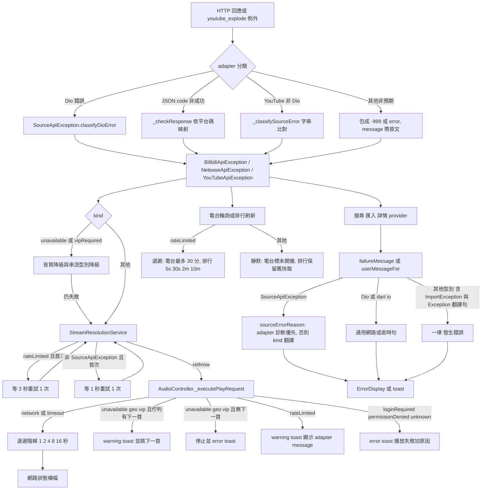

# 錯誤處理現況審計

> 現況描述，未經確認，不代表目標。

審計日期：2026-09-26，分支 `docs/audit`。方法：只讀原始碼與 grep，另以一支一次性 Python 腳本分類 catch 區塊（腳本不在 repo 內）。未執行 App、未跑測試、未打真實 API。
標記：**不一致** = 文檔／註釋與程式碼對不上；**推測** = 由程式碼路徑推論、未實跑驗證；**查不到** = 找不到對應實作。

---

## 1. 例外型別與層級

### 1.1 類別圖

```mermaid
classDiagram
    class Exception {
        <<interface>>
    }
    class SourceApiException {
        <<abstract>>
        +String code
        +String message
        +String sourceType
        +SourceErrorKind kind
    }
    class SourceErrorKind {
        <<enumeration>>
        network
        timeout
        rateLimited
        unavailable
        permissionDenied
        loginRequired
        geoRestricted
        vipRequired
        unknown
        +isRetryable()
        +shouldSkipTrack()
        +canFallbackToLowerAudioQuality()
    }
    Exception <|.. SourceApiException
    SourceApiException --> SourceErrorKind
    SourceApiException <|-- BilibiliApiException
    SourceApiException <|-- NeteaseApiException
    SourceApiException <|-- YouTubeApiException
    class BilibiliApiException {
        +int numericCode
    }
    class NeteaseApiException {
        +int numericCode
    }
    class YouTubeApiException {
        +String code
    }

    Exception <|.. BilibiliFavoritesException
    Exception <|.. YouTubePlaylistException
    Exception <|.. NeteasePlaylistException
    Exception <|.. NeteaseException_lyrics
    Exception <|.. QQMusicException
    Exception <|.. LrclibException
    Exception <|.. ImportException
    Exception <|.. ImportCancelledException
    Exception <|.. SearchException
    Exception <|.. PlaylistNameExistsException
    Exception <|.. PlaylistNotFoundException
    Exception <|.. PlaybackTimeoutException
    Exception <|.. StreamOpenFailedException
    Exception <|.. RetryScheduledException_private
    Exception <|.. UnsupportedDownloadStreamException
    Exception <|.. SecureStorageUnavailable
    Exception <|.. UpdateAssetUnavailableException
    Exception <|.. UpdateIntegrityException

    class PlaybackEndReason {
        <<sealed>>
    }
    PlaybackEndReason <|-- EndedNaturally
    PlaybackEndReason <|-- EndedPrematurely
    PlaybackEndReason <|-- TransportFailed
    PlaybackEndReason <|-- OutputDeviceFailed
    PlaybackEndReason <|-- MediaUnopenable
    PlaybackEndReason <|-- DecoderFailed
    PlaybackEndReason <|-- UnclassifiedFailure
    note for PlaybackEndReason "不是例外，是後端播放器事件的型別化結果"
```

`NeteaseException_lyrics` 指 `lib/services/lyrics/netease_source.dart:110` 的 `NeteaseException`，與資料層的 `NeteaseApiException` 無關。`RetryScheduledException_private` 指 `lib/services/audio/audio_provider.dart:53` 的 `_RetryScheduledException`。

只有三個音源 adapter 的例外繼承共同基底 `SourceApiException`（`lib/data/sources/source_exception.dart:32`）。其他 18 個型別都直接 `implements Exception`，彼此沒有層級。另外有 **33 處** `throw Exception(...)`（未分型），**50 處** `throw StateError/ArgumentError/UnsupportedError/UnimplementedError/FormatException/TimeoutException`（grep `lib/`，不含 `*.g.dart`）（核查更正：原寫「46 處」；重算含 `const` 與 `ArgumentError.value`：StateError 26、FormatException 14、ArgumentError 8（其中 `.value` 4）、UnsupportedError 2，UnimplementedError／TimeoutException 0）。

### 1.2 每個型別在哪裡丟、在哪裡接

「丟」= 建構點數（含 `throw` 與 `return` 給上層丟）；「接」= `on T catch`、`is T`、switch pattern。其餘沒列出的地方由泛型 `catch (e)` 接住。

| 型別 | 定義 | 丟（數／代表位置） | 型別化接住（數／位置） |
|---|---|---|---|
| `SourceApiException`（抽象） | `source_exception.dart:32` | 0（抽象） | 9：`audio_stream_quality_fallback.dart:56, 90`；`audio_provider.dart:633, 738, 1880`；`stream_resolution_service.dart:207`；`radio_refresh_service.dart:216`；`playback_error_presenter.dart:68`；`user_message.dart:73` |
| `BilibiliApiException` | `bilibili_exception.dart:5` | 19：`bilibili_source.dart` 13（`_checkResponse:933-949`、`_handleDioError:952-989`）、`bilibili_live_client.dart` 6（`:195, 567-600`） | 只在 adapter 內 rethrow（`bilibili_source.dart:230, 641, 676, 697, 807, 897, 1041`） |
| `NeteaseApiException` | `netease_exception.dart:5` | 23：`netease_source.dart`（`_checkResponse:827-839`、`_classifyStreamUnavailable:841-910`、`_handleDioError:977-1007`） | 只在 adapter 內 rethrow（`netease_source.dart:167, 249, 321, 348, 460`） |
| `YouTubeApiException` | `youtube_exception.dart:5` | 33：`youtube_source.dart`（`_checkPlayability:87-97`、`_classifySourceError:2325-2360`、`_handleDioError:2395-2404`） | adapter 內（`youtube_source.dart:260, 1065, 1426, 1767, 2247, 2300, 2326, 2370`） |
| `BilibiliFavoritesException` | `bilibili_favorites_service.dart:282` | 5（`:58, 124, 161, 193, 253`） | 6：`playlist_detail_page.dart:623, 1623`；`add_to_bilibili_playlist_dialog.dart:79, 117, 241` 等 |
| `YouTubePlaylistException` | `youtube_playlist_service.dart:734` | 3（`:234, 720, 725`） | 5：`playlist_detail_page.dart:627, 1627`；`add_to_youtube_playlist_dialog.dart:81, 220, 274` |
| `NeteasePlaylistException` | `netease_playlist_service.dart:34` | 6（`:114, 203, 227, 289, 304, 319`） | 5：`playlist_detail_page.dart:631, 1631`；`add_to_netease_playlist_dialog.dart:71, 163, 217` |
| `NeteaseException`（歌詞） | `lib/services/lyrics/netease_source.dart:110` | 4 | 0（泛型 catch） |
| `QQMusicException` | `qqmusic_source.dart:84` | 2 | 0 |
| `LrclibException` | `lrclib_source.dart:8` | 1 | 0 |
| `ImportException` | `import_service.dart:701` | 6（`:176, 410, 414, 438, 664, 673`） | 1：`import_playlist_provider.dart:150` |
| `ImportCancelledException` | `playlist_import_service.dart:115` | 2（`:167, 230`） | 1：`playlist_import_provider.dart:180` |
| `SearchException` | `search_service.dart:237` | 1（`:139`） | 0 |
| `PlaylistNameExistsException` | `playlist_exceptions.dart:3` | 3（`playlist_service.dart:117, 162, 386`） | 0 |
| `PlaylistNotFoundException` | `playlist_exceptions.dart:11` | 5（`playlist_service.dart:152, 381`；`playlist_mutation_repository.dart:265, 308, 437`） | 0 |
| `PlaybackTimeoutException` | `audio_types.dart:151` | 2（`playback_request_session.dart:735, 743`） | 4：`audio_provider.dart:758, 1912`；`playback_error_presenter.dart:67`；`playback_request_session.dart:802` |
| `StreamOpenFailedException` | `audio_types.dart:167` | 1（`media_kit_audio_service.dart:685`） | 1：`radio_controller.dart:514` |
| `_RetryScheduledException` | `audio_provider.dart:53` | 1（`:1941`） | 1（`:596`） |
| `UnsupportedDownloadStreamException` | `download_service.dart:1721` | 1（`:1066`） | 1：`download_service.dart:1381` |
| `SecureStorageUnavailable` | `secure_key_value_store.dart:13` | 2（`:64, 66`） | 6：三個帳號服務（`bilibili_account_service.dart:556`、`netease_account_service.dart:407, 482`、`youtube_account_service.dart:542`）、`audio_settings_provider.dart:143`、`lyrics_ai_config_service.dart:48` |
| `UpdateAssetUnavailableException` | `update_service.dart:129` | 2 | 1（`:123`） |
| `UpdateIntegrityException` | `update_service.dart:200` | 6 | 1（`:238`） |

`SourceApiException` 上的語意 getter `isUnavailable / isGeoRestricted / requiresLogin / isNetworkError / isTimeout / isPermissionDenied / isVipRequired`（`source_exception.dart:48-72`），以及三個遠端歌單例外的 `requiresLogin`（`bilibili_favorites_service.dart:289`、`youtube_playlist_service.dart:740-741`、`netease_playlist_service.dart:40`）、`YouTubeApiException.isPrivateOrInaccessible`（`youtube_exception.dart:44`）：grep 全 `lib/` 查不到任何呼叫端。實際被讀的只有 `kind` 本身、`isRateLimited` 與 `kind` 上的三個 getter。（核查補充：`lib/` 內 `isNetworkError` 的命中全是 `PlayerState.isNetworkError`，不是這個 getter；`YouTubeApiException` 覆寫了 `isPermissionDenied`（`youtube_exception.dart:37-41`），仍無呼叫端；`*.g.dart` 與 `part` 檔也無引用。但這些 getter 在 `test/` 有消費者：`test/data/sources/source_exception_test.dart` 全部都測，`netease_source_test.dart` 用 `isGeoRestricted`／`isVipRequired`，`bilibili_source_test.dart` 用 `isUnavailable`——刪除時要連測試一起處理。）

### 1.3 `SourceErrorKind` 決定的後果

| kind | 播放重試（`isRetryable`） | 跳過這首（`shouldSkipTrack`） | 降音質重試 | 使用者訊息（`user_message.dart:45-59`） |
|---|---|---|---|---|
| network / timeout | 是，退避 5 次 | 否 | 否 | adapter 診斷，否則「網路錯誤」／「逾時」（核查更正：原寫「「網路錯誤」／「逾時」」；Dio 路徑的診斷是 `classifyDioError` 的通用翻譯句 `t.error.networkError`／`connectionTimeout`，不是 `t.audio.sourceError*`） |
| rateLimited | 否（解析層另有一次 3 秒重試） | 否 | 否 | **直接用 adapter 的 message** |
| unavailable | 否 | 是 | 是 | adapter 診斷，否則「不可用」 |
| geoRestricted | 否 | 是 | 否 | 同上，「地區限制」 |
| vipRequired | 否 | 是 | 是 | 同上，「需要 VIP」 |
| loginRequired | 否 | 否 | 否 | 同上，「需要登入」 |
| permissionDenied | 否 | 否 | 否 | adapter 診斷，否則 Bilibili 有專屬一句，其他通用（核查更正：原寫「Bilibili 有專屬一句，其他通用」） |
| unknown | 否 | 否 | 否 | adapter message，空的才「發生錯誤」 |

getter 定義：`source_exception.dart:15-25`。

核查補充：`_reasonFor` 對**所有** kind 都先取 adapter 的 message 當診斷（`user_message.dart:42-43`），只有空字串、純數字、等於 code、或落在 `_syntheticDiagnostics` 九句英文清單（`:13-23`）時才退回 kind 翻譯。所以「adapter 給什麼就顯示什麼」不限於 unknown：Bilibili -101 的伺服器原文、YouTube `'Video is unplayable: $e'`（unavailable）、兩個 adapter 的 `'No audio stream available'`（unavailable，不在清單內，清單只有 `'No stream URL available'`）都會原樣上畫面。

---

## 2. 每個音源的錯誤流

### 2.1 Bilibili

**產生與轉換**

| 來源訊號 | 轉成 | kind | 證據 |
|---|---|---|---|
| JSON `code` ∈ {-352, -412, -509, -799} | `BilibiliApiException(code, t.error.bilibiliRateLimited)` | rateLimited | `bilibili_exception.dart:20-22, 40-42`；`bilibili_source.dart:938-943` |
| JSON `code` = -101 | 同型別，message 為伺服器原文 | loginRequired | `bilibili_exception.dart:46`；`bilibili_source.dart:945-947` |
| JSON `code` = -403 / 62012 | 同上 | permissionDenied | `bilibili_exception.dart:47-49` |
| JSON `code` = -404 / -503 / 62002 | 同上 | unavailable | `bilibili_exception.dart:43-45` |
| JSON `code` = -10403 | 同上 | geoRestricted | `bilibili_exception.dart:50` |
| 其他非 0 `code` | 同上 | unknown | `bilibili_source.dart:947` |
| HTTP 412 / 429 | 合成碼 -429 | rateLimited | `bilibili_source.dart:966-972`；`bilibili_exception.dart:25` |
| 其他 HTTP 狀態 | `-(statusCode)`；HTTP 403/404/503 因此碰巧落在 -403/-404/-503 | 依上表 | `bilibili_source.dart:973-976` |
| Dio 逾時／連線錯誤／其他 | -1 / -2 / -3 | timeout / network / unknown | `bilibili_source.dart:980-988` |
| 非預期例外（解析錯誤等） | -999，**message = `e.toString()`** | unknown | `bilibili_source.dart:643, 678, 809, 899, 1043` |

串流解析內部依 `streamPriority` 逐型別嘗試（DASH→durl），只有 `unavailable`/`vipRequired` 會往下一型別降級，其他立刻丟出（`bilibili_source.dart:244-294`）。評論失敗一律回空清單（`bilibili_source.dart:852-858`）。

**直播 client**：`getRoomInfo` 風控碼往上拋 rateLimited，其他非 0 碼與 Dio 錯誤回 null（`bilibili_live_client.dart:189-208`）；`getRadioStream` 失敗丟未分型的 `Exception`（`bilibili_live_client.dart:285-295`）；`resolveRealRoomId` 失敗吞掉、退回原 id（`bilibili_live_client.dart:172-176`）。

**重試**：見 §3.2。**UI**：見 §4.1。

### 2.2 網易雲

| 來源訊號 | 轉成 | kind | 證據 |
|---|---|---|---|
| JSON `code` ∉ {200, 0} | `NeteaseApiException(code, 伺服器 message/msg)` | 依碼 | `netease_source.dart:827-839` |
| `code` = -460 / -462 | 同上 | rateLimited | `netease_exception.dart:27-29` |
| `code` = 301 | 同上 | loginRequired | `netease_exception.dart:34` |
| `code` = 403 / -403 | 同上 | permissionDenied | `netease_exception.dart:35-37` |
| 404 / -404 / -503 / -200 | 同上 | unavailable | `netease_exception.dart:30-33` |
| 串流 `url` 為空，逐項判斷 | 301 → 登入；`fee` 1/4 或訊息含 vip/付費 → -10；-110 或 `flag & 256` 或訊息含版權/地區 → -110；403；404 且 `fee==0` → 301；其他 → -200 | loginRequired / vipRequired / geoRestricted / permissionDenied / unavailable | `netease_source.dart:841-910, 937-975` |
| 串流 `data` 陣列空 | `numericCode: -1`，message 英文 `'No stream data returned'` | **unknown**（-1 在網易雲沒有映射） | `netease_source.dart:127-132`；`netease_exception.dart:24-40` |
| HTTP 429 / 460 / 462 | -460 | rateLimited | `netease_source.dart:986-991` |
| 其他 HTTP | `-(statusCode)` | 依表 | `netease_source.dart:992-995` |
| 逾時／網路／其他 | -997 / -998 / -999 | timeout / network / unknown | `netease_source.dart:998-1006` |
| 非預期例外 | -999，**message = `e.toString()`** | unknown | `netease_source.dart:169, 251, 323, 350, 462` |

`getAlternativeAudioStream` 永遠回 null（`netease_source.dart:173-178`），所以 CDN 403 之類的開流失敗沒有替代 URL，只剩音質降級那一段（`audio_stream_quality_fallback.dart:69-96`）。試聽 URL 被當成正常結果回傳（`netease_source.dart:145-163`）。

### 2.3 YouTube

YouTube 大部分請求走 `youtube_explode_dart`，不是 Dio，所以 `classifyDioError` 覆蓋不到，改用字串比對（`youtube_source.dart:2320-2324` 註解自述）。

| 來源訊號 | 轉成 | kind | 證據 |
|---|---|---|---|
| InnerTube `playabilityStatus.status != OK` | code 由 status+reason **子字串**推：含 country/region/geo/location → geo；含 age → age_restricted；含 sign in/login/log in → login_required；含 private → private_or_inaccessible；`unplayable`；其他用 status 小寫 | geoRestricted / loginRequired / permissionDenied / unavailable / unknown | `youtube_source.dart:87-118`；`youtube_exception.dart:20-34` |
| 任何例外字串含 `429` / `rate` / `quota` / `too many` | `rate_limited` | rateLimited | `youtube_source.dart:2312-2318` |
| 字串含 timeout / socket / connection / network / 404 | timeout / network_error / not_found | 對應 | `youtube_source.dart:2338-2359` |
| Dio 403 | **不分類**（回 null，視為可以換下一種取法） | — | `youtube_source.dart:2327-2328` |
| 其他 Dio | 走 `classifyDioError` | 依狀態碼 | `youtube_source.dart:2395-2404`；`source_exception.dart:78-145` |
| `youtube_explode` 的 `VideoUnplayableException`（詳情） | 有 auth 改走 InnerTube；否則 `unplayable` | unavailable | `youtube_source.dart:247-258` |
| 其他非預期例外 | `'error'`，**message 內嵌 `$e`** | unknown | `youtube_source.dart:276-279, 1067, 1435-1438, 1769, 2251-2254, 2302-2305` |
| 所有 streamType 都拿不到 | `no_stream` | unavailable（→ 跳過這首） | `youtube_source.dart:373-377` |

「Sign in to confirm you're not a bot」這類匿名擋下：匿名路徑的例外只要不是限流就回 null（`youtube_source.dart:381-405, 473-479`），沒有帶 auth 時最後落到 `no_stream` → unavailable → 播放層跳過，toast 的原因是英文原文「No audio stream available」（核查更正：原寫「顯示「不可用」」；`youtube_source.dart:376` 的 message 不在 `_syntheticDiagnostics`，`cannotPlay` 經 `sourceErrorReason` 會直接用它，見 §1.3 核查補充）。**推測**：實際例外字串未實跑確認；若字串剛好含 `rate` 子字串（如 generate、separate），會被誤判為限流並中止 fallback。帶 auth 時 InnerTube 回 `LOGIN_REQUIRED` 會變成 loginRequired 並中止（`youtube_source.dart:421-423`）。

搜尋的例外有特別處理，不把 `$e` 放進 message（`youtube_source.dart:962-969`）；註解說實機曾整條印出 `ClientException ... uri=https://...`。其他路徑沒有同樣處理。

### 2.4 帳號與遠端歌單服務（三源）

- **Bilibili 收藏夾**：`_checkResponse` 把 -101/-111/-403/-607/11010/11201 映射成翻譯字串，其他為「未知錯誤（code）」（`bilibili_favorites_service.dart:248-278`）。Dio 錯誤**不包裝**，原樣往上。
- **YouTube 歌單**：`error.message` 用伺服器原文（`youtube_playlist_service.dart:716-721`）；Dio 錯誤不包裝。
- **網易雲歌單**：`data['message']` 用伺服器原文，沒有才翻譯（`netease_playlist_service.dart:297-308`）；Dio 錯誤不包裝。
- UI：三種例外都 `ToastService.error(context, e.message)`，其他走 `ToastService.failure`（`playlist_detail_page.dart:623-639`）。

### 2.5 外部匯入（Spotify／QQ）與歌詞源

- Spotify／QQ 的解析類失敗都是 `throw Exception(t.importSource.xxx)`，**翻譯好的訊息**（核查更正：原寫「所有失敗」；HTTP 請求 `spotify_playlist_source.dart:59`、`qq_music_playlist_source.dart:154` 外面沒有 catch，Dio 錯誤以 `DioException` 原樣往上）（`spotify_playlist_source.dart:53, 76, 139, 149, 186`；`qq_music_playlist_source.dart:64, 69, 171, 176, 181, 243`）。
- 歌詞三源各自把 Dio 錯誤轉成自己的例外（`lrclib_source.dart:79-93`、`qqmusic_source.dart:166-209`、`lib/services/lyrics/netease_source.dart:201-239`），但自動匹配全部 `catch (e)` 後 log 並回 null（`lyrics_auto_match_service.dart:121-126, 197-199, 668-671, 711-714, 754-757, 806-809`）。

---

## 3. 橫切主題

### 3.1 限流

| 項目 | 現況 | 證據 |
|---|---|---|
| 偵測 | Bilibili 風控碼 + HTTP 412/429；網易雲 -460/-462 + HTTP 429/460/462；YouTube HTTP 429/412 + 字串子字串 | §2 各表 |
| 全域限速器／token bucket | **查不到**（grep `RateLimiter|Throttle|TokenBucket|Semaphore` 無結果） | — |
| 主動節流 | 外部匯入每首之間 1000/800ms（`playlist_import_service.dart:276-285`；`app_constants.dart:83-88`）；Bilibili 收藏夾翻頁 200ms（`bilibili_source.dart:624-625`）；網易雲 400 首一批、批間 200ms（`netease_source.dart:514-525`）；直播真實房號快取以減少風控計數（`bilibili_live_client.dart:146-177`） | — |
| 播放遇限流 | 串流解析重試 1 次、等 3 秒（`stream_resolution_service.dart:207-224`；`app_constants.dart:144-146`）；仍失敗 → 播放層 warning toast 顯示 `e.message`，**不退避、不跳過**（`audio_provider.dart:1984-1988`） | — |
| 網易雲限流訊息 | rateLimited 的使用者訊息直接取 `message`（`user_message.dart:56`；播放層更直接，`audio_provider.dart:1986-1987` 不經 `user_message.dart`，把 `e.message` 原樣寫進 state 與 warning toast）（核查補充），網易雲的 message 是伺服器原文（`netease_source.dart:832-837`），所以 toast 是平台原文（**推測**：原文內容未實測） | — |

### 3.2 退避與重試（全部）

| 位置 | 觸發條件 | 次數／間隔 | 證據 |
|---|---|---|---|
| 播放恢復階梯 | `SourceErrorKind.network/timeout`，或 `SocketException/HttpException/TlsException/TimeoutException`（非 `PlaybackTimeoutException`） | 5 次：1、2、4、8、16 秒；網路恢復時自動重播 | `playback_error_presenter.dart:63-80`；`app_constants.dart:226-246`；`playback_recovery_coordinator.dart:170-188`；`audio_provider.dart:2134-2142` |
| 串流解析（限流） | rateLimited | 1 次，3 秒 | `stream_resolution_service.dart:210-223` |
| 串流解析（非 `SourceApiException`） | 任何其他例外 | 1 次，1 秒 | `stream_resolution_service.dart:230-244`；`app_constants.dart:138` |
| 音質降級 | unavailable / vipRequired | high→medium→low | `audio_stream_quality_fallback.dart:42-67` |
| 串流型別降級 | adapter 內，可降級的錯誤 | audioOnly→muxed→hls | `bilibili_source.dart:253-278`；`youtube_source.dart:348-371` |
| 開流失敗換 URL | 後端開流失敗 | 1 次 `resolveFallback` | `audio_stream_manager.dart:105-127` |
| 播放逾時預算 | `PlaybackTimeoutException` | **不重試**，toast | `playback_error_presenter.dart:63-66`；`audio_provider.dart:1909-1918` |
| 排行榜 | 任何刷新失敗（不只限流） | 4 次：5 秒、30 秒、2 分、10 分；之後等每小時定時刷新 | `ranking_cache_service.dart:124-129, 288-310` |
| 電台直播狀態輪詢 | rateLimited | 間隔 × 2^n，上限 30 分；其餘錯誤直接標「未開播」 | `radio_refresh_service.dart:32, 216-226, 239-249` |
| 電台斷線重連 | 直播流斷開 | 3 次：1、3、10 秒 | `app_constants.dart:249-262`；`radio_controller.dart:263-264, 900-906` |
| YouTube 排行 | 暫時性錯誤（5xx、逾時、連線） | 1 次，200ms | `youtube_source.dart:1617-1631, 2369-2392` |
| Bilibili 收藏夾 -101/-111 | 認證失敗 | 刷新 cookie 後重打 1 次 | `bilibili_auth_interceptor.dart:40-88` |

### 3.3 Cookie 失效

| 平台 | 啟動時 | 請求期（帳號服務的 Dio） | 請求期（播放／搜尋的 adapter Dio） | 自動刷新 |
|---|---|---|---|---|
| Bilibili | 先 `refreshCredentials()`（`account_provider.dart:131-152`），再 `checkAccountStatus`：-101/-111 → invalid → `markSessionExpired()` + toast（`bilibili_account_service.dart:500-501`；`account_provider.dart:233-236`） | 攔截器看到 -101/-111 → 刷新 → 重打一次；還是失敗就 `markSessionExpired()`，由 watcher 補 toast（`bilibili_auth_interceptor.dart:40-88`；`account_provider.dart:190-199`）；只掛在收藏夾服務的 Dio（`bilibili_favorites_service.dart:47-48`） | **無攔截器**（`bilibili_source.dart:96-101`）。-101 → loginRequired → 「播放失敗：需要登入」，不標失效、不刷新 | 有（RSA correspondPath，`bilibili_account_service.dart:351-450`） |
| 網易雲 | `checkAccountStatus`：`code != 200` **一律**當 invalid（`netease_account_service.dart:360-362`）→ 清憑證、標失效（`:290-297`） | 攔截器：`code == 301` 且目前登入 → `markSessionExpired()`（`netease_auth_interceptor.dart:52-56`）；只掛在歌單服務（`netease_playlist_service.dart:64`） | 無攔截器（`netease_source.dart:46`）；301 → loginRequired | 無（`refreshCredentials` 直接回 true，`netease_account_service.dart:301`） |
| YouTube | `checkAccountStatus`：HTTP 401/403 或回應裡沒有使用者資料 → invalid（`youtube_account_service.dart:224-229`） | 攔截器只 **log** `UNAUTHENTICATED`，不標失效（`youtube_auth_interceptor.dart:30-60`） | 無攔截器 | 無（`youtube_account_service.dart:168`） |

提示去重：同一 app session 每個平台最多一次（`session_expiry_notifier.dart:11-23`）。狀態檢查本身失敗（網路錯）只寫 log（`account_provider.dart:242-248`）。

風險：網易雲狀態檢查把 `-460`（限流）等任何非 200 碼都當成失效，憑證會被清掉（`netease_account_service.dart:360-362` + `:290-297`）。（核查確認呼叫鏈為事實：`verifyAllAccountStatuses` 收到 invalid 即 `markSessionExpired()`（`account_provider.dart:233-236`），後者刪 secure storage 並標失效；code 200 但缺 `profile` 也回 invalid（`:339-342`）。對照 Bilibili 只把 -101/-111 當 invalid、其他碼回 error（`bilibili_account_service.dart:500-503`）。前提是伺服器以 HTTP 200 回 JSON 非 200 碼；HTTP 層錯誤走 `DioException` → error，不清憑證。）**推測**：實際多常發生未量測。

### 3.4 風控驗證（captcha／412／wbi）

- **captcha／極驗／gaia `v_voucher`**：grep `captcha|geetest|gaia|v_voucher|verify` 在 `lib/` **查不到**任何處理。遇到只會被分類成限流或未知。
- **HTTP 412**：一律當限流（`source_exception.dart:105-111`；`bilibili_source.dart:966-972`）。
- **WBI 簽名**：`/x/web-interface/wbi/view` 目前**不簽**，註解說 Bilibili 對它不驗簽（`bilibili_source.dart:77-84`）。哪天開始驗簽，匿名播放第一步（查 cid）就會失敗。
- **buvid 指紋**：啟動時本地隨機生成 buvid3/buvid4 放進 Cookie（`bilibili_source.dart:91-102, 121-147`）；遇風控不換指紋（`bilibili_source.dart:921-932` 註解自述已移除換指紋路徑）。
- **網易雲 -462**（需要驗證）：當成限流（`netease_exception.dart:27-29`），沒有驗證流程。

### 3.5 地區／版權限制

| 源 | 偵測 | 後果 |
|---|---|---|
| Bilibili | `-10403` → geo；`62002` → unavailable；`62012` → permissionDenied（`bilibili_exception.dart:43-50`） | geo／unavailable 在佇列模式跳過並 warning toast；permissionDenied 只 toast 不跳過（`audio_provider.dart:1951-1994`） |
| 網易雲 | `-110`、`flag & 256`、訊息關鍵字（`netease_source.dart:865-876, 957-975`）；VIP 另走 -10 | geo／VIP 跳過；VIP 先降音質（`source_exception.dart:18-25`） |
| YouTube | playability 字串含 country/region/geo/location（`youtube_source.dart:103-108`） | 跳過 |

跳過只在「佇列模式且還有下一首」時發生；否則停止播放並顯示錯誤（`audio_provider.dart:1952-1983`）。

---

## 4. 使用者最終看到什麼

### 4.1 依功能

| 功能 | 失敗時使用者看到 | 證據 |
|---|---|---|
| 佇列播放 | 可跳過：warning toast「無法播放〈歌名〉：〈原因〉，已跳過」並 300ms 後下一首；限流：warning toast 原因；網路／逾時：頂部網路橫幅＋自動重試；其他：error toast | `audio_provider.dart:1880-1995`；`network_status_banner.dart:27, 74-102` |
| 臨時播放（搜尋頁點歌） | toast，然後還原原佇列 | `audio_provider.dart:633-658` |
| `PlayerState.error` | 7 處寫入 `e.toString()`（`audio_provider.dart:492, 530, 600, 854, 970, 1007, 1905`）。grep `lib/ui` **查不到**任何讀取 `PlayerState.error` 文字的地方，只有 `playback_event_router.dart:73` 的 `hasError` 旗標（核查補充：另有 `audio_provider.dart:438`（`'Initialization failed: $e'`）、`:1166`、`:2097` 也寫原文；整個 `lib/` 對它的讀取只有 `audio_provider.dart:518` 的非 null 判斷與 `:2770` 轉成 `hasError`，文字本身無人讀） | — |
| 搜尋 | 只有**所有**線上結果都空時才顯示 `ErrorDisplay`；部分源失敗時靜默（錯誤字串存在 state 但不畫）。字串前綴是原始 id（`bilibili: ...`），不是顯示名稱 | `search_page.dart:424-430`；`search_service.dart:105-116` |
| 排行榜 | 有舊快取時靜默保留；空的才顯示通用「載入失敗」 | `ranking_cache_service.dart:288-294`；`explore_page.dart:135-141` |
| 詳情面板 | `ErrorDisplay`（`failureMessage` 翻譯） | `track_detail_provider.dart:122, 207`；`track_detail_panel.dart:378` |
| 內部歌單匯入 | 對話框錯誤文字；`ImportException` 會變成「發生錯誤」（見 4.3 #1） | `import_playlist_provider.dart:150-180` |
| 外部歌單匯入 | 對話框錯誤文字，**一律**「發生錯誤」（見 4.3 #1） | `import_playlist_dialog.dart:557-576` |
| 遠端歌單讀寫 | error toast，內容為 `e.message` | `playlist_detail_page.dart:623-639`；`add_to_*_playlist_dialog.dart` |
| 電台播放 | error toast「播放失敗：〈原因〉」；原因是 `userMessageFor(e)`，而 `getRadioStream` 丟的是未分型 `Exception`（`bilibili_live_client.dart:285-295`），`getLiveInfo` 也是（`radio_source.dart:102`），所以通常是「播放失敗：發生錯誤」（核查補充） | `radio_controller.dart:510-525`；`home_page.dart:126-130`；`radio_page.dart:33` |
| 電台直播狀態 | 靜默；非限流錯誤直接顯示為「未開播」 | `radio_refresh_service.dart:221-226, 252-257` |
| 歌詞自動匹配 | 靜默，看不到歌詞 | `lyrics_auto_match_service.dart:197-199`；`lyrics_auto_match_coordinator.dart:74-78` |
| 歌詞手動搜尋 | `ErrorDisplay` | `lyrics_provider.dart:490`；`lyrics_search_sheet.dart:392` |
| 帳號 | 失效：warning toast（每平台每 session 一次）；VIP 到期：info toast；檢查失敗：只 log | `account_provider.dart:224-248`；`session_expiry_notifier.dart:18-22` |
| 下載 | 下載管理頁顯示存下的翻譯句 | `download_service.dart:1380-1385, 892-898` |

提示元件用量（grep）：`ToastService.success` 60、`.error` 42、`.show` 26、`.warning` 14、`.failure` 13、`.showWithAction` 6；實例方法 `showError` 12、`showInfo` 6、`showWarning` 5、`showSuccess` 2；`showDialog` 呼叫 44 處（核查更正：原寫「49 處」，那是子字串計數，含 4 處 `_showDialog` 與 1 個同名區域變數）；直接建構 `SnackBar(` 1 處（核查更正：原寫「15 處」，那是子字串計數，含 `buildSnackBar(` 8、`showSnackBar(` 4、`removeCurrentSnackBar(` 2）。`ToastService.failure` 是註解宣稱的「UI 顯示例外的唯一入口」（`toast_service.dart:180-198`），實際 13 處。

### 4.2 catch 統計

腳本以大括號配對抽出每個 catch 區塊再依內容分類（`lib/`，不含 `*.g.dart`）。分類是啟發式，數字是約數。（核查重算：另寫一支先遮蔽字串與註解、再配對括號的腳本，得總數 507（`catch (` 478 + 只有 `on X {` 29）、泛型 407、`catch (_` 115、完全空 36、只有註解 34、單行 `catch (_) {}` 36；與下表差距 < 1%，不更正。其餘分類未重算。）

| 類別 | 數量 |
|---|---|
| catch 區塊總數（`catch (` 479 + 只有 `on X {` 的 32） | **511** |
| 沒有 `on` 型別的泛型 catch | 411 |
| `catch (_` | **115** |
| 空 catch（完全空） | **37** |
| 空 catch（只有註解） | **34** |
| 單行 `catch (_) {}` | 36 |
| 單行 `catch (e) {}` | 0（多行、只有註解的 `catch (e)` 有：`import_service.dart:552`、`add_to_playlist_dialog.dart:547, 558`、`radio_controller.dart:391`） |
| 只 log | **80** |
| 回傳預設值（含先 log 的 40） | 77 |
| rethrow／轉型再丟 | 73 |
| 只 `continue`／`break` | 4 |
| 其他（有實際處理） | 206 |
| `.catchError(` | 14 |

空 catch 集中處：`lib/ui/windows/lyrics_window.dart` 9、三個登入頁共 12（其中 9 處清 WebView 狀態，另 3 處在 `youtube_login_page.dart:101, 210, 295` 解析頻道資訊與 DATASYNC_ID）（核查更正：原寫「三個登入頁共 10（清 WebView 狀態）」）、`radio_controller.dart` 4（`:294, 391, 1053, 1062`；核查補充）、`network_image_cache_service.dart` 7、`download_path_maintenance_service.dart` 6（`on FileSystemException`）、`download_scanner.dart` 4、`update_service.dart` 3。

### 4.3 最危險的幾處

1. **翻譯好的錯誤被壓成「發生錯誤」**。`userMessageFor` 只認 `SourceApiException`、`DioException`、`dart:io` 例外、`TimeoutException`、`FormatException`、`PathAccessException`，其他一律 `t.error.unknownError`（`lib/core/errors/user_message.dart:72-87`）。受影響：
   - `ImportException`（訊息已翻譯，`import_service.dart:701-707`）→ `failureMessage`（`import_playlist_provider.dart:150-163`）→「發生錯誤」。
   - Spotify／QQ 的 `throw Exception(t.importSource.xxx)`（§2.5）→ `failureMessage`（`playlist_import_provider.dart:186-197`）→「發生錯誤」；對話框再包一層 `Exception` 丟給 `userMessageFor`（`import_playlist_dialog.dart:557-576`），還是「發生錯誤」。
   - `PlaylistNameExistsException`（`toString()` 是翻譯句，`playlist_exceptions.dart:3-9`）沒有任何型別化 catch → `failureMessage`（`playlist_provider.dart:121-129`）→ 建立歌單對話框 toast「發生錯誤」（`create_playlist_dialog.dart:509-513`）。（核查確認為程式碼事實，原標「**推測**」：`PlaylistService.createPlaylist` 先查 `nameExists` 就丟（`playlist_service.dart:115-117`），對話框的 validator 只擋空字串（`create_playlist_dialog.dart:103-105`），provider catch 後回 null，對話框讀 `playlistListProvider.error` 顯示。改名（`:162`）與複製（`:386`）走同樣的 provider catch。）
   - `SearchException`（`search_service.dart:139`）同理。（核查補充：只在要求的音源沒註冊時丟，搜尋 chip 由已註冊音源推導，實務上很難觸發。）
   - （核查補充）電台：新增電台對話框的 YouTube 網址、已存在、網址無法解析都是 `throw Exception(t.radio.xxx)`（`radio_source.dart:142, 147`；`radio_controller.dart:642, 752`），對話框 `userMessageFor(e)`（`lib/ui/widgets/radio/add_radio_dialog.dart:55-58`）→「發生錯誤」；電台播放失敗同理（§4.1）。
   - （核查補充）外部匯入連網路錯誤也不例外：provider 已把 `DioException` 翻成網路錯誤句，但對話框在 `phase == error` 時再 `throw Exception(state.errorMessage)`（`import_playlist_dialog.dart:556-559`），所以不論原因，外部匯入一律「發生錯誤」。
2. **例外原文仍會上畫面，與註解主張不一致**。`user_message.dart:64-67` 說回傳值不會有 Dart 例外原文；但 adapter 把非預期例外包成 `message: e.toString()`（`bilibili_source.dart:643, 678, 809, 899, 1043`；`netease_source.dart:169, 251, 323, 350, 462`）或內嵌 `$e`（`youtube_source.dart:278, 1437, 2253, 2304`），而 unknown kind 的使用者訊息就是 message（`user_message.dart:57-58`）。**不一致**。（核查補充：YouTube 另有 `:1067`、`:1769` 直接 `message: e.toString()`，`:257` 的 `'Video is unplayable: $e'` 是 unavailable kind 也照樣顯示——因為 `_reasonFor` 對所有 kind 先取 message，見 §1.3 核查補充。呼叫鏈已追到 UI：詳情 `track_detail_provider.dart:122, 207`、搜尋 `search_service.dart:108-115`、內部匯入 `import_playlist_provider.dart:156, 172` 都經 `failureMessage` → `sourceErrorReason`。）
3. **網易雲狀態檢查把任何非 200 碼當成登入失效並清掉憑證**（`netease_account_service.dart:360-362, 290-297`；呼叫端 `account_provider.dart:233-236`）。
4. **播放期的登入失效偵測不到**：攔截器只掛在帳號服務自己的 Dio，adapter 的 Dio 沒有（§3.3）。（核查補充：更精確地說，三個攔截器都只掛在**歌單服務**的 Dio（`bilibili_favorites_service.dart:48`、`youtube_playlist_service.dart:55`、`netease_playlist_service.dart:64`），帳號服務自己的 Dio 也沒有；`lib/data/sources/` grep `interceptors` 無結果；`lib/` 全域 `markSessionExpired()` 的呼叫端只有 `account_provider.dart:235` 與 Bilibili／網易雲兩個攔截器。）YouTube 攔截器即使看到 `UNAUTHENTICATED` 也只寫 log（`youtube_auth_interceptor.dart:30-37`）。
5. **電台輪詢把網路錯誤顯示成「未開播」**：`getRoomInfo` 對 Dio 錯誤回 null（`bilibili_live_client.dart:205-208`）→ `RadioSource` 丟 `Exception('Failed to get room info')`（`radio_source.dart:102`）→ `_markOffline`（`radio_refresh_service.dart:223-226, 252-257`）。（核查補充：單站刷新 `refreshStation` 連限流也不分，任何例外都寫 `false`（`radio_refresh_service.dart:260-272`）。）
6. **搜尋部分失敗靜默**（`search_page.dart:424`）。
7. **`ImportService.autoRefreshAll` 的空 catch**（`import_service.dart:548-554`）連 log 都沒有；但 grep 查不到任何呼叫端，是死碼。（核查確認：`lib/` 與 `test/` 只有定義處一筆，無 tear-off、無 codegen 引用。）
8. **加入本地歌單的逐歌單失敗不記 log**（`add_to_playlist_dialog.dart:547, 558`），使用者只看到「部分完成 N/M」（`:598-604`）。
9. **YouTube 限流判斷用子字串 `rate`**（`youtube_source.dart:2312-2318`），任何含 generate／separate／accurate 的錯誤字串都會被當成限流並中止 fallback（`youtube_source.dart:389-395, 2362-2367`）。**推測**：未找到實際觸發案例。

---

## 5. 錯誤從音源到 UI

---

## 附：本檔發現的文檔與程式碼不一致

| 主張 | 位置 | 程式碼現況 |
|---|---|---|
| 回傳給 UI 的字串不會有 Dart 例外原文 | `lib/core/errors/user_message.dart:64-67` | adapter 的 -999／error 包裝把 `e.toString()` 放進 message，unknown kind 直接顯示它（§4.3 #2） |
| `ToastService.failure` 是 UI 顯示例外的唯一入口 | `lib/core/services/toast_service.dart:182-185` | 遠端歌單路徑直接 `ToastService.error(context, e.message)`（`playlist_detail_page.dart:623-634`）；`home_page.dart:128` 直接顯示 `RadioState.error` |
| 三個 adapter 共 22 處 `on DioException catch` | `playback_error_presenter.dart:60` | 實數 19（Bilibili 9、YouTube 5、網易雲 5），加直播 client 2 為 21 |
| `isPermissionDenied` 表示「需要登入重試」 | `source_exception.dart:66-69` | 查不到任何依此重試的呼叫端 |
| Bilibili 風控「由上層退避：串流解析隔幾秒重試一次，排行榜與電台輪詢各有退避階梯」 | `bilibili_source.dart:921-925` | 串流解析只重試 1 次（`stream_resolution_service.dart:210`）；之後播放層不退避（`audio_provider.dart:1984-1988`）。排行與電台的描述屬實 |
