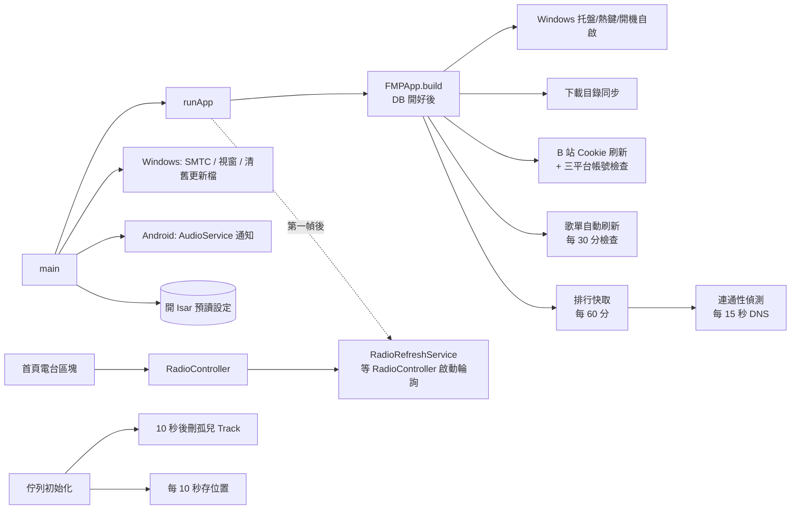

# 功能清單

> 現況描述，未經確認，不代表目標。

審計日期：2026-09-26，分支 `docs/audit`。所有結論以原始碼為準（`*.g.dart` 不採信）；沒有執行 app、沒有打真實 API。與文件／註釋衝突處標 **不一致**；依程式結構推得、未實測的結論標 **推測**。

狀態欄的用語：

- **完整**：有 UI 入口，端到端程式路徑存在。
- **半成品**：有入口但功能明顯不全，或行為與介面宣稱不符。
- **死代碼**：`lib/` 裡沒有呼叫點（列出 grep）。
- **無 UI 入口**：程式會被呼叫，或資料欄位存在，但使用者沒有辦法觸發或修改。
- **僅開發者模式**：要在「版本」連點 7 次後才看得到（見 `devtools.md`）。

平台欄：A = Android，W = Windows。程式裡還有 Linux／macOS 分支（例如 `lib/main.dart:232-235`），但 `pubspec.yaml` 的註解寫「FMP 不出 Linux/macOS」，本清單不列。

---

## 0. 入口總覽

### 0.1 路由（`lib/ui/router.dart`）

所有頁面都掛在一個 `GoRouter`（`router.dart:124-309`）。`ShellRoute` 內的頁面共用 `AppShell`（導覽列 + 迷你播放器）；全螢幕播放頁與電台播放頁掛在 root navigator，蓋在 shell 之上（`:293-307`）。

| 路徑 | 頁面 | 使用者怎麼到 | 證據 |
|---|---|---|---|
| `/` | `HomePage` | 導覽列「首頁」 | `router.dart:134-139`；導覽 `lib/ui/layouts/responsive_scaffold.dart:52` |
| `/search` | `SearchPage` | 導覽列 | `router.dart:141-146`；`responsive_scaffold.dart:58` |
| `/explore` | `ExplorePage`（排行完整列表，依音源分 Tab） | 首頁排行區塊的按鈕 | `router.dart:148-152`；`lib/ui/pages/home/home_page.dart:203` |
| `/queue` | `QueuePage` | 導覽列 | `router.dart:154-159`；`responsive_scaffold.dart:64` |
| `/history` | `PlayHistoryPage` | 首頁「最近播放」、設定頁「播放歷史」 | `router.dart:161-165`；`home_page.dart:672`；`lib/ui/pages/settings/settings_page.dart:108` |
| `/library` | `LibraryPage` | 導覽列 | `router.dart:167-171`；`responsive_scaffold.dart:70` |
| `/library/downloaded` | `DownloadedPage` | 音樂庫右上「已下載」 | `router.dart:174-177`；`lib/ui/pages/library/library_page.dart:64` |
| `/library/downloaded/:folderName` | `DownloadedCategoryPage` | 已下載頁點分類卡 | `router.dart:180-186`；`lib/ui/pages/library/downloaded_page.dart:296` |
| `/library/:id` | `PlaylistDetailPage` | 點歌單卡 | `router.dart:191-197`；`lib/ui/widgets/layout/playlist_grid_card.dart:57` |
| `/radio` | `RadioPage` | 導覽列 | `router.dart:202-207`；`responsive_scaffold.dart:76` |
| `/settings` | `SettingsPage` | 導覽列 | `router.dart:209-213`；`responsive_scaffold.dart:82` |
| `/settings/download-manager` | `DownloadManagerPage` | 設定「儲存」、已下載頁、歌單詳情頁 | `router.dart:216-220`；`lib/ui/pages/settings/widgets/settings_storage.dart:12`；`downloaded_page.dart:94` |
| `/settings/audio` | `AudioSettingsPage` | 設定「音質」 | `router.dart:222-226`；`settings_page.dart:101` |
| `/settings/lyrics-source` | `LyricsSourceSettingsPage` | 設定「播放」區的歌詞自動匹配列 | `router.dart:228-232`；`lib/ui/pages/settings/widgets/settings_playback.dart:155` |
| `/settings/home-ranking` | `HomeRankingSettingsPage` | 設定「快取」區 | `router.dart:234-238`；`settings_page.dart:128` |
| `/settings/user-guide` | `UserGuidePage`（靜態說明文字） | 設定「關於」 | `router.dart:240-244`；`settings_page.dart:172` |
| `/settings/developer` | `DeveloperOptionsPage` | **僅開發者模式** | `router.dart:246-249`；`lib/ui/pages/settings/widgets/settings_about.dart:111` |
| `/settings/developer/database` | `DatabaseViewerPage` | **僅開發者模式** | `router.dart:252-256` |
| `/settings/developer/logs` | `LogViewerPage` | **僅開發者模式** | `router.dart:258-262` |
| `/settings/account` | `AccountManagementPage` | 設定第一列 | `router.dart:266-269`；`settings_page.dart:76` |
| `/settings/account/{bilibili,youtube,netease}-login` | 三個登入頁 | 帳號管理頁「登入」 | `router.dart:271-285`；`lib/ui/pages/settings/account_management_page.dart:75,98,119` |
| `/player` | `PlayerPage`（全螢幕） | 點迷你播放器 | `router.dart:293-299`；`lib/ui/widgets/player/mini_player.dart:58,348` |
| `/radio-player` | `RadioPlayerPage`（全螢幕） | 點電台迷你播放器 | `router.dart:301-307`；`lib/ui/widgets/radio/radio_mini_player.dart:44` |

每條路由都找得到 UI 入口，沒有孤兒路由。開發者頁的三條路由是無條件註冊的，只是 UI 入口藏起來。

不在路由表、以對話框或 bottom sheet 開啟的「頁面」：歌單匯入（`ImportPlaylistDialog`，`library_page.dart:258`）、匯入預覽（檔名是 `import_preview_page.dart`，實際是 `ImportPreviewDialog`，`lib/ui/pages/library/import_preview_page.dart:21-33`）、建立／編輯歌單（`library_page.dart:251`）、歌詞搜尋（`lib/ui/pages/lyrics/lyrics_search_sheet.dart:21-30`）、帳號歌單匯入（`account_management_page.dart:193`）、帳號電台匯入（`account_management_page.dart:202`）、新增電台（`lib/ui/pages/radio/radio_page.dart:77,94`）、更新對話框（`lib/ui/widgets/dialogs/update_dialog.dart:100-110`）。

### 0.2 其他入口類型（細節在各功能節）

| 類型 | 摘要 | 證據 |
|---|---|---|
| 曲目選單（右鍵、「⋮」、長按三者同源） | 播放／下一首播放／加入佇列／加入歌單／匹配歌詞／**加入遠端歌單** | `lib/ui/handlers/track_action_menu.dart`、`track_action_handler.dart`、`track_action_coordinator.dart`；右鍵元件 `lib/ui/widgets/menus/context_menu_region.dart` |
| 多選模式 | 歌單詳情、搜尋、探索、歷史四頁；動作依頁面不同，含**加入／移除遠端歌單** | `lib/ui/widgets/app_bars/selection_mode_app_bar.dart`；`lib/ui/widgets/menus/selection_menu_items.dart:22-75` |
| 歌單卡選單 | Mix 播放／全部加入佇列／隨機加入／編輯／刷新／刪除 | `lib/ui/widgets/menus/playlist_card_actions.dart:26-71` |
| 鍵盤快捷鍵 | **沒有 app 內快捷鍵**（grep `Shortcuts(\|CallbackShortcuts\|SingleActivator\|KeyboardListener\|HardwareKeyboard\|onKeyEvent` 在 `lib/` 無結果，`LogicalKeyboardKey` 只出現在熱鍵設定 UI）。只有 Windows 全域熱鍵（§10） | `lib/data/models/hotkey_config.dart:9-17,212-257` |
| 托盤選單（W） | 目前曲目（不可點）／播放暫停／上一首／下一首／顯示視窗／結束 | `lib/services/platform/windows_desktop_service.dart:144-175` |
| 通知（A） | `audio_service` 媒體通知：上一首／播放暫停／下一首、seek、重複、隨機；按鈕依可用能力增減。沒有其他通知（沒有 `flutter_local_notifications`） | `lib/services/audio/audio_handler.dart:51-70,196-244` |
| SMTC（W） | 播放／暫停／停止／上下首／隨機／重複；快轉倒轉恆關；不支援從 SMTC 拖進度 | `lib/services/audio/windows_smtc_handler.dart:62-73,139-161,195-204,352-378` |
| 桌面歌詞視窗（W） | 獨立子視窗，控制列見 §6 | `lib/ui/windows/lyrics_window.dart`；開關 `lib/ui/widgets/panels/track_detail_panel.dart:557` |

### 0.3 各頁選單位置

「右鍵」一律是 `ContextMenuRegion`（`onSecondaryTapUp` → `showMenu`），內容與同一列的「⋮」按鈕、長按選單相同。

| 頁面／元件 | 入口位置 | 內容 | 含遠端寫入 |
|---|---|---|---|
| 首頁排行、探索頁曲目列 `RankingTrackTile` | `lib/ui/widgets/track_tiles/ranking_track_tile.dart:59-61`（右鍵）、`:190-209`（⋮） | 完整曲目選單；長按進多選 | 是（加入遠端） |
| 搜尋頁：影片列、分 P 列、本機比對列 | `lib/ui/pages/search/search_page.dart:930,1046`、`:1106,1131`、`:1206,1283`、`:1421,1458` | 完整曲目選單；長按進多選 | 是 |
| 搜尋頁：直播間列 | `search_page.dart:1553,1646` | 播放、加為電台 | 否 |
| 搜尋頁：排序 | `search_page.dart:289` | `SearchOrder` | 否 |
| 歌單詳情：曲目列、分 P 群組、AppBar | `lib/ui/pages/library/playlist_detail_page.dart:1175`、`:485`；長按 `:340,390,416` | 曲目選單；匯入歌單的「移除」改為**從遠端移除** | 是 |
| 歌單卡（首頁、音樂庫） | `lib/ui/widgets/layout/playlist_grid_card.dart:42,61`；項目 `playlist_card_actions.dart:26-71` | Mix 播放、全部加入、隨機加入、編輯、刷新、刪除 | 否（刷新是讀取） |
| 播放頁「加入歌單」 | `lib/ui/pages/player/player_page.dart:243-265` | 本機／遠端 | 是（遠端） |
| 播放頁「更多」 | `player_page.dart:298-356` | 速度、歌詞搜尋、歌詞偏移、顯示模式 | 否 |
| 桌面側欄面板 | `lib/ui/widgets/panels/track_detail_panel.dart:482`（歌詞更多）、`:557`（開關歌詞視窗）、`:582`（加入歌單） | 同播放頁 | 是（遠端） |
| 首頁電台區塊、電台頁 | `home_page.dart:521,541`；`lib/ui/pages/radio/radio_page.dart:152,166` | 刪除 | 否 |
| 首頁最近播放 | `home_page.dart:715,727` | 曲目選單（不含遠端）＋刪除 | 否 |
| 歷史頁：列、多選、AppBar、排序 | `lib/ui/pages/history/play_history_page.dart:606,636,753`、`:129`、`:206`（清空）、`:380` | 曲目選單（不含遠端）＋刪除 | 否 |
| 已下載分類卡、分類頁 | `downloaded_page.dart:282,303`；`downloaded_category_page.dart:418,469,595,650` | 加入佇列、隨機加入、刪除檔案 | 否 |
| 佇列頁 | 沒有選單，只有拖曳（`queue_page.dart:627`）與圖示按鈕 | — | — |
| 下載管理 | `lib/ui/pages/settings/download_manager_page.dart:27` | 批次管理 | 否 |
| 封面／歌詞切換手勢 | `player_page.dart:500,511`（長按） | 非選單 | — |

---

## 1. 播放

| 功能 | 入口 | 平台 | 涉及音源 | 狀態 | 證據 |
|---|---|---|---|---|---|
| 播放／暫停／上下首／進度條／隨機／循環模式 | 全螢幕播放頁、迷你播放器、通知、SMTC、托盤、全域熱鍵 | A/W | 全部 | 完整 | `lib/ui/pages/player/player_page.dart:682-722`；`audio_handler.dart:196-244` |
| 播放速度 | 播放頁「更多」→速度（`showMenu<double>`） | A/W | 全部 | 完整 | `player_page.dart:326-327,744-750`；速度表 `lib/core/constants/app_constants.dart:43` |
| 音量／輸出裝置選擇 | 迷你播放器桌面控制、`FmpAudioDeviceSelector` | W（裝置選擇靠 media_kit） | — | 完整 | `lib/ui/widgets/player/fmp_audio_device_selector.dart`；還原偏好裝置 `lib/services/audio/audio_provider.dart:1276-1278` |
| 播放佇列：拖曳排序、移除、隨機打亂、清空 | 佇列頁 | A/W | 全部 | 完整 | `lib/ui/pages/queue/queue_page.dart:319-329,589-593,627` |
| 下一首播放／加入佇列 | 曲目選單 | A/W | 全部 | 完整 | `track_action_menu.dart` |
| 啟動時還原佇列與播放位置（不自動播放） | 自動 | A/W | 全部 | 完整 | `audio_provider.dart:424`（`autoPlay: false`）、`:778-802`；設定欄位 `rememberPlaybackPosition` 預設 true：`lib/data/models/settings.dart:259` |
| YouTube Mix／電台式無限播放 | 歌單卡「播放 Mix」、匯入 Mix 簡寫 | A/W | YouTube | 完整 | `playlist_card_actions.dart:26-71`；`lib/services/audio/mix_session_coordinator.dart` |
| 多 P 影片分 P 播放 | 搜尋結果展開、歌單分 P 群組 | A/W | Bilibili | 完整 | `lib/ui/pages/search/search_page.dart:1082`（`_PageTile`） |
| 播放失敗自動重試／跳過、網路恢復後重試 | 自動 | A/W | 全部 | 完整 | `lib/services/audio/playback_recovery_coordinator.dart`；網路恢復訂閱 `audio_provider.dart:272` |
| 播放時帶登入狀態（`useAuthForPlay`） | 音質設定頁（每個音源一個開關，見 §9） | A/W | 全部 | 完整 | `settings.dart:128-148`（`SourceSettingsEntry`） |
| 播放歷史（本機記錄、排序、刪除、清空、上限） | 歷史頁、設定「播放歷史上限」 | A/W | 全部 | 完整 | `lib/ui/pages/history/play_history_page.dart`；`lib/services/audio/play_history_recorder.dart` |
| 音樂與電台互斥（開電台暫停音樂、關電台可回到音樂） | 自動 | A/W | Bilibili 直播 | 完整 | `lib/services/radio/radio_controller.dart:380,562,840` |

## 2. 搜尋

| 功能 | 入口 | 平台 | 涉及音源 | 狀態 | 證據 |
|---|---|---|---|---|---|
| 多音源搜尋（頁面上的音源 chip 是唯一的來源選擇器）、排序、篩選、分頁載入 | 搜尋頁 | A/W | B/Y/N | 完整 | `lib/providers/search/search_provider.dart:238,323,416,522,538,591` |
| 本機曲庫比對結果 | 搜尋頁 | A/W | — | 完整 | `search_page.dart:1152,1394` |
| 直播間搜尋（播放、加為電台） | 搜尋頁 | A/W | Bilibili 直播 | 完整 | `search_provider.dart:565,625,675,744`；`search_page.dart:1537` |
| 搜尋歷史（本機，刪除單筆、清空） | 搜尋頁 | A/W | — | 完整 | `search_provider.dart:765-775` |
| 首頁熱門排行（前 10）＋探索頁完整排行 | 首頁、探索頁 | A/W | B/Y/N | 完整 | `home_page.dart:164`；`lib/ui/pages/explore/explore_page.dart:67-108`；背景刷新見 §13 |
| 首頁排行「停用某音源」 | 首頁排行設定頁的開關 | A/W | B/Y/N | 完整，但只作用在顯示層（`enabledHomeRankingSourceOrderProvider`）：背景刷新仍抓**所有**已註冊音源的榜單 | `lib/providers/settings/home_ranking_settings_provider.dart:193-195`；抓取不過濾 `lib/services/cache/ranking_cache_service.dart:158-163,233-245` |

## 3. 音樂庫／歌單

| 功能 | 入口 | 平台 | 涉及音源 | 狀態 | 證據 |
|---|---|---|---|---|---|
| 建立／編輯本機歌單（名稱、封面、自動刷新間隔） | 音樂庫「新增」、歌單卡「編輯」 | A/W | — | 完整 | `library_page.dart:97-104,251`；`lib/ui/pages/library/widgets/create_playlist_dialog.dart:39-61,291` |
| 歌單排序（拖曳） | 音樂庫排序模式 | A/W | — | 完整 | `library_page.dart:279` |
| 歌單詳情：播放、多選、下載、刪除曲目 | 歌單詳情頁 | A/W | 全部 | 完整 | `lib/ui/pages/library/playlist_detail_page.dart` |
| 加入本機歌單 | 曲目選單、播放頁「加入歌單→本機」 | A/W | 全部 | 完整 | `lib/ui/widgets/dialogs/add_to_playlist_dialog.dart:19` |
| **加入遠端歌單／收藏夾（寫入平台）** | 曲目選單「加入遠端」、播放頁「加入歌單→遠端」、多選 | A/W | B/Y/N（需登入） | 完整 | `add_to_bilibili_playlist_dialog.dart`、`add_to_youtube_playlist_dialog.dart`、`add_to_netease_playlist_dialog.dart`；未登入的來源被過濾：`track_action_handler.dart:220,306` |
| **在遠端建立歌單／收藏夾** | 上述對話框裡的「新建」 | A/W | B/Y/N | 完整 | `add_to_bilibili_playlist_dialog.dart:61-75`；`add_to_youtube_playlist_dialog.dart:204-205`；`add_to_netease_playlist_dialog.dart:147-148` |
| **從匯入歌單移除曲目＝同時從遠端移除** | 匯入歌單的詳情頁：單曲「移除」與多選「從遠端移除」（有確認框） | A/W | B/Y/N | 完整 | `playlist_detail_page.dart:565-610`（批次）、`:1575-1610`（單曲）；控制器 `lib/providers/library/remote_playlist_sync_provider.dart:39-77` |
| 匯入歌單的手動刷新 | 歌單卡「刷新」 | A/W | B/Y/N | 完整 | `playlist_card_actions.dart:253-255` |
| 匯入歌單的自動刷新 | 背景，見 §13 | A/W | B/Y/N | 完整 | `lib/services/library/auto_refresh_service.dart` |
| 遠端寫入後自動刷新對應的本機匯入歌單 | 自動 | A/W | B/Y/N | 完整 | `remote_playlist_sync_provider.dart:61-69`；`lib/services/library/remote_playlist_sync_service.dart:13-28` |
| 每次啟動刪除「不屬於任何歌單也不在佇列」的 Track 列 | 自動（啟動 10 秒後） | A/W | 全部 | 完整 | `lib/services/audio/queue_manager.dart:219-229`；`lib/data/repositories/track_repository.dart:635-673` |

## 4. 匯入

| 功能 | 入口 | 平台 | 涉及音源 | 狀態 | 證據 |
|---|---|---|---|---|---|
| 以 URL 匯入 B 站收藏夾／YouTube 歌單／網易雲歌單（直接匯入） | 音樂庫「匯入」 | A/W | B/Y/N | 完整 | `lib/ui/pages/library/widgets/import_playlist_dialog.dart:159-169` |
| YouTube Mix 簡寫匯入 | 同上 | A/W | Y | 完整 | `import_playlist_dialog.dart:149-151`；`lib/services/import/youtube_mix_shorthand.dart` |
| 以 URL 匯入 **QQ 音樂／Spotify** 歌單，再到 B 站／YouTube 搜尋比對（網易雲不在比對來源內） | 同上 → 匯入預覽對話框（可換候選、處理未匹配） | A/W | QQ、Spotify → B/Y | 完整 | `import_playlist_dialog.dart:171-176`；`lib/services/import/playlist_import_service.dart:1-21,137`；預覽 `import_preview_page.dart:21-33,268-282` |
| 帳號歌單匯入（列出登入帳號的歌單並匯入） | 帳號管理頁「管理歌單」 | A/W | B/Y/N | 完整 | `account_management_page.dart:193`；`lib/ui/pages/settings/widgets/account_playlists_sheet.dart:132-161` |
| 帳號電台匯入（B 站粉絲勳章牆的直播間） | 帳號管理頁（僅 B 站列有此按鈕） | A/W | Bilibili 直播 | 完整 | `account_management_page.dart:79,202`；`lib/services/account/bilibili_account_service.dart:529`；`lib/data/sources/bilibili_live_client.dart:339-344` |

**不一致**：`import_playlist_dialog.dart:26-29,69-73` 的註解說網易雲是「外部來源、需要搜尋匹配」，但同檔 `:159-176` 的程式先交給 `SourceManager` 判斷，網易雲 URL 走內部直接匯入；外部只剩 QQ 音樂與 Spotify。

## 5. 下載

| 功能 | 入口 | 平台 | 涉及音源 | 狀態 | 證據 |
|---|---|---|---|---|---|
| 下載曲目／整個歌單（連同 metadata JSON、封面、UP 主頭像寫在音檔旁） | 歌單詳情、多選「下載」 | A/W | 全部 | 完整 | `playlist_detail_page.dart:966,1039,1527`；`lib/services/download/download_service.dart:1509-1590` |
| 下載管理（佇列、暫停、繼續、清除） | 下載管理頁 | A/W | 全部 | 完整 | `lib/ui/pages/settings/download_manager_page.dart:20-41` |
| 已下載瀏覽（分類、分 P 群組、加入佇列、刪除檔案） | 已下載頁、分類頁 | A/W | 全部 | 完整 | `downloaded_page.dart:238-395,451-509`；`lib/ui/pages/library/downloaded_category_page.dart:519,552,690,723` |
| 變更下載路徑（會重設下載記錄） | 設定「儲存」（Android 不顯示此按鈕，`settings_storage.dart:60`） | W | — | 完整 | `lib/ui/widgets/dialogs/change_download_path_dialog.dart:187-230`；`lib/services/download/download_path_maintenance_service.dart:59` |
| 啟動時同步本機下載檔狀態 | 自動 | A/W | 全部 | 完整 | `lib/app.dart:131`；`lib/providers/download/startup_download_sync_provider.dart:9-40` |
| 下載服務啟動時：**清掉已完成與失敗的任務記錄**、下載中改暫停（不自動續傳）、刪孤兒 `.downloading` 暫存檔 | 自動（第一次讀取 `downloadServiceProvider` 時） | A/W | — | 完整 | `download_service.dart:201-228`；`lib/providers/download/download_providers.dart:42-59` |
| `DownloadPathSyncService.cleanupInvalidPaths()` | — | — | — | **死代碼**（grep `cleanupInvalidPaths` 在 `lib/`、`test/` 只有定義） | `lib/services/download/download_path_sync_service.dart:313` |

## 6. 歌詞

| 功能 | 入口 | 平台 | 涉及音源 | 狀態 | 證據 |
|---|---|---|---|---|---|
| 歌詞顯示（原文／優先翻譯／優先羅馬拼音） | 播放頁、桌面側欄面板 | A/W | 網易雲、QQ 音樂、lrclib 歌詞 | 完整 | `track_action_handler.dart:318-354`（顯示模式選單） |
| 手動搜尋並指定歌詞 | 曲目選單「匹配歌詞」、播放頁「更多」 | A/W | 同上 | 完整 | `lyrics_search_sheet.dart:21-30`；`track_action_coordinator.dart:57`；`player_page.dart:134,338` |
| 歌詞偏移校正（逐首持久化） | 播放頁「更多」、桌面歌詞視窗 | A/W | — | 完整 | `player_page.dart:344-345`；`lyrics_window.dart:431-467` |
| **自動匹配歌詞**（每首開始播放時背景搜尋） | 設定開關，**預設關** | A/W | 網易雲、QQ 音樂、lrclib（lrclib 預設停用） | 完整 | `lib/services/audio/lyrics_auto_match_coordinator.dart:36-60`；預設 `settings.dart:347,357,361` |
| **AI 標題解析／AI 候選選擇**（呼叫使用者設定的 OpenAI 相容端點） | 歌詞來源設定頁，模式 off／alwaysAi／advancedAiSelect，**預設 off** | A/W | 使用者自訂端點 | 完整 | `settings.dart:163,364,658-679`；`lib/services/lyrics/lyrics_auto_match_service.dart:156,174`；見 §15 |
| 桌面歌詞視窗：上下首、播放暫停、顯示模式、樣式（顏色、外框、陰影）、單行／整頁、透明、置頂、偏移列、點行跳轉、右鍵某行校正偏移 | 桌面側欄面板的按鈕 | W | — | 完整 | `track_detail_panel.dart:557`；`lyrics_window.dart:719-743,775-776,876-907` |
| 歌詞快取（檔案數上限可調，大小上限 5 MB） | 設定「快取」 | A/W | — | 完整 | `lib/services/lyrics/lyrics_cache_service.dart:19-29` |

主視窗推給桌面歌詞視窗的同步（位置、歌詞、播放狀態、主題）全部寫在 `TrackDetailPanel` 這個 UI widget 的 `ref.listen` 裡（`track_detail_panel.dart:113-197,273-325`；`LyricsWindowService.instance.sync*` 在 `lib/` 別處沒有呼叫者，已 grep 確認）。該面板只在 expanded 以上的寬版版面、且有曲目時掛載（`lib/ui/layouts/responsive_scaffold.dart:124-141,363-365,514`）；**面板收起時仍掛載**，只是以 `OverflowBox` + 裁切藏起來（`responsive_scaffold.dart:498-520`），所以收起不會中斷同步。**推測**：視窗縮到 compact/medium 版面（面板卸載）或全螢幕播放頁蓋住 shell 時，歌詞視窗可能停止更新。未實測。（核查更正：原寫「面板收起或視窗變窄時，歌詞視窗可能停止更新」，收起那一半與程式碼不符）

## 7. 電台／直播

| 功能 | 入口 | 平台 | 涉及音源 | 狀態 | 證據 |
|---|---|---|---|---|---|
| 以 URL 新增 B 站直播間為「電台」 | 電台頁 `+`、搜尋頁直播結果「加為電台」 | A/W | Bilibili 直播 | 完整 | `radio_page.dart:77,94`；`radio_controller.dart:638` |
| 收聽直播（音訊）、停止、回到音樂 | 電台頁、電台播放頁 | A/W | Bilibili 直播 | 完整 | `radio_controller.dart:415,531,562` |
| 電台排序、刪除 | 電台頁 | A/W | — | 完整 | `radio_controller.dart:771,785`；刪除 `radio_page.dart:319` |
| 直播狀態背景輪詢 | 自動，見 §13 | A/W | Bilibili 直播 | 完整 | `lib/services/radio/radio_refresh_service.dart` |
| 播放中每分鐘刷新「高能用戶數」 | 自動 | A/W | Bilibili 直播 | 完整 | `radio_controller.dart:977-981`；`bilibili_live_client.dart:237-254` |
| 電台「收藏」 | — | — | — | **無 UI 入口**：`RadioStation.isFavorite` 欄位存在、會進備份，但 `RadioController.toggleFavorite` 在 `lib/`、`test/` 都沒有呼叫者（grep `toggleFavorite`）；讀取端 `RadioRepository.getFavorites()` 同樣零呼叫（核查補證） | `lib/data/models/radio_station.dart:50`；`radio_controller.dart:795-797`；`lib/data/repositories/radio_repository.dart:74,103`；`lib/services/backup/backup_data.dart:456` |
| `RadioRefreshService.refreshStation` | — | — | — | **死代碼**（grep `refreshStation` 只有定義與一行註解） | `radio_refresh_service.dart:26,260` |

## 8. 帳號

| 功能 | 入口 | 平台 | 涉及音源 | 狀態 | 證據 |
|---|---|---|---|---|---|
| B 站登入：WebView 與 QR code 兩個 Tab | 帳號管理 → 登入 | A/W | Bilibili | 完整 | `lib/ui/pages/settings/bilibili_login_page.dart:51-63` |
| 網易雲登入：Android 有 WebView + QR，桌面只有 QR | 同上 | A/W | NetEase | 完整 | `lib/ui/pages/settings/netease_login_page.dart:16-17` |
| YouTube 登入：WebView 登入 Google，登入頁內注入 JS 讀帳號名稱 | 同上 | A/W | YouTube | 完整 | `lib/ui/pages/settings/youtube_login_page.dart:43-48,230-260` |
| 登出（刪 secure storage、清 WebView cookie） | 帳號管理頁 | A/W | B/Y/N | 完整 | `account_management_page.dart:165-183`；`bilibili_account_service.dart:297-324` |
| 手動驗證所有帳號 | 帳號管理頁右上 | A/W | B/Y/N | 完整 | `account_management_page.dart:51,129-138` |
| 啟動時 B 站 Cookie 刷新＋所有帳號狀態檢查（VIP 過期會 toast、失效標記） | 自動，見 §13 | A/W | B/Y/N | 完整 | `lib/providers/account/account_provider.dart:131-174,216-248` |
| 請求中偵測到登入失效時提示一次 | 自動 | A/W | B/Y/N | 完整 | `account_provider.dart:190-199`；`lib/services/account/session_expiry_notifier.dart` |

## 9. 設定

設定主頁的區塊與順序（`lib/ui/pages/settings/settings_page.dart:64-196`）：帳號管理 → 外觀（主題模式、主題色、字型、語言）→ 播放（音質子頁、播放歷史、歷史上限、自動捲到正在播放、記住播放位置、自動匹配歌詞）→ 快取（圖片快取大小、歌詞快取大小、首頁排行設定子頁、排行刷新間隔、電台刷新間隔）→ 儲存（下載管理、下載路徑、同時下載數、下載圖片選項）→ 備份（匯出、匯入）→ 桌面（**僅 Windows**：開機自啟、關閉時縮到托盤、全域熱鍵）→ 關於（使用說明、檢查更新、版本、開源授權）→ 開發者選項（隱藏）。桌面區塊的平台判斷在 `settings_page.dart:153-162`。

各設定項（路徑皆在 `lib/ui/pages/settings/` 下，除非另註；「消費點」是設定值被讀取的地方）：

| 設定項 | 位置 | 寫入 | 平台 | 消費點 |
|---|---|---|---|---|
| 主題模式 | `widgets/settings_appearance.dart:14-24,52-81` | `Settings.themeModeIndex` | A/W | `lib/app.dart:107-108,151` |
| 主題色（預設色票／自訂色） | `settings_appearance.dart:104-125,170-174,219-229` | `Settings.primaryColor` | A/W | `lib/app.dart:109,143-149` |
| 字型 | `settings_appearance.dart:308-366` | `Settings.fontFamily` | A/W | `lib/app.dart:110` |
| 語言（zh-CN／zh-TW／en） | `settings_appearance.dart:388-461` | `Settings.locale` | A/W | `lib/providers/settings/locale_provider.dart` |
| 自動捲到正在播放 | `widgets/settings_playback.dart:9-21` | `autoScrollToCurrentTrack` | A/W | `lib/ui/pages/queue/queue_page.dart:244` |
| 記住播放位置 | `settings_playback.dart:34-61` | `rememberPlaybackPosition` | A/W | `lib/services/audio/queue_persistence_manager.dart:62` |
| 重播／暫時播放後倒帶秒數（0/3/5/10/15/30） | `settings_playback.dart:232-250` | `restartRewindSeconds`、`tempPlayRewindSeconds` | A/W | `lib/services/audio/audio_provider.dart:789,2304` |
| 播放歷史上限（1000～50000，預設 10000） | `settings_playback.dart:87-136` | `playHistoryLimit` | A/W | `lib/services/audio/play_history_recorder.dart:43`；預設 `settings.dart:209` |
| 自動匹配歌詞（預設關）＋齒輪進歌詞來源設定 | `settings_playback.dart:155,165-189` | `autoMatchLyrics` | A/W | `lyrics_auto_match_coordinator.dart:57` |
| 圖片快取上限（16/32/48/64 MB）＋清除 | `widgets/settings_cache.dart:36-114` | `maxCacheSizeMB` | A/W | `lib/providers/download/download_settings_provider.dart:70-112` |
| 歌詞快取檔數（10～200）＋清除 | `settings_cache.dart:157-227` | `maxLyricsCacheFiles` | A/W | `download_settings_provider.dart:73`；`lib/providers/lyrics/lyrics_provider.dart:76` |
| 排行刷新間隔（30/60/120/240 分） | `settings_cache.dart:259-294` | `rankingRefreshIntervalMinutes` | A/W | `refresh_settings_provider.dart:50-80` |
| 電台刷新間隔（關/1/3/5/10 分） | `settings_cache.dart:323-358` | `radioRefreshIntervalMinutes` | A/W | `main.dart:251-255` |
| 下載路徑（**Android 不能改**，按鈕只在非 Android 顯示） | `widgets/settings_storage.dart:41-85` | `customDownloadDir` | 改路徑僅 W | `lib/services/download/download_path_manager.dart:73,93`；`download_path_utils.dart:193-195` |
| 同時下載數（1～5） | `settings_storage.dart:158-190` | `maxConcurrentDownloads` | A/W | `download_service.dart:426` |
| 下載圖片（無／只封面／封面＋頭像） | `settings_storage.dart:217-264` | `downloadImageOptionIndex` | A/W | `download_service.dart:1568,1584` |
| 匯出／匯入備份（匯入可勾選要還原的類別，「設定」會整批覆寫） | `widgets/settings_backup.dart:7-57,128-232,300-355` | 多數 Settings 欄位 | A/W | `backup_service.dart` |
| 開機自啟、最小化啟動 | `widgets/settings_desktop.dart:30-99` | `launchAtStartup`、`launchMinimized` | W | `desktop_settings_provider.dart:108-145` |
| 關閉時縮到托盤（預設關） | `settings_desktop.dart:114-120` | `minimizeToTrayOnClose` | W | `desktop_settings_provider.dart:30-39` |
| 全域熱鍵開關（預設關）＋逐項錄製／清除／全部重設 | `settings_desktop.dart:130-365` | `enableGlobalHotkeys`、`hotkeyConfig` | W | `windows_desktop_service.dart:267,294` |
| 音質（高／中／低） | `audio_settings_page.dart:207-221` | `audioQualityLevelIndex` | A/W | `lib/data/sources/base_source.dart:46` |
| 音訊格式優先序（拖曳） | `audio_settings_page.dart:282-305` | `audioFormatPriority` | A/W | 選流邏輯（未逐一追） |
| 各音源串流類型優先序（拖曳） | `audio_settings_page.dart:372-395` | `sourceSettings[].streamPriority` | A/W | 選流邏輯（未逐一追） |
| 各音源「播放時使用登入憑證」 | `audio_settings_page.dart:150-161` | `sourceSettings[].useAuthForPlay`（預設依音源：Bilibili、網易雲 true，YouTube false；`settings.dart:76-79,686-693`）（核查更正：原寫「預設 false」，那只是 `SourceSettingsEntry` 欄位初值，實際預設取自 `kDefaultUseAuthForPlayBySource`） | A/W | `lib/services/account/source_auth_context.dart:135` |
| 允許純文字歌詞自動匹配 | `lyrics_source_settings_page.dart:272-287` | `allowPlainLyricsAutoMatch` | A/W | `lyrics_auto_match_service.dart` |
| 歌詞來源優先序、個別啟用 | `lyrics_source_settings_page.dart:85-104,292-326,422` | `lyricsSourcePriority`、`disabledLyricsSources` | A/W | `lyrics_provider.dart:367,396,424` |
| AI 模式／端點／模型／逾時 | `lyrics_source_settings_page.dart:133-155,495-620` | `lyricsAiTitleParsingModeIndex`、`lyricsAiEndpoint`、`lyricsAiModel`、`lyricsAiTimeoutSeconds` | A/W | `lyrics_ai_config_service.dart:40-62` |
| AI API key（存 secure storage，不在 Settings） | `lyrics_source_settings_page.dart:157-166,552-574` | secure storage `lyrics_ai_api_key` | A/W | `lyrics_ai_config_service.dart:32,70-80` |
| 首頁排行來源順序、啟用（至少留一個） | `home_ranking_settings_page.dart:14-24,47-136` | `homeRankingSourcePriority`、`disabledHomeRankingSources` | A/W | 只影響顯示，見 §2 |
| 桌面歌詞樣式（文字色、次要色、非當前行透明度、外框、陰影、重設） | `lib/ui/widgets/lyrics/lyrics_style_dialog.dart:205-329` | `lyricsWindow*` 系列欄位 | W | `lib/services/lyrics/lyrics_window_style.dart` |
| 歌詞顯示模式 | `lib/ui/handlers/track_action_handler.dart:318-354` | `lyricsDisplayModeIndex` | A/W | `lyrics_provider.dart` |
| 輸出裝置 | `lib/ui/widgets/player/fmp_audio_device_selector.dart:38-93` | `preferredAudioDeviceId/Name` | W | `audio_provider.dart:1252-1289` |
| 導覽列、詳情面板展開與寬度（拖曳即存） | `lib/ui/layouts/responsive_scaffold.dart:391,486,516,577,605` | `railExpanded`、`detailPanelExpanded`、`detailPanelWidth` | 寬版版面 | `lib/providers/settings/layout_settings_provider.dart` |

開發者模式與日誌級別**不是** `Settings` 欄位，重啟就消失（見 `devtools.md` §1）。帳號管理頁與下載管理頁不寫任何 `Settings` 欄位。

## 10. 桌面專屬（Windows）

| 功能 | 入口 | 狀態 | 證據 |
|---|---|---|---|
| 自訂標題列（無系統標題列） | 自動 | 完整 | `lib/main.dart:317-330`（`TitleBarStyle.hidden`）；`lib/app.dart:182-189` |
| 系統托盤與托盤選單 | 自動 | 完整 | `windows_desktop_service.dart:144-175,219-253` |
| 關閉視窗：啟用托盤時只隱藏，並在每次關閉時用 `tasklist` 掃描是否有名稱含 fmp + installer/setup 的程序，有就強制結束 app；未啟用托盤時直接結束 | 自動 | 完整 | `windows_desktop_service.dart:401-428,467-493` |
| 啟動時一律 `setPreventClose(true)`，再由托盤設定改寫 | 自動 | 完整 | `main.dart:340-342`；`lib/providers/settings/desktop_settings_provider.dart:32,39` |
| 開機自啟（可選是否帶 `--minimized` 直接進托盤） | 設定「桌面」 | 完整 | `main.dart:140,332-336`；`desktop_settings_provider.dart:132-145` |
| 全域熱鍵（8 個動作，預設 Ctrl+Alt+Space/→/←/S/↑/↓/M/W，可自訂） | 設定「桌面」，預設關（`enableGlobalHotkeys = false`） | 完整 | `hotkey_config.dart:9-17,212-257`；`windows_desktop_service.dart:282-362`；預設 `settings.dart:292` |
| SMTC 媒體控制 | 自動 | 完整 | `windows_smtc_handler.dart` |
| 桌面歌詞視窗 | 見 §6 | 完整 | `lyrics_window_service.dart:161-264` |
| 輸出裝置切換 | 迷你播放器 | 完整 | `fmp_audio_device_selector.dart` |

## 11. 更新

| 功能 | 入口 | 平台 | 狀態 | 證據 |
|---|---|---|---|---|
| 檢查更新（查 GitHub `1morr/FMP` 最新 release） | 設定「關於→檢查更新」，**只有手動**，沒有啟動或定時檢查（grep `checkForUpdate` 只有 `settings_about.dart:70` 一個 UI 呼叫點） | A/W | 完整 | `lib/services/update/update_service.dart:18-19,389-400`；`lib/providers/system/update_provider.dart:80` |
| 下載並安裝（Android：下載 APK → 系統安裝器；Windows 安裝版：靜默執行安裝程式並結束 app；Windows 免安裝版：解壓後用隱藏的 bat 覆蓋程式目錄並重啟） | 更新對話框按鈕 | A/W | 完整 | `update_service.dart:515-684`；細節見 §15.3 |
| 在瀏覽器開 release 頁 | 更新對話框 | A/W | 完整 | `update_dialog.dart:216` |
| 啟動時清理 Temp 裡的舊更新檔 | 自動 | W | 完整 | `main.dart:231`；`update_service.dart:257-290` |

註釋說自動檢查更新（`autoCheckUpdates`）在 2026-09 被移除（`lib/services/backup/backup_service.dart:29-30`、`lib/data/database/database_migration.dart:224`），與程式現況一致：grep `autoCheckUpdate` 只剩這兩行註釋。

## 12. 備份

| 功能 | 入口 | 平台 | 狀態 | 證據 |
|---|---|---|---|---|
| 匯出 JSON 備份：歌單、曲目、播放歷史、搜尋歷史、電台、設定（含 AI 端點與模型名）、歌詞匹配 | 設定「備份→匯出」 | A/W | 完整 | `lib/services/backup/backup_service.dart:51-91`；`backup_data.dart:13,164,267,373,425,444,592,858` |
| 備份**不含**：帳號與 Cookie、AI API key（它們在 secure storage） | — | — | — | `backup_data.dart` 無 Account 類別；key 存 `lib/services/lyrics/lyrics_ai_config_service.dart:32,70-80` |
| 匯入備份（選檔、驗證、合併） | 設定「備份→匯入」 | A/W | 完整 | `backup_service.dart:339-371` |

---

## 13. 背景行為

### 13.1 啟動時做的事

`main()`（`lib/main.dart:94-281`）依序：

1. 子視窗入口判斷：參數是 `multi_window` 就改跑桌面歌詞視窗（`:96-99`）。
2. 掛全域錯誤處理器（`:102-123`），進 `runZonedGuarded`。
3. 啟用 log 落盤（`:134-138`）。
4. 讀 `--minimized`（`:140`）、初始化 i18n（`:147`）。
5. **打開 Isar 並預讀主題設定**（`:150`、`:372-393`）。
6. 設定圖片記憶體快取上限（`:156-164`）。
7. Android：`AudioService.init` 建媒體通知頻道（`:167-195`）。
8. Windows：`MediaKit.ensureInitialized`（`:202-216`）、並行初始化 SMTC 與視窗管理器（`:219-229`）、**清理舊更新檔**（`:231`）。
9. 登記第三方授權（`:243`）。
10. 第一幀之後：建立 `RadioRefreshService`（間隔取自預讀設定），掛 app 生命週期觀察者，背景時暫停輪詢（`:247-259`、`:347-364`）。
11. `runApp`（`:261-274`）；Riverpod 自動重試被關掉（`:268`）。

`FMPApp.build`（`lib/app.dart:93-131`）在 DB 開好後 watch 下列 provider，等於啟動就跑：

| Provider | 做什麼 | 證據 |
|---|---|---|
| `windowsDesktopServiceProvider`、`minimizeToTrayProvider`、`globalHotkeysEnabledProvider`、`launchAtStartupProvider`、`hotkeyConfigProvider` | Windows 托盤、關閉行為、熱鍵、開機自啟 | `app.dart:95-104` |
| `themeProvider`、`localeProvider`、`playbackSettingsProvider` | 設定載入 | `app.dart:107-116` |
| `refreshSettingsProvider` | 把排行刷新間隔推給 `RankingCacheService`，**間接啟動排行抓取** | `app.dart:119`；`lib/providers/settings/refresh_settings_provider.dart:50-64` |
| `autoRefreshServiceProvider` | 啟動歌單自動刷新，**立刻檢查一次** | `app.dart:122`；`auto_refresh_service.dart:37-38,143-158` |
| `accountStatusCheckProvider` | B 站 Cookie 刷新，接著依序檢查三平台帳號 | `app.dart:125`；`account_provider.dart:131-174` |
| `accountSessionExpiryWatcherProvider` | 監看帳號列轉成失效時提示 | `app.dart:128` |
| `startupDownloadSyncProvider` | 掃描下載目錄同步檔案狀態 | `app.dart:131` |

這份清單由 `test/providers/static_rules/riverpod3_static_rule_test.dart:11-26` 用集合比對守著。

### 13.2 定時器與輪詢

| 行為 | 週期 | 何時跑 | 對外請求 | 證據 |
|---|---|---|---|---|
| 匯入歌單自動刷新 | 每 30 分鐘檢查；個別歌單依自己的 `refreshIntervalHours`（新建預設 24 小時），一次只刷一個，間隔 5 秒 | app 開著就跑（不看前景背景） | B/Y/N 歌單 API | `auto_refresh_service.dart:41-44,97-107`；`lib/core/constants/app_constants.dart:151`；`lib/data/models/playlist.dart:76-83`；`create_playlist_dialog.dart:61` |
| 首頁排行快取刷新 | 預設 60 分鐘；單一榜單失敗依退避重試；網路恢復時重抓 | 啟動就跑 | B/Y/N 排行 API | `lib/services/cache/ranking_cache_service.dart:12-23,149,208-215,306`；預設 `refresh_settings_provider.dart:14` |
| 電台直播狀態輪詢 | 預設 5 分鐘，可設關閉；被風控時退避（上限 30 分鐘）；app 進背景時暫停 | `RadioController` 呼叫 `setRepository` 後開始（首頁的電台區塊就會觸發） | Bilibili 直播 API | `lib/services/radio/radio_refresh_service.dart:12-26,34,92-130`；生命週期 `main.dart:347-364` |
| 電台播放中：每秒更新時長、每分鐘刷新高能用戶數 | 1 秒／1 分鐘 | 播電台時 | Bilibili 直播 API | `radio_controller.dart:968-983` |
| 網路連通性偵測 | 每 15 秒解析 `dns.google`、`one.one.one.one`、`dns.alidns.com`（任一成功即算有網路） | 啟動後一直跑 | 系統 DNS 查詢 | `lib/services/network/connectivity_service.dart:52-56,73-76,102-116`；`app_constants.dart:154` |
| 下載調度 | 每 5 秒（加事件觸發）；進度每 1 秒彙整 | 下載服務建立後一直跑 | 下載 CDN | `download_service.dart:348-358,391-406` |
| 播放位置存檔 | 每 10 秒 | 佇列初始化後 | 無 | `queue_manager.dart:819-823`；`app_constants.dart:54` |
| 播放位置檢查（判斷播完） | 每 1 秒 | 播放中 | 無 | `audio_provider.dart:1304-1311` |
| 圖片磁碟快取修剪 | 載入圖片累積到門檻後防抖觸發 | 圖片載入時 | 無 | `lib/core/services/network_image_cache_service.dart:221-250` |
| 歌詞快取寫入防抖、超量淘汰 | 事件觸發 | — | 無 | `lyrics_cache_service.dart:19-29,315` |
| 評論輪播 | 每 10 秒 | 評論區可見時 | 無（資料已抓） | `lib/ui/widgets/panels/comment_pager.dart:98` |

**不一致**：`auto_refresh_service.dart:13` 的類別註解說「每小时检查一次」，同檔 `:40` 註解與 `app_constants.dart:151` 的實際值是 30 分鐘。

### 13.3 清理任務

| 行為 | 證據 |
|---|---|
| 啟動 10 秒後刪除孤兒 Track（不在任何歌單、不在佇列；播放歷史與歌詞匹配記錄保留） | `queue_manager.dart:219-229`；`track_repository.dart:630-673` |
| 下載服務啟動時清掉已完成／失敗的任務、刪孤兒 `.downloading` 檔 | `download_service.dart:206-220,230-240` |
| Windows 啟動時刪 Temp 裡的 `fmp-*.exe`、`fmp-*.zip`、`fmp_updater.*`、`fmp_update/` | `update_service.dart:257-290` |
| Android 下載新 APK 前刪舊 APK | `update_service.dart:550,567-585` |
| 圖片與歌詞快取依上限淘汰 | 見上表 |

### 13.4 背景下載

只有使用者觸發的曲目下載會在背景跑（調度器每 5 秒檢查）。**不會**自動下載更新、**不會**自動續傳上次中斷的下載（啟動時全部轉成暫停，`download_service.dart:214-215`）。

### 13.5 自動更新

沒有。更新只能從設定頁手動檢查（§11）。

---

## 14. 死代碼與無 UI 入口彙整

| 項目 | 判定 | grep 與證據 |
|---|---|---|
| `AutoRefreshService.checkNow()` | 死代碼 | `checkNow` 在 `lib/`、`test/` 只有定義 `auto_refresh_service.dart:130` |
| `DeveloperOptionsNotifier.reset()` | 死代碼 | `developerOptionsProvider.notifier).reset` 無結果；定義 `lib/providers/settings/developer_options_provider.dart:70` |
| `DataIntegrityRepository.scan()` / `repair()` | 無 UI 入口（只有測試用） | `DataIntegrityRepository\|\.repair()` 在 `lib/` 只命中定義與 `developer_options_page.dart:551` 的 `clearEverything`；測試 `test/data/repositories/data_integrity_repository_test.dart` |
| `DownloadPathSyncService.cleanupInvalidPaths()` | 死代碼 | `download_path_sync_service.dart:313` |
| `RadioRefreshService.refreshStation()` | 死代碼 | `radio_refresh_service.dart:260` |
| `RadioController.toggleFavorite()` 與 `RadioStation.isFavorite`（連同 `RadioRepository.getFavorites()`） | 無 UI 入口 | `radio_controller.dart:795`；`radio_station.dart:50`；`radio_repository.dart:103` |
| `BilibiliFavoritesService.batchRemoveFromFolder()` | 死代碼（遠端批次刪除走 `updateVideoFavorites`） | grep `batchRemoveFromFolder` 在 `lib/`、`test/` 只有定義 `lib/services/account/bilibili_favorites_service.dart:187` |
| 開發者選項頁「除錯模式：已啟用」 | 半成品（恆真的裝飾列） | `lib/ui/pages/settings/developer_options_page.dart:69-77` |

`Settings` 裡沒有 UI 入口的欄位（grep 欄位名於 `lib/ui` 無結果，只出現在遷移、備份、DB 檢視器）：

| 欄位 | 判定 | 證據 |
|---|---|---|
| `schemaVersion` | 內部欄位，合理 | `lib/data/models/settings.dart:221` |
| `youtubeStreamPriority`、`bilibiliStreamPriority`、`neteaseStreamPriority` | `@Deprecated`，只為遷移與舊備份相容保留；已由 `sourceSettings` 取代 | `settings.dart:324,330,336` |
| `useBilibiliAuthForPlay`、`useYoutubeAuthForPlay`、`useNeteaseAuthForPlay` | 同上 | `settings.dart:417,423,429` |

---

## 15. 你很可能不知道的功能

### 15.1 會對外寫入的

| 行為 | 什麼時候發生 | 端點 | 證據 |
|---|---|---|---|
| B 站：建立收藏夾 | 「加入遠端」對話框裡按新建 | `POST /x/v3/fav/folder/add` | `bilibili_favorites_service.dart:117-131`；UI `add_to_bilibili_playlist_dialog.dart:61-75` |
| B 站：影片加入／移出收藏夾 | 「加入遠端」勾選變更；**從匯入的 B 站收藏夾歌單刪曲目** | `POST /x/v3/fav/resource/deal` | `bilibili_favorites_service.dart:154-168`；`remote_playlist_sync_provider.dart:47-50` |
| YouTube：加入／移出播放清單 | 同上（YouTube 歌單） | `POST /youtubei/v1/browse/edit_playlist` | `lib/services/account/youtube_playlist_service.dart:88-111` |
| YouTube：建立播放清單 | 對話框新建 | `POST /youtubei/v1/playlist/create` | `youtube_playlist_service.dart:218-223` |
| 網易雲：建立歌單、加入／移出曲目 | 同上（網易雲歌單） | `playlist/create`、`playlist/manipulate/tracks`，經 linux API 加密轉送，並附偽造的 `X-Real-IP: 118.88.88.88` | `lib/services/account/netease_playlist_service.dart:101-106,146-188,240-253` |
| **B 站 Cookie 自動刷新** | 每次啟動（已登入時）；伺服器回報需要刷新才真的換 | `GET cookie/info` → `GET /correspond/1/...` → `POST cookie/refresh` → `POST confirm/refresh`（舊 refresh_token 作廢） | `account_provider.dart:131-152`；`bilibili_account_service.dart:350-444` |
| 播放紀錄上報、心跳、按讚、投幣、點擊統計 | **查不到**。grep `heartbeat\|history/report\|scrobble\|click-interface\|/like\|thumbup\|coin` 在 `lib/data/sources`、`lib/services/account`、`lib/services/library` 只命中讀取用的 `coin` 統計欄位（`lib/data/sources/bilibili_source.dart:792`） | — | — |

移除匯入歌單的曲目時會先跳確認框（`t.remote.confirmRemove`，`playlist_detail_page.dart:565-573`），但「在本機歌單刪曲目＝在平台刪曲目」這件事只在確認框文案裡說。

### 15.2 會把資料送到第三方的（非三個主音源）

| 對象 | 何時 | 送了什麼 | 證據 |
|---|---|---|---|
| **使用者設定的 OpenAI 相容端點** | 開啟 AI 模式（預設關）且自動匹配歌詞開啟時，每首新歌 | `Authorization: Bearer <API key>`；標題解析：影片標題、上傳者；候選選擇：標題、上傳者、**影片描述**、時長、音源優先序、每個候選的曲名／歌手／專輯／時長／**歌詞預覽** | `lib/services/lyrics/openai_chat_client.dart:41-67`；`ai_title_parser.dart:41-60`；`ai_lyrics_selector.dart:42-55,106-137` |
| QQ 音樂（`u.y.qq.com`） | 歌詞搜尋（自動或手動） | 曲名、歌手查詢字串 | `lib/services/lyrics/qqmusic_source.dart:145,187` |
| QQ 音樂（`u6.y.qq.com`） | 匯入 QQ 音樂歌單 | 歌單 id（帶簽章） | `lib/data/sources/playlist_import/qq_music_playlist_source.dart:144-162` |
| Spotify（`open.spotify.com/embed`） | 匯入 Spotify 歌單 | 歌單 id | `lib/data/sources/playlist_import/spotify_playlist_source.dart:57-59` |
| lrclib.net | 歌詞搜尋；**預設停用**（`disabledLyricsSources = 'lrclib'`） | 曲名、歌手；User-Agent 寫 `FMP/1.0.0 (https://github.com/user/fmp)`（佔位網址，**不一致**） | `lib/services/lyrics/lrclib_source.dart:24`；`settings.dart:361` |
| GitHub API（`api.github.com/repos/1morr/FMP/releases/latest`）與 release 資產 | 手動檢查更新、下載更新 | 無使用者資料（一般 HTTP 請求） | `update_service.dart:389-400,755-775` |
| 公共 DNS 名稱（`dns.google`、`one.one.one.one`、`dns.alidns.com`） | 每 15 秒 | 經系統解析器查這三個名稱（不是直接連 DNS 伺服器） | `connectivity_service.dart:52-56,102-116` |
| 外部瀏覽器 | 點影片、頻道、直播間、UP 主空間、release 頁 | 對應 URL | `lib/services/platform/url_launcher_service.dart`；呼叫處如 `player_page.dart:900,978` |

沒有分析、統計或崩潰回報套件：`pubspec.yaml` 的 dependencies 裡沒有 firebase／sentry／crashlytics／analytics／telemetry，`lib/` 也查不到。

附帶一提（與第三方無關，但使用者多半不知道）：B 站匿名請求會自己產生 `buvid3`／`buvid4`／`b_nut` 等瀏覽器指紋 cookie（`bilibili_source.dart:92-146`）；YouTube 登入頁會注入 JS 呼叫 `accounts_list` 取帳號名稱（`youtube_login_page.dart:238-260`）。

### 15.3 會自己下載或執行東西的

| 行為 | 觸發 | 細節 | 證據 |
|---|---|---|---|
| Windows 安裝版更新 | 更新對話框按「更新」 | 下載 `fmp-<ver>-windows-installer.exe` 到 Temp，以 `/SILENT /DIR=<目前程式目錄> /CLOSEAPPLICATIONS /RESTARTAPPLICATIONS` 啟動，接著 `exit(0)` | `update_service.dart:587-619` |
| Windows 免安裝版更新 | 同上 | 下載 zip、在 isolate 解壓到 Temp，寫出 `fmp_updater.bat` 與 `.vbs`，用 `wscript` **隱藏視窗**執行；bat 等原程序結束後 `robocopy` 備份程式目錄、覆蓋、重啟，失敗就還原 | `update_service.dart:624-684,830-876` |
| Android 更新 | 同上 | 下載 APK 到 cache，用 `OpenFilex` 開系統安裝器；需要時導去「安裝未知來源」權限頁 | `update_service.dart:540-565,247-254,295-306` |
| 更新檔完整性 | — | 只有 release 附 `*-checksums.sha256` 時才驗 SHA-256；沒附就只比對大小（GitHub 有回報時） | `update_service.dart:462-470,776-783,800-826` |
| 執行外部指令 | Android 檢查更新時 | `Process.run('getprop', ['ro.product.cpu.abi'])` | `update_service.dart:64-68` |
| 執行外部指令 | Windows 每次關閉視窗（托盤模式） | `Process.run('tasklist', ...)` 找安裝程式 | `windows_desktop_service.dart:470-493` |
| 伴隨下載的圖片 | 每次下載曲目 | 在音檔旁寫 metadata JSON、下載封面與 UP 主頭像 | `download_service.dart:1509-1590` |

libmpv／FFmpeg 的 Windows 二進位是建置時下載，執行期不會下載（`main.dart:241-243` 的註解）。

---

## 16. 其他不一致

| 項目 | 證據 |
|---|---|
| `import_playlist_dialog.dart` 註解說網易雲是外部來源，程式把它當內部來源 | `:26-29,69-73` vs `:159-176` |
| `auto_refresh_service.dart` 註解說每小時，實際 30 分鐘 | `:13` vs `:40`、`app_constants.dart:151` |
| lrclib User-Agent 是佔位網址 `github.com/user/fmp` | `lrclib_source.dart:24` |
| `LyricsAiTitleParsingMode` 只有 3 個值，存的 index 卻是 0／2／3（1 被跳過：git 歷史確認 index 1 原是 `fallbackAfterRules`，見 `95ca53c6` 的原始 enum，後由 `d9b81d8a`「remove stale fallback AI mode references」移除；讀到 1 時當 off） | `settings.dart:163,658-679`（核查更正：原標「**推測**是移除過的模式」，已由 git 歷史確認） |
