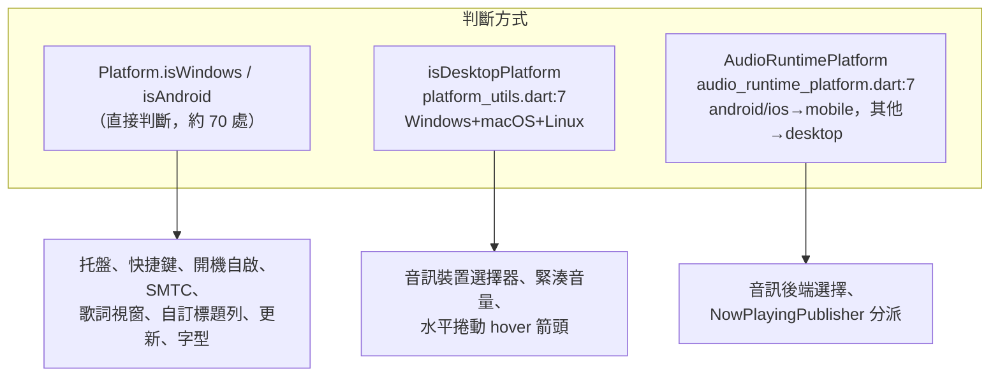
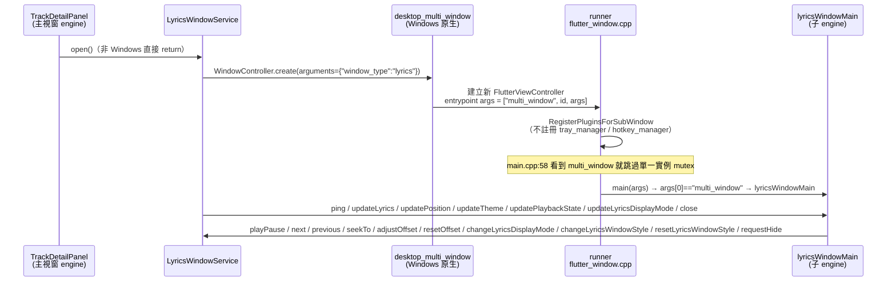

# 平台現況審計

> 現況描述，未經確認，不代表目標。

- 審計基準：分支 `docs/audit`，HEAD `6d78fe23`，2026-09-26。
- 範圍：`lib/`（排除 `*.g.dart`）、`android/`、`windows/`、`pubspec.yaml` / `pubspec.lock`、`.github/workflows/`。
- 證據優先序：實際執行行為 > 程式碼 > 測試 > 文檔／註釋。本次**沒有實際執行**任何平台建置，所有「落到 iOS / macOS / Linux 會怎樣」都是讀程式碼推導的，標**推測**。
- 套件平台支援：一律取自 pub.dev（`/api/packages/<name>/score` 的 `platform:*` 標籤、`/api/packages/<name>/versions/<lock 版本>` 的 `flutter.plugin.platforms`），以及本機 pub cache 中 lock 版本的原始碼／README。取資料日 2026-09-26。

## 0. 摘要

- repo 只有 `android/` 與 `windows/` 兩個原生目錄，沒有 `linux/`、`macos/`、`ios/`（`ls` 結果；`docs/adr/0003-two-audio-backends.md:32` 也這樣寫）。CI 與 release 只建 APK 與 Windows（`.github/workflows/ci.yml:122,155`、`release.yml:155,256`）。README 徽章寫 `Android | Windows`（`README.md:9`）。
- 平台判斷共 **88 處決策點**（grep 原始命中 103 行，扣掉註解、helper 定義與測試覆寫管線）：81 處直接用 `Platform.isX` 或 `isDesktopPlatform`，7 處經 `AudioRuntimePlatform` 間接判斷。另有 2 處 Android SDK 版本判斷。全 repo 沒有 `kIsWeb`、`defaultTargetPlatform`、`TargetPlatform.` 的使用。
- 判斷寫法有三種並存：`Platform.isWindows` 直接判斷（最多）、`isDesktopPlatform`（`lib/core/utils/platform_utils.dart:7`，Windows/macOS/Linux 都算），以及 `AudioRuntimePlatform`（`lib/services/audio/audio_runtime_platform.dart:7-19`，mobile / desktop 二分，未知 OS 落 desktop）。同一個功能常同時用到其中兩種。例如桌面 UI 控制元件用 `isDesktopPlatform`，但托盤、快捷鍵、SMTC、歌詞視窗用 `Platform.isWindows`。所以在 macOS / Linux 上，前者會出現、後者整組消失。

## 1. 平台判斷位置（按功能分組）

「分支」欄寫出該判斷在 iOS / macOS / Linux 會走哪條路。這三個平台的路徑全部**未驗證**（repo 無原生目錄，無法建置）。

### 1.1 音訊後端與系統媒體控制（13 處）

| 位置 | 用途 | iOS / macOS / Linux 落點（**未驗證**） |
|---|---|---|
| `lib/services/audio/audio_runtime_platform.dart:22`（switch 在 `:8-18`） | 以 `Platform.operatingSystem` 決定 mobile / desktop | iOS→mobile；macOS、Linux→desktop；未知 OS 落到 `default`，也是 desktop（`:16-17`） |
| `lib/providers/audio/audio_controller_provider.dart:28` | mobile→`JustAudioService`，其他→`MediaKitAudioService` | iOS 用 just_audio；macOS、Linux 用 media_kit |
| `lib/services/audio/now_playing_publisher.dart:154,165,187,215,232,263`（6 個 switch） | 正在播放資訊、狀態、能力送往 `FmpAudioHandler`（mobile）或 `WindowsSmtcHandler`（desktop） | macOS / Linux 送進沒初始化的 SMTC handler，每個方法因 `_smtc == null` 直接早退。結果是**沒有任何系統媒體控制**（檔頭註解 `:54-59` 也這樣寫，可信度靠 `windows_smtc_handler.dart:104` 的守衛） |
| `lib/main.dart:167` | Android / iOS 呼叫 `AudioService.init` | iOS 會跑，但沒有 `Info.plist` 背景模式設定（**推測**：沒有背景播放，也可能 init 失敗，失敗時退回 dummy handler，見 `:186-194`）；macOS / Linux 只建 dummy handler（`:196-198`） |
| `lib/main.dart:202` | Windows / Linux / macOS 呼叫 `MediaKit.ensureInitialized()` | Linux：media_kit 預設用系統安裝的 libmpv（事實，media_kit README）。沒裝就在 init 或播放時失敗（**推測**），失敗會被 catch 並記 log（`:205-215`）。macOS：pubspec 沒有 macOS libmpv 套件（**推測**：播放失敗） |
| `lib/main.dart:219` | Windows 平行初始化 SMTC 與 window_manager，並清理舊更新檔 | 其他平台不進這條路 |
| `lib/services/audio/windows_smtc_handler.dart:104` | 非 Windows 不建立 `SMTCWindows` | 三平台都早退 |
| `lib/core/third_party_licenses.dart:24` | 只有 Windows 登記 libmpv / FFmpeg 授權 | macOS / Linux 若真的帶了 libmpv，授權頁不會列出（**推測**：授權揭露缺口） |

### 1.2 視窗、托盤、快捷鍵、開機自啟（16 處）

| 位置 | 用途 | iOS / macOS / Linux 落點（**未驗證**） |
|---|---|---|
| `lib/main.dart:232` | Linux / macOS 只初始化 window_manager | 會跑 `_initializeWindowManager`，設定 `TitleBarStyle.hidden`（`lib/main.dart:329`） |
| `lib/main.dart:340` | 只有 Windows 設 `setPreventClose(true)`（關閉時縮到托盤） | macOS / Linux 關視窗就直接結束 |
| `lib/app.dart:95` | 只有 Windows watch 托盤、快捷鍵、開機自啟、快捷鍵設定的 provider | macOS / Linux 完全沒有這些功能，雖然對應套件支援它們（見 §4） |
| `lib/app.dart:182` | 只有 Windows 插入 `CustomTitleBar` | macOS / Linux 的系統標題列被 `TitleBarStyle.hidden` 藏起來，又沒有自訂標題列。**推測**：Linux 沒有拖曳區與視窗按鈕；macOS 的 window_manager 在 hidden 模式下通常保留紅綠燈，但沒有拖曳區 |
| `lib/ui/widgets/layout/immersive_player_scaffold.dart:82` | 只有 Windows 在沉浸式播放器頂部放 `DragToMoveArea` | macOS / Linux 無法拖曳這頁（**推測**） |
| `lib/providers/system/windows_desktop_provider.dart:13` | 非 Windows 時 provider 回傳 null | 三平台都是 null |
| `lib/services/platform/windows_desktop_service.dart:51,65,182,207,283,402,423`（7 處） | 托盤初始化、dispose、tooltip、托盤選單、快捷鍵同步、關閉意圖、縮到托盤 | 全部早退 |
| `lib/ui/pages/settings/settings_page.dart:153,162` | 只有 Windows 顯示「桌面設定」區塊（開機自啟、縮到托盤、全域快捷鍵） | 三平台都看不到 |
| `lib/ui/pages/settings/widgets/settings_backup.dart:334` | 匯入備份後，只有 Windows 重新整理桌面設定 provider | 不影響 |

Windows 專屬的寫死路徑沒有另外的平台守衛，靠呼叫端守衛保護：`windows_desktop_service.dart:95-99`（反斜線路徑）、`:472`（`tasklist`）、`update_service.dart:57`（`unins000.exe`）。

### 1.3 桌面歌詞視窗（1 處）

| 位置 | 用途 | 落點（**未驗證**） |
|---|---|---|
| `lib/services/lyrics/lyrics_window_service.dart:162`（實作在 `:54`） | `open()` 在非 Windows 直接 return | macOS / Linux：按鈕點了沒反應。按鈕本身（`lib/ui/widgets/panels/track_detail_panel.dart:534-560`）**沒有平台守衛**，只看是否顯示歌詞、是否電台；Detail Panel 是否出現由寬度決定（`lib/ui/layouts/responsive_scaffold.dart:124`），**推測**：Android 寬版面也會看到這顆沒作用的按鈕 |

### 1.4 自動更新（18 處）

| 位置 | 用途 | iOS / macOS / Linux 落點（**未驗證**） |
|---|---|---|
| `lib/services/update/update_service.dart:55` | 判斷是否為安裝版（`unins000.exe`） | false |
| `:66` | 用 `getprop` 讀 Android ABI | 回傳 `universal` |
| `:98`、`:110`、`:116` | 依平台決定資產檔名與 `selectedAsset` | `selectedAsset` 為 null（`:121`） |
| `:227`、`:296`、`:304` | APK 快取檢查、安裝權限 MethodChannel | 早退，或直接回傳 true |
| `:260` | 清理舊 Windows 更新檔 | 早退 |
| `:392` | Android 預取 ABI | 跳過 |
| `:454`、`:459` | 取得 Windows 資產大小 | 跳過 |
| `:524`、`:526` | 分派 Android 下載、Windows 安裝程式或 zip | 會先在 `:521` 丟 `No download URL for current platform`（因為 `downloadUrl` 為 null）；`:535` 的 `UnsupportedError` 實際到不了 |
| `lib/providers/system/update_provider.dart:151`、`:183` | Android 下載完觸發安裝並檢查安裝權限 | — |
| `lib/ui/widgets/dialogs/update_dialog.dart:165`、`:263` | Android 顯示 ABI 標籤；Windows 顯示「安裝後重啟」文案 | **推測**：三平台都能檢查到新版、開出更新對話框，按下載後才報錯。檢查更新入口 `lib/ui/pages/settings/widgets/settings_about.dart:70` 沒有平台守衛 |

### 1.5 下載、儲存權限、備份匯出（13 處，另含 2 處 SDK 版本判斷）

| 位置 | 用途 | iOS / macOS / Linux 落點（**未驗證**） |
|---|---|---|
| `lib/services/download/download_path_manager.dart:36` | Android 選目錄前先要儲存權限 | 直接開 `FilePicker.getDirectoryPath()`，再用寫入測試檔驗證（`:59-68`） |
| `lib/services/download/download_path_utils.dart:199` | Android 預設下載根目錄是 `getExternalStorageDirectory()` 往上四層加 `Music/FMP`（`:200-206`） | 其他平台用 `getApplicationDocumentsDirectory()/FMP`（`:214-215`） |
| `lib/ui/pages/settings/widgets/settings_storage.dart:60` | 非 Android 才顯示「變更下載路徑」 | iOS 會顯示。**推測**：iOS 選到沙盒外的目錄時，`dart:io` 寫不進去，寫入測試會失敗並跳錯誤。Android 使用者只能在第一次下載時透過 `DownloadPathSetupDialog` 選一次（`lib/ui/pages/library/playlist_detail_page.dart:960-962`），之後不能在設定頁改 |
| `lib/services/platform/storage_permission_service.dart:70,83,175`（另有 `:72,86` 的 Android 11 判斷） | 經自有 MethodChannel 檢查、請求 `MANAGE_EXTERNAL_STORAGE` 或舊版儲存權限 | 非 Android 一律回傳 true |
| `lib/services/backup/backup_service.dart:58` | Android 用 `getDirectoryPath`，其他平台用 `saveFile` | iOS 會走 `saveFile`，而且**沒傳 `bytes`**。file_picker 11.0.3 的文檔說行動平台的 `saveFile` 會直接用傳入的 bytes 存檔（pub cache `file_picker-11.0.3/lib/src/file_picker.dart:172`）。**推測**：iOS 匯出失敗或得到空檔 |
| `lib/ui/pages/settings/log_viewer_page.dart:123` | 匯出 log，同上 | 同上（**推測**） |
| `lib/services/backup/backup_service.dart:693,697,701,704,707` | 匯入備份時，桌面專屬設定只在 Windows 還原 | macOS / Linux 保留目前值 |

### 1.6 登入（5 處）

| 位置 | 用途 | iOS / macOS / Linux 落點（**未驗證**） |
|---|---|---|
| `lib/ui/pages/settings/bilibili_login_page.dart:86,90` | 依平台設定 WebView 的偽裝 UA（Android、iOS、其他＝Windows Chrome） | 登入頁在所有平台都有「WebView」與「QR」兩個分頁（`:48-63`）。Linux：flutter_inappwebview 6.1.5 沒有 Linux 實作（事實，§4），**推測** WebView 分頁無法使用，QR 分頁可用 |
| `lib/ui/pages/settings/netease_login_page.dart:32,52` | Android 有 WebView 與 QR；其他平台只有 QR（`:74-78`） | 三平台只有 QR |
| `lib/ui/pages/settings/youtube_login_page.dart:61` | Android UA 去掉 `;wv`；其他平台用 Windows Chrome UA | YouTube **只有 WebView 登入**（`:322-326`，沒有 QR）。**推測**：Linux 完全無法登入 YouTube；iOS / macOS 送出 Windows UA 的 WKWebView 能不能通過 Google 登入，無法判斷 |

登出時的 cookie 清除（`lib/services/account/bilibili_account_service.dart:306`、`netease_account_service.dart:279`、`youtube_account_service.dart:145`）沒有平台判斷，但都包在 try/catch 裡，失敗只記 warning。

### 1.7 外部連結（3 處）

| 位置 | 用途 | 落點（**未驗證**） |
|---|---|---|
| `lib/services/platform/url_launcher_service.dart:105,120,133` | Android / iOS 先試 `bilibili://` 等 App scheme，失敗再開網頁 | iOS 會試 App scheme；macOS / Linux 直接開網頁 |

### 1.8 UI 版面、主題、字型（14 處）

| 位置 | 用途 | iOS / macOS / Linux 落點（**未驗證**） |
|---|---|---|
| `lib/ui/pages/player/player_page.dart:276,283` | 桌面顯示音訊裝置選擇器與緊湊音量 | macOS / Linux 會顯示，裝置清單來自 media_kit |
| `lib/ui/pages/radio/radio_player_page.dart:64,71` | 同上（電台） | 同上 |
| `lib/ui/widgets/player/mini_player.dart:96`、`lib/ui/widgets/radio/radio_mini_player.dart:96` | 桌面在迷你播放器插入 `MiniPlayerDesktopControls` | 同上 |
| `lib/ui/widgets/layout/horizontal_scroll_section.dart:149,152,176,234,246`（`_isDesktop` 定義在 `:51`） | 桌面有 hover 左右箭頭與不同的 scroll physics | macOS / Linux 同 Windows |
| `lib/ui/theme/app_theme.dart:71` | Windows 有中日文字型清單 | 其他平台的清單內容在 `:71` 之後（本次未展開） |
| `lib/ui/theme/app_theme.dart:97` | Windows 的 CJK fallback 是微軟雅黑；其他平台是 `Noto Sans SC` | pubspec 的 assets 只有 `assets/icon/` 與 `licenses/`，**沒有內建 Noto Sans SC**。**推測**：iOS / macOS / Linux 退回系統字型，Linux 沒裝 CJK 字型時會出現方框 |
| `lib/ui/pages/settings/widgets/settings_appearance.dart:322` | 「系統預設」字型名稱標示：Windows 顯示 Segoe UI，其他顯示 Roboto | iOS / macOS 的標示不正確（**推測**） |

### 1.9 快取與記憶體預設值、開發者工具（5 處）

| 位置 | 用途 | 落點 |
|---|---|---|
| `lib/main.dart:156` | 圖片記憶體快取：行動 100 張 / 50 MB，桌面 200 張 / 80 MB | iOS 用行動設定，macOS / Linux 用桌面設定 |
| `lib/core/services/network_image_cache_service.dart:140` | 磁碟圖片快取預設：行動 16 MB，桌面 32 MB | 同上 |
| `lib/data/database/database_migration.dart:108` | 全新安裝時 `maxCacheSizeMB` 的初值 | 同上 |
| `lib/services/backup/backup_data.dart:510`（使用在 `:512`） | 備份還原時的快取預設 | 同上 |
| `lib/ui/pages/settings/developer_options_page.dart:202` | 只有 Android、Windows、Linux 讀取 `ProcessInfo.currentRss` | iOS / macOS 顯示不到 RSS |

### 1.10 其他

- `lib/main.dart:96`：`args.firstOrNull == 'multi_window'` 會轉進歌詞子視窗入口。這是命令列參數判斷，不是平台判斷，但只在 desktop_multi_window 建立子引擎時才會發生（見 §3.7）。
- 測試：`test/services/audio/audio_runtime_platform_test.dart:11-29` 測了 `selectAudioRuntimePlatform` 的字串對應（包含 linux 與 ios）。CI 在 `ubuntu-latest` 跑測試（`.github/workflows/ci.yml:34-35`），所以單元測試執行時 `Platform.isLinux == true`。**推測**：凡是直接讀 `Platform.isX`、又沒有 override 的程式碼，測試跑的其實是 Linux 分支。`storage_permission_service.dart:51` 與 `update_provider.dart:60` 為此留了 override。

### 1.11 計數

| 分組 | 決策點 |
|---|---|
| 音訊後端與媒體控制 | 13（含 7 處 `AudioRuntimePlatform`） |
| 視窗、托盤、快捷鍵、開機自啟 | 16 |
| 桌面歌詞視窗 | 1 |
| 自動更新 | 18 |
| 下載、儲存、備份匯出 | 13（另加 2 處 Android SDK 判斷） |
| 登入 | 5 |
| 外部連結 | 3 |
| UI 版面、主題、字型 | 14 |
| 快取預設、開發者工具 | 5 |
| **合計** | **88**（+2 SDK 判斷） |

> `lib/main.dart:219` 同時屬於音訊與視窗，只在音訊組計一次；1.10 的 `multi_window` 不計入。原始 grep 命中 103 行，差額是註解（`platform_utils.dart:6`、`audio_service.dart:43`、`now_playing_publisher.dart:50,51,57`、`mini_player_desktop_controls.dart:16`）、helper 或抽象定義（`platform_utils.dart:7-8`、`update_provider.dart:60,62,65,71`、`storage_permission_service.dart:120`、`lyrics_window_service.dart:38,54`、`horizontal_scroll_section.dart:51`），以及只是檔名比對、不是平台判斷的 `update_service.dart:268,282`。

## 2. iOS / macOS / Linux 分支總覽（全部**未驗證**）

repo 沒有這三個平台的原生目錄，所以下表是「如果補上 runner、能建置起來，程式碼會走的路」。

| 平台 | 明寫的分支 | 經 `else` 或 desktop 預設落入的路徑 | 預期結果（**推測**） |
|---|---|---|---|
| iOS | `main.dart:156,167`、`network_image_cache_service.dart:140`、`database_migration.dart:108`、`backup_data.dart:510`、`url_launcher_service.dart:105,120,133`、`bilibili_login_page.dart:90`、`audio_runtime_platform.dart:10` | 桌面判斷以外的所有 `else`：更新（丟錯）、下載路徑（Documents/FMP）、備份與 log 匯出（`saveFile` 沒有 bytes）、網易雲只有 QR、YouTube 用 Windows UA 的 WebView、字型 fallback `Noto Sans SC` | 播放走 just_audio 加 audio_service，在程式碼裡是三平台中最完整的一條路；但缺背景模式與 ATS 設定（§6），匯出流程可能壞掉，更新入口會出現卻不能用 |
| macOS | `main.dart:202,232`、`platform_utils.dart:8`、`audio_runtime_platform.dart:14` | 桌面 UI 控制元件會出現；托盤、快捷鍵、開機自啟、SMTC、歌詞視窗、自訂標題列、關閉縮托盤全部沒有；更新丟錯 | media_kit 沒有 macOS libmpv 套件，無法播放；沒有系統媒體控制；標題列藏起來卻沒有替代 |
| Linux | `main.dart:202,232`、`platform_utils.dart:8`、`developer_options_page.dart:202`、`audio_runtime_platform.dart:13` | 同 macOS，另外 WebView 登入不可用 | 系統有裝 libmpv 才能播放；YouTube 無法登入；沒有 MPRIS |

其他注意事項：

- `audio_service` 本身支援 macOS（pub.dev 標籤），但 `main.dart:167` 只在 Android / iOS 啟用，所以 macOS 的媒體控制是**刻意不接，還是漏掉**，程式碼看不出來，查不到。
- ADR 0003 說 Linux / macOS 的殘留分支「建置不出來」、「不是支援平台」（`docs/adr/0003-two-audio-backends.md:32-37`），和程式碼行為**一致**。但 `isDesktopPlatform` 的註解（`platform_utils.dart:3`）與 `audio_controller_provider.dart:23-25` 的註解寫「Windows/Linux」，讀起來像有支援。`pubspec.yaml:24` 寫「FMP 不出 Linux/macOS」。這些註解之間**不一致**（對「是否支援」的立場不同）。

## 3. 平台綁定功能

| 功能 | Android | Windows | 使用的套件或原生碼 | 其他平台 |
|---|---|---|---|---|
| 音訊後端 | ✅ just_audio 0.10.6（ExoPlayer）＋audio_session | ✅ media_kit 1.2.6（libmpv）＋media_kit_libs_windows_audio 1.0.9 | `audio_controller_provider.dart:26-32`；`just_audio_service.dart:166-167`；`media_kit_audio_service.dart:166-259` | iOS 走 just_audio（**未驗證**）；macOS / Linux 走 media_kit，但缺平台 libs |
| 系統媒體控制 | ✅ audio_service 0.18.18（通知列、耳機鍵） | ✅ smtc_windows 1.1.0（SMTC），**不支援 seek**（`now_playing_publisher.dart:283-284` 的註解） | Android：`MainActivity : AudioServiceActivity`（`MainActivity.kt:14`）、Manifest 的 service 與 receiver（`AndroidManifest.xml:64-82`）。Windows：`main.cpp:43` 設定 AppUserModelID、`windows_smtc_handler.dart` | 無 |
| 自動更新 | ✅ GitHub release APK（依 ABI），`open_filex` 安裝，MethodChannel 檢查安裝權限 | ✅ 安裝版：下載 Inno 安裝程式，帶 `/SILENT /DIR= /CLOSEAPPLICATIONS` 啟動後 `exit(0)`（`update_service.dart:613-620`）。免安裝版：下載 zip，寫 `.bat`＋`.vbs` 交給 `wscript` 覆蓋後 `exit(0)`（`:624-685`、批次腳本約 `:840-866`） | Manifest 的 `REQUEST_INSTALL_PACKAGES`（`AndroidManifest.xml:14`）與 `<queries>`（`:96-99`）；pubspec 的 `inno_bundle` 設定 | 三平台會檢查、會提示新版，但下載時丟錯（§1.4） |
| 儲存權限與下載路徑 | ✅ `MANAGE_EXTERNAL_STORAGE`（Android 11 以上）或舊版讀寫權限，全部走自有 MethodChannel（刻意不用 permission_handler，見 `storage_permission_service.dart:22-24`）。預設路徑 `/…/Music/FMP` | ✅ 預設 `Documents\FMP`，可用 file_picker 改 | `MainActivity.kt:20-35,62-136`；`AndroidManifest.xml:17-23` | iOS：Documents/FMP（沙盒內）。macOS / Linux：Documents/FMP |
| 登入 WebView | ✅ flutter_inappwebview（Android WebView），B 站、網易雲、YouTube | ✅ flutter_inappwebview（WebView2），B 站、YouTube；網易雲只有 QR | Windows：`windows/CMakeLists.txt:60-73` 補了建置 workaround（上游 PR #2869）。Android：`gradle.properties:9-12` 補了 proguard workaround（上游 #2852）（核查更正行號，原寫 `:147-150`；該檔只有 12 行） | Linux 沒有實作 |
| 托盤 | ❌ | ✅ tray_manager 0.5.3（圖示、選單、tooltip 顯示當前歌曲） | `windows_desktop_service.dart:85-178`；圖示由 `windows/CMakeLists.txt:125-128` 安裝到 exe 旁 | 套件支援 macOS / Linux，程式碼只開 Windows |
| 全域快捷鍵 | ❌ | ✅ hotkey_manager 0.2.3，可自訂組合（`HotkeyConfig`） | `windows_desktop_service.dart:275-320` | 套件支援 macOS / Linux，程式碼只開 Windows |
| 開機自啟 | ❌ | ✅ launch_at_startup 0.5.1（寫登錄檔，依賴 win32_registry），可帶 `--minimized` | `desktop_settings_provider.dart:117-157`；`flutter_window.cpp:73-91` 讀 `--minimized` 決定要不要顯示視窗（核查更正行號，原寫 `:169-187`；該檔只有 130 行）；`main.dart:140` | macOS 需要額外的原生程式碼（套件 README） |
| 關閉時縮到托盤、單一實例 | ❌ | ✅ `setPreventClose(true)`（`main.dart:340-342`）＋`handleCloseIntent`。單一實例用具名 mutex `Local\FMP_MainInstance`，再用 `FindWindowW` 喚醒既有視窗（`main.cpp:13-36,57-68`）。偵測到安裝程式在跑時自行退出（`windows_desktop_service.dart:415-418,470-490`，`tasklist`） | runner C++ | 無 |
| 桌面歌詞視窗 | ❌ | ✅ desktop_multi_window 0.3.1，獨立 Flutter engine，`WindowMethodChannel('lyrics_sync')` 雙向溝通 | 見 §3.7 | 套件支援 macOS / Linux，程式碼只開 Windows |
| 自訂標題列 | ❌（Android 改畫 status bar 色塊，`app.dart:193-199`） | ✅ `CustomTitleBar`＋window_manager `TitleBarStyle.hidden` | `lib/ui/widgets/app_bars/custom_title_bar.dart` | macOS / Linux 標題列被藏起來，卻沒有替代（§1.2） |

### 3.7 歌詞多視窗機制

- 入口參數 `"multi_window"` 是套件原生端寫死的。Windows 在 pub cache `desktop_multi_window-0.3.1/windows/flutter_window.cc:24`，macOS 在 `…/macos/…/FlutterMultiWindowPlugin.swift:108`。
- 子視窗只註冊 6 個插件（`flutter_window.cpp:14-37`）。（核查更正行號）註解寫的原因：tray_manager 與 hotkey_manager 用全域 static channel，註冊到子 engine 會蓋掉主視窗的；window_manager 也有同樣問題，改用 `handleCloseIntent` 繞過。這一點沒有在執行中驗證，屬於註解主張。
- 關閉子視窗時用隱藏而不銷毀（`lyrics_window_service.dart:112` 的註解說明原因是 window_manager channel 會被清掉）。
- 套件 README 建議搭配 window_manager 時使用 `boyan01/window_manager` 的 fork；FMP 用的是 pub.dev 上的 window_manager 0.4.3，不是 fork（`pubspec.lock`）。實際影響查不到。
- 要移植到 macOS / Linux，需要在 `MainFlutterWindow.swift` 或 `my_application.cc` 加上子視窗插件註冊（套件 README）。`lyrics_window_service.dart:162` 的 `isWindows` 守衛也要放寬。

### 3.8 MethodChannel 配對

| Channel | Dart 端 | 原生端 | 方法 |
|---|---|---|---|
| `com.personal.fmp/platform` | `lib/services/platform/storage_permission_service.dart:26`（`:125-176`） | `android/app/src/main/kotlin/com/personal/fmp/MainActivity.kt:20-35` | `getAndroidSdkInt`、`isManageExternalStorageGranted`、`isStorageGranted`、`requestManageExternalStorage`、`requestStorage`、`openAppSettings` |
| `com.personal.fmp/platform`（同一個 channel） | `lib/services/update/update_service.dart:211`（`:297,305`） | 同上 | `canRequestPackageInstalls`、`openInstallPermissionSettings` |
| `lyrics_sync`（`WindowMethodChannel`，雙向） | 主視窗 `lib/services/lyrics/lyrics_window_service.dart:119`；子視窗 `lib/ui/windows/lyrics_window.dart:231` | desktop_multi_window 插件內部轉送 | 見上方序列圖；兩端名稱一一對上（主→子：`lyrics_window_service.dart:240,271,307,335,394,415,430` 對 `lyrics_window.dart:272-289`；子→主：`lyrics_window.dart:392-506` 對 `lyrics_window_service.dart:472-515`） |

- repo 沒有 EventChannel 或 BasicMessageChannel。Windows runner 沒有自訂 channel。
- 兩個 Dart 類別各自宣告同名的 channel 常數，原生端只有一個 handler。沒有測試守住兩邊的方法名，**推測**：拼錯時只會在執行期拿到 `notImplemented`。

## 4. 依賴套件平台支援

來源：pub.dev score API 的 `platform:*` 標籤（**反映的是最新版**）。lock 版本和最新版不同的插件，改用 `/api/packages/<name>/versions/<lock 版本>` 的 `flutter.plugin.platforms` 核對過，結果列在備註。所有直接依賴都來自 pub.dev（hosted），**沒有 git 或 path fork**，也沒有 `dependency_overrides`。

✅ 支援、❌ 不支援；「套件」指 Dart-only 套件，由 pub.dev 分析推得的平台。

### 4.1 dependencies

| 套件 | pubspec 約束 | lock 版本 | 來源 | Android | Windows | Linux | macOS | iOS | 用途 | 備註（最新版與發佈日） |
|---|---|---|---|---|---|---|---|---|---|---|
| flutter_riverpod | ^3.4.3 | 3.4.3 | pub | ✅ | ✅ | ✅ | ✅ | ✅ | 狀態管理 | 最新 3.4.3（2026-09-03） |
| isar_community | ^3.3.2 | 3.3.2 | pub | ✅ | ✅ | ✅ | ✅ | ✅ | 資料庫 | 3.3.2（2026-03-23）。Isar 社群 fork，已發佈在 pub.dev |
| isar_community_flutter_libs | ^3.3.2 | 3.3.2 | pub（插件） | ✅ | ✅ | ✅ | ✅ | ✅ | Isar 原生庫 | lock 版本 pubspec 列了 5 個平台 |
| path_provider | ^2.1.6 | 2.1.6 | pub（插件） | ✅ | ✅ | ✅ | ✅ | ✅ | 路徑 | 無 web 標籤 |
| path | ^1.9.0 | 1.9.1 | pub | ✅ | ✅ | ✅ | ✅ | ✅ | 路徑運算 | 2024-10-17 |
| just_audio | ^0.10.6 | 0.10.6 | pub（插件） | ✅ | ❌ | ❌ | ✅ | ✅ | Android 音訊後端 | Windows / Linux 要另加實作套件（README）。iOS / macOS 帶 headers 時走本機 proxy，需要 ATS 設定（README） |
| media_kit | ^1.1.11 | 1.2.6 | pub | ✅ | ✅ | ✅ | ✅ | ✅ | Windows 音訊後端 | Dart 層支援全平台，但**每個平台要另加原生庫**，FMP 只有 Windows 的。1.2.6 是最新（2025-12-13）；約束寫 ^1.1.11，和 lock 差很多 |
| media_kit_libs_windows_audio | ^1.0.9 | 1.0.9 | pub（插件） | ❌ | ✅ | ❌ | ❌ | ❌ | Windows 的 libmpv | pub.dev 標記 **`is:unlisted`**；最後發佈 2023-09-27。官方 README 現在建議用 `media_kit_libs_audio` 1.0.7（全平台，2025-10-05；但它在 pub.dev 同樣標 `is:unlisted`，核查補充） |
| rxdart | ^0.28.0 | 0.28.0 | pub | ✅ | ✅ | ✅ | ✅ | ✅ | Stream 組合 | 2024-06-14 |
| audio_service | ^0.18.15 | 0.18.18 | pub（插件） | ✅ | ❌ | ❌ | ✅ | ✅ | Android 媒體通知 | lock 版本的平台是 android、ios、macos、web。Linux 要另加 `audio_service_mpris`（README）。最新 0.18.19（2026-06-29） |
| audio_session | ^0.2.4 | 0.2.4 | pub（插件） | ✅ | ❌ | ❌ | ✅ | ✅ | 音訊焦點與中斷 | 沒有 Windows / Linux 實作；`just_audio_service.dart:166` 只在 Android 路徑使用 |
| smtc_windows | ^1.1.0 | 1.1.0 | pub（ffiPlugin，flutter_rust_bridge） | ❌ | ✅ | ❌ | ❌ | ❌ | Windows SMTC | 2025-08-18 |
| dio | ^5.11.1 | 5.11.1 | pub | ✅ | ✅ | ✅ | ✅ | ✅ | HTTP | 2026-09-04 |
| crypto | ^3.0.3 | 3.0.7 | pub | ✅ | ✅ | ✅ | ✅ | ✅ | 雜湊 | — |
| encrypt | ^5.0.3 | 5.0.3 | pub | ✅ | ✅ | ✅ | ✅ | ✅ | 加解密 | 最後發佈 **2023-09-18** |
| youtube_explode_dart | ^3.1.0 | 3.1.0 | pub | ✅ | ✅ | ✅ | ✅ | ✅ | YouTube 解析 | 2026-05-09 |
| go_router | ^18.0.1 | 18.0.1 | pub | ✅ | ✅ | ✅ | ✅ | ✅ | 路由 | Flutter Favorite |
| url_launcher | ^6.3.1 | 6.3.2 | pub（插件） | ✅ | ✅ | ✅ | ✅ | ✅ | 開外部連結 | 2025-07-10 |
| scrollable_positioned_list | ^0.3.8 | 0.3.8 | pub | ✅ | ✅ | ✅ | ✅ | ✅ | 跳到指定索引 | 最後發佈 **2023-05-08** |
| cached_network_image | ^4.0.0 | 4.0.0 | pub | ✅ | ✅ | ✅ | ✅ | ✅ | 圖片快取 | 最新 4.0.2（2026-09-23） |
| flutter_cache_manager | ^3.4.2 | 3.4.2 | pub | ✅ | ✅ | ✅ | ✅ | ✅ | 快取管理 | 最新 3.4.5 |
| tray_manager | ^0.5.3 | 0.5.3 | pub（插件） | ❌ | ✅ | ✅ | ✅ | ❌ | 系統托盤 | lock 版本支援 linux、macos、windows。最新 0.7.0（2026-09-19）。0.5.3 在 Linux 需要 `libayatana-appindicator3`（pub cache README `:97-108`）；0.7.0 改用 StatusNotifierItem，但 Linux 仍收不到點擊事件（0.7.0 README） |
| window_manager | ^0.4.3 | 0.4.3 | pub（插件） | ❌ | ✅ | ✅ | ✅ | ❌ | 視窗控制 | lock 版本發佈於 2024-10-27；最新 0.5.2（2026-07-04） |
| hotkey_manager | ^0.2.3 | 0.2.3 | pub（插件） | ❌ | ✅ | ✅ | ✅ | ❌ | 全域快捷鍵 | 最後發佈 **2024-05-18**。Linux 需要 `keybinder-3.0`（README） |
| package_info_plus | ^9.0.1 | 9.0.1 | pub（插件） | ✅ | ✅ | ✅ | ✅ | ✅ | 版本資訊 | 最新 10.2.1。`gradle.properties:3-6` 說它是 `builtInKotlin=false` 的原因（核查更正行號） |
| open_filex | ^4.5.0 | 4.7.0 | pub（插件） | ✅ | ❌ | ❌ | ❌ | ✅ | 開啟 APK 安裝 | 只支援 android、ios；2025-03-06 |
| archive | ^4.2.0 | 4.2.0 | pub | ✅ | ✅ | ✅ | ✅ | ✅ | 解壓 Windows zip 更新 | 最新 4.3.0 |
| flutter_inappwebview | ^6.1.5 | 6.1.5 | pub（federated 插件） | ✅ | ✅ | ❌ | ✅ | ✅ | 登入 WebView | **沒有 Linux**。最後發佈 **2024-10-08**。本地建置要靠兩處 workaround（§3） |
| qr_flutter | ^4.1.0 | 4.1.0 | pub | ✅ | ✅ | ✅ | ✅ | ✅ | QR 登入 | 最後發佈 **2023-05-14** |
| flutter_secure_storage | ^10.3.1 | 10.3.1 | pub（插件） | ✅ | ✅ | ✅ | ✅ | ✅ | 憑證儲存 | 最新 11.2.0；大版本被刻意釘住（`pubspec.yaml:69-74`）。Linux 需要 libsecret 與 keyring 服務；macOS / iOS 需要 keychain entitlement（README） |
| pointycastle | ^3.9.1 | 3.9.1 | pub | ✅ | ✅ | ✅ | ✅ | ✅ | RSA | 最新 4.0.0 |
| file_picker | ^11.0.3 | 11.0.3 | pub（插件） | ✅ | ✅ | ✅ | ✅ | ✅ | 選目錄、存檔 | 最新 13.1.0。macOS 需要 User Selected File entitlement（原始碼文檔）。`android/build.gradle.kts:18-26` 有它的 KGP workaround（核查更正行號，原寫 `:82-90`；該檔只有 48 行） |
| collection | ^1.19.1 | 1.19.1 | pub | ✅ | ✅ | ✅ | ✅ | ✅ | 工具 | — |
| equatable | ^2.1.0 | 2.1.0 | pub | ✅ | ✅ | ✅ | ✅ | ✅ | 值相等 | 最新 3.0.0 |
| slang_flutter | ^4.19.0 | 4.19.0 | pub | ✅ | ✅ | ✅ | ✅ | ✅ | i18n | 來源在 codeberg |
| intl | any | 0.20.3 | pub | ✅ | ✅ | ✅ | ✅ | ✅ | 日期與數字格式 | 刻意不釘版本（`pubspec.yaml:81-82`） |
| flutter_localizations | sdk | — | SDK | ✅ | ✅ | ✅ | ✅ | ✅ | 本地化 | — |
| simple_icons | ^16.23.0 | 16.23.0 | pub | ✅ | ✅ | ✅ | ✅ | ✅ | 品牌圖示 | — |
| reorderable_grid_view | ^2.2.8 | 2.2.8 | pub | ✅ | ✅ | ✅ | ✅ | ✅ | 可拖曳網格 | 最後發佈 **2023-11-20** |
| launch_at_startup | ^0.5.1 | 0.5.1 | pub | ❌ | ✅ | ✅ | ✅ | ❌ | 開機自啟 | 2025-04-01。macOS 要自己加原生程式碼（README `:100-171`） |
| desktop_multi_window | ^0.3.1 | 0.3.1 | pub（插件） | ❌ | ✅ | ✅ | ✅ | ❌ | 歌詞子視窗 | 2026-08-26 |

**不支援 Linux 的直接依賴**：just_audio、audio_service、audio_session、media_kit_libs_windows_audio、smtc_windows、open_filex、flutter_inappwebview。

**不支援 macOS**：media_kit_libs_windows_audio、smtc_windows、open_filex。

**不支援 iOS**：media_kit_libs_windows_audio、smtc_windows、tray_manager、window_manager、hotkey_manager、launch_at_startup、desktop_multi_window。

上面三份都是指「套件沒有實作」。就算套件支援，程式碼守衛也可能沒開，見 §2。

可替代的現成套件（pub.dev 標籤，2026-09-26）：`media_kit_libs_audio`（全平台，`is:unlisted`）、`media_kit_libs_linux`（linux）、`media_kit_libs_ios_audio`（ios）、`media_kit_libs_macos_audio`（pub.dev score 沒有平台標籤，查不到）、`audio_service_mpris`（linux）、`just_audio_media_kit`（全平台）、`desktop_webview_window`（windows、linux、macos）。

### 4.2 dev_dependencies

| 套件 | 約束 | lock | 平台 | 用途 |
|---|---|---|---|---|
| flutter_test | sdk | — | — | 測試 |
| build_runner | ^2.4.13 | 2.15.1 | linux、macos、windows（開發機） | Isar codegen |
| isar_community_generator | ^3.3.2 | 3.3.2 | 全平台 | Isar codegen |
| flutter_lints | ^6.0.0 | 6.0.0 | 全平台 | lint |
| slang | ^4.19.2 | 4.19.2 | 全平台 | i18n CLI |
| flutter_launcher_icons | ^0.14.1 | 0.14.4 | 全平台 | 圖示；設定只產 android 與 windows（`pubspec.yaml:128-138`） |
| inno_bundle | ^0.12.0 | 0.12.0 | windows | Windows 安裝程式 |
| http | ^1.6.0 | 1.6.0 | 全平台 | `tool/demo` |
| yaml | ^3.1.4 | 3.1.4 | 全平台 | workflow 測試 |

## 5. 原生目錄

### 5.1 `android/`

版控中的檔案：Gradle 設定、三份 Manifest（main / debug / profile）、`MainActivity.kt`、資源檔。`GeneratedPluginRegistrant.java` 與 `local.properties` 在 `.gitignore` 內（`android/.gitignore:6-7`）。

- **`MainActivity.kt`**（175 行，唯一的自訂 Kotlin）
  - 繼承 `com.ryanheise.audioservice.AudioServiceActivity`（`:14`），這是 audio_service 的要求。
  - `com.personal.fmp/platform` channel 有 8 個方法（`:20-35`）。
  - `MANAGE_EXTERNAL_STORAGE` 透過 `startActivityForResult` 跳設定頁，並有 fallback intent（`:75-103`）；Android 6–10 用 runtime permission（`:105-136`）。
  - 未知來源安裝權限：`canRequestPackageInstalls` 與 `ACTION_MANAGE_UNKNOWN_APP_SOURCES`（`:150-169`）。
- **`AndroidManifest.xml`**
  - 權限：`WAKE_LOCK`、`FOREGROUND_SERVICE`、`FOREGROUND_SERVICE_MEDIA_PLAYBACK`、`INTERNET`、`ACCESS_NETWORK_STATE`、`REQUEST_INSTALL_PACKAGES`、`READ_EXTERNAL_STORAGE`（maxSdk 32）、`WRITE_EXTERNAL_STORAGE`（maxSdk 29）、`MANAGE_EXTERNAL_STORAGE`（`:5-23`）。
  - `usesCleartextTraffic="true"`：註解說網易雲的串流 URL 是 http（`:33-34,40`）。just_audio README 也要求帶 headers 時開 cleartext（本機 proxy）。
  - `allowBackup="false"`：註解說是 flutter_secure_storage 的 keystore 問題，issue #35（`:25-31,41`）。
  - audio_service 的 `AudioService`（`foregroundServiceType="mediaPlayback"`）與 `MediaButtonReceiver`（`:64-82`）。
  - `<queries>`：`PROCESS_TEXT`、APK 的 VIEW intent（`:90-100`）。**沒有**宣告 `bilibili://` 等 scheme。**推測**：`launchUrl` 本身不需要，但如果之後改用 `canLaunchUrl`，Android 11 以上的 package visibility 會回 false。
- **Gradle 的特殊處理**
  - AGP 9.1.0、KGP 2.4.0、Gradle 9.3.1（`settings.gradle.kts:22-23`、`gradle-wrapper.properties:5`）。
  - `android.builtInKotlin=false`，原因是 package_info_plus（`gradle.properties:3-6`）。（核查更正行號）
  - `android.r8.proguardAndroidTxt.disallowed=false`，原因是 flutter_inappwebview_android（`:9-12`）。（核查更正行號）
  - 手動替 `file_picker` 子專案套用 KGP（`build.gradle.kts:18-26`）。（核查更正行號）
  - 所有 library 子專案**強制 `compileSdk = 36`**，缺 namespace 的自動補（`:28-40`）。（核查更正行號）
  - release 簽章：`key.properties` 不存在時退回 debug 簽章（`app/build.gradle.kts:45-52`）。**推測**：本地 release 建置會產出 debug 簽章的 APK，而且沒有任何警告。
  - `minSdk` / `targetSdk` 直接用 Flutter 預設（`app/build.gradle.kts:30-31`）。
- `android/.kotlin/errors/errors-1788852048674.log` 存在於工作目錄，但沒有進版控。這是建置殘留。

### 5.2 `windows/`

版控中的檔案：CMake（根、`flutter/`、`runner/`）與 runner 原始碼。和 Flutter 範本比對，只有 `main.cpp`、`flutter_window.cpp`、`Runner.rc`、`app_icon.ico` 有改（`git diff --stat` 從該目錄的首個 commit 起算：120 行新增、8 行刪除）。

- **`main.cpp`**
  - `SetCurrentProcessExplicitAppUserModelID(L"com.personal.fmp")`，給 SMTC 辨識用（`:43`）。
  - 單一實例：具名 mutex，重複啟動時用 `FindWindowW`（class＋title）找到既有視窗，還原並拉到前景（`:13-36,57-68`）。
  - `multi_window` 啟動時跳過 mutex，讓歌詞子視窗能起來（`:15-17,58`）。
  - **推測**：`ActivateExistingInstance` 靠視窗標題 `FMP - Flutter Music Player` 比對。如果 Dart 端改了標題，就找不到既有視窗，第二個實例會靜默退出。
- **`flutter_window.cpp`**
  - 子視窗選擇性註冊插件（`:14-37`，註冊回呼在 `:63-69`，§3.7）。（核查更正行號）
  - 啟動時讀 `--minimized` 參數，決定首幀後要不要 `Show()`（`:73-91`）。（核查更正行號）
- **`runner.exe.manifest`**：PerMonitorV2 DPI，supportedOS 只列 Windows 10/11（`:1-14`）。
- **根 `CMakeLists.txt`**
  - 替 `flutter_inappwebview_windows_plugin` 加 `_SILENCE_EXPERIMENTAL_COROUTINE_DEPRECATION_WARNINGS` 與 `/FS`，目的是在 VS 2026 下能建置（`:60-73`）。
  - 把 `app_icon.ico` 安裝到 exe 旁，給托盤用（`:125-128`）。
- `runner/CMakeLists.txt` 連結 `dwmapi.lib`（`:36`）。這是 Flutter 範本本來就有的，不是自訂。
- Windows runner **沒有自訂 MethodChannel**。

## 6. 若要支援 Linux / macOS / iOS 會卡住的地方

標記說明：**事實**附來源；**推測**是依程式碼或常識推論，尚未查證。

### 6.1 Linux

| 類別 | 項目 | 標記 |
|---|---|---|
| 缺原生專案 | 沒有 `linux/`，要用 `flutter create --platforms=linux` 產生，並在 `my_application.cc` 加子視窗插件註冊（desktop_multi_window README） | 事實 |
| 套件不支援 | flutter_inappwebview 沒有 Linux → WebView 登入不能用；YouTube 只有 WebView 登入，**等於不能登入 YouTube** | 事實（pub.dev 版本 pubspec）＋推測（對 YouTube 的影響） |
| 套件不支援 | smtc_windows 只有 Windows；audio_service 沒有 Linux → 要另加 `audio_service_mpris`（audio_service README）或自己做 MPRIS，並接進 `NowPlayingPublisher` 的 desktop 分支 | 事實 |
| 套件不支援 | open_filex 沒有 Linux；更新流程在 Linux 沒有對應實作（`update_service.dart:521`） | 事實 |
| 系統依賴 | media_kit 預設用系統的 libmpv（`libmpv-dev`、`mpv`），或改用 Snap / Flatpak 打包（media_kit README）；pubspec 沒有 `media_kit_libs_linux` | 事實 |
| 系統依賴 | flutter_secure_storage 需要 libsecret 與 keyring 服務（gnome-keyring / kwallet）（README）。沒有 keyring 時，`SecureKeyValueStore` 捕捉 `PlatformException`（`secure_key_value_store.dart:63`）並降級，**推測**：每次啟動都要重新登入 | 事實＋推測 |
| 系統依賴 | tray_manager 0.5.3 需要 ayatana-appindicator；GNOME 還要裝 AppIndicator 擴充（README） | 事實 |
| 系統依賴 | hotkey_manager 需要 `keybinder-3.0`（README）；**推測**：keybinder 走 X11，Wayland 下全域快捷鍵不可用 | 事實＋推測 |
| 功能差異 | tray_manager 在 Linux 收不到托盤點擊事件，面板會自己開選單（0.7.0 README）；`WindowsDesktopService` 的點擊處理不會生效 | 事實（0.7.0）；0.5.3 的行為查不到 |
| 程式碼守衛 | 托盤、快捷鍵、開機自啟、歌詞視窗、關閉縮托盤、自訂標題列、SMTC 都寫死 `Platform.isWindows`（§1.2、§1.3），而且檔名與類別名就叫 `Windows*` | 事實（程式碼） |
| 程式碼守衛 | `TitleBarStyle.hidden` 套在所有桌面平台，但自訂標題列只有 Windows（`main.dart:329`、`app.dart:182`） | 事實（程式碼）；推測（使用者看到的樣子） |
| 字型 | CJK fallback 用 `Noto Sans SC`，但沒有內建（`app_theme.dart:97-106`） | 推測 |
| 授權揭露 | libmpv 的授權只在 Windows 登記（`third_party_licenses.dart:24`） | 事實（程式碼） |

### 6.2 macOS

| 類別 | 項目 | 標記 |
|---|---|---|
| 缺原生專案 | 沒有 `macos/`；子視窗註冊要寫在 `MainFlutterWindow.swift`（desktop_multi_window README）；launch_at_startup 要加原生 channel 程式碼與 Xcode 設定（README `:100-171`） | 事實 |
| 套件不支援 | smtc_windows → 要改接 audio_service（它支援 macOS，只是 `main.dart:167` 沒開） | 事實 |
| 套件不支援 | media_kit_libs_windows_audio 只有 Windows → 需要 `media_kit_libs_audio` 或 `media_kit_libs_macos_audio` | 事實 |
| 套件不支援 | open_filex 沒有 macOS；更新流程沒有 macOS 實作 | 事實 |
| Entitlements | 網路：media_kit 與 just_audio 都要求 `com.apple.security.network.client`（README）。檔案：file_picker 要 User Selected File Read/Write（原始碼文檔）。media_kit 建議關掉 sandbox 才能存取檔案（README）。flutter_secure_storage 要 `keychain-access-groups`，還要 provisioning profile，否則只能在建置它的那台 Mac 上跑；或改用 `usesDataProtectionKeychain: false`（README） | 事實 |
| ATS | 網易雲的 http 串流需要 `NSAppTransportSecurity`（just_audio 與 media_kit README 都提到非 HTTPS 要設定） | 事實（README）＋推測（網易雲 URL 的形式在 macOS 上是否一樣） |
| 平台政策 | 在 Mac App Store 上架時，更新只能經 App Store，不能下載或安裝額外程式碼（App Review Guidelines 2.4.5(iv)(vii)）→ 自有更新器與 GitHub 下載流程不成立 | 事實 |
| 平台政策 | 5.2.3 禁止在未經授權下，從第三方來源（例子就包含 YouTube）下載或儲存媒體；5.2.2 要求第三方服務的使用授權 → 下載功能、以及整個 App 本身，在 App Store 上架都有風險 | 事實（guideline）＋推測（審核實際結果） |
| 平台政策 | 不經 App Store 散佈時，需要 Developer ID 簽章與 notarization，否則 Gatekeeper 會擋 | 推測（未查官方來源） |
| 沙盒儲存 | 預設路徑 `getApplicationDocumentsDirectory()/FMP` 在沙盒下會落在 container 內；自選下載目錄要跨次啟動保存，需要 security-scoped bookmark，但程式碼只存字串路徑（`download_path_manager.dart:71-75`） | 推測 |
| 程式碼守衛 | 與 Linux 相同的 `Platform.isWindows` 守衛（§1.2、§1.3）；標題列藏起來卻沒有替代 | 事實（程式碼） |
| 開發者工具 | `ProcessInfo.currentRss` 沒有對 macOS 開（`developer_options_page.dart:202`） | 事實（程式碼） |

### 6.3 iOS

| 類別 | 項目 | 標記 |
|---|---|---|
| 缺原生專案 | 沒有 `ios/` | 事實 |
| 背景播放 | `Info.plist` 要有 `UIBackgroundModes` → `audio`；系統可能在沒有播放音訊時殺掉閒置的程序，README 建議曲間播放靜音（audio_service README）。FMP 在換曲時才解析串流 URL（**推測**），曲間的網路等待有被殺的風險 | 事實＋推測 |
| ATS | just_audio 用本機 proxy 實作 headers（B 站需要 Referer 等 headers），加上網易雲是 http → 需要 `NSAllowsArbitraryLoads`（just_audio README）；也可以改 `useProxyForRequestHeaders: false`，但那依賴未公開的 `AVURLAssetHTTPHeaderFieldsKey` | 事實 |
| 平台政策：更新 | App 不能下載、安裝或執行會改變功能的程式碼（2.5.2）；iOS 沒有讓 App 自己安裝 IPA 的公開途徑 → 整個 `UpdateService` 不成立，檢查更新入口應該移除，因為目前會出現「有新版」卻下載失敗（§1.4） | 事實（2.5.2）＋推測（公開途徑） |
| 平台政策：內容 | 5.2.3（未授權從第三方來源下載或儲存媒體，例子明列 YouTube）與 5.2.2（第三方服務授權）→ 下載功能與非官方 API 串流在 App Store 上架風險很高；側載或 AltStore 類散佈不受這條限制，但有簽章期限等問題 | 事實（guideline）＋推測（散佈管道） |
| 平台政策：登入 | YouTube 登入是在 WebView 開 Google 帳號頁，並偽裝 Windows Chrome UA（`youtube_login_page.dart:60-69`）；Google 會不會在 WKWebView 擋登入，查不到 | 推測 |
| 功能不成立 | 托盤、全域快捷鍵、開機自啟、桌面歌詞視窗、自訂標題列、視窗管理：套件都不支援 iOS（§4）；程式碼已經用守衛擋住 | 事實 |
| 沙盒儲存 | `MANAGE_EXTERNAL_STORAGE` 路線不適用；下載只能在沙盒內。設定頁在 iOS 會顯示「變更下載路徑」（`settings_storage.dart:60`），選到沙盒外的目錄時 **推測**會寫入失敗；使用者要從「檔案」App 看到下載的檔案，需要 `UIFileSharingEnabled` 或 `LSSupportsOpeningDocumentsInPlace`（**推測**，未查官方來源） | 事實（程式碼）＋推測 |
| 匯出流程 | 備份與 log 匯出在 iOS 呼叫 `saveFile` 時沒帶 bytes（`backup_service.dart:58-70`、`log_viewer_page.dart:123-133`） | 推測（會失敗） |
| Keychain | flutter_secure_storage 需要 `keychain-access-groups` entitlement；預設 accessibility 是 `unlocked`（README）。**推測**：背景刷新 cookie 時如果裝置鎖定，會讀不到憑證 | 事實＋推測 |
| 外部 App scheme | `bilibili://` 會先嘗試開啟（`url_launcher_service.dart:105`）；**推測**：`launchUrl` 在沒裝 App 時回 false，再退回網頁，可以運作 | 推測 |
| 字型、UI | 「系統預設字型」標示成 Roboto（`settings_appearance.dart:322`）；CJK fallback 用沒內建的 Noto Sans SC | 推測 |

## 7. 建議放進決策清單：每個平台綁定功能在其他平台上的去留

下列只列出需要做決定的題目，不預設答案：

1. **支援平台的正式定義**：ADR 0003、`pubspec.yaml:24` 與 `platform_utils.dart`、`audio_controller_provider.dart:23-25` 的註解立場不一致。要先定下 Linux / macOS / iOS 各自是「目標」「不支援」還是「程式碼裡不留分支」。如果不支援，要不要刪掉 `main.dart:202,232` 等殘留分支。
2. **音訊後端**：各平台用 just_audio 還是 media_kit；macOS / Linux / iOS 的原生庫要用 `media_kit_libs_audio` 還是依賴系統的 libmpv；已 unlisted 的 `media_kit_libs_windows_audio` 要不要換掉。
3. **系統媒體控制**：macOS 要不要接 audio_service（現在是關的）；Linux 要不要接 MPRIS；`NowPlayingPublisher` 的 desktop 分支要不要從「SMTC 或什麼都沒有」改成依平台分派。
4. **自動更新**：iOS 移除；macOS 看散佈管道決定（Mac App Store 禁止）；Linux 看打包格式（AppImage / Flatpak / deb）。另外，目前在不支援的平台上會出現更新提示卻不能下載，這件事本身要不要先修掉。
5. **下載功能**：iOS / Mac App Store 版本要不要保留（5.2.3）；Android 的 `MANAGE_EXTERNAL_STORAGE` 路線要不要改成 SAF 或 app 專屬目錄；Android 在設定頁不能改下載路徑，這是刻意設計還是遺漏。
6. **登入方式**：Linux 沒有 WebView 時，各音源改用 QR 或其他方式，還是換 WebView 套件（例如 `desktop_webview_window`）；YouTube 沒有 QR 登入時怎麼辦。
7. **托盤、全域快捷鍵、開機自啟、關閉縮托盤**：macOS / Linux 要不要開（套件都支援，程式碼寫死 Windows）；Linux Wayland 下的全域快捷鍵要不要支援。
8. **桌面歌詞視窗**：macOS / Linux 要不要開（需要 runner 註冊子視窗插件，並放寬守衛）；Android 寬版面出現沒作用的按鈕，要隱藏還是實作懸浮歌詞。
9. **視窗外觀**：`TitleBarStyle.hidden` 加自訂標題列要不要擴展到 macOS / Linux，還是非 Windows 平台保留系統標題列。
10. **字型策略**：要不要內建 CJK 字型，還是依平台寫 fallback 清單。
11. **平台判斷的寫法**：`Platform.isWindows`、`isDesktopPlatform`、`AudioRuntimePlatform` 三種並存，要不要收斂成「能力旗標」（例如 `supportsTray`、`supportsSelfUpdate`）；另外，CI 的單元測試其實跑在 Linux 分支（§1.10）。
