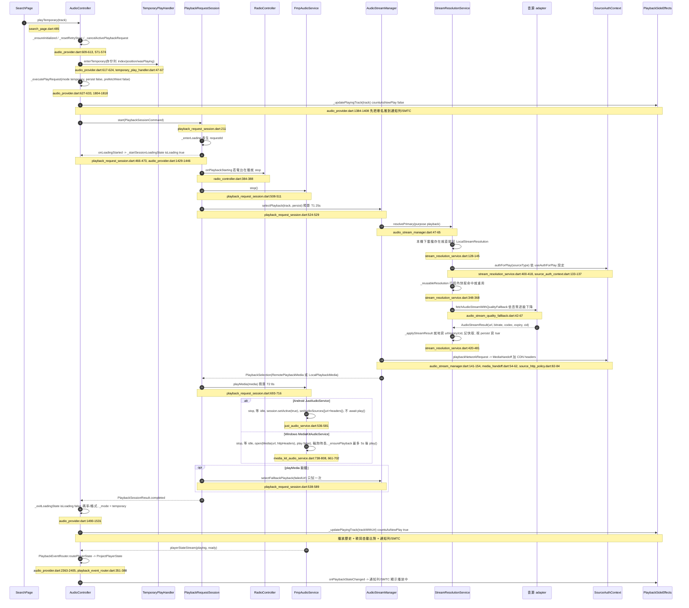
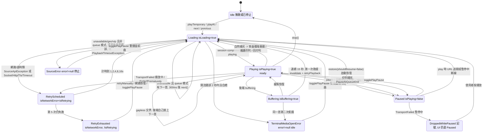
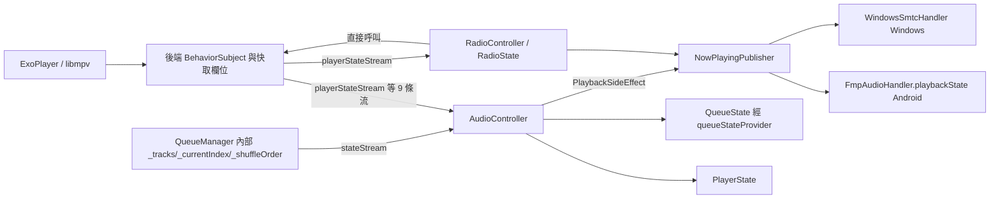

# 播放管線審計（playback）

> 現況描述，未經確認，不代表目標。

- 範圍：`lib/services/audio/`、`lib/providers/audio/`、`lib/data/sources/` 的串流解析、`lib/services/radio/radio_controller.dart` 與後端共用的部分。
- 方法：只讀原始碼（分支 `docs/audit`）。沒有跑 App、沒有跑測試、沒有打真實 API。所以本文件每一條都屬於「程式碼層級」證據；標「**推測**」的是從程式碼推導出、但沒有實際重現過的行為。
- 註釋、dartdoc、`docs/`、`.trellis/spec/` 都當作未經確認的主張。與程式碼不一致之處標「**不一致**」。

---

## 0. 一頁摘要

| 項目 | 實際做法（程式碼） |
|---|---|
| UI 入口 | 幾乎所有「點一首歌」都走 `AudioController.playTemporary`（搜尋、歌單詳情、首頁、排行、歷史、已下載、匯入預覽）。佇列頁走 `playAt`。`playSingle` / `playAll` / `playPlaylist` **沒有任何 UI 呼叫端**；`shuffleQueue` 只有佇列頁的打亂按鈕呼叫（`lib/ui/pages/queue/queue_page.dart:323`，非 Mix 模式才顯示）。 |
| 單一播放管線 | `AudioController._executePlayRequest` → `PlaybackRequestSession.start` → `AudioStreamManager.selectPlayback` → `DefaultStreamResolutionService.resolvePrimary` → 音源 adapter `getAudioStream` → `FmpAudioService.playMedia` |
| 後端 | Android：`JustAudioService`（just_audio 0.10 → ExoPlayer）。Windows：`MediaKitAudioService`（media_kit → libmpv）。由 `audioServiceProvider` 依平台選擇（`lib/providers/audio/audio_controller_provider.dart:26-32`） |
| 系統媒體控制 | Android：`audio_service` 的 `FmpAudioHandler`。Windows：`smtc_windows` 的 `WindowsSmtcHandler`。唯一出口是 `NowPlayingPublisher`，由它在音樂與電台之間仲裁 |
| 串流 | Bilibili：自己打 `/x/player/playurl`（DASH m4a，退 durl/flv）。YouTube：`youtube_explode_dart`（androidVr 拿 audio-only，退 ios/safari/android muxed，再退 HLS），有登入時補打 InnerTube WEB `/player`。網易雲：eapi `song/enhance/player/url/v1` |
| 預載 | 兩層：(1) 下一首 URL 預解析；(2) gapless「arm」：把下一首交給後端播放清單，由後端自己接上去 |
| 錯誤恢復 | 開流失敗會換一次 fallback 串流；網路類錯誤走 1/2/4/8/16 秒退避、最多 5 次；音源「不可用」在佇列模式下自動跳下一首；緩衝超過 15 秒會救一次 |
| 狀態來源 | 至少 5 份：後端快取欄位、`PlayerState`、`QueueState`、`QueueManager` 內部索引、系統媒體控制狀態（另外電台還有 `RadioState`） |

---

## 1. 從「點一首歌」到「出聲」

### 1.1 典型入口：搜尋結果點擊

`lib/ui/pages/search/search_page.dart:481-486`：`onPlayTrack` 呼叫 `controller.playTemporary(track)`（B 站多 P 影片走 `_playVideo`，`search_page.dart:796-814`，也是 `playTemporary`）。

補充：
- `_exitLoadingState` 在離開載入時會用後端「當下」的狀態補投影一次（`audio_provider.dart:1524-1530`），因為 Windows 上零位元組串流在開流時就進了 buffering、之後不再發事件（註釋所述，**未驗證**）。
- Android 的 `playMedia` 在來源設好後就返回，`play()` 沒有被 await（`just_audio_service.dart:569-573`）。所以 `completed` 結果**不代表已出聲**，只代表 ExoPlayer 接受了來源。Windows 則會等到 ready 才 `play()`（最多 5 秒，0.5 秒後仍 idle 就丟 `StreamOpenFailedException`，`media_kit_audio_service.dart:672-686`）。
- 臨時播放 `prefetchNext: false`（`audio_provider.dart:632`），所以不會預解析下一首。

### 1.2 其他入口是否走同一條路

| 入口 | 呼叫 | 走到哪裡 | 差異 |
|---|---|---|---|
| 搜尋、歌單詳情、首頁、排行、歷史、已下載、匯入預覽、TrackAction 選單「播放」 | `playTemporary` | `_executePlayRequest` | `search_page.dart:485,806-812`、`playlist_detail_page.dart:932`、`home_page.dart:725`、`ranking_track_tile.dart:66`、`play_history_page.dart:633`、`downloaded_category_page.dart:381`、`import_preview_page.dart:1081`、`track_action_handler.dart:97,263` |
| 佇列頁點歌、首頁佇列區 | `playAt` | `_playTrack` → `_executePlayRequest(mode queue/mix, persist true, prefetchNext true)` | `queue_page.dart:459`、`home_page.dart:1066`、`audio_provider.dart:994-1010, 2269-2279` |
| 下一首 / 上一首（UI、通知列、SMTC） | `next` / `previous` | 同上；脫離佇列時改走 `_returnToQueue` | `audio_provider.dart:1012-1085` |
| 歌單詳情「Mix 播放」 | `playMixPlaylist` | `_queueManager.playAll` 後 `_executePlayRequest(mode mix)` | `playlist_detail_page.dart:921`、`audio_provider.dart:912-972` |
| 歌單卡片選單「Mix」 | `startMixFromPlaylist` | 先抓 Mix 曲目，再呼叫 `playMixPlaylist` | `playlist_card_actions.dart:164`、`audio_provider.dart:865-897` |
| App 啟動恢復上次歌曲 | `_prepareCurrentTrack` | `PlaybackRequestSession.restore`（`setMedia`，不播） | `audio_provider.dart:422-428, 2282-2361` |
| 臨時播放結束 / 從電台返回 | `_restoreQueuePlayback` | `PlaybackRequestSession.restore`（`setMedia` + seek + 視情況 `play`） | `audio_provider.dart:662-775`、`playback_request_session.dart:279-339, 607-691` |
| 網路重試 / 緩衝飢餓救援 | `retryPlayback` | `PlaybackRequestSession.start(persist false)` | `audio_provider.dart:2003-2066` |
| 歌單詳情「全部」按鈕 | `addAllToQueue` | **不播放**，只加到佇列尾 | `playlist_detail_page.dart:850-852, 884-890`（方法名叫 `_playAll`，實際行為是加入佇列） |

結論：所有「開始播一首」最後都收斂到 `PlaybackRequestSession` 的 `start` 或 `restore`。例外是 gapless 交界，由後端自己接下一首，控制器只跟帳（見 §3.5）。電台完全不走這條路（見 §3.12）。

---

## 2. 播放器狀態機

### 2.1 實際存在的狀態欄位

| 欄位 | 所在 | 誰寫 |
|---|---|---|
| `isLoading` / `isPlaying` / `isBuffering` / `processingState` | `PlayerState`（`player_state.dart:12-80`） | `_startSessionLoadingState`、`_exitLoadingState`、`_projectPlayerState`、`_resetLoadingState`、`_handleTerminalMediaOpen`、`_onBackendAdvanced`、`_onTransportFailure`、`_recoverFromPrematureCompletion`、`_handleSourceError`、`playAll` / `playSingle` / `playMixPlaylist` 直接寫、session 的 `onLoadingFinished` 閉包（`audio_provider.dart:239-252`） |
| `error` | `PlayerState` | 同上加 `play()` / `togglePlayPause()` 的 catch、`_applyQueueMutation`、`_applyRecoveryEvent` |
| `isNetworkError` / `isRetrying` / `retryAttempt` / `nextRetryAt` | `PlayerState` | 只經 `_applyRecoveryState`（`audio_provider.dart:2109-2121`），外加 `retryPlayback` 成功時直接清（`2034-2041`） |
| `_mode`（queue / temporary / detached / mix） | `AudioController` 私有欄位（`audio_playback_types.dart:1`） | `playTemporary`、`_exitLoadingState`、`clearQueue`、`_exitMixMode`、`_playFirstInQueue`、初始化恢復 Mix |
| 交接中的 requestId | `PlaybackHandoffGate`（閂存）與 `PlaybackRequestSession._requestId` | session 產生，gate 複製 |
| 後端狀態 | `JustAudioService` / `MediaKitAudioService` 的 `BehaviorSubject` 與快取欄位 | 後端自己，並在 `stop()` / `playUrl()` 時手動合成 `idle` / `loading`（`just_audio_service.dart:388-397, 551-557`；`media_kit_audio_service.dart:520-529, 760-766`） |
| Windows 的 `processingState` | **合成值**：completed > buffering > playing→ready > 有時長→ready > idle | `media_kit_audio_service.dart:449-466` |

`processingState` 列舉：`idle / loading / buffering / ready / completed`（`audio_types.dart:2-17`）。控制器投影時套用一條規則：自己在載入中而後端說 `idle`，就改報 `loading`、位置報 0（`effective_playback_state.dart:23-47`）。

### 2.2 狀態圖（由程式碼推導的使用者可見狀態）

證據對照：
- 載入 / 完成：`playback_request_session.dart:211-277`、`audio_provider.dart:1429-1531`。
- 退避階梯：`playback_recovery_coordinator.dart:157-215`，次數與延遲在 `app_constants.dart:226-235`（`maxRetries = 5`，1/2/4/8/16 秒）。
- 開流錯誤自癒窗 2 秒：`playback_request_session.dart:162-163, 341-406`。
- 緩衝飢餓：`buffer_starvation_watchdog.dart`（15 秒，`app_constants.dart:199`）、`playback_event_router.dart:507-522`、`audio_provider.dart:2448-2496`。
- 完成路由：`playback_event_router.dart:458-470`。
- 暫停中斷線：`playback_event_router.dart:429-440`、`audio_provider.dart:2513-2517, 2226-2267`。

### 2.3 幾份狀態來源、會不會不同步

已確認（程式碼層級）的不同步點：
1. **正在播的歌 vs 佇列的當前歌**：`PlayerState.playingTrack` 與 `QueueManager.currentTrack` 刻意可以不同（臨時播放、清空佇列後的 detached）。判斷「脫離佇列」靠 `_isPlayingOutOfQueue`（`audio_provider.dart:2181-2192`），以 `Track.id` 比較。
2. **通知列 / SMTC 位置**：有 500ms 節流（`audio_provider.dart:2421-2427`）。Android 通知的總時長取自 `track.durationMs` 元資料，不是後端回報的實際時長（`audio_handler.dart:83-85`）；`publishPlaybackState` 在 Android 分支也沒傳 duration（`now_playing_publisher.dart:187-194`）。
3. **音量**：Android 音訊焦點 duck 直接改後端音量（`just_audio_service.dart:174-177`），`PlayerState.volume` 不知道。
4. **Android 中斷恢復**：中斷結束時 `JustAudioService` 自己呼叫 `play()`（`just_audio_service.dart:194-199`），繞過 `AudioController.play()` 的 URL 過期檢查（`audio_provider.dart:485-494`）。
5. **電台期間**：控制器對位置、時長、緩衝事件直接 return（`audio_provider.dart:2410, 2589, 2599`），`PlayerState` 停在電台開始前的值。
6. **Android `isPlaying` getter**：讀 `_player.playing`（`just_audio_service.dart:108`），`processingState` getter 卻讀自己的 BehaviorSubject（`120-121`），而 `stop()` / `playUrl()` 會往 subject 手動塞合成值。兩個 getter 在短時間內可能描述不同的瞬間（**推測**）。
7. **Windows `isPlaying`** 來自 `stream.playing`，`processingState` 是合成的；`bufferedPosition` 的量級與 Android 不同（`audio_service.dart:35-38` 的 dartdoc，**未驗證**）。

---

## 3. 各主題

### 3.1 佇列與播放模式

**做法**
- 佇列本體在 `QueueManager`：`_tracks`、`_currentIndex`、`_shuffleOrder`、`_shuffleIndex`（`queue_manager.dart:21-34`）。`AudioController` 自己不存佇列，只投影成 `QueueState`（`audio_provider.dart:2878-2952`）。
- 循環：`LoopMode.none / all / one`，`cycleLoopMode` 依 none → all → one 輪轉（`queue_manager.dart:732-740`）。
- 單曲循環**不在 `getNextIndex` 裡**，而是在完成路由裡優先判斷，重播用 `_playTrack` 重開一次流（`playback_event_router.dart:465`、`audio_provider.dart:2820-2823`）。所以單曲循環每一圈都要重新走一次解析與開流（通常命中行程內快取），而且每一圈都 `countsAsNewPlay: true`，也就是每圈記一筆播放歷史（`audio_provider.dart:2276`）。
- 隨機（非破壞性）：開啟時產生一份索引排列，當前曲放第一位（`queue_manager.dart:753-767`）；`getNextIndex` / `getPreviousIndex` 沿著排列走（`324-375`）。
- 破壞性打亂 `shuffle()` 與 `restoreOrder()` 存在（`queue_manager.dart:616-664`），`shuffleQueue` 由佇列頁打亂按鈕呼叫（`lib/ui/pages/queue/queue_page.dart:323`，主審查更正：子代理初稿誤記為無呼叫端），但 **`restoreOrder` 沒有任何呼叫端**。
- 加入：`add` 檢查 `maxQueueSize = 10000`（`queue_manager.dart:472`、`app_constants.dart:35`）；Mix 模式下 `add/addAll/addNext/shuffle` 被 `QueueCommands` 擋下（`queue_commands.dart:52-123`）。
- 持久化：`PlayQueue` 存 `trackIds`、`currentIndex`、`lastPositionMs`、`lastVolume`、`isShuffleEnabled`、`loopMode`、`originalOrder`、Mix 身分（`queue_persistence_manager.dart:78-128`、`queue_manager.dart:686-730`）。位置每 10 秒存一次（`queue_manager.dart:819-824`、`app_constants.dart:54`），seek 後立即存（`audio_provider.dart:576-582`）。**隨機排列本身不持久化**，重啟時重新產生（`queue_manager.dart:210-212`）。
- 啟動 10 秒後刪除「不屬於任何歌單、也不在佇列裡」的 Track 列（`queue_manager.dart:224-227, 830-843`）。

**邊界與觀察到的問題**
- `addAll` 與 `insert` 不檢查 `maxQueueSize`（`queue_manager.dart:500-556`），只有 `add` 檢查。
- **隨機模式下「下一首播放」不會是下一首**：`addNext` → `insert` → `_addToShuffleOrder`，後者把新索引插在當前位置之後的**隨機**位置（`queue_manager.dart:541-547, 775-786`）。**推測**這不是使用者預期。
- **`move()` 不更新 `_shuffleOrder`**（`queue_manager.dart:594-613`）：排列裡存的是 `_tracks` 的索引，拖動重排後同一個索引指到別首歌。隨機模式下拖動佇列後，接下來播放的歌會和畫面上的「接下來」不一致（**推測**，程式碼路徑明確，未實跑）。
- `next()` / `previous()` 的 `_navRequestId` 防競態檢查是**死碼**：遞增與比較之間沒有任何 `await`（`audio_provider.dart:1017-1032, 1050-1070`），不可能不相等。實際防競態靠的是 session requestId。**不一致**：`.trellis/spec/services/audio.md` 的 Races 段把它列為獨立防線。
- `previous()` 超過 3 秒時直接呼叫 `_audioService.seekTo(Duration.zero)`（`audio_provider.dart:1063-1065`），繞過 `seekTo()` 的延後 seek 與立即存位置。

### 3.2 串流解析

共通：`DefaultStreamResolutionService.resolvePrimary`（`stream_resolution_service.dart:123-168`）

1. 非下載用途先查本機下載檔（`File.existsSync`，同步 I/O），不存在的路徑從 DB 清掉並發 `downloadPathsChanged` 事件（`128-145, 483-526`）。
2. 讀設定組 `AudioStreamConfig`（音質、格式優先序、該音源的串流類型優先序）與 `authForPlay`（`400-418`）。
3. 行程內 LRU 快取（上限 32，`113`）重用條件：track 的 URL 未過期、快取 URL 相同、設定相同、auth header 相同（`348-368`）。
4. 未命中就呼叫 adapter；限流錯誤等 3 秒重試一次，其他錯誤等 1 秒重試一次（`207-246`、`app_constants.dart:138-146`）。
5. `_applyStreamResult` 就地把 URL、到期時間、cid 寫進傳入的 track，視 `persist` 寫回 Isar（`420-481`）。沒有 `expiry` 時預設 1 小時（`428-430`）。

Media 請求 header：一律只有 CDN 的 Origin/Referer 加 UA，**不帶帳號憑證**（`source_http_policy.dart:73-84`、`media_handoff.dart:54-62`）。

| 音源 | 取法 | 格式 | 到期時間 |
|---|---|---|---|
| Bilibili | 無 cid 先打 `/x/web-interface/wbi/view` 拿 cid（`bilibili_source.dart:456-473`），再依 `streamPriority` 打 `/x/player/playurl`：`fnval=16` DASH（`327-382`）或 `fnval=0` durl（`385-425`）；HLS 回 null | DASH：`container 'm4a'`、`codec 'aac'` 寫死（`374-376`）；durl：`flv` muxed | 從 URL 的 `deadline` 參數算，缺就 2 小時（`432-445`） |
| YouTube | `youtube_explode_dart`：audio-only 用 `androidVr`，muxed 用 `ios/safari/android`，HLS 試 safari、ios、兩者（`youtube_source.dart:444-583`）。每種類型先匿名，失敗且有 auth 時用 InnerTube WEB `/player` 同類型再試（`332-378`） | audio-only 依 `formatPriority`（opus/aac）挑；muxed 依位元率 | **寫死 1 小時**（`youtube_source.dart:52-54`、`app_constants.dart:29`），不讀 URL 的 `expire` |
| 網易雲 | eapi `/eapi/song/enhance/player/url/v1`，`level` 由音質對應 lossless / exhigh / standard（`netease_source.dart:93-171, 785-794`） | 依回傳 `type`（mp3/flac/m4a…） | 用 API 的 `expi`（缺值時用防守值），註釋說實測 1200 秒（`netease_source.dart:40, 160-162`） |

預設串流優先序：B 站 `audioOnly,muxed`、YouTube `audioOnly,muxed,hls`、網易 `audioOnly`（`settings.dart:59-63`）。預設帶登入解析：B 站、網易（`settings.dart:76-79`）。

**觀察**
- 網易雲的試聽片段（`freeTrialInfo != null`）只寫進 log，照常當完整歌曲回傳（`netease_source.dart:139-150`）。**推測**：使用者只會聽到片段然後跳下一首，沒有任何提示。
- Bilibili `_getCid` 只取影片第一個 cid（`bilibili_source.dart:465`），`request.pageNum` 在 `getAudioStream` 裡沒被使用（`213-241`）。如果某個分 P track 帶 `pageNum` 卻沒有 `cid`，會解析到 P1 的音訊（**推測**：需要確認這種 track 是否真的存在）。
- Bilibili 與 YouTube 的 `getAudioStream` / `getAlternativeAudioStream` 是兩套幾乎重複的實作（`bilibili_source.dart:213-321` vs `683-736`；`youtube_source.dart:444-583` vs `712-850`）。
- 網易雲 `getAlternativeAudioStream` 一律回 null（`netease_source.dart:174-178`），fallback 只能靠降音質。

### 3.3 URL 過期重取

- 判斷：`Track.hasValidAudioUrl` 在到期前 5 分鐘就視為無效；**`audioUrlExpiry == null` 時永遠有效**（`track.dart:283-293`）。
- 重取時機：
  1. 每次播放請求都經 `resolvePrimary`，過期或快取不中就重打（`stream_resolution_service.dart:147-167`）。
  2. 暫停後按播放：`_resumeWithFreshUrlIfNeeded` 發現 URL 過期（或暫停中斷線）就重新 `_playTrack`，成功後延遲 500ms 再 seek 回原位置（`audio_provider.dart:2226-2267`）。已下載檔案排除。
  3. 播放失敗（傳輸失敗、提前結束、媒體開啟失敗、緩衝飢餓）時先 `invalidateResolvedStream` 丟掉快取（`audio_provider.dart:2512, 2575, 2731, 2455`）。
- 播放中**不檢查**過期：`seekTo` 沒有過期判斷（`audio_provider.dart:544-555`）。Windows 的 mpv 設了 `cache-secs=7200` 會一次抓完（`media_kit_audio_service.dart:216-237`），Android 只緩衝 10～20 秒（`just_audio_service.dart:153-160`），所以長曲目在 Android 上播到 URL 過期之後才讀的片段會失敗，進傳輸失敗重試路徑（**推測**）。

**觀察：Isar 裡的 URL 讓預取失效**（**推測**，程式碼路徑明確）
- `prefetchTrack` 在 `track.hasValidAudioUrl` 為真時直接 return（`stream_resolution_service.dart:299-304`）。
- 但實際播放時的重用還要求行程內快取有這一筆（`355-356`）。
- 重啟後，從 Isar 載入、帶著未過期 URL 的 track 會跳過預取，輪到它播放時快取又是空的，只好現場重新解析。`_armNextMedia` 的註釋說命中預取就不打網路（`audio_provider.dart:1669-1671`），在這個情況下不成立。

### 3.4 音質降級

- 設定：`AudioQualityLevel.high / medium / low`、`formatPriority`、每個音源的 `streamPriority`（`audio_settings_provider.dart:176-220`、`base_source.dart:43-50`）。
- 等級選取：清單依位元率由高到低排好，high 取第一、medium 取中間、low 取最後（`audio_stream_quality_fallback.dart:9-20`）。
- 主解析降級：只有 `unavailable` / `vipRequired` 會往下一級重試（`audio_stream_quality_fallback.dart:42-67`、`source_exception.dart:23-25`）。網路錯誤不降級。
- 開流失敗的 fallback：`resolveFallback` 從**低一級**開始，每級先問 adapter 的 alternative，再試主解析但排除失敗的 URL，最後用原等級問一次 alternative（`audio_stream_quality_fallback.dart:69-96`）。一次請求只 fallback 一次（`playback_request_session.dart:538-589`），而且 fallback 結果 `persist: false`（`stream_resolution_service.dart:254`）。
- 整次請求上限 T1+T2 = 33 秒，fallback 只能用剩下的時間（`playback_request_session.dart:524, 748-754`、`app_constants.dart:222`）。

**觀察**：B 站 DASH 不論實際 codec 一律標 `aac`/`m4a`（`bilibili_source.dart:374-376`），播放頁顯示的格式可能不準（**推測**）。B 站 DASH 回應裡的 `flac` / `dolby` 軌完全沒讀。

### 3.5 預載

兩層，都掛在成功開流之後：

1. **URL 預解析**：`_prefetchNextIfRequested` 取 `getNextIndex()` 那一首（佇列裡的實例，不是 copy），fire-and-forget 呼叫 `prefetchTrack`（`playback_request_session.dart:809-829`）。`prefetch` 不落盤（`stream_resolution_service.dart:307-316`）。臨時播放不預取（`audio_provider.dart:632`）；啟動恢復會預取（`playback_request_session.dart:683-684`），而 `_prepareCurrentTrack` 又自己預取一次（`audio_provider.dart:2349-2353`），靠 `_prefetchingTrackIds` 與 `hasValidAudioUrl` 去重。
2. **Gapless arm**：預取完成後 session 回呼 `_armNextMedia`，再 `selectPlayback(persist:false)` 一次，交給 `setNextMedia`（`audio_provider.dart:1664-1699`）。
   - 條件：不脫離佇列、非單曲循環、電台沒占用、Mix 沒在補歌（`1651-1662`）。
   - Android：往 just_audio 播放清單 append，`useLazyPreparation: false` 讓第二項立刻準備（`just_audio_service.dart:148-152, 676-703`）。
   - Windows：mpv 播放清單 append，加上 `prefetch-playlist=yes`（`media_kit_audio_service.dart:250, 961-986`）。
   - 後端索引前進時發 `advancedToNext`，控制器在 `_onBackendAdvanced` 跟帳：`moveToNext`、更新 playingTrack、記歷史、接著預取並 arm 再下一首（`audio_provider.dart:1721-1782`）。
   - 保險：arm 期間位置檢查連續 3 秒停在結尾，就收回推進權、自己合成一次「播完」（`playback_event_router.dart:487-498`）。
   - 佇列任何變動都會重算，下一首不是 arm 的那首就 disarm（`audio_provider.dart:2879-2886`）。

**觀察**：arm 的 URL 在交界時才真正被讀，如果下一首 arm 之後使用者暫停很久，arm 的 URL 可能過期；交界時由後端自己開流，控制器沒有機會重解析（**推測**）。

### 3.6 錯誤恢復

| 失敗來源 | 分類位置 | 處理 | 上限 | 使用者看到 |
|---|---|---|---|---|
| 解析階段 `SourceApiException` network / timeout | `source_exception.dart:15-16` | 退避重試 | 5 次 | NetworkStatusBanner（`network_status_banner.dart:26-147`），耗盡後停在網路錯誤、可手動重試 |
| 解析階段 unavailable / geo / vip | `source_exception.dart:18-21` | queue 模式且有下一首：300ms 後 `next()`；否則 stop 並設 error | — | 警告 toast「已跳過」或錯誤 toast（`audio_provider.dart:1945-1983`） |
| 解析階段 rateLimited | — | 設 error，不重試（解析層已等 3 秒重試過一次） | — | 警告 toast |
| `PlaybackTimeoutException`（T1/T2 預算耗盡） | `playback_error_presenter.dart:67` | 不進退避 | — | 錯誤 toast「連線逾時」（`audio_provider.dart:1908-1915`） |
| Dart `Socket/Http/Tls/TimeoutException` | `playback_error_presenter.dart:64-80` | 退避重試 | 5 次 | 同上 |
| 後端 `TransportFailed`（播放中） | 後端翻譯 | stop 後進退避 | 5 次 | banner |
| 後端 `TransportFailed`（暫停中） | router | 只記號，按播放時重開 | — | 無 |
| 後端 `EndedPrematurely` | `playback_end_reason_rules.dart:23-34` | 從當前位置退避重試 | 5 次 | banner |
| 後端 `MediaUnopenable` / `DecoderFailed` | 後端翻譯 | 等 2 秒，後端自己往前走 0.5 秒以上算自癒，否則 stop | 1 次 | 錯誤 toast「播放失敗」（`playback_request_session.dart:341-406`） |
| 後端 `OutputDeviceFailed` | mpv `ao` log 或錯誤字串 | 只 toast，收回已排的提前結束重試，5 秒內任何 playing 都立刻 pause | — | toast「音訊輸出失敗」（`audio_provider.dart:2672-2692`、`playback_event_router.dart:369-373, 528-543`） |
| 緩衝飢餓 15 秒 | watchdog | 第一次：invalidate 後 `retryPlayback`；第二次：當作開不起來 | 同一首 1 次 | 錯誤 toast「逾時」 |
| `UnclassifiedFailure` | 後端 | 只記 log、丟棄 | — | 無 |

網路恢復時 `connectivityProvider` 發事件，自動重試並把次數歸零（`audio_provider.dart:2134-2164`、`playback_recovery_coordinator.dart:259-286`）。

**觀察：`_RetryScheduledException` 只有一個 catch 點，而那個入口沒人用**（證據明確，後果部分屬**推測**）
- `_scheduleSessionRetry` 一定拋 `_RetryScheduledException`（`audio_provider.dart:1933-1943`），在 `_executePlayRequest` 的 catch 區塊裡被呼叫（`1883-1886, 1899-1901`），所以會拋出 `_executePlayRequest`。
- 唯一以 `on _RetryScheduledException` 明確攔它的是 `playSingle`（`audio_provider.dart:596`），但 `playSingle` 沒有 UI 呼叫端。其餘經 `_playTrack` 的入口是被通用 `catch` 接住：`playAt`（`1005-1008`）、`togglePlayPause`（`528-531`）、`play()`（經 `_resumeWithFreshUrlIfNeeded`，`490-493`）都會把這個內部例外的 `toString()` 寫進 `state.error`。（核查補充：原句「唯一攔它的是 playSingle」易誤讀為其他入口讓它逃出）
- `playTemporary`（主要入口）會落進通用 catch（`649-659`）：顯示「播放失敗」toast，並**立刻恢復原佇列**，而退避計時器仍然會在 1 秒後重播那首臨時曲目。使用者可能先看到錯誤、佇列歌開始載入、再被重試搶回去。
- `playMixPlaylist` 的 catch 會 `_exitMixMode()` 並把 `error` 設成例外字串（`968-970`）：網路抖一下就退出 Mix 模式。
- `playAt` 把 `error` 設成例外字串（`1005-1008`）。`next()` / `previous()` 沒有 try，例外往呼叫端（按鈕、通知列、`_handleSourceError` 的 `Future.delayed`）拋，成為未處理的非同步錯誤。
- `playTemporary` 的 `on SourceApiException` 分支（`633-645`）實際上不可達：`_executePlayRequest` 自己吞掉所有 `SourceApiException`，只會往外拋 `_RetryScheduledException`。

**其他觀察**
- Mix 模式遇到 unavailable 不會跳過：跳過條件寫死 `mode == PlayMode.queue`（`audio_provider.dart:1955`），Mix 的 mode 是 `PlayMode.mix`，所以直接停下並報錯（**推測**不是刻意設計）。
- **不一致**：`playback_error_presenter.dart:56-63` 說 `MediaHandoff` 直接用 `dart:io` 的 `HttpClient` 所以會拋 Socket 等例外；實際的 `DefaultMediaHandoff` 只組 header、不發任何請求（`media_handoff.dart:39-62`）。`CONTEXT.md` 的 Media Handoff 詞條提到 "redirect checks"：`MediaHandoff` 類別本身沒有，但**下載管線**有——下載 isolate 關掉自動轉址、逐跳呼叫 `prepareDownloadHop` 重算 header、拒絕轉到本機／私網主機、最多 5 跳（`lib/services/download/download_service.dart:1837-1889`）。播放路徑沒有 redirect 檢查，轉址交給後端播放器自己跟。（核查更正：原寫「程式碼裡查不到 redirect 檢查」）

### 3.7 音訊焦點與中斷

- **Android**（`JustAudioService.initialize`，`just_audio_service.dart:165-213`）：`AudioSessionConfiguration.music()`；duck 時音量減半、結束還原；pause / unknown 類中斷時暫停，pause 類結束時若之前在播就自動恢復（unknown 類結束不恢復）；`becomingNoisy`（耳機拔出）暫停。
- 每次開流 `setActive(true)`（`560, 592, 622, 642`），**每次 `stop()` 都 `setActive(false)`**（`385`），而每次播放請求都以 `stop()` 開場（`playback_request_session.dart:508-511`）。所以切歌會放掉再搶回音訊焦點（**推測**：其他 App 可能在切歌瞬間短暫恢復播放）。
- **Windows**：`MediaKitAudioService` 沒有任何焦點或中斷處理。`audio_service.dart:9-13` 的 dartdoc 說 `audio_session` 在 Windows 上沒有 plugin，查不到反證。耳機拔出或裝置消失時只可能透過 mpv 的 `ao` 錯誤進 `OutputDeviceFailed` 路徑（`media_kit_audio_service.dart:393-398`）。輸出裝置可選，偏好裝置存在 Settings，啟動後裝置清單第一次就緒時套用一次（`audio_provider.dart:1252-1302`）。

### 3.8 系統媒體控制

- 唯一出口 `NowPlayingPublisher`（`now_playing_publisher.dart:65-304`），owner 為 `music` 或 `radio`。非 owner 的推送會被忽略；電台 `release` 時自動還給音樂（`131-148`）。按鈕依 `PlaybackCapabilities` 決定（`_apply`，`257-303`）。
- **Android**：`audio_service ^0.18.15`，`AudioService.init` 在 `main.dart:172-183`（`androidStopForegroundOnPause: true`、快轉／倒轉 10 秒）；失敗時退回一個沒接系統的 `FmpAudioHandler`（`main.dart:186-195`）。`MediaItem` 的 `artUri` 直接用 `track.thumbnailUrl` 網址，`duration` 用 `track.durationMs`（`audio_handler.dart:75-89`）。
- **Windows**：`smtc_windows ^1.1.0`，`WindowsSmtcHandler`。metadata 有去重（`windows_smtc_handler.dart:12-49, 238-246`），封面經 `ThumbnailUrlUtils.getOsMediaArtwork` 轉成乾淨網址（`227-232`）。SMTC 不支援 seek（`now_playing_publisher.dart:283-284`）。
- 推送時機：每次請求開始時先推一次 track（未解析），成功後再推一次（`audio_provider.dart:1816, 1515`）；狀態由 `_projectPlayerState` 與節流後的位置更新推（`2398-2402, 2415-2432`）。
- 觀察：`now_playing_publisher.dart:7` 從 `main.dart` import 全域 `late` 變數 `audioHandler` / `windowsSmtcHandler`，也就是服務層反向依賴 `main.dart`。

### 3.9 播放歷史

- 何時：`PlaybackSideEffectRegistry` 的 `onTrackStarted(countsAsNewPlay: true)` 時（`playback_side_effects.dart:166-175`）。實際觸發點是「開流成功」（`_exitLoadingState`）與「gapless 跟隨」（`_onBackendAdvanced`），**不是聽了幾秒**（`audio_provider.dart:1397-1402` 的註釋也這樣說）。
- 不算的：重試（`2033-2038`）、啟動恢復、臨時播放結束後恢復佇列（`_restoreQueuePlayback` 沒傳 `countsAsNewPlay`，預設 false，`730-735`）。
- 算的：單曲循環每一圈（見 §3.1）。
- 存哪：Isar `PlayHistory` collection，`PlayHistory.fromTrack(track)` 快照；每寫一筆就依 `playHistoryLimit` 裁掉最舊的（`play_history_repository.dart:21-52`）。寫入 fire-and-forget（`play_history_recorder.dart:34-53`）。

### 3.10 臨時播放

實際語意（`audio_provider.dart:609-660`、`temporary_play_handler.dart`）：
- 不改佇列內容。進入時記下佇列當前 index、後端位置、是否正在播（已在臨時模式時不覆寫，`temporary_play_handler.dart:54-56`）。
- `persist: false`：解析結果不寫進 Track 列（但若 DB 已有該曲，會補寫 cid，`stream_resolution_service.dart:455-468`）。
- 臨時曲播完（或按下一首／上一首）走 `_returnToQueue` → `_restoreSavedState`：依「記住播放位置」設定，把佇列曲載回原位置並倒退 `tempPlayRewindSeconds`；**原本在播才自動播，原本暫停就只載入不播**（`audio_provider.dart:778-806`、`temporary_play_handler.dart:76-93`）。
- 沒有保存狀態時（佇列原本是空的），`_returnToQueue` 播佇列第一首（`2205-2224`）。
- UI 上「點歌」幾乎都是臨時播放（§1.2），所以這才是 App 的主流程，佇列只由「加入佇列」「下一首播放」與 Mix 建立。

**觀察：臨時播放 + 單曲循環會丟掉恢復點**（**推測**，程式碼路徑明確）
- 單曲循環重播走 `_playTrack`，它把 mode 設成 queue 或 mix（`audio_provider.dart:2269-2279`），`_exitLoadingState` 接著把 `_mode` 改成 queue（`1512`）。
- 之後按下一首：`_isPlayingOutOfQueue` 仍為真，但 `_isTemporaryMode` 已為假，所以 `_returnToQueue` 走 `_playFirstInQueue`，播佇列第一首並清掉保存的位置（`2196-2224`），而不是回到進入臨時播放前的那首。
- 路由註釋說「臨時播放中按下單曲迴圈仍然迴圈同一首」（`playback_event_router.dart:456-457`），只講了循環本身，沒講循環之後的模式。

### 3.11 Mix

- 語意：YouTube 自動產生的播放清單（RD 開頭）。以 `mixPlaylistId` + `mixSeedVideoId` 儲存在歌單上，播放時替換整個佇列並進入 `PlayMode.mix`（`audio_provider.dart:912-972`）。
- 限制：禁止隨機（`1190, 941-944`）、禁止加入／插入／打亂（`queue_commands.dart:52-123`），清空佇列就退出 Mix（`audio_provider.dart:1145-1147`）。
- 無限續播：每首開始時若剩餘 ≤ 1 首就在背景補歌（`mix_session_coordinator.dart:145-169`、`app_constants.dart:96`）。補歌最多試 10 次，每次間隔 1 秒，前 3 次用最後一首當種子，之後往前換種子，湊到 10 首新歌才停，依 `seenVideoIds` 去重（`192-330`、`app_constants.dart:93-105`）。佇列到底時若補歌還在飛，完成路由會等它（`audio_provider.dart:2632-2640`）。
- 持久化：`PlayQueue.isMixMode` 等欄位，重啟時恢復 Mix 模式（`audio_provider.dart:390-410`、`mix_session_coordinator.dart:118-135`）。
- 觀察：Mix 佇列只增不減，走的是 `addAll`，沒有 `maxQueueSize` 檢查（`mix_session_coordinator.dart:315`、`queue_manager.dart:500`）。`seenVideoIds` 也只增不減。長時間播放 Mix 時，佇列與記憶體會一直長（**推測**：實際成長速度未量）。

### 3.12 電台／直播

- 只支援 Bilibili 直播間（`radio_source.dart:138-156`）。取流：`/room/v1/Room/playUrl` 取 `durl` 第一個 URL，`qn=80`（`bilibili_live_client.dart:272-301`），沒有到期時間。
- **驗證 AGENTS.md 的「Radio 是 FmpAudioService 例外」**：成立。`RadioController` 用 `ref.watch(audioServiceProvider)` 拿到同一個後端（`radio_controller.dart:286`），直接 `playUrl` / `stop` / `seekToLive`（`471, 534, 587, 617, 927, 946`）。整個 `lib/` 裡除了 audio 自己之外，只有它碰 `FmpAudioService`。
- 共存機制：
  - 音樂開始前：session 呼叫 `onPlaybackStarting`，電台有站就 `stop()`（`radio_controller.dart:384-388`、`playback_request_session.dart:215`）。**`restore()` 路徑不呼叫 `onPlaybackStarting`**（`playback_request_session.dart:279-339`）。
  - 電台開始前：只呼叫 `audioController.pause()`（`radio_controller.dart:840-847`），並記下佇列 index / 位置 / 是否在播，返回時用 `returnFromRadio` 還原（`1001-1012, 564-579`）。
  - 電台占用期間 `isRadioPlaying` 讓控制器忽略後端事件與結束原因（輸出裝置失敗除外）（`playback_event_router.dart:359, 402-412`）。
- 電台的「暫停」實際是 `stop()`（`radio_controller.dart:583-587`，暫停時保留串流資訊以便恢復）。
- 重連：只在後端回報 `completed` 時觸發，先查是否還在直播，是就依 `RadioReconnectConfig` 重連，否則停下等待刷新服務偵測重新開播（`850-958`）。電台不訂閱 `endReasons`，所以傳輸層錯誤在電台期間只會被控制器以 IgnoreEvent 丟掉（`playback_event_router.dart:407-411`）；只有 Windows 上開流時的 `StreamOpenFailedException` 會觸發一次換 URL 重試（`radio_controller.dart:514-518`）。

**觀察：音樂載入中開電台的競態**（**推測**）
- `radio.play()` 只 `pause()` 音樂，沒有取消進行中的 `PlaybackRequestSession`（`radio_controller.dart:843`、`audio_provider.dart:497-503`）。
- 若音樂正在解析串流，解析完成後 `_playSelection` 仍會 `playMedia`，把電台的流換掉。此時 `isRadioPlaying` 為真，控制器忽略後端事件，電台 UI 則認為自己在播。

### 3.13 已下載檔案的本地播放

- `resolvePrimary` 在非下載用途時先看 `track.allDownloadPaths`（各歌單的 `downloadPath`），第一個存在的就回 `LocalStreamResolution`（`stream_resolution_service.dart:128-145, 483-496`）。
- `AudioStreamManager` 包成 `LocalPlaybackMedia`（`audio_stream_manager.dart:82-84`）。後端：Android `AudioSource.file`（`just_audio_service.dart:607-635`），Windows `Media(path)`（`media_kit_audio_service.dart:851-902`）。
- 不存在的路徑會從 DB 清掉，並透過 `downloadPathsChangedStream` 讓控制器通知 library 失效與 `fileExistsCache`（`audio_provider.dart:283-304`）。
- 本機檔不需要 URL 過期處理（`audio_provider.dart:2235-2236`）。
- 觀察：檔案存在檢查是同步的 `File.existsSync`，在 UI isolate 上跑（`stream_resolution_service.dart:488`、`audio_provider.dart:2236`）。

### 3.14 睡眠定時器、速度、音量、均衡器

| 功能 | 現況 |
|---|---|
| 睡眠定時器 | **查不到**。`lib/` 裡沒有相關程式碼 |
| 均衡器 | **查不到**。只有 `user_guide_page.dart:190` 用了 `Icons.equalizer` 圖示 |
| 播放速度 | 選項 0.5～2.0（`app_constants.dart:43-51`），播放頁可選（`player_page.dart:747-766`），兩個後端都 clamp 到 0.5～2.0。**不持久化**：`setSpeed` 只打後端（`audio_provider.dart:1174-1182`），重啟回到 1.0 |
| 音量 | 0～1，存在 `PlayQueue.lastVolume`，啟動時恢復（`audio_provider.dart:412-418`、`queue_persistence_manager.dart:104-112`）；靜音記住靜音前的值（只在記憶體） |
| 輸出裝置 | 只有 Windows（§3.7） |

---

## 4. 觀察彙總

### 4.1 重複邏輯
- 四條「開一首歌」的控制器路徑各自做 `_updatePlayingTrack` → session → `_replaceQueueTrackIfCurrent` → `_exitLoadingState` → `_updateQueueState`，細節略有不同：`_executePlayRequest`（`audio_provider.dart:1804-1926`）、`retryPlayback`（`2003-2066`）、`_restoreQueuePlayback`（`662-775`）、`_prepareCurrentTrack`（`2282-2361`）。`countsAsNewPlay`、`mode`、prefetch 的差異散落在四處。
- `MediaKitAudioService` 的 `playUrl` / `setUrl` / `playFile` / `setFile` 四個方法各自有一份相同的時長輪詢迴圈（`media_kit_audio_service.dart:738-935`）；`JustAudioService` 也有類似的四份（`535-652`）。
- 音源 adapter 的主解析與 alternative 兩套（§3.2）。
- 啟動恢復時預取兩次（§3.5）。

### 4.2 競態風險
- **被取代的請求不會取消網路工作**：`isSuperseded` 只決定結果要不要採用；`selectPlayback` 仍然跑完，`_withBudget` 的 `timeout` 也不會取消底層 future（`playback_request_session.dart:524-536, 737-745`）。快速連點下一首 N 次會同時有 N 份解析在跑（各自還可能再重試一次），完成後照樣寫 Isar 與快取（`stream_resolution_service.dart:420-481`）。
- 音樂載入中開電台（§3.12）。
- `MediaKitAudioService._playbackCancelled` 是單一布林，由每次 `playUrl` 在開頭重設為 false（`media_kit_audio_service.dart:653, 750, 856`）。前一次還在 `_ensurePlayback` 迴圈裡時，新的開流會把旗標重設，舊迴圈可能替新媒體呼叫 `play()`（**推測**）。
- `_requestDeadline` 是 session 上的單一欄位（`playback_request_session.dart:177, 524, 620`）。新請求進來會改寫它，被取代的舊請求在 fallback 時讀到的是新期限（**推測**，影響小）。
- `_onTransportFailure` 用 unawaited 閉包做 stop 與排重試，靠 `_isAudioErrorRetryContextCurrent` 在 await 之後重新確認（`audio_provider.dart:2531-2556`）。

### 4.3 超大檔案
- `lib/services/audio/audio_provider.dart` 2953 行，單一類別 `AudioController`。依 spec 有行數雙向 ratchet 測試（`.trellis/spec/services/audio.md` 第 5 點，本次未驗證該測試）。
- `lib/data/sources/youtube_source.dart` 2431 行。
- `lib/services/radio/radio_controller.dart` 1103 行、`bilibili_source.dart` 1069 行、`media_kit_audio_service.dart` 1017 行、`netease_source.dart` 1008 行。

### 4.4 多份狀態
見 §2.3。另外 `PlayerState.error` 同時承載「音源錯誤訊息」「例外 `toString()`」與「開流失敗文案」三種內容。`togglePlayPause` 只要看到 `error != null` 就重播當前曲（`audio_provider.dart:517-523`），而 `error` 可能是 `_RetryScheduledException` 的字串（§3.6）。

### 4.5 死碼與未用入口
- `playSingle` / `playTrack` / `playAll` / `playPlaylist`：沒有 UI 呼叫端（以 `grep` 查 `lib/`）。`shuffleQueue` 有呼叫端：`lib/ui/pages/queue/queue_page.dart:323`。
- `QueueManager.restoreOrder`、`QueueManager.restoreQueue`、`QueueManager.setShuffleState`：`queue_manager.dart` 以外沒有呼叫端（以 `grep` 查 `lib/`）。
- `AudioStreamManager.ensureAudioStream` / `ensureAudioUrl` 的 `retryCount` 參數沒被使用（`audio_stream_manager.dart:47-65, 128-139`；`ensureAudioStream` 收了不轉給 `resolvePrimary`）。另外 `AudioStreamManager.ensureAudioUrl` 與 `AudioStreamManager.getAlternativeAudioStream`（`:93`）在 `lib/` 都沒有呼叫端，只有 `test/services/audio/audio_stream_manager_test.dart` 使用。（核查更正：原寫「`ensureAudioUrl` / `getAlternativeAudioStream` 的 `retryCount` 參數沒被使用」；`getAlternativeAudioStream` 根本沒有 `retryCount` 參數）
- `_navRequestId` 檢查（§3.1）。
- `playTemporary` 的 `on SourceApiException` 分支（§3.6）。

### 4.6 文檔與代碼不一致
| 主張 | 位置 | 程式碼實況 |
|---|---|---|
| Navigation 有自己的防競態計數器 | `.trellis/spec/services/audio.md` Races 段 | 檢查點之間沒有 await，檢查永遠通過（`audio_provider.dart:1017-1032`） |
| MediaHandoff 用 `HttpClient`、會拋 Socket 類例外 | `playback_error_presenter.dart:56-63` | `DefaultMediaHandoff` 不發請求（`media_handoff.dart:39-62`） |
| Media Handoff 含 redirect checks | `CONTEXT.md` Media Handoff 詞條 | 只有下載管線逐跳檢查（`download_service.dart:1837-1889`），播放路徑沒有；`DefaultMediaHandoff` 本身只組 header（核查更正：原寫「查不到 redirect 檢查」） |
| `QueueManager.add` 回 false 代表「队列已满」 | `queue_manager.dart:466-467` | 只有 `add` 檢查，`addAll` / `insert` 不檢查 |
| `_armNextMedia` 命中預取時不打網路 | `audio_provider.dart:1668-1671` | 重啟後 Isar 帶 URL 的 track 不會被預取，arm 時會打網路（§3.3） |
| `PlayHistoryRecorder` 註釋說 null 來自「`audio_provider.dart` 的 provider 工廠」 | `play_history_recorder.dart:13-15` | 現在由 `playbackSideEffectsProvider` 以 `readOptional` 提供（`playback_side_effects.dart:237-248`），`audio_provider.dart` 已不宣告 provider |
