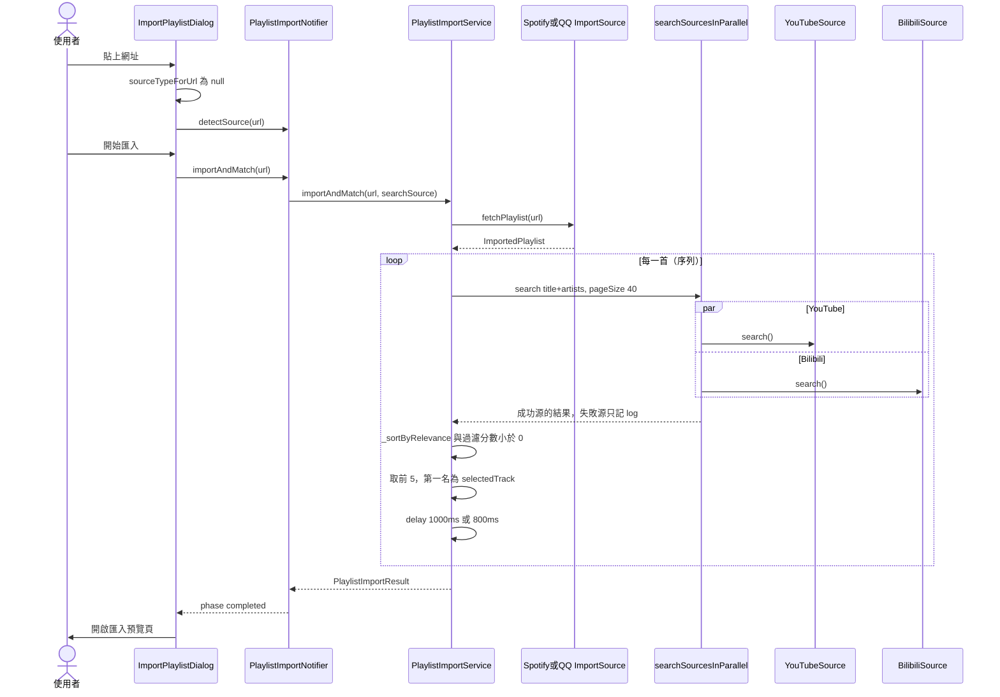
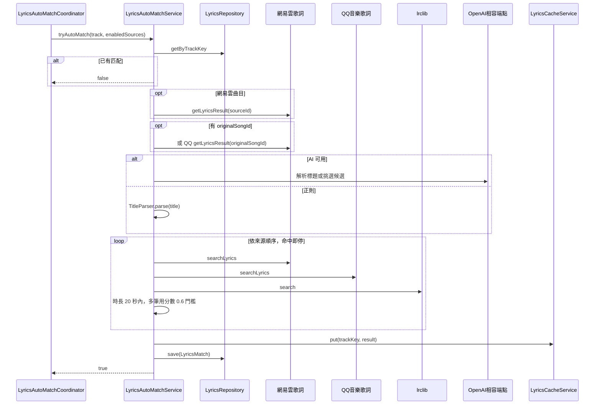

# 音源現況審計

> 現況描述，未經確認，不代表目標。

審計日期：2026-09-26，分支 `docs/audit`。方法：只讀原始碼與 grep，未執行 App、未跑測試、未打真實 API。行號為審計當下實際看到的位置。
標記：**不一致** = 文檔／註釋與程式碼對不上；**推測** = 由程式碼路徑推論、未實跑驗證；**查不到** = 找不到對應實作。

---

## 1. 能力矩陣

### 1.1 播放音源（註冊在 `SourceManager`）

`SourceManager` 預設只註冊三個 adapter：`[BilibiliSource(), YouTubeSource(), NeteaseSource()]`（`lib/data/sources/source_provider.dart:14`）。各 adapter 宣告實作的能力介面：

- Bilibili：`DisposableSource, TrackInfoSource, AudioStreamSource, SearchSource, PlaylistParsingSource, TrackDetailSource, PagedVideoSource, RankingSource, LiveSource`（`lib/data/sources/bilibili_source.dart:41-52`）
- YouTube：`DisposableSource, TrackInfoSource, AudioStreamSource, SearchSource, PlaylistParsingSource, TrackDetailSource, DynamicPlaylistSource, RankingSource`（`lib/data/sources/youtube_source.dart:27-37`）
- 網易雲：`DisposableSource, TrackInfoSource, AudioStreamSource, SearchSource, PlaylistParsingSource, TrackDetailSource, RankingSource`（`lib/data/sources/netease_source.dart:25-34`）

| 能力 | Bilibili | YouTube | 網易雲 |
|---|---|---|---|
| 搜尋 | ✅ `search()` 走 `/x/web-interface/search/type`（`bilibili_source.dart:476-532`） | ✅ `search()` 走 youtube_explode（`youtube_source.dart:865-970`） | 部分：`search()` 走 `/api/cloudsearch/pc`，**`order` 參數收了但沒用**（`netease_source.dart:183-253`） |
| 串流解析 | ✅ DASH（`fnval=16`）→ durl（muxed）；HLS 直接回 null（`bilibili_source.dart:297-324, 327-426`） | ✅ 每個 streamType 先匿名（androidVr / ios+safari+android / safari+ios），失敗才用同一 streamType 帶 auth 打 InnerTube WEB `/player`（`youtube_source.dart:332-378, 407-426, 445-587`） | 部分：eapi `/song/enhance/player/url/v1`（`netease_source.dart:93-171`）；`getAlternativeAudioStream` 永遠回 null，沒有替代 URL（`netease_source.dart:173-178`）；試聽片段（`freeTrialInfo`）只寫進 log，不告知使用者（`netease_source.dart:145-150`） |
| 歌單匯入（貼網址） | ✅ 收藏夾 URL，先過主機白名單（`bilibili_source.dart:193-210, 535-645`） | ✅ 一般歌單（InnerTube→youtube_explode 退路）與 Mix（`youtube_source.dart:1377-1440`） | ✅ 歌單 URL 與 `163cn.tv` 短網址（`netease_source.dart:257-325, 714-723, 755-775`） |
| 登入 | ✅ WebView + QR 兩個分頁（`lib/ui/pages/settings/bilibili_login_page.dart:15, 54-63`） | ✅ 僅 WebView，UA 偽裝繞過 Google 的 WebView 封鎖（`lib/ui/pages/settings/youtube_login_page.dart:13-16, 60-70`） | ✅ Android：WebView + QR；其他平台只有 QR（`lib/ui/pages/settings/netease_login_page.dart:16, 32, 52-77`） |
| 收藏同步／遠端歌單讀取 | ✅ `getFavFolders`（`lib/services/account/bilibili_favorites_service.dart:55`）；帳號頁列出後以 URL 走一般匯入（`lib/ui/pages/settings/widgets/account_playlists_sheet.dart:130-143`） | ✅ `getPlaylists`（`lib/services/account/youtube_playlist_service.dart:63`；`account_playlists_sheet.dart:145-158`） | ✅ `getPlaylists`（`lib/services/account/netease_playlist_service.dart:68`；`account_playlists_sheet.dart:160-172`） |
| 遠端歌單編輯（寫） | ✅ 建立／加入／批次移除（`bilibili_favorites_service.dart:117, 154, 187`；adapter `lib/services/library/remote_playlist_edit_controller.dart:225`） | ✅ 建立／加入／移除（`youtube_playlist_service.dart:88, 105, 218`；adapter `remote_playlist_edit_controller.dart:310`） | ✅ 建立／加入／移除（`netease_playlist_service.dart:101, 146, 159`；adapter `remote_playlist_edit_controller.dart:367`） |
| 排行／探索 | ✅ `ranking/v2`，預設 `rid=1003` 音樂區（`bilibili_source.dart:865-917`） | 部分：不是排行榜，是 YouTube Music 頻道「New This Week」歌單再依播放數排序（`youtube_source.dart:48-51, 1617-1652`） | ✅ 官方熱歌榜歌單 `3778678`（`netease_source.dart:42, 332-364`） |
| 電台直播 | ✅ 兩條路：搜尋頁的 `LiveSource`（`bilibili_source.dart:1025-1057`；`lib/providers/search/search_provider.dart:217`）；電台頁的 `RadioSource` 直接用 `BilibiliLiveClient`，**不經 `SourceManager`**（`lib/services/radio/radio_source.dart:60-71`） | ❌ 明確拒絕（`radio_source.dart:140-143`） | ❌ 未實作 `LiveSource`（`netease_source.dart:25-34`） |
| 推薦／Mix | ❌ | ✅ Mix（`DynamicPlaylistSource`，`youtube_source.dart:977-1073`；呼叫端寫死 `SourceIds.youtube`：`lib/providers/audio/audio_controller_provider.dart:74`、`lib/providers/library/playlist_provider.dart:426`） | ❌ 查不到每日推薦／私人 FM 之類的實作 |
| 歌詞 | ❌（只當被匹配的一方） | ❌（同左） | ✅ 另一個同名類別 `lib/services/lyrics/netease_source.dart:130`；網易雲曲目直接用 `sourceId` 取歌詞（`lib/services/lyrics/lyrics_auto_match_service.dart:104-127`） |
| 下載 | ✅ 共用下載管線（`lib/services/download/download_service.dart:977, 1060-1070`） | 部分：HLS 串流拒絕下載（`download_service.dart:1060-1070, 1716-1735`） | ✅ 共用下載管線；試聽片段同樣不會被擋（核查確認為程式碼事實：`isTrial` 只用在 log，`AudioStreamResult` 沒有對應欄位，`lib/` 其他地方 grep `trial` 無結果，下載端無從判斷；原標「**推測**」。API 實際何時回試聽 URL 仍待實機） |
| 影片分P（cid） | ✅ `PagedVideoSource`（`bilibili_source.dart:649-680`）；匯入時展開多 P（`lib/services/import/import_service.dart:205, 454, 588`） | ❌ | ❌ |
| 音質選擇 | 部分：只依 `qualityLevel` 在 DASH 音軌中挑（`bilibili_source.dart:356-363`），格式優先序不適用（固定 aac，`bilibili_source.dart:373-381`）；查不到 Hi-Res／杜比（只讀 `dash['audio']`，`bilibili_source.dart:349-353`） | ✅ `qualityLevel` + `formatPriority`（opus/aac）（`youtube_source.dart:589-615`） | ✅ `qualityLevel` 映射為 `lossless`/`exhigh`/`standard`（`netease_source.dart:785-794`） |
| 詳情／評論（額外） | ✅ `TrackDetailSource`（`bilibili_source.dart:744-811`） | ✅（`youtube_source.dart:214-281`） | ✅（`netease_source.dart:376-464`） |

共通：音質逐級降級（high→medium→low）只在 `unavailable` / `vipRequired` 時觸發（`lib/data/sources/audio_stream_quality_fallback.dart:42-67`，條件見 `lib/data/sources/source_exception.dart:23-25`）。串流優先序（audioOnly/muxed/hls）是每源設定（`lib/data/models/settings.dart:59-63`）。

### 1.2 非播放來源

| 來源 | 能力 | 證據 |
|---|---|---|
| Spotify | 僅歌單匯入（抓 `open.spotify.com/embed/playlist/<id>` 頁面解析），再用播放音源搜尋匹配；無歌詞直取 | `lib/data/sources/playlist_import/spotify_playlist_source.dart:57-59`；`lyrics_auto_match_service.dart:658-659` |
| QQ 音樂（匯入） | 僅歌單匯入（`u6.y.qq.com/cgi-bin/musics.fcg` + 自簽 `sign`） | `lib/data/sources/playlist_import/qq_music_playlist_source.dart:151-162` |
| QQ 音樂（歌詞） | 歌詞搜尋與取得（`u.y.qq.com/cgi-bin/musicu.fcg`） | `lib/services/lyrics/qqmusic_source.dart:98, 146, 188, 253` |
| lrclib | 歌詞搜尋／依 id 取得／精確查 | `lib/services/lyrics/lrclib_source.dart:22-125`；UA 仍是佔位字串 `FMP/1.0.0 (https://github.com/user/fmp)`（`lrclib_source.dart:24`） |
| 網易雲（歌詞） | 歌詞搜尋與取得，自帶一個 Dio，不帶登入 | `lib/services/lyrics/netease_source.dart:130-150, 301` |
| Bilibili 直播 | 電台（直播轉音訊）、粉絲勳章牆匯入電台 | `lib/data/sources/bilibili_live_client.dart:104`；`lib/services/radio/radio_controller.dart:670-690` |
| OpenAI 相容端點 | 歌詞 AI 標題解析與候選挑選（使用者自填 endpoint/key） | `lib/services/lyrics/ai_title_parser.dart`、`lib/services/lyrics/ai_lyrics_selector.dart`；呼叫處 `lyrics_auto_match_service.dart:153-190, 388-400` |

`PlaylistSource` enum 有 `netease` 成員（`lib/data/sources/playlist_import/playlist_import_source.dart:95-98`），但 `PlaylistImportService` 只註冊 QQ 與 Spotify（`lib/services/import/playlist_import_service.dart:137`），全 repo 查不到任何地方產生 `PlaylistSource.netease` 的 `ImportedTrack`。網易雲網址走內部 `SourceManager` 匯入（`lib/ui/pages/library/widgets/import_playlist_dialog.dart:159-168`）。`PlaylistSource.netease` 目前只剩 switch 分支，實際上是死值。

---

## 2. 音源抽象現況

### 2.1 有什麼

- **沒有**全能基底類別。`base_source.dart` 開頭註明刻意不設 `BaseSource`（`lib/data/sources/base_source.dart:4-5`），檔案裡只剩 DTO（`AudioStreamConfig`、`AudioStreamRequest`、`AudioStreamResult`、`SearchResult`、`PlaylistParseResult`）。
- 能力是 9 個窄介面，全部繼承 `SourceCapability { String get sourceType; }`（`lib/data/sources/source_capabilities.dart:7-126`）（核查更正：原寫「10 個窄介面，全部繼承」；繼承者為 TrackInfo／AudioStream／TrackDetail／PagedVideo／DynamicPlaylist／Ranking／Live／Search／PlaylistParsing 共 9 個，連同下面的 `DisposableSource` 才是 10 個）。另有不繼承它的 `DisposableSource`（`source_capabilities.dart:15-17`）。
- `SourceManager` 以 `_capability<T>(type)` 依 id 與型別查能力（`source_provider.dart:28-35`），另有依 URL 找 adapter 的 `*ForUrl`（`source_provider.dart:57-85`）。UI 列音源用 `registeredSourceTypesProvider` / `searchSourceTypesProvider` / `rankingSourceTypesProvider`（`source_provider.dart:110-130`）。
- 音源 id 是字串常數 `SourceIds`（`lib/data/models/source_ids.dart:15-43`），與 ADR 0001 一致。

### 2.2 抽象之外的平行體系（不經 `SourceManager`）

| 體系 | 型別 | 證據 |
|---|---|---|
| 帳號 | `abstract class AccountService` + 三個實作 | `lib/services/account/account_service.dart:15-47`；`bilibili_account_service.dart:66`、`youtube_account_service.dart:21`、`netease_account_service.dart:23` |
| 遠端歌單讀取 | 三個互不相干的 service，無共同介面，UI 以 `switch` 分派 | `account_playlists_sheet.dart:130-172` |
| 遠端歌單寫入 | `abstract class RemotePlaylistEditAdapter` + 三個 adapter | `remote_playlist_edit_controller.dart:19, 225, 310, 367` |
| 歌詞 | 三個具體類別（`LrclibSource`、lyrics `NeteaseSource`、`QQMusicSource`），**無共同介面**，靠字串 `'netease'/'qqmusic'/'lrclib'` 分派 | `lrclib_source.dart:22`、`lib/services/lyrics/netease_source.dart:130`、`qqmusic_source.dart:98`；分派 `lyrics_auto_match_service.dart:278-300, 444-461` |
| 外部歌單匯入 | `abstract class PlaylistImportSource` + Spotify/QQ | `playlist_import_source.dart:113-125` |
| 電台 | 具體類別 `RadioSource`，直接持有 `BilibiliLiveClient` | `radio_source.dart:60-71` |

### 2.3 繞過能力介面的地方

- **Mix**：`dynamicPlaylistSource(SourceIds.youtube)` 寫死 YouTube（`audio_controller_provider.dart:74`、`playlist_provider.dart:426`）。
- **直播搜尋**：`liveSource(SourceIds.bilibili)` 寫死（`search_provider.dart:217`）。
- **電台**：完全不經 `LiveSource`，`RadioSource` 直接呼叫 `BilibiliLiveClient`（`radio_source.dart:60-71`），勳章牆直接讀 `bilibiliAccountServiceProvider`（`radio_controller.dart:672`）。
- **歌單匯入匹配**：搜尋音源寫死 `[SourceIds.youtube, SourceIds.bilibili]`（`playlist_import_service.dart:320`），不看 `searchSourceTypesProvider`。
- **帳號 Cookie 自動刷新**：只刷 Bilibili（`lib/providers/account/account_provider.dart:131-152`）。
- **播放認證**：`SourceAuthContext.authForPlay` 經 `AccountServiceAuthLoader` 以 `platform` 為鍵查帳號服務（`lib/services/account/source_auth_context.dart:22-36, 133-137`），這條路是查表，沒有具體型別。

### 2.4 類別圖

```mermaid
classDiagram
    class SourceCapability {
        <<interface>>
        +String sourceType
    }
    class DisposableSource {
        <<interface>>
        +dispose()
    }
    class TrackInfoSource {
        <<interface>>
        +parseId(url)
        +canHandle(url)
    }
    class AudioStreamSource {
        <<interface>>
        +getAudioStream(request)
        +getAlternativeAudioStream(request)
    }
    class SearchSource {
        <<interface>>
        +search(query, page, pageSize, order)
    }
    class PlaylistParsingSource {
        <<interface>>
        +isPlaylistUrl(url)
        +parsePlaylist(url, authHeaders)
    }
    class TrackDetailSource {
        <<interface>>
        +getVideoDetail(id, authHeaders)
    }
    class PagedVideoSource {
        <<interface>>
        +getVideoPages(id, authHeaders)
    }
    class DynamicPlaylistSource {
        <<interface>>
        +isDynamicPlaylistUrl(url)
        +getMixPlaylistInfo(url)
        +fetchMixTracks(playlistId, currentVideoId)
    }
    class RankingSource {
        <<interface>>
        +defaultRankingRequest
        +getRankingTracks(request)
    }
    class LiveSource {
        <<interface>>
        +searchLiveRooms(query)
        +getLiveStreamUrl(roomId)
    }
    SourceCapability <|-- TrackInfoSource
    SourceCapability <|-- AudioStreamSource
    SourceCapability <|-- SearchSource
    SourceCapability <|-- PlaylistParsingSource
    SourceCapability <|-- TrackDetailSource
    SourceCapability <|-- PagedVideoSource
    SourceCapability <|-- DynamicPlaylistSource
    SourceCapability <|-- RankingSource
    SourceCapability <|-- LiveSource

    class BilibiliSource
    class YouTubeSource
    class NeteaseSource_data
    BilibiliSource ..|> DisposableSource
    BilibiliSource ..|> TrackInfoSource
    BilibiliSource ..|> AudioStreamSource
    BilibiliSource ..|> SearchSource
    BilibiliSource ..|> PlaylistParsingSource
    BilibiliSource ..|> TrackDetailSource
    BilibiliSource ..|> PagedVideoSource
    BilibiliSource ..|> RankingSource
    BilibiliSource ..|> LiveSource
    YouTubeSource ..|> DisposableSource
    YouTubeSource ..|> TrackInfoSource
    YouTubeSource ..|> AudioStreamSource
    YouTubeSource ..|> SearchSource
    YouTubeSource ..|> PlaylistParsingSource
    YouTubeSource ..|> TrackDetailSource
    YouTubeSource ..|> DynamicPlaylistSource
    YouTubeSource ..|> RankingSource
    NeteaseSource_data ..|> DisposableSource
    NeteaseSource_data ..|> TrackInfoSource
    NeteaseSource_data ..|> AudioStreamSource
    NeteaseSource_data ..|> SearchSource
    NeteaseSource_data ..|> PlaylistParsingSource
    NeteaseSource_data ..|> TrackDetailSource
    NeteaseSource_data ..|> RankingSource

    class SourceManager {
        -List~SourceCapability~ _sources
        +audioStreamSource(type)
        +searchSource(type)
        +playlistParsingSourceForUrl(url)
        +liveSource(type)
        +dispose()
    }
    SourceManager o-- SourceCapability

    class BilibiliLiveClient
    BilibiliSource --> BilibiliLiveClient
    class RadioSource
    RadioSource --> BilibiliLiveClient : 繞過 SourceManager

    class AccountService {
        <<abstract>>
        +platform
        +getAuthHeaders()
        +checkAccountStatus()
        +markSessionExpired()
    }
    AccountService <|-- BilibiliAccountService
    AccountService <|-- YouTubeAccountService
    AccountService <|-- NeteaseAccountService

    class RemotePlaylistEditAdapter {
        <<abstract>>
    }
    RemotePlaylistEditAdapter <|.. BilibiliRemotePlaylistEditAdapter
    RemotePlaylistEditAdapter <|.. YouTubeRemotePlaylistEditAdapter
    RemotePlaylistEditAdapter <|.. NeteaseRemotePlaylistEditAdapter

    class PlaylistImportSource {
        <<abstract>>
        +canHandle(url)
        +fetchPlaylist(url)
    }
    PlaylistImportSource <|-- SpotifyPlaylistSource
    PlaylistImportSource <|-- QQMusicPlaylistSource

    class LrclibSource
    class NeteaseSource_lyrics
    class QQMusicSource
    note for NeteaseSource_lyrics "歌詞三源無共同介面，以字串 id 分派"
```

圖中 `NeteaseSource_data` 指 `lib/data/sources/netease_source.dart:25`，`NeteaseSource_lyrics` 指 `lib/services/lyrics/netease_source.dart:130`。兩者同名。AGENTS.md 說 `neteaseSourceProvider` 是歌詞層那一個，這點與 `lib/providers/lyrics/lyrics_provider.dart:35-37` 一致。

---

## 3. 「今天新增一個音源要改哪些檔案」

樣本：網易雲。`lib/` 內提到 `netease`（不分大小寫）的 Dart 檔有 **49** 個（不含 `*.g.dart`），i18n JSON 有 **20** 個（en 8、zh-CN 6、zh-TW 6），`test/` 內有 **68** 個檔。下表依「要不要改」整理，`<x>` 代表新音源。

### 3.1 最小可用（能搜尋、能播放）

| # | 檔案 | 為什麼要改 |
|---|---|---|
| 1 | `lib/data/models/source_ids.dart:16-24` | 加常數並放進 `values`。`values` 會帶動設定預設、首頁排行白名單、音訊設定列表、搜尋 `allDirectSources`（`settings.dart:170`、`audio_settings_provider.dart:152, 168`、`search_provider.dart:35`、`database_migration.dart:307`） |
| 2 | `lib/data/sources/<x>_source.dart`（新） | 實作需要的能力介面 |
| 3 | `lib/data/sources/<x>_exception.dart`（新） | 繼承 `SourceApiException`，把平台錯誤碼映射成 `SourceErrorKind` |
| 4 | `lib/data/sources/source_provider.dart:14` | 註冊進預設清單 |
| 5 | `lib/data/sources/source_http_policy.dart:43-70` | 每源 CDN／API header、UA；未知 id 回空 map |
| 6 | `lib/data/sources/source_url_policy.dart:12-13` 一帶 | 主機白名單（`isPlaylistUrl` / `parseId` 會用） |
| 7 | `lib/core/utils/icon_helpers.dart:15-18` | 品牌圖示 switch |
| 8-10 | `lib/i18n/{en,zh-CN,zh-TW}/importPlatform.i18n.json` | `SourceIds.displayNameFor` 靠 flat map 查名字（`source_ids.dart:31-34`） |
| 11-13 | `lib/i18n/{en,zh-CN,zh-TW}/audioSettings.i18n.json` | 音訊設定頁以 `audioSettings.streamPriority.<id>Title`、`authForPlay.<id>Description` 查字串（`lib/ui/pages/settings/audio_settings_page.dart:57, 153-155`） |
| 14 | `lib/data/models/settings.dart:59-63, 76-79, 172` | 預設串流優先序、預設是否帶認證（有 fallback 可不改）；`defaultHomeRankingSourcePriority` 是寫死的 `'bilibili,youtube,netease'` |
| 15 | `lib/services/platform/url_launcher_service.dart:19-45` | 「在 App／網頁開啟」連結表 |

選配（不改不會壞，但呈現會退化）：

| # | 檔案 | 為什麼 |
|---|---|---|
| 16 | `lib/core/utils/thumbnail_url_utils.dart:130, 391-418` | 封面 CDN 尺寸最佳化 |
| 17 | `lib/core/utils/source_presentation.dart:8, 11` | 歌曲型還是影片型呈現（方形封面、收藏數） |
| 18 | `lib/data/models/video_detail.dart:198` | 目前每源一個 factory（`fromNetease`、`fromYouTube`） |
| 19 | `lib/ui/pages/settings/developer_options_page.dart:212-218` + 3 份 `settings.i18n.json` 的 `rankingCache` 字串 | 開發者頁把三源排行快取數寫死（`zh-TW/settings.i18n.json:182`） |

### 3.2 有登入

| # | 檔案 | 為什麼 |
|---|---|---|
| 20-22 | `lib/services/account/<x>_account_service.dart`、`<x>_credentials.dart`、`<x>_auth_interceptor.dart`（新） | 帳號、憑證、請求期失效偵測 |
| 23 | `lib/providers/account/account_provider.dart:78-92` 與每源 provider 宣告 | `accountProvidersBySource` 與 `accountServicesProvider` 都是手寫清單 |
| 24 | `lib/ui/pages/settings/<x>_login_page.dart`（新） | 登入頁 |
| 25 | `lib/ui/router.dart:60, 93, 282-284` | 路由 |
| 26 | `lib/ui/pages/settings/account_management_page.dart:60-125` | 三張 `_PlatformCard` 手寫 |
| 27-29 | `lib/i18n/*/account.i18n.json` | 登入文案、VIP 文案 |

### 3.3 有遠端歌單

| # | 檔案 | 為什麼 |
|---|---|---|
| 30 | `lib/services/account/<x>_playlist_service.dart`（新） | 讀寫遠端歌單 |
| 31 | `lib/services/library/remote_playlist_edit_controller.dart:367` 一類 | 新 adapter 類別 |
| 32 | `lib/providers/library/remote_playlist_sync_provider.dart:43-58` | adapter map |
| 33 | `lib/ui/widgets/dialogs/add_to_<x>_playlist_dialog.dart`（新） | 每源一個對話框 |
| 34 | `lib/ui/widgets/dialogs/add_to_remote_playlist_dialog.dart:22-27` | 對話框 map |
| 35 | `lib/ui/pages/settings/widgets/account_playlists_sheet.dart:130-172` | `switch` 分派三個 service |
| 36 | `lib/ui/pages/library/playlist_detail_page.dart:623-634, 1623-1634` | 每源例外型別各一個 `on ... catch` |
| 37 | `lib/data/sources/remote_playlist_id_parser.dart:8-14` | 依源解析遠端歌單 id |
| 38-40 | `lib/i18n/*/remote.i18n.json` | `dialogTitle<X>` |

### 3.4 也是歌詞源

| # | 檔案 | 為什麼 |
|---|---|---|
| 41 | `lib/services/lyrics/<x>_source.dart`（新） | 沒有共同介面可實作 |
| 42 | `lib/services/lyrics/lyrics_auto_match_service.dart:96, 104, 278-300, 444-461, 650-660` | 字串分派 5 處 |
| 43 | `lib/providers/lyrics/lyrics_provider.dart:36, 172-181, 391, 430-460` | 每源 provider、取內容、手動搜尋 |
| 44 | `lib/ui/pages/lyrics/lyrics_search_sheet.dart:83, 88, 101, 550` | 篩選、圖示、名稱 |
| 45 | `lib/ui/pages/settings/lyrics_source_settings_page.dart:60, 73` | 名稱、圖示 |
| 46 | 預設歌詞順序字串：`settings.dart:357, 601`、`lib/providers/audio/audio_settings_provider.dart:45`、`lib/services/backup/backup_data.dart:670, 749`、`lib/data/database/database_migration.dart:321` | 同一個 `'netease,qqmusic,lrclib'` 寫在 4 個檔 6 處 |
| 47-49 | `lib/i18n/*/lyrics.i18n.json`（及 `settings.i18n.json` 的 `sourceX`） | 名稱 |

### 3.5 能力寫死給特定音源（新源要有該能力就得改）

| 檔案 | 寫死的內容 |
|---|---|
| `lib/providers/audio/audio_controller_provider.dart:74`、`lib/providers/library/playlist_provider.dart:426` | Mix 只找 YouTube |
| `lib/providers/search/search_provider.dart:217`、`lib/ui/pages/search/search_page.dart:239, 253, 267` | 直播搜尋只找 Bilibili |
| `lib/services/radio/radio_source.dart:140-153`、`lib/services/radio/radio_controller.dart:672, 741, 755` | 電台只支援 Bilibili |
| `lib/services/import/playlist_import_service.dart:22-37, 277-283, 314-352, 1163-1198` | 外部歌單匹配只搜 YouTube／Bilibili。檔頭註解（`:15-21`）承認網易雲沒加進來，並說這是產品決定 |
| `lib/providers/download/download_scanner.dart:387` | 掃到認不得的下載資料夾一律當 Bilibili |
| `lib/services/library/remote_playlist_edit_controller.dart:206` | 查不到歌單來源時退回 YouTube |

### 3.6 不必改

- `lib/services/backup/backup_data.dart:573-577`：只折疊 v3 以前的舊備份鍵。
- `lib/data/database/database_migration.dart:179-242`：v1→v2 遷移專用。
- 搜尋 chip、探索頁 tab、音訊設定清單、歷史篩選：都從 provider 推導（`search_page.dart:200`、`explore_page.dart:35`、`audio_settings_page.dart:17`、`play_history_page.dart:357`）。

### 3.7 統計

| 情境 | 檔案數 |
|---|---|
| 最小可用（3.1 必改 #1-15） | **15**：新增 2（adapter、例外）+ 修改 Dart 7 + i18n JSON 6 |
| 加上選配呈現（#16-19） | 19 + 3 份 `settings.i18n.json` = **22** |
| 與網易雲同等（登入 + 遠端歌單 + 歌詞） | 約 **54**：3.1 的 22 + 3.2 的 10 + 3.3 的 11 + 3.4 的 11（#46 另含 `audio_settings_provider.dart`、`backup_data.dart`、`database_migration.dart` 3 檔）。3.5 的寫死能力不含在內 |
| 對照：網易雲實際足跡 | lib Dart **49** 檔 + i18n JSON **20** 檔（en 8、zh-CN 6、zh-TW 6）；測試 **68** 檔 |

---

## 4. 音源特定分支散落位置

範圍：`lib/ui`、`lib/services`、`lib/providers`。「分支」採寬定義：依音源 id 做 `==`／`switch`／`case`、以音源 id 為鍵的手寫 map 或清單、把某能力寫死給某源、每源各一個 typed catch。音源自己檔案裡的自我識別（例如 `String get platform => SourceIds.bilibili`、建立 `Track` 時填 `sourceType`）不算。歌詞源字串（`'netease'/'qqmusic'/'lrclib'`）另列一類，因為它是另一套 id。

### 4.1 表

| # | 位置 | 分支內容 | 能力 |
|---|---|---|---|
| 1 | `lib/ui/pages/library/widgets/import_playlist_dialog.dart:51-55` | `switch (PlaylistSource)` → 圖示 | 匯入 |
| 2 | `import_playlist_dialog.dart:149-152` | Mix 縮寫網址 → `SourceIds.youtube` | Mix／匯入 |
| 3 | `lib/ui/pages/lyrics/lyrics_search_sheet.dart:83` | map `'netease'` → `LyricsSourceFilter` | 歌詞 |
| 4 | `lyrics_search_sheet.dart:88-90` | switch 歌詞源 → 圖示 | 歌詞 |
| 5 | `lyrics_search_sheet.dart:101-103` | switch 歌詞源 → 名稱 | 歌詞 |
| 6 | `lyrics_search_sheet.dart:550-551` | switch 結果來源 → 圖示 | 歌詞 |
| 7 | `lib/ui/pages/search/search_page.dart:239, 253, 267` | 直播篩選 chip 寫死 `sourceType: SourceIds.bilibili` | 直播 |
| 8 | `lib/ui/pages/settings/account_management_page.dart:60, 83, 105` | 三張平台卡片手寫 | 登入 |
| 9 | `lib/ui/pages/settings/developer_options_page.dart:212-218` | 逐源取排行快取數 | 排行（偵錯） |
| 10 | `lib/ui/pages/settings/lyrics_source_settings_page.dart:60-62` | switch 歌詞源 → 名稱 | 歌詞 |
| 11 | `lyrics_source_settings_page.dart:73-75` | switch 歌詞源 → 圖示 | 歌詞 |
| 12 | `lib/ui/pages/settings/widgets/account_playlists_sheet.dart:130-172` | `switch (platform)` 三個 `case` 分派 service | 遠端歌單讀取 |
| 13 | `lib/ui/widgets/dialogs/add_to_remote_playlist_dialog.dart:22-27` | map 源 → 對話框 | 遠端歌單寫入 |
| 14 | `lib/ui/pages/library/playlist_detail_page.dart:623-634` | 三個 per-source 例外 `on` | 遠端歌單寫入／錯誤 |
| 15 | `playlist_detail_page.dart:1623-1634` | 同上 | 遠端歌單寫入／錯誤 |
| 16 | `lib/ui/pages/player/player_page.dart:824, 842` | `isSongSource` / `showsFavoriteCount`（間接，表在 `source_presentation.dart:8, 11`） | 詳情呈現 |
| 17 | `lib/ui/widgets/panels/track_detail_panel.dart:830, 946, 975, 1061` | 同上，4 處 | 詳情呈現 |
| 18 | `lib/services/backup/backup_data.dart:573-577` | 舊備份鍵 map | 備份 |
| 19 | `lib/services/import/import_service.dart:374` | Mix 匯入寫 `importSourceType = youtube` | Mix |
| 20 | `lib/services/import/playlist_import_service.dart:22-37` | `SearchSourceConfig { all, bilibiliOnly, youtubeOnly }` | 匯入匹配 |
| 21 | `playlist_import_service.dart:99-110` | switch `PlaylistSource` → 歌詞源字串 | 匯入／歌詞 |
| 22 | `playlist_import_service.dart:277-283` | 依設定選節流延遲 | 匯入匹配 |
| 23 | `playlist_import_service.dart:314-352` | switch 設定；`:320` 寫死 `[youtube, bilibili]` | 匯入匹配 |
| 24 | `playlist_import_service.dart:1163-1198` | 手動搜尋 switch 設定 | 匯入匹配 |
| 25 | `lib/services/library/remote_playlist_edit_controller.dart:206` | 退回 `SourceIds.youtube` | 遠端歌單寫入 |
| 26 | `lib/services/lyrics/lyrics_auto_match_service.dart:96` | 預設 `['netease','qqmusic','lrclib']` | 歌詞 |
| 27 | `lyrics_auto_match_service.dart:104-105` | `track.sourceType == SourceIds.netease` 直取歌詞 | 歌詞 |
| 28 | `lyrics_auto_match_service.dart:278-300` | switch 歌詞源 | 歌詞 |
| 29 | `lyrics_auto_match_service.dart:444-461` | switch 歌詞源 | 歌詞 |
| 30 | `lyrics_auto_match_service.dart:650-660` | if/else 歌詞源直取 | 歌詞 |
| 31 | `lib/services/platform/url_launcher_service.dart:19-32` | 影片連結 map | 外部開啟 |
| 32 | `url_launcher_service.dart:36-45` | 頻道連結 map | 外部開啟 |
| 33 | `lib/services/radio/radio_controller.dart:672` | 直接讀 `bilibiliAccountServiceProvider` | 電台 |
| 34 | `radio_controller.dart:741` | `station.sourceType == SourceIds.bilibili` | 電台 |
| 35 | `radio_controller.dart:755` | `const sourceType = SourceIds.bilibili` | 電台 |
| 36 | `lib/services/radio/radio_source.dart:140-153` | 拒絕 YouTube、只收 Bilibili | 電台 |
| 37 | `lib/providers/account/account_provider.dart:78-81` | `accountProvidersBySource` map | 登入 |
| 38 | `account_provider.dart:85-92` | `accountServicesProvider` 手寫清單 | 登入 |
| 39 | `account_provider.dart:131-152` | 只刷 Bilibili cookie | 登入／Cookie |
| 40 | `lib/providers/audio/audio_controller_provider.dart:74` | `dynamicPlaylistSource(SourceIds.youtube)` | Mix |
| 41 | `lib/providers/audio/audio_settings_provider.dart:45` | 預設歌詞順序 | 歌詞 |
| 42 | `lib/providers/download/download_scanner.dart:387` | 未知資料夾 → `SourceIds.bilibili` | 下載 |
| 43 | `lib/providers/library/playlist_import_provider.dart:98-105` | switch `PlaylistSource` → 字串（與 #21 重複一份） | 匯入／歌詞 |
| 44 | `lib/providers/library/playlist_provider.dart:426` | `dynamicPlaylistSource(SourceIds.youtube)` | Mix |
| 45 | `lib/providers/library/remote_playlist_sync_provider.dart:43-58` | adapter map | 遠端歌單寫入 |
| 46 | `lib/providers/lyrics/lyrics_provider.dart:36` 一帶 | 每個歌詞源一個 provider | 歌詞 |
| 47 | `lyrics_provider.dart:172-181` | if/else 歌詞源取內容 | 歌詞 |
| 48 | `lyrics_provider.dart:391` | switch 篩選 → 歌詞源 | 歌詞 |
| 49 | `lyrics_provider.dart:430-460` | switch 歌詞源並行搜尋 | 歌詞 |
| 50 | `lib/providers/search/search_provider.dart:217` | `liveSource(SourceIds.bilibili)` | 直播 |

另外還有整份檔案就是某一源的 UI／服務：3 個登入頁、3 個 `add_to_<x>_playlist_dialog.dart`、3 組帳號服務、3 個歌詞源類別。它們不在表內。

### 4.2 總數

- 寬定義：**50 個分支點**（上表），分布在 **28 個檔案**（ui 11、services 8、providers 9）。依能力：歌詞 16、匯入／匹配 7、遠端歌單 6、電台／直播 6、登入 4、Mix 4、詳情呈現 2、外部開啟 2、其他 3（排行偵錯、備份、下載）。
- 窄定義（static rule `test/support/source_branch_points_static_rule_test.dart` 只數 `==`/`!=`/`case`/`=>` 且排除 map 與 lyrics 檔名的字面值）：整個 `lib/`（排除 `lib/data/sources/`）預算 **9** 處（`source_branch_points_static_rule_test.dart:24-45`）；落在 ui/services/providers 的是 `radio_controller.dart` 1、`lyrics_auto_match_service.dart` 1、`account_playlists_sheet.dart` 3，共 **5**。這個測試本審計**未執行**，數字取自它宣告的預算。
- 兩個數字差很多，因為 static rule 刻意把 map 查表、`PlaylistSource` enum、歌詞源字串、寫死能力的 `xxxSource(SourceIds.y)` 呼叫都排除在外。它守得住「多一個 `==`」，守不住「多一張手寫 map」。

---

## 5. 匯入與匹配流程

### 5.1 外部歌單（Spotify／QQ）匹配到可播放音源

入口：匯入對話框先問 `SourceManager.sourceTypeForUrl`（內部源直接匯入），認不得才問 `PlaylistImportService.detectSource`（`import_playlist_dialog.dart:159-180`）。

演算法（`lib/services/import/playlist_import_service.dart`）：

1. 取歌單：第一個 `canHandle(url)` 的 `PlaylistImportSource.fetchPlaylist`（`:212-219`）。Spotify 解析 embed 頁（`spotify_playlist_source.dart:57-76`）；QQ 打簽名 API（`qq_music_playlist_source.dart:151-181`）。
2. 逐首搜尋，**序列執行**，每首之間固定延遲：`all` 1000ms、單源 800ms（`:276-285`；常數 `lib/core/constants/app_constants.dart:83-88`）。
3. 查詢字串 `"$title ${artists.join(' ')}"`（`playlist_import_source.dart:28`）。每源取 `maxResults × 8` 筆，預設 `5 × 8 = 40`（`:153, 312`）。
4. 候選來源：
   - `all`：並行搜 **YouTube 與 Bilibili**，單源失敗只寫 log（`:314-331`）。網易雲不在內（`:15-21` 註解承認）。
   - `bilibiliOnly` / `youtubeOnly`：單源，失敗直接拋出，該首記為 `noResult`（`:333-351, 264-272`）。
5. 打分 `_calculateRelevanceScore`（`:443-535`）：
   - 時長先過濾：差距評分 < -50 直接回 -100（`:454-463`）。時長分數表見 `:619-660`（差 ≤10 秒 +20；>200% 為 -100）。
   - 加權：標題相似度 ×0.35、藝人相似度 ×0.25、播放量 ×0.15、組合分 ×0.15（`:499-503`）。
   - 加分：精確匹配、頻道與藝人、官方頻道、標題關鍵字、時長、版本、括號內歌名 +15（`:506-532`）。
   - 相似度用 N-gram 與 Jaccard 取高者（`:1044-1075`）。
6. 排序時另外加播放量相對分：佔最高播放量比例 ×8，差 100 倍再 +10、差 10 倍 +4（`:376-427`）。
7. 過濾分數 < 0，取前 5，第一名自動選為 `selectedTrack`，狀態 `matched`（`:354-372, 250-258`）。
8. 建立歌單時把原平台 id 寫進 `originalSongId` / `originalSource`（`'netease'|'qqmusic'|'spotify'`），給歌詞直取用（`:80-110`）。

手動重搜 `searchForTrack` 與自動匹配**不一致**：`all` 模式搜全部已註冊音源（含網易雲），而且只依播放量排序、不打分（`:1163-1179`）。

### 5.2 歌詞匹配

觸發：每首歌開始播放時 `LyricsAutoMatchCoordinator.onTrackStarted` fire-and-forget（`lib/services/audio/lyrics_auto_match_coordinator.dart:37-39`）；設定 `autoMatchLyrics` 關閉就不跑（`:55-58`）。來源順序 = 設定的 `lyricsSourcePriority` 扣掉停用的（`:62-65`），預設 `netease,qqmusic,lrclib`（`settings.dart:357`）。

流程（`lib/services/lyrics/lyrics_auto_match_service.dart:72-203`）：

1. 同一首並發去重（`:80-86`）。已有 `LyricsMatch` 就跳過（`:89-94`）。
2. 網易雲曲目且網易雲啟用：用 `sourceId` 直取，逾時 `networkReceiveTimeout`（`:104-127`）。
3. 有 `originalSongId` 且其來源啟用：直取網易雲或 QQ，Spotify 不支援（`:130-151, 643-672`）。
4. AI 設定可用時依模式：`alwaysAi` 用 AI 解析標題再查詢；`advancedAiSelect` 收集所有源候選交給 AI 挑；AI 失敗退回正則（`:153-190, 323-437`）。
5. 預設：`TitleParser` 正則解析標題（`:231-252`），依來源順序逐源查，**第一個有結果的源就停**（`:268-309`）。
6. 每源的篩選：時長差 ≤ 20 秒（`app_constants.dart:179`；網易雲與 QQ 的 `duration == 0` 直接放行，`:693, 736`）；只剩一筆就用它，多筆就 `_selectBestMatch`（`:701-703, 744-746, 786-793`）。
7. `_selectBestMatch` 打分：標題 Levenshtein ×0.4、藝人 ×0.3（無藝人給 0.5）、時長 ×0.2（≤3 秒 1.0、≤10 秒 0.8、≤20 秒 0.5）、有同步歌詞 ×0.1；最高分 ≥ 0.6 才採用（`:819-895`；門檻 `app_constants.dart:182`）。
8. 預設只接受同步歌詞；開了 `allowPlainLyricsAutoMatch` 才接受純文字（`:223-229`）。
9. 命中後寫快取與 `LyricsMatch`（`:624-638`）。

**不一致**：類別註解寫「只有一个结果符合时长条件时才自动匹配」（`lyrics_auto_match_service.dart:24-26`），程式碼在多筆時會用 `_selectBestMatch` 挑一筆（`:701-703`）。

快取：`LyricsCacheService` 是檔案型 LRU，預設最多 50 檔、總量 5MB，超過從最舊開始刪（`lib/services/lyrics/lyrics_cache_service.dart:13-19, 203-240`）；metadata 寫入防抖 2 秒（`:39`）。顯示時先讀快取，沒有才依 `LyricsMatch.lyricsSource` 打對應 API 再寫回快取（`lib/providers/lyrics/lyrics_provider.dart:163-190`）。

---

## 附：本檔發現的文檔與程式碼不一致

| 主張 | 位置 | 程式碼現況 |
|---|---|---|
| 歌詞自動匹配只在單一結果時匹配 | `lyrics_auto_match_service.dart:24-26` | 多筆時用分數挑（`:701-703`） |
| 三個 adapter 共 22 處 `on DioException catch` | `lib/services/audio/playback_error_presenter.dart:60` | 實數 Bilibili 9、YouTube 5、網易雲 5，共 19；加直播 client 2 處為 21 |
| `PlaylistSource.netease` 是匯入來源 | `playlist_import_source.dart:95-98` | 沒有對應的 `PlaylistImportSource`（`playlist_import_service.dart:137`） |
| lrclib UA 帶專案網址 | `lrclib_source.dart:24` | 網址是佔位字串 `github.com/user/fmp` |
