# UI 現況審計

> 現況描述，未經確認，不代表目標。

審計日期：2026-09-26，分支 `docs/audit`（HEAD `6d78fe23`）。證據優先序：實機行為 > 程式碼 > 測試 > 文檔。實機執行用 profile build（環境見 `docs/audit/perf-baseline.md`）。截圖在 `docs/audit/screenshots/`，含個人資料的區域已模糊或塗灰（見 § 6.0）。

## 1. 頁面地圖

### 1.1 路由與導航

路由表在 `lib/ui/router.dart`（go_router）。一個 `ShellRoute`（`router.dart:129`）包住所有有導航殼的頁面；兩個全螢幕播放頁掛在 `rootNavigatorKey` 上、跳出殼外（`router.dart:293-304`，`_fullscreenPlayerPage()` 上滑轉場）。

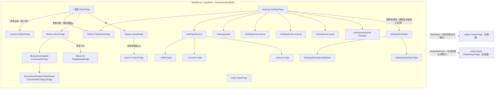

證據：`home_page.dart:203`（explore）、`:672`（history）、`:353`/`:415`（library）、`:1029`（queue）；`queue_page.dart:355`；`settings_page.dart:76,108,172`；`settings_about.dart:95-111`（開發者選項，`developerOptions.isEnabled` 為執行期狀態）；`library_page.dart:64`；`downloaded_page.dart:297`；`playlist_grid_card.dart:57`；`mini_player.dart:58`；`radio_mini_player.dart:44`。

不經路由開啟的全螢幕／半屏介面：`showModalBottomSheet` 16 處、`showDialog` 分布在 13 個檔案，包括歌詞搜尋（`lib/ui/pages/lyrics/lyrics_search_sheet.dart`，`lib/ui/pages/lyrics/` 只有這一個檔）、匯入歌單預覽（`import_preview_page.dart:33` 定義的是 `ImportPreviewDialog`，**不一致**：檔名叫 page，實際是 dialog；`settings_backup.dart:113` 另有同名私有類別 `_ImportPreviewDialog`）、加入歌單、快捷鍵錄製。

**沒有歌詞頁路由。** 歌詞只以兩種形式出現：播放頁內的一欄（`resolvePlayerLayout` 的 `wideSplit`，`player_page.dart:76-86`），和桌面的獨立浮動視窗（`lib/ui/windows/lyrics_window.dart`，`desktop_multi_window` 開的另一個 engine，入口 `lyricsWindowMain`）。

**播放頁沒有路由層的防呆。** 進入點只有 MiniPlayer，而 MiniPlayer 在 `currentTrack == null` 時回傳 `SizedBox.shrink()`（`mini_player.dart:26-29`）；`PlayerPage` 本身接受 `currentTrack` 為 null。直接 `context.push('/player')` 會進入一個空的播放頁（程式碼推論，未實測）。

### 1.2 導航殼：手機 vs 桌面

`AppShell`（`lib/ui/app_shell.dart`）包 `ResponsiveScaffold`（`lib/ui/layouts/responsive_scaffold.dart`，624 行），6 個固定分頁：首頁、搜尋、佇列、音樂庫、電台、設定（`responsive_scaffold.dart:47-84`）。

| 視窗級距 | 版面 | 程式碼 |
|----------|------|--------|
| compact（< 600dp） | `Scaffold` 底部 `NavigationBar`；MiniPlayer 疊在導航列上方 | `_CompactLayout`，`:149-189` |
| medium（600–839dp） | 左側收合 `NavigationRail`（`scrollable: true`、`labelType: all`）+ 內容；MiniPlayer 在 `bottomNavigationBar` | `_MediumLayout`，`:192-223`；`CollapsedNavRail` `:238-290` |
| expanded 以上（≥ 840dp） | 可展開的導航軌（72 ↔ 256dp）+ 內容 + 有目前曲目時右側 Detail Panel（預設 412dp、可拖寬，上限視窗 40%） | `_ExpandedLayout`，`:293-608`；尺寸在 `lib/core/constants/app_layout.dart` |

三種版面的 MiniPlayer 都掛在 `Scaffold.bottomNavigationBar`（`:168`、`:220`、`:368`），所以在桌面上它橫跨整個視窗寬度，導航軌下方那一段也算在內（見 `windows-home.png` 左下角）。

`/explore`、`/history` 不是導航分頁，`navIndexForLocation()` 把它們一律對到 index 0 首頁（`:93-100`）。從設定頁進播放歷史時，導航列亮的是「首頁」而不是「設定」（程式碼推論；Android 實機上從首頁進入時亮首頁，見 `android-history.png`）。

Windows 另有自繪標題列 `CustomTitleBar`（`lib/ui/widgets/app_bars/custom_title_bar.dart`，36dp），只在 `Platform.isWindows` 分支掛上（`lib/app.dart:181-188`）；非 Windows 走 `SafeArea`。

## 2. 響應式斷點

定義在 `lib/core/constants/breakpoints.dart:15` 的 `enum WindowClass`：

| 級距 | 下界（dp） | 程式碼中的用途 |
|------|-----------:|----------------|
| compact | 0 | 底部導航；MiniPlayer 音量改成彈出直式滑桿（`mini_player_volume_control.dart:36-81`） |
| medium | 600 | 收合導航軌 |
| expanded | 840 | 可展開導航軌 + Detail Panel；播放頁開始可用兩欄 |
| large | 1200 | 註解寫「可收合導覽軌 + fixed pane」，但 `ResponsiveScaffold` 對 expanded 以上走同一個 `_ExpandedLayout`，**沒有看到 large 專屬的分支**（**不一致**：註解主張與程式碼） |
| extraLarge | 1600 | 同上，無專屬分支 |

數值取自 Material 3 / `androidx.window` 的 `WindowSizeClass`（檔頭註解）。同檔另有 `columnsFor(containerWidth)`（`_idealColumnWidth = 400`、最多 3 欄），用來算容器內欄數，與視窗級距刻意分開。

播放頁版面另外看高度（`player_page.dart:76-86`）：寬 ≥ 840dp 且高 ≥ 520dp（`AppLayout.playerWideMinHeight`）才走兩欄；有歌詞時 `wideSplit`、沒有時 `wideSingle`；高度不足且橫向時 `shortSplit`，其餘 `narrow`。

不走 `WindowClass` 的硬編碼寬度判斷 3 處：`account_management_page.dart:357`（`maxWidth < 520`）、`color_palette_button.dart:179-180`（320 / 360）、`lyrics_style_dialog.dart:166-167`（400 / 360）。都是對話框邊距或按鈕換行的局部判斷，數值與斷點不對齊。

### 手機與桌面的差異清單

| 面向 | Android（compact） | Windows（預設 1280×800 → expanded） |
|------|--------------------|------------------------------------|
| 導航 | 底部 `NavigationBar` | 左側導航軌（可展開到 256dp） |
| 目前曲目資訊 | 只有 MiniPlayer | MiniPlayer + 右側 Detail Panel（封面、統計、下一首、簡介、評論） |
| MiniPlayer 尾端控制 | 無 | 音訊輸出裝置選擇器 + 音量（`isDesktopPlatform`，`mini_player.dart:96`） |
| 標題列 | 系統狀態列 | 自繪 `CustomTitleBar` |
| 播放頁 | narrow | wideSingle / wideSplit；頂列多出輸出裝置與音量（`player_page.dart:276,283`） |
| 橫向捲動區 | 觸控拖曳 | 額外支援滑鼠拖曳與滾輪（`horizontal_scroll_section.dart:51`） |
| 歌詞 | 播放頁內 | 播放頁內 + 桌面浮動歌詞視窗 |
| 字型清單 | sans-serif 系列 | Microsoft YaHei UI、SimSun 等（`app_theme.dart:71,97`） |
| 全域快捷鍵 | 無 | `hotkey_manager` 系統級熱鍵（§ 5.3） |

`isDesktopPlatform` 判斷 Windows、macOS、Linux 三者（`lib/core/utils/platform_utils.dart`），但專案只出 Android 與 Windows。

## 3. 主題與設計 token

### 3.1 token 在哪裡

`lib/ui/theme/` 只有兩個檔：

- `app_theme.dart`（223 行）：`ThemeData` 組裝（`useMaterial3: true`，`:126`）、從種子色產生 `ColorScheme`、`cardTheme` 用 `AppRadius.borderRadiusLg`（`:143-145`）、`listTileTheme` 用 `borderRadiusMd`（`:150-151`）、`navigationBarTheme`、字型清單與 fallback（`textTheme` 只套 `fontFamilyFallback`，`:204`，**沒有自訂字級**）。
- `theme_preset_colors.dart`（45 行）：預設紫 `Color(0xFF6750A4)` 與 9 組預設主題色。

間距以外的 token 實際放在 `lib/core/constants/ui_constants.dart`（217 行）：

| token | 值 |
|-------|----|
| `AppRadius` | xs 2、sm 4、md 8、lg 12、xl 16、pill 28、sheet 20（另有預建 `borderRadiusXs…Pill`） |
| `AnimationDurations` | fastest 100、fast 150、medium 200、normal 300、slow 500、loop 1600 ms |
| `AppSizes` | playerMainButton 80、thumbnail 40 / 48 / 56、cardAspectRatio 0.8、maxBottomSheetHeight 800 |
| `ImageTargetSizes` | 32 / 56 / 120 / 200 / 460 / 480（圖片載入檔位，#107） |
| `ToastDurations` / `DebounceDurations` | 1500 / 3000 ms；300 / 500 ms |

版面尺寸在 `lib/core/constants/app_layout.dart`（`railCollapsed 72`、`railExpanded 256`、`detailPanelMin 320`、`detailPanelDefault 412`、`paneSpacer 24`、`playerCoverMax 420`、`playerContentMaxWide 720` 等）。

**沒有間距 token**：`grep -rn AppSpacing lib` 零命中，也沒有其他間距常數類別。**沒有字級 token**：字級全靠 `Theme.of(context).textTheme` 的 M3 預設樣式或字面數字。

### 3.2 硬編碼統計（`lib/ui/`，排除 `lib/ui/theme/` 與 `*.g.dart`）

數字由 Python 全文掃描（跨行建構子也算）取得；單行 `grep -rhoE` 抽查結果在括號內，差異來自跨行寫法。

| 模式 | 次數 | 最常見的值 |
|------|-----:|-----------|
| `EdgeInsets.all(數字)` | 68 | 16（23）、12（11）、8（9）、24（7）、32（6） |
| `EdgeInsets.symmetric(` / `.only(` / `.fromLTRB(` | 98 / 47 / 39 | — |
| `SizedBox(height: 數字)` | 263（單行 191） | 16（73）、8（46）、20（32）、12（32）、2（16） |
| `SizedBox(width: 數字)` | 251 | 8（83）、12（26）、16（24）、4（24）、20（11） |
| `fontSize:` 字面數字 | 29 | 12（8）、13（6）、14（4）、11（3）、10（3） |
| `Color(0x…)` | 10（含 theme 目錄 19） | 集中在 `color_palette_button.dart`（7）、`account_management_page.dart`（3） |
| `Colors.xxx` | 81 | transparent（23）、white（21）、black（12）、red（8）、white70（4） |
| `BorderRadius.circular(…)` | 6 | 3 處傳參數、2 處字面 8、1 處用 `AppRadius` |

token 使用量：

| token | `lib/ui/` 內引用 |
|-------|----------------:|
| `AppRadius.*` | 106–111（`borderRadiusLg` 33、`Md` 26、`Sm` 23、`Xs` 12） |
| `AnimationDurations.*` | 36（對比字面 `Duration(milliseconds: N)` 只剩 2 處） |
| `Theme.of(context).textTheme` | 142 |
| `Theme.of(context).colorScheme` | 205 |
| `AppSpacing.*` | 0（不存在） |

結論：圓角、動畫時長、色彩已經收斂到 token 或主題；**間距與字級沒有 token**，間距完全是字面數字（`EdgeInsets` 250 餘處、`SizedBox` 500 餘處），值集中在 4 / 8 / 12 / 16 / 20 / 24 / 32，事實上是一套 4 的倍數系統但沒有被命名。`fontSize:` 的 29 處繞過了 `textTheme`，會跟使用者字級設定脫鉤（**推測**，未逐處確認是否另乘 `textScaler`）。

## 4. i18n

- 語言：`lib/i18n/` 下 `zh-CN`、`zh-TW`、`en` 三個資料夾，各 38 個 namespace 檔（`*.i18n.json`）。產物 `strings*.g.dart` 已 gitignore。
- slang 設定（`slang.yaml`）：`base_locale: zh-CN`、`namespaces: true`、`input_file_pattern: .i18n.json`、`lazy: false`（註解說明 Android / Windows 不支援 deferred loading）。
- key 數量（Python 遞迴數葉節點）：三語言各 **1176** 個，彼此缺漏 0、多出 0。
- 同值檢查：`en` 值含中文字元 0 個；`zh-TW` 與 `zh-CN` 字面完全相同且含中文的 153 個（例如 `account.logout`、`audioSettings.qualityLevel.high`）。**推測**大多是繁簡同形字（如「登出」「高」），不一定是漏翻；沒有逐條確認。
- 語言選擇：設定 → 外觀 → 語言，四選一：跟隨系統（`null`，走 `useDeviceLocaleSync()`）、简体中文、繁體中文、English（`lib/providers/settings/locale_provider.dart`、`settings_appearance.dart:422-460`）。實機上 Android（系統 en-US）顯示英文、Windows（系統繁中）顯示繁中，兩者都是「跟隨系統」。
- 複數：英文字串用 `"$n tracks"`（`lib/i18n/en/library.i18n.json:4`），沒有用 slang 的 plural，實機出現「**1 tracks**」（`android-library.png`、`android-home-scrolled.png`）。
- 數字格式：中文萬／億一律 `toStringAsFixed(1)`（`lib/core/utils/number_format_utils.dart:28-37`），所以出現「**4600.0萬**」「1100.0萬」（`windows-home.png`）；英文走 K / M / B，「46.0M」同樣帶多餘的 `.0`。

### UI 中的硬編碼字串

中文字面值（排除 `//`、`///` 註解行）38 處，扣掉 1 處 RegExp（`fmp_audio_device_selector.dart:105`）後 37 處使用者可見：

- `lib/ui/windows/lyrics_window.dart:33-66`：33 處**簡體**預設字串（`'等待歌词...'`、`'暂无歌词'`、`'上一首'`…）。註解寫「從主視窗同步」，同步到之前或失敗時，英文與繁中使用者會看到簡體。
- `lib/ui/pages/settings/developer_options_page.dart:307`：`'Flutter 图片: …'`，簡體、未走 i18n。
- `lib/ui/startup_failure_app.dart:66,73,77,81`：啟動失敗畫面的中英雙語字串。註解說明這是刻意的（此時 i18n 與 Riverpod 可能正是故障源），屬合理例外。

英文字面值 5 處：`'FMP'`（`startup_failure_app.dart:35`）、`'URL'` ×2（`import_playlist_dialog.dart:220`、`add_radio_dialog.dart:94`）、`'Info+'` / `'Warning+'`（`log_viewer_page.dart:209,212`）。前三個是專有名詞，後兩個是漏走 i18n。

## 5. 無障礙與桌面鍵盤操作

### 5.1 語意與 tooltip（程式碼）

| 項目 | 次數 |
|------|-----:|
| `Semantics(` | 12（6 檔） |
| `ExcludeSemantics(` | 2 |
| `MergeSemantics` / `semanticLabel` | 0 / 0 |
| `tooltip:` | 120（41 檔） |
| `Tooltip(` | 14 |
| `IconButton` 有 `tooltip:` | 97 / 98（例外 `lyrics_title_bar.dart:212` 以外層 `Semantics` 補上） |

`lyrics_title_bar.dart` 的自訂參數叫 `semanticsLabel`（多一個 s，`:122-224` 共 12 處），不是框架的 `semanticLabel`。

### 5.2 實機觀察到的語意問題

- **播放頁的大播放鍵沒有無障礙名稱。** Windows MSAA 樹中它是 `[push button] '' @(1860,1480 120x120)`，旁邊的上一首、下一首都有名字。`PlayerPlayPauseButton` 把 `FilledButton` 包在 `Tooltip` 裡（`player_play_pause_button.dart:46-48`），按鈕本身沒有 label；Tooltip 的訊息沒有進到這個節點。
- **MiniPlayer 是「按鈕裡包按鈕」。** MSAA 樹裡 `'開啟播放器'` 是整條 1904×97 的 push button，隨機播放、上一首、播放等按鈕是它的子節點（`mini_player.dart:54-58` 的 `Semantics(button: true)` 包 `GestureDetector`）。讀屏會先念整條再念子按鈕；以此節點中心點擊，在窄視窗時會點到播放鍵（本次審計因此誤觸發播放，見 § 6.0）。
- Android 的曲目列在 uiautomator 裡角色是 `ImageView`，文字是整列合併（`'1\n“世事起伏多折…\n早睡起大王\n2.1M'`），名次、標題、作者、播放數擠成一個節點。
- Windows MSAA 樹健康：首頁 133 個節點，run log 沒有 `Failed to update ui::AXTree`。

### 5.3 鍵盤

程式碼：Flutter 的快捷鍵框架**完全沒用**：`Shortcuts(`、`Actions(`（排除類別名尾碼的誤配後）、`CallbackShortcuts`、`LogicalKeySet`、`SingleActivator`、`FocusTraversalGroup`、`RawKeyboardListener`、`HardwareKeyboard` 都是 0。唯一的 `KeyboardListener` 在快捷鍵錄製對話框（`settings_desktop.dart:439`）。`autofocus` 7 處，全在對話框或搜尋框。App 內沒有任何快捷鍵（沒有空白鍵播放、沒有 Esc 返回、沒有 Ctrl+F 搜尋）。

全域熱鍵：`hotkey_manager`，`HotKeyScope.system`（`lib/data/models/hotkey_config.dart:78`），預設值（`:212` `HotkeyConfig.defaults()`）：

| 動作 | 預設 |
|------|------|
| 播放／暫停 | Ctrl+Alt+Space |
| 下一首／上一首 | Ctrl+Alt+→ ／ Ctrl+Alt+← |
| 停止 | Ctrl+Alt+S |
| 音量＋／－ | Ctrl+Alt+↑ ／ Ctrl+Alt+↓ |
| 靜音 | Ctrl+Alt+M |
| 顯示／隱藏視窗 | Ctrl+Alt+W |

`Settings.enableGlobalHotkeys` 預設 `false`（`lib/data/models/settings.dart:292`）；服務先以 `enableHotkeys: false` 初始化（`lib/providers/system/windows_desktop_provider.dart:42`），再依設定同步。

Windows 實測（1904×1191 視窗，繁中）：

| 操作 | 結果 | 證據 |
|------|------|------|
| Tab（第 1 次） | 焦點到「查看全部」，按鈕出現淡色底 | scratchpad `w_tab1.png` |
| Tab ×4 | 焦點到排行榜第 2 列，整列淡灰底；**第 1 列沒有看到被聚焦**（**推測**第 2、3 次 Tab 停在第 1 列本身與其選單鈕） | `windows-focus-row.png` |
| Tab ×14 | 仍在首頁排行榜（YouTube 第 2 列），焦點依文件順序逐列前進；要走到導航軌、Detail Panel、MiniPlayer 需要穿過整個清單 | scratchpad `w_tab14.png` |
| Shift+Tab 從頭倒退 | 依序到導航軌的「設定」「電台」「音樂庫」，每項是很淡的圓角底 | `windows-focus-rail.png` |
| 焦點在「音樂庫」按 Enter | 切到音樂庫頁 | `windows-library.png` |
| 播放頁 Esc | 第 1 次關掉右上角溢出選單；第 2 次**無作用**，停在播放頁 | scratchpad `w_escgrid.png` |
| Ctrl+Alt+W（`SendKeys`） | 視窗可見性沒變（`IsWindowVisible` 前後皆 true）。log 有 `Hotkeys registered`，但使用者可能改過綁定（`Settings.hotkeyConfig`，沒有讀取），也可能是合成按鍵沒被 `RegisterHotKey` 接到。**未能確認** | run log |

焦點指示是 M3 預設的狀態層（淡色底），在深色主題下對比很低，沒有焦點框。空白鍵播放沒有實測：程式碼裡沒有對應的快捷鍵，而實測會觸發真實播放。

## 6. 實機截圖與問題清單

### 6.0 執行方式與資料

- Android：AVD `Medium_Phone`（1080×2400 @ 420dpi → 411×914dp，compact），`flutter run --profile -d emulator-5554`，系統語言 en-US，淺色主題。App 資料是 emulator 內既有的測試資料。
- Windows：`flutter run --profile -d windows`，系統繁中，深色主題（跟隨系統），1904×1191 client px @ 150%（≈1269×794dp，expanded）；另把視窗縮到 600px 寬（≈390dp，compact）看窄版。
- **Windows 的 debug / profile build 讀使用者真實的 App 資料**：資料庫在 `getApplicationDocumentsDirectory()` 下的 `FMP/`（`lib/data/database/database_provider.dart:49-52`），Windows 上就是使用者的「文件」資料夾，log 在 `Documents\FMP\logs`（`lib/core/log_file_sink.dart:25-27`）。沒有開發用的資料目錄開關。因此 Windows 截圖的 Detail Panel、MiniPlayer、佇列、搜尋紀錄、歌單名稱、播放頁封面與標題都已模糊。
- Android 的使用者歌單名稱與搜尋紀錄已塗灰，播放歷史列表已模糊；歌單詳情頁顯示了匯入歌單的擁有者名稱，所以沒有放進 repo。
- **副作用**：在 Windows 窄視窗點 MiniPlayer 的「開啟播放器」節點中心時，點到的是播放鍵，使用者目前的佇列曲目開始播放（從真實音源串流），隨即按暫停。這會在真實資料庫留下播放位置，**可能**也寫入一筆播放歷史。
- 播放頁（Android）無法進入：emulator 佇列是空的，MiniPlayer 不顯示。`references/runtime-state.md` 的離線做法要用 `ext.isar.editProperty` 改資料庫並放一個本地 WAV，`ext.isar` 只在 debug build 有，而且會改動資料，本次沒做。Windows 有使用者既有的目前曲目，可以不播放就打開播放頁。
- 歌詞：沒有獨立頁面；Windows 播放頁的目前曲目沒有歌詞（走 `wideSingle`），浮動歌詞視窗沒有開。

### 6.1 Android（Medium_Phone，英文，淺色）

| 首頁 | 首頁（下捲） | 探索 |
|---|---|---|
| 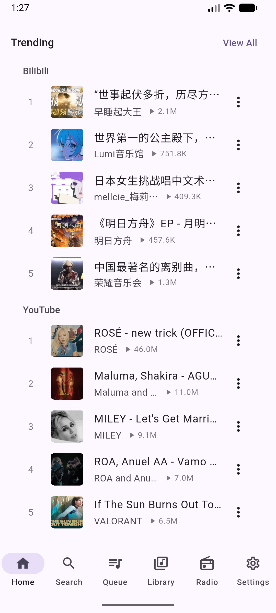 | 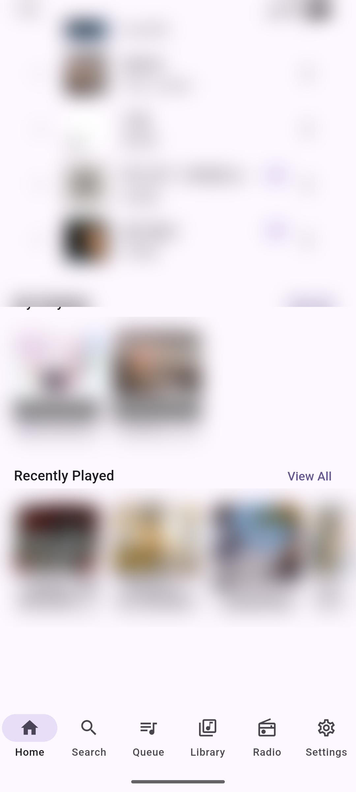 | 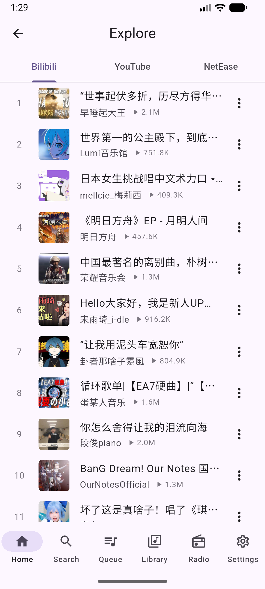 |

| 搜尋（空狀態） | 佇列（空） | 音樂庫 |
|---|---|---|
| 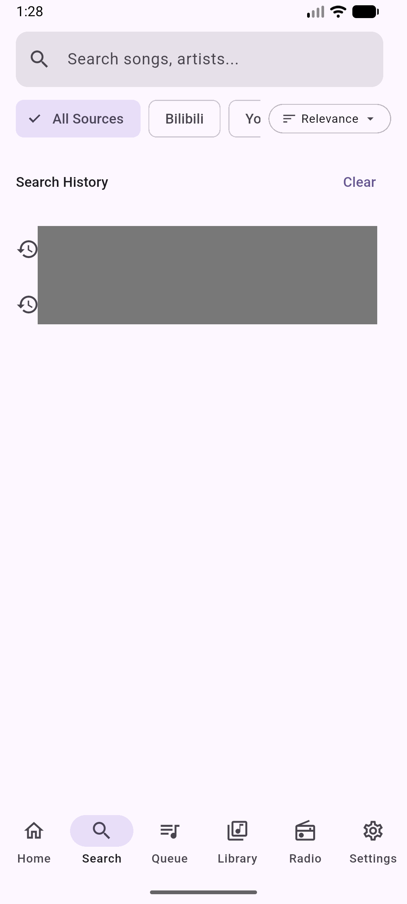 | 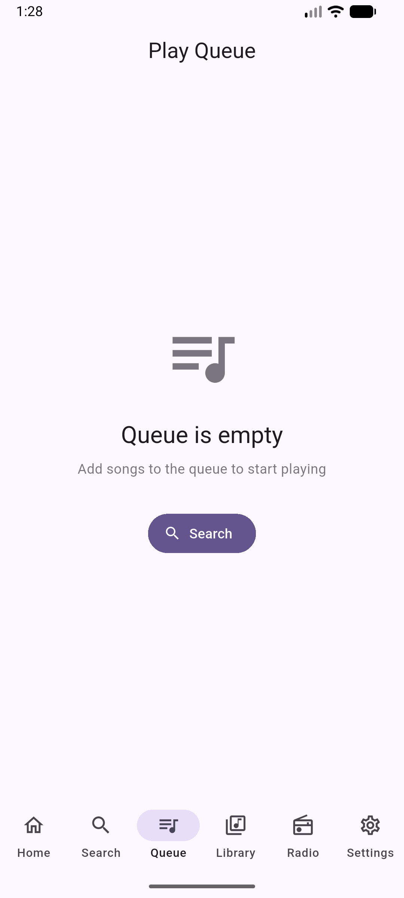 | 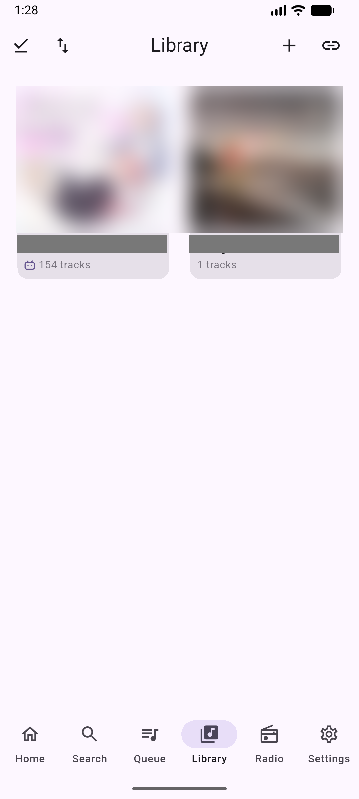 |

| 電台（空） | 設定 | 設定（下捲） | 播放歷史 |
|---|---|---|---|
| 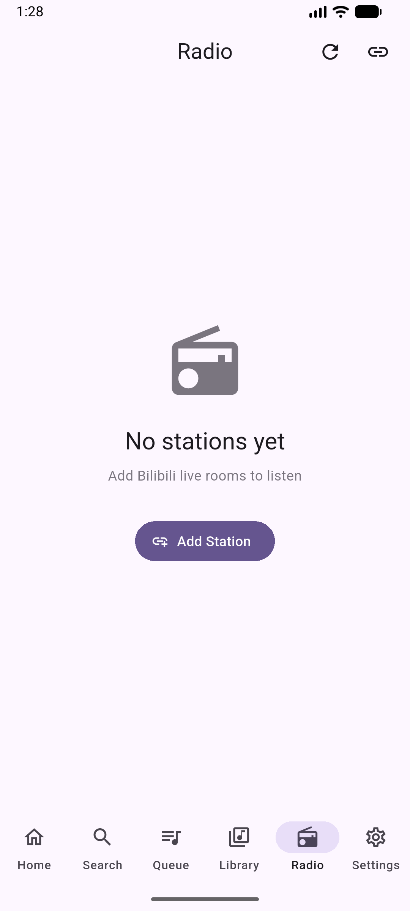 | 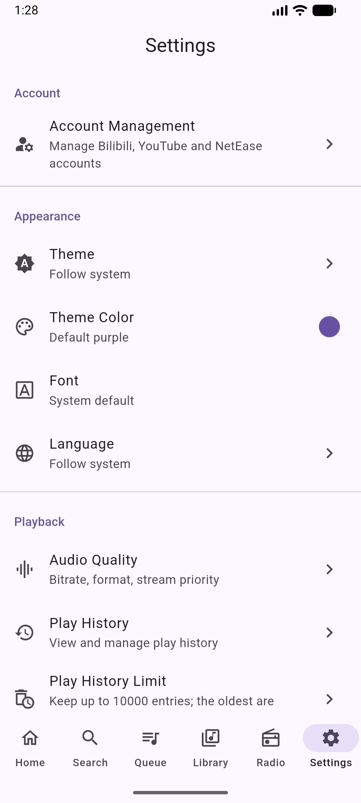 | 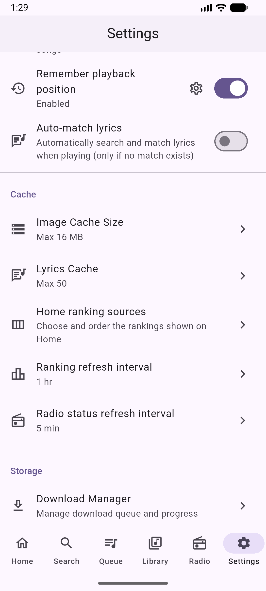 | 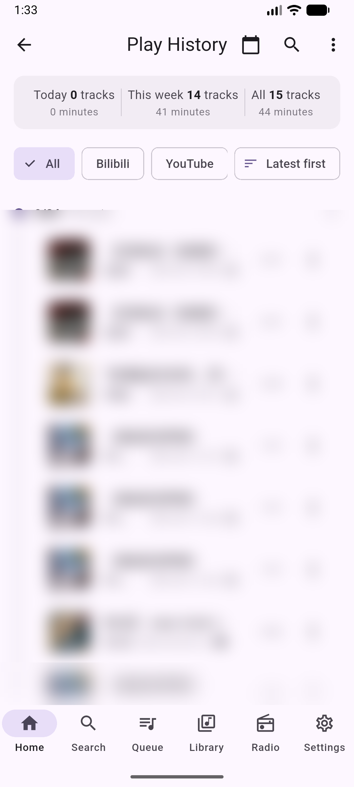 |

觀察：

1. **首頁沒有標題列，其他分頁都有。** 首頁從區塊標題「Trending」開始（靠左）；搜尋頁以搜尋框當頂部；佇列、音樂庫、電台、設定各有置中的 AppBar 標題。一級分頁的頂部形式有三種（`android-home.png`、`android-search.png`、`android-settings.png`）。
2. **同一個排行榜列在首頁與探索頁的右側留白不同。** 首頁的 ⋮ 在 x=933（1080 寬）、探索頁在 x=975（uiautomator 座標）；首頁列右側多留約 40px，也跟區塊標題的「View All」不對齊。
3. **「1 tracks」**：英文沒有處理複數（首頁「My Playlists」卡片、音樂庫卡片）。
4. **搜尋頁來源篩選列被排序鈕蓋住。** 「All Sources / Bilibili / Yo…」橫向捲動，右端被固定的「Relevance」下拉鈕截斷，「NetEase Cloud Music」完全看不到，沒有漸層或箭頭提示還能捲（`android-search.png`；`search_page.dart:169-183` 的 `SingleChildScrollView` + 右側 `_buildSortButton`）。
5. **設定列尾端的提示不一致。** 「Theme」「Language」有 `>`、「Theme Color」是色點、「Font」什麼都沒有；「Font」同樣是點了開選擇對話框（`settings_appearance.dart:308-313` 的 `onTap: _showFontDialog`），只是沒有 `>`（`android-settings.png`）。
6. **設定是單一長清單。** Android 7 段（帳號、外觀、播放、快取、儲存、資料備份、關於；`settings_page.dart:68-164`），Windows 多一段「桌面」（`:153-162`），手機上要捲約 4 個畫面才到底；段落之間只有細分隔線與小標題（`android-settings-scrolled.png`）。
7. 空狀態（佇列、電台）版式一致：大圖示 + 標題 + 說明 + 主要按鈕，品質良好。
8. 播放歷史頁頂部有統計卡、篩選列、日期群組，資訊密度高；右上三個動作（日期、搜尋、更多）加置中標題，在 411dp 寬時標題與按鈕貼得很近（`android-history.png`）。

### 6.2 Windows（繁中，深色，1269×794dp）

| 首頁 | 音樂庫 |
|---|---|
| 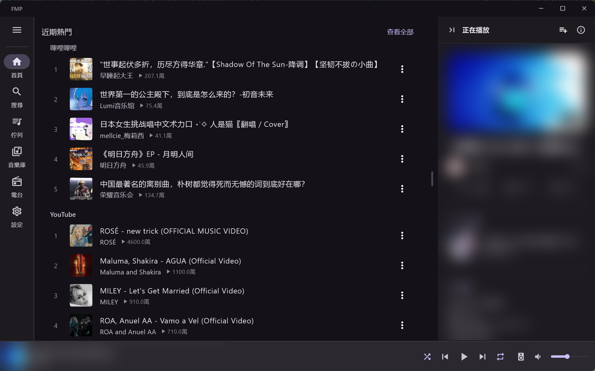 | 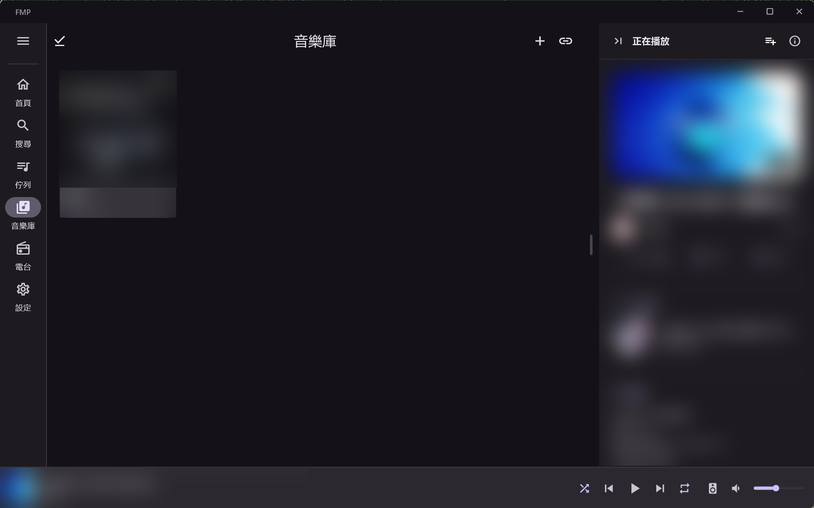 |

| 設定 | 搜尋（空狀態） |
|---|---|
| 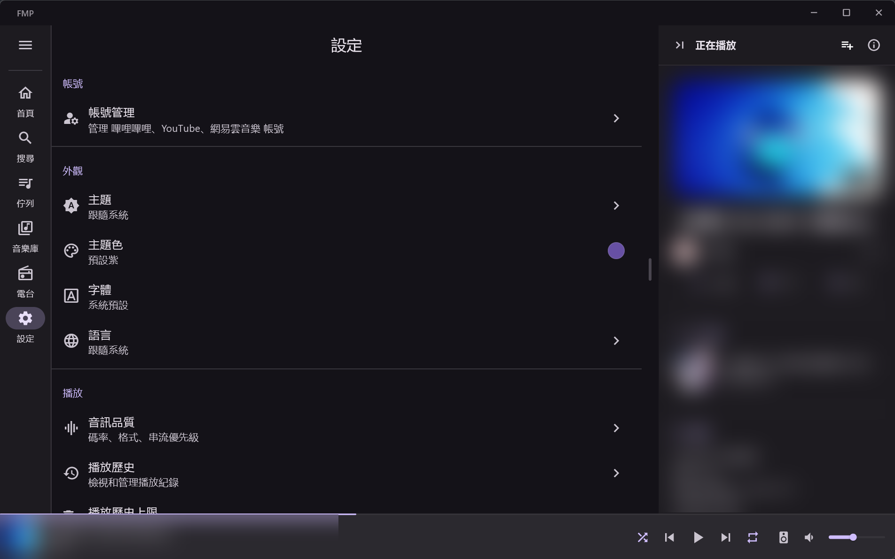 | 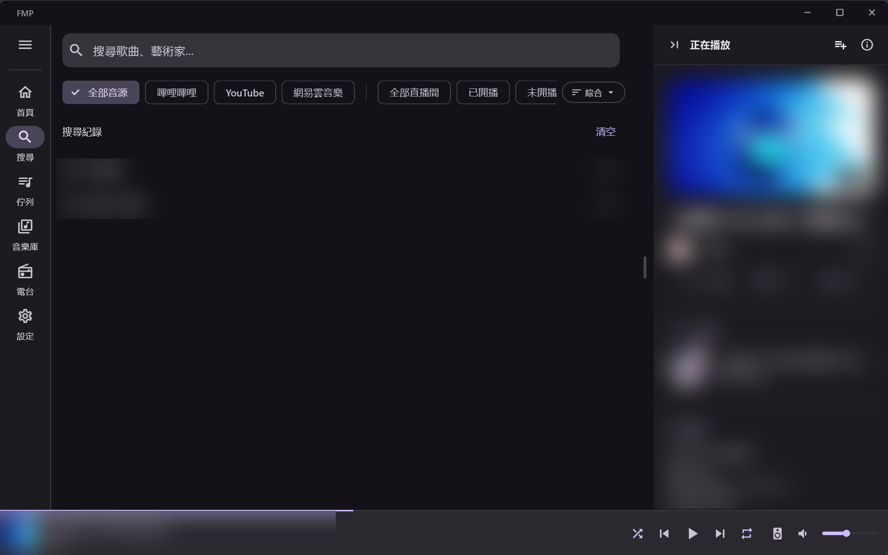 |

| 佇列 | 播放頁（wideSingle） |
|---|---|
| 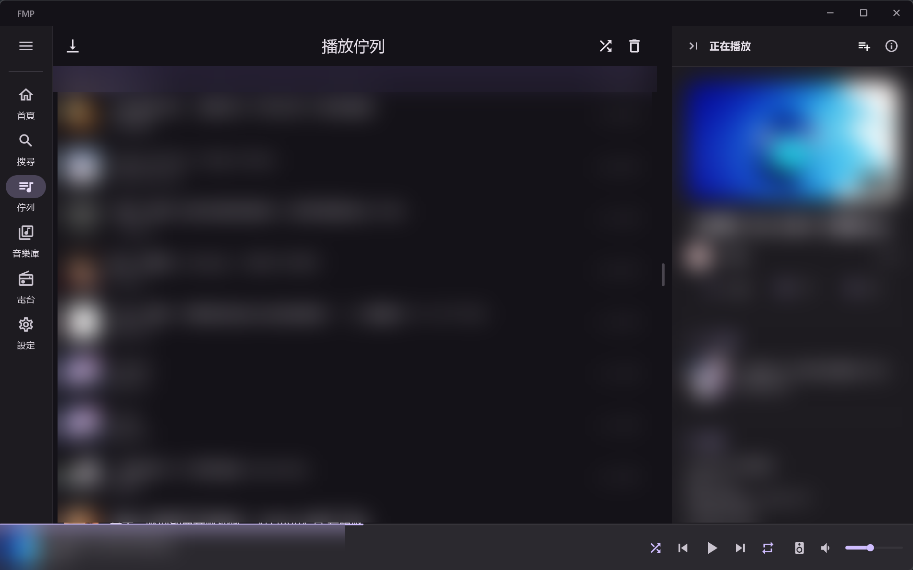 | 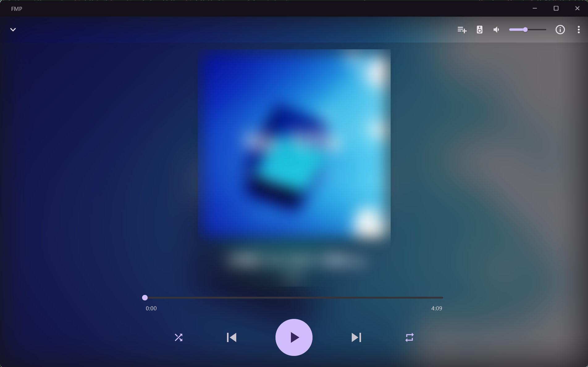 |

| 播放頁溢出選單 | 焦點：排行榜列 | 焦點：導航軌 |
|---|---|---|
| 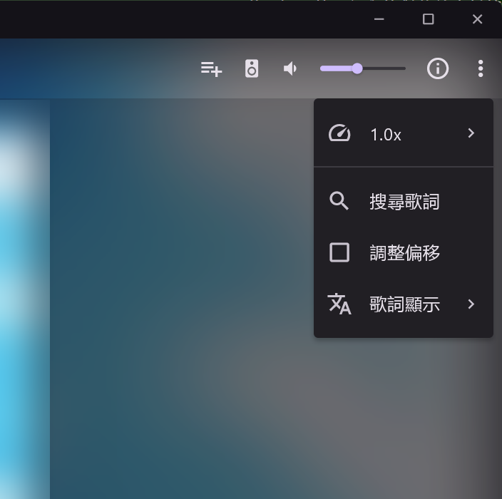 |  |  |

窄視窗（600px ≈ 390dp，compact）：

| 首頁 | 播放頁（narrow） |
|---|---|
|  | 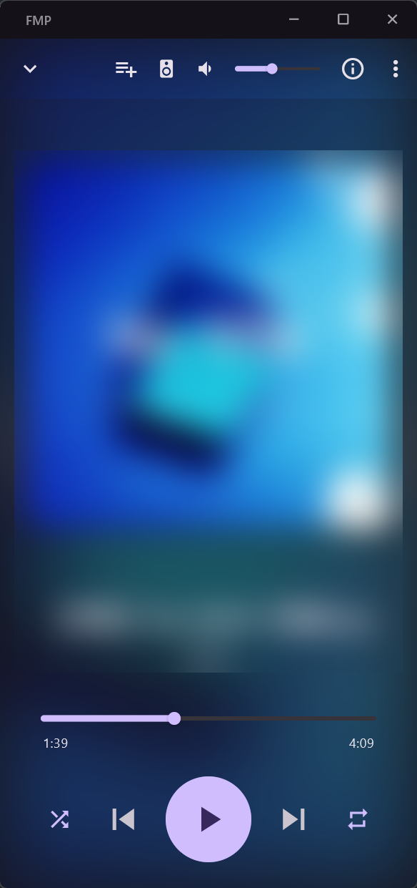 |

觀察：

1. **播放數格式「4600.0萬」「1100.0萬」**（`windows-home.png`），來自 `number_format_utils.dart:35` 固定一位小數。
2. **桌面 MiniPlayer 在寬視窗中段大片空白。** 標題在左端約 360px 處結束，控制鈕從約 1350px 開始，中間約 1000px 沒有內容（`windows-home.png` 底部）；進度條是頂端一條細線，沒有時間標示。
3. **窄桌面視窗的 MiniPlayer 只剩 2 個字的標題。** compact 寬度下桌面仍放 7 顆控制鈕（隨機、上一首、播放、下一首、循環、輸出裝置、音量），標題被擠成「【早…」（`windows-compact-home.png`，模糊前為「【早...」）。手機版沒有後兩顆，所以這是桌面 compact 專屬問題（`mini_player.dart:96`、`mini_player_volume_control.dart:36-81` 只把音量改成彈出式，沒有收起按鈕）。
4. **搜尋頁篩選列同樣被排序鈕截斷**：「全部音源 / 嗶哩嗶哩 / YouTube / 網易雲音樂 | 全部直播間 / 已開播 / 未開播」，「未開播」被「綜合」下拉鈕蓋住一半（`windows-search.png`）。在 1269dp 的視窗、內容區約 785dp 時仍放不下。
5. **Detail Panel 常駐。** 有目前曲目時所有分頁右側都固定 412dp 的「正在播放」面板，設定、搜尋這類與播放無關的頁面內容區因此只剩約 60%（`windows-settings.png`、`windows-search.png`）；面板可收起（`收起面板` 按鈕）。
6. **設定頁在寬螢幕上仍是單欄長清單**（8 段），內容區約 785dp 寬，每列右端的 `>` 離文字很遠；尾端提示的不一致同 Android（「字體」沒有 `>`）。
7. **播放頁頂列擠在右上角**：加入歌單、輸出裝置、靜音、音量滑桿、資訊、更多共 6 個元件排在右側，左側只有收起鈕（`windows-player.png`、`windows-compact-player.png`）。wideSingle 下封面與控制列置中，背景模糊色塊在右半部偏灰，左右不對稱（**推測**是封面取色的漸層，非錯誤）。
8. **播放頁溢出選單把開關和指令混在同一欄圖示裡。** 「調整偏移」是開關，用 `check_box_outline_blank` / `check_box` 當前導圖示（`player_page.dart:344-353`），同一欄的其他項目（播放速度、搜尋歌詞、歌詞顯示）是一般圖示，視覺上像一個孤立的核取方塊（`windows-player-menu.png`）。
9. 焦點指示對比低（§ 5.3）；排行榜列聚焦時是淡灰底、導航軌是極淡的圓角底，在深色主題下幾乎看不出來（`windows-focus-row.png`、`windows-focus-rail.png`）。
10. 首頁在寬視窗下排行榜列橫跨整個內容區（約 1208px），標題一行放完，但三個音源依序往下排，沒有利用寬度並排；`columnsFor()` 以內容區寬度算欄數，785dp / 400 → 1 欄（`breakpoints.dart` 的 `columnsFor`，程式碼推論）。
11. Windows 內容區右側的捲軸常駐顯示在內容與 Detail Panel 的交界（`windows-home.png` x≈1383），位置在內容區中段，看起來像分隔線。

### 6.3 跨平台一致性

- 主題、元件（M3 `NavigationBar` / `NavigationRail`、`ChoiceChip`、`ListTile`）兩平台共用，圓角與色彩一致。
- 手機底部導航的「Queue」是一級分頁，桌面也是；同時桌面 Detail Panel 又顯示「下一首」。佇列有兩個入口，資訊重複。
- 語言是逐平台跟隨系統，所以兩平台實機看到的是不同語言；翻譯齊全，但簡繁混排的來源資料（標題、作者）不受 App 語言影響（例如 Windows 繁中介面下的「嗶哩嗶哩」區塊全是簡體標題）。這是資料本身，不是 i18n 缺漏。

## 7. 問題總表（依影響排序）

| # | 問題 | 平台 | 證據 |
|---|------|------|------|
| 1 | 播放頁大播放鍵沒有無障礙名稱 | 兩者（Windows 實測） | MSAA `[push button] ''`；`player_play_pause_button.dart:46-48` |
| 2 | App 內沒有任何鍵盤快捷鍵；Esc 無法離開播放頁 | Windows | § 5.3；`Shortcuts`/`Actions` 使用數 0 |
| 3 | 窄桌面視窗的 MiniPlayer 標題被擠到 2 個字 | Windows compact | `windows-compact-home.png`；`mini_player.dart:96` |
| 4 | 搜尋篩選列被排序鈕截斷，且沒有可捲動提示 | 兩者 | `android-search.png`、`windows-search.png`；`search_page.dart:169-183` |
| 5 | 間距與字級沒有 token；`EdgeInsets` 250 餘處、`SizedBox` 500 餘處字面數字，29 處 `fontSize:` 繞過 `textTheme` | 程式碼 | § 3.2 |
| 6 | 「4600.0萬」「46.0M」數字格式、「1 tracks」複數 | 兩者 | `number_format_utils.dart:28-37`；`en/library.i18n.json:4` |
| 7 | MiniPlayer 語意是按鈕包按鈕；以它的中心點擊會誤觸播放 | Windows 實測 | MSAA `'開啟播放器'` 含子按鈕；`mini_player.dart:54-58` |
| 8 | 焦點指示在深色主題下幾乎看不見；Tab 要穿過整個清單才到導航軌 | Windows | `windows-focus-row.png`、`windows-focus-rail.png` |
| 9 | 桌面浮動歌詞視窗的 33 個預設字串是簡體硬編碼 | Windows | `lyrics_window.dart:33-66` |
| 10 | Windows 開發版讀寫使用者真實資料（`Documents\FMP`），沒有隔離開關 | Windows | `database_provider.dart:49-52` |
| 11 | 設定列尾端提示不一致；設定是 7–8 段單欄長清單 | 兩者 | `android-settings.png`、`windows-settings.png` |
| 12 | `WindowClass.large` / `extraLarge` 註解承諾的版面沒有實作 | 程式碼 | `breakpoints.dart`；`responsive_scaffold.dart:116-145` |

## 8. 建議放進決策清單的項目

- **i18n 語言去留**：三語言 1176 key 完全對齊，維護成本是每次改字要動 3 份。`zh-CN` 是 base locale，但使用者（與 Windows 實機）用繁中。要決定：保留三語言、只留繁中 + 英文，或改 base locale 為 `zh-TW`。另需決定浮動歌詞視窗是否納入 slang。
- **間距／字級 token**：重寫時是否引入間距與字級 token（現況的事實標準是 4 的倍數：4 / 8 / 12 / 16 / 20 / 24 / 32），以及是否用靜態規則擋掉新的字面數字。
- **桌面鍵盤操作的範圍**：要不要做 App 內快捷鍵（空白鍵播放、Esc 返回、Ctrl+F 搜尋）與焦點順序（`FocusTraversalGroup` 把導航軌、內容、MiniPlayer 分組）。
- **Detail Panel 的存在條件**：是否在所有頁面常駐，或只在與播放相關的頁面出現。
- **桌面 compact 的 MiniPlayer**：窄視窗時要收哪些控制鈕。
- **開發資料隔離**：Windows debug / profile build 是否改用獨立資料目錄，避免開發與審計動到使用者真實資料。
- **大斷點**：`large` / `extraLarge` 要做專屬版面，還是把註解改成現況。
